# OpenCode 技术内幕：架构、运行时与工程实现

> **资料性质：非官方。** 本文基于逆向分析与泄露源码整理，与官方实际实现可能不一致，仅供工程参考，不作为产品能力承诺。
> 收录日期：2026-08-17

> 本文档基于 OpenCode 源码（`dev` 分支，版本 `1.17.13`）逐文件研读与设计规格（`CONTEXT.md`、`specs/v2/*`）综合撰写，力求在源码层面还原系统的真实结构、控制流与设计意图。文中大量使用 Mermaid 架构图、流程图、时序图与状态图，以便读者建立整体心智模型。

---

## 目录

- [第一章 项目概览与设计哲学](#第一章-项目概览与设计哲学)
- [第二章 顶层架构与包依赖](#第二章-顶层架构与包依赖)
- [第三章 进程启动与 CLI 命令体系](#第三章-进程启动与-cli-命令体系)
- [第四章 API 契约架构：Schema / Protocol / Server / Client / SDK](#第四章-api-契约架构schemaprotocolserverclientsdk)
- [第五章 配置体系](#第五章-配置体系)
- [第六章 Provider 与模型目录](#第六章-provider-与模型目录)
- [第七章 策略系统](#第七章-策略系统)
- [第八章 插件系统与生命周期](#第八章-插件系统与生命周期)
- [第九章 V2 会话运行时总论](#第九章-v2-会话运行时总论)
- [第十章 系统上下文代数](#第十章-系统上下文代数)
- [第十一章 上下文纪元状态机](#第十一章-上下文纪元状态机)
- [第十二章 持久化提示准入与晋升](#第十二章-持久化提示准入与晋升)
- [第十三章 会话执行路由与运行协调器](#第十三章-会话执行路由与运行协调器)
- [第十四章 会话运行器与 Drain 循环](#第十四章-会话运行器与-drain-循环)
- [第十五章 提供者回合与工具结算](#第十五章-提供者回合与工具结算)
- [第十六章 自动压缩与历史投影](#第十六章-自动压缩与历史投影)
- [第十七章 工具系统与权限](#第十七章-工具系统与权限)
- [第十八章 LLM 包与协议适配器](#第十八章-llm-包与协议适配器)
- [第十九章 MCP / LSP / 技能 / ACP / 命令](#第十九章-mcp-lsp-技能-acp-命令)
- [第二十章 认证、账户、控制面、同步与分享](#第二十章-认证账户控制面同步与分享)
- [第二十一章 存储与事件系统](#第二十一章-存储与事件系统)
- [第二十二章 终端 UI（TUI）](#第二十二章-终端-uitui)
- [第二十三章 桌面应用与跨端 UI](#第二十三章-桌面应用与跨端-ui)
- [第二十四章 云端产品与基础设施](#第二十四章-云端产品与基础设施)
- [第二十五章 可观测性、安全与运维](#第二十五章-可观测性安全与运维)
- [第二十六章 设计演进：从 V1 到 V2](#第二十六章-设计演进从-v1-到-v2)

---

## 第一章 项目概览与设计哲学

### 1.1 OpenCode 是什么

OpenCode 是一个**开源的 AI 编码代理（AI coding agent）**。它既是一个可独立运行的命令行/桌面应用，又是一个可被嵌入到任意宿主进程中的「引擎」。用户在其终端、IDE 或浏览器中向它发出自然语言指令，它会驱动大语言模型（LLM）进行多轮推理，并通过一套受限的**工具系统**（读写文件、执行 Shell、搜索代码、调用 LSP/MCP 等）在用户的真实代码库中完成开发任务。

OpenCode 的核心定位可以概括为三层：

1. **一个 AI 代理运行时**：负责把用户的提示（prompt）与代码库上下文组装成符合各家 Provider 规范的请求，流式接收模型响应，并将模型发出的工具调用安全地执行、有界地投影回会话历史，再驱动下一轮推理，直至任务收敛。
2. **一个可嵌入的会话引擎**：通过严格的 API 契约分层（Schema → Protocol → Server → Client → SDK），同一套领域逻辑既能以独立 HTTP 服务器形式运行，也能以**同进程嵌入式主机（Embedded OpenCode）**形式被任意 TypeScript/JavaScript 程序直接调度，二者共享完全相同的路由、中间件、编解码与错误边界。
3. **一组围绕代理的云端产品**：包括账号与计费控制台（Console）、OpenAI 兼容的 Zen 网关、可自托管的会话分享后端（Enterprise）、统计站点（Stats），以及桌面/网页客户端。

### 1.2 技术栈一览

OpenCode 是一个以 **TypeScript** 为主语言、**Bun** 为运行时与包管理器的 Monorepo，并通过 **Turborepo** 编排构建。其核心运行时大量依赖 **Effect**（一个函数式副作用系统）来组织服务、错误与并发。下表给出关键技术选型：

| 关注点 | 选型 | 说明 |
| --- | --- | --- |
| 运行时 | Bun 1.3.14 | 既是 CLI 默认运行时，也是构建/测试工具；桌面与 CLI 编译产物可降级到 Node |
| 语言 | TypeScript 5.8 | 全仓库强类型；类型检查用 `tsgo`（`@typescript/native-preview`） |
| 函数式核心 | Effect 4.0-beta | 服务容器（`Context.Service`）、`Layer`、`Effect.gen`、`Stream`、`Fiber`、`Schema` |
| 数据库 | SQLite（Drizzle ORM） | 进程内本地持久化，事件溯源（EventV2）；桌面/服务端共用 |
| HTTP 服务器 | Effect `HttpRouter`/`HttpApi`/`HttpServer` | 声明式 API、路由、中间件、SSE；云端边缘函数用 Hono |
| LLM 适配 | AI SDK（`@ai-sdk/*`）+ 原生协议适配 | 同时支持 OpenAI Responses/Completions、Anthropic Messages 与 AI SDK 适配器 |
| 终端 UI | OpenTUI（`@opentui/solid`） | 基于 Solid 的终端渲染框架；TUI 包不依赖后端实现 |
| 跨端 UI | SolidJS + Vite 7 | 桌面、网页共用 `@opencode-ai/app` |
| 桌面 | Electron 42 | 嵌入 Node 服务器为 sidecar；曾为 Tauri，已迁移 |
| 部署 | SST v4 + Cloudflare（home） | AWS（lake/统计）、Cloudflare（站点/Worker/DO） |
| 基础设施即代码 | SST、Planetscale、R2、Upstash | 见第二十四章 |

### 1.3 设计哲学：从「单体」到「容器 + 插件」

OpenCode 正处于一次深刻的架构演进中——从 **V1**（以 `SessionPrompt` 单体为核心的遗留运行时）向 **V2**（位于 `packages/core`、以事件溯源与可重放变换为核心的运行时）迁移。这一演进的设计哲学在 `specs/v2/instructions.md` 中被明确表述，值得在此完整提炼，因为它贯穿全文：

1. **把行为从大型应用服务中迁出，移入插件**。核心服务应当成为「小型、有类型的容器」，只负责持有状态、暴露简单操作、并在需要策略或集成逻辑处触发钩子（hooks）。
2. **`packages/core` 只承载领域 schema、有类型错误、状态容器、事件与插件钩子契约**；Provider 特定、配置特定、认证特定、模型发现与生成行为都由插件实现。
3. **服务可热重载**：更新是细粒度、可观测的，不需要拆除整个进程。
4. **`packages/opencode` 随时间变薄**：UI、服务器路由、CLI、存储胶水与遗留兼容层应当调用核心服务，而非自己拥有领域逻辑。
5. **Effect 风格统一**：`Effect.gen` 做组合，`Effect.fn("Domain.method")` 做公开服务方法，`Effect.fnUntraced` 做小型内部变更，`yield* new ErrorClass(...)` 抛出有类型失败，尽量不用 `any`，无具体持久化或外部消费者需求时不写兼容代码。

这套哲学解释了仓库中随处可见的「容器 + 钩子 + 插件」结构：`Catalog`、`AccountV2`、`AgentV2`、`ProviderV2`、`ModelV2` 等服务都遵循同一形态——顶部定义带 brand 的 ID 与 `Schema.Class`/`Schema.Struct`，定义 `Schema.TaggedErrorClass` 错误，定义一个只含小动词（`get`/`all`/`available`/`default`/`update`/`remove`/`activate`）的 `Interface`，暴露 `Context.Service`，用私有内存状态实现 `layer`，并以 `export * as Name from "./file"` 自导出。

### 1.4 一张图看懂整体

下图勾勒了 OpenCode 作为一个「进程」运行时，各层之间的依赖与数据流向。后续章节会逐层展开。

```mermaid
flowchart TB
    subgraph Host["宿主层（Hosts）"]
        CLI["CLI（opencode/cli）"]
        TUI["TUI（@opencode-ai/tui）"]
        Desktop["桌面（Electron）"]
        WebApp["Web App（@opencode-ai/app）"]
        Embed["嵌入式 SDK（@opencode-ai/sdk-next）"]
    end

    subgraph Engine["引擎层"]
        Server["Server（HTTP/SSE）"]
        Core["Core（@opencode-ai/core）<br/>V2 运行时/服务容器"]
        Legacy["遗留 V1（SessionPrompt）"]
    end

    subgraph Contract["契约层"]
        Protocol["Protocol（HttpApi 路由/中间件位置）"]
        Schema["Schema（公共记录/brand ID）"]
        Client["Client（Promise/Effect）"]
    end

    subgraph LLM["模型与工具"]
        LLM["@opencode-ai/llm<br/>协议适配/流式"]
        Tools["工具注册表/权限"]
        MCP["MCP/LSP/技能/插件"]
    end

    subgraph Cloud["云端产品"]
        Console["Console/Zen 网关"]
        Enterprise["Enterprise 分享"]
        Stats["Stats 统计"]
    end

    CLI --> TUI
    Desktop --> WebApp
    Desktop --> Server
    WebApp --> Client
    TUI --> Client
    Embed --> Client
    Embed --> Server
    Client --> Protocol
    Server --> Protocol
    Protocol --> Schema
    Core --> Schema
    Server --> Core
    Core --> Legacy
    Core --> LLM
    Core --> Tools
    Core --> MCP
    LLM --> Tools
    Server --> Cloud
```

### 1.5 阅读建议

- 想理解**整体如何跑起来**：读第二、三章。
- 想理解**一次提示如何变成模型调用并执行工具**：读第九至十六章（V2 运行时核心）。
- 想理解**API 契约如何被生成与跨端复用**：读第四章。
- 想理解**如何扩展 OpenCode**（自定义 Provider/模型/工具/技能）：读第五至八章、第十七至十九章。
- 想理解**部署形态**：读第二十三、二十四章。

---

## 第二章 顶层架构与包依赖


### 1.6 OpenCode 的安全模型层次

OpenCode 的安全是多层纵深防御，理解每层职责有助于评估风险。从外到内：

**HTTP 认证层**：服务器用 HTTP Basic（用户名默认 `opencode`，密码 `OPENCODE_SERVER_PASSWORD`）。桌面用随机 UUID 密码，主进程与渲染进程间共享，不写盘。嵌入式 `password: none`（同进程信任）。MCP 远程服务器支持 OAuth（动态客户端注册 + CSRF state）。这层防「未授权访问服务器」。

**权限系统层**：`PermissionV2`（V2）与 `Permission`（V1）控制工具调用。allow/deny/ask 决策，支持保存的项目级规则。`external_directory` 强制外部目录访问授权。这层防「模型执行未授权工具」——如模型试图 `rm -rf` 需用户批准。

**文件系统权限层**：Location 范围。`LocationMutation.resolve`（V2）/`InstanceContext.containsPath`（V1）检查路径在 Location 内，拒绝路径逃逸与符号链接逃逸。受管 `tool-output` 目录例外可读。这层防「访问工作区外文件」。

**策略层**：`experimental.policies` 控制 provider 使用。用户全局可覆盖仓库策略。组织托管策略（未来）最高权威。这层防「使用未授权 provider」——如组织禁用 OpenAI。

**单写者层**：EventV2 的 `owner_id` 强制单写者。`claim` 转移所有权。这层防「并发写损坏」——两个进程不能同时写同一会话。

**环境隔离层**：`OPENCODE_AUTH_CONTENT` 使子工作区获得受限凭据。这层防「子进程凭据不足」——自动继承父凭据，无需重新认证。

`bash` 不沙箱是已知弱边界——shell 以宿主用户权限运行。`external_directory` 是软边界（尽力扫描）。OpenCode 定位为「本地开发工具」，假设用户信任运行的工具，故不追求硬沙箱。企业/多租户需额外治理（MDM、策略、隔离部署）。

### 1.7 OpenCode 的测试哲学

`AGENTS.md` 的测试规约：「Avoid mocks as much as possible, you shouldn't be using globalThis.* at all unless it's the only option. Test actual implementation, do not duplicate logic into tests. Tests cannot run from repo root (guard: do-not-run-tests-from-root); run from package dirs.」

「避免 mock」是 OpenCode 的测试哲学。Mock 使测试与实现脱节——mock 行为可能与真实不同。OpenCode 倾向用真实实现测试，如 `packages/core/test/session-runner.test.ts` 用真实 `SessionRunner`、真实 EventV2、真实 SQLite（`:memory:`）。这使测试验证真实行为，而非 mock 假设。

「不重复逻辑进测试」——测试不应重新实现被测逻辑。若测试重写逻辑，则测试与实现可能同步漂移。测试应验证输入→输出，而非验证内部步骤。`do-not-run-tests-from-root` guard 防止从仓库根跑测试（需在包目录），确保测试用正确的包配置。

`bun test --timeout 30000 --only-failures`——30s 超时，只显示失败。`test:httpapi` 脚本运行 httpapi 覆盖/auth/effect 三模式测试，`--fail-on-missing --fail-on-skip` 确保全覆盖。这是「API 契约测试」——确保所有端点被测试。

### 1.8 OpenCode 的类型检查

`AGENTS.md`：「Always run `bun typecheck` from package directories (e.g., `packages/opencode`), never `tsc` directly.」

类型检查用 `tsgo`（`@typescript/native-preview`，即 Go 实现的 TypeScript 编译器），比标准 `tsc` 快得多。从包目录运行（`bun typecheck`），而非直接 `tsc`——因为包的 `tsconfig.json` 配置了正确的路径映射与编译选项。

`bun turbo typecheck`（根 `typecheck` 脚本）用 Turborepo 并行类型检查所有包。Turborepo 的依赖图确保按正确顺序检查（依赖先）。缓存使重跑快——未改动的包跳过。

OpenCode 用 TypeScript 5.8 + `tsgo`，追求类型安全与检查速度。严格类型（避免 `any`）使代码可推理。brand 类型使 ID 不混用。Effect 的 `R` 通道使服务依赖类型化。这些共同使大型代码库保持类型安全。

---

### 2.14 工作区与 catalog 的版本锁定

`workspaces.catalog` 锁定共享依赖版本。如 `effect: 4.0.0-beta.83`、`drizzle-orm: 1.0.0-rc.2`、`solid-js: 1.9.10`、`vite: 7.1.4`。所有包用同一版本，避免「不同包用不同版本导致冲突」。

catalog 使版本升级集中——改一处 catalog，所有包同步。但 beta/rc 版本（如 effect 4.0-beta）意味着依赖未稳定 API，升级可能有 breaking change。OpenCode 选择 beta 版本是因其需最新特性（如 Effect 的 HttpApi），但接受不稳定性。

`bun.lock` 是 Bun 的锁文件，锁定确切版本。`bunfig.toml` 配置 Bun 行为。`patches/` 含依赖补丁——对未合并上游修复的本地修改。这些是「依赖管理」的工程实践，使构建可复现、可控。

### 2.15 effect-drizzle-sqlite 与 effect-sqlite-node

`packages/effect-drizzle-sqlite` 与 `packages/effect-sqlite-node` 是 OpenCode 的 Effect-SQLite 桥接包。`#db` 条件导入（`packages/opencode/package.json`）：`bun` → `db.bun.ts`，`node` → `db.node.ts`，`default` → `db.bun.ts`。

这使数据库实现按运行时选择——Bun 用 Bun 的 SQLite（更快），Node 用 `better-sqlite3`。桌面 sidecar 是 Node 进程（Electron utilityProcess），故用 `db.node.ts`。CLI 默认 Bun，用 `db.bun.ts`。

条件导入是「跨运行时兼容」的机制。同一代码库，不同运行时用不同 DB 实现，但接口相同（`Database.Interface["db"]`）。这是 OpenCode「Bun 优先、Node 兼容」策略的体现。

---

### 2.1 Monorepo 结构

OpenCode 仓库根目录是一个 Bun workspace，`package.json` 的 `workspaces.packages` 指向 `packages/*`、`packages/console/*`、`packages/stats/*`、`packages/sdk/js`、`packages/slack`。共享依赖通过 **catalog（目录）** 锁定版本（如 `effect: 4.0.0-beta.83`、`hono: 4.10.7`、`drizzle-orm: 1.0.0-rc.2`、`zod: 4.1.8`、`solid-js: 1.9.10`、`vite: 7.1.4`）。构建由 `turbo.json`（Turborepo 2.8）编排 `typecheck`、`build`（输出 `dist/**`）与各包 `test` 任务。

核心包如下表：

| 包 | 作用 | 关键说明 |
| --- | --- | --- |
| `packages/schema` | 轻量 Schema 叶节点 | 公共记录用 `Schema.Struct` 声明，带 brand ID；不加载 DB/Drizzle/Session 执行/Provider/WASM |
| `packages/protocol` | API 协议 | 把 Schema 组合成路径/载荷/信封/错误/游标/流；拥有 `HttpApi` 分组与中间件位置 |
| `packages/server` | 服务器 | 具体化 `HttpApi`、`HttpRouter`、中间件键、处理器、OpenAPI |
| `packages/core` | V2 运行时核心 | 事件溯源会话、System Context、工具注册表、目录、权限、Provider/模型/代理服务 |
| `packages/opencode` | CLI/服务器宿主 | `src/index.ts` 入口、yargs 命令、遗留 V1 会话、HTTP 服务器、配置发现、插件加载 |
| `packages/llm` | LLM 协议适配 | `LLM.request`/`llm.stream`、Provider 路由、tool-runtime、流事件 |
| `packages/client` | 网络客户端 | Promise 客户端（root，零 Effect）+ Effect 客户端（`/effect`） |
| `packages/sdk` / `sdk-next` | 嵌入式 SDK | `sdk-next` 提供 Scoped 嵌入式主机（同进程 `HttpClient`） |
| `packages/tui` | 终端 UI | 基于 OpenTUI/Solid，仅依赖 `@opencode-ai/sdk` |
| `packages/app` | 跨端 Web UI | Solid + Vite，桌面与网页共用 |
| `packages/desktop` | 桌面 | Electron，嵌入 `opencode` Node 服务器为 sidecar |
| `packages/session-ui` / `ui` | 共享渲染组件 | 会话渲染器、UI Kit |
| `packages/console/*` | 云端控制台 | 账号/计费/Zen 网关（见第二十四章） |
| `packages/function` | api.opencode.ai Worker | 分享协议、GitHub App token 交换 |
| `packages/enterprise` | 自托管分享后端 | SolidStart，S3/R2 存储 |
| `packages/stats/*` | 统计 | Athena 查询 + SolidStart 站点 |

### 2.2 依赖方向：严格分层

`AGENTS.md` 明确规定运行时依赖方向：

> 运行时依赖从 Schema 指向 Core 与 Protocol，再从 Core 与 Protocol 指向 Server。Client 运行时代码可依赖 Schema 与 Protocol，但**永不**依赖 Core 或 Server；`sdk-next` 组合 Client、Core 与 Server。

这条规则是整个架构可嵌入性的基石。其含义是：

- **Schema** 是最底层，只描述「同样在内内部和公开都意味着同样事情」的语义值，零外部依赖（不加载 DB、Drizzle、Session 执行、Provider、WASM）。
- **Core** 与 **Protocol** 依赖 Schema；Core 实现领域行为，Protocol 把 Schema 组合成网络契约。
- **Server** 同时依赖 Core 与 Protocol，承载具体 `HttpApi` 并负责协议/领域适配。
- **Client** 依赖 Schema 与 Protocol，但**不**依赖 Core/Server——因此它可以被打成浏览器安全的 bundle。
- **`sdk-next`**（嵌入式 SDK）组合 Client + Core + Server，在进程内用内存 `HttpClient` 直接执行 Server 的 `HttpRouter`，不监听端口、不做网络 I/O，却完整保留路由、中间件、编解码与错误边界。

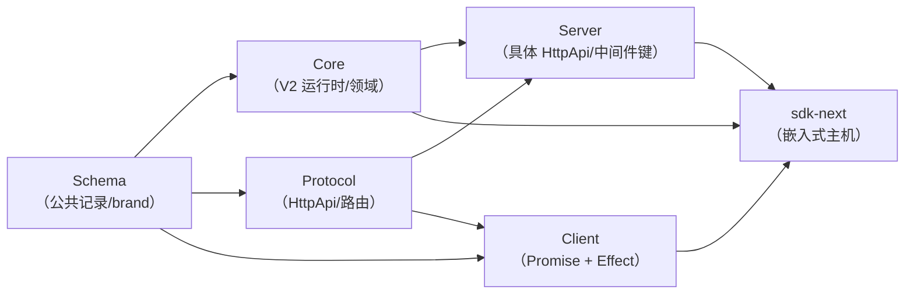
```mermaid
flowchart LR
    Schema["Schema<br/>（公共记录/brand）"]
    Core["Core<br/>（V2 运行时/领域）"]
    Protocol["Protocol<br/>（HttpApi/路由）"]
    Server["Server<br/>（具体 HttpApi/中间件键）"]
    Client["Client<br/>（Promise + Effect）"]
    SDK["sdk-next<br/>（嵌入式主机）"]

    Schema --> Core
    Schema --> Protocol
    Core --> Server
    Protocol --> Server
    Schema --> Client
    Protocol --> Client
    Client --> SDK
    Core --> SDK
    Server --> SDK
```

### 2.3 代码生成：单一真相源

OpenCode 的公开 API 以 Server 的具体 `HttpApi` 为权威来源。`AGENTS.md` 指出：

> 改动公开 Protocol 或 Server 的 `HttpApi` 后，需在 `packages/client` 运行 `bun run generate`。不要直接编辑 `src/generated` 或 `src/generated-effect`。

SDK 生成把公开 `HttpApi` **一次性**编译成一份 **SDK Contract IR**（运行时无关的中间表示），保留编码与解码类型投影及传输元数据，使不同 SDK 发射器可以各自选择公开值模型与运行时解释器。Promise 与 Effect 两种客户端共享端点结构与传输元数据，但**不必**暴露完全相同的公开值：发射器可以独立选择编码后的 wire 类型、解码后的领域类型、编译期 brand、运行时校验与自己的执行抽象。

两种发射器的特点：

- **Effect 发射器（富投影）**：暴露解码后的 Effect 原生值，保留 brand 与 schema 变换，执行运行时 schema 解码，把传输解释委托给 `HttpApiClient`。导出于 `@opencode-ai/client/effect`，仅导入 Effect、Schema 与 Protocol。
- **Promise 发射器**：零 Effect，返回解包后的值；解析响应语法但信任其生成的结构类型，**不做**运行时结构校验（合法 JSON 语法错会失败，但结构形态不匹配不会被 SDK 边界检测）。Promise 流式方法直接返回惰性 `AsyncIterable`；构造同步且无网络；`AbortSignal` 取消、headers 覆盖通过独立的「每调用传输选项」参数传入。

### 2.4 包间关系总览图

下图进一步展开各包之间的运行时依赖与数据流，是后续各章的「导航地图」。

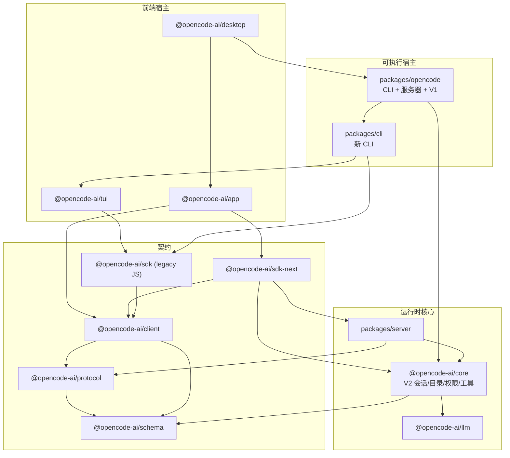
```mermaid
flowchart TB
    subgraph Frontends["前端宿主"]
        TUIpkg["@opencode-ai/tui"]
        APPpkg["@opencode-ai/app"]
        DESKTOPpkg["@opencode-ai/desktop"]
    end

    subgraph Executables["可执行宿主"]
        OPENCODE["packages/opencode<br/>CLI + 服务器 + V1"]
        CLI2["packages/cli<br/>新 CLI"]
    end

    subgraph Runtime["运行时核心"]
        CORE["@opencode-ai/core<br/>V2 会话/目录/权限/工具"]
        LLM["@opencode-ai/llm"]
        SERVER["packages/server"]
    end

    subgraph Contract2["契约"]
        PROTO["@opencode-ai/protocol"]
        SCHEMA["@opencode-ai/schema"]
        CLIENT["@opencode-ai/client"]
        SDKX["@opencode-ai/sdk-next"]
        SDKJS["@opencode-ai/sdk (legacy JS)"]
    end

    TUIpkg --> SDKJS
    APPpkg --> CLIENT
    APPpkg --> SDKX
    DESKTOPpkg --> APPpkg
    DESKTOPpkg --> OPENCODE
    OPENCODE --> CORE
    OPENCODE --> CLI2
    CLI2 --> TUIpkg
    CLI2 --> SDKJS
    CORE --> LLM
    CORE --> SCHEMA
    PROTO --> SCHEMA
    SERVER --> PROTO
    SERVER --> CORE
    CLIENT --> PROTO
    CLIENT --> SCHEMA
    SDKX --> CLIENT
    SDKX --> CORE
    SDKX --> SERVER
    SDKJS --> CLIENT
```

### 2.5 双引擎：V1 与 V2 共存

需要特别强调的是，仓库中**同时存在两套会话运行时**：

- **V1（遗留）**：位于 `packages/opencode/src/session/`，以 `SessionPrompt`（`prompt.ts`，约 66 KB 的单体）为核心，包含 `processor.ts`、`run-state.ts`、`message-v2.ts` 等。它把提示记录与模型执行揉在一起，是 V2 明确要取代的对象。
- **V2（当前核心）**：位于 `packages/core/src/session/` 与 `packages/core/src/system-context/`，采用事件溯源、可重放变换、容器+插件架构。`SessionV2` 的公开门面在 `packages/core/src/session.ts`。

V2 运行器的头部注释直言：「保持它作为对更小协作者的编排，而非重建遗留 `SessionPrompt` 单体。」`CONTEXT.md` 则用一套精严的领域词汇（System Context、Context Epoch、Session Drain、Provider Turn、Prompt Promotion 等）定义了 V2 的不变量。第九章起将深入这套运行时。

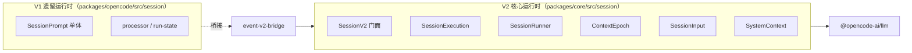
```mermaid
flowchart LR
    subgraph V1["V1 遗留运行时（packages/opencode/src/session）"]
        SP["SessionPrompt 单体"]
        V1Proc["processor / run-state"]
    end
    subgraph V2["V2 核心运行时（packages/core/src/session）"]
        SESS["SessionV2 门面"]
        EXEC["SessionExecution"]
        RUNNER["SessionRunner"]
        EPOCH["ContextEpoch"]
        INPUT["SessionInput"]
        SC["SystemContext"]
    end
    Bridge["event-v2-bridge"]
    V1 -.桥接.-> Bridge
    Bridge --> V2
    V2 --> LLM2["@opencode-ai/llm"]
```

V1 与 V2 之间通过 `packages/opencode/src/event-v2-bridge.ts` 桥接：它把 V1 已可见的提示以相同的 `Prompted` 事件发布到 V2 事件流，使新旧投影保持一致。

---

## 第三章 进程启动与 CLI 命令体系

### 3.1 入口与命令分发

OpenCode 的进程入口是 `packages/opencode/src/index.ts`。它使用 **yargs** 解析命令行参数，并把不同子命令路由到 `packages/opencode/src/cli/cmd/` 下的各命令模块。下面是入口的核心结构（节选）：

```ts
const cli = yargs(args)
  .parserConfiguration({ "populate--": true })
  .scriptName("opencode")
  .wrap(100)
  .version("version", "show version number", InstallationVersion)
  .option("print-logs", { describe: "print logs to stderr", type: "boolean" })
  .option("log-level", { describe: "log level", choices: ["DEBUG","INFO","WARN","ERROR"] })
  .option("pure", { describe: "run without external plugins", type: "boolean" })
  .middleware(async (opts) => {
    if (opts.printLogs) process.env.OPENCODE_PRINT_LOGS = "1"
    if (opts.logLevel) process.env.OPENCODE_LOG_LEVEL = opts.logLevel
    if (opts.pure) process.env.OPENCODE_PURE = "1"
    Heap.start()
    process.env.AGENT = "1"
    process.env.OPENCODE = "1"
    process.env.OPENCODE_PID = String(process.pid)
  })
```

中间件在每条命令执行前设置进程级环境变量：`OPENCODE=1` 标识当前处于代理进程，`OPENCODE_PID` 记录主进程 PID 以便子进程识别父进程，`OPENCODE_PURE=1` 关闭外部插件加载。`Heap.start()` 启动堆分析/诊断。

### 3.2 命令清单

入口导入的命令模块构成 OpenCode 的子命令面：

| 命令模块 | 命令 | 作用 |
| --- | --- | --- |
| `cli/cmd/run` | `RunCommand` | 默认运行（启动 TUI 并连接/启动服务器） |
| `cli/cmd/serve` | `ServeCommand` | 仅启动 HTTP 服务器 |
| `cli/cmd/tui` | `TuiThreadCommand` | 启动 TUI（thread/attach 模式） |
| `cli/cmd/acp` | `AcpCommand` | Agent Communication Protocol 模式（IDE 集成） |
| `cli/cmd/web` | `WebCommand` | 启动 Web 界面 |
| `cli/cmd/pr` | `PrCommand` | 生成 PR（GitHub 集成） |
| `cli/cmd/session` | `SessionCommand` | 会话管理（列出/恢复/导出等） |
| `cli/cmd/db` | `DbCommand` | 数据库操作 |
| `cli/cmd/mcp` | `McpCommand` | MCP 服务器管理 |
| `cli/cmd/plug` | `PluginCommand` | 插件管理 |
| `cli/cmd/account` | `ConsoleCommand` | 账户/登录 |
| `cli/cmd/providers` | `ProvidersCommand` | 列出 Provider |
| `cli/cmd/agent` | `AgentCommand` | 代理管理 |
| `cli/cmd/models` | `ModelsCommand` | 模型列表 |
| `cli/cmd/generate` | `GenerateCommand` | SDK/类型生成 |
| `cli/cmd/upgrade` | `UpgradeCommand` | 升级 |
| `cli/cmd/uninstall` | `UninstallCommand` | 卸载 |
| `cli/cmd/debug` | `DebugCommand` | 调试 |
| `cli/cmd/stats` | `StatsCommand` | 统计 |
| `cli/cmd/github` | `GithubCommand` | GitHub 操作 |
| `cli/cmd/export`/`import` | `Export/ImportCommand` | 会话导出/导入 |
| `cli/cmd/attach` | `AttachCommand` | 附加到已运行的服务器 |

命名子命令被有意设计为**惰性**加载，以避免启动时初始化 TUI 等重模块——这对启动延迟敏感的入口尤其重要（见 `AGENTS.md` 关于动态导入的规约）。

### 3.3 启动流程时序

下图展示了一次典型的 `opencode`（默认 `run` 命令）启动到首屏渲染的时序。注意 TUI 包是 OpenCode 的终端边界，它通过 SDK 连接到本地（或远程）服务器，而非直接调用后端实现模块。

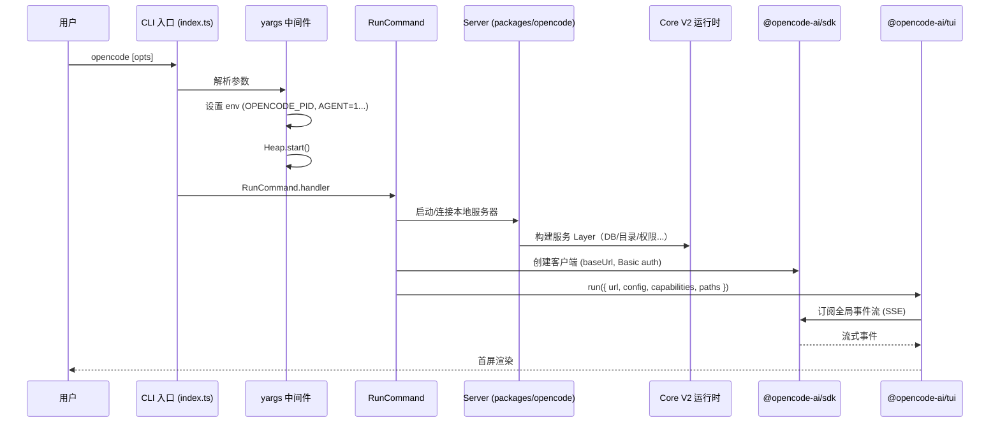
```mermaid
sequenceDiagram
    participant User as 用户
    participant CLI as CLI 入口 (index.ts)
    participant Middleware as yargs 中间件
    participant Run as RunCommand
    participant Server as Server (packages/opencode)
    participant Core as Core V2 运行时
    participant SDK as @opencode-ai/sdk
    participant TUI as @opencode-ai/tui

    User->>CLI: opencode [opts]
    CLI->>Middleware: 解析参数
    Middleware->>Middleware: 设置 env (OPENCODE_PID, AGENT=1...)
    Middleware->>Middleware: Heap.start()
    CLI->>Run: RunCommand.handler
    Run->>Server: 启动/连接本地服务器
    Server->>Core: 构建服务 Layer（DB/目录/权限...）
    Run->>SDK: 创建客户端 (baseUrl, Basic auth)
    Run->>TUI: run({ url, config, capabilities, paths })
    TUI->>SDK: 订阅全局事件流 (SSE)
    SDK-->>TUI: 流式事件
    TUI-->>User: 首屏渲染
```

### 3.4 服务器启动与认证

`ServeCommand` 与 `RunCommand` 都会（直接或间接）启动一个 HTTP 服务器。桌面端通过 `spawnLocalServer()` 用 Electron 的 `utilityProcess.fork` 派生 sidecar，并对 `GET /global/health` 做健康检查循环，使用 HTTP Basic 认证（用户名 `opencode`，密码为随机 UUID）。这保证了即使是同进程嵌入，也保留完整的 HTTP 编码、路由、中间件与解码边界——唯一的区别只是 `HttpClient` 的传输实现（内存 vs 网络）。

`CONTEXT.md` 强调：网络化与嵌入式 OpenCode 使用**相同**的 OpenCode Client，并保留完整的 HTTP 编码/路由/中间件/解码边界；只有 `HttpClient` 传输不同。Effect 原生的网络构造器从其环境中获取 `HttpClient.HttpClient`，因此调用方拥有传输选择、记录、追踪、重试与测试的控制权。

### 3.5 安装与版本

OpenCode 通过 `install` 脚本（仓库根的 `install` 文件）支持多种安装方式：`curl | bash`、`npm i -g opencode-ai`、`brew`、`scoop`、`choco`、`pacman`、`mise`、`nix` 等。安装目录遵循优先级：`$OPENCODE_INSTALL_DIR` → `$XDG_BIN_DIR` → `$HOME/bin` → `$HOME/.opencode/bin`。版本号来自 `@opencode-ai/core/installation/version` 的 `InstallationVersion`，桌面端按通道（`dev`/`beta`/`prod`）使用不同的应用 ID（`ai.opencode.desktop.dev|beta|ai.opencode.desktop`）。

### 3.6 日志与诊断

日志级别由 `--log-level` 与 `--print-logs` 控制，分别写入 `OPENCODE_LOG_LEVEL` 与 `OPENCODE_PRINT_LOGS` 环境变量，供日志子系统在初始化时读取。`Heap`（`cli/heap.ts`）提供运行时堆诊断，便于排查内存与性能问题。`DebugCommand` 与 `export-debug-logs` IPC 通道（桌面）支持导出调试日志。

---

## 第四章 API 契约架构：Schema / Protocol / Server / Client / SDK

> 本章基于 `CONTEXT.md` 的「Client contract architecture」一节与 `AGENTS.md`，结合 `packages/schema`、`packages/protocol`、`packages/server`、`packages/client`、`packages/sdk-next`、`packages/httpapi-codegen` 的源码结构撰写。

### 4.1 设计目标：一个契约，多种消费方式

OpenCode 的 API 契约架构要解决的核心矛盾是：**同一套领域逻辑，既要能以独立 HTTP 服务器服务远程客户端，又要能被同进程嵌入直接调用，还要能生成多种语言的 SDK**。它的解法是严格的分层 + 单一真相源的代码生成：

- 领域语义值在 **Schema** 中定义，对内对外一致；
- **Protocol** 把这些值组合成网络契约（路径、载荷、信封、错误、游标、流）；
- **Server** 具体化 Protocol，添加中间件键与处理器，产出权威 `HttpApi` 与 OpenAPI；
- **Client** 从 SDK Contract IR 生成，分 Promise 与 Effect 两种风格；
- **`sdk-next`** 在 Client 之上组合 Core 与 Server，提供同进程嵌入式主机。

这样，无论网络化还是嵌入式，调用方看到的都是相同的 OpenCode Client 能力；嵌入式主机只是在内存中执行 Server 的 `HttpRouter`，不监听端口、不做网络 I/O，却保留路由、中间件、编解码与错误边界。

### 4.2 Schema：公共记录与 brand

`packages/schema` 是轻量叶节点。共享的公开记录是用 `Schema.Struct` 声明的普通对象。一个同名的推断接口让对象记录拥有可读的 TypeScript 签名，而无需构造器、原型或名义身份；联合类型保留显式类型别名。ID 采用 brand 模式，例如：

```ts
export const ID = Schema.String.pipe(Schema.brand("ProviderV2.ID"))
```

这保证 ID 在类型层面不被混用（`ProviderV2.ID` 与 `ModelV2.ID` 即使底层都是字符串也不能互相赋值），同时运行时只是字符串。`AGENTS.md` 的 Schema 规约要求：branded schema 用于 ID，`Schema.Class`/`Schema.Struct` 用于领域数据，`Schema.TaggedErrorClass` 用于预期失败，`Info` 对象作为存储的领域记录并配备 `empty(...)` 静态构造器。

**关键约束**：Schema 与 Protocol 包都**不得**传递加载数据库、Drizzle、Session 执行、Provider、watcher、原生模块或 WASM。这是保证浏览器安全 bundle 与可嵌入性的前提。

### 4.3 Protocol：HttpApi 分组与中间件位置

`@opencode-ai/protocol` 拥有 Session 端点构造与中间件放置。它把 Schema 组合成 `HttpApi` 分组（groups）、路径、载荷、信封、错误、游标与流。Server 提供具体的中间件键以产出权威的构建期 API；Client 投影则提供仅传输的键，运行时**不**导入 Core 或 Server。

`CONTEXT.md` 明确：Server 的具体 `HttpApi` 是共享 OpenCode Client 能力的权威来源。Codegen 直接编译其 Session 分组；Effect 运行时使用一个等价的「仅 Protocol」投影，使生成产物独立于 Core 与 Server。

### 4.4 Server：具体 HttpApi 与中间件键

`packages/server`（及 `packages/opencode/src/server`）承载具体 `HttpApi`、`HttpRouter`、中间件键、处理器与 OpenAPI 输出。它导入 Core 与 Protocol，承载协议/领域适配，并拥有 Location 中间件键。Server 把 V2 路由路径、操作 ID、编解码、错误、中间件行为与 OpenAPI 输出作为权威契约。

### 4.5 Client：Promise 与 Effect 双客户端

`@opencode-ai/client` 从 SDK Contract IR 生成两种客户端，分别从 root 与 `/effect` 导出：

- **root（Promise 客户端）**：运行时无 Effect 路径。构造同步且无网络：需要 `baseUrl`，默认 `globalThis.fetch`，接受客户端级 headers 并与每调用 header 覆盖合并。失败分为「声明的领域失败」（保留有类型的结构化 wire 值，配生成类型守卫，消费者不依赖生成的 `Error` 子类身份以跨 realm 判别）与「基础设施失败」（一个生成的 `ClientError` 类，结构化原因如 transport failure、unexpected status、unsupported content type、malformed response）。流式方法返回惰性 `AsyncIterable`：首次 `next()` 打开连接，`AbortSignal` 取消，结束迭代关闭底层请求。SSE 连接建立、声明的 HTTP 失败与基础设施失败都发生在 `AsyncIterable` 迭代期间。
- **`/effect`（Effect 客户端）**：导入 Effect、Schema 与 Protocol。构造接受显式 `baseUrl` 并从 Effect 环境获取 `HttpClient.HttpClient`；不安装 fetch，不重复每调用传输策略——调用方通过提供/变换 client 来处理 headers、追踪、重试、记录与测试，取消由 fiber 中断负责。流式方法直接返回 `Stream`。

两种客户端都不自动重连：Promise `AsyncIterable` 与 Effect `Stream` 在传输丢失时显式失败；活跃消费者需刷新并重新订阅。基于序列的持久恢复是生成客户端之上的显式组合，而非内建策略。

### 4.6 SDK Contract IR 与代码生成

`packages/httpapi-codegen` 把权威 `HttpApi` 一次性反射成 **SDK Contract IR**：运行时无关的编译表示，保留编码与解码类型投影及传输元数据，使独立 SDK 发射器可选择公开值模型与运行时解释器。

- **富 Effect 发射器**：暴露解码后的 Effect 原生值，保留 brand 与 schema 变换，执行运行时 schema 解码。当 IR 证明其传输语义可精确复现时，它会重新生成私有可执行 schema；对于有权威自定义变换的契约，则使用基于导入的 Effect 发射器对照仅 Protocol 的 Client 投影，其生成的传输输出经 Server 具体 API 测试。
- **Promise 发射器**：从同一 IR 派生零 Effect 的结构化 wire 类型，针对与 Effect 客户端相同的、面向领域的方法组织（而非 Hey API 源兼容性），返回解包值，拒绝声明与基础设施失败。

### 4.7 嵌入式 OpenCode（sdk-next）

`@opencode-ai/sdk-next` 提供作用域化的同进程主机，结构性扩展 OpenCode Client，提供内存 HTTP 传输，并额外暴露同进程能力。`CONTEXT.md` 给出其核心语义：

- 创建嵌入式 OpenCode 是**作用域化**的。关闭其拥有的 Scope 会释放同进程服务器资源、数据库资源、注册与 fiber。
- 嵌入式主机在共享客户端能力与仅嵌入式能力之上暴露**一个**对象；消费者不必穿越嵌套的 `.client` 属性。
- SDK 在内存中执行 Server 组装的 `HttpRouter`，不打开监听器、不做网络 I/O，却保留 Server 路由、中间件、编解码、处理器与错误。
- Effect 客户端与 SDK 从 Schema 重新导出其解码后的数据类型门面，使调用方不依赖内部包位置或 Core 的版本化名称。

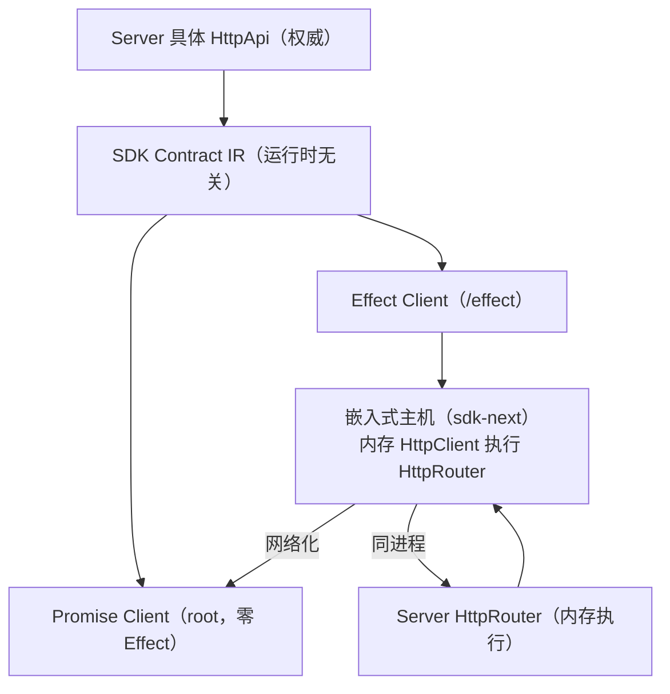
```mermaid
flowchart TB
    HttpApi["Server 具体 HttpApi（权威）"]
    IR["SDK Contract IR（运行时无关）"]
    PromiseClient["Promise Client（root，零 Effect）"]
    EffectClient["Effect Client（/effect）"]
    Embedded["嵌入式主机（sdk-next）<br/>内存 HttpClient 执行 HttpRouter"]
    InMemoryRouter["Server HttpRouter（内存执行）"]

    HttpApi --> IR
    IR --> PromiseClient
    IR --> EffectClient
    EffectClient --> Embedded
    InMemoryRouter --> Embedded
    Embedded -->|同进程| InMemoryRouter
    Embedded -->|网络化| PromiseClient
```

### 4.8 Page、游标与事件流

OpenCode 的列表契约采用 **Page** 概念：一个有界有序结果，含 `items` 与不透明的 `previous`/`next` 游标链接，可双向导航同一查询。游标是不透明的 brand 值，携带延续查询与排序状态；消费者原样传回，不检视存储锚点或编码字段。列表延续只接受不透明游标；范围、过滤、排序与页大小由初始查询固定并由游标携带。

事件流有两种，刻意不同：

- **`sessions.events({ sessionID, after })`**：公开的持久 Session 事件流。验证 Session，在可选聚合序列后重放持久事件，继续提交的新持久事件，排除仅 live 片段，以 SSE 传输。它验证 durable 序列语义，支持重连安全的消费者。冷持久事件流，不内建重连策略。
- **`events.subscribe()`**：实例级 live 流，含 Session 与非 Session 活动。无重放保证，含连接、心跳与实例销毁生命周期事件；传输丢失以 `ClientError` 失败，消费者刷新权威状态后显式打开新订阅。Session ID **不是** `events.subscribe()` 的可选过滤：实例级 live 事件与持久 Session 事件有不同的 schema、重放保证、游标、生命周期与失败行为。

`CONTEXT.md` 特别强调这两者的区分：`sessions.events` 的 `after` 是聚合序列游标，重放 + 追尾；`events.subscribe` 是有界实例 live 流。任何可复用的「恢复助手」是独立 API 设计问题，不内建到端点或客户端构造器中。

### 4.9 契约稳定性待办

`CONTEXT.md` 列出在客户端 API 稳定前需保持的约束，例如：

- 把额外的公开 schema 放在 Schema、额外的网络分组放在 Protocol；二者都不得传递加载数据库/Drizzle/Session 执行/Provider/watcher/原生模块/WASM。
- 把具体 Location 中间件键放在 Server，Protocol 只拥有其放置；Client 投影可提供仅传输键，但须证明与 Server 具体 API 生成等价。
- 将现有列表响应信封投影到稳定的 Page 形状，并强制分离初始查询与游标延续输入，且不改变托管的 V2 wire 契约。
- 在支持单数据库多主机前定义嵌入式主机放置；共享持久 Session 存储的主机也必须共享进程本地 Session 执行协调，否则每个主机须显式获得隔离存储。
- 保持嵌入式请求 Scope 存活直到任何流式响应体完成。

这些约束体现了 OpenCode 对「契约即不变量」的严肃态度：任何破坏浏览器安全 bundle 或传输边界的行为都被视为回归。

---


## 第五章 配置体系


### 1.9 面向不同读者的核心问题速答

在深入各章之前，本节用问答形式回答几类读者最可能问的核心问题，建立初步理解。

**问：OpenCode 和 Claude Code、Cursor 有什么本质区别？**
答：架构层面，OpenCode 把会话建模为事件溯源的持久聚合，而多数同类把会话当内存对象。这意味着 OpenCode 天然支持多客户端共观察、会话 fork、跨工作区移动、崩溃后从事实重放。产品层面，OpenCode 是开源的，可自托管、可嵌入任意 TS/JS 进程，不绑定单一 provider——它的 19 个 `@ai-sdk/*` provider 与原生协议适配器支持几乎所有主流模型。

**问：为什么 V1 和 V2 并存？**
答：V1 的 `SessionPrompt` 单体（~66KB）揉合了所有职责，难以维护扩展。V2 用事件溯源+容器插件架构重写，但增量开发、用 checklist 追踪进度。直接重写会冻结功能开发数月，故选择「并存+桥接+逐步替换」：V2 通过 `event-v2-bridge` 与 V1 共享持久事件流，`specs/v2/session.md` 维护对等清单确保替换前不遗漏功能。当 V2 覆盖全部 V1 行为，V1 才被移除。

**问：嵌入式 OpenCode 和网络化有什么区别？**
答：代码路径几乎相同——都走生成的客户端、相同的路由/中间件/编解码/错误边界。唯一区别是 `HttpClient` 传输：网络化用 fetch（网络），嵌入式用内存函数（`web.handler` 直接调用 `HttpRouter`）。这保证两种模式行为一致，嵌入式不因绕过网络层而丢失认证、校验或 SSE 语义。代价是嵌入式仍有 HTTP 编解码开销，但换得行为一致性。

**问：一次提示如何变成工具执行？**
答：用户 `prompt` → 持久准入 `session_input`（`PromptAdmitted` 事件）→ 建议性 `wake` → drain 协调器启动 → `failInterruptedTools` 清扫遗留 → 安全边界晋升（`promoteSteers`/`promoteNextQueued` → `Prompted` → 投影 user 消息）→ 纪元 `prepare`（调和上下文）→ 解析模型 → 投影历史 → materialize 工具 → `llm.stream(request)` → 流式事件持久化 → 工具调用先记录（`Tool.Called`）后 `settle`（授权+执行+有界输出）→ `Step.Ended` → 若 `needsContinuation` 下一回合。第九至十五章详述。

### 1.10 工程规约的纪律性

`AGENTS.md` 不仅描述架构，更规定工程纪律，这些规约直接塑造了代码质量。几条值得强调：

**「保持在一个函数内，除非可组合或可复用」**——不预先提取单用助手。这防止「过度抽象」的代码癌——每个小函数都被提取成独立单元，使代码碎片化、难以阅读。OpenCode 倾向「主线函数读作快乐路径，支持细节移到下方小助手」。

**「避免 try/catch」「避免 any 类型」**——Effect 的有类型错误通道使 try/catch 多余（用 `Effect.catchTag` 等处理有类型失败）。避免 any 使类型安全不破洞。这些规约使代码库保持高类型安全与可推理性。

**「用 Bun API 如 `Bun.file()`」「依赖类型推断」「优先函数式数组方法 over for 循环」**——这些是 Bun/TS 的惯用法，使代码简洁高效。`Bun.file(path).json()` 比 `fs.readFileSync`+`JSON.parse` 更短更快。类型推断避免冗余类型标注。

**「Effect 生成器中，先绑定服务到命名变量再调用方法」**——`const journal = yield* Bun.file(...).json()` 而非内联链。这避免「嵌套 service yield 如 `yield* (yield* Foo.Service).bar()`」的可读性灾难。

这些规约不是教条，而是从大型代码库维护中提炼的实践，使 OpenCode 代码库即使庞大也保持可读、可维护。

### 1.11 版本与发布通道

OpenCode 用通道（channel）管理发布：`dev`（开发）、`beta`（测试）、`prod`/`production`（生产）。版本号 `1.17.13`（`InstallationVersion`）。桌面端按通道用不同应用 ID：`ai.opencode.desktop.dev|beta|ai.opencode.desktop`——这使三个通道能共存安装。

CLI 通过 `install` 脚本支持多种安装方式，版本检查用 `InstallationVersion`。桌面用 electron-updater 自动更新，`latest*.yml` 元数据发布到 GitHub release（prod 到 `anomalyco/opencode`，beta 到 `anomalyco/opencode-beta`）。版本同步由 `scripts/prepare.ts`（`@opencode-ai/script`）处理。

发布流水线（`publish.yml`）：version → build-cli（Bun 编译 CLI）→ sign-cli-windows（Azure Trusted Signing）→ build-electron 矩阵（6 平台）→ publish（上传安装器 + npm/AUR + 签名更新器元数据）。这是「一次 CI 产出全平台」的工程化。

---

### 2.10 turbo 与 catalog 的构建编排

`turbo.json`（Turborepo 2.8）定义 `typecheck`、`build`（输出 `dist/**`）、各包 `test` 任务。Turborepo 的价值是「任务依赖图 + 缓存」——`build` 任务按依赖顺序执行（先构建依赖、再构建依赖者），且结果可缓存（重跑时若输入未变则跳过）。

`workspaces.catalog` 是 Bun 的版本目录——共享依赖锁定单一版本（如 `effect: 4.0.0-beta.83`、`typescript: 5.8.2`），避免「不同包用不同版本导致冲突」。catalog 使版本升级集中：改一处 catalog，所有包同步。

`bunfig.toml` 配置 Bun 行为，如 OpenTUI Solid preload（TUI 包本地开发）。`.oxlintrc.json` 配置 oxlint（代码检查）。`.prettierignore` 配置 Prettier。这些工具配置使代码风格统一、质量可控。

### 2.11 补丁与 SDK 生成

`patches/` 目录含依赖补丁（如对某些 npm 包的修改）。Bun 支持 `patchedDependencies`，使「上游未合并的修复」可用。这是「不等待上游」的工程实用主义。

`packages/sdk/js/script/build.ts` 重新生成遗留 JS SDK：运行 `bun dev generate` 在 `packages/opencode` dump `openapi.json`，修剪不可达的 `SessionNext\w+1` schema，运行 `@hey-api/openapi-ts` 生成 `src/v2/gen/`。`src/v2/client.ts` 加 `rewrite` 注入 `x-opencode-directory`/`x-opencode-workspace` header。

这条「OpenAPI → SDK」的遗留链路（Hey API）与新的「HttpApi → IR → emit」链路（`httpapi-codegen`）并存。新链路更类型安全（从 Effect `HttpApi` 反射，而非 OpenAPI JSON），但遗留链路覆盖更广（Hey API 成熟）。迁移逐步进行。

---

### 3.11 effectCmd 的自动实例管理

`effectCmd` 是现代 Effect 原生命令构建器。其 `instance` 选项（默认 true）控制是否加载项目 `InstanceContext`。当 true，`InstanceStore.Service.use(store => store.load({directory}))` 加载实例，handler 在 `InstanceRef` 下运行，`finally` 中 `store.dispose(ctx)` 自动拆除。

这种「自动实例管理」使命令实现者无需手动管理实例生命周期——声明 `instance: true`，框架处理加载与拆除。`instance: false`（如 `models`、`serve`、`web`、`account`、`db`、`upgrade`）用于不需要项目上下文的命令——它们在 bare `AppRuntime` 下运行，无 `InstanceRef`。

`directory` 解析器默认 `process.cwd()`。`RunCommand` 用 `(args) => args.dir && !args.attach ? resolve(cwd, args.dir) : cwd` 支持 `--dir` 指定项目目录。`instance: (args) => !args.attach` 使 attach 模式不加载本地实例（连接远程）。

### 3.12 RunCommand 的三种模式

`RunCommand` 是默认命令，支持三种模式。非交互（默认）：从位置参数 + `--` 构建消息，解析会话（`sdk.session.get`/`fork`/`create`），订阅 `sdk.event.subscribe()`，`loop()` 消费 SSE 流镜像消息更新。`--format json` 输出原始事件行到 stdout——适合脚本化。

交互本地（`--mini`/`--interactive`）：调 `runInteractiveLocalMode`，用自定义 `fetch` 路由进进程内服务器（`Server.Default().app.fetch`）。`opencode --mini` 在进程内启动整个 HTTP 应用（不监听 TCP），通过 SDK 驱动。`baseUrl: "http://opencode.internal"` 从不真正网络请求。

Attach（`--attach <url>`）：`createOpencodeClient({ baseUrl: args.attach, ... })` 连接远程服务器，运行交互模式。这使「本地 TUI 连接远程 opencode 实例」可行——如连接服务器上的 opencode daemon。

会话解析助手：`session()`、`share()`、`createFreshSession()`、`current()`（用 `sdk.path.get()` 解析远程目录）、`pickAgent()`。文件附件读取至 10MB（`ATTACH_FILE_MAX_BYTES`）内联为 `data:` URL。

### 3.13 全局选项与进程标记

全局选项 `--print-logs`、`--log-level`、`--pure` 经中间件设置环境变量。`OPENCODE=1` 标识代理进程，`OPENCODE_PID` 记录主进程 PID（子进程识别父进程），`AGENT=1` 标识 agent 角色。`OPENCODE_PURE=1` 关闭外部插件——用于隔离测试或最小化运行。

`Heap.start()` 启动堆诊断。`.fail()` 处理器对未知/缺参/非法值错误打印帮助，否则重抛或 `process.exit(1)`。`.strict()` 启用严格参数解析。`show()` 助手对非 `opencode` 开头的输出前缀 ASCII logo。

`finally { process.exit() }` 强制退出，使子进程（尤其 docker-container MCP 服务器）不挂起。这反映 CLI 的「最终必须退出」假设，而非长期服务进程。

---

### 4.14 Effect 客户端的传输来自环境

Effect 客户端构造 `make = (options?: { baseUrl? }) => HttpApiClient.make(Api, options)`——传输来自 Effect 环境（`HttpClient.HttpClient`），不安装 fetch。调用方通过提供/变换 client 处理 headers、追踪、重试、记录与测试，取消由 fiber 中断负责。

这与 Promise 客户端（`fetch?: typeof globalThis.fetch` 显式传入）形成对比。Effect 客户端的「传输来自环境」使它在嵌入式场景天然适配——嵌入式主机提供内存 `fetch` 作为 `HttpClient`，Effect 客户端透明使用。网络化场景提供真实 fetch。

`mapClientError` 把 `HttpClientError`/`SchemaError`/`Sse.Retry` 映射为 `ClientError`，其他错误透传。这使「传输层错误」与「领域错误」区分——前者是基础设施失败，后者是声明的业务失败。

### 4.15 游标的不透明 brand 实现

`SessionsCursor = Schema.String.pipe(Schema.brand("SessionsCursor"), statics({ make, parse }))`——cursor 是 brand 字符串。`make(input)` 用 `Encoding.encodeBase64Url(encodeSessionsCursor(input))` 编码 `{ ...query, anchor: { id, time, direction } }`。`parse(input)` 解码。

brand 使 cursor 在类型层面与普通字符串区分——编译器防止「把任意字符串当 cursor 传」。`make`/`parse` 是唯一构造与解码入口。消费者不应用 `parse` 检视内部——内部表示可能变化。消息 cursor 是 ad-hoc 的 `{ id, order, direction }`（`server/handlers/message.ts`），非 brand——这是「未来统一为 Page + brand cursor」的待办。

`InvalidCursorError`（400）处理坏/不可解码 cursor。`sessions.messages` 额外拒绝 `cursor` 与 `order` 同时提供——因为 cursor 已携带 order，再传 order 语义冲突。这些校验使分页 API 健壮。

### 4.16 SSE 流的实现细节

`session.events` 返回 `Stream.unwrap(result.get(sessionID).pipe(Effect.as(events.durable({ aggregateID, input.after }))))`。`EventV2.durable` 重放持久事件（`after` 之后的）然后继续提交的新持久事件。`Stream.filter(isDurableSessionEvent)` 过滤到 durable。

`events.subscribe` 的 `EventHandler` 用 `handleRaw`：发合成 `connected` 事件，然后 `Stream.unwrap(EventV2.allBounded(events, 256))`——一个容量 256 的 dropping queue，由 `events.listen` 喂入，溢出 `SubscriberOverflowError`。每事件用 `Sse.encode()` 编码（事件名 `"message"`，`JSON.stringify`），合并 15s 心跳（`: heartbeat`）。注意 opencode 存在两个事件端点实现：新 `/api/event`（`packages/server/src/handlers/event.ts`）心跳 15s；遗留 `/event`（`packages/opencode/src/server/routes/instance/httpapi/handlers/event.ts`）心跳 10s。两者都发 `server.heartbeat`，仅间隔与实现不同。

响应头 `Cache-Control: no-cache, no-transform`、`X-Accel-Buffering: no`（禁 nginx 缓冲）、`X-Content-Type-Options: nosniff`。这些头保证 SSE 不被中间层缓冲——SSE 实时性依赖无缓冲传输。`disableLogger: true` 避免每个请求日志。

---

### 5.1 配置文件发现与分层

V2 核心在全局配置目录、祖先项目目录与 `.opencode` 配置目录中发现名为 `opencode.json` 或 `opencode.jsonc` 的配置文档。遗留的 `config.json` 文件名在 V2 中**不支持**。配置发现由 `packages/opencode/src/config/paths.ts` 的 `ConfigPaths.files(name, directory, worktree)` 实现：从当前工作目录向上查找到 worktree，匹配 `${name}.json[c]`；`directories(directory, worktree)` 返回全局目录加 `.opencode` 目录（项目 + home）加 `OPENCODE_CONFIG_DIR`。

配置加载顺序（`Config.loadInstanceState`，每实例）遵循「普通设置向前读，策略倒序读」的原则：

- **普通设置**：location 特定设置覆盖用户全局设置（向前读）。
- **策略**：按 authored 配置文档**倒序**读，使用户全局策略可覆盖仓库策略；文档内语句保持书写顺序。

这保证「一个仓库不能静默重启用被用户全局拒绝的 provider」。

### 5.2 配置组审查

`specs/v2/config.md` 把遗留配置 schema 拆成 11 个审查组，逐一决定 keep/remove/redesign。下表汇总核心结论：

| 组 | 字段 | 决策 | 说明 |
| --- | --- | --- | --- |
| 文件元数据 | `$schema` | keep | 只读元数据，加载时不插入 |
| 进程/服务器 | `shell` | keep | 有效配置；shell 选择全程序共享 |
| | `logLevel` | remove | 无消费者，日志从 CLI 输入初始化 |
| | `server` | remove | location 配置在服务器运行后才加载 |
| | `autoupdate` | keep | 全局用户偏好 |
| 命令/资源 | `command` | remove | 命名工作流归技能 |
| | `skills` | redesign | 单一本地路径/远程 URL 发现源数组 |
| | `reference` | redesign | 重命名为复数 `references`，命名本地/外部上下文 |
| | `instructions` | keep | 本地路径/glob/远程 URL 数组，自动包含上下文 |
| 插件 | `plugin` | redesign | 重命名 `plugins`，有序加载 `{ package, options? }` |
| 文件系统/工具 | `watcher`/`formatter`/`lsp`/`tool_output` | keep | 各子系统配置 |
| | `snapshot` | redesign | 重命名 `snapshots`，控制撤销/回滚快照 |
| | `attachment` | redesign | 重命名 `attachments` |
| 分享/身份 | `share`/`enterprise`/`username` | keep | 分享行为与企业 URL、用户身份 |
| Provider/模型 | `provider` | redesign | 重命名 `providers`，不保留单数别名 |
| | `disabled/enabled_providers` | redesign | 替换为 `experimental.policies` |
| | `model` | keep | 默认模型回退 |
| | `small_model` | remove | 仅标题生成用，改配 `title` agent |
| Agent/权限 | `default_agent`/`mode` | remove | 不预先承诺旧 agent 模型 |
| | `agent` | redesign | 重命名 `agents`，命名内置覆盖与自定义 |
| | `permission` | redesign | 重命名 `permissions`，有序 `{action,resource,effect}` 数组 |
| | `tools` | remove | 通过权限表达工具访问 |
| 集成 | `mcp` | redesign | 嵌套 `mcp.servers`，`disabled`，timeout 默认 |
| 对话生命周期 | `compaction` | redesign | `keep.tokens` + `buffer` |
| 废弃/实验 | `layout`/`experimental.*` | remove | 多数废弃 |

### 5.3 V2 配置设计原则

几条贯穿审查的原则值得记录：

- **统一一个 V2 配置 schema**：目前不强制分离全局与 location schema，待更多 scope 敏感字段存活后再 revisit。
- **技能是发现源配置而非内联工作流定义**：技能内容由 `SKILL.md` 拥有；每个 `skills` 条目是本地搜索根或远程发现 URL。
- **指令与技能分离**：指令自动作为模型上下文包含；技能按需加载或调用。
- **`disabled?` 一致性**：所有应保留配置但不活跃的命名条目用 `disabled?: boolean`（agent、formatter、LSP、未来 MCP 服务器、模型覆盖）。运行时目录状态可仍跟踪活跃可用性为 `enabled`，那不是用户 authored 配置。
- **provider/model/variant 选项为部分补丁**：用户应能只设需要的覆盖（如一个 header 或 AI SDK 请求选项）；目录状态提供空默认并按配置顺序合并补丁。
- **嵌套 `api.id`**：配置模型中，遗留的上游模型标识符 `id` 嵌套在 `api.id` 下。

### 5.4 MCP 与权限的配置形态

MCP 配置（`specs/v2/config.md` Group 9）保留 opencode 的显式本地/远程服务器条目格式，而非采用通用 `mcpServers` 复制粘贴形态。本地服务器为显式 `type: "local"` 条目（command 数组 + environment），远程服务器为显式 `type: "remote"` 条目（url、headers、可选 oauth）。服务器映射嵌套在 `mcp.servers` 下，使协议级设置如 timeout 默认可放在同一子系统下。MCP 超时分离启动与请求预算（毫秒）：`startup` 覆盖建立传输与完成 MCP 初始化；`request` 独立应用于每个初始化后的 MCP 请求。

权限配置（Group 8）重命名 `permission` 为 `permissions`，暴露 `PermissionV2.Ruleset` 已建模的规范化有序规则集。规则保留交互式 `"ask"` effect（区别于 `experimental.policies`，后者 provider 强制只需 allow/deny）。

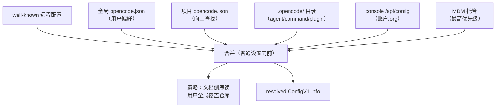
```mermaid
flowchart TB
    Global["全局 opencode.json<br/>（用户偏好）"]
    WellKnown["well-known 远程配置"]
    Project["项目 opencode.json<br/>（向上查找）"]
    DotOpencode[".opencode/ 目录<br/>（agent/command/plugin）"]
    Account["console /api/config<br/>（账户/org）"]
    Managed["MDM 托管<br/>（最高优先级）"]
    WellKnown --> Merge["合并（普通设置向前）"]
    Global --> Merge
    Project --> Merge
    DotOpencode --> Merge
    Account --> Merge
    Managed --> Merge
    Merge --> PolicyNote["策略：文档倒序读<br/>用户全局覆盖仓库"]
    Merge --> Resolved["resolved ConfigV1.Info"]
```

### 5.5 配置的变量展开与校验

`ConfigVariable.substitute` 在配置文本中展开 `{env:VAR}`（环境变量）与 `{file:path}`（文件内容）。`ConfigParse.jsonc` 用 jsonc-parser 解析（`allowTrailingComma`，抛 `JsonError`）；`ConfigParse.schema` 严格校验——拒绝顶层未知键（抛 `InvalidError`），用 Effect Schema 解码。前端 frontmatter 解析用于 agent/command markdown 文件（`@file` `FILE_REGEX`、`` !`...` `` `SHELL_REGEX`、`parse` 抛 `FrontmatterError`）。配置更新用 `jsonc-parser` 的 `modify`/`applyEdits` 做 JSONC 感知补丁，保留注释与格式。

---

## 第六章 Provider 与模型目录

### 6.1 Provider Schema

`specs/v2/provider-model.md` 定义了 V2 的 Provider 与 Model schema。Provider ID 用 brand：

```ts
export const ID = Schema.String.pipe(
  Schema.brand("ProviderV2.ID"),
  statics((schema) => ({
    opencode: schema.make("opencode"),
    anthropic: schema.make("anthropic"),
    openai: schema.make("openai"),
    google: schema.make("google"),
    googleVertex: schema.make("google-vertex"),
    githubCopilot: schema.make("github-copilot"),
    amazonBedrock: schema.make("amazon-bedrock"),
    azure: schema.make("azure"),
    openrouter: schema.make("openrouter"),
    mistral: schema.make("mistral"),
    gitlab: schema.make("gitlab"),
  })),
)
```

Provider 的 `Endpoint` 是一个标记联合：`unknown`（未知）、`openai/responses`、`openai/completions`、`anthropic/messages`、`aisdk`（包名 + 可选 URL）。`Options` 含 `headers`、`body`、`aisdk: { provider, request }`——provider 语义与 AI SDK 请求选项分离。`ProviderV2.Info` 含 `id`、`name`、`enabled`（false 或 env/account/custom 来源）、`env`（凭据环境变量名列表）、`endpoint`、`options`。

### 6.2 Model Schema

`ModelV2.Info` 是模型的完整描述：`id`、`apiID`、`providerID`、`family`、`name`、`endpoint`、`options`（含 variant 覆盖）、`capabilities`（tools/input/output）、`variants`、`time.released`、`cost`（数组，含 tiered 定价）、`status`（alpha/beta/deprecated/active）、`enabled`、`limit`（context/input/output）。模型存储按 provider 嵌套，因为模型 ID 仅在 provider 内唯一。

### 6.3 模型目录接口

`Catalog` 的 `Interface` 提供 provider 与 model 的 `get`/`all`/`available` 查询，以及 `model.default()` 与 `model.small(providerID)`。`ProviderV2.Info.enabled` 是存储的 provider 状态；provider 插件设其为 `false` 或记录可用性来自 env/account/custom。`ModelV2.Info.enabled` 存储模型可用性；`Catalog.model.available()` 还要求 provider 可用：`const available = provider.enabled !== false && model.enabled`。

`CatalogV2.model.get()` 与 `all()` 会在返回模型前从 provider 解析 `unknown` 端点。

### 6.4 models.dev 摄入

`packages/core/src/models-dev.ts` 的 `ModelsDev` 服务从 `https://models.dev/api.json` 抓取模型数据（可通过 `Flag.OPENCODE_MODELS_URL` 覆盖），缓存到 `Global.Path.cache/models.json`，5 分钟 TTL + 进程间 `Flock` 锁，每 60 分钟调度刷新。也回退到编译时快照 `OPENCODE_MODELS_DEV`。

models.dev 的 `Model` schema 含 `id`、`name`、`family`、`release_date`、`attachment`、`reasoning`、`temperature`、`tool_call`、`interleaved`、`cost`（含 tiered）、`limit`、`modalities`、`experimental.modes`（按模式覆盖 body/headers）、`status`、`provider`（npm/api）。`fromModelsDevModel`/`fromModelsDevProvider` 把其转换为 opencode 的 `Model`/`Provider`；`experimental.modes` 被爆炸为 `<model-id>-<mode>` 伪模型。

### 6.5 模型请求选项与生成控制

`packages/opencode/src/provider/transform.ts` 的 `ProviderTransform` 实现关键的选项 lowering：

- **`options(model, sessionID, providerOptions)`**：每 SDK 请求选项——`store: false`（openai/azure/copilot/bedrock-mantle）、`promptCacheKey = sessionID`（openai/azure/opencode/venice/openrouter）、`thinkingConfig`（Google/Gemini）、`reasoningEffort`/`reasoningSummary`/`include: ["reasoning.encrypted_content"]`（gpt-5 族）、`enable_thinking`（alibaba-cn）、`toolStreaming: false`（vertex-anthropic）、`chat_template_args`（baseten/kimi/glm）。
- **`variants(model)`**：每 npm 包的推理 effort 矩阵（`thinking`、`reasoning`、`reasoningEffort` 等），带模型版本门控辅助（`anthropicOpus47OrLater`、`anthropicSonnet5OrLater`、`openaiReasoningEfforts`、`googleThinkingVariants`）。广泛支持的 effort 列表 `WIDELY_SUPPORTED_EFFORTS = ["low","medium","high"]`。
- **`temperature`/`topP`/`topK`**：每模型族默认（claude → undefined，gemini → 1.0，qwen → 0.55）。
- **`maxOutputTokens(model, OUTPUT_TOKEN_MAX = 32_000)`**：`Math.min(model.limit.output, 32_000)`。
- **`message(msgs, model, options)`**：消息变换管线——`unsupportedParts` → `normalizeMessages`（每 provider 清理）→ `applyCaching`（前 2 system + 后 2 消息的临时 cacheControl 标记）→ providerOptions key 重映射。
- **`schema(model, schema)`**：每 provider 工具/JSON schema 清理（OpenAI、Moonshot `$ref`、Gemini enum→string）。

`CONTEXT.md` 强调：Generation Controls、协议语义 Model Request Options、与兼容性请求体字段是分离的 Catalog 域。一个共享摄入适配器在路由前把遗留与 models.dev AI-SDK 形选项分区。

### 6.6 Agent 与模型选择

`packages/opencode/src/agent/agent.ts` 的 Agent `Info` schema 含 `name`、`description`、`mode`（subagent/primary/all）、`model`（modelID + providerID）、`variant`、`system`（原 `prompt`）、`steps`、`permissions`、`options`、`color`。内置 agent：`build`（primary 默认）、`plan`（禁编辑工具）、`general`、`explore`、`compaction`、`title`、`summary`。

模型选择在 session 层：`currentModel` 优先用 session 行的 model，再上次用户消息的 model，再 `provider.defaultModel()`。`defaultModel` 优先 `cfg.model`，再最近模型文件 `Global.Path.state/model.json`，再第一个有模型的 provider。`getSmallModel` 优先 `gemini-flash`、`gpt-nano`、`claude-haiku` 族（标题/压缩/摘要 agent 用）。

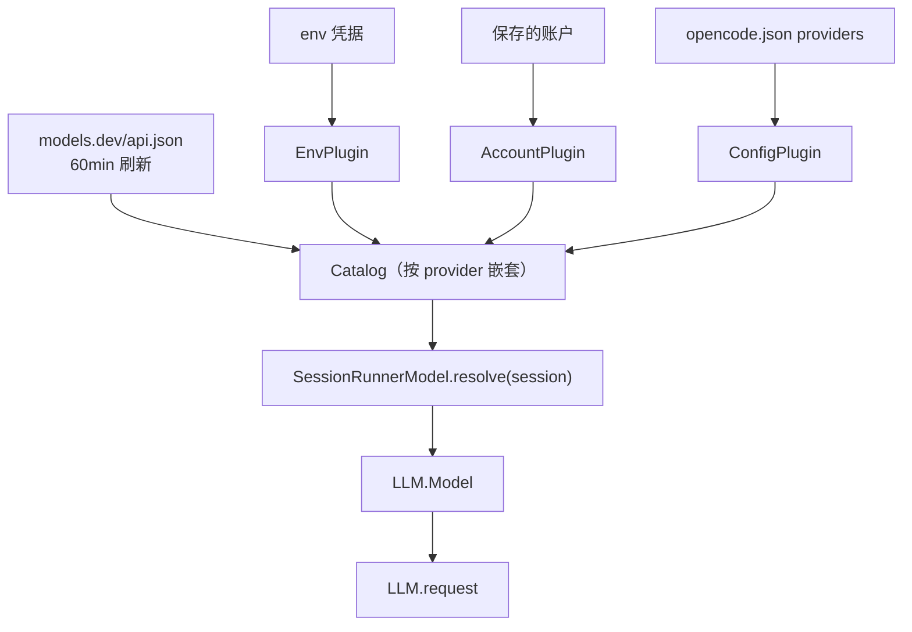
```mermaid
flowchart TB
    ModelsDev["models.dev/api.json<br/>60min 刷新"] --> Catalog["Catalog（按 provider 嵌套）"]
    Env["env 凭据"] --> PluginEnv["EnvPlugin"]
    Account["保存的账户"] --> PluginAccount["AccountPlugin"]
    Config["opencode.json providers"] --> PluginConfig["ConfigPlugin"]
    PluginEnv --> Catalog
    PluginAccount --> Catalog
    PluginConfig --> Catalog
    Catalog --> Resolve["SessionRunnerModel.resolve(session)"]
    Resolve --> Model["LLM.Model"]
    Model --> Request["LLM.request"]
```

---

## 第七章 策略系统


### 3.17 Heap.start 与诊断

`cli/heap.ts` 的 `Heap.start()` 启动堆诊断。这是 V8 堆分析工具——记录堆快照、分配 profile，用于排查内存泄漏与性能问题。

堆诊断在 CLI 中间件启动——每条命令执行前 `Heap.start()`。这使得「任何命令都能用堆诊断」——如 `opencode run` 内存增长，可用 Heap 分析。`src/main/sidecar.ts` 的桌面 sidecar 也支持堆快照（worker RPC `snapshot` 方法）。

`export-debug-logs` IPC 通道（桌面）支持导出调试日志，含堆信息。这是「生产可调试」的基础设施——用户报告问题时，可导出诊断信息供开发者分析。

### 3.18 UI.logo 与品牌呈现

`cli/ui.ts` 的 `UI.logo()` 返回 ASCII logo。`show()` 助手对非 `opencode` 开头的输出前缀 logo——使帮助文本等有品牌呈现。这是「CLI 品牌化」的细节。

`UI.println/print/empty/error` 是 ANSI 输出助手。`Style` 常量定义颜色与样式。`CancelledError`（`UICancelledError`）是用户取消的标记错误。这些是「CLI 用户界面」的基础原语。

`FormatError(input)` 映射有类型错误到用户字符串：`CliError`、`MCPFailed`、`AccountServiceError`/`AccountTransportError`、`ProviderModelNotFoundError`、`ProviderInitError`、`ConfigJsonError` 等。`FormatUnknownError` 兜底。这使「有类型错误」转为人类可读消息，而非堆栈。

### 3.19 network 选项与 mDNS

`cli/network.ts` 的 `withNetworkOptions` 添加 `--port`(0)、`--hostname`(127.0.0.1)、`--mdns`(false)、`--mdns-domain`(opencode.local)、`--cors`。`resolveNetworkOptions` 合并 `ConfigV1` server 设置与 CLI 参数。

mDNS（`src/server/mdns.ts`，`bonjour-service`）发布服务到本地网络——使局域网内其他设备能发现 opencode 服务器。除非 hostname 是 loopback，否则发布 mDNS。注册 unpublish finalizer 在监听器 scope。

`--port 0` 先试 4096，再任意空闲端口。`--hostname 127.0.0.1` 默认仅本地访问；设 `0.0.0.0` 或具体 IP 使网络可访问。`--mdns` 发布到 mDNS。`--cors` 配置 CORS。这些是「服务器网络配置」的 CLI 选项。

### 3.20 runMini 的程序化入口

`runMini(input)` 是 `RunCommand` 的程序化入口，被其他宿主（TUI/desktop）使用——它重新调 `RunCommand.handler` with `_ : ["mini"]`。这使「非 CLI 宿主能复用 run 命令逻辑」。

`runMini` 用自定义 `fetch` 路由进进程内服务器——`Server.Default().app.fetch(new Request(request, { headers }))`。`opencode --mini` 在进程内启动整个 HTTP 应用（不监听 TCP），通过 SDK 驱动，`baseUrl: "http://opencode.internal"`。

这是「进程内嵌入」的轻量形式——不需完整 `sdk-next` 的内存 HttpClient，而是用自定义 fetch 路由进 `Server.Default().app`。适用于 CLI 的 `--mini` 模式，快速单次命令。

---

### 4.20 HttpApi 的声明式 API

`packages/protocol/src/api.ts` 的 `makeApi` 用 `HttpApi.make("server")` 构建 Effect 的声明式 HTTP API。`.add(group)` 添加分组，`.middleware(...)` 添加中间件。`OpenApi.annotations` 添加 OpenAPI 元数据。

声明式 API 使「端点定义」集中——path、method、input schema、output schema、errors、middleware 在一处声明。Server 提供具体中间件键与处理器，Client 提供传输专用键。Codegen 从此反射生成客户端。

`HttpApiGroup.make("server.session")` 定义分组——含端点（`HttpApiEndpoint.make("session.list", "GET", "/api/session")`）。每端点有 input（query/params/payload）、success schema、errors。`HttpApiSchema.StreamSse` 声明 SSE 流端点。`HttpApiSchema.asText` 声明文本响应。

### 4.21 declared errors 的 httpApiStatus

`packages/protocol/src/errors.ts` 的错误用 `Schema.TaggedErrorClass` + `httpApiStatus` 注解：`InvalidRequestError` (400)、`UnauthorizedError` (401)、`ForbiddenError` (403)、`SessionNotFoundError` (404)、`ConflictError` (409)、`ServiceUnavailableError` (503) 等。

这些「declared errors」是端点声明可能失败的错误。它们在 OpenAPI 中作为响应码文档化。Client 生成为有类型守卫的结构化 wire 值——消费者用 `isSessionNotFoundError(e)` 判别，而非 `instanceof`（跨 realm 安全）。

`httpApiStatus` 注解使错误自动映射到 HTTP 状态码——`SessionNotFoundError` → 404，无需手工映射。这是「声明式错误处理」——错误类型自带状态码语义。

### 4.22 Authorization 中间件

`packages/protocol/src/middleware/authorization.ts` 的 `Authorization extends HttpApiMiddleware.Service<Authorization>()("@opencode/HttpApiAuthorization", { error: UnauthorizedError })`。中间件声明其错误类型——认证失败抛 `UnauthorizedError` (401)。

Server 的 `authorizationLayer` 实现 `Authorization`：Basic auth（`Authorization` header）或 `?auth_token=` query。`ServerAuth.Config`（`OPENCODE_SERVER_PASSWORD`）。`isPublicUIPath` 对静态资源绕过认证。失败时附加 `www-authenticate` header。

这是「认证即中间件」的设计——认证是路由层关注，非传输层。嵌入式主机 `password: none`（同进程信任）也走此中间件，只是认证逻辑接受任意密码。这保证「嵌入式不绕过认证逻辑」——只是认证更宽松。

---

### 5.12 ConfigPaths 的向上查找

`packages/opencode/src/config/paths.ts` 的 `ConfigPaths.files(name, directory, worktree)` 从 directory 向上查找 `${name}.json[c]`，到 worktree 停。这发现「当前目录及其祖先的 `opencode.json`」——形成配置层次。

`directories(directory, worktree)` 返回全局目录 + `.opencode` 目录（项目 + home）+ `OPENCODE_CONFIG_DIR`。`.opencode` 目录是项目级配置、agent、command、plugin 的存放处。

向上查找使「子目录的 opencode.json 覆盖父目录」——location 特定设置覆盖更广。这与 git 的 `.gitignore` 层次类似——更近的配置胜出。但策略倒序读（用户全局覆盖仓库），是「设置向前、策略倒序」的不对称。

### 5.13 ConfigMarkdown 的 shell 插值

`packages/opencode/src/config/markdown.ts` 的 `` !`...` `` `SHELL_REGEX` 处理 shell 插值——markdown 文件中的 `` !`cmd` `` 块用 `Process.text` 执行并替换输出。这使 agent/command prompt 可动态生成内容。

如 agent prompt 含 `` !`git branch --show-current` ``，加载时执行 `git branch`，输出当前分支名替换。这使 prompt 能引用动态环境信息——如当前 git 分支、当前日期、项目名。

`@file` `FILE_REGEX` 处理 `@file path` 指令——引用文件内容插入。这使 prompt 能组合其他文件——如 `@file docs/conventions.md` 把约定文档插入 prompt。这些指令使 markdown 编写的 prompt 更动态、更可组合。

### 5.14 ConfigParse 的严格校验

`packages/opencode/src/config/parse.ts` 的 `ConfigParse.schema(schema, data, source)` 严格校验——拒绝顶层未知键（`InvalidError`），用 Effect Schema 解码。这防止「配置拼写错误静默忽略」——如 `permision`（拼写错误）而非 `permission` 会被拒绝，提示用户修正。

严格校验是「fail fast」——配置错误在加载时暴露，而非运行时神秘行为。但 V2 配置（`specs/v2/config.md`）移除多项遗留字段，故某些 V1 配置项在 V2 报错——这是「有限兼容」，用户需更新配置。

`ConfigParse.jsonc` 用 jsonc-parser（`allowTrailingComma`，抛 `JsonError`）。jsonc 支持注释——配置文件可含 `//` 注释。解析后 `ConfigParse.schema` 校验。两步：语法（jsonc）+ 语义（schema）。这分离「JSON 语法错误」与「配置结构错误」。

---

### 6.14 ModelsDev 的 Flock 锁

`packages/core/src/models-dev.ts` 的 `ModelsDev` 服务用 `Flock` 进程间锁——防止多个 opencode 进程同时刷新缓存造成重复请求。5 分钟 TTL + 60 分钟后台刷新。

`Flock` 是文件锁——进程获取锁后才能刷新缓存，其他进程等待。这避免「5 个 opencode 进程同时抓 models.dev/api.json」的浪费。第一个进程刷新，其他用缓存。

回退到编译时快照 `OPENCODE_MODELS_DEV`——若网络不可用（离线、models.dev 宕机），用构建时嵌入的快照。这使「离线启动」可行——至少有上次构建的模型数据。`Flag.OPENCODE_MODELS_URL` 可覆盖 API URL——自托管 models.dev 镜像。

### 6.15 ProviderTransform.schema 的清理

`ProviderTransform.schema(model, schema)` 对每 provider 清理工具/JSON schema。OpenAI 的 `sanitizeOpenAISchema` 移除不支持的 schema 特性（如 `oneOf` 的某些用法）。Moonshot 处理 `$ref`/items。Gemini 把 enum 降级为 string、单一类型 lowering。

这些清理是因为各 provider 对 JSON Schema 的支持子集不同。Anthropic 的 `input_schema`、OpenAI 的 function parameters、Gemini 的 schema 各有限制。`ProviderTransform.schema` 在工具定义发给 provider 前清理，确保 provider 能接受。

这是「provider 兼容性」的工程细节。工具开发者写标准 JSON Schema，清理由框架处理。但清理可能丢失信息——如 Gemini 不支持 `oneOf`，降级为 `anyOf` 或移除。这使「工具定义在 Gemini 上可能不如在 Anthropic 上精确」——是 provider 限制的妥协。

### 6.16 sdkKey 的 provider 映射

`ProviderTransform.providerOptions(model, options)` 把选项包装在 SDK key 下：`{ openai: ... }`、`{ anthropic: ... }`、`{ azure: ..., openai: ... }`、`{ copilot: ... }`、`{ gateway: ..., <slug>: ... }`。`sdkKey(npm)` 从 npm 包名派生 SDK key。

这是因为 AI SDK 的 `providerOptions` 按 SDK key 命名空间——`{ openai: { store: false } }` 只对 OpenAI SDK 生效。不同 provider 的选项放在各自 key 下，互不干扰。`forceReasoning: true` 对 OpenAI reasoning 门控——强制启用推理。

这是「AI SDK 的 provider 选项命名空间」机制。OpenCode 通过 `sdkKey` 把模型/provider 选项路由到正确的 SDK key。Anthropic 的 `thinking` 放在 `providerOptions.anthropic`，OpenAI 的 `store` 放在 `providerOptions.openai`。这使「同一请求对不同 provider 应用不同选项」可行。

---

### 7.1 目的与范围

策略控制是否允许对命名资源的某操作。它可在配置文件中编写，但策略评估是独立的运行时关注点。第一个策略消费者是 provider 可用性：`action: provider.use`，`resource: provider ID`。`specs/v2/provider-policy.md` 明确：provider 配置与 provider 策略分离——`providers` 描述端点、选项与模型覆盖；`experimental.policies` 决定使用 provider 的操作是否允许。一个 provider 可以正确配置且凭据有效，而策略仍拒绝其使用。

### 7.2 语句形态

```jsonc
{
  "experimental": {
    "policies": [
      { "effect": "deny", "action": "provider.use", "resource": "openai" }
    ]
  }
}
```

`Policy.Info = { effect: "allow" | "deny", action: string, resource: string }`。`Policy` 模块拥有共享接口、`Policy.Effect` 类型与评估器。各域定义其支持的有类型语句 schema；如 `Catalog.ProviderPolicy` 把 `action` 固定为 `"provider.use"`。config schema 把这些域定义的语句 schema 聚合进 `experimental.policies` 联合。

### 7.3 匹配与评估

`action` 与 `resource` 都用 opencode 现有的通配匹配行为（`Wildcard.match`）。无模式特定优先级——特定资源不自动胜过通配资源，书写/评估顺序控制结果。

评估算法：

1. 以 `allow` 起始。
2. 考虑每个 `action` 与 `resource` 都匹配请求的语句。
3. 每个匹配语句用其 `effect` 替换当前决策。
4. **最后匹配的语句决定结果**。

概念上即 `statements.findLast(matching)?.effect ?? fallback`。每个调用方提供其操作合适的默认 effect；Catalog provider 用提供 `"allow"`，故无 provider 策略语句时正常行为延续。

### 7.4 跨文档顺序

普通设置与策略有不同优先级需求：

- 普通设置向前读，location 特定覆盖用户全局。
- 策略按 authored 配置文档**倒序**读，使用户全局策略可覆盖仓库策略。
- 文档内语句保持书写顺序。

这保证一个仓库不能静默重启用被用户全局拒绝的 provider。未来组织托管策略不是普通 authored 配置：实现时，托管语句须追加在倒序 authored 语句之后，使其有最终权威：`repository policy → user-global policy → organization-managed policy`。

插件**不得**被允许添加、移除或覆盖策略语句。插件可贡献功能或配置的 provider；策略决定 opencode 是否通过其托管执行路径允许操作。

### 7.5 与 Provider 配置的交互

Provider 记录与模型覆盖应在检查 provider 策略**之前**组装，否则后续 provider 加载可能重建已被过滤的 provider。预期流程：

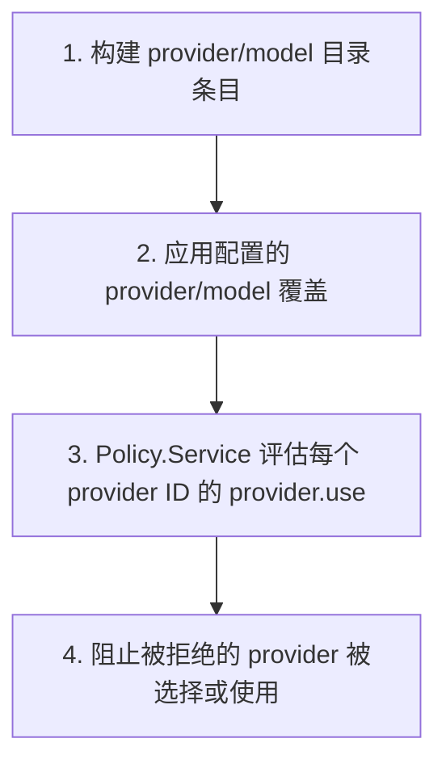
```mermaid
flowchart TB
    Build["1. 构建 provider/model 目录条目"] --> Overrides["2. 应用配置的 provider/model 覆盖"]
    Overrides --> Eval["3. Policy.Service 评估每个 provider ID 的 provider.use"]
    Eval --> Prevent["4. 阻止被拒绝的 provider 被选择或使用"]
```

Provider 策略适用于 provider 如何变得已知或可用的所有方式：models.dev 目录数据、环境凭据、保存的账户、内置 provider 插件、显式 provider 配置。

### 7.6 遗留迁移

遗留禁用列表 `disabled_providers: ["openai","google"]` 等价于两条 `deny` 语句；遗留允许列表 `enabled_providers: ["anthropic","openai"]` 等价于 `deny "*"` + 两条 `allow`。V2 用策略语句取代这些遗留字段。

---

## 第八章 插件系统与生命周期

### 8.1 插件作为扩展边界

`specs/v2/instructions.md` 把插件定位为 V2 的扩展边界：当逻辑应由集成提供而非容器本身时，向 `PluginV2.HookSpec` 添加钩子。钩子约定：

- 钩子接收不可变输入加可变输出。
- 可变对象输出暴露为 Immer draft。
- 当插件可阻止变更时含 `cancel: boolean`。
- 顺序触发钩子以保持确定性。
- 钩子名面向领域，如 `provider.update`、`model.update`、`account.activate`、`agent.generate`。
- 钩子载荷小且有类型，用 core schema。

钩子用于：注册 provider/model、应用 env/account/config 派生的启用、变换 SDK/provider 选项、实现生成行为（如 agent 生成）、在选择是策略而非状态时选择默认。**不**用作传输关注、UI 行为或兼容垫片的倾倒场。

### 8.2 插件启动

内置 core 插件由 `packages/core/src/plugin/boot.ts` 注册。当新 core 服务应可被插件用时：把服务加到 boot 层依赖类型、在层内 yield 服务、在 `add` 中向每个插件 effect 提供它、把其默认层加到 `PluginBoot.defaultLayer`（仅当不产生环时）。Boot 只做组合，不含 provider/account/agent/model 策略本身。

`specs/v2/catalog-config-plugin-lifecycle.md` 的核心决策是**选项 B（当前 core 选择）**：可重放的 Location 范围 Catalog 变换。插件注册可重放变换，每个变换接收 `Catalog.Editor`，其辅助方法变更私有 catalog draft；`Catalog` 从其活跃变换重新物化可见记录。

### 8.3 内置插件与顺序

`specs/v2/provider-model.md` 列出内置插件与加载顺序：

| 顺序 | 插件 | 依赖 |
| --- | --- | --- |
| 0 | `ModelsDevPlugin` | ProviderV2/ModelV2/ModelsDev.Service |
| 10 | `EnvPlugin` | ProviderV2/Env.Service |
| 20 | `AccountPlugin` | ProviderV2/AccountV2.Service |
| 30 | `ProviderPlugin` | ProviderV2 |
| 40 | `ConfigPlugin` | ProviderV2/ModelV2/Config.Service |
| 50 | `DiscoveryPlugin` | — |

以及 `AnthropicPlugin`、`OpenRouterPlugin`、`AmazonBedrockPlugin`、`GoogleVertexPlugin`、`GitLabPlugin`、`GitLabDiscoveryPlugin`。`ModelsDev` 与 `Account` 成为 config 变换而非 catalog 依赖：它们在 catalog 读取前变换 config。

### 8.4 生命周期场景

`specs/v2/catalog-config-plugin-lifecycle.md` 详述了多个场景的变换行为。以初始加载为例：

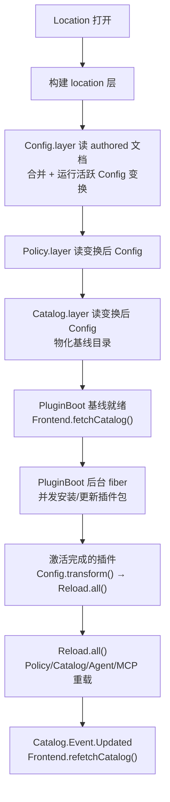
```mermaid
flowchart TB
    Open["Location 打开"] --> Layer["构建 location 层"]
    Layer --> ConfigLayer["Config.layer 读 authored 文档<br/>合并 + 运行活跃 Config 变换"]
    ConfigLayer --> PolicyLayer["Policy.layer 读变换后 Config"]
    PolicyLayer --> CatalogLayer["Catalog.layer 读变换后 Config<br/>物化基线目录"]
    CatalogLayer --> Ready["PluginBoot 基线就绪<br/>Frontend.fetchCatalog()"]
    Ready --> BG["PluginBoot 后台 fiber<br/>并发安装/更新插件包"]
    BG --> Activate["激活完成的插件<br/>Config.transform() → Reload.all()"]
    Activate --> Reload["Reload.all()<br/>Policy/Catalog/Agent/MCP 重载"]
    Reload --> Event["Catalog.Event.Updated<br/>Frontend.refetchCatalog()"]
```

关键点：初始层构建**不是**重载。`Reload.all()` 仅在 live location 变更后运行（如后台插件变活跃或 config 源变更）。去抖减少多个插件近乎同时完成时的重复全服务重载；每批仍重载每个 config 消费服务，因为 config 变换可变更任意字段。一次重载产生至多一个 `Catalog.Event.Updated` 通知。

### 8.5 插件禁用与 config 编辑

插件禁用关闭其 scope，`Config` 在 finalizer 内部注销变换，然后 `Reload.all()` 让服务重新物化而无需手动撤销。config 编辑由文件 watcher 见到，记录新文档后触发 `Reload.all()`。models.dev 定时器刷新触发 `ModelsDevPlugin.refresh()`，变换 config 后重载。Account 切换触发 `AuthPlugin.refresh()` 变换 config 后重载。

### 8.6 V1 插件钩子面

`packages/opencode/src/plugin/` 实现的 V1 插件系统（`@opencode-ai/plugin` 的 `Hooks` 接口）暴露更丰富的触发钩子面：`chat.message`、`chat.params`、`chat.headers`、`permission.ask`、`command.execute.before`、`tool.execute.before/after`、`shell.env`、`experimental.chat.messages.transform`、`experimental.chat.system.transform`、`experimental.provider.small_model`、`experimental.session.compacting`、`experimental.compaction.autocontinue`、`experimental.text.complete`、`tool.definition`。这些钩子在 session/tools、session/prompt、session/llm/request、session/compaction、session/processor、tool/registry、tool/shell、agent/agent 等处被触发。

V1 插件加载顺序（`plugin/index.ts`）：内部 auth 插件（CodexAuthPlugin、CopilotAuthPlugin、GitlabAuthPlugin 等，受 `disableDefaultPlugins` 控制）→ 外部插件（`PluginLoader.loadExternal`，server/tui kind）→ 每个插件的 `config?.()` → 事件订阅。入口点解析（`plugin/shared.ts`）读 `exports["./server"]`/`exports["./tui"]` 或 `main`，强制解析路径在插件目录内。插件元数据（首次/更新/相同状态、指纹）存于 `Global.Path.state/plugin-meta.json`。

### 8.7 模型与服务形态

`specs/v2/instructions.md` 规定 core 服务应像 `Catalog`、`AccountV2`、`AgentV2` 那样：顶部定义带 brand 的 ID 与 schema，定义有类型错误，定义只含小动词的 `Interface`，暴露 `Context.Service`，用私有内存状态实现 `layer`，暴露带显式依赖的 `defaultLayer`，自导出。偏好「哑容器 API」：`get`/`all`/`available`/`default`/`update`/`remove`/`activate` 等小领域动词；`update(id, draft => ...)` 用于注册与变更；在提交变更前调用钩子（当插件需丰富、取消或校验变更时）；提交变更后发事件（当其他服务或前端需反应时）。

避免把应用策略直接放 core 服务，除非是领域不变量。例如解析模型端点继承是 catalog 拥有的；决定注册哪些 provider 是插件拥有的。

---


### 1.12 为什么选择 Effect 而非传统 OOP 框架

理解 OpenCode 的代码组织，必须先理解它对 Effect 的深度依赖不是偶然的工程偏好，而是被其核心问题倒逼出的必然选择。OpenCode 要解决的问题是：在一个单进程内，同时驱动多个并发会话、多个工具调用、多条流式 LLM 响应、多个文件系统观察器与多个 LSP 客户端，并且每一个都要可中断、可重试、可观测、可测试，还要在失败时给出有类型的错误而非堆栈崩溃。

传统 OOP 框架用类继承与回调处理这类问题，会迅速陷入「回调地狱」与「异常传播边界不清」的困境：一个工具调用失败究竟应该让整个会话终止，还是只标记该工具为失败并让模型重试？这个决策需要类型精确地表达。Effect 提供了三件关键武器：

第一，**有类型的错误通道**。一个 `Effect.Effect<A, E, R>` 类型同时声明了成功值 `A`、失败类型 `E` 与所需环境 `R`。这意味着 `SessionRunner.run` 的类型 `Effect.Effect<void, RunError, …>` 直接告诉调用方：它要么成功完成、要么以 `RunError`（`LLMError | SessionRunnerModel.Error | MessageDecodeError | ContextSnapshotDecodeError | SystemContext.InitializationBlocked | ToolOutputStore.Error`）失败，且失败是穷举的——编译器强制每个调用点要么处理、要么显式向上传播。这与 JavaScript 的 `try/catch` 捕获任意值形成鲜明对比，后者在大型代码库中会让错误处理变成猜谜游戏。

第二，**结构化并发与中断**。Effect 的 `Fiber` 是可组合的可中断并发单元。`SessionRunCoordinator` 利用 `Fiber.interrupt(owner)` 精确地中断一个会话的排空（drain）而不影响其他会话；`FiberSet` 让 runner 可以同时启动多个工具调用、在流关闭后统一等待所有结算完成，并用 `Effect.raceFirst(FiberSet.join(fibers), FiberSet.awaitEmpty(fibers))` 表达「全部完成或全部为空」的等待语义。中断在 Effect 中是一等公民：`Effect.uninterruptibleMask` 划定「中断安全区」，保证工具结算的完成区不会被用户按 Esc 打断到一半——这是 V2「被放弃的副作用从不被静默重放」这一不变量的工程基础。

第三，**环境即依赖注入**。`R` 通道让服务依赖成为类型的一部分。`SessionRunner` 的 layer 声明了它的依赖（`EventV2.node`、`llmClient`、`AgentV2.node`、`ToolRegistry.node` 等十余个），`AppNodeBuilder` 在编译期构建依赖图、检测环、按拓扑顺序提供。这意味着「哪个 Location 的服务被注入」不再是运行时字符串查找，而是类型层的保证。V2 的「Location 化」——runner、目录、工具注册表按 Location 缓存，而 `SessionExecution` 与 `SessionStore` 进程全局——正是靠 `Effect.provide(locations.get(session.location))` 在运行时切换服务层实现的。

### 1.13 为什么选择事件溯源

V2 运行时的脊柱是 EventV2 持久事件溯源，而非传统的「直接更新状态」。这个选择解决了一组紧密耦合的难题：

- **跨进程恢复**：进程崩溃后重启，如何知道某个会话进行到哪一步？直接 CRUD 的状态表无法回答「崩溃前模型是否已开始输出」这种问题，因为状态要么已更新（但副作用可能只完成一半）要么未更新（但模型可能已响应）。事件溯源把「发生了什么」作为第一性事实：每个工具调用在副作用开始前就持久化 `Tool.Called` 事件，流式文本的每个完整片段持久化为 `Text.Ended`。重启后从事件序列重放，能精确重建「模型已输出到何处、哪些工具已记录但未结算」。
- **精确重试与幂等**：重用同一个消息 ID 准入提示，在事件层是幂等的——`admit` 先 `find(id)`，已存在则直接返回。事件存储的 `commitDurableEvent` 做幂等检查（同 id/type/seq/data → no-op）与全序检查（`seq === latest + 1`），保证并发或重试不会产生重复或乱序事件。这对网络化与嵌入式共享同一客户端尤其关键：一个不可靠的传输重发同一请求，不会污染会话状态。
- **可重放的审计与分享**：分享一个会话给他人，本质是把它的持久事件流发送给后端重放。`ShareNext.create` 快照会话信息、消息、部分与 diff；`EventV2Bridge.listen` 把每个持久事件额外发一个 `{type:"sync", syncEvent}` 载荷，正是远程实例重放的精确形状。工作区同步同理：`syncWorkspaceLoop` 用 SSE 流传输 sync 事件，对端 `EventV2Bridge.replay({publish:true, ownerID})` 重放。

代价是写路径更复杂：每次状态变更要先发布事件、在事务内运行投影器、再提交。但这个代价换来的是「持久状态永远不会与已发生事实脱节」的强保证。`CONTEXT.md` 关系 #104 精确陈述了这一权衡：「一个 Session Drain 是进程本地协调而非持久领域实体。持久恢复须从提示、投影历史、provider 尝试与工具状态推理，而非发明一个包围的执行身份。」——即：执行可以崩溃重启，但事实（事件）不可丢失。

### 1.14 与同类产品的架构差异

把 OpenCode 放在同类 AI 编码代理（如 Claude Code、Cursor、Aider）的语境中比较，能凸显其独特设计。多数同类产品把「会话」当作一个内存对象，状态变更直接更新该对象，崩溃即丢失。OpenCode 的不同在于它把会话建模为一个**事件溯源的持久聚合**，drain 只是进程本地对这个聚合的一次临时推进，而非聚合本身。

这意味着 OpenCode 天然支持几个其他产品难以做到的场景：多客户端同时观察同一会话（TUI、Web、IDE 各自订阅同一事件流，状态一致）；会话暂停后从任意点 fork（`session.next.unstable_fork`，因为历史是事件序列，fork 只是复制前缀）；跨工作区移动会话（`sessionWarp`，把事件日志批量上传到目标工作区重放）。这些能力的根源都是「事实优先于执行」的事件溯源哲学。

### 1.15 阅读路径建议

本文档面向不同读者提供不同入口。想快速建立整体心智模型的读者，建议按顺序读第一至四章，然后跳到第九章 V2 运行时总论；想理解一次提示如何变成工具执行的读者，第九至十六章是核心；想扩展 OpenCode（自定义 provider、模型、工具、技能）的读者，第五至八章与第十七至十九章是重点；关心部署与运维的读者，第二十三至二十五章即可。每章尽量自包含，但 V2 运行时章节存在较强的前后依赖，建议顺序阅读。

---

### 第二章延伸：包边界的工程纪律

### 2.6 为什么 Schema 必须零依赖

`packages/schema` 不得传递加载数据库、Drizzle、Session 执行、Provider、watcher、原生模块或 WASM——这不是风格偏好，而是硬性的可发布性约束。原因在于 `@opencode-ai/client` 的 root 包要打成浏览器安全的 bundle，它依赖 Schema 与 Protocol。如果 Schema 间接依赖 `better-sqlite3` 或 `@lydell/node-pty` 这类原生模块，浏览器 bundle 就无法构建。

OpenCode 用导入边界测试（`packages/client/test/import-boundaries.test.ts`）强制这一点：它 bundle root 入口并断言不含 effect/schema/protocol/core/server；bundle `/effect` 入口并断言含 effect+schema+protocol 但永不 core/server。这个测试在 CI 中运行，任何破坏边界的改动都会被立即捕获。这是「契约即不变量」哲学的工程体现：不是靠文档约定，而是靠可执行测试守护。

### 2.7 双引擎共存的过渡策略

仓库同时存在 V1（`packages/opencode/src/session/` 的 `SessionPrompt` 单体）与 V2（`packages/core/src/session/`）两套运行时，这是大型系统演进的现实。直接重写会冻结所有功能开发数月，且无法逐步验证。OpenCode 选择的策略是「并存 + 桥接 + 逐步替换」：

- V2 是增量开发的，`runner/llm.ts` 头部注释用 checklist 标注每个能力的状态（`[x]` 完成、`[ ]` 未完成），使演进可追踪。
- `event-v2-bridge.ts` 让两套运行时共享同一持久事件流：V1 已可见的提示以相同 `Prompted` 事件发布到 V2 流，使新旧投影保持一致。
- `specs/v2/session.md` 维护一张「V1 运行时上下文对等」清单，逐项标注 V1 行为在 V2 的 complete/partial/missing 状态，确保替换前不遗漏功能。

这种策略的代价是代码库短期内更复杂（两套运行时、迁移代码、桥接层），但收益是演进可控、可回滚、可验证。当 V2 覆盖全部 V1 行为后，V1 才会被移除。

### 2.8 代码生成消除手工同步

`AGENTS.md` 规定：改动公开 Protocol 或 Server 的 `HttpApi` 后，须在 `packages/client` 运行 `bun run generate`，不要直接编辑 `src/generated` 或 `src/generated-effect`。这是「单一真相源 + 代码生成」模式的纪律。

其价值在于：当 Server 新增一个端点（如 `session.history`），Client 与 SDK 的类型与方法会自动从权威 `HttpApi` 反射生成，无需手工同步、不会漂移。`httpapi-codegen` 把 `HttpApi` 编译成 SDK Contract IR——一个运行时无关的中间表示，保留编码与解码类型投影及传输元数据。Promise 与 Effect 两种发射器从同一 IR 派生，但可独立选择公开值模型：Promise 发射器剥离 brand 产出零 Effect 的结构化 wire 类型；Effect 发射器保留 brand 与 schema 变换产出富解码类型。这样同一份契约既能服务需要轻量 Promise 客户端的浏览器，又能服务需要完整类型安全的 Effect 嵌入式主机。

### 2.9 嵌入式的内存执行模型

`@opencode-ai/sdk-next` 的 `OpenCode.create` 做了一件精妙的事：它把 Server 的 `HttpRouter` 在内存中执行，而非打开监听端口。具体地，`createEmbeddedRoutes()` 被转成 Web handler，包装成一个假 `fetch` 函数，再通过 `FetchHttpClient` 提供给同一个生成的 Effect 客户端（`OpenCode.make` from `@opencode-ai/client/effect`）。

这意味着嵌入式主机与网络化主机走**完全相同**的代码路径：相同的路由、中间件、编解码、错误边界，唯一区别是 `HttpClient` 传输实现（内存函数 vs 网络 fetch）。这保证了「嵌入式不会因为绕过了网络层而丢失认证、校验或 SSE 语义」——因为那些都是路由/中间件层的责任，而非传输层。代价是嵌入式调用仍有完整的 HTTP 编解码开销（序列化/反序列化），但这换来的是「两种模式行为完全一致」的强保证，远比维护两套代码路径安全。

---

### 第三章延伸：启动路径与惰性加载

### 3.7 命令的惰性初始化

`AGENTS.md` 的导入规约强调：对只在选定代码路径需要的重模块优先用动态导入，尤其在启动敏感的入口点。CLI 入口遵循这一规约：命名子命令被设计为惰性加载，避免启动时初始化 TUI 等重模块。

这对启动延迟的实际影响显著。`opencode --version` 不应触发 OpenTUI 的 Solid JSX 配置加载，`opencode models` 不应初始化数据库连接。每个命令模块在 yargs 注册时只声明其元信息（命令名、参数描述、handler 引用），handler 体内的重导入（如 `Server`、`AppRuntime`）在命令真正执行时才解析。`effectCmd` 进一步用 `AppRuntime` 的动态导入（`@/effect/app-runtime`）保证服务层只在需要 Effect 运行时的命令中构建。

### 3.8 实例生命周期与并发加载

`InstanceStore.load` 是 `Effect.uninterruptibleMask`，按解析后的目录键控，用每目录一个 `Deferred<InstanceContext>` 合并并发加载：启动被 fork 进 layer scope（`Effect.forkIn(scope, { startImmediately: true })`），使并发加载合并到同一 deferred。这避免了「同一目录被两个请求同时启动两个实例」的竞争。

启动流程 `InstanceBootstrap.run` 是有序的：`config.get()`（eager，为追踪）→ `plugin.init()`（插件可变更 config，须在一切之前）→ 并发 `init()` LSP/shareNext/format/vcs/snapshot/project。每个服务用 `Effect.forkScoped` 把慢工作放进自己的 per-instance scope 自管理。拆除时，`dispose` 先 await deferred，再 `runDisposers`（`registerDisposer` 注册的清理函数 `Promise.allSettled`）并发执行，最后发 `server.instance.disposed` 事件。

### 3.9 进程内服务器与端口回退

`Server.listen` 的端口回退逻辑（`startWithPortFallback`）反映了 OpenCode 对开发体验的关注：端口 `0` 先试 **4096**（OpenCode 的默认端口），若被占用则回退到任意空闲端口。这使开发者运行多个 opencode 实例时，第一个占 4096，后续自动找空端口，无需手动配置。

`--mini`/`run` 的非交互模式更进一步：它根本不监听 TCP，而是把整个 HTTP 应用在进程内运行（`Server.Default().app.fetch`），通过一个自定义 `fetch` 函数把 SDK 调用直接路由进进程内服务器。这消除了网络往返，使 `opencode --mini "fix the bug"` 这种单次命令极快。`http://opencode.internal` 这个 baseUrl 从不真正发起网络请求，只是 SDK 客户端的占位。

### 3.10 信号转发与强制退出

`packages/opencode/bin/opencode` 这个 Node shim 做了一件容易被忽略但重要的事：它把 `SIGINT`/`SIGTERM`/`SIGHUP` 转发给子进程，并在子进程退出后用相同的信号重新 raise。这保证了 Ctrl+C 能正确传播到编译后的二进制，即使 shim 与二进制是两个进程。

入口的 `finally { process.exit() }` 是另一个看似粗暴实则必要的决定：它强制退出进程，使得子进程（尤其是 docker-container 形式的 MCP 服务器）不会在 SIGTERM 时挂起。OpenCode 的设计假设是「干净的关闭是尽力而为的，但进程必须最终退出」——这与它作为 CLI 工具的角色一致，而非长期运行的服务端进程。

---

### 第四章延伸：契约层的细节权衡

### 4.10 Promise 客户端为何不做运行时校验

`CONTEXT.md` 明确：Promise 客户端解析响应语法但信任其生成的结构类型，**不做**运行时结构校验。合法 JSON 语法错会失败，但结构形态不匹配不会被 SDK 边界检测。这是一个有意的权衡。

原因在于 Promise 客户端的目标场景：轻量、零 Effect 依赖、浏览器友好。运行时 schema 校验会拖慢每次响应解析、增大 bundle 体积，与目标冲突。取而代之的是：类型由 IR 生成保证编译期正确；运行时只做最小语法检查。如果服务端（权威源）行为正确，生成的结构类型就匹配。当需要运行时校验时，用 Effect 客户端——它执行运行时 schema 解码。这把「类型安全级别」的选择权交给消费者，而非强加一种。

### 4.11 两种事件流的刻意区分

`sessions.events({ sessionID, after })` 与 `events.subscribe()` 的区分是 OpenCode 设计中最容易混淆、也最关键的契约决策之一。前者是**持久、可重放、序列游标**的会话事件流：验证会话存在、在可选聚合序列后重放持久事件、继续提交的新持久事件、排除仅 live 片段。后者是**实例级 live 流**：无重放保证、含连接/心跳/销毁生命周期事件、绑定到连接的实例或工作区。

`CONTEXT.md` 用一段强调这一区分：「一个 Session ID **不是** `events.subscribe()` 的可选过滤：实例级 live 事件与持久 Session 事件有不同的 schema、重放保证、游标、生命周期与失败行为。」强行用 `events.subscribe` 加 sessionID 过滤来模拟 `sessions.events` 是错误的，因为前者可能丢失事件（无重放）、后者保证不丢。

这个区分的实际后果：一个 UI 客户端要显示某会话的完整历史并能继续追尾新事件，必须用 `sessions.events({ sessionID, after })`，断线后用最后观察的 `after` 序列重连重放；而要显示「整个实例的活跃会话列表变化」则用 `events.subscribe()`，断线后刷新权威状态重订阅。两个需求、两个流、两种语义，不可混用。

### 4.12 Page 与游标的不透明性

列表操作的 Page 概念要求游标是**不透明的 brand 值**：消费者原样传回，不检视存储锚点或编码字段。初始请求固定范围、过滤、排序与页大小，这些状态由游标携带；延续只接受游标，不接受重新指定这些参数。

这个设计的目的是防止一类微妙 bug：如果游标是透明的、消费者可以修改其中的 `order` 或 `filter`，那么「用 A 过滤取第一页、再用 B 过滤取第二页」会产生语义不连续的结果。不透明游标强制「一次查询一种分页语义」，使分页行为可预测。`SessionsCursor` 是 base64url 编码的 JSON（`{ ...query, anchor: { id, time, direction } }`），但消费者不应依赖这一内部表示——它可能在版本间变化。

### 4.13 错误的领域/基础设施二分

Promise 客户端把失败分为两类，对应 Effect 客户端的领域/基础设施错误划分：

- **声明的领域失败**：保留有类型的结构化 wire 值，配生成的类型守卫（如 `isSessionNotFoundError`）。消费者不依赖生成的 `Error` 子类身份，以跨包副本与 realm 保持判别能力——这避免了「两个 `@opencode-ai/client` 副本导致 `instanceof` 失败」的经典 npm 陷阱，改用结构化 `_tag` 判别。
- **基础设施失败**：一个生成的 `ClientError` 类，结构化原因如 `Transport`（fetch 抛错）、`UnexpectedStatus`（未声明状态码）、`UnsupportedContentType`、`MalformedResponse`（JSON 解析失败或 SSE 缓冲超 1MB）。

这种二分让消费者能精确处理「会话不存在」（领域失败，业务逻辑）与「网络断了」（基础设施失败，重试或报错），而非笼统的 `catch (e)`。

---

### 第五章延伸：配置的实际加载细节

### 5.6 多源合并的顺序与优先级

配置加载顺序（`Config.loadInstanceState`）的 8 个步骤不是任意的，而是反映了「谁应该覆盖谁」的策略。`wellknown` 远程配置最先加载，因为它代表企业/团队的全局基线；MDM 托管配置最后加载且最高优先级，因为它代表组织强制策略。账户/org 配置在中间，使登录的账户能覆盖本地配置但被 MDM 覆盖。

普通设置向前读（location 特定覆盖用户全局），但策略倒序读（用户全局覆盖仓库）。这个不对称是深思熟虑的：普通设置中，更具体的位置应胜出（项目覆盖用户全局）；但策略中，用户应能阻止仓库重新启用被其全局拒绝的 provider——否则一个不信任的仓库配置就能静默启用用户不想用的 provider。这体现了「策略是安全边界，设置是偏好」的本质区别。

### 5.7 变量展开的安全考量

`ConfigVariable.substitute` 展开 `{env:VAR}` 与 `{file:path}`。这使配置可以引用环境变量而不硬编码凭据，如 `"headers": { "Authorization": "Bearer {env:API_KEY}" }`。但这也意味着配置文件中的 `{env:...}` 会在加载时被替换——如果配置来自不可信来源（如远程 `well-known`），可能注入敏感环境变量值。

OpenCode 通过分层加载缓解这一点：`wellknown` 配置作为 scope `"global"` 合并，但用户可以在更高优先级层覆盖。远程配置的 `remote_config` JSON 也是受控的。然而，`{file:path}` 展开允许配置引用任意文件路径，这在多租户场景需要审计。这是配置灵活性与安全性的经典权衡，OpenCode 倾向灵活性，把信任决策留给部署者。

### 5.8 JSONC 感知更新的必要性

配置更新用 `jsonc-parser` 的 `modify`/`applyEdits` 而非 `JSON.parse`+`JSON.stringify`，因为后者会丢失注释与格式。OpenCode 的配置文件常含注释（`opencode.jsonc`），用户期望 `opencode` 命令修改配置后注释仍在。`jsonc-parser` 的编辑操作保留非编辑区域的原始文本，只替换变更部分。这是一个小但显著的用户体验细节，体现了「工具应尊重用户的手写文件」的原则。

### 5.9 TUI 配置的独立性

TUI 有自己独立的配置管线（`TuiConfig` 服务），文件栈是 `tui.json[c]`（全局 + `.opencode` 目录 + `OPENCODE_TUI_CONFIG`），与主配置分离。这反映了 TUI 作为独立包的边界：它的主题、键绑定、滚动速度等是 TUI 本地关注，不属于后端领域配置。`tui:` 键的遗留扁平化迁移（`migrateTuiConfig`）把旧配置中的 `tui:` 段提升到独立 `tui.json`，保持向后兼容。

这种分离的一个后果是：TUI 配置变更不会触发后端服务重载，反之亦然。TUI 自己管理其配置的失效与重渲染，与 `Catalog.Event.Updated` 驱动的后端重载解耦。这避免了「改一个键绑定导致 provider 目录重载」这类不必要的工作。

---

### 第六章延伸：模型目录的动态性

### 6.7 models.dev 作为目录数据源

`ModelsDev` 服务从 `https://models.dev/api.json` 抓取模型元数据，这是 OpenCode 维护的一个公共模型目录。它提供模型的成本、限制、能力、模态、发布日期等结构化信息，使 OpenCode 不必为每个 provider 硬编码模型列表。

`fromModelsDevModel`/`fromModelsDevProvider` 转换函数把 models.dev 的 wire 格式转为 opencode 的 `Model`/`Provider`。关键的转换是 `api.id = model.id`、`api.url = model.provider?.api ?? provider.api`、`api.npm = model.provider?.npm ?? provider.npm ?? "@ai-sdk/openai-compatible"`。`experimental.modes`（如某模型的高/低推理模式）被爆炸为 `<model-id>-<mode>` 伪模型，每个带独立的 body/headers 覆盖。

缓存策略是 5 分钟 TTL + 进程间 `Flock` 锁 + 每 60 分钟后台刷新，并回退到编译时快照 `OPENCODE_MODELS_DEV`。这平衡了新鲜度（模型频繁更新）与启动速度（不必每次启动都网络请求）。`Flock` 锁防止多个 opencode 进程同时刷新缓存造成重复请求。

### 6.8 选项 lowering 的 provider 特异性

`ProviderTransform.options` 的复杂度源于不同 provider/模型族的选项语义差异巨大。例如：OpenAI 的 GPT-5 族需要 `store: false`（不留存到 OpenAI 账户）与 `include: ["reasoning.encrypted_content"]`（返回加密推理以便延续）；Google Gemini 需要 `thinkingConfig` 而非 `reasoningEffort`；Anthropic 需要 `thinking: { type: "enabled", budget_tokens }`；阿里需要 `enable_thinking`；Vertex-Anthropic 需要 `toolStreaming: false`。

这些差异不是偶然的，而是各 provider API 设计的历史包袱。OpenCode 用 `variants(model)` 矩阵把「推理 effort」这一跨 provider 概念映射到每族的具体选项：`WIDELY_SUPPORTED_EFFORTS = ["low","medium","high"]`，但底层对 Anthropic 是 `thinking.budgetTokens`、对 OpenAI 是 `reasoning.effort`、对 Google 是 `thinkingConfig.thinkingBudget`。模型版本门控辅助（`anthropicOpus47OrLater`、`anthropicSonnet5OrLater`）处理「同一族内不同版本支持不同 effort」的细微差别。

### 6.9 缓存断点的策略

Anthropic 协议的缓存断点（`ANTHROPIC_BREAKPOINT_CAP = 4`）是一个需要理解的性能细节。Anthropic 的 prompt caching 允许标记最多 4 个断点，缓存断点之前的内容，后续请求若前缀相同则命中缓存、降低成本与延迟。预算分配顺序是 tools → system → messages：工具定义通常稳定（缓存价值高），系统提示次之，消息变化频繁。

超额时（超过 4 个候选断点）会丢弃并告警——这是「尽力优化」而非强制。`applyCaching` 在前 2 个 system 部分 + 后 2 个消息上放临时 `cacheControl` 标记，是 OpenCode 对「哪些内容最值得缓存」的启发式。这直接影响长会话的成本：一个 50 轮的会话，若每轮都全量发送历史，成本线性增长；有了缓存，前缀稳定部分命中缓存，成本近常数。

### 6.10 模型选择的回退链

`currentModel` 的解析是三级回退：session 行的 model → 上次用户消息的 model → `provider.defaultModel()`。`defaultModel` 自己又是一级回退：`cfg.model` → 最近模型文件 `Global.Path.state/model.json` → 第一个有模型的 provider。这个回退链保证了「即使用户从未显式选模型，OpenCode 也能跑起来」。

`getSmallModel` 的优先级（`gemini-flash`、`gpt-nano`、`claude-haiku`）是为标题/压缩/摘要这类轻量任务设计的——这些任务不需要强模型，用小模型省钱省时。`small_model` 配置被移除，因为其唯一消费者是标题生成，改为直接配 `title` agent 的模型，语义更清晰。

---

### 第七章延伸：策略评估的语义细节

### 7.7 「最后匹配胜出」而非「最具体胜出」

策略评估用「最后匹配语句决定结果」而非「最具体资源自动胜过通配资源」，这是一个重要的设计选择。许多权限系统（如 AWS IAM）有「显式拒绝优先」或「最具体匹配优先」的规则，OpenCode 刻意没有采用。

原因是简单性与可预测性。「最后匹配胜出」让用户只需按书写顺序读就能预测结果，无需理解隐式优先级规则。要拒绝除 Anthropic 外的所有 provider，写两条语句：先 `deny "*"`，再 `allow "anthropic"`——最后匹配（allow anthropic）胜出。要允许内部除实验外的，写 `deny "*"`、`allow "company-*"`、`deny "company-experimental-*"`——最后匹配胜出，`company-experimental-fast` 被 deny。

代价是用户必须理解「顺序重要」并正确排列语句。但「最后匹配胜出」是大多数配置系统（如 iptables）的直觉模型，比「显式拒绝优先 + 最具体优先」的组合更容易推理。`specs/v2/provider-policy.md` 明确：「无模式特定优先级存在。一个特定资源不自动胜过通配资源。书写/评估顺序控制结果。」

### 7.8 插件不能改策略的安全意义

`specs/v2/provider-policy.md` 强调：「插件**不得**被允许添加、移除或覆盖策略语句。插件可贡献功能或配置的 provider；策略决定 opencode 是否通过其托管执行路径允许操作。」这个限制是安全核心。

考虑一个恶意插件：如果它能改策略，就能 `allow "*"` 解除所有限制。禁止插件改策略后，即使插件代码被入侵，它也无法绕过用户/组织设定的 provider 使用策略。策略是「托管执行路径」的守门人，而插件代码在「托管」之外运行（插件代码是任意 JS，需要单独治理）。这是「策略不是可执行代码的完整沙箱」的明确声明，但它是托管路径的强约束。

### 7.9 跨文档倒序读的实现

策略「按 authored 配置文档倒序读」的实现细节值得理解。普通配置合并是向前读（文档按优先级叠加），但策略需要「用户全局覆盖仓库」。实现上，文档列表被反转，每个文档内的语句保持书写顺序，然后顺序评估。

效果：若仓库配置 `allow "openai"` 而用户全局 `deny "openai"`，倒序读使「用户全局 deny」后于「仓库 allow」评估，最后匹配（deny）胜出——用户全局策略生效。这保证「一个仓库不能静默重启用被用户全局拒绝的 provider」。组织托管策略（未来）追加在倒序列表最后（即评估最末），使其有最终权威。

### 7.10 策略与权限的区别

`experimental.policies`（策略）与 `permissions`（权限）是两个不同系统，容易混淆：

- **策略**（`experimental.policies`）：控制 provider 使用等「操作是否允许」，只有 `allow`/`deny`，无 `ask`。它是一个小词汇表，可扩展到 `plugin.load`、`mcp.connect` 等操作。评估是 `findLast` 匹配。
- **权限**（`permissions`）：控制工具调用（bash/edit/read 等）是否允许，有 `allow`/`deny`/`ask`（交互式）。`ask` 让用户在运行时决定，可保存为永久规则。评估是 per-resource 的，任何 deny 则 deny、任何 ask 则 ask、否则 allow。

二者的分离反映了「组织级策略 vs 运行时工具授权」的语义差异。策略是部署治理工具（「这个组织不许用 OpenAI」），权限是交互安全工具（「这次 bash 命令要不要批准」）。

---

### 第八章延伸：插件钩子的调用约定

### 8.8 不可变输入与可变输出

插件钩子约定「接收不可变输入加可变输出，可变对象输出暴露为 Immer draft」。这个约定的目的是让钩子可以「丰富、取消或校验变更」而不破坏原始数据。Immer 的 draft 机制让插件可以直接修改 draft 对象（如 `model.name = "..."`），Immer 在后台生成不可变的新状态。

`cancel: boolean` 让插件能阻止变更（如 `provider.update` 钩子可以拒绝注册某 provider）。钩子顺序触发以保持确定性——同一组钩子按注册顺序执行，结果是确定的，不受并发或调度影响。这让插件组合可预测：若两个插件都 hook `model.update`，先注册的先执行，后注册的看到前者的修改。

### 8.9 钩子命名与领域导向

钩子名面向领域（`provider.update`、`model.update`、`account.activate`、`agent.generate`）而非实现（如 `onModelChange`）。这是「领域先于机制」原则的体现。钩子名描述领域事实，使插件作者无需了解内部实现就能理解钩子语义。

钩子载荷小且有类型，用 core schema。这避免「钩子接收整个应用状态再自己找需要部分」的臃肿设计。小载荷也使钩子调用廉价、可序列化（未来远程插件）。`specs/v2/instructions.md` 明确：「不要把钩子用作传输关注、UI 行为或兼容垫片的倾倒场。」钩子是领域扩展点，不是万能回调。

### 8.10 热重载的细粒度

V2 的「服务可热重载」目标意味着：一个模型更新应让依赖者对该更新反应，而不需要全局重载。`catalog.model.updated` 事件让前端重新获取目录，而不重启整个进程。这与 V1 的「改配置就重启」形成对比。

实现上，`Catalog` 的变换是可重放的：插件注册变换而非直接修改目录状态，`Catalog` 从活跃变换重新物化可见记录。插件禁用时关闭其 scope，`Config` 在 finalizer 内部注销变换，然后 `Reload.all()` 让服务重新物化——无需手动撤销插件的修改。这是「变换是声明式的、状态是衍生的」的设计，使增删插件是可逆的。

### 8.11 内部插件与外部插件的加载差异

内置 core 插件（`ModelsDevPlugin`、`EnvPlugin` 等）由 `plugin/boot.ts` 注册，是编译期确定的。外部插件（用户配置的 `plugins` 数组）由 `PluginLoader.loadExternal` 在运行时加载，支持 npm 包与本地文件。

加载顺序的确定性很重要：`Order` 常量定义 `modelsDev: 0, env: 10, account: 20, provider: 30, config: 40, discovery: 50`。这个顺序使 models.dev 数据先于 env 凭据、env 先于 account、account 先于 config 变换——每层看到前一层的结果。外部插件在此基础上加载，其钩子在内置插件之后触发。

外部插件的入口点解析（`plugin/shared.ts`）读 `exports["./server"]`/`exports["./tui"]` 或 `main`，强制解析路径在插件目录内（`resolvePackageFile`），防止路径遍历攻击。`engines.opencode` semver 门控（`checkPluginCompatibility`）确保插件声明兼容的 opencode 版本。这些是加载第三方代码的安全护栏。

---
## 第九章 V2 会话运行时总论

> 从本章起，我们进入 OpenCode 最复杂、也最核心的子系统——V2 会话运行时。它位于 `packages/core/src/session/` 与 `packages/core/src/system-context/`，公开门面是 `packages/core/src/session.ts` 的 `SessionV2`。`CONTEXT.md` 用一套精严的领域词汇定义了它的不变量，本章先用统一的语言建立整体心智模型，后续章节再逐层展开。

### 9.1 领域词汇表

`CONTEXT.md` 开篇即定义了一套刻意避免歧义的术语。理解这些术语是理解 V2 运行时的前提：

- **System Context（系统上下文）**：作为初始指令与按时间顺序更新呈现给模型的、结构化的上下文事实集合。**避免**称「system prompt」。
- **Session History（会话历史）**：在应用活跃压缩与 **Context Epoch** 截断后，为一次提供者回合投影出的按时间顺序的对话。**避免**称「Session Context」。
- **Context Source（上下文来源）**：System Context 中一个独立观察的有类型值，由稳定的 key、JSON codec、不可失败 loader、纯 baseline/update 渲染器与可选 removal 渲染器表示。**避免**称「prompt fragment」。
- **Mid-Conversation System Message（对话中系统消息）**：一条持久的时间顺序指令，告诉模型某个已变更 Context Source 的新生效状态。
- **Context Epoch（上下文纪元）**：一段期间，其间一个初始渲染的 System Context 作为不可变的 provider-cache 基线，结束于完成的压缩、Session 移动或需要新基线的不兼容上下文转换。
- **Baseline System Context（基线系统上下文）**：Context Epoch 开始时渲染的完整 System Context。**避免**称「live system prompt」。
- **Context Snapshot（上下文快照）**：可覆盖的、模型隐藏的 JSON 状态，用于比较每个 Context Source 与上一次被纳入提供者回合的值。
- **Safe Provider-Turn Boundary（安全提供者回合边界）**：紧接一次 provider 调用之前、在持久输入晋升与任何必需工具结算之后的时间点，此时上下文变更可按时间顺序纳入。
- **Admitted Prompt（已准入提示）**：被接受进 Session inbox 但尚未纳入 Session History 的持久用户输入。
- **Prompt Promotion（提示晋升）**：从待处理输入移除一条 Admitted Prompt 并把其用户消息追加到 Session History 的持久转换。
- **Provider Turn（提供者回合）**：对模型 Provider 的一次请求与从该请求投影出的响应。
- **Session Drain（会话排空）**：一个进程本地执行跨度，晋升合格输入并运行必需的 Provider Turn，直到没有即时延续。它**无**持久身份或转录边界。
- **Model Tool Output（模型工具输出）**：在 Session 历史中持久化、并重放给模型的 Core 执行工具结果的有界投影。
- **Managed Tool Output File（受管工具输出文件）**：在 OpenCode 共享工具输出目录下创建的临时文件，用于保留对 Session 历史而言过大的完整输出。

### 9.2 核心关系

`CONTEXT.md` 的「Relationships」一节用数十条关系刻画了运行时的不变量，这里提炼最关键的几条：

1. System Context 是由零或多个 Context Source 组合而成的不透明载体。
2. Session History 含投影的对话消息与已准入的 Mid-Conversation System Message；活跃的 Baseline System Context 是独立的 provider 请求状态。
3. 已变更的 Context Source 可产生一条 Mid-Conversation System Message，包含其新生效状态。
4. 当前 Context Snapshot 与对应的持久 Mid-Conversation System Message **原子地**推进。
5. 上下文变更在 Safe Provider-Turn Boundary **惰性**采样与纳入，**从不**在其源变更时异步推送。
6. 在 Safe Provider-Turn Boundary，新晋升的用户输入或已结算的工具结果**先于**任何合并的 Mid-Conversation System Message。
7. Admitted Prompt 是可重放的待处理输入，**尚未**模型可见。
8. Prompt Promotion 原子地消费 inbox 条目并追加其模型可见的用户消息。
9. Steering 提示在当前 Drain 仍需延续时，于下一个 Safe Provider-Turn Boundary 晋升；晋升任何新准入的用户输入会重置所选 agent 的 provider-turn 配额。
10. 排队提示在当前 Drain 需延续时不晋升；当 Session 本会空闲时，runner 晋升一条排队提示，然后在晋升另一条前重新评估延续。
11. Session Drain 是进程本地协调，而非持久领域实体。持久恢复须从提示、投影历史、provider 尝试与工具状态推理，而非发明一个包围的执行身份。
12. 第一次 provider 回合渲染最新完整 Baseline System Context 并初始化其 Context Snapshot，**不**发出冗余的 Mid-Conversation System Message；初始不可用的上下文则阻塞该回合。
13. 压缩开启新 Context Epoch：重新渲染 Baseline System Context 与 Snapshot；先前的 Mid-Conversation System Message 仍为持久审计历史，但离开投影的模型历史。

### 9.3 三大分离

V2 运行时的设计可归结为三大分离，它们是后续章节的主线：

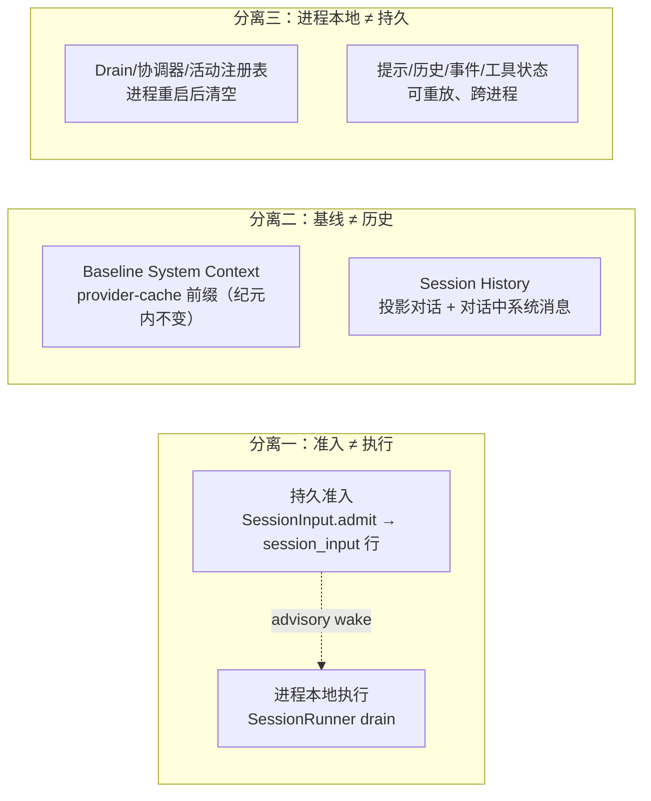
```mermaid
flowchart LR
    subgraph Sep1["分离一：准入 ≠ 执行"]
        Admit["持久准入<br/>SessionInput.admit → session_input 行"]
        Exec["进程本地执行<br/>SessionRunner drain"]
        Admit -.advisory wake.-> Exec
    end
    subgraph Sep2["分离二：基线 ≠ 历史"]
        Baseline["Baseline System Context<br/>provider-cache 前缀（纪元内不变）"]
        History["Session History<br/>投影对话 + 对话中系统消息"]
    end
    subgraph Sep3["分离三：进程本地 ≠ 持久"]
        Local["Drain/协调器/活动注册表<br/>进程重启后清空"]
        Durable["提示/历史/事件/工具状态<br/>可重放、跨进程"]
    end
```

- **持久准入与模型执行分离**：`SessionV2.prompt(...)` 在调度建议性 `SessionExecution.wake(sessionID)` 之前，先准入一条持久 `session_input` 行，除非 `resume: false` 请求仅准入行为。序列化的 runner 在安全边界把准入输入提升为可见用户消息。
- **基线与历史分离**：Baseline System Context 是纪元内不可变的 provider-cache 前缀；Session History 是投影对话。上下文变更产生对话中系统消息，进入历史；基线本身在纪元内不变，只在压缩/移动时整体替换。
- **进程本地与持久分离**：Session Drain、运行协调器、`sessions.active()` 活动注册表都是进程本地运行时状态，进程重启后清空；提示、投影历史、provider 尝试、工具状态是持久的、可重放的。

### 9.4 一次提示的全生命周期

下图是「一次用户提示从录入到任务收敛」的端到端时序，覆盖了准入、排空、纪元、提供者回合、工具结算与延续。后续章节会逐一展开每个阶段。

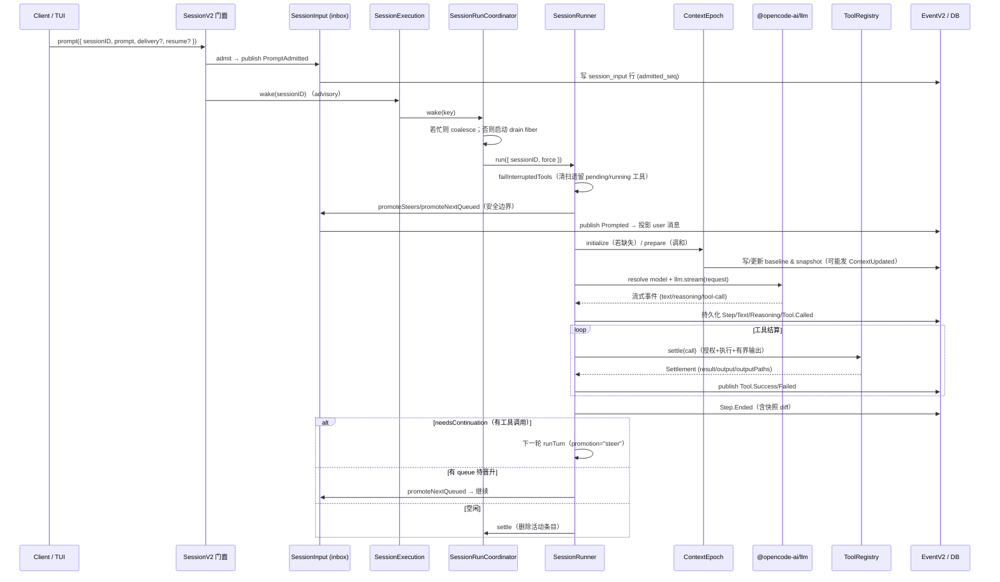
```mermaid
sequenceDiagram
    participant Client as Client / TUI
    participant Facade as SessionV2 门面
    participant Input as SessionInput (inbox)
    participant Exec as SessionExecution
    participant Coord as SessionRunCoordinator
    participant Runner as SessionRunner
    participant Epoch as ContextEpoch
    participant LLM as @opencode-ai/llm
    participant Tools as ToolRegistry
    participant Store as EventV2 / DB

    Client->>Facade: prompt({ sessionID, prompt, delivery?, resume? })
    Facade->>Input: admit → publish PromptAdmitted
    Input->>Store: 写 session_input 行 (admitted_seq)
    Facade->>Exec: wake(sessionID) （advisory）
    Exec->>Coord: wake(key)
    Coord->>Coord: 若忙则 coalesce；否则启动 drain fiber
    Coord->>Runner: run({ sessionID, force })
    Runner->>Runner: failInterruptedTools（清扫遗留 pending/running 工具）
    Runner->>Input: promoteSteers/promoteNextQueued（安全边界）
    Input->>Store: publish Prompted → 投影 user 消息
    Runner->>Epoch: initialize（若缺失）/ prepare（调和）
    Epoch->>Store: 写/更新 baseline & snapshot（可能发 ContextUpdated）
    Runner->>LLM: resolve model + llm.stream(request)
    LLM-->>Runner: 流式事件 (text/reasoning/tool-call)
    Runner->>Store: 持久化 Step/Text/Reasoning/Tool.Called
    loop 工具结算
        Runner->>Tools: settle(call)（授权+执行+有界输出）
        Tools-->>Runner: Settlement (result/output/outputPaths)
        Runner->>Store: publish Tool.Success/Failed
    end
    Runner->>Store: Step.Ended（含快照 diff）
    alt needsContinuation（有工具调用）
        Runner->>Runner: 下一轮 runTurn（promotion="steer"）
    else 有 queue 待晋升
        Runner->>Input: promoteNextQueued → 继续
    else 空闲
        Runner->>Coord: settle（删除活动条目）
    end
```

### 9.5 模块地图

下表给出 V2 运行时的核心模块及其职责，作为后续章节的索引：

| 模块 | 路径 | 职责 |
| --- | --- | --- |
| `SessionV2` 门面 | `packages/core/src/session.ts` | 公开能力：create/prompt/interrupt/resume/active/events/history/switchAgent/switchModel/revert |
| `SessionInput` | `packages/core/src/session/input.ts` | 持久 inbox：admit/projectAdmitted/projectPrompted/promoteSteers/promoteNextQueued/hasPending |
| `SessionExecution` | `packages/core/src/session/execution.ts` + `execution/local.ts` | 进程全局执行路由：active/resume/wake/interrupt |
| `SessionRunCoordinator` | `packages/core/src/session/run-coordinator.ts` | 每 key 序列化执行、wake 合并、interrupt |
| `SessionRunner` | `packages/core/src/session/runner/index.ts` + `llm.ts` | drain 循环与 provider 回合编排 |
| `SessionContextEpoch` | `packages/core/src/session/context-epoch.ts` | 纪元状态机：initialize/prepare/reset |
| `SessionHistory` | `packages/core/src/session/history.ts` | 历史投影（压缩 + 基线截断） |
| `SessionCompaction` | `packages/core/src/session/compaction.ts` | 自动/溢出压缩 |
| `SessionStore` | `packages/core/src/session/store.ts` | 读侧：get/context/runnerContext/message |
| `SessionProjector` | `packages/core/src/session/projector.ts` | 事件 → SQL 行投影 |
| `SystemContext` | `packages/core/src/system-context/index.ts` | 系统上下文代数：make/combine/initialize/reconcile/replace |
| `SystemContextRegistry` | `packages/core/src/system-context/registry.ts` | Location 范围注册表 |
| `ToolRegistry` | `packages/core/src/tool/registry.ts` | 工具注册表与结算 |
| `ToolOutputStore` | `packages/core/src/tool-output-store.ts` | 有界工具输出与受管文件 |
| `EventV2` | `packages/core/src/event.ts` | 持久事件存储与投影 |

---

## 第十章 系统上下文代数


### 9.6 投影与会话消息的分离

理解 V2 需区分「事件」「投影」「会话消息」三个层次。事件（`EventTable`）是持久事实——发生了什么。投影（`SessionProjector`）把事件转成 `session_message` 行——给查询用的物化视图。会话消息是投影的产物，但事件是真相源。

这种「事件→投影」分离使「同一事件可多种投影」可行。例如 `PromptAdmitted` 事件驱动 `session_input` 行写入（一种投影），未来可能驱动其他投影。投影可重建——若投影损坏，重放事件流即可重建，事件不可丢。这是事件溯源的核心价值。

`message-updater.ts` 是内存中的增量更新（immer），与持久投影（SQL）不同。内存消息是「当前会话的活视图」，用于 UI 渲染；持久投影是「可查询的历史」，用于 API。两者都从事件派生，但内存视图是临时的、优化的，持久投影是可靠的、可重放的。

### 9.7 聚合粒度：一个会话一个聚合

EventV2 的聚合粒度是「一个会话一个聚合」（`aggregate: "sessionID"`）。`EventSequenceTable` 的 `aggregate_id` 是 sessionID，每个会话有自己的 seq 序列。这是「同步是 per-session」的基础——`/sync/history` 发送 `aggregate_id → lastSeq` 的 watermark，对端返回该会话缺失的事件。

为什么是 per-session 而非 per-project 或全局？因为同步与分享的单元是会话——用户分享一个会话、移动一个会话、跨工作区迁移一个会话。per-session 聚合使这些操作隔离——操作会话 A 不影响会话 B 的 seq。全局 seq 会使「一个会话的事件推进全局序列」，跨会话操作耦合。

`EventSequenceTable.aggregate_id` 是同步 watermark：`Workspace.waitForSync` 轮询直到每个聚合 `seq >= state[id]`。这使「确保某会话同步完成」可等待——不是「全部同步完成」的粗粒度，而是 per-session 的精确等待。

### 9.8 pubsub 的唤醒通道

`EventV2` 用 `PubSub`（`pubsub.all`、`pubsub.durable`、`pubsub.typed`）做内存 fan-out。`commitDurableEvent` 提交后 `notify(event)` 唤醒这些通道。`durable` 通道唤醒 `sessions.events` 的 durable 流——新事件提交后，订阅的 SSE 流立即收到。

这是「事件提交→实时通知」的机制。持久事件提交（事务）完成后，pubsub 通知，订阅流读 SQLite 新行。这避免了「订阅者轮询 SQLite」的低效——事件驱动的 push 模型。

但 pubsub 是进程内的——跨进程同步靠 SSE 流传输 sync 事件，对端 replay。pubsub 只解决「同进程内订阅者感知新事件」。`durable` 通道与 `all` 通道区分：前者只 durable 事件，后者全部（含 live）。`sessions.events` 订阅 `durable`，`events.subscribe` 订阅 `all`。

### 9.9 领域词汇的「避免」清单

`CONTEXT.md` 的术语表不仅定义推荐用词，还列出「避免」用词，这本身是设计纪律。避免「system prompt」改用「System Context」——因为「system prompt」暗示静态字符串，而 System Context 是可组合、可比较、可增量更新的结构化集合。避免「Session Context」改用「Session History」——因为「Session Context」易与「System Context」混淆，而 Session History 是投影的对话历史，是不同概念。

这种「刻意避免歧义词」的词汇管理，使设计讨论精确。当有人说「系统提示」时，可能指静态字符串、可能指动态组装、可能指 provider 的 system 字段——歧义。用「System Context」明确指「结构化上下文事实集合」，无歧义。这种精确性对大型协作项目尤其重要——减少误解导致的实现偏差。

---


### 9.10 安全提供者回合边界的精确定义

「安全提供者回合边界」（Safe Provider-Turn Boundary）是 V2 运行时最微妙的概念之一，值得展开。它被定义为「紧接一次 provider 调用之前、在持久输入晋升与任何必需工具结算之后的时间点，此时上下文变更可按时间顺序纳入」。这个定义的每个限定词都承担职责。

「紧接 provider 调用之前」——上下文变更只在准备发起 provider 请求时被采样纳入，而非在源变更时异步推送。这意味着：如果用户在模型流式输出期间修改了 `AGENTS.md`，这个变更**不会**立即注入当前流，而是等到下一个回合边界（下一条 provider 请求发起前）才被采样。这避免了「流式输出中途插入系统消息导致模型困惑」的不一致状态。

「持久输入晋升之后」——新晋升的用户输入先于任何合并的对话中系统消息。这保证了模型看到的顺序是「用户说话 → 环境变更通知」，而非「环境变更通知 → 用户说话」。前者符合对话直觉：用户提问时，模型应先看到问题，再看到「对了，日期变了」这类背景更新。

「必需工具结算之后」——已结算的工具结果也先于对话中系统消息。如果模型调用了 `read` 工具，工具结果应在环境更新通知之前。这是「工具结果是当前事实，环境通知是背景」的排序原则。

这套顺序由 `runTurnAttempt` 中 `promoteSteers`/`promoteNextQueued`（晋升）先于 `SessionContextEpoch.prepare`（调和）的代码顺序精确实现。理解这个边界是理解「为什么上下文变更不会打断当前回合」「为什么 steer 在下一回合才生效」等行为的关键。

### 9.11 Provider Turn 的边界与投影

一个 Provider Turn 是「对模型 Provider 的一次请求与从该请求投影出的响应」。注意是「投影」而非「原始响应」——OpenCode 不存储 provider 返回的原始 wire 响应，而是存储投影后的会话消息（文本部分、推理部分、工具调用部分）。原始响应可能含 provider 特定的元数据（如 Anthropic 的 thinking signature、OpenAI 的 encrypted reasoning），这些被保留为「Native Continuation Metadata」在部分中，但模型可见的内容是投影后的。

这个投影的不可逆性是设计要点：一旦投影，原始响应不可重建。但投影保留了延续所需的足够信息——thinking signature 保留在 reasoning 部分的 `metadata` 中，下次同模型延续时重新组装进请求。模型切换后，这些 provider 原生元数据被省略（保守关系），非空可见推理降级为普通助手文本。`CONTEXT.md` 关系 #135 精确陈述：「provider 回合投影只在成功的精确发起 provider/model 匹配时包含 Native Continuation Metadata；失败的回合与不兼容模型省略不透明元数据。」

### 9.12 不可用上下文的 stale-while-revalidate

`SystemContext.unavailable` 不是「源被移除」，而是「源暂时无法观察」。这个区分至关重要：移除一个源会触发 removal 渲染（告诉模型「先前加载的指令不再适用」），而不可用则保留上次的生效值、不发出任何更新。

这是 stale-while-revalidate 语义：如果一个 Context Source 的 loader 临时失败（如读 `AGENTS.md` 时文件被锁），运行时保留上次成功观察的 snapshot 值，而非构造不完整基线或发出移除消息。当源恢复时，下次边界会检测到变更并发出更新。

这对纪元初始化尤其重要：第一次 provider 回合渲染基线时，若任一源不可用，`initialize` 失败 `InitializationBlocked`，**不**持久化不完整基线。回合不运行，输入保持 pending 与可重试。这避免了「基线缺失某源」的不一致状态——要么全部源就绪，要么等待。

### 9.13 drain 与持久恢复的关系

`CONTEXT.md` 关系 #104 是 V2 最反直觉但最重要的不变量之一：「Session Drain 是进程本地协调而非持久领域实体。持久恢复须从提示、投影历史、provider 尝试与工具状态推理，而非发明一个包围的执行身份。」

这意味着：如果进程在 drain 进行中崩溃，重启后**不**会自动恢复那个 drain。为什么？因为 drain 进行中崩溃时，状态是不确定的——模型可能已开始输出但未完成，工具可能已执行但未结算。自动恢复会面临「这部分模型输出要不要重发」「这个工具要不要重跑」的歧义，而重跑工具可能导致重复副作用（如重复创建文件）。

OpenCode 选择的保守策略：崩溃后不自动恢复 drain。用户需显式 `run`（resume）来继续，且 runner 的 `failInterruptedTools` 会把遗留的 `pending`/`running` 工具标记为 `Failed`，防止静默重放。未来「post-crash continuation recovery」是单独的设计切片，需显式建模 provider 歧义、必需延续、排队输入晋升、重试策略与可见恢复状态，且必须不假设一个 Session 模型本不需要的包围持久执行身份。

这是「事实优先于执行」哲学的极致体现：执行（drain）是易失的、可崩溃的，但事实（事件）是持久的、可重放的。恢复从事实重建，而非从执行身份续接。

### 9.14 agent 步数配额与重置语义

`CONTEXT.md` 关系 #102 描述了步数配额的重置：「晋升任何新准入的用户输入会重置所选 agent 的 provider-turn 配额；多个提示在一个边界晋升只重置一次。」这个「只重置一次」的细节很重要。

agent 的 `steps` 是一个 provider 回合的上限（如 50 步）。每步是一个 provider turn（模型一轮输出）。当用户在某回合边界晋升了输入（无论一条还是多条 steer），agent 的步数计数器重置为 1。但若一个边界晋升了 5 条 steer，计数器**只**重置一次（而非 5 次），避免「晋升多条输入获得更多步数」的漏洞。

这在 `runTurnAttempt` 中由 `if (promoted > 0) currentStep = 1` 实现——无论 `promoted` 是 1 还是 5，都只重置一次。当到达 `isLastStep`（`currentStep >= agent.info.steps`），runner 不再 materialize 工具、设 `toolChoice: "none"`、追加 `MAX_STEPS_PROMPT` 提示模型收尾。这防止 agent 无限循环工具调用。

---

### 10.1 动机：上下文作为可组合的、可比较的有类型源

模型在执行任务时需要大量「特权上下文」——运行环境的目录、操作系统、Git 状态、当前日期、项目的 `AGENTS.md` 指令、所选 agent 可用的技能指引等。这些上下文彼此独立、各有自己的数据类型、各自的变更频率。如果把它们简单拼成一个大字符串，就会面临几个难题：

- 如何在上下文源变更时，**只**告诉模型变更的部分，而不是每次重发全部？
- 如何在某个源暂时不可用时，保留上次的生效值而不发出不完整的基线？
- 如何让不同数据类型的源以统一方式组合？
- 如何保证组合是**确定性**的，不受注册顺序影响？

OpenCode 用一个代数（algebra）来解决：`SystemContext`。它的核心思想是把每个源建模为一个 `Source<A>`，用 `make` 关闭其类型 `A` 产生不透明的 `SystemContext`，再通过 `combine` 组合。解释器（`initialize`/`reconcile`/`replace`）观察一次组合后的上下文，产出持久的结构化 `Snapshot` 与精确的模型可见基线或更新文本。

### 10.2 类型定义

`packages/core/src/system-context/index.ts` 顶部定义了核心类型：

```ts
/** 稳定的命名空间身份 */
export const Key = Schema.String
  .check(Schema.isPattern(/^[a-z0-9][a-z0-9._-]*\/[a-z0-9][a-z0-9._/-]*$/))
  .pipe(Schema.brand("SystemContext.Key"))

/** 表示一个源无法被观察，且不视为被移除 */
export const unavailable = Symbol.for("@opencode/SystemContext.Unavailable")

/** 在值类型被 make 隐藏前定义一个有类型源 */
export interface Source<A> {
  readonly key: Key
  readonly codec: Schema.Codec<A, Schema.Json, never, never>
  readonly load: Effect.Effect<A | Unavailable>
  readonly baseline: (current: A) => string
  readonly update: (previous: A, current: A) => string
  readonly removed?: (previous: A) => string
}
```

注意几个要点：

- `Key` 必须是 `namespace/name` 形式的命名空间字符串（如 `core/date`、`core/instructions`），brand 保证不与其他字符串混淆。
- `unavailable` 是一个**全局 symbol**，表示「暂时无法观察」。它与「移除一个源」不同：refresh 保留已准入的 snapshot，replacement 等待而非静默构造不完整基线。
- `Source<A>` 的 `codec` 是一个 Effect `Schema.Codec`，既负责把 `A` 编码成 JSON 存入 snapshot，又负责从 JSON 解码回来做等价比较；`load` 是不可失败的 Effect（返回 `A | Unavailable`）；`baseline`/`update`/`removed` 是**纯函数**，产出模型可见文本。

### 10.3 代数运算

`SystemContext` 是一个不透明载体，内部持有 `ReadonlyArray<PackedSource>`。三个核心运算是 `initialize`、`reconcile`、`replace`：

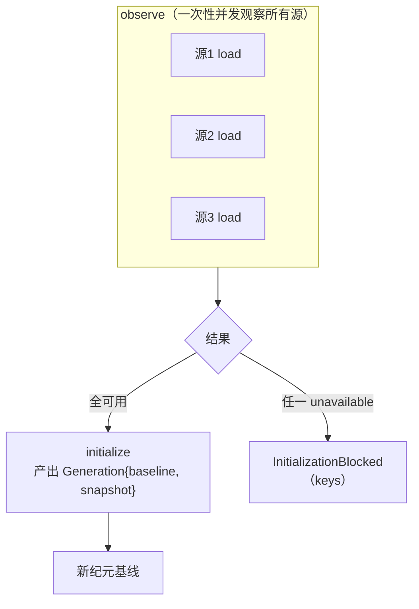
```mermaid
flowchart TB
    subgraph Observe["observe（一次性并发观察所有源）"]
        L1["源1 load"] 
        L2["源2 load"]
        L3["源3 load"]
    end
    Observe --> Result{结果}
    Result -->|全可用| Init["initialize<br/>产出 Generation{baseline, snapshot}"]
    Result -->|任一 unavailable| Blocked["InitializationBlocked<br/>（keys）"]
    Init --> Use1["新纪元基线"]
```

- **`initialize(value): Effect<Generation, InitializationBlocked>`**：以 `concurrency: "unbounded"` 并发观察所有源；若有任一 `unavailable`，**失败** `InitializationBlocked`（携带不可用 key 列表），不产出任何基线——绝不持久化不完整基线。否则渲染每个可用源的 `baseline` 文本，用 `"\n\n"` 拼接成 `baseline`，并为每个源存 `SourceSnapshot{ value, removed? }`，得到 `Generation{ baseline, snapshot }`。

- **`reconcile(value, previous): Effect<ReconcileResult>`**：观察一次，与 `previous` snapshot 比较，返回恰好一个下一步动作：
  - `Unchanged`：无变更，保持基线与 snapshot。
  - `Updated{ text, snapshot }`：有变更，产出一条合并的对话中系统消息文本与新 snapshot（不替换基线）。
  - `ReplacementReady{ generation }`：需要整体替换（如编解码不兼容、不可移除的源被移除），产出新 `Generation`。
  - `ReplacementBlocked`：需要替换但有先前已准入的源当前不可用，阻塞。

  `reconcile` 的内部逻辑：对每个可用源，取出其 stored snapshot 值，用 `codec` 解码并做等价比较——若解码失败（`Incompatible`）或某个已存源不在当前源集合且无 `removed` 渲染器，则触发 `Replace`（转 `replaceObservation`）；否则，变更的源发出 `update` 文本，新源发出 `baseline`，被移除的源发出 `removed` 文本，所有更新用 `"\n\n"` 合并。

- **`replace(value, previous): Effect<ReplacementResult>`**：若任一**先前已准入**的源当前 `unavailable`，返回 `ReplacementBlocked`；否则用 `initializeObservation` 产出 `ReplacementReady{ generation }`。这是「stale-while-revalidate」语义：不可用时保留旧基线，而非构造残缺新基线。

### 10.4 Snapshot 的持久结构

`Snapshot` 是 `Schema.Record(Key, SourceSnapshot)`，即「key → { value: Json, removed?: string }」。对每个可移除的动态源，snapshot 还存一个**预渲染的 removal 文本**，这样在源被移除时无需重新加载其值即可发出移除消息。

```ts
export const SourceSnapshot = Schema.Struct({
  value: Schema.Json,
  removed: Schema.optional(Schema.NonEmptyString),
})
export const Snapshot = Schema.Record(Key, SourceSnapshot)
```

这使得 `reconcile` 在处理「源从组合中消失」时，可以直接从 snapshot 取出预渲染的 `removed` 文本，而无需再次观察已不存在的源。

### 10.5 combine 与确定性

`combine(values)` 按调用方顺序拼接源，并立即拒绝重复 key（抛 `DuplicateKeyError`）。但在**注册表**层面（`SystemContextRegistry`），`load()` 会先按稳定的贡献 key 排序，再以无界并发观察，最后 `combine`——因此**渲染出的上下文是确定性的**，不受注册顺序影响。`CONTEXT.md` 关系 #109 强调这一点：`SystemContext.combine(...)` 保留调用方顺序，但注册表按稳定贡献 key 顺序求值。

### 10.6 内置与注册的源

`SystemContextRegistry`（`system-context/registry.ts`）是 Location 范围的服务，提供 `register(entry)` 与 `load()`。注册是作用域化的（`Scope.Scope`）：重复 key 会 `die`，关闭 scope 移除条目。`load()` 按 key 排序后并发观察并 `combine`。

注册到注册表的内置源包括：

- **`core/builtins`**（`system-context/builtins.ts`）：聚合 `core/environment`（工作目录/工作区根/Git/平台）与 `core/date`（`DateTime.nowAsDate → toDateString()`）。日期源的 `baseline` 为 `"Today's date: ..."`，`update` 为 `"Today's date is now: ..."`。
- **`core/instructions`**（`packages/core/src/instruction-context.ts`）：观察全局 `AGENTS.md` 与向上查找的项目 `AGENTS.md`（`fs.up({ targets: ["AGENTS.md"], start, stop })`），受 `OPENCODE_DISABLE_PROJECT_CONFIG` 控制；若发现文件读取失败则返回 `unavailable`。其 `update` 文本为 `"These instructions replace all previously loaded ambient instructions.\n\n..."`，`removed` 为 `"Previously loaded instructions no longer apply."`。
- **`core/skill-guidance`**（`packages/core/src/skill/guidance.ts`）：按所选 agent 列出其被允许使用的技能名与描述（经 `PermissionV2.evaluate("skill", "*", ...)` 过滤）；`removed` 为 `"Skill guidance is no longer available. Do not use any previously listed skill."`。
- **`core/reference-guidance`**（`packages/core/src/reference/guidance.ts`）：命名引用指引。

这三个（注册表全局源 + 技能指引 + 引用指引）在 runner 中**每回合**组合：

```ts
const loadSystemContext = (agent: AgentV2.Selection) =>
  Effect.all([systemContext.load(), skillGuidance.load(agent), referenceGuidance.load()], {
    concurrency: "unbounded",
  }).pipe(Effect.map(SystemContext.combine))
```

### 10.7 关键不变量

`SystemContext` 模块用 `requireText` 强制：渲染出空的 baseline/update/removal 文本是错误。这保证模型始终收到有意义的上下文文本。此外：

- `make` 把 `A` 隐藏，使不同类型的源统一组合；codec 比较/存储其值，纯渲染器只在需要时产出模型可见文本。
- `initialize` 观察一次组合上下文，产出新鲜的 Baseline System Context 与其 Snapshot。
- `reconcile` 观察一次，返回恰好一个下一步动作（unchanged/updated/replacement ready/blocked）。
- `replace` 在完成压缩或另一基线替换转换后渲染新生成；在先前已准入上下文不可用时报告 `ReplacementBlocked`。
- 不可用上下文使用 stale-while-revalidate 语义，区别于成功加载的「缺席」（后者可发出移除文本）。

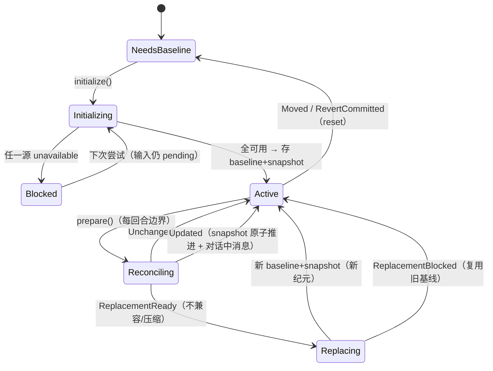
```mermaid
stateDiagram-v2
    [*] --> NeedsBaseline
    NeedsBaseline --> Initializing: initialize()
    Initializing --> Blocked: 任一源 unavailable
    Blocked --> Initializing: 下次尝试（输入仍 pending）
    Initializing --> Active: 全可用 → 存 baseline+snapshot
    Active --> Reconciling: prepare()（每回合边界）
    Reconciling --> Active: Unchanged
    Reconciling --> Active: Updated（snapshot 原子推进 + 对话中消息）
    Reconciling --> Replacing: ReplacementReady（不兼容/压缩）
    Replacing --> Active: 新 baseline+snapshot（新纪元）
    Replacing --> Active: ReplacementBlocked（复用旧基线）
    Active --> NeedsBaseline: Moved / RevertCommitted（reset）
```

---

## 第十一章 上下文纪元状态机

### 11.1 持久化结构

Context Epoch 的状态持久化在 `session_context_epoch` 表（`packages/core/src/session/sql.ts`）：

```ts
export const SessionContextEpochTable = sqliteTable("session_context_epoch", {
  session_id: text().notNull(),
  baseline: text().notNull(),          // 不可变基线文本
  snapshot: text({ mode: "json" }).notNull(),  // Context Snapshot（JSON）
  baseline_seq: integer().notNull(),   // 基线对应的聚合序列
})
```

经过迁移 `20260622142730_simplify_session_context_epoch`，该表去掉了早期的 `agent`、`replacement_seq`、`revision` 列，简化为「一行一会话」。

### 11.2 API

`packages/core/src/session/context-epoch.ts` 暴露三个操作：

- **`initialize(db, context, sessionID): Effect<Prepared | undefined, InitializationBlocked>`**：若该会话已有纪元行则**无操作**返回 `undefined`（幂等）；否则 `SystemContext.initialize` 并插入行，`baseline_seq = EventV2.latestSequence(db, sessionID)`。
- **`prepare(db, events, context, sessionID): Effect<Prepared, InitializationBlocked | ContextSnapshotDecodeError>`**：每回合的边界调和（见下）。
- **`reset(db, sessionID)`**：删除纪元行（用于 Session 移动与 revert 提交）。

### 11.3 prepare：每回合的调和

`prepare` 是 provider 回合开始时调用的核心。其流程（`prepareOnce`）：

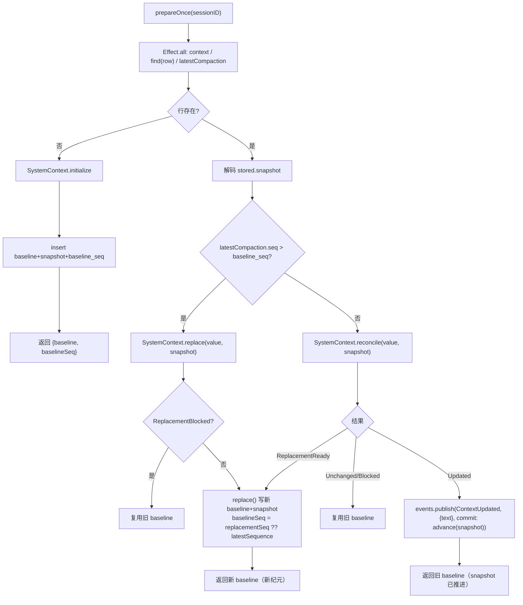
```mermaid
flowchart TB
    Start["prepareOnce(sessionID)"]
    Start --> All["Effect.all: context / find(row) / latestCompaction"]
    All --> Check{行存在?}
    Check -->|否| Init["SystemContext.initialize"]
    Init --> Insert["insert baseline+snapshot+baseline_seq"]
    Insert --> Ret1["返回 {baseline, baselineSeq}"]
    Check -->|是| Decode["解码 stored.snapshot"]
    Decode --> Comp{"latestCompaction.seq > baseline_seq?"}
    Comp -->|是| Replace["SystemContext.replace(value, snapshot)"]
    Comp -->|否| Recon["SystemContext.reconcile(value, snapshot)"]
    Replace --> RB{ReplacementBlocked?}
    RB -->|是| RetOld["复用旧 baseline"]
    RB -->|否| RReady["replace() 写新 baseline+snapshot<br/>baselineSeq = replacementSeq ?? latestSequence"]
    RReady --> RetNew["返回新 baseline（新纪元）"]
    Recon --> Res{结果}
    Res -->|Unchanged/Blocked| RetOld2["复用旧 baseline"]
    Res -->|Updated| Pub["events.publish(ContextUpdated, {text}, commit: advance(snapshot))"]
    Pub --> RetOld3["返回旧 baseline（snapshot 已推进）"]
    Res -->|ReplacementReady| RReady
```

关键点：

- **压缩触发替换**：若最新压缩的 `seq > stored.baseline_seq`，调用 `replace`。`ReplacementReady` 会用新 `Generation` 整体覆盖行（新基线 + 新 snapshot + 新 `baseline_seq`），这**开启新纪元**；`ReplacementBlocked` 则复用旧基线（stale-while-revalidate）。
- **普通调和**：否则 `reconcile`。`Updated` 时通过 `events.publish(SessionEvent.ContextUpdated, { text }, { commit: () => advance(snapshot) })` 发布一条持久对话中系统消息，其 `commit` 钩子在**同一数据库事务**内推进 snapshot——保证「对话中系统消息」与「snapshot 推进」原子（对应 `CONTEXT.md` 关系 #95）。基线本身不变。
- **baselineSeq 的来源**：替换时 `baselineSeq = replacementSeq ?? EventV2.latestSequence(db, sessionID)`。`latestSequence` 在无行时返回 `-1`。

### 11.4 状态机

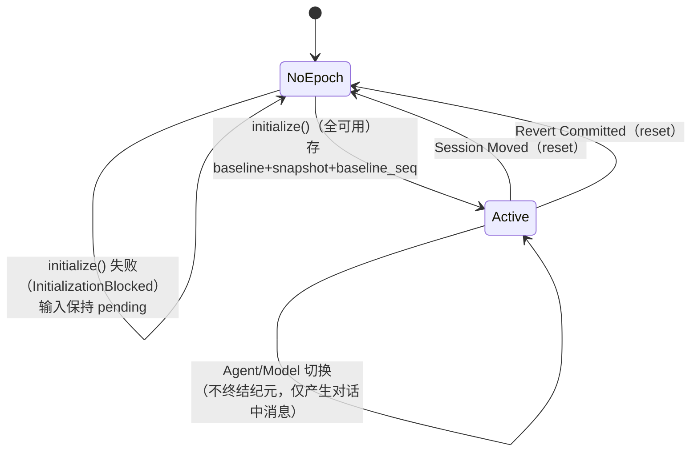
```mermaid
stateDiagram-v2
    [*] --> NoEpoch
    NoEpoch --> Active: initialize()（全可用）<br/>存 baseline+snapshot+baseline_seq
    NoEpoch --> NoEpoch: initialize() 失败（InitializationBlocked）<br/>输入保持 pending
    Active --> Active: prepare() → Unchanged
    Active --> Active: prepare() → Updated<br/>（snapshot 推进 + 对话中消息）
    Active --> Active: prepare() → ReplacementBlocked<br/>（复用旧基线）
    Active --> Active: prepare() → ReplacementReady<br/>（新 baseline+snapshot，新纪元）
    Active --> NoEpoch: Session Moved（reset）
    Active --> NoEpoch: Revert Committed（reset）
    Active --> Active: Agent/Model 切换<br/>（不终结纪元，仅产生对话中消息）
```

### 11.5 终结与保留语义

- **完成的压缩**终结纪元：`Compaction.Ended` 的持久 `seq` 成为下次 `prepare` 的 `replacementSeq`，触发 `replace`，开启新纪元。先前的 Mid-Conversation System Message 仍是持久审计历史，但离开投影的模型历史（见第十六章历史投影）。
- **Session 移动**清空纪元（`SessionEvent.Moved` 的投影器调用 `reset`）；目的 Location 必须在下次运行时初始化完整基线。
- **Revert 提交**同样调用 `reset`，并删除 `seq > boundary.seq` 的消息行与输入行。
- **模型/Provider 切换**保留当前纪元与按时间顺序的对话历史；新选择适用于下一个 provider 回合（`CONTEXT.md` 关系 #134）。可见推理在模型切换后降级为普通助手文本，provider 原生元数据被省略（保守关系，仅在录制的 provider 测试确立兼容性后才可能放宽）。
- **首次回合**：`initialize` 在任何待处理提示成为模型可见**之前**渲染最新完整基线并初始化 snapshot，**不**发出冗余的对话中系统消息；初始不可用上下文阻塞该回合而非持久化不完整基线，使输入保持 pending 与可重试。

### 11.6 与 runner 的交互

在 `SessionRunner` 的 `runTurnAttempt` 中，纪元交互如下（见第十四章）：

1. `initialized = SessionContextEpoch.initialize(db, loadSystemContext(agent), session.id)` —— **先于晋升**，确保不可用的初始基线让输入保持 pending。
2. 在安全边界晋升提示（`promoteSteers`/`promoteNextQueued`）。
3. `system = initialized ?? SessionContextEpoch.prepare(db, events, loadSystemContext(agent), session.id)` —— **在晋升之后**调和，使合并的对话中系统消息落在新晋升的用户输入之后。

这个顺序精确实现了 `CONTEXT.md` 关系 #100-101：在安全边界，新晋升的用户输入或已结算的工具结果先于任何合并的对话中系统消息。

---


## 第十二章 持久化提示准入与晋升


### 3.14 GenerateCommand 与 SDK 生成

`GenerateCommand`（`cli/cmd/generate.ts`）触发 SDK 重新生成。`AGENTS.md` 规定：改动公开 Protocol 或 Server `HttpApi` 后，在 `packages/client` 运行 `bun run generate`。`generate` 脚本（`packages/client/script/build.ts`）调 `compile(ClientApi, { groupNames, endpointNames, omitEndpoints })` 编译 IR，`emitPromise` 与 `emitEffectImported` 生成两个客户端。

`groupNames` 把 server 标识符映射到复数消费命名空间：`"server.session": "sessions"`、`"server.message": "messages"`、`"server.event": "events"`。`endpointNames` 映射端点名：`"session.messages": "list"`。`omitEndpoints` 排除 `fs.read`、`pty.connect`、`pty.connectToken`（这些有特殊处理）。

`outputTypes` 配置流端点的输出类型：`events.subscribe` 的输出类型 `OpenCodeEventEncoded` 从 protocol 导入。生成结果用 Prettier 格式化，`.httpapi-codegen.json` manifest 跟踪生成的文件，移除陈旧文件。路径遍历/符号链接安全检查。需 `FileSystem`。

### 3.15 ConsoleCommand 的设备码登录

`cli/cmd/account.ts` 的 `ConsoleCommand` 提供 `login|logout|switch|orgs|open` 命令。`defaultConsoleUrl = "https://console.opencode.ai"`。`login` 调 `Account.login(url)`（设备码），打开浏览器显示 `user_code`，交互轮询（`PollSlow` 时退避）。`logout` 移除账户，`switch` 切换活跃 org，`orgs` 列组织，`open` 打开 console。

这是「CLI 登录云端账户」的交互。登录后，账户 token 用于 `account.config`（`/api/config`）与 Zen 网关认证（`Bearer` token）。`OPENCODE_CONSOLE_TOKEN` 环境变量在配置加载时从活跃账户 token 设置，使后续 console API 调用认证。

`switch` 切换活跃 org——不同 org 可能有不同 provider 配置、限制、计费。切换后重新加载配置。`orgs` 显示用户可用的组织列表。这些是「多组织账户管理」的 CLI。

### 3.16 其他命令的职责

`ProvidersCommand`（`cli/cmd/providers.ts`）：列出可用 provider，`put` 子命令设置 provider 认证（`Cli.providers.put` → `Auth.set`）。这是 `opencode auth login` 的入口——交互式或参数式设置 API key。

`AgentCommand`/`ModelsCommand`：列出 agent/模型。这些是信息查询命令，不需实例加载（`instance: false` 或轻量）。`McpCommand`：MCP 服务器管理（列出状态、添加、连接、认证）。`PluginCommand`：插件管理（列出、安装、启用/禁用）。

`DbCommand`：数据库操作（如导出、查询）。`ExportCommand`/`ImportCommand`：会话导出/导入（JSON 格式，跨实例迁移会话）。`GithubCommand`/`PrCommand`：GitHub 集成，`pr` 生成 PR（opencode 作为 GitHub Action 运行，用 OIDC token）。

`UpgradeCommand`/`UninstallCommand`：升级/卸载。`DebugCommand`：调试（含 `debug/lsp.ts` 子命令）。`StatsCommand`：统计。`AttachCommand`：附加到已运行服务器。这些命令覆盖 OpenCode 的全部操作面，每个用 `effectCmd` 管理实例生命周期。

---

### 4.17 contract.ts 的传输专用中间件

`packages/client/src/contract.ts` 定义 `LocationMiddleware` 与 `SessionLocationMiddleware` 为传输专用中间件键（无 Core/Server 导入）。`ClientApi = makeDefaultApi({ locationMiddleware: LocationMiddleware, sessionLocationMiddleware: SessionLocationMiddleware })`。

这些中间件键在客户端是「传输专用」——它们不提供实际服务（如 Server 的 `LocationServices`），只声明键存在，使生成的客户端类型与 Server API 匹配。运行时，客户端不实际解析 Location/Session（那由 Server 做），只发送请求。

`groupNames`/`endpointNames`/`omitEndpoints` 是 codegen 注解——「是否消费者名应不同于 server 组标识符」的显式标注。如 `server.session` 组在消费端是 `sessions`（复数）。这使消费端 API 更自然（`client.sessions.list()` 而非 `client.session.list()`），同时不改 server 组标识符。

### 4.18 Promise 客户端的 SSE 实现

生成 Promise 客户端的 `sse<A>(descriptor, requestOptions): AsyncIterable<A>` 是惰性 `[Symbol.asyncIterator]`。连接与错误在首次 `next()` 出现。校验 `text/event-stream`，缓冲，按 `\n\n` 分割，收集 `data:` 行，`JSON.parse`，1MB 缓冲上限 → `ClientError("MalformedResponse")`，`finally` 取消 reader。无自动重连。

这是「SSE 客户端的最小实现」——只做必需的：解析 SSE 帧、转 JSON、限缓冲。无重连、无心跳处理（心跳 `: heartbeat` 被忽略，因为 `data:` 行才产生事件）。重连由消费者组合——保留最后序列，断线后用 `after` 重订阅。

`events.subscribe` 返回 `AsyncIterable`，`sessions.events` 也返回 `AsyncIterable`。前者迭代 live 事件，后者迭代 durable 事件。消费者用 `for await (const event of stream)` 消费。`AbortSignal` 取消——迭代中 `signal.aborted` 关闭底层请求。

### 4.19 Effect 客户端的 Stream.unwrap

生成 Effect 客户端的流端点用 `Stream.unwrap(raw[...]（...）.pipe(...))`。`raw` 是 `HttpApiClient.ForApi<typeof ClientApi>` 的端点调用，返回 `Effect<HttpApiClient.Endpoint.Stream>`。`Stream.unwrap` 把 Effect 转 Stream——先运行 Effect 获取流描述，再迭代。

`mapClientError = (error) => HttpClientError.isHttpClientError(error) || Schema.isSchemaError(error) || Sse.Retry.is(error) ? new ClientError({ cause: error }) : error`。传输/schema/SSE 重试错误映射为 `ClientError`，其他错误透传。这使「基础设施错误」统一为 `ClientError`，领域错误保留原样。

Effect 客户端的 `make = (options?: { baseUrl? }) => HttpApiClient.make(Api, options).pipe(Effect.map(adaptClient))`。`adaptClient` 把 `RawClient`（`HttpApiClient.ForApi`）适配为按 group 组织的方法对象。传输来自环境 `HttpClient.HttpClient`——调用方提供，用于 headers/tracing/retries/tests，取消由 fiber 中断。

---

### 9.15 sessions.context vs 完整请求上下文

`CONTEXT.md` 指出：「`sessions.context({ sessionID })` 保留现有的仅消息操作。它返回投影的对话消息作为 Session 上下文；它不包含或表示完整的 provider 请求上下文，其基线系统上下文与其他贡献保持分离。」

这是「会话上下文」与「provider 请求上下文」的区分。`sessions.context` 返回投影对话——用户与助手消息、工具调用、对话中系统消息。但「完整的 provider 请求上下文」含基线系统上下文（纪元基线）、选中源贡献、纪元元数据——这些是 provider 请求时的内部状态，不通过 `sessions.context` 暴露。

「Open question: Should a future, separately named operation expose the complete provider request context?」——未来可能新增操作暴露完整请求上下文，用于调试或可视化。但当前 `sessions.context` 刻意只返回对话，不泄漏内部状态。这是「API 表面克制」——只暴露有用的，不暴露内部的。

### 9.16 sessions.prompt 的 Admission 结果

`CONTEXT.md`：「公开操作仍是 `sessions.prompt(...)`；`SessionInput.admit` 是内部原语，公开 `Admission` 结果与 `resume` 选项表达其持久准入语义。」

`sessions.prompt` 的成功响应是 `{ data: SessionInput.Admitted }`——返回准入结果，含 `admittedSeq`。客户端可用 `admittedSeq` 表示「排队输入」在 `Prompted` 使其成为可见历史前。这使 UI 能显示「待处理输入」——已接受但模型未看到。

`Admitted` 含 `admittedSeq`、`id`、`sessionID`、`prompt`、`delivery`、`timeCreated`、`promotedSeq?`。`admittedSeq` 是准入事件序列，`promotedSeq` 是晋升序列（未晋升时 undefined）。UI 据此区分「待处理」与「已晋升」。

### 9.17 sessions.active 的进程本地性

`sessions.active()` 快照当前进程前台 drain 注册表为 `{ sessionId: { type: "running" } }`。缺失的 ID 即非活跃。活动**不是**跨进程重启持久的——进程重启清空注册表。

这与「会话本身是持久的」形成对比。会话数据（消息、输入、纪元）在 SQLite 中持久，重启不丢。但「会话正在运行」是进程本地状态——drain 是进程本地 fiber，重启即消失。`sessions.active()` 反映「当前进程在跑哪些 drain」，非「哪些会话有进行中的工作」（后者需检查会话状态，如 `time_compacting`）。

「后台子代理与任务不把其父 Session 加入此注册表」——因为子代理是独立 Session 的 drain，父 Session 的 drain 在等待子代理时已挂起。`active` 反映「主动推进的 drain」，不是「有任何活动」。

### 9.18 sessions.interrupt 的幂等性

`sessions.interrupt({ sessionID })` 先验证持久 Session 存在（`SessionNotFoundError`）。对已知 Session，中断幂等：空闲、已结算、本地未拥有的执行是 no-op。

幂等性由协调器实现——只有 `entry.owner` 存在时才 `Fiber.interrupt`。若会话空闲（无活跃 drain），`active.get(key)` 返回 undefined，`interrupt` 是 no-op。若会话在另一进程运行（本地未拥有），本地 `interrupt` 也是 no-op（本地协调器无该 entry）。

「clears a coalesced follow-up wake already registered with this coordinator」——中断时 `pendingWake=false`，清除已注册的合并 wake。这防止「中断后 pendingWake 触发后续 drain」。中断是「停止，不重启」的语义。

---

### 10.16 Source 的 codec 必需性

`Source<A>` 的 `codec: Schema.Codec<A, Schema.Json, never, never>` 是必需的——它既编码存储又做等价比较。为什么不用简单的 `JSON.stringify` 比较？因为 schema 感知的等价更精确——处理可选字段、brand、变换。

考虑 `core/instructions` 的 codec `Schema.toCodecJson(Schema.Array(File))`。指令是 `File` 数组，`File` 含路径。codec 把 `File[]` 编码为 JSON 数组存入 snapshot。`reconcile` 解码回来比较——若指令集变了（加/减/改文件），`equivalent` 返回 false，触发 `update`。

若用 `JSON.stringify`，键顺序差异会导致「相同内容不同顺序」误判为变更。codec 等价是结构化的——`{a:1,b:2}` 与 `{b:2,a:1}` 等价。这避免「指令文件顺序变化触发不必要的更新」。

### 10.17 load 的不可失败性

`Source<A>` 的 `load: Effect.Effect<A | Unavailable>` 是「不可失败」的 Effect——它返回 `A` 或 `unavailable`，不抛错。若 loader 真的失败（如读文件抛 IO 错误），它应捕获并返回 `unavailable`，而非让错误传播。

`core/instructions` 的 `observe()` 若发现文件读取失败，返回 `unavailable`。这使「部分指令文件损坏」不阻塞整个上下文——保留旧指令值，等其他文件恢复。这是「优雅降级」的实践。

但「返回 `unavailable`」与「源被移除」不同。`unavailable` 保留旧 snapshot（stale-while-revalidate），不触发 removal 文本。源恢复后，下次边界检测变更发 update。这分离了「临时不可用」与「永久移除」。

### 10.18 baseline 的首次渲染

首次 provider 回合渲染最新完整 Baseline System Context 并初始化其 Context Snapshot，**不**发出冗余的 Mid-Conversation System Message。`CONTEXT.md` 关系 #105。

为什么「不发出」？因为基线本身已含所有源的 baseline 文本——发一条「这些是当前值」的消息是冗余的（模型已从基线看到）。对话中系统消息是「变更通知」，首次没有「之前的状态」可对比，故无变更通知。

`initialize` 返回 `Generation{ baseline, snapshot }`，baseline 直接作为 provider system 前缀。无对话中消息产生。后续 `reconcile` 检测变更才产生对话中消息。这是「基线 vs 更新」的区分——基线是初始全量，更新是增量变更。

### 10.19 指令发现的向上查找

`core/instructions` 的 `observe()` 用 `fs.up({ targets: ["AGENTS.md"], start, stop })` 向上查找 `AGENTS.md`。`start` 是当前目录，`stop` 是 worktree 或项目根。这发现「当前目录及其祖先的 `AGENTS.md`」——形成指令层次。

`OPENCODE_DISABLE_PROJECT_CONFIG` 禁用项目配置发现——但仍读全局 `AGENTS.md`（`global.config`）。这使「禁用项目配置但保留全局指令」可行——如 CI 环境不信任项目配置但用全局规则。

「嵌套项目指令发现 after 成功读取 remains a follow-up」——发现 `AGENTS.md` 引用的其他指令文件（如 `@file` 指令）是后续工作。当前只读 `AGENTS.md` 本身，不递归发现引用。这反映「指令发现是渐进式」的——先支持直接的 `AGENTS.md`，嵌套发现后补。

---

### 11.15 初始 System Context 准备先于首次输入晋升

`CONTEXT.md` 关系 #106：「初始 System Context 准备先于首次持久输入晋升，故不可用基线让该输入 pending 与可重试；普通调和在晋升后。」

这由 `runTurnAttempt` 的顺序实现：`SessionContextEpoch.initialize(...)` 在 `promoteSteers/promoteNextQueued` 之前。若 `initialize` 失败（`InitializationBlocked`），回合不运行，输入未晋升（保持 pending）。下次 drain 重试 `initialize`——若源恢复，成功，晋升继续。

为什么先准备上下文？若先晋升输入再发现上下文不可用，输入已可见但回合无法运行——状态不一致（输入在历史但无回应）。先准备上下文确保「要么一切就绪、晋升并运行，要么都不发生」。这是「原子性」的考虑——上下文准备与输入晋升应一起成功或一起不动。

「普通调和在晋升后」则是已初始化纪元的回合：晋升输入后 `prepare` 调和上下文，使对话中系统消息在新输入之后。这与首次初始化不同——首次是「无纪元→有纪元」（initialize），后续是「有纪元→调和」（prepare）。两种路径的顺序都是为了「安全边界」语义。

---


### 10.12 observe 的并发无界

`observe` 用 `Effect.forEach(value[ContextTypeId], (source) => source.load.pipe(Effect.map(...)), { concurrency: "unbounded" })`。无界并发观察所有源——所有源同时 load，而非顺序。这对含慢源的上下文重要：若 `core/instructions` 读 5 个 `AGENTS.md`，与 `core/date`（瞬时）并发，总时间是慢源的时间，而非累加。

无界并发的代价是「若某源 load 卡住，整体等待」。但 `load` 应是快操作（读文件、取日期），无界可接受。若源慢，应返回 `unavailable` 而非阻塞——`unavailable` 不阻塞 observe（保留旧值），使整体不被单个慢源拖死。

`observe` 把每个源标记 `Available | Unavailable`。`initialize` 检查 unavailable，若有则 `InitializationBlocked`。`reconcile` 跳过 unavailable（保留旧 snapshot）。`replace` 在 unavailable 源先前已准时阻塞。这三种处理使「部分源不可用」的行为明确。

### 10.13 requireText 的空渲染保护

`requireText(key, kind, text)` 若 text 为空则抛错：「System context source {key} rendered an empty {kind}」。这保护「源渲染空文本」——空 baseline/update/removal 是 bug，应暴露而非静默。

为什么这是 bug？因为模型收到空系统消息无意义且浪费上下文。若 `core/date` 的 `baseline` 返回空字符串（如日期格式化失败返回空），模型收到空消息，困惑。`requireText` 强制源作者处理空情况——要么返回有意义的文本，要么返回 `unavailable`（不渲染）。

这个保护是「fail fast」原则的体现——宁可启动时失败，也不让空文本污染模型上下文。它与 `unavailable` 协同：源无法观察时返回 `unavailable`（保留旧值），而非渲染空文本假装有值。

### 10.14 Snapshot 的 removed 预渲染

`SourceSnapshot` 含可选 `removed: Schema.NonEmptyString`。对可移除的动态源，snapshot 预渲染 removal 文本。这使「源从组合中消失」时，`reconcile` 可直接从 snapshot 取 removal 文本，无需重新加载已不存在的源。

考虑：`core/skill-guidance` 在 agent 切换后，某技能从允许列表消失。但「消失」不是「源不可用」（源本身在），而是「源的值变了」（技能列表少了）。这种情况走 `update`（描述新值），不是 `removed`。`removed` 用于「源本身从组合中移除」——如一个插件 Context Source 被卸载。

`reconcile` 处理 removed：对 `previous` 中有但当前 `entries` 中无的 key，取 `previous[key].removed` 文本。若 `removed` 未定义（源无 removal 渲染器），触发 `Replace`——因为没有移除文本可发，只能整体替换基线。这迫使可移除源提供 `removed` 渲染器，否则其移除会导致基线重建（成本高）。

### 10.15 combine 的重复键立即拒绝

`combine` 用 `flatMap` 拼接源，`assertUniqueKeys` 立即检查重复 key，抛 `DuplicateKeyError`。这是「fail fast」——组合时而非运行时发现重复。

为什么重复是错误？因为 System Context 的 key 是稳定身份，重复 key 意味着两个源声称同一身份，模型无法区分。`core/date` 只能有一个，若有第二个 `core/date`，是配置错误。立即拒绝使错误在组合时暴露，而非在 reconcile 时产生混淆。

注册表 `load()` 在 combine 前按 key 排序，但 combine 内仍 `assertUniqueKeys`——双重保护。注册表的排序保证确定性，combine 的断言保证唯一性。二者协同使「确定性的、无重复的」组合。

---

### 11.11 baseline_seq 的语义

`baseline_seq` 是基线对应的聚合序列。它有两个用途：历史投影截断（基线之前的 system 消息排除）与压缩检测（压缩 seq > baseline_seq 触发替换）。

历史投影中，`messageRows` 的基线截断排除 `type='system'` 且 `seq <= baselineSeq` 的消息——这些已折叠进基线，不需重发。`seq > baselineSeq` 的 system 消息保留——它们是纪元开始后的对话中更新。

压缩检测中，`latestCompaction.seq > baseline_seq` 触发 `replace`——压缩产生了新检查点，基线需重建。这使「压缩自动开启新纪元」可检测。`baseline_seq` 是纪元与压缩/历史的连接点。

`EventV2.latestSequence` 在无行时返回 -1，用于新会话的 `baseline_seq`（首次 initialize 时 `baseline_seq = latestSequence`，新会话为 -1，表示「纪元开始前无事件」）。这使基线 seq 与事件序列对齐——基线总是对应某事件 seq，历史投影按此截断。

### 11.12 reset 的使用场景

`SessionContextEpoch.reset(db, sessionID)` 删除纪元行。三个场景：Session 移动（`SessionEvent.Moved` 投影器）、revert 提交（`RevertEvent.Committed` 投影器）、以及未来的纪元强制重建。

Session 移动清空纪元，因为目的 Location 的上下文不同。revert 提交清空纪元，因为回退到历史某点后，基线可能不再适用——回退后的状态需要重新初始化基线。`reset` 使下次 `prepare` 走 `initialize` 路径，从当前 Location 的 Context Source 重新渲染。

注意 `reset` 只删纪元行，不删消息或输入——那些是独立持久状态。纪元是「当前基线」，可重建；消息与输入是「历史事实」，不可丢。这符合「事实优先于执行」——执行状态（纪元）可重置，事实（事件）保留。

### 11.13 prepare 的 Effect.span

`initialize` 与 `prepare` 都用 `Effect.withSpan("SessionContextEpoch.initialize"/"prepare")` 标注 OTel span。这使「纪元操作」可追踪——在 Honeycomb 能看到每次 initialize/prepare 的延迟、频率。

这对调试有价值：若纪元操作频繁失败（`InitializationBlocked`），span 显示哪些 key 不可用。若 prepare 慢，span 显示是 reconcile 还是 replace 慢。OTel 是「可观测性」的基础设施，`withSpan` 是其接入点。

`Effect.fnUntraced` 用于 `exists`/`find`/`insert`/`replace`/`advance` 等内部 SQL 助手——它们不生成 span（避免 span 爆炸），只有公开的 initialize/prepare 生成 span。这是「公开方法追踪，内部助手不追踪」的纪律。

### 11.14 ContextSnapshotDecodeError 的致命性

`ContextSnapshotDecodeError`（存储的 snapshot 无法解码）是致命错误。它意味着持久 snapshot 损坏——schema 变了或数据损坏。`prepare` 用 `Schema.decodeUnknownEffect(SystemContext.Snapshot)(stored.snapshot)` 解码，失败抛此错。

为什么不降级用旧基线？因为 snapshot 损坏意味着「无法知道上次哪些源的值是什么」，继续用旧基线可能基于错误的假设。致命错误使问题暴露，由运维或用户处理（可能需要 reset 纪元重建）。这避免了「静默用损坏数据继续」的风险。

这与 `ReplacementBlocked`（不可用源）不同——后者是暂时的，保留旧值安全；前者是数据损坏，保留旧值不安全。两种失败的区分反映了「临时不可用」与「数据损坏」的本质差异。

---


### 10.8 codec 边界与等价比较

System Context 代数的一个关键设计是「codec 既编码存储又做等价比较」。`Source<A>` 的 `codec: Schema.Codec<A, Schema.Json, never, never>` 不仅把 `A` 编码成 JSON 存入 snapshot，还通过 `Schema.toEquivalence(codec)` 生成等价函数。这个等价函数不是简单的 `JSON.stringify` 比较，而是 schema 感知的——例如，对于含可选字段的 schema，等价函数会正确处理 `undefined` 与缺失键。

`reconcile` 在比较时用 `decode(previous)` 把存储的 JSON 解码回 `A`，再用等价函数与当前值比较。若解码失败（`Incompatible`），说明存储的 snapshot 与当前 codec 不兼容——可能 schema 版本变了。此时触发 `Replace`（整体替换基线），而非尝试部分调和。这保证了「schema 演进不会导致错误的增量更新」。

`make` 关闭类型 `A` 的设计让不同类型的源统一组合。一个 `SystemContext` 内部是 `ReadonlyArray<PackedSource>`，每个 PackedSource 的 `load` 返回 `Loaded | Unavailable`，其中 `Loaded` 是关闭了 `A` 的 `baseline`/`compare` 闭包。这意味着组合后的上下文不关心各源的具体类型——它只调用闭包得到文本与 snapshot。类型 `A` 在 `make` 时被隐藏，之后不可恢复，这正是「不同类型源统一组合」的实现机制。

### 10.9 渲染器的纯函数约束

`baseline`、`update`、`removed` 是纯函数：给定值，返回文本，无副作用、无依赖外部状态。这个约束由 `requireText` 强制——渲染空文本是错误。纯函数性使渲染可缓存、可测试、可在任何上下文调用。

`baseline(current)` 返回源的初始渲染文本。`update(previous, current)` 返回从旧值到新值的变更说明文本——注意它接收两个值，可以描述「从 X 变成 Y」。`removed(previous)` 是可选的，返回源被移除时的说明文本；若未提供，源被移除时 `reconcile` 会触发 `Replace`（因为没有移除文本可发）。

这个设计意味着 Context Source 的作者必须显式考虑「值变了怎么说」「值没了怎么说」。例如 `core/date` 的 `update` 是 `"Today's date is now: ..."`（不是 `"The date changed from X to Y"`）——`CONTEXT.md` 的对话示例明确：「日期变了，对话中系统消息应说出新生效的日期，让 agent 能据此行动」，而非描述旧值。这反映了「上下文消息是当前事实的陈述，而非变更日志」的语义。

### 10.10 注册表的确定性组合

`SystemContextRegistry.load()` 的确定性组合值得细究。它先按稳定贡献 key 排序（`a.key < b.key`），再以无界并发观察，最后 `combine`。这个顺序保证「无论插件以何种顺序注册，渲染出的上下文是确定性的」。

为什么这重要？考虑两个插件 A 和 B，A 注册 `core/a`，B 注册 `core/b`。若 A 先注册，渲染顺序是 `a` 然后 `b`；若 B 先注册，若不排序就是 `b` 然后 `a`。但用户不应关心插件注册顺序——同一组源应产生同一基线。按 key 排序后，无论注册顺序，`core/a` 总在 `core/b` 之前（字典序）。

`combine` 本身保留调用方顺序（`flatMap`），但注册表的 `load` 在 `combine` 前排序，使最终结果是确定性的。这是「调用方顺序」与「注册表顺序」的微妙分工：`combine` 信任调用方给的顺序，注册表负责给出确定性的顺序。

### 10.11 三类内置源的具体内容

理解内置源的具体内容有助于建立对「系统上下文」的直觉。`core/builtins` 聚合两个子源：`core/environment` 描述运行环境（工作目录、工作区根、Git 状态、平台、操作系统），基线文本是 `"Here is some useful information about the environment you are running in:"` 后跟结构化事实；`core/date` 是当前日期，基线 `"Today's date: Thu Aug 14 2026"`，更新 `"Today's date is now: Fri Aug 15 2026"`。

`core/instructions` 是聚合的项目指令——全局 `AGENTS.md` 加向上查找的项目 `AGENTS.md`。`observe()` 用 `fs.up({ targets: ["AGENTS.md"], start, stop })` 从当前目录向上找，受 `OPENCODE_DISABLE_PROJECT_CONFIG` 控制。若某文件读取失败，返回 `unavailable`（保留旧值）。`update` 文本是 `"These instructions replace all previously loaded ambient instructions.\n\n..."`——当指令集变更，发出**完整当前集合**而非 diff，因为模型需要看到完整新指令集才能正确遵循。`removed` 是 `"Previously loaded instructions no longer apply."`——当所有指令被移除，发出撤销消息。

`core/skill-guidance` 按所选 agent 列出其被允许使用的技能名与描述，经 `PermissionV2.evaluate("skill", "*", ...)` 过滤。这使「agent 切换改变可见技能」成为对话中系统消息：切到只读 agent 时，`edit` 相关技能从指引消失，模型收到更新。`core/reference-guidance` 类似，列出命名引用。

这四个源在 runner 中每回合组合：`Effect.all([systemContext.load(), skillGuidance.load(agent), referenceGuidance.load()], { concurrency: "unbounded" }).pipe(Effect.map(SystemContext.combine))`。注册表全局源 + 技能指引 + 引用指引，三者并发加载后组合，作为该回合的系统上下文。

---

### 11.7 prepare 的分支为何如此设计

`SessionContextEpoch.prepare` 的分支逻辑（行存在？压缩后？调和结果？）看起来复杂，但每个分支对应一个明确的状态转换。理解这些分支就是理解纪元状态机。

第一个分支「行不存在」调 `initialize`：全新会话或刚 reset（移动/revert）后，需要从零渲染基线。若任一源不可用，`InitializationBlocked`，回合不运行——输入保持 pending。这是「绝不持久化不完整基线」的保证。

第二个分支「最新压缩 seq > baseline_seq」调 `replace`：压缩完成开启了新纪元。`replace` 重新渲染完整基线（不是增量），因为压缩后历史变了，旧基线可能不再适用。`ReplacementBlocked`（某已准入源不可用）时复用旧基线（stale-while-revalidate）。`ReplacementReady` 时整体覆盖行：新 baseline、新 snapshot、新 baseline_seq。旧对话中系统消息离开投影历史（被压缩折叠）。

第三个分支「普通调和」调 `reconcile`：常规回合，比较当前源与存储 snapshot。`Unchanged` 无操作；`Updated` 发对话中系统消息并原子推进 snapshot；`ReplacementReady`（不兼容/不可移除源被移除）走替换路径。

这个三分支结构精确映射了纪元的三种转换：初始化、压缩替换、常规调和。每个分支的失败处理也刻意：`InitializationBlocked` 阻塞回合，`ReplacementBlocked` 降级用旧基线，`ContextSnapshotDecodeError`（存储的 snapshot 损坏）是致命错误。这使纪元状态机在所有路径上的行为都明确。

### 11.8 基线作为 provider-cache 前缀

`CONTEXT.md` 反复强调 Baseline System Context 是「不可变的 provider-cache 前缀」。这个表述有深刻的性能含义。多数 LLM provider 支持提示缓存：请求前缀稳定时，缓存命中，降低成本与延迟。OpenCode 把基线放在 provider 请求的 `system` 前缀，使其成为缓存锚点。

基线在纪元内不可变，意味着同一纪元内的多个回合，基线部分完全相同，provider 缓存命中。只有压缩、移动或不兼容转换才换基线，缓存失效。`baseline_seq` 记录基线对应的聚合序列，用于历史投影截断——纪元基线之前的对话中系统消息被丢弃（已折叠进基线前缀），之后的保留。

runner 组装请求时：`system: [agent.info?.system, system.baseline].filter(nonEmpty).map(SystemPart.make)`。agent 的系统提示（如 `anthropic.txt` 这类 provider 特定基础指令）在前，基线在后。两者一起作为 `system` 数组发给 provider。`promptCacheKey`（session ID 派生）进一步帮助 provider 识别可缓存前缀。这些细节共同使长会话的成本可控。

### 11.9 移动会话清空纪元的合理性

「Session 移动清空纪元，目的 Location 必须重新初始化基线」——为什么？因为 Context Source 是 Location 范围的。会话从工作区 A 移到工作区 B，B 的环境事实（工作目录、Git 状态）、项目指令（B 的 `AGENTS.md`）、技能指引（B 的权限）都不同。旧基线描述的是 A 的环境，对 B 无效。

`SessionEvent.Moved` 的投影器调 `SessionContextEpoch.reset(db, sessionID)` 删除纪元行。下次会话在 B 运行时，`prepare` 发现行不存在，走 `initialize` 路径，从 B 的 Context Source 重新渲染完整基线。这保证了「移动后的会话不会带着旧环境的过时上下文」。

这体现了「Location 范围服务自然地重新解析有效上下文」的设计：移动会话改变了它的 Location，所有 Location 范围服务（目录、权限、工具、Context Source）自动指向新 Location 的状态，无需显式迁移。纪元清空是触发这一重新解析的机制。

### 11.10 模型/agent 切换不终结纪元

与移动不同，模型或 agent 切换**不**终结纪元。`AgentSwitched`/`ModelSwitched` 保留基线与历史。为什么？因为 agent 切换改变的是「技能指引」这一 Context Source（不同 agent 有不同可用技能），但不改变环境事实或项目指令。基线的大部分内容仍有效，只需对技能指引部分发出对话中系统消息。

模型切换更微妙：新模型可能不支持旧模型的 provider 原生元数据（如 Anthropic thinking signature）。`CONTEXT.md` 关系 #135 规定：provider 回合投影只在精确发起 provider/model 匹配时包含 Native Continuation Metadata；模型切换后省略，可见推理降级为普通文本。这是「保守关系」——只有录制的 provider 测试确立兼容性后才可能放宽。

这种「切换不终结纪元」的设计避免了「换个模型就重渲染全部基线、缓存全失效」的性能损失。基线稳定，只有变化的源产生对话中消息。agent/model 切换的影响被限制在最小范围，符合「细粒度重配置」的 V2 目标。

---

### 12.1 持久 inbox 的设计

V2 运行时的第一性原则是「持久准入与模型执行分离」。一条用户提示被接受进 Session，并不意味着它立即对模型可见。相反，它先被**持久地准入（admit）**到一张 `session_input` inbox 表，获得一个持久的准入序列号（`admitted_seq`），随后由进程本地的 runner 在**安全提供者回合边界**把它**晋升（promote）**为模型可见的用户消息。

这种分离带来三个关键能力：

1. **可重放与跨进程**：inbox 行是持久的 SQLite 记录，进程崩溃后重启，未晋升的输入仍在，可被重新唤醒。
2. **精确重试**：重用同一个消息 ID 在同一 Session、同一 prompt、同一 delivery 下是幂等的精确重试；冲突的重用会失败。
3. **不同投递语义**：`steer`（转向）与 `queue`（排队）两种 delivery 决定了输入何时被晋升。

### 12.2 数据模型

`session_input` 表（`packages/core/src/session/sql.ts`）的核心字段：

| 字段 | 含义 |
| --- | --- |
| `id` | 消息 ID（`msg_...`），也是晋升后 `session_message` 行的主键 |
| `session_id` | 所属会话 |
| `admitted_seq` | 准入事件对应的聚合序列号 |
| `prompt` | 编码后的 Prompt（文本 + 文件附件 + agents） |
| `delivery` | `"steer"` 或 `"queue"` |
| `time_created` | 准入时间（epoch 毫秒） |
| `promoted_seq` | 晋升事件对应的聚合序列号；`NULL` 表示尚未晋升 |

唯一索引 `(session_id, admitted_seq)` 与 `(session_id, promoted_seq)` 保证序列在会话内严格递增且唯一。这张表经历了一次重要迁移 `20260604172448_event_sourced_session_input`：它清空旧表并用 `admitted_seq`/`promoted_seq` 重新建立，把输入**事件溯源化**——inbox 状态完全由持久事件流驱动，而非直接 CRUD。

### 12.3 准入：admit

`SessionInput.admit(db, events, { id, sessionID, prompt, delivery })` 的流程：

1. 先 `find(db, id)` 查是否已存在同 ID 的准入记录——若存在，直接返回（**幂等**）。这支持精确重试：客户端用同一个消息 ID 重发，不会产生重复输入。
2. 否则 `DateTime.now` 取时间戳，通过事件存储发布 `SessionEvent.PromptAdmitted`。
3. 事件存储在数据库事务内运行投影器（把事件投影成 `session_input` 行，由 `SessionInput.projectAdmitted` 完成：`onConflictDoNothing` 插入，写 `admitted_seq`），再提交事件并返回 `Admitted{ admittedSeq, id, sessionID, prompt, delivery, timeCreated }`。
4. 若投影器在并发中遇到「该 ID 已被投影为消息」的冲突（`LifecycleConflict`），它会回退到 `find` 已存记录。

`projectAdmitted` 的幂等性与冲突守卫很重要：它用 `onConflictDoNothing` 防止重复插入，并在发现该 ID 已存在于 `session_message`（已被晋升）时抛 `LifecycleConflict`——这阻止「已可见的消息」被退回为待处理输入。

### 12.4 晋升：promote

晋升是把 inbox 行变成模型可见用户消息的持久转换。它**原子地**消费待处理 inbox 条目并追加用户消息。其入口在 runner 的安全边界：

- **`promoteSteers(db, events, sessionID, cutoff)`**：选择所有 `delivery = "steer"`、`promoted_seq IS NULL`、`admitted_seq <= cutoff` 的行，按 `admitted_seq` 升序，为每行发布 `SessionEvent.Prompted`，返回晋升数量。`cutoff` 是回合开始时取的聚合序列快照，确保一个回合内的晋升基于一致的视图。
- **`promoteNextQueued(db, events, sessionID)`**：选择**恰好一条**最旧的 `delivery = "queue"` 未晋升行，发布 `Prompted`，返回布尔。一次只晋升一条，然后在晋升另一条前重新评估延续——这是 `CONTEXT.md` 关系 #103 的精确实现。

`Prompted` 事件的投影器 `SessionInput.projectPrompted` 在事务内把 `session_message` 的 `promoted_seq` 设为该事件序列（以 `isNull(promoted_seq)` 守卫，防止重复晋升），或在事件跑赢准入投影时回填一行。它还会用 `matchesProjection` 校验投影与事件一致，否则抛 `LifecycleConflict`。

### 12.5 投递语义：steer 与 queue

两种 delivery 刻画了不同的用户意图：

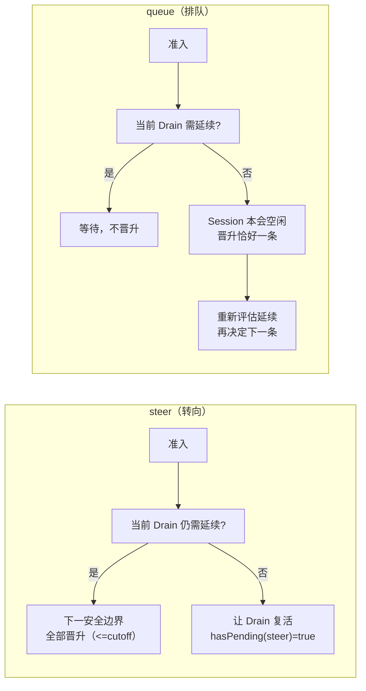
```mermaid
flowchart LR
    subgraph Steer["steer（转向）"]
        S1["准入"] --> S2["当前 Drain 仍需延续?"]
        S2 -- 是 --> S3["下一安全边界<br/>全部晋升（<=cutoff）"]
        S2 -- 否 --> S4["让 Drain 复活<br/>hasPending(steer)=true"]
    end
    subgraph Queue["queue（排队）"]
        Q1["准入"] --> Q2["当前 Drain 需延续?"]
        Q2 -- 是 --> Q3["等待，不晋升"]
        Q2 -- 否 --> Q4["Session 本会空闲<br/>晋升恰好一条"]
        Q4 --> Q5["重新评估延续<br/>再决定下一条"]
    end
```

- **steer**：在当前 drain 仍需延续时，于下一个安全边界晋升。`CONTEXT.md` 关系 #102：steering 提示在当前 drain 仍需延续时于下一个安全边界晋升；晋升任何新准入的用户输入会重置所选 agent 的 provider-turn 配额；多个提示在一个边界晋升只重置一次。
- **queue**：在当前 drain 需延续时**不**晋升；当 Session 本会空闲时，runner 晋升恰好一条排队提示，然后在晋升另一条前重新评估延续。

### 12.6 准入的公开语义：SessionV2.prompt

`SessionV2.prompt({ id?, sessionID, prompt, delivery?, resume? })`（`packages/core/src/session.ts`）：

- `delivery` 默认 `"steer"`。
- `resume !== false`：准入后调用 `execution.wake(sessionID)`（建议性唤醒）。
- `resume: false`：仅准入，不唤醒（admit-only 行为）。

这对应 `CONTEXT.md` 的「除非 `resume: false` 请求仅准入行为」。`resume` 的语义是「是否在准入后调度建议性执行唤醒」——它不保证立即执行，因为唤醒是建议性的、可合并的。

### 12.7 重用与冲突

`CONTEXT.md` 关系：「重用 Session ID 会采纳既有 Session；重用 prompt 消息 ID 仅在 Session、prompt、delivery 模式都匹配时协调一次精确重试；冲突的重用失败。历史上的投影提示在精确重试时惰性合成已晋升的 inbox 记录。」这由 `SessionInput.find` 的幂等检查与 `matchesProjection`/`equivalent` 守卫共同实现。

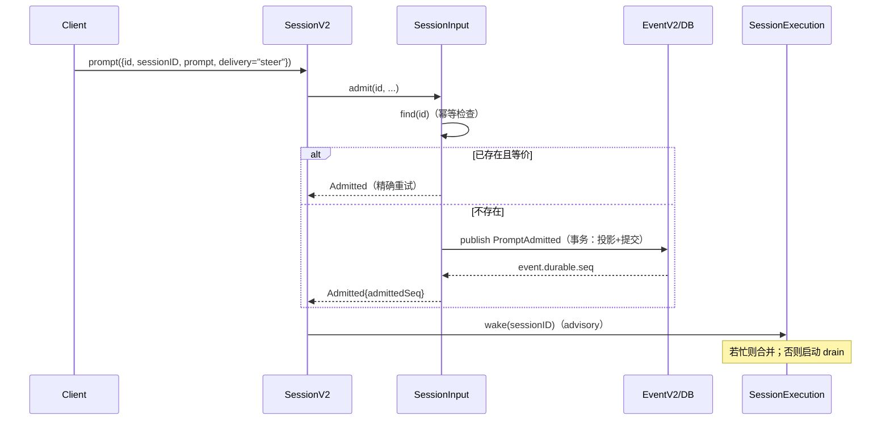
```mermaid
sequenceDiagram
    participant Client
    participant Facade as SessionV2
    participant Input as SessionInput
    participant Store as EventV2/DB
    participant Exec as SessionExecution
    Client->>Facade: prompt({id, sessionID, prompt, delivery="steer"})
    Facade->>Input: admit(id, ...)
    Input->>Input: find(id)（幂等检查）
    alt 已存在且等价
        Input-->>Facade: Admitted（精确重试）
    else 不存在
        Input->>Store: publish PromptAdmitted（事务：投影+提交）
        Store-->>Input: event.durable.seq
        Input-->>Facade: Admitted{admittedSeq}
    end
    Facade->>Exec: wake(sessionID)（advisory）
    Note over Exec: 若忙则合并；否则启动 drain
```

---

## 第十三章 会话执行路由与运行协调器


### 12.8 inbox 的事件溯源化迁移

`session_input` 表的 `20260604172448_event_sourced_session_input` 迁移是一次关键的架构转变。它清空旧表并用 `admitted_seq`/`promoted_seq` 重新建立，把 inbox 状态完全由持久事件流驱动。之前 inbox 是直接 CRUD——准入直接 INSERT、晋升直接 UPDATE。事件溯源化后，inbox 行是 `PromptAdmitted` 与 `Prompted` 事件的投影，由投影器在事件提交事务内写入。

这个转变的价值是「inbox 状态可从事件流完整重建」。如果 inbox 表损坏或需要迁移，只需重放事件流即可重建——无需数据迁移脚本。它也使 inbox 与会话消息投影共享同一事务边界：`PromptAdmitted` 事件同时驱动 inbox 行写入与（未来）可能的下游通知，原子性保证。

`projectAdmitted` 的 `onConflictDoNothing` 与 `projectPrompted` 的 `isNull(promoted_seq)` 守卫是幂等性的实现。事件可能因重试或重放被多次提交，投影器必须幂等——`onConflictDoNothing` 防止重复 INSERT，`isNull(promoted_seq)` 防止已晋升的行被再次晋升。`matchesProjection` 校验投影与事件一致，否则抛 `LifecycleConflict`，阻止「事件与投影状态不一致」的损坏传播。

### 12.9 cutoff 快照的一致性保证

`promoteSteers(db, events, sessionID, cutoff)` 的 `cutoff` 是回合开始时取的 `EventV2.latestSequence(db, session.id)`。这个快照保证一个回合内的晋升基于一致的视图：只有 `admitted_seq <= cutoff` 的 steer 被晋升，回合进行期间新准入的 steer 留到下一回合。

为什么需要这个快照？考虑并发场景：模型正在输出第 N 回合，用户在此期间连续发了 3 条 steer。若不设 cutoff，第 N 回合可能晋升第 1 条后，第 2、3 条又准入进来又被晋升，导致一个回合内晋升不确定数量的输入。设 cutoff 后，第 N 回合只晋升 cutoff 时刻已存在的 steer（可能 0 条），新 steer 在第 N+1 回合边界统一处理。这使回合内的晋升行为可预测。

`promoted > 0` 则 `currentStep = 1` 重置步数——但一个边界无论晋升几条，只重置一次。这防止「晋升多条输入获得额外步数」的漏洞，同时保证「新输入让 agent 重新开始计数」的语义。

### 12.10 queue 的 FIFO 与一次一条

`promoteNextQueued` 选择**恰好一条**最旧未晋升的 queue 行。这个「一次一条」是刻意的：`CONTEXT.md` 关系 #103 规定，当 Session 本会空闲时，runner 晋升恰好一条排队提示，然后在晋升另一条前重新评估延续。

为什么不全晋升？因为每条 queue 是一个独立的用户任务，模型应对每条完整回应后再处理下一条。若一次晋升多条，模型可能混淆它们或只回应第一条。一次一条保证了「一个任务完整处理后再开始下一个」的顺序语义。

外层循环的 `shouldRun = hasPending("queue")` 在内层耗尽后检查：若有 queue，晋升一条（`promotion="queue"`），重新进入内层循环处理这条。处理完后再次检查 queue，循环直到无 queue。这是「空闲时才取下一条」的精确实现。

### 12.11 resume 的 admit-only 语义

`SessionV2.prompt({ resume: false })` 请求仅准入行为：准入输入但不调 `execution.wake`。这用于「我想排队多个输入但不立即执行」的场景——如编程式地批量喂入任务，然后手动触发执行。

默认（`resume` 省略或 true）准入后调 `execution.wake(sessionID)`——建议性唤醒。唤醒是边沿触发且可合并的：若 drain 进行中，`pendingWake=true` 合并；若空闲，启动 drain。唤醒不保证立即执行，只保证「有合格输入时会 drain」。这种「admit 持久、wake 建议」的分离使调用方可以「先记录事实（admit），再异步触发执行（wake）」，二者解耦。

`run`（显式 resume）与 `wake`（建议性）的区别也在此：`run` 用 `force=true`，即使无合格输入也强制走一次 provider 尝试（用于「我就想让模型再说点什么」）；`wake` 用 `force=false`，只在有合格输入时才调用 provider。

---

### 13.1 SessionExecution：进程全局路由

`SessionExecution`（`packages/core/src/session/execution.ts`）是**进程全局**的执行路由服务，只从 Session ID 出发：

```ts
export interface Interface {
  readonly active: Effect.Effect<ReadonlySet<SessionSchema.ID>>
  readonly resume: (sessionID: SessionSchema.ID) => Effect.Effect<void, SessionRunner.RunError>
  readonly wake: (sessionID: SessionSchema.ID) => Effect.Effect<void>
  readonly interrupt: (sessionID: SessionSchema.ID) => Effect.Effect<void>
}
```

其本地实现（`execution/local.ts`）的路由逻辑是 V2「Location 化」的核心：

```text
SessionExecution.resume(sessionID)
  -> SessionStore.get(sessionID)         // 读会话，取其 location
  -> LocationServiceMap.get(session.location)  // 取该 Location 的服务层
  -> SessionRunner.run({ sessionID, force })   // 在该 Location 层下运行
```

`SessionExecution` 与读侧的 `SessionStore` 都是进程全局；而 `SessionRunner`、目录、模型解析器、工具注册表、权限状态、文件系统都**按 Location 缓存**。**没有 Layer 接收 Session ID**——这是 V2 的硬性约束。被省略的 `Location.workspaceID` 意味着「隐式本地」放置；显式的工作区身份保留给未来的放置语义。

### 13.2 本地实现

`execution/local.ts` 用 `SessionRunCoordinator.make<SessionSchema.ID, SessionRunner.RunError>({ drain })` 构造协调器，其中 `drain` 闭包：

1. `store.get(sessionID)` 取会话；不存在则 `Effect.die`。
2. `SessionRunner.Service.use((runner) => runner.run({ sessionID, force }))`，并用 `Effect.provide(locations.get(session.location))` 提供该会话 Location 的服务层——这样 runner 内部解析到的就是正确 Location 的目录、权限、工具等。
3. `Effect.tapCause` 记录非中断错误日志。

协调器的 `active`/`interrupt`/`resume`/`wake` 映射到 `SessionExecution` 的对应能力。`node` 声明为全局节点，依赖 `SessionStore.node` 与 `LocationServiceMap.node`。

### 13.3 SessionRunCoordinator：每 key 序列化 + 合并

`SessionRunCoordinator`（`packages/core/src/session/run-coordinator.ts`）是 V2 进程本地并发控制的精髓。它的不变量（`CONTEXT.md`）：一个进程全局的协调器为每个本地 Session **序列化**执行，同时允许不同 Session **并发**运行；resume 加入活跃执行，重叠的 wake 合并为一个后续，中断停止当前进程本地执行但不删除持久 inbox 工作。

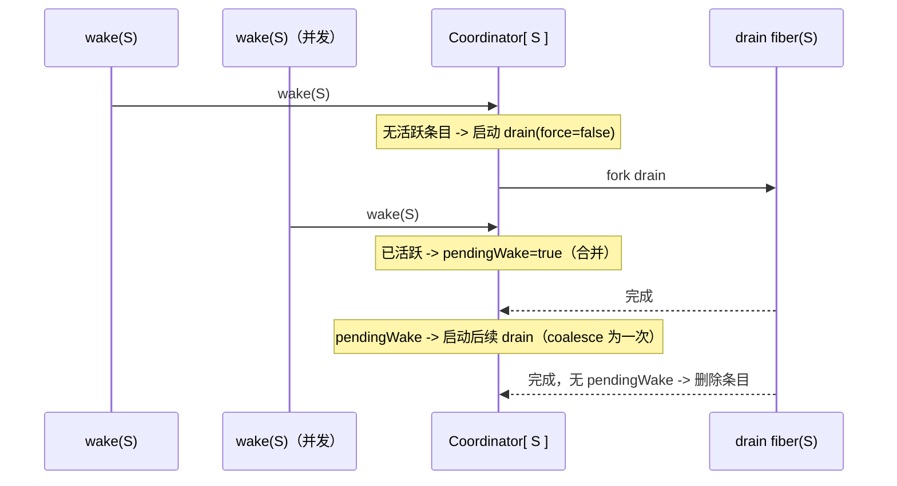
```mermaid
sequenceDiagram
    participant W1 as wake(S)
    participant W2 as wake(S)（并发）
    participant Coord as Coordinator[ S ]
    participant Drain as drain fiber(S)
    W1->>Coord: wake(S)
    Note over Coord: 无活跃条目 -> 启动 drain(force=false)
    Coord->>Drain: fork drain
    W2->>Coord: wake(S)
    Note over Coord: 已活跃 -> pendingWake=true（合并）
    Drain-->>Coord: 完成
    Note over Coord: pendingWake -> 启动后续 drain（coalesce 为一次）
    Drain-->>Coord: 完成，无 pendingWake -> 删除条目
```

协调器的内部状态是 `Map<Key, Entry<E>>`，每个 `Entry` 含 `done: Deferred`、`owner?: Fiber`、`pendingWake: boolean`、`stopping: boolean`。关键方法：

- **`run(key)`**（对应 `resume`）：若已有活跃条目且未在停止，则 `await(entry.done)`（**加入**活跃执行）；否则创建条目并以 `force=true` 启动 drain。整个方法是 `Effect.uninterruptibleMask`，保证加入的原子性。
- **`wake(key)`**：若已有活跃条目，置 `pendingWake=true`（**合并**）；否则创建条目以 `force=false` 启动 drain。`wake` 是纯同步设置，极其廉价——这就是「建议性、边沿触发」的语义。
- **`interrupt(key)`**：若 `entry.owner` 存在，置 `stopping=true`、`pendingWake=false`、`Fiber.interrupt(owner)`。它会等待清理（fiber 解除注册时 `settle` 完成）。

`settle(key, entry, exit)` 在 drain fiber 退出时被调用：若成功且 `pendingWake`，则重置 `pendingWake` 并启动**一次**后续 drain（合并）；否则若有 `pendingWake` 则用新条目继续，否则删除条目并 resolve `done`。

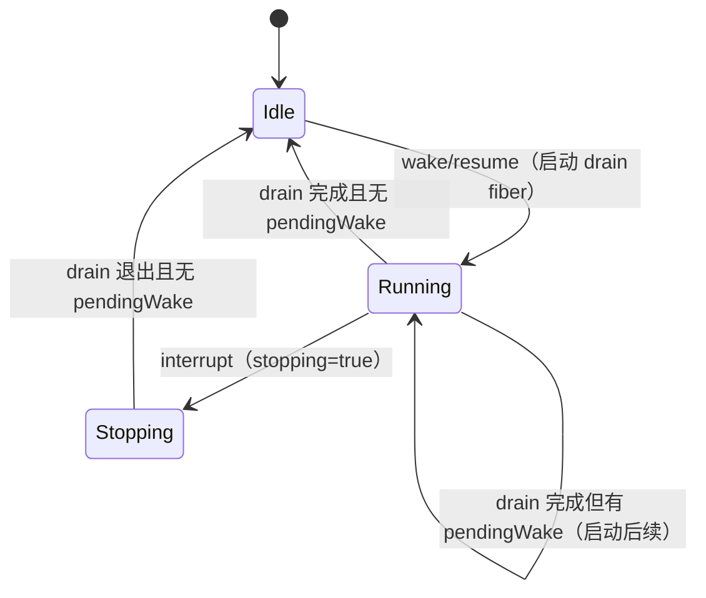
```mermaid
stateDiagram-v2
    [*] --> Idle
    Idle --> Running: wake/resume（启动 drain fiber）
    Running --> Running: wake（pendingWake=true，合并）
    Running --> Running: resume（await done，加入）
    Running --> Stopping: interrupt（stopping=true）
    Stopping --> Idle: drain 退出且无 pendingWake
    Running --> Idle: drain 完成且无 pendingWake
    Running --> Running: drain 完成但有 pendingWake（启动后续）
```

### 13.4 两种入口

`CONTEXT.md` 区分两个执行入口：

- **`run`（显式 resume）**：加入活跃执行，或在空闲时启动一个**强制** drain。强制 drain 绕过「无合格输入」守卫，但准备仍可能在 provider 尝试前失败。对应 `SessionExecution.resume` → 协调器 `run(force=true)`。
- **`wake`（建议性）**：报告新记录的持久 inbox 工作。重复 wake 合并。wake 只有在能晋升合格输入时才调用 provider。对应 `SessionExecution.wake` → 协调器 `wake`。

`sessions.active()` 快照当前进程前台 drain 注册表为 `{ sessionId: { type: "running" } }` 的记录；缺失的 ID 即非活跃；后台子代理与任务不把其父 Session 加入此注册表；进程重启清空注册表。

### 13.5 中断的幂等性

`SessionV2.interrupt(sessionID)` 先验证持久 Session 存在（否则 `SessionNotFoundError`）。对已知 Session，中断是**幂等**的：空闲、已结算、或本地未拥有的执行都是 no-op。这由协调器的 `interrupt` 实现——只有 `entry.owner` 存在时才真正中断 fiber。

---

## 第十四章 会话运行器与 Drain 循环

### 14.1 SessionRunner 接口

`SessionRunner`（`packages/core/src/session/runner/index.ts`）是 Location 范围的服务：

```ts
export interface Interface {
  readonly run: (input: {
    readonly sessionID: SessionSchema.ID
    readonly force: boolean
  }) => Effect.Effect<void, RunError>
}
```

`RunError = LLMError | SessionRunnerModel.Error | MessageDecodeError | ContextSnapshotDecodeError | SystemContext.InitializationBlocked | ToolOutputStore.Error`。其实现 `run` 是 V2 drain 循环的主体（`runner/llm.ts`）。

### 14.2 drain 循环：双层 while

`run` 的结构是双层循环，精确实现 steer/queue 的晋升语义：

```mermaid
flowchart TB
    Start["run({sessionID, force})"]
    Start --> Check{"hasSteer? 否则 hasQueue?"}
    Check -->|"!force && 无待处理"| End["return"]
    Check --> Fail["failInterruptedTools(sessionID)"]
    Fail --> Outer{"shouldRun<br/>(force||hasSteer||hasQueue)"}
    Outer --> Inner{"needsContinuation<br/>(初始 true, step=1)"}
    Inner --> Turn["runTurn(sessionID, promotion, step)"]
    Turn --> Set1["needsContinuation = result.needsContinuation<br/>step = result.step + 1<br/>promotion = 'steer'"]
    Set1 --> Inner2{"!needsContinuation?<br/>检查 hasPending(steer)"}
    Inner2 -->|"有新 steer"| Inner
    Inner2 -->|无| OuterCheck{"hasPending(queue)?"}
    OuterCheck -->|"是，promotion='queue'"| Outer
    OuterCheck -->|否| End
```

伪代码（精简自源码）：

```text
run({ sessionID, force }):
  hasSteer = hasPending(sessionID, "steer")
  hasQueue = hasSteer ? false : hasPending(sessionID, "queue")
  if !force && !hasSteer && !hasQueue: return
  failInterruptedTools(sessionID)
  promotion = hasSteer ? "steer" : hasQueue ? "queue" : undefined
  shouldRun = force || hasSteer || hasQueue
  while shouldRun:
    needsContinuation = true; step = 1
    while needsContinuation:
      result = runTurn(sessionID, promotion, step)
      needsContinuation = result.needsContinuation
      step = result.step + 1
      promotion = "steer"                       # 后续回合默认 steer
      if !needsContinuation:
        needsContinuation = hasPending(sessionID, "steer")   # 新 steer 复活 drain
    shouldRun = hasPending(sessionID, "queue")  # queue 在空闲时才晋升
    promotion = shouldRun ? "queue" : undefined
```

关键语义：

- **内层循环**：持续执行 provider 回合，只要模型还发出工具调用（`needsContinuation`）。每个回合结束后 `promotion` 设为 `"steer"`——若有新的 steer 在回合进行期间被准入，它会在下一个安全边界被晋升并**复活** drain（`hasPending(steer)` 检查）。
- **外层循环**：当内层耗尽（无 steer、无工具延续），检查是否有 queue 待晋升；有则晋升**一条**（`promotion="queue"`），重新进入内层循环。
- **步数重置**：当 `promoteSteers/promoteNextQueued` 晋升了输入（`promoted > 0`），`currentStep = 1`，重置 agent 的 provider-turn 配额（`CONTEXT.md` 关系 #102）。

### 14.3 failInterruptedTools：清扫遗留工具

drain 开始时，`failInterruptedTools` 扫描投影历史中所有助手消息里的工具，若状态为 `pending` 或 `running`，则发布 `SessionEvent.Tool.Failed`（错误 `"Tool execution interrupted"`）。这保证「上次进程被中断时遗留的未完成工具」不会被静默重放——被放弃的副作用从不被静默重放（`CONTEXT.md`）。

### 14.4 一个 provider 回合：runTurnAttempt

`runTurnAttempt` 是单个 provider 回合的完整编排。其步骤（结合第十一章纪元交互）：

```mermaid
sequenceDiagram
    participant R as Runner
    participant Agent as AgentV2
    participant Epoch as ContextEpoch
    participant Input as SessionInput
    participant Model as SessionRunnerModel
    participant Hist as SessionHistory
    participant Tools as ToolRegistry
    participant Comp as Compaction
    participant LLM as LLMClient
    participant Pub as LLMEventPublisher
    R->>R: Location 守卫（directory/workspaceID 不符则 interrupt）
    R->>Agent: agents.select(session.agent)
    R->>Epoch: initialize(loadSystemContext(agent))
    Note over R,Epoch: 先于晋升，确保不可用基线让输入 pending
    R->>Input: promoteSteers/promoteNextQueued（安全边界）
    Input-->>R: promoted count
    R->>Epoch: prepare(loadSystemContext(agent))（若 initialize 未命中）
    Epoch-->>R: system{baseline, baselineSeq}
    R->>Model: resolve(session) -> LLM.Model
    R->>Hist: entriesForRunner(sessionID, baselineSeq)
    R->>Tools: materialize(agent.permissions)（非末步）
    R->>R: 组装 LLM.request（system=baseline, messages=历史, tools）
    R->>Comp: compactIfNeeded?（预算超限）
    alt 需要压缩
        Comp-->>R: die(continueAfterCompaction)
        Note over R: 递归重入 runTurn
    end
    R->>Pub: createLLMEventPublisher
    R->>LLM: llm.stream(request)
    loop 流式事件
        LLM-->>Pub: text/reasoning/tool-call...
        Pub->>Pub: 持久化 Step/Text/Reasoning/Tool.Called
        alt 非provider执行的 tool-call
            R->>Tools: settle(call)（uninterruptible）
            Tools-->>R: Settlement(result/output/outputPaths)
            R->>Pub: publish ToolResult(+outputPaths)
        end
    end
    R->>R: awaitToolFibers（等待所有工具结算）
    R->>Pub: Step.Ended（含快照 diff）
    R-->>R: {needsContinuation, step}
```

详细步骤说明：

1. **Location 守卫**：若 `session.location.directory/workspaceID` 与当前 Location 不符，`Effect.interrupt`——这防止跨 Location 的 drain 串台。
2. **agent 选择**：`agents.select(session.agent)`。agent 与模型在每个回合开始时被采样（`CONTEXT.md` 关系 #123）：边界后 admitted 的变更适用于下一个回合，不重启当前回合。
3. **纪元初始化**（先于晋升）：`SessionContextEpoch.initialize(...)` 在晋升前运行，确保不可用的初始基线让输入保持 pending 与可重试。
4. **安全边界晋升**：`cutoff = EventV2.latestSequence(...)`；`promotion==="steer"` → `promoteSteers(cutoff)`；`promotion==="queue"` → `promoteNextQueued()` 再 `promoteSteers(cutoff)`；若 `promoted > 0` 则 `currentStep = 1`。
5. **纪元调和**（晋升后）：`system = initialized ?? SessionContextEpoch.prepare(...)`——普通调和在晋升之后，使合并的对话中系统消息落在新晋升用户输入之后（`CONTEXT.md` 关系 #100-101）。
6. **模型解析**：`SessionRunnerModel.resolve(session)` 把会话的模型引用解析为 `LLM.Model`。
7. **历史投影**：`SessionHistory.entriesForRunner(db, session.id, system.baselineSeq)` 取投影历史（见第十六章）。
8. **步数上限**：`isLastStep = agent.info?.steps !== undefined && currentStep >= agent.info.steps`。若到末步：不 materialize 工具，`toolChoice: "none"`，追加 `MAX_STEPS_PROMPT` 提示模型收尾。
9. **组装请求**：`LLM.request({ model, providerOptions: { openai: { promptCacheKey } }, system: [agent.system, baseline].filter.map(SystemPart.make), messages: [...toLLMMessages(context, model), ...maxSteps?], tools, toolChoice })`。`promptCacheKey` 在 session ID 为 `ses_<64hex>` 时取后 60 字符，用于 provider 缓存命中。
10. **预回合压缩检查**：`compaction.compactIfNeeded(...)` 估算请求 token，若超过 `context - max(output, buffer)`，则触发压缩并 `die(continueAfterCompaction)`，由 `runTurn` 的 `catchDefect` 捕获后递归重入。
11. **provider 流**：`llm.stream(request)` 经 `Stream.runForEach` 消费，每个事件通过 `createLLMEventPublisher` 持久化（由 `Semaphore(1)` 串行化）。上下文溢出检测：在助手开始前若收到溢出错误，捕获为 `overflowFailure`（恢复路径见第十六章）。
12. **工具结算**：对每个非 provider 执行的 `tool-call`，`needsContinuation = true`，`toolMaterialization.settle(...)` 在 `Effect.uninterruptibleMask` 内运行（见第十五章）。
13. **步结算**：流与工具 fiber 完成后，发布 `SessionEvent.Step.Ended`（含前后快照 diff）。
14. **返回**：`{ needsContinuation: !hasProviderError && needsContinuation, step: currentStep }`。

### 14.5 压缩过渡的递归处理

`runTurn` 与 `runAfterOverflowCompaction` 通过 `catchDefect(TurnTransitionError)` 处理两种过渡：

- **`ContinueAfterCompaction`**：自动压缩完成，从压缩后历史重建请求；递归 `runTurn`。
- **`ContinueAfterOverflowCompaction`**：溢出压缩完成，走一次不带回溢出恢复的路径；若溢出压缩后仍溢出，则 `die`（不再循环、不重放部分副作用）。

这保证恢复**从不循环或重放部分副作用**（`CONTEXT.md`）：第二次溢出、压缩不可用、或在持久输出后溢出，都成为普通的终态失败。

---

## 第十五章 提供者回合与工具结算


### 12.12 projectPrompted 的回填逻辑

`projectPrompted` 处理晋升事件的投影，有两种路径。正常路径：`UPDATE session_input SET promoted_seq = input.promotedSeq WHERE id AND session_id AND promoted_seq IS NULL`，用 `isNull(promoted_seq)` 守卫防止重复晋升。若更新成功（返回行），用 `matchesProjection` 校验投影与事件一致，否则抛 `LifecycleConflict`。

回填路径：若更新返回空（行不存在或已晋升），`find(db, id)` 查已存记录。若存在且 `promotedSeq` 匹配，幂等返回。若不存在（事件跑赢了准入投影——`Prompted` 事件先到，`PromptAdmitted` 投影未完成），回填 INSERT 一行，`admitted_seq = promoted_seq`（同序列）。

这个回填处理「事件乱序到达」的并发场景：`PromptAdmitted` 与 `Prompted` 是两个事件，投影器可能先处理 `Prompted`。回填使 `Prompted` 投影能自洽——即使准入投影未完成，晋升投影也能构造一致的行。这是「投影器需处理乱序」的鲁棒性设计。

### 12.13 equivalent 与精确重试

`equivalent(input, expected)` 检查 admitted input 是否与期望的 `sessionID` + `prompt` + `delivery` 匹配。`matchesPrompt` 用 `JSON.stringify(encodePrompt(...))` 比较编码后的 prompt——而非直接比较对象，避免键顺序差异。

这支持 `CONTEXT.md` 的精确重试语义：「重用 prompt 消息 ID 仅在 Session、prompt、delivery 模式都匹配时协调一次精确重试；冲突的重用失败。」若客户端用同一 ID 但不同 prompt 重试，`equivalent` 返回 false，`admit` 不返回已存记录，而是尝试新准入——但 `find` 已存在同 ID 行，触发冲突处理。

`projectAdmitted` 的 `LifecycleConflict` 在「该 ID 已在 `session_message`（已晋升）」时抛——阻止「已可见的消息被退回为待处理」。这是「晋升不可逆」的保护——一旦消息可见，不能退回 inbox。

### 12.14 publish 的 LifecycleConflict 捕获

`SessionInput.publish`（内部，用于 promote）对每行发布 `Prompted` 事件，`catchDefect` 捕获 `LifecycleConflict`：若冲突，`find` 已存记录，若已晋升则视为成功（并发幂等），否则 die。这处理「promote 时并发投影已晋升」的竞态。

这种「乐观发布 + 冲突回退」模式在并发投影中常见：发布事件时假设未晋升，若投影器发现已晋升（`LifecycleConflict`），回退查已存记录确认状态。这使并发 promote 安全——即使两个 promote 同时跑，最终状态一致（一个成功，另一个发现已晋升而幂等）。

### 12.15 delivery 的默认与省略

`SessionV2.prompt` 的 `delivery` 默认 `"steer"`。省略 delivery 时，提示作为 steer 准入——在当前 drain 需延续时于下一安全边界晋升。这是「用户输入默认转向当前任务」的语义，符合多数交互场景：用户在模型工作时发消息，是想补充/纠正当前任务，而非排队新任务。

`queue` 用于「我想排队多个独立任务」——如批量喂入「修复 bug A」「重构模块 B」「写测试 C」，让模型一个一个处理。queue 在当前任务完成后才晋升，保证顺序。

`resume` 默认 true（准入后 wake）。`resume: false` 用于「编程式批量准入」——先记录多个输入，再手动触发执行。这分离「记录」与「执行」，使批量任务管理灵活。

---

### 13.9 LocationServiceMap 的层缓存

`LocationServiceMap` 是 Location → 服务层的映射。`get(location)` 返回该 Location 的 Effect `Layer`。这是「runner/目录/权限/工具按 Location 缓存」的实现机制——首次访问某 Location 时构建其层并缓存，后续直接用。

`execution/local.ts` 的 `drain` 用 `Effect.provide(locations.get(session.location))` 注入 Location 层。这使 `SessionRunner` 内部的服务调用解析到该 Location 的实例——`ToolRegistry` 是该 Location 的工具注册表、`PermissionV2` 是该 Location 的权限状态、`FileSystem` 是该 Location 的文件系统。

这种「Location 层缓存」使多工作区隔离：工作区 A 与 B 有各自的工具注册表、权限、目录解析。会话移动改变 `session.location`，下次 drain 自动用新 Location 的层——无需迁移 runner 状态。这是「Location 范围服务自然重新解析」的基础。

### 13.10 协调器的 FiberSet.makeRuntime

`SessionRunCoordinator.make` 用 `FiberSet.makeRuntime<never, void, never>()` 创建运行时 fork。`fork` 用这个运行时派生 drain fiber。`FiberSet` 使「在协调器 scope 内 fork 多个 fiber」可控——fiber 生命周期绑定协调器。

`start(key, entry, force, successor)` 用 `fork` 派生：`(successor ? Effect.yieldNow : Deferred.await(ready)).pipe(Effect.andThen(Effect.suspend(() => options.drain(key, force))), Effect.onExit((exit) => Effect.sync(() => settle(key, entry, exit))), Effect.exit, Effect.asVoid)`。

`successor ? yieldNow : await(ready)` 的区别：首个 drain 立即开始（`ready` 立即 resolve），后续 drain（settle 启动的 successor）先 `yieldNow` 让出调度——避免「settle 后立即启动 successor 占用当前 fiber」的栈问题。这是 Effect 调度的细节，但保证协调器在「drain 完成→启动 successor」时正确让出。

### 13.11 settle 的 successor 创建

`settle(key, entry, exit)` 在 drain fiber 退出时调。若成功且 `pendingWake`，重置 `pendingWake` 并用 `start(key, entry, false, true)` 启动 successor（`successor=true`）——复用同一 entry，新 drain。

若退出（成功或失败）且 `pendingWake` 为 false，但有 `pendingWake`（重新检查），用新 entry 继续——`const successor = entry.pendingWake ? makeEntry() : undefined`，`active.set(key, successor)`，`start(key, successor, false, true)`。

否则（无 pendingWake），删除 entry：`active.delete(key)`，`Deferred.doneUnsafe(entry.done, exit)` resolve。

这个逻辑实现「wake 合并为一个后续 drain」：drain 完成时若有 pendingWake，启动一次后续；否则结束。pendingWake 在 drain 进行中被 wake 设为 true（合并多个 wake 为一个 pendingWake），settle 时只启动一个 successor。这是「重复 wake 合并为一个后续」的精确实现。

### 13.12 interrupt 的 pendingWake=false

`interrupt(key)` 设 `pendingWake=false`——中断后不启动后续 drain。这是「中断是停止，不重启」的语义。若不设 false，settle 时看到 pendingWake 会启动 successor，违背中断意图。

`stopping=true` 标记 entry 为停止中。`run`/`resume` 检查 `entry.stopping`：若停止中，`await(done)` 后递归 `run(key)`（等待停止完成后再尝试）。这处理「中断进行中又来 resume」的并发——resume 等中断完成，再启动新 drain。

`Fiber.interrupt(owner)` 实际中断 fiber。fiber 的 `Effect.tapCause` 记录非中断错误，`uninterruptibleMask` 内的结算区完成，然后 fiber 退出，`settle` 被调。因 `stopping=true`，settle 不启动 successor，删除 entry，resolve done。interrupt 的调用者 `await(done)` 后返回，确认 drain 停了。

---

### 14.6 publisher 的 Semaphore 串行化

`createLLMEventPublisher` 的 publish 用 `Semaphore.makeUnsafe(1).withPermit` 串行化。`const publish = (event, outputPaths) => withPublication(publisher.publish(event, outputPaths))`。这保证流式事件按序持久化——即使 Effect 并发，publish 串行。

为什么需要串行？流式事件有顺序语义（`text.delta` 必须在 `text.end` 前，`tool.called` 在 `tool.success` 前）。若并发 publish 打乱顺序，持久化的事件序列错乱，重放时模型看到错误顺序。Semaphore(1) 保证「一个事件持久化完才下一个」。

但工具结算是并发的（`FiberSet.run`）——多个工具同时执行。结算完成后 publish 结果时仍串行。这是「执行并发、持久化串行」的权衡——执行快（并发）、持久化有序（串行）。`SessionProcessor`（V1）的「Session-event publication remains serialized per provider turn」印证这一点。

### 14.7 overflowFailure 的捕获时机

`overflowFailure` 在流处理中捕获：`if (LLMEvent.is.providerError(event)) { if (isContextOverflowFailure(event) && !publisher.hasAssistantStarted()) { overflowFailure = event; return } }`。只有「溢出且助手未开始」才捕获为 overflowFailure，其余 provider 错误正常 publish。

「助手未开始」是关键：若助手已开始输出文本，溢出不是「干净失败」——已有持久输出，不能压缩重试。`hasAssistantStarted` 检查 publisher 是否已发布任何助手内容。若已开始，overflowFailure 不捕获，错误正常 publish，成为终态失败。

流结束后，`failure = stream._tag === "Failure" ? Cause.findErrorOption(stream.cause) : undefined`。`recoverOverflow && !hasAssistantStarted && isContextOverflowFailure(overflowFailure ?? failure)` 则走 `recoverOverflow`（压缩）。若压缩成功，`die(continueAfterOverflowCompaction)` 递归重入。

### 14.8 awaitToolFibers 的 raceFirst

`awaitToolFibers = (fibers) => Effect.raceFirst(FiberSet.join(fibers), FiberSet.awaitEmpty(fibers))`。`raceFirst` 使「全部完成」或「集合为空」任一先发生即返回。

`FiberSet.join` 等待所有 fiber 完成（成功或失败）。`FiberSet.awaitEmpty` 等待集合为空（所有 fiber 被移除）。正常情况下两者同时发生（最后一个 fiber 完成即集合空）。但 `raceFirst` 处理边界——如集合从未有 fiber（无工具调用），`awaitEmpty` 立即返回，`join` 永等。raceFirst 使「无工具」时不阻塞。

这是 Effect 的「优雅处理两种终止条件」的惯用法。`awaitToolFibers` 保证「所有工具结算完成或确认无工具」才返回，无论哪种情况。

### 14.9 Step.Ended 的条件性发布

`Step.Ended` 只在 `stepSettlement && !hasProviderError` 时发布。`stepSettlement = publisher.stepSettlement()`——若 publisher 有活跃助手（`hasActiveAssistant`）且步结算信息（finish、tokens），返回之。无活跃助手或 provider 错误时不发 Step.Ended。

这避免「无有效输出却发 Step.Ended」的噪声事件。Step.Ended 携带快照 diff（`snapshots.capture()` 前后），是「这一步改了什么」的记录。若无输出，无 diff 可记，不发。

`cost: 0` 是占位——实际成本计算在 V1 的 `Session.getUsage`，V2 的 Step.Ended 暂未计算成本（`stepSettlement.tokens` 有 token，cost 0 是 TODO）。这是 V2 未完成项的体现——成本计算尚未从 V1 移植。

---

### 15.1 工具调用的生命周期

当模型在流中发出 `tool-call` 事件，V2 runner 的处理遵循一套严格的「先记录、后执行、有界投影、再延续」流程。`CONTEXT.md` 的 tool settlement 规约：

- 持久记录每次工具调用**先于**副作用开始。
- 通过 core 拥有的注册表钩子授权并执行已记录的本地调用。
- 持久化有类型的成功、失败、与 provider 执行的工具结果。
- 急切地启动每个已记录的本地调用，并在延续前等待所有结算。
- 在本地工具结果后重载投影历史并启动下一个显式 provider 回合。

```mermaid
sequenceDiagram
    participant LLM
    participant Pub as Publisher
    participant Tools as ToolRegistry
    participant FS as FileSystem/Permission
    participant Store as EventV2
    participant OutputStore as ToolOutputStore
    LLM->>Pub: tool-call(id, name, input, providerExecuted?)
    Pub->>Store: 持久化 Tool.Called（先于副作用）
    alt providerExecuted
        Note over Pub: provider 自行执行，结果随流返回
    else 本地执行
        Pub->>Tools: settle({sessionID, agent, assistantMessageID, call})
        Tools->>Tools: 解析有效注册（identity 校验，防 stale）
        Tools->>Tools: 解码 input（codec）
        Tools->>FS: 权限断言 + 执行
        FS-->>Tools: 输出
        Tools->>OutputStore: bound（有界投影 + 受管文件）
        OutputStore-->>Tools: Settlement{result, output, outputPaths}
        Tools-->>Pub: settlement
        Pub->>Store: publish ToolResult(+outputPaths)
    end
```

### 15.2 ToolRegistry 的结算契约

`ToolRegistry`（`packages/core/src/tool/registry.ts`）的 `Interface`：

```ts
readonly materialize: (permissions?: PermissionV2.Ruleset) => Effect.Effect<Materialization>
readonly settle: (input: ExecuteInput) => Effect.Effect<Settlement, ToolOutputStore.Error>
```

`Materialization` 含 `definitions`（要发给模型的工具定义）与 `settle`。`settle` 的内部逻辑（`settleWith`）：

1. **解析有效注册**：`local.get(call.name)?.at(-1) ?? applications.entries().get(call.name)`。若不存在 → 返回错误 `"Unknown tool: <name>"`。
2. **防 stale**：若在 provider 回合 materialization 时捕获了 `advertised` identity，而当前注册的 `identity !== advertised`，返回 `"Stale tool call"`——保证一次调用从不执行非其回合所宣传的注册（`specs/v2/tools.md` 的 stale rejection 法则）。
3. **执行**：`settle(registration.tool, call, context)`，捕获 `LLM.ToolFailure` 转为模型可见错误。
4. **有界输出**：`resources.bound({ sessionID, toolCallID, output })` 把完整文本投影为有界预览 + 受管文件（见下节）。
5. **返回 Settlement**：`{ result: ToolResultValue, output?, outputPaths? }`。

### 15.3 有界工具输出与受管文件

`ToolOutputStore`（`packages/core/src/tool-output-store.ts`）实现 `CONTEXT.md` 的「Model Tool Output」与「Managed Tool Output File」规约：

- 常量：`MAX_LINES = 2_000`、`MAX_BYTES = 50 * 1024`、`RETENTION = Duration.days(7)`、`MANAGED_DIRECTORY = "tool-output"`。
- `bound({ sessionID, toolCallID, output })`：保留有界预览在历史中，把完整文本写入受管文件（`outputPaths`）；编码/写入失败抛 `StorageError`。
- 一次工具结算接收一个聚合文本上限，取配置的最大行数或 UTF-8 字节先达者。该上限与 provider 无关；token 压力属于上下文组装与压缩。
- 通用截断保留输出的**开头与结尾**。工具可在注册表强制最终上限前应用更有意义的策略。
- 被截断的输出在有界预览与受管输出路径两处都能识别其完整文本。受管路径不修改工具已校验的结构化结果。
- 受管文件是临时的，保留期后可能过期。**有界输出**才是持久可重放的记录，而非文件。
- 保留受管文件失败**不**把成功工具操作变为失败。Session 记录明确的有损有界输出（无路径），运维收到存储失败诊断。
- 一旦工具操作成功，有界化其输出并发布其唯一持久结算形式构成一个**中断安全的完成区**：原始过大成功从不晚于后续校正被发布。
- 受管文件使用全局唯一名称于一个共享扁平目录；其绝对路径可被普通工具读取与搜索。

```mermaid
flowchart LR
    Tool["工具执行<br/>完整输出"] --> Bound["ToolOutputStore.bound"]
    Bound --> Preview["有界预览<br/>（进入 session_message）"]
    Bound --> File["受管文件<br/>（tool-output/全局唯一名）"]
    Bound --> Paths["outputPaths<br/>（路径引用）"]
    Preview --> History["持久可重放"]
    File -->|7天保留| Expire["可能过期"]
    Paths --> Model["模型可见<br/>（预览 + 路径）"]
```

### 15.4 provider 执行的工具

有些工具由 provider 自行执行（如 Anthropic 的 web search、code execution）。`tool-call` 事件携带 `providerExecuted` 标志。对这类调用，runner **不**走本地结算，而是等待 provider 在流中返回结果，并**原样**投影：

- provider 执行的工具结果保持 provider 原生转录事实，**在通用 Tool Registry 有界化之外**。它们的上下文控制需要 provider 感知的裁剪或压缩，因为某些 provider 要求精确的结构化往返载荷。
- 结算事件分别保留调用侧与结算侧的 provider 元数据，使结算与中断恢复不会擦除延续标识符。

### 15.5 中断与失败的处理

`runTurnAttempt` 末尾的结算区处理多种失败：

- **provider 错误**（无 provider-error 事件）：`failAssistant(reason.message)` + `failUnsettledTools("Provider did not return a tool result", true)`。
- **中断**（`Cause.hasInterrupts`）：`FiberSet.clear(toolFibers)`、`failUnsettledTools("Tool execution interrupted")`、若有活跃助手则 `failAssistant("Provider turn interrupted")`。
- **问题拒绝**（`QuestionV2.RejectedError`，如用户取消了 `question` 工具）：清空 fiber、`failUnsettledTools`、`Effect.interrupt`。这匹配 V1 语义：拒绝问题会停止循环，而非成为模型可见的工具输出。
- **工具 fiber 失败**（非中断）：`failUnsettledTools("Tool execution failed: <message>")`。

所有这些失败都通过 `Effect.uninterruptibleMask` 保证结算区不被中断打断——这正是「中断安全的完成区」的体现。

### 15.6 步结算与快照

成功的步在 `Step.Ended` 事件中携带**快照 diff**：回合开始前 `snapshots.capture()`，结束后再 capture，`snapshots.files({ from, to })` 得到变更文件集。这为 UI 的「这一步改了哪些文件」提供数据，也是 revert 的基础。

---

## 第十六章 自动压缩与历史投影


### 9.19 Model Tool Output 的投影语义

`CONTEXT.md` 关系 #55：「Model Tool Output 是在 Session 历史中持久化、并重放给模型的 Core 执行工具结果的有界投影。一个工具可以语义性地塑造这个投影，但工具注册表强制最终大小限制。」

「有界投影」是关键——发给模型的工具结果不是完整输出，而是有界的。`ToolOutputStore.bound` 实现这个限制：完整文本写受管文件，有界预览进历史。模型看到预览 + 路径引用，需完整内容时用 `read` 工具读受管文件。

「工具可语义性塑造」——工具的 `toModelOutput` 回调可在注册表强制最终上限前应用更有意义的策略。如 `bash` 工具可能只显示命令与退出码，而非完整输出。这是「工具自有投影策略」——工具最了解其输出如何呈现最有用。

「注册表强制最终限制」——无论工具如何塑造，注册表的 `bound` 最终强制 `MAX_LINES`/`MAX_BYTES`。这是「兜底」——防止工具投影过大。两层次：工具语义投影 + 注册表强制限制。

### 9.20 Managed Tool Output File 的过期

`CONTEXT.md` 关系 #193：「Managed Tool Output File 是临时的，可能在保留期后过期。有界 Model Tool Output，而非文件，才是持久可重放的记录。」

受管文件 7 天后清理（`ToolOutputStore.cleanup` 每小时）。这意味着「7 天后重放会话，受管文件可能已删」——模型可见的有界预览仍在历史，但路径引用的文件不存在。这是「有界输出才是持久记录」的语义——文件是辅助，预览是主。

`CONTEXT.md` 关系 #194：「保留受管文件失败不把成功工具操作变为失败。」——若 `bound` 的 `write` 失败（磁盘满等），工具仍成功，记录有损有界输出（无路径），运维收到诊断。这避免「存储失败导致重试已成功工具」的重复副作用。

### 9.21 一次工具结算的 aggregate limit

`CONTEXT.md` 关系 #190：「一次工具结算接收一个聚合文本限制，取配置的最大行数或 UTF-8 字节先达者。该限制与 provider 无关；token 压力属于上下文组装与压缩。」

「与 provider 无关」——`MAX_LINES`/`MAX_BYTES` 不因 provider 不同。这是「工具输出的持久限制」——存入历史的限制。而「token 压力」（工具结果如何影响上下文窗口）是压缩与上下文组装的关注，非工具结算。

`CONTEXT.md` 关系 #191：「通用截断保留输出的开头与结尾。」——`boundedPreview` 头+尾分割。头是输出开始（通常最重要），尾是输出结束（如错误信息、退出码）。中间省略，标记「N 行截断，完整存于路径」。

### 9.22 provider 执行工具的 context control

`CONTEXT.md` 关系 #199：「provider 执行的工具结果保持 provider 原生转录事实，在通用工具注册表有界化之外。它们的上下文控制需 provider 感知的裁剪或压缩，因为某些 provider 要求精确的结构化往返载荷。」

provider 执行的工具（如 Anthropic web search）结果原样投影，不被 `ToolOutputStore.bound` 截断。因为它们的结构化载荷（如 `web_search_tool_result`）必须原样往返——截断会破坏 provider 的工具结果格式。

但这带来上下文控制挑战——provider 工具结果可能很大（如长搜索结果），不能用通用截断。需「provider 感知的裁剪或压缩」——未来工作。当前这些结果原样存入历史，可能占用大量上下文。这是「provider 工具 vs 本地工具」的权衡——前者精确但不可控，后者可控但有界。

### 9.23 Tool Definition 的描述更新

`CONTEXT.md` 与 V1 的 `tool.definition` 插件钩子允许插件重写工具描述/schema。V2 的 `materialize` 后、发给模型前，工具定义可被插件变换。这使插件能「改写工具说明」——如某插件让 `bash` 工具的描述加上「优先使用 npm scripts」的提示。

但 V2 的 `tool.definition` 钩子是 V1 特性，V2 尚未完全移植（见 `specs/v2/session.md` 清单「Policy-filtered built-in, MCP, plugin, and structured-output tools」标记 partial）。这是 V2 未完成项——工具定义的插件变换尚未在 V2 完整实现。

---

### 13.16 SessionStore 的读侧职责

`SessionStore`（`@opencode/v2/SessionStore`）是读侧服务：`get`（取会话）、`context`（取投影对话）、`runnerContext`（取 runner 用的上下文）、`message`（取单消息）。它是进程全局，与 `SessionExecution` 一样。

`get(sessionID)` 读 `SessionTable` 行，返回会话信息。`context(sessionID)` 调 `SessionHistory.load` 返回投影对话。`runnerContext` 类似但为 runner 优化。`message({ sessionID, messageID })` 取单消息——`MessageNotFoundError` 若不存在或归属不同会话。

`SessionStore` 是「读模型」——从投影表读，非从事件流重放。这与 `EventV2.durable`（从事件流读）不同。`sessions.context` 用 `SessionStore.context`，`sessions.events` 用 `EventV2.durable`。两个读路径，不同用途。

### 13.17 SessionStore.get 与 NotFoundError

`SessionStore.get(sessionID)` 若会话不存在返回 undefined。`SessionV2` 门面把 undefined 转为 `NotFoundError`（公开为 `SessionNotFoundError` 404）。这是「absence 不表示为 undefined 跨公开 HTTP 边界」——`CONTEXT.md` 关系 #175：「一个已知会话的缺失或不同归属消息失败为 `MessageNotFoundError`，而不披露跨会话归属。」

「不披露跨会话归属」——若消息 ID 存在但属于另一会话，返回 `MessageNotFoundError`（而非「属于会话 Y」）。这防止「通过消息 ID 枚举其他会话消息」的信息泄露。absence 与归属不同都返回相同错误，不区分。

这是「安全默认」——API 不泄露会话间关系。攻击者用消息 ID 查询，只能知道「此消息不属于此会话」，而非「此消息属于会话 Y」。这符合最小信息披露原则。

---

### 14.10 publisher.assistantMessageID 的解析

`runTurnAttempt` 中工具结算：`const assistantMessageID = yield* publisher.assistantMessageID(event.id)`。`publisher` 从 `tool-call` 事件的 `id`（工具调用 ID）解析关联的助手消息 ID。

为什么需要这个解析？因为工具调用 ID 在不同回合可能重复（provider 可能复用 ID），但助手消息 ID 是持久的。结算事件需携带「拥有该调用的助手消息 ID」——使重放时能正确关联工具结果到助手消息。

`CONTEXT.md` 关系：「Tool settlement events carry the owning assistant message ID because provider-local call IDs may repeat across turns.」——provider-local call ID 可能跨回合重复，故用助手消息 ID 作为稳定关联。这是「持久身份 vs provider 临时身份」的区分。

### 14.11 publisher.hasProviderError 的检查

`runTurnAttempt` 多处检查 `publisher.hasProviderError()`——若 provider 已报错，后续处理跳过。如 `if (overflowFailure || publisher.hasProviderError()) return`——若已报错，不再处理流事件。

这避免「provider 报错后继续处理事件」的浪费——一旦 provider 错误，回合失败，后续事件无意义。`hasProviderError` 是 publisher 的状态标志，记录是否已发布 provider-error 事件。

`publisher.failAssistant`/`failUnsettledTools` 在各种失败场景调——标记助手消息失败、未结算工具失败。这些方法更新 publisher 状态，使后续检查 `hasProviderError`/`hasActiveAssistant` 反映最新状态。publisher 是「回合状态机」的封装，管理「助手是否开始、是否报错、哪些工具未结算」。

### 14.12 publisher.stepSettlement 的条件

`const stepSettlement = publisher.stepSettlement()`——若 publisher 有活跃助手且步结算信息（finish、tokens），返回之。`if (stepSettlement && !publisher.hasProviderError())` 才发布 `Step.Ended`。

`stepSettlement` 含 `finish`（完成原因，如 stop/length/tool-calls）与 `tokens`（usage）。这些来自 provider 的 `step-finish`/`finish` 事件。若无活跃助手（如 provider 未输出就失败），`stepSettlement` 为 undefined，不发 `Step.Ended`。

`Step.Ended` 的 `cost: 0` 是占位——V2 尚未从 V1 移植成本计算（`Session.getUsage`）。`tokens` 有，但 cost 0 是 TODO。这反映 V2 未完成项——成本计算尚未移植。

### 14.13 publisher.flush 的 ensuring

`Effect.ensuring(withPublication(publisher.flush()))`——无论流成功/失败，都 `flush` publisher。`flush` 把缓冲的未持久化事件强制写出——防止「流失败导致事件丢失」。

这是「完整性保证」——即使 provider 流中途失败，已收到的事件（如部分文本、工具调用）仍持久化。用户能看到「模型说了什么」而非空白。`flush` 在 `ensuring` 中，保证无论何种退出路径都执行。

`withPublication`（`Semaphore(1).withPermit`）使 `flush` 也串行化——与其他 publish 按序。这保证「flush 的事件也按序持久化」，不与其他并发 publish 冲突。

---

### 15.7 toResultValue 的投影

`ToolOutput.toResultValue(bounded.output)` 把有界 `ToolOutput` 转为 `ToolResultValue`。`ToolResultValue = { type: "json"|"text"|"error"|"content", value }`。

`bounded.output` 含 `structured`（结构化结果）与 `content`（模型可见内容数组）。`toResultValue` 决定投影：若有 `content`，type 为 `content`（含文本/文件部分）；若 `structured` 是错误，type 为 `error`；否则 `json`/`text`。

这使「工具结果」有统一表示——无论工具返回什么，投影为 `ToolResultValue`。模型看到的是 `ToolResultPart` with `result`。`toModelOutput` 回调（若提供）可自定义投影——纯函数，输入 input+output，输出 `ReadonlyArray<Tool.Content>`。

### 15.8 ToolOutput.make 与 fromResultValue

`ToolOutput.make(output)` 构造 `ToolOutput { structured, content }`。`fromResultValue(result)` 从 `ToolResultValue` 构造——反向投影。`toResultValue` 是正投影，`fromResultValue` 是反投影。

这双向转换使「工具输出 ↔ 模型可见结果」可互转。工具执行后 `ToolOutput.make` 构造输出，`bound` 有界化，`toResultValue` 转模型结果。重放时，存储的 `ToolResultValue` 用 `fromResultValue` 重建 `ToolOutput`（若有 `toModelOutput`，重新投影）。

`Tool.Content = { type: "text", text } | { type: "file", data, mime, name? }`——文本或文件部分。`toModelOutput` 输出这些部分。文件部分含 base64 数据与 MIME——如图片工具返回 `{ type: "file", data: "...", mime: "image/png" }`，模型看到图片。

### 15.9 ToolFailure 的模型可见

`LLM.ToolFailure` 是工具的预期失败——转为模型可见错误结果。`settleWith` 的 `Effect.catchTag("LLM.ToolFailure", (failure) => Effect.succeed({ result: { type: "error", value: failure.message } }))`。

这使「工具失败」模型可见——模型看到错误消息，可调整（如换方法、修正参数）。这与「中断」（取消，非结果）、「defect」（操作失败，runner 处理）区分。

`ToolFailure` 的 message 是人类可读的错误描述——如「File not found: /path」、「Invalid arguments: ...」。模型据此理解失败原因。`InvalidArgumentsError`（参数 schema 校验失败）也是 `ToolFailure`——「The X tool was called with invalid arguments: ... Please rewrite the input...」。

---

### 16.1 为何需要压缩

LLM 的上下文窗口有限。一次长会话会累积大量消息，最终超出窗口。OpenCode 用「压缩（compaction）」解决：保留**完整转录**持久（不丢失审计），但用一个隐藏的检查点替换其活动模型表示。检查点含一个结构化的滚动摘要与 token 有界的序列化近期上下文。

`CONTEXT.md` 关系 #107、#133：完成的压缩在下次 provider 尝试时开启新 Context Epoch，把当前完整 System Context 折叠进新基线，并从活动模型历史移除先前的 Mid-Conversation System Messages。

### 16.2 SessionCompaction

`packages/core/src/session/compaction.ts` 的 `SessionCompaction.make({ events, llm, config })` 返回 `{ compactIfNeeded, compactAfterOverflow }`。默认值：

- `DEFAULT_BUFFER = 20_000`：预留的 token 头空间。
- `DEFAULT_KEEP_TOKENS = 8_000`：序列化进文本检查点的近期历史 token 预算。
- `TOOL_OUTPUT_MAX_CHARS = 2_000`：压缩时工具输出的字符上限。
- `SUMMARY_OUTPUT_TOKENS = 4_096`：摘要生成的输出 token 上限。

`compactIfNeeded({ sessionID, entries, model, request })`：若 `config.auto` 且 `Token.estimate({ system, messages, tools }) > context - max(output, buffer)`，则触发 `compactAfterOverflow`。

### 16.3 压缩流程

`compactAfterOverflow` 的步骤：

```mermaid
flowchart TB
    Entries["历史 entries"] --> Select["select(entries, keep.tokens)<br/>从最新向前累积 token"]
    Select --> Split["在边界拆分一条消息<br/>head（旧）/ recent（保留）"]
    Split --> Prompt["构建摘要 prompt<br/>SUMMARY_TEMPLATE + previousSummary?"]
    Prompt --> Start["publish Compaction.Started(reason='auto')"]
    Start --> Stream["llm.stream(摘要请求)"]
    Stream --> Ended["publish Compaction.Ended{text, recent}"]
    Ended --> Project["投影器追加 compaction 消息"]
    Project --> Epoch["下次 prepare: replace -> 新纪元基线"]
```

摘要模板（`SUMMARY_TEMPLATE`）要求模型输出一个固定结构的 Markdown：Goal / Constraints & Preferences / Progress（Done/In Progress/Blocked）/ Key Decisions / Next Steps / Critical Context / Relevant Files。规则要求保留每个小节（即使为空）、用简洁要点而非散文、保留确切文件路径/命令/错误字符串/标识符、不提及摘要过程本身。

### 16.4 溢出触发的压缩

当 provider 在持久助手输出或工具执行**之前**，把请求拒绝为上下文溢出时，runner 会尝试**一次**溢出触发的压缩——即使本地估算未预测到压力：

- 完成的检查点用一次剩余的物理尝试重建同一逻辑 provider 回合。
- 第二次溢出、压缩不可用、或持久输出后的溢出，成为普通终态失败。
- 恢复从不循环或重放部分副作用。
- 确定性的旧工具结果裁剪仍是单独的后续工作。

这由 `runTurnAttempt` 中的 `overflowFailure` 检测（`isContextOverflowFailure` 且助手未开始）与 `recoverOverflow` 回调实现。

### 16.5 历史投影：三个截断

`SessionHistory`（`packages/core/src/session/history.ts`）的 `messageRows(db, sessionID, compaction, baselineSeq?)` 实现投影的核心查询。它在最新压缩之后选择 `session_message` 行，并应用基线截断：

```mermaid
flowchart LR
    All["全部 session_message 行（按 seq）"] --> F1{"压缩后?<br/>seq >= compaction.seq<br/>或 (type=system 且 seq>baselineSeq)"}
    F1 --> F2{"基线截断?<br/>非 system: seq>baselineSeq<br/>system: seq>baselineSeq"}
    F2 --> Proj["投影历史"]
```

具体规则：若存在压缩，选取 `seq >= compaction.seq` 的消息，**或** `type = "system"` 且 `seq > baselineSeq` 的消息；基线截断独立地排除 `seq <= baselineSeq` 的 `system` 消息。因此：

- 压缩之前的消息从投影中丢弃（被检查点取代）。
- 纪元基线之前准入的对话中系统消息也被丢弃（基线已折叠进 provider `system` 前缀）。
- 纪元基线之后的 system 消息保留（它们是纪元开始后的对话中更新）。

`load`（公开 context）与 `loadForRunner`/`entriesForRunner`（runner）使用同一选择器；`entriesForRunner` 返回 `{ seq, message }` 以保留聚合序列。

### 16.6 压缩消息的渲染

`runner/to-llm-message.ts` 把 `compaction` 消息渲染为单条 `user` 消息，内容是 `<conversation-checkpoint>` 包裹 `<summary>` 与 `<recent-context>`。这让模型在压缩后仍能看到任务摘要与近期上下文，而不需要重放全部历史。

### 16.7 token 估算

`Token.estimate(value)` 用 `JSON.stringify(value)` 后的长度估算 token。这是粗略但足够的估算，用于压缩触发判断与近期上下文选择。精确的 provider token 计数属于 provider 的 usage 事件，不在此处。

---

## 第十七章 工具系统与权限


### 13.13 SessionExecution 的 noopLayer

`SessionExecution` 的 `noopLayer` 是低级兼容层，供只需持久 Session 记录的调用方：`Service.of({ active: Effect.succeed(new Set()), resume: () => Effect.void, wake: () => Effect.void, interrupt: () => Effect.void })`。所有操作 no-op。

这用于「不需要执行」的场景——如只读 SDK 嵌入、测试、或仅需会话记录的工具。提供 noopLayer 使这些场景不需完整执行层（`SessionExecutionLocal`），降低依赖。`SessionExecution.node` 是 `LayerNode.unbound`，由 `[[SessionExecution.node, SessionExecutionLocal.node]]` 替换为本地实现；若不替换，用 noopLayer。

这反映「能力可选」的设计——执行是 OpenCode 的核心能力，但某些消费者只需记录（admit）不需执行。noopLayer 使「记录-only」可行，无需拉起完整执行栈。

### 13.14 resume 的 force 与无输入守卫

`SessionExecution.resume` 对应协调器 `run(force=true)`。`run` 的 `force=true` 绕过「无合格输入」守卫——即使 `!hasSteer && !hasQueue` 也运行一次 drain。但 `runTurnAttempt` 仍可能在 provider 尝试前失败（如纪元初始化失败）。

`force` 用于「我就想让模型再说点什么」——如用户显式 resume 一个空闲会话。即使无新输入，drain 走一次 `runTurnAttempt`，加载历史、解析模型、发起 provider 回合。若无工具调用（`needsContinuation=false`），drain 结束。

`wake`（`force=false`）只在 `hasSteer || hasQueue` 时运行——无合格输入则 `return`，不发起回合。这使「重复 wake 无输入」无开销——协调器 `wake` 是纯同步设置（若忙则 `pendingWake=true`，若无活跃则检查后 no-op）。

### 13.15 协调器的 uninterruptibleMask

`run` 方法是 `Effect.uninterruptibleMask((restore) => {...})`。整个「检查活跃 + join 或启动」是不可中断的——防止「检查到活跃后、join 前被中断」的竞态。`restore(Deferred.await(entry.done))` 恢复中断性等待 done。

这保证「加入活跃执行的原子性」。若不用 `uninterruptibleMask`，中断可能在「`active.get(key)` 返回 entry」与「`Deferred.await(entry.done)`」之间发生，导致 join 不一致。`uninterruptibleMask` 使这个临界区原子。

`wake` 是纯同步（`Effect.sync`），不需 `uninterruptibleMask`——它只设 `pendingWake` 或启动 fiber，无临界区。`interrupt` 用 `Fiber.interrupt`，自带语义。这三种方法的并发安全设计各不同，针对其语义优化。

---

### 14.14 toLLMMessages 的投影

`runner/to-llm-message.ts` 把投影的 `SessionMessage.Message[]` 转为 `@opencode-ai/llm` 的 `Message[]`。不同消息类型不同转换：

- `User` → user 消息含文本/文件/媒体部分。
- `Assistant` → assistant 消息含文本/推理/工具调用部分。工具调用的 `ToolState` 决定投影：`completed` → `ToolResultPart` with `result`（provider 执行结果原样）；`error` → `ToolResultPart` with `resultType: "error"`。
- `System` → 对话中系统消息，作为 user 消息（包裹）或原生 system role（若支持）。
- `Compaction` → `<conversation-checkpoint>` user 消息。
- `AgentSwitched`/`ModelSwitched`/`Synthetic`/`Shell` → 各自投影。

`providerMetadata` 在同模型时保留在推理部分——使原生延续元数据（如 Anthropic thinking signature）能在下次回合重新组装。模型切换后，metadata 省略，可见推理降级为普通文本。这是 `CONTEXT.md` 关系 #135 的实现。

### 14.15 promptCacheKey 的派生

`const promptCacheKey = /^ses_[0-9a-f]{64}$/.test(session.id) ? session.id.slice(4) : session.id`。若 session ID 是 `ses_` + 64 hex（标准格式），取后 60 hex 作为 cache key；否则用整个 ID。

`promptCacheKey` 放在 `providerOptions: { openai: { promptCacheKey } }`。OpenAI 的 prompt caching 用此 key 识别可缓存前缀——相同 key 的请求，前缀相同则命中缓存。session ID 作为 cache key 使「同一会话的请求」前缀缓存命中。

`slice(4)` 去掉 `ses_` 前缀，因为 cache key 可能对格式有要求（如纯十六进制）。非标准 ID 用整个值——不优化但功能正确。这是「OpenAI 缓存」的 provider 特定优化。

### 14.16 toolMaterialization 的 isLastStep

`const toolMaterialization = isLastStep ? undefined : yield* tools.materialize(agent.info?.permissions)`。末步不 materialize 工具——`tools: toolMaterialization?.definitions ?? []` 为空数组，`toolChoice: "none"`。

末步追加 `MAX_STEPS_PROMPT`：`messages: [...toLLMMessages(context, model), ...(isLastStep ? [Message.assistant(MAX_STEPS_PROMPT)] : [])]`。这是一条预填的 assistant 消息，提示模型「步数用尽，请收尾」。

为什么预填 assistant 而非 system？因为「收尾」是模型对自己说的——「我已用完步数，应给出最终答案」。预填 assistant 消息使模型自然延续这个意图，而非被外部指令打断。这是 prompt engineering 的细节，但影响模型行为。

### 14.17 startSnapshot 的捕获

`const startSnapshot = yield* snapshots.capture()` 在 `compactIfNeeded` 之后、流之前捕获。`Step.Ended` 时 `endSnapshot = yield* snapshots.capture()`，`files = yield* snapshots.files({ from: startSnapshot, to: endSnapshot })`。

`capture()` 在回合前后各一次，得到变更文件集。这用于「这一步改了哪些文件」的 UI 显示与 revert。若 start 或 end 快照失败（如 git 不可用），`files` 为 undefined——优雅降级，不阻塞回合。

`Snapshot.Service`（`@opencode/v2/Snapshot`）用 content-addressed git，`capture/files/diff/preview/restore/checkout`。`maximumUntrackedFileBytes: 2MB`——单文件 2MB 上限，避免大文件（如二进制）拖慢快照。这是「快照性能」的保护。

---

### 15.10 materialize 的 whollyDisabled

`materialize(permissions)` 计算 `whollyDisabled`：`Wildcard.match(action, rule.action) && rule.resource === "*" && rule.effect === "deny"`。这些工具被整体移除——不发给模型。

`permissions` 是 agent 的 `PermissionV2.Ruleset`。若 agent 配置 `[{ action: "edit", resource: "*", effect: "deny" }]`，则 `edit`/`write`/`apply_patch`（都声明 `edit` 权限）被 whollyDisabled，不 materialize。这使「只读 agent 不看到编辑工具」。

「定义过滤只是目录可见性，不是执行授权」——materialize 移除 whollyDisabled 工具的定义，但执行时仍需 `permission.assert`。这是因为「权限可能在 materialize 后变更」（如用户运行时批准），且「非 whollyDisabled 的工具也可能 ask」。两层次：materialize 过滤硬拒绝，settle 时 assert 处理 ask/allow/deny。

### 15.11 settle 的 advertised identity

`materialize` 返回的 `Materialization` 含 `definitions` 与 `settle`。`settle` 在 `runTurnAttempt` 中调，传入 `{ sessionID, agent, assistantMessageID, call }`。`toolMaterialization.settle(...)` 内部调 `ToolRegistry` 的 `settleWith`，但 `advertised` identity 如何传递？

`materialize` 时，每个 definition 关联其注册的 `identity`。`settle` 时，`settleWith(input, advertised)` 校验 `registration.identity !== advertised` 则 stale。但 `settle` 的签名只接收 `ExecuteInput`（无 advertised）——`advertised` 在 `materialize` 内部捕获，`settle` 闭包持有它。

这是闭包捕获的模式：`materialize` 返回的 `settle` 闭包捕获了 `advertised` identity map。每次 `settle(call)` 时，从 map 取 `call.name` 的 advertised identity，传给 `settleWith`。这使「materialize 时的注册身份」与「settle 时的注册身份」可比较，检测中途变更。

### 15.12 FiberSet.run 的工具并发

`runTurnAttempt` 中，工具结算 `Effect.uninterruptibleMask((restore) => restore(toolMaterialization.settle(...)).pipe(Effect.flatMap((settlement) => publish(...)))).pipe(FiberSet.run(toolFibers))`。

`FiberSet.run(toolFibers)` 把结算 fork 到 `toolFibers` 集合——不等待，立即继续流处理。这实现「急切启动」：模型发出 tool-call，结算立即开始（fork），模型继续输出。所有工具并发执行。

`awaitToolFibers(toolFibers)` 在流结束后等待所有结算完成。`FiberSet.join` 等待全部，`awaitEmpty` 等待集合空。这保证「延续前所有工具结算完」。

但「publish」在 `FiberSet.run` 内——结算完成后立即 publish `ToolResult`。publish 用 `Semaphore(1)` 串行化，故即使多个工具并发完成，publish 按序。这是「执行并发、持久化串行」。

---

### 16.16 compactIfNeeded 的返回

`compaction.compactIfNeeded({ sessionID, entries, model, request })` 返回 Effect（在 `runTurnAttempt` 中 `if (yield* compaction.compactIfNeeded(...)) return yield* Effect.die(continueAfterCompaction(currentStep))`）。

`compactIfNeeded` 内部：若 `config.auto` 且估算超预算，调 `compactAfterOverflow`（实际压缩），返回 true；否则返回 false。返回 true 则 `die(continueAfterCompaction)`，由 `runTurn` 的 `catchDefect` 捕获，递归重入（压缩后历史变了，重新 `runTurnAttempt` 从压缩后历史构建请求）。

`die` 而非 `return` 是因为 `runTurnAttempt` 的返回值类型是 `{ needsContinuation, step }`——无法直接表达「压缩了，请重试」。用 `die(TurnTransitionError)` 抛 defect，外层 `catchDefect` 处理，是 Effect 中「跨层控制流」的惯用法。`Effect.yieldNow` 在递归前让出调度，避免栈问题。

### 16.17 溢出压缩的 recoverOverflow 回调

`runTurnAttempt(sessionID, promotion, step, recoverOverflow?)` 的 `recoverOverflow` 是可选回调。`runTurn` 传 `compaction.compactAfterOverflow`，`runAfterOverflowCompaction` 不传（undefined）。

`recoverOverflow` 在「流结束后、助手未开始、溢出」时调：`if (recoverOverflow && !hasAssistantStarted && isContextOverflowFailure(overflowFailure ?? failure) && (yield* restore(recoverOverflow({ sessionID, entries, model, request })))) return yield* Effect.die(continueAfterOverflowCompaction(currentStep))`。

`recoverOverflow` 返回 boolean——若成功压缩返回 true，`die(continueAfterOverflowCompaction)`；若压缩不可用或失败返回 false，继续正常失败处理。`runAfterOverflowCompaction` 不传 `recoverOverflow`——若压缩后再溢出，`recoverOverflow` undefined，条件不满足，成为终态失败。这是「溢出恢复单次性」的实现。

### 16.18 压缩的 SessionEvent 发布

`compactAfterOverflow` 发布 `SessionEvent.Compaction.Started { reason: "auto" }`，然后流式摘要，发布 `Compaction.Ended { text, recent }`。`Compaction.Delta` 是 live-only（流式摘要增量），不持久——`Compaction.Ended` 是完整值边界才持久。

投影器把 `Compaction.Ended` 投影为 `compaction` 消息追加到 `session_message`。这消息的 `seq` 成为下次 `prepare` 的 `replacementSeq`（若 `> baseline_seq`），触发 `replace` 新纪元。

`SessionCompaction.make({ events, llm, config })` 的 `llm` 依赖是 `{ stream: (request) => Stream<LLMEvent, LLMError> }`——压缩用 `llm.stream` 发起摘要回合。这个摘要回合是独立的 provider 调用（无工具、`maxTokens: SUMMARY_OUTPUT_TOKENS`），其结果作为检查点存入历史。这是「用 LLM 压缩 LLM 历史」的递归用法。

---


### 15.13 ToolRegistry 的 ApplicationTools 与 Location 覆盖

`ToolRegistry` 的 `settleWith` 先查 `local.get(call.name)?.at(-1)`（Location 注册，最新），再查 `applications.entries().get(call.name)`（进程应用注册）。这实现「Location 注册优先于进程应用注册」。

`ApplicationTools`（`@opencode/ApplicationTools`）是进程范围的应用注册——所有 Location 共享。Location 的 `ToolRegistry` 在其上覆盖 Location 注册。`materialize` 时合并两者：Location 注册覆盖同名的应用注册。

这种「覆盖」语义使插件可注册 Location 特定工具——如某工作区的插件注册特殊 `build` 工具，覆盖内置。关闭该插件 Scope 后，`local` 移除该注册，露出内置 `build`（应用注册）。这是「关闭胜出者显露出下一个最新的活跃注册」的实现。

`materialize(permissions)` 还做「wholly disabled」过滤：`Wildcard.match(action, rule.action) && rule.resource === "*" && rule.effect === "deny"` 的工具被整体移除——不发给模型。这是「权限决定工具可见性」的一部分，但「定义过滤只是目录可见性，不是执行授权」——执行时仍需 `permission.assert`。

### 15.14 settle 的 ToolFailure 到结果错误

`settleWith` 用 `Effect.catchTag("LLM.ToolFailure", (failure) => Effect.succeed({ result: { type: "error", value: failure.message } }))`。`ToolFailure` 是工具的预期失败（如文件不存在、grep 无匹配），转为模型可见的错误结果——而非让 runner 崩溃。

这与「中断」「defect」区分：`ToolFailure` 是预期失败（模型应看到并调整），中断取消调用（非工具结果），defect 与未预期类型错误走 runner 的操作失败策略。`AGENTS.md` 强调：「叶子工具只翻译它们刻意分类为可恢复的错误。执行器周围宽泛的 catchCause 无效，因为它会消耗中断与缺陷。」

这使工具错误处理精确：`ToolFailure` → 模型可见错误（模型可重试或换方法）；中断 → 取消（不产生结果）；defect → 操作失败（runner 处理）。三类错误三种处理，不混淆。

### 15.15 bound 的 media 与 text 分离

`ToolOutputStore.bound` 把 `output.content` 分为 media（`file` 部分）与 text 部分。「contextual text」是连接的文本部分（或无 content 时 JSON 序列化的 `structured`）。若在限制内，`{ output, outputPaths: [] }`（无文件）。

超限时，`write(contextual)` 写文件，返回有界预览。`boundedPreview` 用头+尾分割加标记 `"... output truncated; full content saved to <path> ..."`。media（`file` 部分）保留不变——它们在 producer 拥有的限制下，不被文本截断影响。

`structured` 值**永不修改**——受管文件只存投影文本。这保证「领域输出不因模型输出有界化或保留策略而改变」——消费者看到的结构化结果与工具返回的一致，有界化只影响发给模型的文本投影。这是「存储封装」法则。

### 15.16 StorageError 不失败工具

`ToolOutputStore.bound` 的 `write` 失败抛 `StorageError`（操作 `encode`|`write`）。但 `CONTEXT.md` 关系 #194：「保留受管文件失败**不**把成功工具操作变为失败。Session 记录明确的有损有界输出（无路径），运维收到存储失败诊断。」

这通过 runner 的处理实现：`settleWith` 的 `resources.bound(...)` 失败时，runner 捕获并记录有损输出。工具执行已成功（副作用已发生），不应因存储失败而标记为失败——否则模型会重试已成功的工具，导致重复副作用。这是「中断安全的完成区」的延伸——成功的事实不可因后续存储问题而撤销。

`StorageError` 是 `ToolOutputStore.Error` 的一部分（`RunError` 含之），但在 settlement 完成区内被处理为「有损但成功」。这区分了「工具执行失败」（模型可见错误）与「存储失败」（操作问题，工具仍成功）。

---

### 16.12 select 的边界拆分

`SessionCompaction` 的 `select(entries, config.tokens)` 从最新向前累积 token。到达预算时，在边界拆分一条消息——`splitPrefix`/`splitSuffix` 把一条消息分为 head（旧，被压缩）与 recent（保留）。

为什么拆分一条而非整条丢弃？因为消息粒度可能大于预算——一条长消息本身可能超预算。若整条丢弃，recent 可能为空或过小；若整条保留，head 不足。拆分使「head 含被压缩部分，recent 含保留部分」，精确利用预算。

`TOOL_OUTPUT_MAX_CHARS = 2_000` 在压缩时进一步限制工具输出字符——压缩时工具输出截断到 2000 字符，因为完整输出已在受管文件中，摘要只需预览。这减小压缩检查点的大小。

### 16.13 compactIfNeeded 的预算估算

`compactIfNeeded` 估算 `Token.estimate({ system, messages, tools })`——把 system、messages、tools 序列化为 JSON 后估算 token。这是粗略估算（实际 provider token 计数不同），但足够触发判断。

若估算 > `context - max(output, buffer)`，触发压缩。`context` 是模型上下文窗口大小，`output` 是输出 token 上限，`buffer` 是预留头空间（默认 20000）。`max(output, buffer)` 取较大者——保证至少预留输出空间或 buffer。

这个预算检查在每回合前做——「预防性压缩」。若估算超预算，先压缩再执行回合，避免「发请求被 provider 拒为溢出」的往返浪费。溢出压缩是「补救」（provider 已拒绝），预算压缩是「预防」（本地估算）。

### 16.14 previousSummary 的累积

压缩的摘要 prompt 含可选 `previousSummary`（来自最近 compaction 消息）。这使重复压缩累积——第二次压缩看到第一次的摘要，可以更新而非重述。

考虑 100 回合会话，第 50 回合压缩一次（摘要 S1），第 100 回合再压缩。第二次压缩的 prompt 含 S1 + 第 50-100 回合的消息。模型生成 S2，它应基于 S1 + 新消息，而非从零重述全部 100 回合。这使摘要随会话演化，而非每次重述。

但 `SUMMARY_TEMPLATE` 要求「不提及摘要过程」——模型应把 previousSummary 当作正常上下文，生成新摘要时自然延续，而非「这是第二次压缩」的元叙述。这保持摘要的实用性。

### 16.15 压缩消息的投影

压缩产生的 `Compaction.Ended` 事件持久化 `text`（摘要）与 `recent`（序列化近期上下文）。投影器追加 `compaction` 消息到 `session_message`。`runner/to-llm-message.ts` 把 `compaction` 消息渲染为单条 `user` 消息，`<conversation-checkpoint>` 包裹 `<summary>` 与 `<recent-context>`。

这使模型在压缩后看到「之前对话的摘要 + 最近 N token 原文」而非全部历史。`recent` 是 token 有界的序列化近期上下文——保留了最近的完整消息原文，使模型有近期细节。`summary` 是结构化摘要，提供全局上下文。

下次 `prepare` 检测 `latestCompaction.seq > baseline_seq`，触发 `replace`，新纪元基线从当前完整 System Context 重新渲染。旧的对话中系统消息离开投影（被压缩折叠），但保留在 `session_message` 表供审计。这是「活动历史精简，审计完整保留」的实现。

---

### 17.1 V2 工具的统一抽象

V2 用一个不透明类型表示所有本地可执行工具：`Tool.Definition<Input, Output>`，简称 `AnyTool`。它由 `Tool.make(config)` 构造：

```ts
function make<Input, Output>(config: {
  readonly description: string
  readonly input: Input            // Schema.Codec
  readonly output: Output          // Schema.Codec
  readonly execute: (input, context: Tool.Context) => Effect<Output, ToolFailure>
  readonly toModelOutput?: (input) => ReadonlyArray<Tool.Content>
}): Definition<Input, Output>
```

设计要点（`specs/v2/tools.md`）：

- **单一执行器**：`Tool.make(config)` 只能调用 `config.execute`。其 schema 与执行器不是公开字段；Tool 模块私有派生模型定义并为注册表解释调用。
- **自包含 codec**：输入输出 codec 自包含；schema 转换不能依赖服务。工具依赖在构造时获取并被 `execute` 捕获。
- **Codec 边界**：执行观察解码后的输入；投影观察编码后的输出。
- **调用上下文**：每个本地工具收到相同的具体上下文 `Tool.Context { sessionID, agent, assistantMessageID, toolCallID }`。`assistantMessageID` 是包含该调用的助手消息的持久 ID——Session runner 拥有此关联并向注册表提供完整上下文；注册表不推断它。

### 17.2 注册

工具在注册时被命名：`tools.register({ read, write, grep })`，记录的 key 即模型可见的有效名。一个可复用的工具值没有内在名字。工具名使用保守的、与 provider 无关的语法，在注册时校验。无法通用校验的 provider 特定限制在请求准备时以显式的模型兼容错误失败。

进程应用工具（`ApplicationTools`）与 Location 工具暴露相同的 `register` 操作，但保留独立的服务与存储。**注册位置决定范围、优先级与权限**，而不改变工具类型。Location 注册优先于进程应用注册。在一个放置内：

- 一个名字的最新活跃注册胜出。
- 关闭一个注册只移除该注册。
- 关闭胜出者会显露出下一个最新的活跃注册（覆盖语义）。
- 事后修改调用者的注册记录不会改变已捕获的注册。

### 17.3 工具调用生命周期

Location 范围的注册表拥有有效查找与结算。对每个本地调用：

```mermaid
flowchart TB
    Call["tool-call 事件<br/>(name, input)"] --> Resolve["1. 解析一个有效命名注册"]
    Resolve --> Stale{"identity !== advertised?"}
    Stale -->|是| ErrStale["Stale tool call 错误"]
    Stale -->|否| Decode["2. 用 input codec 解码 provider 输入"]
    Decode --> Invoke["3. 以 runner 提供的上下文调用工具"]
    Invoke --> Encode["4. 用 output codec 编码返回输出"]
    Encode --> Project["5. 把编码输出投影为模型可见内容"]
    Project --> Bound["6. 有界化完整模型可见输出"]
    Bound --> Persist["7. 把结算与受管输出引用返回 runner<br/>由 runner 持久化"]
```

关键法则（`specs/v2/tools.md` 的 Laws）：

- **失效输入永不调用工具**：解码失败直接返回错误结算，不执行副作用。
- **失效输出永不产生成功结算**：编码失败作为操作失败。
- **有界输出**：投影后，一个通用结算边界对实际发给 provider 的通道有界化。有内容时只测量文本部分；结构化元数据原样保留不被重复计数。过大文本或结构化输出保留到受管存储并用有界文本预览替换。
- **Stale 拒绝**：一次调用从不执行非其 provider 回合所宣传的注册。

### 17.4 内置工具

内置工具（`packages/core/src/tool/builtins.ts` 与 `packages/opencode/src/tool/`）使用同一 Tool API，同时捕获可信 Location 服务。核心内置工具清单：

| 工具 | 作用 |
| --- | --- |
| `read` | 读取文件（UTF-8 文本/二进制 base64）或目录（按目录优先字母序列出直接子项），分页 |
| `write` | 写文件 |
| `edit` | 精确字符串替换编辑 |
| `apply_patch` | add/update/delete hunk 补丁，预检 + 顺序提交 |
| `grep` | 搜索文件内容（基于 ripgrep） |
| `glob` | 文件名模式匹配 |
| `bash`/`shell` | 执行 Shell（非沙箱，宿主用户权限） |
| `task` | 派生子代理执行子任务 |
| `todowrite` | 写待办列表 |
| `question` | 向用户提问（拒绝则停止循环） |
| `skill` | 加载并应用技能 |
| `lsp` | LSP 操作（标志门控） |
| `webfetch`/`websearch` | 抓取网页/搜索 |
| `plan` | 计划模式 |

`read` 的 V2 设计（`specs/v2/session.md`）：相对 Location 或命名项目引用解析路径 → 拒绝绝对路径、路径逃逸与符号链接逃逸 → 对文件返回 UTF-8 文本或 base64 二进制，过大 UTF-8 文本按有界行范围分页 → 对目录返回目录优先字母序的直接子项 → 用一基 offset 与 next 游标分页。

`bash` 的 V2 语义：使用常规权限语义——配置的 agent 规则加保存的项目批准，无规则匹配时默认 `ask`。Bash **不沙箱**：派生的 shell 以宿主用户的文件系统、进程与网络权限运行。结构化的外部 `workdir` 解析仍是强制的 `external_directory` 权限检查。对绝对命令参数的尽力扫描只产生建议性警告，不是沙箱边界。

`apply_patch`：支持 add/update/delete hunk。它解析每个 hunk、解析每个变更目标、批准外部目录、批准一个编辑批次、在顺序提交操作前预检已批准的 update/delete 目标。提交时若失败，已应用的操作保留并返回显式的部分应用报告。移动与原子回滚是单独的后续工作。

### 17.5 权限系统

`PermissionV2`（`packages/core/src/permission/`）评估策略并管理批准。权限规则是 `{ action, resource, effect }` 的有序数组，`effect` 为 `"allow"`、`"deny"` 或 `"ask"`。可信工具自行构造并发起权限请求——`PermissionV2.evaluate("action", "resource", ruleset)` 评估策略并管理交互式批准。注册表**不**注入 `assertPermission` 助手。

权限评估流程：

```mermaid
flowchart TB
    Tool["可信工具"] --> Assert["permission.assert({<br/>sessionID, agent, source, action, resources, save, metadata})"]
    Assert --> Eval["PermissionV2.evaluate"]
    Eval --> Match{"按序匹配规则<br/>(action+resource 通配)"}
    Match -->|allow| Pass["放行"]
    Match -->|deny| Deny["拒绝"]
    Match -->|ask| Ask["发起 permission.asked 事件"]
    Ask --> User["用户决定"]
    User -->|allow once/always| Pass2["放行（always 则保存规则）"]
    User -->|reject| Deny2["拒绝"]
```

Location 范围的文件系统权限：工具以 Location 范围的文件系统权限操作。`InstanceContext.containsPath` 用于权限边界检查（worktree 的 `/` 表示非 git）。管理工具输出文件的绝对路径可被普通工具读取与搜索；其他绝对路径在 Location 范围的文件系统权限之外。

本地工具授权与待处理权限请求保留发起该调用的 provider 回合的有效 agent；之后的 agent 切换不能改变该调用的策略（`CONTEXT.md` 关系 #125）。

### 17.6 工具定义的 materialize 与策略过滤

每个 provider 回合，runner 调用 `tools.materialize(agent.info?.permissions)` 返回 `Materialization { definitions, settle }`。`materialize` 会：

- 过滤工具定义：移除当前 agent 权限明确拒绝的工具（如 `edit` 对只读 agent）。
- 捕获每个被宣传名字的有效注册 identity（用于 stale 检测），但**不**保留其 handler。
- 仅在身份检查通过后才捕获当前 handler；之后移除或替换其注册不影响进行中的调用。

### 17.7 插件与 MCP 工具

工具注册表还接纳插件工具与 MCP 工具：

- **插件工具**：从配置目录的 `{tool,tools}/*.{js,ts}` 文件与 `plugin.list()` 的 `tool` 字段收集，命名空间化为 `${namespace}_${id}`。配置目录工具把 Zod args 桥接到 JSON Schema。
- **MCP 工具**：每个 MCP 服务器的工具转为 AI-SDK `dynamicTool`，命名 `sanitize(clientName) + "_" + sanitize(name)`。其 `execute` 调用 `client.callTool(...)`，带超时与进度重置。
- **MCP 资源工具**：当任意 MCP 客户端声明 `resources` 能力时，合成三个工具 `list_mcp_resources`、`list_mcp_resource_templates`、`read_mcp_resource`。

所有工具在到达模型前还经过 `tool.definition` 插件钩子，允许插件重写任意工具的描述/schema。

---

## 第十八章 LLM 包与协议适配器


### 13.6 Location 化的工程意义

`SessionExecution` 进程全局、`SessionRunner` 按 Location 缓存——这个分层是 V2「为未来多节点/远程放置预留」的设计。当前所有 drain 是本地进程内的，但路由逻辑已经为远程放置做好准备：`LocationServiceMap.get(session.location)` 返回该 Location 的服务层，未来这可以是「本地层」或「远程代理层」。

「没有 Layer 接收 Session ID」是硬约束。Session ID 是运行时数据，不应出现在编译期的服务依赖图中。runner 的依赖是 Location 范围服务（目录、权限、工具），而非 Session 范围。drain 开始时 `Effect.provide(locations.get(session.location))` 注入正确 Location 的层，使 runner 内部所有服务调用解析到该 Location 的实例。

这种设计的直接收益是「移动会话」只需清空纪元、在新 Location 重新解析——无需迁移 runner 状态，因为 runner 是无状态地基于 Location 服务工作的。未来支持远程 Location 时，`LocationServiceMap.get` 返回远程代理层，runner 代码不变，只是某些服务调用走网络。这是「为未来预留而不提前实现」的克制设计。

### 13.7 协调器的 active 注册表与 sessions.active()

`SessionRunCoordinator.active` 是 `Effect.sync(() => new Set(active.keys()))`——快照当前有活跃 drain 的 Session ID 集合。这直接映射到 `sessions.active()` 的公开语义：返回 `{ sessionId: { type: "running" } }` 的记录。

注意「前台」限定：后台子代理与任务**不**把其父 Session 加入此注册表。因为子代理是另起的 drain（另一个 Session ID），父 Session 的 drain 在等待子代理时已挂起。`active` 反映的是「正在主动推进的 drain」，而非「有任何关联活动的 Session」。进程重启清空注册表——因为 drain 是进程本地的，重启即丢失。

这个区分对 UI 很重要：UI 用 `sessions.active()` 显示哪些会话正在运行。若把等待子代理的父 Session 也标记为 active，会误导用户以为父 Session 在工作。实际上父 Session 在等待，真正在跑的是子代理 Session。

### 13.8 interrupt 的清理等待

`SessionRunCoordinator.interrupt` 不仅 `Fiber.interrupt(owner)`，还会等待清理。`stopping=true`、`pendingWake=false` 后中断 fiber，但 `run`/`wake` 的调用者还在 `await(entry.done)`——它们需要等到 fiber 真正退出（包括其 `Effect.tapCause` 日志、`finally` 清理）后才能返回。

`settle` 在 fiber 退出时被调用：因为 `stopping=true`，即使 `pendingWake` 也不会启动后续 drain（中断语义是「停止，不重启」）。entry 被删除，`Deferred.done` resolve。这使 `interrupt` 的调用者能确认「drain 真的停了」才返回，而非「发出了中断信号但 drain 还在跑」。

`failInterruptedTools` 在下次 drain 清扫遗留工具：上次中断时，模型可能已发出 `Tool.Called` 但工具还在 `running` 状态。下次 drain 开始时，这些工具被标记 `Tool.Failed { message: "Tool execution interrupted" }`，防止它们被当作「已完成」重放。「被放弃的副作用从不被静默重放」是 V2 的安全底线。

---

### 14.18 Location 守卫防止跨 Location 串台

`runTurnAttempt` 开头的 Location 守卫：`if (session.location.directory !== location.directory || session.location.workspaceID !== location.workspaceID) return yield* Effect.interrupt`。这看起来是防御性编程，实则解决一个真实的并发问题。

考虑：会话 S 在 Location A 运行 drain，期间用户把 S 移到 Location B。移动发布了 `SessionEvent.Moved`，但 A 的 drain 可能正在 `runTurnAttempt` 中间，尚未检查移动。守卫在每个回合开始检查 `session.location` 是否仍等于当前 Location——若已移动，`Effect.interrupt` 退出 drain。这防止「A 的 runner 用 A 的目录服务操作已被移到 B 的会话」的串台。

`SessionStore.get(sessionID)` 每回合重新读取会话，所以移动后 `session.location` 已是 B。守卫捕获这一变更并优雅退出，让 B 的 drain（如果触发）接管。这是「会话可移动」与「drain 进程本地」协同的关键细节。

### 14.19 工具的急切启动与统一等待

V2 工具执行的关键策略是「急切启动、统一等待」：每个非 provider 执行的 `tool-call` 在流中到达时，立即 `toolMaterialization.settle(...)` 在 `Effect.uninterruptibleMask` 内启动，fork 到 `FiberSet.run(toolFibers)`。所有工具 fiber 在流关闭后由 `awaitToolFibers`（`Effect.raceFirst(FiberSet.join(fibers), FiberSet.awaitEmpty(fibers))`）统一等待。

「急切启动」最小化工具延迟：模型发出 tool-call 后，工具立即开始执行，而非等模型流完全结束。这对长工具（如 `npm install`）尤其重要——模型可能继续输出文本，工具并行执行，流结束时工具可能已完成。

「统一等待」保证延续前所有工具结算完：`awaitToolFibers` 阻塞直到所有 fiber 完成（或为空）。`raceFirst` 处理「全部完成」与「集合为空」两种终止条件。工具结算结果作为 `ToolResult` 事件发布，然后 runner 重载投影历史（含新工具结果）发起下一回合。这个「重载历史」步骤确保下一回合的请求包含最新工具结果，而非内存中的陈旧状态。

### 14.20 MAX_STEPS_PROMPT 与末步收尾

当 `isLastStep`（步数耗尽），runner 不 materialize 工具、设 `toolChoice: "none"`、追加 `MAX_STEPS_PROMPT` 作为最后一条助手消息。这迫使模型在无工具可用的情况下给出最终回答，而非继续循环工具调用。

这是「步数配额」的强制执行：agent 的 `steps` 是硬上限。达到上限时，模型被剥夺工具、被告知收尾。这防止 agent 因模型「还想再查一个文件」而无限循环。步数重置只在晋升新输入时发生（`currentStep = 1`），所以一个用户任务最多 `steps` 轮工具调用。

### 14.21 overflow 恢复的单次性

`runAfterOverflowCompaction` 用 `catchDefect` 捕获 `ContinueAfterOverflowCompaction`，递归重入。但若递归后**再次**溢出，它 `die("Post-compaction provider attempt cannot recover another overflow")`——不再尝试。

这个「单次性」是安全设计。溢出恢复是「压缩后重试一次」，若压缩后仍溢出，说明压缩未能有效减小请求（可能模型输出本身过长，或压缩后历史仍超窗口）。此时继续压缩重试可能无限循环。单次性强制「第二次溢出即终态失败」，由用户或上层处理。

`ContinueAfterCompaction`（预算压缩）与 `ContinueAfterOverflowCompaction`（溢出压缩）走不同路径：前者可多次（每次预算检查都可能触发），后者单次。这反映了「预算压缩是预防性的、可重复；溢出压缩是补救性的、一次性」的语义区别。

---

### 15.17 stale 拒绝防止注册漂移

`Materialization.settle` 捕获 `advertised` identity（每个被宣传名字的有效注册 identity），结算时校验 `registration.identity !== advertised` 则返回 `"Stale tool call"`。这个 stale 拒绝解决一个微妙的并发问题。

考虑：provider 回合开始时 materialize 工具，捕获 `read` 工具的注册 R1。回合进行中（模型正在输出），一个插件卸载或替换了 `read` 的注册为 R2。模型此时发出 `read` 调用——应执行 R1（回合宣传的）还是 R2（当前有效的）？

V2 的答案是 R1（回合宣传的）：`advertised` identity 在 materialize 时捕获，结算时校验。若 identity 变了（R1 被替换为 R2），返回 stale 错误，**不**执行 R2。这保证「一次调用从不执行非其回合所宣传的注册」——模型看到的工具定义与执行的工具一致，不受中途注册变更影响。

但「当前 handler 只在身份检查通过后捕获」：身份检查后捕获 R1 的 handler，之后 R1 被移除不影响已捕获的调用。这使「移除注册」对进行中的调用是安全的——调用已持有 handler 引用，注册表变更不影响它。

### 15.18 中断安全的完成区

工具结算在 `Effect.uninterruptibleMask` 内，形成「中断安全的完成区」。`CONTEXT.md` 关系 #195 精确描述：「一旦工具操作成功，有界化其输出并发布其唯一持久结算形式构成一个中断安全的完成区：原始过大成功从不晚于后续校正被发布。」

这个完成区的含义是：从「工具执行成功」到「持久结算发布」是一个原子单元。若用户在工具刚执行完、结算正在发布时按 Esc，中断**不会**让结算半途而废——`uninterruptibleMask` 保证结算完整完成。这防止「工具执行了但结算没发布」的不一致状态（模型会以为工具没执行，重试导致重复副作用）。

`awaitToolFibers` 在流关闭后等待所有 fiber，这个等待也是 `uninterruptibleMask` 内的 `restore`。只有等所有结算完成后，runner 才进入下一步（延续或空闲）。这是「先记录后执行、有界投影、再延续」流水线的中断安全保证。

### 15.19 provider 执行工具的原样投影

provider 执行的工具（如 Anthropic 的 web search、code execution）不走本地结算。它们的 `tool-call` 事件携带 `providerExecuted: true`，runner 跳过 `settle`，等待 provider 在流中返回结果。

这些结果**原样**投影：`tool.state.result` 直接存入，作为 `ToolResultPart` 重放。它们在「通用 Tool Registry 有界化之外」——因为某些 provider 要求精确的结构化往返载荷（如 `web_search_tool_result` 必须原样往返），通用文本截断会破坏。

结算事件分别保留调用侧与结算侧的 provider 元数据：调用侧（`tool-call` 的 `provider.metadata`）与结算侧（结果的 `provider.metadata`）分开存。这使中断恢复不会擦除延续标识符——provider 需要 `server_tool_use` 的 ID 来匹配 `tool_result`，若元数据丢失则无法继续。

### 15.20 步结算的快照 diff

`Step.Ended` 携带快照 diff：回合前 `snapshots.capture()`，回合后 `capture()`，`snapshots.files({ from, to })` 得到变更文件集。这个 diff 是「这一步改了哪些文件」的数据源，对 UI 的「变更预览」与 revert 至关重要。

快照系统（`packages/core/src/snapshot.ts`）用独立 git 仓库于 `Global.Path.data/snapshot/<projectID>/<hash>`，`track` 运行 `git add --all --sparse` + `git write-tree` 返回 hash，`files` 返回 `git diff --cached --name-only`。2MB 每文件上限与对象数据库播种（`objects/info/alternates`）优化大仓库性能。

这使 OpenCode 能精确知道「这次会话改了哪些文件」，支持「撤销这一步」「只看本步 diff」等 UX。revert 的 `stage`/`clear`/`commit` 基于这些快照 hash 进行 git checkout 恢复。

---

### 16.8 压缩保留完整转录的审计价值

`CONTEXT.md` 强调压缩「保留完整转录持久（不丢失审计）」。压缩后，旧消息从**活动模型历史**移除（投影不再包含），但仍留在 `session_message` 表中——只是被压缩消息的 seq 截断排除。

这意味着审计可以访问完整历史：直接查 `session_message` 表能看到所有消息，包括被压缩折叠的。只有「发给模型的历史」是压缩后的。这分离了「审计完整性」与「模型上下文效率」两个关注——前者要求不丢，后者要求精简。

压缩消息本身（`SessionMessage.Compaction`）作为检查点进入历史，含结构化摘要与 token 有界近期上下文。它是一个 `user` 消息，渲染为 `<conversation-checkpoint>` 包裹 `<summary>` 与 `<recent-context>`。模型看到的是「之前对话的摘要 + 最近 N token 的原文」，而非全部历史。

### 16.9 摘要模板的结构化约束

`SUMMARY_TEMPLATE` 要求模型输出固定结构：Goal / Constraints & Preferences / Progress（Done/In Progress/Blocked）/ Key Decisions / Next Steps / Critical Context / Relevant Files。规则包括「保留每个小节即使为空」「用简洁要点而非散文」「保留确切文件路径/命令/错误字符串/标识符」「不提及摘要过程」。

这些约束是刻意的。固定结构使摘要可机器解析、可比较（多次压缩的摘要结构一致）。要点而非散文节省 token。保留确切标识符（如文件路径、错误字符串）是因为这些是模型继续任务所需的关键信息——泛化的「修了一些 bug」无用，具体的「修复 auth.ts 第 42 行的 null 检查」有用。不提及摘要过程是因为模型不需要知道「这是压缩后的」——它应把摘要当作正常上下文。

可选的 `previousSummary`（来自最近 compaction 消息）使重复压缩累积：第二次压缩看到第一次的摘要，可以更新而非重写。这使长会话的摘要随时间演化，而非每次从零重述。

### 16.10 历史投影的三个截断详解

`messageRows` 的三个截断（压缩截断、基线截断、类型截断）的交互值得逐字理解。SQL WHERE 子句构造为：若存在压缩，`seq >= compaction.seq OR (type='system' AND seq > baselineSeq)`；基线截断独立地 `type != 'system' OR seq > baselineSeq`（排除 system 消息 `<= baselineSeq`）。

效果一：压缩之前的消息（`seq < compaction.seq` 且非 system）被排除——被检查点取代。
效果二：纪元基线之前的 system 消息（`seq <= baselineSeq`）被排除——基线已折叠进 provider system 前缀，无需重复发给模型。
效果三：纪元基线之后的 system 消息（`seq > baselineSeq`）保留——它们是纪元开始后的对话中更新，模型需要看到。
效果四：压缩之后的 system 消息（`seq >= compaction.seq` 且 `seq > baselineSeq`）双重满足，保留。

这个查询精确实现了「活动模型历史 = 压缩检查点 + 纪元基线后的对话中系统消息 + 压缩后的普通消息」。`entriesForRunner` 返回 `{ seq, message }` 保留聚合序列，用于 `sessions.messages` 分页按 durable 序排序。

### 16.11 溢出压缩的触发条件

溢出压缩只在「provider 在持久助手输出或工具执行**之前**拒绝请求为上下文溢出」时触发。这个「之前」限定很关键：若模型已开始输出文本，然后溢出，那不是「溢出压缩」场景——已有持久输出，不能简单压缩重试（会丢失已输出的内容，且可能已执行部分工具）。

`isContextOverflowFailure(event)` 检测溢出，`!publisher.hasAssistantStarted()` 确保助手未开始。两个条件同时满足才走 `recoverOverflow`。若助手已开始，溢出成为普通终态失败——模型输出了一半，无法安全压缩重试。

这是「恢复从不循环或重放部分副作用」的具体实现：一旦有持久输出（文本或工具调用），请求失败不再触发压缩重试，因为重试会重放这些副作用（或丢弃已输出内容）。只有「干净失败」（未输出任何持久内容）才能压缩重试。第二次溢出、压缩不可用、或持久输出后溢出，都是终态失败。

---

### 17.8 Tool.make 的不可变性

`Tool.make(config)` 返回一个「opaque frozen」`Definition` 值——运行时（codecs、executor、定义派生）存在以工具值为 key 的 `WeakMap` 中，而非对象属性上。这是封装设计：工具值本身不可检视其内部，只能通过 `Tool` 模块的函数（`settle`、`definition`、`permission`）访问。

这个封装的目的有二。一是稳定性：工具的内部表示（codec、executor）可在版本间变化，只要公开函数签名不变，消费者不受影响。二是安全：防止工具消费者绕过注册表的授权检查直接调 executor——必须通过 `Tool.settle`（经注册表调），注册表在 `settle` 前做身份检查与权限。

`Tool.definition(name, tool)` 是 memoized 的——同一工具的定义只派生一次。`Schema.toJsonSchemaDocument` 把 Effect Schema 转 JSON Schema（带 `$defs`），发给 provider 作为工具的输入描述。`validateName` 限制 `/^[A-Za-z][A-Za-z0-9_-]{0,63}$/`，这是保守的、与多数 provider 兼容的工具名语法。

### 17.9 权限的 per-resource 评估

`PermissionV2.evaluateInput` 的评估是 per-resource 的：对请求中的每个 resource 单独评估，然后合并。任何 resource deny → 整体 deny；任何 resource ask → 整体 ask；否则 allow。这个「最严格」合并保证「读 5 个文件，其中 1 个被 deny，整体 deny」。

合并的规则：deny 优先于 ask 优先于 allow。因为 deny 是硬拒绝（不应执行），ask 是需用户决定（比 allow 更严格）。这使「批量操作中有一个敏感资源」触发用户确认或拒绝，而非静默放行。

`assert`（阻塞）与 `ask`（非阻塞）的区别：`assert` 在 ask 时创建 `Deferred` 并 `await`（uninterruptible），阻塞直到用户回复；`ask` 返回 `{ id, effect }` 立即（用于预检查）。工具用 `assert`（必须等用户决定才能继续），UI 预检查用 `ask`。

### 17.10 saved rules 的持久化与级联

`reply("always")` 把 `request.save` 持久化到 `PermissionSaved`（每项目保存的规则）并自动批准同会话中「所有 resource 都被新规则 allow」的待处理请求。这个级联减少了「连续批准多个类似请求」的疲劳。

例如，模型连续调用 `read` 读多个文件，每个触发权限请求。用户对第一个选「always」，`save: ["*"]` 保存为「read 允许所有」。之后同会话的 `read` 请求，其 resource `*` 匹配新规则，自动批准——不再逐个打扰用户。

`reply("reject")` 级联拒绝同会话所有待处理请求——「用户拒绝一次，认为整个操作不该做」。带反馈的拒绝（`CorrectedError`）让模型知道「用户说不对，原因是 X」，模型可调整。这比「默默失败」更友好，模型能从反馈学习。

### 17.11 外部目录的强制检查

`external_directory` 是强制的目录级权限检查。`LocationMutation.resolve`（V2）解析路径：相对路径必须在 Location 内（`relative_escape` 错误），绝对路径 canonicalize（攀爬到最近存在目录），词法在内但 canonical 在外则 `location_escape`。外部目标得 `externalDirectory = { action: "external_directory", directory, resource: dir/*, save: dir/* }`。

工具（如 `bash` 的 `cd`、`read` 的外部路径）在访问外部目录前必须 `permission.assert(externalDirectoryPermission)`。这使「模型试图读写工作区外的文件」触发用户确认，而非静默执行。`bash` 不沙箱（宿主用户权限），但 `external_directory` 是软边界——尽力扫描命令参数产生建议性警告，而结构化的 `workdir` 解析是强制检查。

受管 `tool-output` 目录例外：其绝对路径可被普通工具读取与搜索，因为工具输出文件需要在历史中引用。这是「安全与可用性」的权衡：完全禁止外部路径会使工具输出引用不可用，故对受管目录开特例。

---

### 18.1 两条路径：AI SDK 与原生协议

OpenCode 的 LLM 调用有**两条运行时路径**，理解这一区别至关重要：

1. **AI SDK 路径**（默认）：`packages/opencode/src/provider/provider.ts` 把 provider 映射到 Vercel AI SDK 的 `@ai-sdk/*` provider。执行用 `ai` 的 `streamText(...)`，其 `fullStream` 事件由 `LLMAISDK.toLLMEvents` 归一化为统一的 `LLMEvent`。
2. **原生协议路径**（`@opencode-ai/llm`，实验性，`experimentalNativeLlm` 标志）：`packages/llm/src/` 提供协议中立的 LLM 客户端 `LLMClient.stream`，带每 provider 的 wire 协议（Anthropic Messages、OpenAI Chat/Responses、Gemini、Bedrock Converse）。

`packages/opencode/src/session/llm.ts` 的 `LLM.run` 根据标志选择运行时：若 `experimentalNativeLlm` 且 provider 为 openai/anthropic/`opencode*`（带对应 npm 包），走原生；否则走 AI SDK `streamText`。两条路径都产出统一的 `LLMEvent` 词汇。

### 18.2 @opencode-ai/llm 包

入口 `packages/llm/src/llm.ts`：

- `LLM.request(input)` 把输入归一化为规范 `LLMRequest`。
- `LLM.stream = LLMClient.stream`；`LLM.generate`；`LLM.generateObject`（强制一个名为 `generate_object` 的合成工具调用——跨协议统一，刻意避免 provider 原生 JSON 模式）。

**Route 组合**（`packages/llm/src/route/client.ts`）：一条 `Route` = **协议 + 端点 + 认证 + 组帧 + 传输**。`LLMClient` 接口：`prepare<Body>()`、`stream(request): Stream<LLMEvent, LLMError>`、`generate(request): Effect<LLMResponse, LLMError>`。

- `compile`：`route.body.from(resolved)`（provider 原生 body）→ `Schema.decodeUnknownEffect(route.body.schema)` → `prepareTransport`。
- `streamRequestWith` → `compile` → `route.streamPrepared`：`transport.frames(...)` → 每帧 `decodeEvent(route)` → 可选 `protocol.stream.terminal` takeUntil → `protocol.stream.initial` + `step` 状态机（`Stream.mapAccumEffect`）。
- `generateWith` 用 `LLMResponse.empty`/`LLMResponse.reduce` 折叠流。

### 18.3 Anthropic Messages 协议

`packages/llm/src/protocols/anthropic-messages.ts` 是最完整的协议实现。`anthropic` provider 与 `POST https://api.anthropic.com/v1/messages`（`stream: true`，SSE）通信，header `anthropic-version: 2023-06-01`。

**请求 lowering（`fromRequest`）**：body = `{ model, system: [带 cache_control 的文本块], messages, tools, tool_choice, stream: true, max_tokens, temperature/top_p/top_k/stop_sequences, thinking }`。

- **缓存断点**：`ANTHROPIC_BREAKPOINT_CAP = 4`；预算分配 tools → system → messages；超额丢弃并告警。
- **tool_choice**：`auto`→`{type:"auto"}`，`required`→`{type:"any"}`，`tool`→`{type:"tool", name}`，`none`→省略。
- **系统更新**：仅 `claude-opus-4-8` 支持原生 `role:"system"`；否则用包裹的 `<system-reminder>` 文本合并进 user 消息。
- **thinking**：从 `providerOptions.anthropic.thinking` lowering 为 `{type:"enabled", budget_tokens}`。

**流解析（`step`）**：SSE 事件解码为 `AnthropicEvent`（对 OpenAI 兼容代理宽容）：`message_start`（usage）、`content_block_start`、`content_block_delta`、`content_block_stop`、`message_delta`、`error`。

- **工具调用编码**：工具定义 → `{name, description, input_schema}`；助手 `tool-call` 部分 → `{type:"tool_use", id, name, input}`；provider 执行的 → `{type:"server_tool_use"}`。流式工具参数以 `input_json_delta` 到达。
- **工具结果**：tool 消息 → `{type:"tool_result", tool_use_id, content, is_error}`；支持图片的结果降级为真实 `image` 块。服务器工具结果原样往返 `web_search_tool_result` / `code_execution_tool_result` / `web_fetch_tool_result`。
- **完成映射**：`end_turn|stop_sequence|pause_turn → "stop"`，`max_tokens → "length"`，`tool_use → "tool-calls"`，`refusal → "content-filter"`。
- **usage 映射**：Anthropic 报告非缓存 `input_tokens`；`inputTokens = nonCached + cacheRead + cacheWrite`。

### 18.4 其他协议

`packages/llm/src/protocols/index.ts` 注册：`AnthropicMessages`、`BedrockConverse`、`Gemini`、`OpenAIChat`、`OpenAICompatibleChat`、`OpenAIResponses`。端点：

- OpenAI Responses：`https://api.openai.com/v1` + `/responses`。
- OpenAI Chat：`/chat/completions`。
- Gemini：`https://generativelanguage.googleapis.com/v1beta`。

Provider 门面（`packages/llm/src/providers/`）：`Anthropic`、`AmazonBedrock`、`Azure`、`Cloudflare`、`GitHubCopilot`、`Google`、`OpenAI`、`OpenAICompatible`、`OpenRouter`、`XAI`。每个声明 `routes` 与 `configure()`，把认证（如 Anthropic 的 `x-api-key` header）与端点组合进 route。

### 18.5 流事件词汇

规范事件词汇在 `packages/llm/src/schema/events.ts`：`step-start`、`text-start/delta/end`、`reasoning-start/delta/end`、`tool-input-start/delta/end`、`tool-call`、`tool-result`、`tool-error`、`step-finish`、`finish`、`provider-error`（带标记联合 `LLMEvent` 与 `.is.*` 守卫）。`LLMResponse` 把这些折叠为带 `text`/`reasoning`/`toolCalls` getter 的 `Message`。

AI SDK 适配器 `toLLMEvents` 把 `streamText` 的 `fullStream` 事件映射到此词汇，包括 usage 归一化与 Copilot `total_nano_aiu` 提取。

### 18.6 原生延续元数据

不同 provider 的「延续元数据」往返方式不同，V2 保守处理：

- **Anthropic thinking 签名**：reasoning 部分持久化 `metadata = { anthropic: { signature } }`；重放为带 `signature` 的 `thinking` 块。模型切换后，可见推理降级为普通助手文本，签名被省略。
- **OpenAI Responses 加密推理**：无状态（`store: false`）带 `include: ["reasoning.encrypted_content"]`；reasoning 项作为 `{type:"reasoning", summary, encrypted_content}` 往返。
- **通用逃生舱**：每个事件/部分的 `providerMetadata`；LLM schema 的 `Message.native` / `ToolDefinition.native` 携带 provider 原生延续选项。

`CONTEXT.md` 关系 #135：Native Continuation Metadata 保留在持久历史中。provider 回合投影只在成功的精确发起 provider/model 匹配时包含它；失败的回合与不兼容模型省略不透明元数据，非空可见推理在模型切换后降级为普通助手文本。

```mermaid
flowchart TB
    Request["LLM.request(model, system, messages, tools)"] --> Route["选择 Route（协议+端点+认证+传输）"]
    Route --> Body["route.body.from(request)（provider 原生 body）"]
    Body --> Decode["Schema 解码 body"]
    Decode --> Transport["transport.frames（SSE 帧）"]
    Transport --> Step["protocol.stream.step 状态机"]
    Step --> Events["LLMEvent 流"]
    Events --> Fold["LLMResponse 折叠 / runner 持久化"]
```

---

## 第十九章 MCP / LSP / 技能 / ACP / 命令


### 17.22 Tool 的 execute 与 context

`Tool.make` 的 `execute: (input, context: Tool.Context) => Effect<Output, ToolFailure>`。`context` 含 `sessionID`、`agent`、`assistantMessageID`、`toolCallID`——runner 提供，注册表不推断。

`assistantMessageID` 是包含调用的助手消息持久 ID。Runner 拥有此关联——它知道「这个 tool-call 来自哪条助手消息」。注册表/工具不推断——它们从 context 接收。这是「runner 拥有关联，工具接收」的职责划分。

`toolCallID` 是 provider 的工具调用 ID（如 Anthropic 的 `tool_use` id）。它在不同回合可能重复，故结算事件用 `assistantMessageID`（持久）关联，而非 `toolCallID`（可能重复）。`CONTEXT.md`：「Tool settlement events carry the owning assistant message ID because provider-local call IDs may repeat across turns.」

### 17.23 Tool 的 input 解码

`Tool.settle(tool, call, context)` 先 `Schema.decodeUnknownEffect(parameters)(call.input)` 解码 input。失败抛 `ToolFailure: "Invalid tool input: ..."`。这保证「失效输入永不调用工具」——解码失败直接返回错误，不执行副作用。

`call.input` 是 provider 发来的原始参数（JSON）。`parameters` 是工具的 Effect Schema。解码把原始 JSON 转为有类型的 `input`。若 JSON 不符合 schema（如缺字段、类型错），解码失败，返回 `ToolFailure`，模型看到「invalid input」并修正。

这是「类型安全边界」——工具 execute 收到的 input 是已解码的有类型值，非 `unknown`。工具内部无需手动校验。这与「codec 边界」呼应——execute 观察解码输入，投影观察编码输出。

### 17.24 Tool 的 output 编码与投影

`execute` 返回 `Output`（有类型）。`settle` 用 `Schema.encodeSync(output.codec)(result)` 编码为 JSON。编码失败抛错——「失效输出永不产生成功结算」。编码后的 `structured` 存入历史。

`toModelOutput(input, output)` 是可选纯投影——把 `input`（解码）与 `output`（编码）转为 `ReadonlyArray<Tool.Content>`。若省略，编码输出保持结构化输出，编码字符串也投影为文本。投影是纯函数——不接收调用身份，因为呈现只依赖已校验的 input 与 output。

这分离「工具的领域输出」（`structured`，编码 JSON）与「模型可见投影」（`content`）。两者都存入历史，但 `structured` 是真相（消费者看到的），`content` 是给模型的。`ToolOutputStore.bound` 只截断 `content`，`structured` 不变——「storage encapsulation」法则。

### 17.25 ApplicationTools 的进程范围

`ApplicationTools`（`@opencode/ApplicationTools`）是进程范围的应用注册——所有 Location 共享。`register(tools)` 与 `entries()`。`ApplicationTools.Service` 暴露为 `opencode.tools.register(...)`——嵌入式 SDK 的公开能力。

进程应用工具与 Location 工具分离——`ToolRegistry`（Location）覆盖 `ApplicationTools`（进程）。`settleWith` 先查 `local`（Location），再查 `applications`（进程）。Location 注册优先。

这使「全局工具」与「Location 特定工具」分层。如内置工具是 Location（每 Location 的权限/文件系统不同），应用工具是进程（如某插件注册的全局辅助工具）。`register` 的 Scope 决定范围——关闭 Scope 移除该 Scope 的注册。

### 17.26 whollyDisabled 与可见性过滤

`materialize(permissions)` 的 `whollyDisabled` 过滤——`Wildcard.match(action, rule.action) && rule.resource === "*" && rule.effect === "deny"` 的工具被整体移除。这是「目录可见性过滤」——不发给模型。

「定义过滤只是目录可见性，不是执行授权」——materialize 移除 whollyDisabled 工具定义，但执行时仍 `permission.assert`。因为：(1) 权限可能在 materialize 后变更；(2) 非 whollyDisabled 的工具可能 ask（需运行时确认）。

两层次：materialize 过滤硬拒绝（whollyDisabled），settle 时 assert 处理 ask/allow/deny。这使「只读 agent 不看到 edit 工具」（materialize 移除），同时「bash 工具每次需确认」（settle assert ask）。两种安全机制协同。

### 17.27 Tools.Service 的 register

`Tools.Service.register`（`packages/core/src/tool/tools.ts`）是 Location 工具注册的公开视图。插件用 `tools.register({ read, write })` 注册工具——记录 key 是模型可见名。

注册是作用域化的（`Scope.Scope`）：`yield* Effect.uninterruptible(Effect.gen(function* () { ... }))`，验证名（`validateName`），加到 `local` map。关闭 Scope 移除该注册。`local` 是 `Map<string, Array<{ token, registration }>>`——同名多注册，最新胜出。

`materialize` 遍历 `local` + `applications`，构建 `definitions`。每定义关联 `identity`（注册身份）。`settle` 用 `identity` 校验 stale。这是「注册→materialize→settle」的完整流程，支持覆盖、stale 拒绝、作用域化生命周期。

---

### 18.21 LLMError 的类型

`LLMError`（`@opencode-ai/llm`）是 LLM 操作的有类型失败。`RunError` 含 `LLMError`——provider 回合可能以 LLM 错误失败。LLMError 含 `reason`（如 `APICallError`/`ContextOverflowError`）。

`isContextOverflowFailure(event)` 检测上下文溢出——provider 返回「请求超上下文窗口」错误。这触发溢出压缩路径（若助手未开始）。`ProviderErrorEvent` 是 provider 错误的事件表示。

V1 的 `ProviderError.parseAPICallError` 把 AI SDK 的 `APICallError` 转为 OpenCode 的错误类型。`ContextOverflowError` 是特殊识别——provider 返回的上下文溢出需特殊处理（压缩重试），而非普通失败。这是「错误分类」的实践——不同错误不同处理。

### 18.22 LLMEvent.is 的守卫

`LLMEvent.is.*` 是类型守卫——`LLMEvent.is.providerError(event)`、`LLMEvent.is.toolCall(event)` 等。这些守卫使流处理可类型安全分支——`if (LLMEvent.is.providerError(event))` 后 event 类型收窄为 providerError。

`LLMEvent` 是标记联合（tagged union），`type` 字段判别。守卫检查 `type`。这比 `event.type === "provider-error"` 更安全——拼写错误编译期发现。`Stream.runForEach` 中用守卫分支处理不同事件。

`publisher.publish(event)` 接受任意 `LLMEvent`，内部按类型处理。`createLLMEventPublisher` 把 `LLMEvent` 转为持久 `SessionEvent`（如 `LLMEvent.text-delta` → live-only，`LLMEvent.text-end` → durable `Text.Ended`）。这是「LLMEvent → SessionEvent」的投影，区分 live 与 durable。

### 18.23 LLM.request 的构造

`LLM.request(input)` 把输入归一化为规范 `LLMRequest`。input 含 `model`、`system`（`SystemPart[]`）、`messages`（`Message[]`）、`tools`（`ToolDefinition[]`）、`toolChoice`、`providerOptions`、`generation`（`GenerationOptions`）。

`LLMRequest` 是 provider 无关的规范请求。各协议的 `route.body.from(request)` 把它转为 provider 原生 body。这使「同一请求」可发往不同 provider——只是 body 转换不同。

`SystemPart.make(text)` 构造 system 部分。`Message.assistant(text)` 构造 assistant 消息（用于 `MAX_STEPS_PROMPT`）。`Message.user(...)`、`Message.tool(...)` 等构造其他消息。这些是 `@opencode-ai/llm` 的消息构造原语。

### 18.24 LLMClient 的 prepare

`LLMClient.prepare<Body>()` 准备请求——解析 route、编译 body。`stream(request)` 用 prepare + streamRequestWith。`generate(request)` 用 prepare + generateWith。

`prepare` 是「请求 → 可执行 route」的转换。`compile` 内部调 prepare。这分离「请求构造」（`LLM.request`）与「route 编译」（prepare）。同一请求可被不同 route prepare（如 Anthropic route vs OpenAI route），产生不同 wire body。

`LLMClient.Service` 是 Effect 服务，从环境获取（`llmClient` 在 runner 的 layer 依赖中）。这使「LLM 客户端」可注入——测试可 mock，嵌入式可提供内存客户端。`llm.stream` 是 runner 调用的入口——`Stream<LLMEvent, LLMError>`。

---


### 2.12 依赖图的环检测与拓扑

`LayerNode.compile`（`packages/core/src/effect/layer-node.ts`）遍历依赖树、提供依赖、检测环。这是编译期的 DI 图验证——若 A 依赖 B、B 依赖 A，编译期报环，而非运行时神秘失败。

`make({service, layer, deps, tag})` 声明节点及其依赖。`group(deps)` 组合多节点。`hoist(root, tag, replacements)` 提升 tag。`compile(root, replacements)` 拓扑排序——依赖先于依赖者构建。`tags(config)` 声明节点范围（global/location）。

`AppNodeBuilder.build(root, replacements)` 惰性构建——若树含未绑定的 `LocationServiceMap.node`，惰性构建 `LocationServiceMap`。`AppNodeBuilderV1.build`（`packages/opencode/src/effect/app-node-builder-v1.ts`）追加 `[InstanceStore.bootstrapNode, InstanceBootstrap.node]` 替换——把未绑定的全局 tag 替换为真实 bootstrap 实现。

这种编译期 DI 图使「服务依赖」显式且可验证。新增服务时，声明其依赖，编译期检查环与缺失。`run-service.ts` 的 `attach(effect)` 在运行 Effect 前 re-bind `InstanceRef`/`WorkspaceRef` 从当前 fiber + `WorkspaceContext` ALS——使「实例范围」在 Effect 执行时正确绑定。

### 2.13 makeGlobalNode 与 makeLocationNode

`packages/core/src/effect/app-node.ts` 定义两个 tag：`tags = LayerNode.tags({ location: ["global"], global: [] })`。`makeGlobalNode` 创建全局节点（所有 Location 共享），`makeLocationNode` 创建 Location 节点（每 Location 独立实例）。

`SessionExecution.node` 是 `LayerNode.unbound(Service, Node.tags.values.global)`——全局未绑定，由 `[[SessionExecution.node, SessionExecutionLocal.node]]` 替换为本地实现。`SessionRunner.node` 是 `makeLocationNode`——每 Location 一个 runner 实例。

这种「全局 vs Location」的区分是 V2 多工作区隔离的基础。全局服务（`SessionExecution`、`SessionStore`、`Database`、`EventV2`）进程共享；Location 服务（`SessionRunner`、`ToolRegistry`、`PermissionV2`、`FileSystem`、`SystemContextRegistry`）每 Location 独立。`LocationServiceMap.get(location)` 返回该 Location 的层，`Effect.provide` 注入 runner。

---

### 5.10 ConfigMarkdown 的 frontmatter 解析

`packages/opencode/src/config/markdown.ts` 解析 agent/command markdown 文件的 frontmatter。`@file` `FILE_REGEX` 处理 `@file` 指令（引用文件内容），`` !`...` `` `SHELL_REGEX` 处理 shell 插值（执行 `` !`cmd` `` 块并替换输出）。`parse` 抛 `FrontmatterError`。

frontmatter 是 markdown 文件顶部的 YAML 元数据（`---` 包围）。agent/command 文件用 frontmatter 声明 `name`/`description`/`mode`/`model` 等，正文是 prompt/模板。`configEntryNameFromPath` 从路径推导条目名（剥离 `agent/`、`mode/`、`command/` 前缀）。

`ConfigAgent.load`/`ConfigCommand.load` glob `{agent,agents}/**/*.md` 与 `{command,commands}/**/*.md`，解析 frontmatter + 正文。这使 agent/command 可用 markdown 编写——比 JSON 配置更人性化，支持注释与多行 prompt。`SkillPlugin.CustomizeOpencodeContent` 是内置 `customize-opencode` 技能的特殊处理。

### 5.11 配置的迁移与兼容

配置加载处理多种遗留格式迁移：旧 TOML `config` 文件迁移到 `config.json`（`ConfigParse`）；遗留 `tui:` 段扁平化迁移（`migrateTuiConfig`）；`autoshare: true` 迁移到 `share: "auto"`；`tools` 布尔映射到 permission 规则（`write/edit/patch` → `perms.edit`）；`mode` 别名合并到 `agent`。

这些迁移使「旧配置文件在新版本仍工作」。迁移在加载时透明进行——用户无需手动改配置。这是「向后兼容」的工程实践，但 V2 配置（`specs/v2/config.md`）明确移除多项遗留字段（`config.json` 文件名、`server`、`logLevel` 等），故 V2 是「有限兼容」——支持的配置项迁移，不支持的报错而非静默忽略。

`ConfigManaged` 支持 macOS MDM plist `ai.opencode.managed`（最高优先级）与 `ConfigManaged.managedConfigDir()`。这使企业能通过 MDM 强制配置 OpenCode——如禁用某 provider、限制 MCP 服务器。MDM 配置不可被用户覆盖，是组织治理工具。

---

### 6.11 getLanguage 的 SDK 解析与缓存

`provider.ts` 的 `getLanguage(model)` 返回缓存的 `LanguageModelV3`，调用 provider 的 `getModel` loader 或 `sdk.languageModel(model.api.id)`。`resolveSDK` 惰性构建+缓存 `BundledSDK` per `{providerID, npm, options}` hash。

`BundledSDK` 包装 fetch 用 header-timeout（`OPENAI_HEADER_TIMEOUT_DEFAULT = 10_000`）与 chunk-timeout SSE 包装（`wrapSSE`）。`${VAR}` 环境变量插值在 `baseURL`。这些是「provider SDK 初始化」的工程细节——超时防止单请求卡死整个会话，环境变量插值使 baseURL 可引用环境变量。

`isProviderAllowed` 处理 `enabled_providers`/`disabled_providers`（遗留），V2 用 `experimental.policies`（见第七章）。`custom(dep)` 加载器为各 provider 的特殊处理——如 `anthropic` 加 beta header `interleaved-thinking-2025-05-14,fine-grained-tool-streaming-2025-05-14`，`opencode` first-party gateway 门控模型于 auth。

### 6.12 ProviderTransform.message 的消息变换管线

`ProviderTransform.message(msgs, model, options)`（`transform.ts`）是消息变换管线：`unsupportedParts`（替换不支持的 media 为错误文本）→ `normalizeMessages`（每 provider 清理：Anthropic 空内容过滤、`signature`/`redactedData` reasoning 保留、claude/mistral 的 toolCallId 清理、deepseek 空 reasoning 注入、interleaved `reasoning_content`/`reasoning_details` 折叠进 `providerOptions`）→ `applyCaching`（前 2 system + 后 2 消息的临时 cacheControl 标记，每 provider key）→ providerOptions key 重映射（`sdkKey(npm)`）→ Responses itemId 剥离（`store !== true` 时）。

这个管线使「同一规范消息」适应不同 provider 的 wire 要求。如 Anthropic 要求 tool result 的 toolCallId 与 tool_use 的 id 匹配，但某些 provider 的 id 格式不同，需清理。`signature`/`redactedData` 是 Anthropic thinking 的加密推理，需保留以支持原生延续。

`applyCaching` 的「前 2 system + 后 2 消息」是启发式——前缀稳定部分（system）与最近上下文（最后消息）最值得缓存。每 provider key 使缓存标记按 provider 隔离（不同 provider 的缓存语义不同）。

### 6.13 temperature 的每族默认

`ProviderTransform.temperature(model)`（`transform.ts`）为每模型族设默认温度：claude → undefined（用 provider 默认）、gemini → 1.0、qwen → 0.55 等。这些默认反映「不同模型族对温度的推荐值不同」——claude 不需显式温度（用默认），gemini 推荐 1.0（更具创造性），qwen 推荐 0.55（更确定）。

`maxOutputTokens(model, OUTPUT_TOKEN_MAX = 32_000) = Math.min(model.limit.output, 32_000)`——限制输出 token 到模型上限与 32K 的较小者。32K 是 OpenCode 的硬上限，防止「模型生成超长输出耗尽上下文」。

agent 的 `temperature`/`topP` 覆盖模型默认——如 `title` agent 用 `temperature: 0.5`（标题生成需一定创造性但不过分）。这些参数在 `chat.params` 插件钩子中可被插件修改。

---

### 7.11 Wildcard.match 的实现

`packages/core/src/util/wildcard.ts` 的 `Wildcard.match` 编译 `*`→`.*`、`?`→`.`，Windows 上 `si` 标志（大小写不敏感）。这是通配匹配的基础，策略与权限都用它。

`*` 匹配任意字符序列，`?` 匹配单字符。如 `company-*` 匹配 `company-us`、`company-eu`；`provider.*` 匹配 `provider.use`、`provider.load`（若未来有更多 action）。`si` 标志在 Windows 上使匹配大小写不敏感（文件系统大小写不敏感）。

通配匹配的简单性是刻意设计——比正则表达式易理解，适合配置文件中的模式。`findLast` 匹配语句使「最后匹配胜出」语义清晰。无模式特定优先级（如「显式拒绝优先」）使评估可预测，用户按书写顺序读即可预测结果。

### 7.12 ProviderPolicy 的类型固定

`Catalog.ProviderPolicy` 把 `action` 固定为 `"provider.use"`。这是「域定义其支持的有类型语句 schema」的例子——provider 域只有 `provider.use` 操作，故 action 固定。config schema 把这些域定义的语句 schema 聚合进 `experimental.policies` 联合。

未来扩展：`plugin.load`（插件加载）、`mcp.connect`（MCP 连接）等操作。每个新操作需定义其域语句 schema。这使策略词汇表可扩展但类型安全——新操作需显式声明，而非任意字符串。

`Policy.Effect = "allow" | "deny"`——策略只有 allow/deny，无 ask。这与 `permissions`（工具权限，有 ask）区分——策略是组织级硬规则（无交互），权限是运行时工具授权（可交互）。这种区分反映「策略 vs 权限」的语义差异。

### 7.13 Organization-managed policy 的未来

`specs/v2/provider-policy.md` 提及「organization-managed policy is not ordinary authored config」。实现时，托管语句须追加在倒序 authored 语句之后，使其有最终权威：`repository policy → user-global policy → organization-managed policy`。

这意味着组织策略不能被任何 authored 配置覆盖——它是最高优先级。但组织策略「如何交付」未定义——可能通过 MDM、account/org config、或专用 API。这是「企业治理」的未来工作。

「Plugins must not be allowed to add, remove, or override policy statements」是关键安全约束。即使组织策略允许插件贡献 provider，插件不能改策略——策略是托管路径的守门人，插件代码在托管之外。这是「策略不是可执行代码的完整沙箱，但它是托管路径的强约束」的明确声明。

---

### 8.12 PluginLoader 的兼容性检查

`checkPluginCompatibility`（`plugin/shared.ts`）对 npm 插件做 `engines.opencode` semver 门控。插件在 package.json 声明 `"engines": { "opencode": ">=1.17.0" }`，加载时检查当前版本满足。不满足则报告 `compatibility` 错误，跳过加载。

这是「插件版本兼容」的保护——防止「为旧版本写的插件在新版本行为异常」。semver 门控使插件作者能声明兼容范围，OpenCode 拒绝不兼容插件。

`resolvePluginTarget(spec)`（`plugin/loader.ts`）：npm → `Npm.add`，file → 路径解析。`createPluginEntry(spec, target, kind)` 检测入口点（`exports["./server"]`/`exports["./tui"]` 或 `main`）。`load(row)` 做 `import(row.entry)`。`readV1Plugin` 强制 server/tui 恰一。

`DEPRECATED_PLUGIN_PACKAGES = ["opencode-openai-codex-auth", "opencode-copilot-auth"]` 被静默跳过（`isDeprecatedPlugin`）——这些旧包被内置插件取代，故不加载。这是「弃用管理」的实践——旧包名显式标记弃用，避免冲突。

### 8.13 插件元数据的指纹

`packages/opencode/src/plugin/meta.ts` 的 `touch(spec, target, id)` 维护每插件 `Entry` 含 `first_time/last_time/time_changed/load_count/fingerprint`。`State = "first" | "updated" | "same"`，fingerprint = target+mtime（file）或 target+requested+version（npm）。

TUI 插件用此决定是否重新安装主题——若 fingerprint 变了（插件更新），重新安装主题；若相同，跳过。这避免「每次启动都重装主题」的开销。`setTheme(id, name, theme)` 记录已安装主题文件副本。

元数据存 `Global.Path.state/plugin-meta.json`（`Flag.OPENCODE_PLUGIN_META_FILE` 覆盖），文件锁。这是「插件状态持久化」——跨进程同步插件状态。`touchMany` 批量更新，用于加载多插件时一次性记录。

### 8.14 TUI 插件运行时

`plugin/tui/runtime.ts` 加载 `kind: "tui"` 插件，暴露 scoped `TuiPluginApi`（route/theme/keymap/event/slots/attention/mode/kv）。每插件 `PluginScope` 含 `lifecycle.signal`/`onDispose`，dispose 超时清理（`DISPOSE_TIMEOUT_MS = 5000`）。

`plugin_enabled` KV 持久化使「禁用某 TUI 插件」跨重启。主题安装用 `createThemeInstaller`/`upsertTheme`——插件可贡献主题，安装到用户主题目录。这是 TUI 插件的「热重载」侧——运行时 activate/deactivate/add/install，独立于 server 端钩子。

TUI 插件与 server 插件分离——server 插件是 Effect 钩子（chat.message、tool.execute 等），TUI 插件是 Solid 组件（route、theme、slot）。两者用不同入口点（`exports["./server"]` vs `exports["./tui"]`），各自的生命周期与 API。这反映「后端逻辑与前端展示分离」的架构。

---

### 19.14 MCP 的 ListRootsRequest 处理

`create(directory)` 注册 `ListRootsRequestSchema` 处理器返回 `[{ uri: pathToFileURL(directory).href }]`。这告诉 MCP 服务器「客户端的项目根目录是哪」——MCP 服务器可用此信息提供项目相关功能（如只读项目文件）。

`CLIENT_OPTIONS.capabilities = { roots: {} }` 声明客户端支持 roots 能力。sampling/elicitation/tasks 被有意注释（带 issue 引用）——这些能力暂未启用。这反映「MCP 客户端能力是渐进式启用」的实践——先支持 roots（简单、有用），sampling/elicitation（复杂、需安全考量）后补。

### 19.15 LSP 的 LANGUAGE_EXTENSIONS

`lsp/language.ts` 的 `LANGUAGE_EXTENSIONS` 映射 ~120 扩展名到 VSCode 语言 ID。`notify.open` 用它从文件扩展名派生 `languageId`——如 `.ts` → `typescript`、`.py` → `python`。这使 LSP 服务器收到正确的 languageId，正确分析文件。

若扩展名未在映射中，用 `"plaintext"`——LSP 服务器对未知类型按纯文本处理。这个映射是「文件扩展名到语言标识」的标准转换，VSCode 也用类似映射。~120 扩展名覆盖主流语言，冷门语言可配置自定义 LSP 服务器。

### 19.16 ACP 的 promptContentToParts

`acp/content.ts` 的 `promptContentToParts` 把 ACP `ContentBlock[]` 转为 opencode parts：text/image/resource_link/resource → `SessionV1.TextPartInput|FilePartInput`。处理 `file://`、`zed://`、data: URL，audience 注解 → `synthetic`/`ignored`。

`detectSlashCommand` 检测前导 `/`——若内容以 `/` 开头且是已知命令，调 `sdk.session.command`，否则 `sdk.session.prompt`。这使 ACP 客户端的 `/` 输入被正确路由为命令而非普通提示。

`partsToContentChunks` 是反向转换——opencode 消息部分转 ACP content chunks，用于把会话历史回放给 ACP 客户端。`replayMessage` 用它重放历史。这是「ACP 与 opencode 消息格式互转」的桥接层，使两种协议能互通。

---

### 19.1 MCP：模型上下文协议客户端

OpenCode 既是 MCP 的**客户端**，也把自身能力暴露给其他协议。`packages/opencode/src/mcp/` 实现了完整的 MCP 客户端。服务 `@opencode/MCP` 的状态含 `config`（按服务器名）、`status`、`clients`、`defs`（工具定义）、`instructions`。

**配置**（`packages/core/src/v1/config/mcp.ts`）支持两种服务器：

- `Local = { type: "local", command: string[], cwd?, environment?, enabled?, timeout? }`：通过 `StdioClientTransport` 派生；`cmd`/`args` 在首个元素处拆分，`cwd` 相对 `InstanceState.directory` 解析，当 `cmd === "opencode"` 时注入 `BUN_BE_BUN=1`。
- `Remote = { type: "remote", url, enabled?, headers?, oauth?, timeout? }`：连接时先试 **StreamableHTTP，再试 SSE**，二者顺序尝试；认证错误则中断。

**连接与生命周期**：`create(directory)` 构建 SDK `Client({ name: "opencode", version })`，能力声明 `roots: {}`（sampling/elicitation/tasks 暂未启用），注册 `ListRootsRequestSchema` 处理器返回项目目录。`connectTransport` 用 `Effect.acquireUseRelease`，失败时关闭传输。默认超时 `30_000` ms。

**watch**：`client.onclose` 标记 `failed` 并发布 `ToolsChanged`；`LoggingMessageNotification` 映射到 `serverLog`；`ToolListChangedNotification` 重新列出工具并发布 `ToolsChanged`。**拆除**：`Effect.addFinalizer` 关闭所有客户端；对 `StdioClientTransport` 通过 `pgrep -P` 杀进程树。

**工具桥接**（`mcp/catalog.ts`）：`convertTool(mcpTool, client, timeout)` 产出 AI-SDK `dynamicTool`；`execute` 调用 `client.callTool(...)`，带 `resetTimeoutOnProgress`、`signal`、`timeout`；`isError` → 抛出合并文本；`structuredContent` → JSON 文本回退。命名 `sanitize(clientName) + "_" + sanitize(name)`（非字母数字下划线连字符映射为 `_`）。

**OAuth**：`McpOAuthProvider` 实现 `OAuthClientProvider`，支持动态客户端注册（RFC 7591）；回调 `http://127.0.0.1:19876/mcp/oauth/callback`，CSRF `state` 校验，5 分钟超时。凭据持久化到 `Global.Path.data/mcp-auth.json`（文件锁）。

```mermaid
flowchart TB
    Cfg["cfg.mcp.servers"] --> Create["create(key, mcp)"]
    Create --> Transport{type}
    Transport -->|local| Stdio["StdioClientTransport<br/>spawn(command)"]
    Transport -->|remote| HTTP["先 StreamableHTTP，再 SSE"]
    Stdio --> Handshake["MCP initialize 握手"]
    HTTP --> Handshake
    Handshake --> List["listTools / prompts / resources"]
    List --> Bridge["convertTool → AI-SDK dynamicTool"]
    Bridge --> Session["SessionTools.resolve 合并"]
    Stdio -.onclose.-> Failed["status=failed"]
    List -.ToolListChanged.-> Re["重新 listTools"]
```

### 19.2 LSP：语言服务器协议

`packages/opencode/src/lsp/` 集成约 40 个内置语言服务器。服务 `@opencode/LSP` 的状态含 `clients`、`servers`、`broken`（黑名单）、`spawning`（去重映射）。

**`getClients(file)`**：对每个扩展名匹配的服务器，解析 `server.root(file, ctx)`，按 `(root, serverID)` 派生并创建客户端。用 `spawning` map 去重并发创建，`broken` set 黑名单失败对。新客户端发布 `LspEvent.Updated`。

**诊断模型（push + pull 合并）**：`publishDiagnostics` 推送 + `textDocument/diagnostic`、`workspace/diagnostic` 拉取。`requestDiagnostics` 并行运行标识符拉取，一旦当前文件有匹配即返回（延迟关键路径）。`waitForDocumentDiagnostics`/`waitForFullDiagnostics` 用 `waitForRegistrationChange` + `waitForFreshPush` 竞速，150 ms 去抖，5 s/10 s 总预算。`mergedDiagnostics` 按 `{code, severity, message, source, range}` 去重。

**`touchFile(file, "document"|"full")`**：`notify.open`（`didChangeWatchedFiles` + `didOpen` 或增量 `didChange`），可选 `waitForDiagnostics`——这是编辑工具在改文件后的入口，使 LSP 重新分析并产出诊断。

**内置服务器**（`lsp/server.ts`）：TypeScript（解析 `typescript/lib/tsserver.js`）、Deno、ESLint、Oxlint、Biome、Gopls、Pyright/Ty（标志门控）、RustAnalyzer（工作区感知 root）、Clangd、JDTLS、ElixirLS、Zls、LuaLS、Tinymist、TerraformLS、TexLab、Vue、Svelte、Astro、KotlinLS、YamlLS、Prisma、Dart、Gleam、Clojure、Nixd、HLS、JuliaLS 等。每个服务器的 `spawn` 优先 PATH 二进制，回退 `Npm.which` 或自动下载安装。

**与会话集成**：编辑工具（`edit`/`write`/`apply_patch`）在应用变更后调用 `lsp.touchFile(filePath, "document")`，然后 `lsp.diagnostics()` 并把 `LSP.Diagnostic.report(...)`（`<diagnostics file="...">` 块）附加到工具输出（"LSP errors detected in this file, please fix:"）。实验性 `lsp` 工具（`tool/lsp.ts`，标志门控）暴露 `goToDefinition`、`findReferences`、`hover`、`documentSymbol`、`workspaceSymbol`、`goToImplementation`、`prepareCallHierarchy`、`incomingCalls`、`outgoingCalls`。

### 19.3 技能（Skills）

技能是「按需加载」的工作流定义，区别于「自动包含」的指令。`packages/opencode/src/skill/` 的服务 `@opencode/Skill` 扫描 `SKILL.md` 文件（含 `name`/`description` frontmatter）：

- 全局外部目录：`~/.claude/skills/**/SKILL.md`、`~/.agents/skills/**/SKILL.md`（标志门控）。
- 配置目录的 `{skill,skills}/**/SKILL.md`。
- `cfg.skills.paths` 与 `cfg.skills.urls`（远程发现，`Discovery.pull` 抓 `index.json` 并下载，原子版本刷新）。

**skill 工具**（`tool/skill.ts`）：`SkillTool` 始终注册。执行时 `skill.require(name)` → 权限断言 `skill` → 用 ripgrep 采样同级文件 → 返回 `<skill_content name>` 块含 markdown 正文、基础目录与 `<skill_files>` 采样。

**与会话集成**：`SystemPrompt.skills(agent)` 渲染 `<available_skills>` XML（verbose）进系统提示。技能也是斜杠命令（`source: "skill"`），其模板追加 `"Base directory for this skill: ${dir}"`。

### 19.4 ACP：Agent Client Protocol

ACP 让 OpenCode 作为「代理」被外部客户端（编辑器/代理宿主）驱动。`opencode acp` 启动进程内 HTTP 服务器，创建指向自身的 `OpencodeClient`，把 stdin/stdout 包成 ndJson 流，`new AgentSideConnection`。

`acp/service.ts` 的 `ACPService` 实现：`initialize` 返回 `protocolVersion: 1`、agent 能力（loadSession、mcp、prompt 的 embeddedContext/image、session 的 close/fork/list/resume）、`authMethods: [{ id: "opencode-login" }]`。

**`prompt`**：把 ACP `ContentBlock[]` 转为 parts，检测前导 `/`（斜杠命令）；已知命令调 `sdk.session.command`，否则 `sdk.session.prompt`（带 parts、model、variant/agent）。响应由 `promptResponse` 映射错误：`MessageAbortedError`→`cancelled`、`MessageOutputLengthError`→`max_tokens`、`ContentFilterError`→`refusal`、`ProviderAuthError`→`AuthRequiredError`。

**事件订阅**（`acp/event.ts`）：订阅 `sdk.global.event` 流，处理 `permission.asked`（→ACP 权限处理器）、`message.part.updated`（工具部分→`handleToolPart`）、`message.part.delta`（流式 `agent_message_chunk`/`agent_thought_chunk`）。`replayMessage` 在 load/fork 时把历史重放为 ACP 块。

**MCP 桥接**：`registerMcpServers` 把 ACP `McpServer` 转为 opencode 配置（url+headers→remote，command/args/env→local）并 `sdk.mcp.add`，按 `mcpRegistrationKey` 去重。

```mermaid
flowchart LR
    IDE["编辑器/宿主"] -->|stdin/stdout ndJson| ACP["AgentSideConnection"]
    ACP --> Agent["Agent (ACP)"]
    Agent --> Service["ACPService"]
    Service --> SDK["OpencodeClient (自指 HTTP)"]
    SDK --> Server["进程内 Server"]
    Server --> Core["Core V2 运行时"]
    Service -->|permission.asked| Perm["ACP 权限处理器"]
    Perm -->|connection.requestPermission| IDE
```

### 19.5 斜杠命令

`packages/opencode/src/command/` 的服务 `@opencode/Command` 聚合命令来源：

1. 内置 `init`（引导 AGENTS.md 设置）、`review`（subtask）。
2. `cfg.command` 条目。
3. 每个 MCP prompt → 命令（`source: "mcp"`，惰性 Promise 模板）。
4. 每个技能 → 命令（`source: "skill"`）。

**执行**（`SessionPrompt.command`）：`commands.get(name)` → 参数解析（`[Image N]`/引号/裸 token；`$1..$N`/`$ARGUMENTS` 占位替换）→ Shell 插值（`` !`cmd` `` 块用 `Process.text` 执行替换）→ 模型解析（`cmd.model`→`cmd.agent.model`→`input.model`→`currentModel`）→ 子任务决策（agent.mode===subagent 或 cmd.subtask → 构造 SubtaskPart）→ `plugin.trigger("command.execute.before")` → `prompt(...)`。

命令清单也被 ACP 的 `Directory.loaderLayer` 与服务器 instance handler 消费。

### 19.6 跨子系统的数据流

这些扩展点通过统一管线集成进会话：

```mermaid
flowchart TB
    subgraph Turn["每回合组装"]
        Tools["工具集<br/>ToolRegistry.tools(model)<br/>内置+插件+MCP+资源工具"]
        Sys["系统提示<br/>env+instructions+mcp+skills"]
    end
    MCP-->|tools + instructions| Turn
    LSP-->|touchFile + diagnostics| EditTools["编辑工具"]
    Skill-->|skill 工具 + 系统提示| Turn
    Plugin-->|tool.definition hook + tool.execute.before/after| Tools
    Plugin-->|chat.system.transform| Sys
    ACP-->|sdk 调用| Server
    Command-->|斜杠命令| Prompt["prompt/command"]
```

---

## 第二十章 认证、账户、控制面、同步与分享


### 19.21 MCP 的 timeout 与 progress

`convertTool` 的 `execute` 调 `client.callTool(..., CallToolResultSchema, { resetTimeoutOnProgress: true, signal: options.abortSignal, timeout, onprogress: () => {} })`。`resetTimeoutOnProgress: true` 使每次进度重置超时——长工具（如长搜索）只要持续进度就不超时。

`timeout` 来自 per-server `timeout.request` 或 `cfg.experimental.mcp_timeout`（遗留）。MCP 超时分离 startup（建立传输 + 初始化）与 request（每个初始化后请求）。`DEFAULT_TIMEOUT = 30_000`。

`signal: options.abortSignal` 使 MCP 工具可中断——用户中断会话时，abortSignal 取消 MCP 调用。`onprogress: () => {}` 是空进度回调——防止服务器不发进度时超时。这是「MCP 工具中断与超时」的处理。

### 19.22 MCP 的 instructions 过滤

`SystemPrompt.mcp(agent, permission)` 渲染 `<mcp_instructions>` 块——从 `mcp.instructions()` 取服务器指令，但过滤「其所有工具都被权限拒绝」的服务器指令。若某 MCP 服务器的所有工具对当前 agent 被 deny，其指令不显示（因为模型不能调用其工具，指令无用）。

这是「权限与上下文」的协同——不只过滤工具定义（materialize），还过滤指令（system prompt）。模型只看到「能用的工具的指令」，不被「不能用工具的指令」分心。

指令是 MCP 服务器的 `getInstructions()`——服务器声明的能力。opencode 在连接时获取，存入 `instructions` 状态。渲染时按权限过滤。这是「MCP 服务器可声明指令，opencode 按权限呈现」的流程。

### 19.23 MCP 的 prompts 与 resources

`mcp.prompts()`/`resources()`/`resourceTemplates()` gate on `getServerCapabilities()`——只在服务器声明相应能力时调用。MCP 服务器可选支持 prompts（提示模板）、resources（资源）、resourceTemplates（资源模板）。

每个 MCP prompt 成为斜杠命令（`source: "mcp"`），模板是惰性 Promise（调用时 `mcp.getPrompt(client, name, args)` 取内容）。`list_mcp_resources`/`read_mcp_resource` 工具使模型能读 MCP 资源（如 GitHub 文件、数据库行）。

`read_mcp_resource` 的结果转 `SessionV1.FilePart` 附件（10MB blob 上限 `MAX_MCP_RESOURCE_BLOB_BYTES`，MIME allowlist）。这使 MCP 资源作为文件附件进入模型上下文。这是「MCP 作为外部数据源」的集成——模型通过 MCP 访问外部系统。

### 19.24 LSP 的 root 解析器

`lsp/server.ts` 的 `Info.root: RootFunction` 有几种：`NearestRoot`（回退 `ctx.directory`）、`StrictNearestRoot`（未找到返回 undefined）、`Filesystem.up`（向上查找父目录，bound `ctx.directory`/`ctx.worktree`）。

root 解析决定「LSP 服务器在哪个目录启动」。如 TypeScript 服务器应在项目根（含 `tsconfig.json`）启动，而非任意子目录。`NearestRoot` 找最近的项目根（如最近含 `package.json` 的目录）。

`getClients(file)` 对每个扩展名匹配的服务器，解析 `server.root(file, ctx)`，按 `(root, serverID)` 派生。同一 root 同一服务器只派生一次（`spawning` map 去重）。这使「编辑文件时启动正确的 LSP 服务器，在正确的 root」。

### 19.25 LSP 的初始化握手

`lsp/client.ts` 的 `create` 用 `vscode-jsonrpc` 的 `createMessageConnection(StreamMessageReader/Writer)` over stdout/stdin，运行 `initialize` 握手（`INITIALIZE_TIMEOUT_MS = 45_000`，抛 `InitializeError`）。

握手声明客户端能力、获取服务器能力。之后注册处理器：`textDocument/publishDiagnostics`（push 诊断）、`workspace/configuration`（从 `server.initialization` 服务）、`client/registerCapability`/`unregisterCapability`（pull 诊断跟踪）、`window/workDoneProgress/create`、`workspace/workspaceFolders`、`workspace/diagnostic/refresh`。

这是「LSP 客户端初始化」的标准流程。OpenCode 作为 LSP 客户端，与语言服务器按 LSP 协议通信。`INITIALIZE_TIMEOUT_MS` 45s 宽松——某些服务器（JDTLS）启动慢。超时则 `InitializeError`，服务器入 `broken`。

### 19.26 ACP 的 setSessionConfigOption

`ACPService.setSessionConfigOption` 处理配置 id `"model"`、`"effort"`、`"mode"`。`"model"` 切换模型，`"effort"` 切换推理 effort（model variants），`"mode"` 切换 agent 模式。这使 ACP 客户端能动态切换会话配置。

`buildConfigOptions` 生成 `SessionConfigOption[]`——含 `model`（provider/model/variant 选项）、`effort`（模型 variants）、`mode`（agent 模式）。ACP 客户端用这些选项呈现给用户选择。

`parseModelSelection`/`formatCurrentModelId` 处理模型选择的解析与格式化。`setSessionModel`/`setSessionMode` 委托给 session store。这是「ACP 会话配置动态切换」的实现——客户端运行时改配置，不需重启。

### 19.27 命令的 hints 与参数

`command/index.ts` 的 `hints(template)` 提取 `$1..$N` 与 `$ARGUMENTS`。这些 hint 告诉调用方「命令接受哪些参数」——用于自动补全。

如 `/review $1` 的 hint 是 `$1`——用户输 `/review` 后提示输入第一个参数。`$ARGUMENTS` 是「剩余参数」——如 `/git commit $ARGUMENTS` 把用户输入的剩余作为 commit message。

`argsRegex` tokenizes `[Image N]`/引号/裸 token。`placeholderRegex` `\$(\d+)` 替换——最后一个 `$N` 获取剩余参数。`$ARGUMENTS` 替换。若无占位符，参数追加。这是「命令参数化」的机制，使命令可复用为模板。

### 19.28 命令的 shell 插值

`ConfigMarkdown.shell(template)` 找 `` !`cmd` `` 块，用 `Process.text` 执行替换（`bashRegex`）。这使命令模板可动态生成内容——如 `` !`git branch --show-current` `` 插入当前分支。

shell 插值在命令执行时运行——每次调用命令都重新执行 shell。这使命令能反映当前环境状态。但这也是安全考量——shell 插值执行任意命令，需信任命令来源（配置文件或项目 command md）。

`command.execute.before` 插件钩子在命令执行前触发——插件可修改 `parts`。这使插件能「改写命令输出」——如审计插件记录命令执行。`Command.Event.Executed` 事件在执行后发布——供 UI 与统计消费。

---


### 17.17 Tool.withPermission 的共享 action

`Tool.withPermission(tool, permission)` 给工具装饰权限 action。`write`、`edit`、`apply_patch` 都声明共享的 `"edit"` action——因为它们都是「修改文件」操作，权限上等同。

这使「禁用编辑」一条规则 `[{ action: "edit", resource: "*", effect: "deny" }]` 同时禁用 write/edit/apply_patch 三个工具。无需为每个工具写规则。这是「权限 action 的语义分组」——相关工具共享 action。

`Tool.permission(tool, name) = declared permission or registered name`。若无显式 `withPermission`，工具的权限 action 是其注册名（如 `read`、`grep`、`bash`）。`read` 工具的权限 action 是 `"read"`，`bash` 是 `"bash"`。这使「按工具名授权」默认可行。

### 17.18 Tool.definition 的 JSON Schema 派生

`Tool.definition(name, tool)` 用 `Schema.toJsonSchemaDocument` 把 Effect Schema 转 JSON Schema（带 `$defs`），作为 `ToolDefinition { name, description, inputSchema, outputSchema }`。这是 memoized——同一工具只派生一次。

JSON Schema 是 provider 无关的工具输入描述。各 provider 在 wire 层做特定清理（`ProviderTransform.schema`）。Tool 定义用标准 JSON Schema，清理由框架处理，工具开发者不需关心 provider 差异。

`outputSchema` 也在定义中，但多数 provider 只用 `inputSchema`（描述工具输入）。`outputSchema` 用于结构化输出的内部处理。`toModelOutput` 是纯投影回调，把编码输出转模型可见内容——当省略时，编码输出保持结构化输出，编码字符串也投影为文本。

### 17.19 PermissionV2.evaluate 的 findLast

`evaluate(action, resource, ...rulesets)` 用 `findLast` 匹配规则——`Wildcard.match(action, rule.action) && Wildcard.match(resource, rule.resource)`，最后匹配的 `effect` 胜出。默认 `{ action, resource: "*", effect: "ask" }`。

`evaluateInput` 的合并：any denied resource → `deny`；else merge agent rules + saved rules；per-resource effects；overall = `deny` if any deny, `ask` if any ask, else `allow`。这是「最严格」合并——多个 resource 中最严格的胜出。

`PermissionSaved.list({ projectID })` 作为 allow 规则合并——保存的「always」规则。`configured(sessionID, agent?)` 返回 agent 的 permissions，fallback `missingAgentPermissions = [{ action: "*", resource: "*", effect: "deny" }]`（无 agent 时全拒绝，安全默认）。

### 17.20 assert 的阻塞 Deferred

`assert` 在 ask 时创建 pending `Deferred`，`Deferred.await`（uninterruptible）阻塞。`reply("once"/"always")` resolve Deferred，`reply("reject")` 失败之（`RejectedError`）。带反馈的 reject 用 `CorrectedError`。

`uninterruptible` 保证「等待用户回复时不被中断」——否则中断会让工具悬挂（既未批准也未拒绝）。用户必须显式回复（allow/deny），工具才能继续或失败。

`reply("always")` 持久化 `request.save` 到 `PermissionSaved`，并自动批准同会话中「所有 resource 都被新规则 allow」的待处理请求。`reply("reject")` 级联拒绝同会话所有待处理——「拒绝一次，整个操作不做」。这些级联减少「逐个批准」的疲劳。

### 17.21 LocationMutation 的路径解析

`LocationMutation.resolve({ path, kind })` 解析路径：相对路径必须在 Location 内（`relative_escape` → `PathError`）；绝对路径 canonicalize（`realPath` 攀爬到最近存在目录）；词法在内但 canonical 在外 → `location_escape`。外部目标得 `externalDirectory`。

`resource` 是 Location-relative（内部路径，slash 规范化）或 canonical（外部）。内部路径的 resource 是相对 Location 的（如 `src/index.ts`），使权限规则可按相对路径写。外部路径的 resource 是 canonical 绝对路径（如 `/etc/passwd`），需 `external_directory` 授权。

`resolve` 的 `kind` 提示（`"directory"` 等）影响解析——如目录操作可能需不同 canonicalize。`externalDirectory = { action: "external_directory", directory, resource: dir/*, save: dir/* }`——外部目录的权限 action 是 `external_directory`，resource 与 save 都是 `dir/*`（目录下所有文件）。

---

### 18.16 Route 的 compile 流程

`compile`（`packages/llm/src/route/client.ts`）：`route.body.from(resolved)`（provider 原生 body）→ `Schema.decodeUnknownEffect(route.body.schema)`（校验 body）→ `prepareTransport`（准备传输）。

`resolved` 是 `Model` + `Options` + `Auth` 解析后的值。`route.body.from(request)` 把规范 `LLMRequest` 转为 provider 原生 body——如 Anthropic 的 `{ model, system, messages, tools, stream: true, ... }`。`Schema.decodeUnknownEffect` 校验 body 符合 provider 的 body schema，失败抛错（请求构造错误）。

`prepareTransport` 准备传输层——把 route 的 endpoint、auth、framing 组合成可执行的传输。`streamPrepared` 用传输执行：`transport.frames` 产 SSE 帧 → `decodeEvent(route)` 解码 → `protocol.stream.terminal` takeUntil（终止条件）→ `protocol.stream.initial` + `step` 状态机（`Stream.mapAccumEffect`）。

### 18.17 streamPrepared 的状态机

`protocol.stream.step` 是 SSE 事件状态机，用 `Stream.mapAccumEffect` 累积状态。`initial` 是初始状态。每帧解码为 provider 事件，`step` 函数接收前一状态与事件，返回新状态与输出 `LLMEvent`。

Anthropic 的 `step`（`anthropic-messages.ts` 814-822 行）：`message_start`（usage）、`content_block_start`、`content_block_delta`、`content_block_stop`、`message_delta`、`error`。`ParserState` 用 `Lifecycle`（`protocols/utils/lifecycle.ts`）与 `ToolStream`（`protocols/utils/tool-stream.ts`）管理状态。

`Lifecycle` 处理「块开始→增量→结束」的转换。`ToolStream` 处理工具调用的 `input_json_delta` 累积（`partial_json`）。状态机使「流式 SSE 帧序列」转为「规范 LLMEvent 流」——text-delta、reasoning-delta、tool-call、tool-result 等。这是「provider 特定 SSE → 统一 LLMEvent」的转换核心。

### 18.18 LLMResponse 的折叠

`generateWith` 用 `LLMResponse.empty` / `LLMResponse.reduce` 折叠流。`LLMResponse`（`schema/events.ts` 561-618 行）把 LLMEvent 折叠为 `Message`，含 `text`/`reasoning`/`toolCalls` getter。

`reduce(response, event)` 按 event 类型更新 response：`text-delta` 追加文本、`reasoning-delta` 追加推理、`tool-call` 加工具调用、`tool-result` 关联结果、`finish` 标记完成。折叠后 `response.text` 是完整文本，`response.toolCalls` 是工具调用数组。

`LLM.generate`（非流式）用 `generateWith` 折叠整个流为单个 `LLMResponse`。`LLM.stream`（流式）不折叠，直接返回 `LLMEvent` 流。两种 API 满足不同需求——`generate` 用于简单请求（如结构化输出），`stream` 用于会话（增量渲染）。

### 18.19 provider facades 的 routes

`providers/anthropic.ts`：`id = ProviderID.make("anthropic")`，`routes = [AnthropicMessages.route]`，`configure()` → `AnthropicMessages.route.with({ auth, endpoint: { baseURL } })`。auth 是 `Auth.optional(apiKey).orElse(Auth.config("ANTHROPIC_API_KEY")).pipe(Auth.header("x-api-key"))`。

`providers/openai.ts`：`routes = [OpenAIResponses.route, OpenAIResponses.webSocketRoute, OpenAIChat.route]`。`configure()` 暴露 `model`/`responses`/`responsesWebSocket`/`chat`。OpenAI 支持多协议（Responses API、Chat API、WebSocket），故多 route。

每个 facade 声明其支持的 routes 与 `configure`（把 auth + endpoint 组合进 route）。`configure` 的参数（apiKey、baseURL）来自 provider 配置或环境变量。facade 是「provider 配置 → 可执行 route」的桥梁。

### 18.20 OpenAI Responses 的 webSocketRoute

`OpenAIResponses.webSocketRoute` 是 OpenAI Responses 的 WebSocket 传输变体。`specs/v2/provider-model.md` 强调：「`openai/responses` with WebSocket transport must not silently downgrade to HTTP」——不支持的 route 显式失败，不静默降级。

WebSocket 用于实时双向通信——OpenAI Responses 的 WS 传输可能更低延迟。但 WS 与 HTTP 是不同传输，行为可能不同，故不静默降级。若配置 WS 但不支持，`UnsupportedEndpointError`。

`SessionRunnerModel.UnsupportedEndpointError` 是模型解析的失败——当 endpoint 不支持时抛。当前 V2 原生适配面刻意窄：`openai/responses over HTTP`、`openai/completions`、`anthropic/messages`、几个 `aisdk` 路径。Google/Azure/Bedrock/OpenRouter/Copilot/Vertex/gateway/signed auth 是未来 provider 切片。

---

### 19.17 MCP 的 logging 与 toolListChanged

`watch()` 的 `LoggingMessageNotificationSchema` → `serverLog`（映射 debug/info/warning/error 级别）。MCP 服务器可发日志消息，opencode 转为内部日志。`ToolListChangedNotificationSchema` → 重新 `listTools` 并发 `ToolsChanged`——MCP 服务器工具集变了，opencode 重新获取。

这使「MCP 服务器动态增减工具」实时反映——服务器发 `ToolListChanged`，opencode 重新 list，工具集更新。`ToolsChanged` 事件触发 `McpEvent.ToolsChanged`，使 SessionTools 下次 resolve 时获取新工具集。

`client.onclose` 标记 `failed` 并发 `ToolsChanged`——服务器关闭，其工具不可用，触发工具集更新。这使「MCP 服务器崩溃」可见——工具从可用变为不可用，模型不再调用它们。

### 19.18 LSP 的 documentSymbol 用于 Read

`session/prompt.ts`：当用户文件部分有 `?start=`/`?end=` 范围参数且 start==end，用 `lsp.documentSymbol` 把符号行映射到 Read 工具的范围。这使「用户选中一个符号」能映射到该符号的代码范围，Read 工具读该范围。

这是「LSP 与编辑工具」的深度集成——用户在 IDE 选中函数名，opencode 用 LSP 找到函数定义范围，Read 工具读该范围。比「读整个文件」更精确，模型只看相关代码。

`lsp.ts` 工具的 `goToDefinition`/`findReferences` 等操作类似——模型可用 LSP 工具导航代码（如「找这个函数的定义」「找所有引用」）。这给模型「IDE 级代码导航」能力，比 grep 更精确。

### 19.19 技能的 SKILL.md 解析

`Skill.Info = { name, description?, location, content }`。每个 `SKILL.md` 用 `ConfigMarkdown.parse` 解析（frontmatter 含 `name` 必需、`description` 可选），正文是 content。解析错误发 `Session.Event.Error`（`SkillInvalidError`）。

`customize-opencode` 内置技能（`SkillPlugin.CustomizeOpencodeContent`）先注册，故同名磁盘技能覆盖之。这使「用户自定义 customize-opencode 技能」优先于内置。

技能的 `location` 是 SKILL.md 所在目录——`skill` 工具执行时用 `Ripgrep.find({ cwd: dir, pattern: "!**/SKILL.md", hidden: true, limit: 10 })` 采样同级文件。这使技能可附带示例文件，模型执行技能时看到技能正文 + 示例文件采样。

### 19.20 ACP 的 sendUsageUpdate

`acp/usage.ts` 的 `sendUsageUpdate` 发 `usage_update`，含 `used/size/cost USD`。`buildUsage` 计算输入/输出/总 token + cached/thought token。`contextLimit` 缓存 per dir/provider/model（`findContextLimit` → `model.limit.context`）。

这使 ACP 客户端（如 Zed）能显示「用了多少 token、成本多少、上下文窗口多大」。`used` 是已用，`size` 是上下文窗口大小，`cost` 是美元成本。`latestAssistantMessage`/`totalSessionCost` 聚合会话用量。

`contextLimit` 缓存避免每次 prompt 都查模型限制——查一次缓存。`findContextLimit` 从 `model.limit.context` 取。这是「性能优化」——避免重复查询静态数据。

---


### 17.12 read 工具的分页与目录处理

V2 `read` 工具（`specs/v2/session.md`）的设计体现了 Location 范围文件系统的纪律。流程：`LocationMutation.resolve({ path, kind: "directory" })` 解析路径（相对 Location 或命名项目引用）→ 拒绝绝对路径、路径逃逸、符号链接逃逸 → 权限断言 → 文件或目录处理。

文件处理：返回 UTF-8 文本或 base64 二进制内容；过大 UTF-8 文本按有界行范围分页。分页避免「读 10 万行文件全量返回」——模型只需相关部分，分页支持「读第 100-200 行」。

目录处理：返回直接子项，按目录优先字母序。分页用一基 offset 与 next 游标。目录优先字母序使「列目录」确定性——相同目录每次列出顺序一致，便于模型比较。

`resolve` 的 `kind: "directory"` 提示解析器「这是目录操作」，影响权限与资源计算。外部目录得 `externalDirectory` 权限检查——读工作区外目录需用户批准。这是「文件系统权限」的具体应用。

### 17.13 bash 的非沙箱与尽力扫描

V2 `bash`（`specs/v2/session.md`）：使用常规权限语义——配置的 agent 规则加保存的项目批准，无规则匹配时默认 `ask`。Bash **不沙箱**：派生的 shell 以宿主用户的文件系统、进程与网络权限运行。

「不沙箱」是 OpenCode 的明确设计决定——硬沙箱会牺牲可用性（许多开发任务需完整 shell 权限）。`external_directory` 是软边界：结构化的外部 `workdir` 解析是强制检查，但对绝对命令参数的尽力扫描只产生建议性警告。

`BashArity.prefix`（V1）是命令前缀 arity 字典，用于构建可复用批准模式。如 `git checkout *` 作为批准模式，使「git checkout 各种分支」一次批准。这是「减少批准疲劳」的 UX 优化——相似命令一次批准而非逐个。

### 17.14 apply_patch 的部分应用报告

V2 `apply_patch`（`specs/v2/session.md`）：支持 add/update/delete hunk。它解析每个 hunk、解析每个变更目标、批准外部目录、批准一个编辑批次、预检已批准的 update/delete 目标，然后顺序提交操作。

「顺序提交」意味着若中间失败，已应用的操作保留——返回显式的部分应用报告。这与「原子回滚」不同——apply_patch 不原子，失败时已改的文件保留。这是「简单优先于完美」的权衡——原子回滚复杂，部分应用简单且多数场景可接受（模型可看到部分应用报告并修正）。

移动与原子回滚是单独的后续工作。这反映了 V2「最小正确移植」原则——先实现核心功能（apply/edit/delete），复杂特性（原子回滚）后补。

### 17.15 question 的拒绝停止循环

`question` 工具用于向用户提问。`QuestionV2.RejectedError`（用户取消问题）在 runner 中被 `isQuestionRejected` 检测：`cause.reasons.some((reason) => Cause.isDieReason(reason) && reason.defect instanceof QuestionV2.RejectedError)`。

检测到拒绝后，runner 清空 tool fibers、`failUnsettledTools("Tool execution interrupted")`、`Effect.interrupt`。这匹配 V1 语义：「拒绝问题会停止循环，而非成为模型可见的工具输出。」

为什么停止而非返回错误？因为用户拒绝问题意味着「不想继续这个方向」，模型若收到错误可能换个方式继续问，违背用户意图。停止循环让用户重新引导。这是「用户意图优先于模型自主性」的设计。

### 17.16 任务工具与子代理

`task` 工具（V1 `tool/task.ts`，V2 待移植）派生子代理执行子任务。`handleSubtask` 创建新助手消息，运行 `taskTool.execute` 以目标子代理的 prompt/permissions。子代理是 `mode: "subagent"` 的 agent（如 `explore`、`general`）。

子代理在独立 Session 中运行——它的 drain 不把父 Session 加入 `sessions.active()`（后台子代理不计入父活动）。这使「父会话在等待子代理时显示为空闲」——因为父 drain 已挂起，子代理 drain 在跑。

子代理的权限独立——它用自己的 agent 权限，不受父 agent 影响。这使「用 explore 子代理（只读）做调研，不污染主 agent 的写权限」可行。子代理结果是结构化的，主 agent 据此继续。

---

### 18.12 anthropic 的 cache_control 分配

Anthropic 协议的缓存断点分配（`ANTHROPIC_BREAKPOINT_CAP = 4`）值得细究。预算分配顺序 tools → system → messages：工具定义先（最稳定，缓存价值最高），系统提示次之，消息最后。

`fromRequest` 把请求转成 Anthropic body 时，给 tools、system blocks、messages 分配 `cache_control: { type: "ephemeral" }` 标记。超额（超过 4 个候选）时丢弃并告警。`applyCaching` 在 V1 层放临时标记，Anthropic 协议层把它们转为 `cache_control`。

缓存的效果：第一次请求，provider 缓存前缀；后续请求若前缀相同，命中缓存，input_tokens 只计增量部分。对长会话，这把成本从 O(n²) 降到近 O(n)。Anthropic 的 prompt caching 是其 API 的成本优化特性，OpenCode 充分利用。

### 18.13 tool_use 的 input_json_delta

Anthropic 流式工具调用的参数以 `input_json_delta` 到达——增量 JSON 片段。`ToolStream.appendExisting` 用 `partial_json` 累积这些片段。完整工具参数在 `content_block_stop` 后才完整。

这使「模型边生成工具参数边流式传输」可行——用户在 TUI 看到工具参数逐步成形。但工具执行需等完整参数——`settle` 在 `tool-call` 事件（含完整参数）到达后开始，而非 `input_json_delta`。

`content_block_start` 含工具调用的 `id` 与 `name`，`content_block_delta` 含 `input_json_delta`，`content_block_stop` 标志完成。`Lifecycle`（`packages/llm/src/protocols/utils/lifecycle.ts`）管理这个状态机——开始、增量、结束的转换。`ToolStream` 处理 partial_json 累积。

### 18.14 server_tool_use 的 provider 执行

Anthropic 的 `server_tool_use`（如 web search、code execution）是 provider 执行的工具。`lowerToolCall` 把 `providerExecuted === true` 的调用转为 `{type:"server_tool_use", ...}`，而非 `{type:"tool_use"}`。

这些工具的结果以 `web_search_tool_result`/`code_execution_tool_result`/`web_fetch_tool_result` 整块返回（`lowerToolResultContentItem` 处理，88-101、293-305、624-646 行）。它们原样往返——provider 要求精确结构化载荷，通用截断会破坏。

runner 对 `providerExecuted` 的 tool-call 跳过本地 `settle`，等待 provider 在流中返回结果。结果原样投影为 `tool.state.result`。这使「provider 原生工具」与「本地工具」统一在 Tool 框架内，但执行路径不同——前者 provider 执行、原样投影；后者本地执行、有界投影。

### 18.15 finish reason 的映射

`mapFinishReason`：`end_turn|stop_sequence|pause_turn → "stop"`，`max_tokens → "length"`，`tool_use → "tool-calls"`，`refusal → "content-filter"`，else `"unknown"`。

这些映射归一化各 provider 的完成原因到统一词汇。`stop` 是模型自然结束；`length` 是达到 max_tokens；`tool-calls` 是模型要调工具；`content-filter` 是内容被过滤；`unknown` 是未识别。

`pause_turn`（Anthropic 的暂停回合）映射为 `stop`——它是「模型暂停，可继续」的语义，对 OpenCode 而言等同 stop（drain 结束，用户可 resume）。这种归一化使上层无需关心 provider 特定完成原因。

---

### 19.11 MCP 的 StdioClientTransport 进程树清理

MCP local server 通过 `StdioClientTransport` 派生。拆除时，`Effect.addFinalizer` 关闭所有客户端；对 `StdioClientTransport`，它用 `descendants(pid)`（`pgrep -P`，win32 返回 `[]`）杀进程树。

为什么杀进程树而非只杀主进程？因为 MCP 服务器可能派生子进程（如 `npx` 派生 node，node 派生其他）。只杀主进程会留下孤儿子进程。`pgrep -P <pid>` 找子进程，递归杀，确保整个进程树清理。

`BUN_BE_BUN=1` 在 `cmd === "opencode"` 时注入——这告诉被派生的 opencode 进程「你是 Bun 环境下的子进程」，可能影响其行为（如不启动完整 TUI）。这是「opencode 作为 MCP 服务器」的特殊处理。

### 19.12 LSP 的 broken 黑名单

`getClients` 用 `broken` set 黑名单失败的 `(root, serverID)` 对。若某语言服务器在某 root 启动失败（如二进制不存在、初始化超时），该对加入 `broken`，后续不再尝试。这避免「每次编辑都重试失败的服务器」的开销。

`spawning` map 去重并发创建：若两个编辑同时触发同一服务器的创建，第二个等第一个的结果，而非并发派生两个。这避免「同一服务器被派生多次」的浪费。

`INITIALIZE_TIMEOUT_MS = 45_000`——LSP 初始化 45s 超时。某些服务器（如 JDTLS）启动慢，45s 是宽松上限。超时抛 `InitializeError`，服务器加入 `broken`。这是「慢服务器不阻塞编辑」的边界。

### 19.13 技能的权限过滤

`Skill.available(agent?)` 用 `Permission.evaluate("skill", name, agent.permission).action !== "deny"` 过滤。只读 agent 可以禁用所有技能（`permission: [{ action: "skill", resource: "*", effect: "deny" }]`），则其技能指引为空。

`SystemPrompt.skills(agent)` 在 `skill` 权限未禁用时渲染 `<available_skills>`。这使「agent 切换改变可见技能」成为对话中系统消息：切到只读 agent，技能指引从有变空，模型收到更新。

`skill` 工具执行时 `ctx.ask({ permission: "skill", patterns: [name], always: [name] })`——即使技能在指引中列出，调用时仍需权限确认。这是「列出≠授权」的两层：指引列出可用技能，调用时再次确认。`always: [name]` 使「批准一次该技能永久允许」。

---

### 20.1 Provider 认证（Auth）

`packages/opencode/src/auth/index.ts` 是单文件 Effect 服务 `@opencode/Auth`，存储于 `Global.Path.data/auth.json`（mode 0o600）。三种凭据变体：

- `Oauth`：`{ type: "oauth", refresh, access, expires, accountId?, enterpriseUrl? }`。
- `Api`：`{ type: "api", key, metadata? }`。
- `WellKnown`：`{ type: "wellknown", key, token }`——用于通过 `<url>/.well-known/opencode` 抓取远程配置。

接口：`get(providerID)`、`all()`、`set(key, info)`、`remove(key)`。`OPENCODE_AUTH_CONTENT` 环境变量（JSON）可完全绕过文件——这正是工作区把凭据传给派生子进程的方式。`opencode auth login` 通过 `Cli.providers.put` → `Auth.set` 存储插件认证结果。

### 20.2 账户系统（Account）

`packages/opencode/src/account/` 是 opencode.ai **console/enterprise 账户**系统（区别于 provider 认证）。它对 console 服务器做**设备码 OAuth**：

```mermaid
sequenceDiagram
    participant CLI
    participant Account
    participant Console as console.opencode.ai
    CLI->>Account: login(url)
    Account->>Console: POST /auth/device/code {client_id:"opencode-cli"}
    Console-->>Account: {device_code, user_code, verification_uri_complete, expires_in, interval}
    Account-->>CLI: 打开浏览器，显示 user_code
    loop 轮询（backoff）
        Account->>Console: POST /auth/device/token {grant_type:device_code, device_code}
        Console-->>Account: authorization_pending | slow_down | token
    end
    Account->>Console: GET /api/user, GET /api/orgs（并发）
    Console-->>Account: 账户与组织
    Account->>Repo: persistAccount（SQLite）
```

**Token 刷新**：`refreshToken` 用 `grant_type: "refresh_token"` 刷新；`refreshTokenCache`（Effect Cache，`eagerRefreshThreshold = 5 分钟`）；`resolveToken` 返回新鲜 token 或刷新。`config(accountID, orgID)` → `GET {server}/api/config`（带 `x-org-id` header）→ 喂给远程/org 配置加载。`cli/cmd/account.ts` 提供 `login|logout|switch|orgs|open` 命令。

### 20.3 控制面与工作区（Control-Plane）

`packages/opencode/src/control-plane/` 是**云/远程工作区**层（实验性「workspaces」，`RuntimeFlags.experimentalWorkspaces` 门控）。`Workspace` 服务管理远程工作区并同步事件。

**同步循环**（`syncWorkspaceLoop`）：对远程目标，打开 SSE 流到 `GET {target.url}/global/event`，通过 `POST {target.url}/sync/history`（发送 `aggregate_id → lastSeq` 的 watermark）抓取缺失历史，然后用手工 SSE 解析器把 `{type:"sync", syncEvent}` 载荷通过 `EventV2Bridge.replay(..., {publish:true, ownerID: space.id})` 重放，并把其他载荷重发到 `GlobalBus`。重连退避 `min(120_000, 1000 * 2^attempt)` ms；状态 `connected|connecting|disconnected|error`。

**`create(input)`**：生成 `WorkspaceV2.ID`，运行适配器 `configure`，插入行，然后**派生子实例**，环境含 `OPENCODE_AUTH_CONTENT`（全部凭据 JSON）、`OPENCODE_WORKSPACE_ID`、`OPENCODE_EXPERIMENTAL_WORKSPACES`、`OTEL_*` 透传。

**`sessionWarp`**（会话跨工作区移动）：claim 会话 → 可选复制 VCS diff 并应用 → 批量（每批 10）上传会话事件日志到 `POST {target.url}/sync/replay` → `POST {target.url}/sync/steal` → `session.setWorkspace`。`MoveSession` 服务在 git 捕获/应用/丢弃变更后发布持久 `SessionEvent.Moved`。

```mermaid
flowchart LR
    subgraph Local["本地工作区"]
        L1["事件发布"] --> L2["EventV2Bridge"]
    end
    subgraph Remote["远程工作区"]
        R1["SSE /global/event"]
        R2["POST /sync/history（watermark）"]
        R3["POST /sync/replay"]
    end
    L2 -->|sync 事件| R1
    R1 --> Replay["EventV2Bridge.replay(publish)"]
    Replay --> LocalDB["本地 EventTable/EventSequenceTable"]
    R2 --> LocalDB
    LocalDB --> R3
```

### 20.4 同步：EventV2 取代旧 SyncEvent

旧的 `SyncEvent` 抽象（`sync/README.md` 设计文档）已被 **EventV2 持久事件溯源**取代。今天的「同步」就是 EventV2 持久事件：`EventTable`/`EventSequenceTable` 与 `{type:"sync", syncEvent}` 载荷通过 `/global/event` 流式传输并重放。已无 `SyncEvent` 运行时——工作区 SSE 代码消费 `EventV2.SerializedEvent`。

### 20.5 分享（Share）

`packages/opencode/src/share/`：

- **`SessionShare`**（`@opencode/SessionShare`）：`create` 包装 `Session.create`（若 `autoShare` 或 `share === "auto"` 则 fork `share(id)`）；`share` → 检查 `share !== "disabled"`，调 `ShareNext.create`，`session.setShare({url})`；`unshare` → `ShareNext.remove`。
- **`ShareNext`**（`@opencode/ShareNext`）：两条 API 路由——未登录组织时用 legacy `api("share")`（base `enterprise.url ?? "https://opncd.ai"`）；登录组织时用 console `api("shares")`（Bearer token + `x-org-id`）。`create` 快照整个会话（信息、消息、部分、`session_diff`、去重 model）入同步队列；事件监听 `Session.Event.Updated`、`MessageV2.Event.Updated`、`PartUpdated`、`Diff`、`Deleted`，按键入每会话队列，1 s 延迟后 flush 到 `POST {base}{api.sync(id)}`。

后端有 `packages/function`（`api.opencode.ai` Worker + `SyncServer` Durable Object，WebSocket 流式）与 `packages/enterprise`（自托管，SolidStart + Hono，S3/R2 存储）两套实现，共享同一分享协议。

### 20.6 IDE 集成

`packages/opencode/src/ide/` 仅含**VS Code 系扩展安装器**（检测 `TERM_PROGRAM === "vscode"`，`<cmd> --install-extension sst-dev.opencode`），不是协议。真正的「IDE↔服务器连接协议」由 `packages/protocol` + `packages/server` 实现（HTTP Basic 认证 + HttpApi + SSE），桌面与 IDE 客户端通过 HTTP+SSE 通信。

### 20.7 项目与配置

**Project**（`@opencode/Project`）：`fromDirectory` 解析 git 仓库、迁移旧 project ID、upsert `ProjectTable`、重父化孤儿全局会话、保存 `ProjectDirectoryTable`、把 project id 提交到 git、发现 favicon 图标。

**Config**（`@opencode/Config`）的分层加载顺序（每实例）：

1. 每个 `wellknown` auth 条目 → 抓 `<url>/.well-known/opencode` + 可选 `remote_config`，作为 scope `"global"` 合并。
2. 全局配置文件 `config.json`/`opencode.json`/`opencode.jsonc`（在 `Global.Path.config`；迁移旧 TOML）。
3. `OPENCODE_CONFIG` 标志文件。
4. 项目配置 `opencode.json[c]`，从 cwd 向上走到 worktree 发现（scope `"local"`）。
5. 每个 `.opencode` 目录：`opencode.json[c]`、`ensureGitignore`、后台 `npm install @opencode-ai/plugin`、加载 agent/command/plugin。
6. `OPENCODE_CONFIG_CONTENT`。
7. 活跃 console 账户/org：`account.config` → `/api/config`，设 `OPENCODE_CONSOLE_TOKEN`，标记 console 管理的 provider。
8. MDM 托管配置：`ConfigManaged.managedConfigDir()` + macOS plist `ai.opencode.managed`（最高优先级）。

变量展开 `{env:VAR}` 与 `{file:path}`；JSONC 感知更新；严格 schema 校验拒绝顶层未知键。

---

## 第二十一章 存储与事件系统

### 21.1 数据库

`packages/core/src/database/database.ts` 的 `Database` 服务（`@opencode/v2/storage/Database`）用 SQLite（`effect-drizzle-sqlite`）。PRAGMA：`journal_mode=WAL`、`synchronous=NORMAL`、`busy_timeout=5000`、`cache_size=-64000`、`foreign_keys=ON`。DB 文件 `Global.Path.data/opencode.db`（dev 通道后缀化、`OPENCODE_DB` 覆盖、`:memory:` 支持）。运行 `DatabaseMigration.apply`。

### 21.2 核心表

`packages/core/src/session/sql.ts` 定义 V2 会话相关表：

- `session(id PK, project_id FK, workspace_id FK?, parent_id?, slug, directory, path, title, version, share_url, summary_*, metadata, cost, tokens_*, revert, permission, agent, model, timestamps, time_compacting, time_archived)`。
- `message`、`part`（JSON `data`）、`todo`（V1）。
- `session_message(session_id, seq, id, type, data)`——V2 事件溯源日志，`UNIQUE(session_id, seq)`。
- `session_input`（准入/晋升 inbox）。
- `session_context_epoch`（基线/snapshot/baseline_seq）。

`packages/core/src/event/sql.ts`：

- `event_sequence(aggregate_id PK, seq, owner_id)`——单写者 watermark。
- `event(id PK, aggregate_id FK ON DELETE CASCADE, seq, type (版本化如 "session.next.updated.1"), data json)`，`UNIQUE(aggregate_id, seq)`、`INDEX(aggregate_id, type, seq)`。

`packages/core/src/project/sql.ts`：`project`、`project_directory`。`packages/core/src/share/sql.ts`：`session_share`。`packages/core/src/control-plane/workspace.sql.ts`：`workspace`。账户表 `account`、`account_state`。

### 21.3 Storage：JSON KV 存储

`packages/opencode/src/storage/storage.ts` 的 `Storage` 服务是 `Global.Path.data/storage` 下的 JSON 文件 KV 存储，按 `string[]` 键定位，每文件 `TxReentrantLock`（读写锁）。接口 `remove/read/update/write/list`。含两次遗留文件系统迁移（旧存储树 → 新 `project/{id}.json` + `session/{projectID}/*.json` 布局；`session_diff` 提取与摘要重写）。

### 21.4 EventV2：持久事件溯源

`packages/core/src/event.ts` 的 `EventV2` 模块与服务是同步/分享/重放的核心。`Event.define({type, durable:{version, aggregate}, schema})` 构建有类型 `Definition`；`Payload = { id, type, data, durable?: {aggregateID, seq, version}, location?, metadata? }`；`versionedType(type, version) = "${type}.${version}"`。

服务接口：`publish`、`subscribe`（流）、`all`、`durable({aggregateID, after})`（历史+live 流）、`listen`、`project(def, projector)`（在提交事务内运行的投影器）、`replay`/`replayAll`、`remove(aggregateID)`、`claim(aggregateID, ownerID)`。

**`commitDurableEvent` 的单写者全序**：

```mermaid
sequenceDiagram
    participant Pub as publish
    participant Seq as EventSequenceTable
    participant Tx as DB 事务
    participant Proj as 投影器
    participant Ev as EventTable
    Pub->>Seq: 读 latest seq
    Seq-->>Pub: latest
    Pub->>Pub: 幂等检查（同 id/type/seq/data → no-op；分歧 → InvalidDurableEventError）
    Pub->>Pub: seq === latest + 1
    Pub->>Tx: 开启事务（behavior: "immediate"）
    Tx->>Proj: 运行投影器
    Tx->>Pub: 运行 commit(seq) 钩子
    Tx->>Seq: 更新 seq/owner_id
    Tx->>Ev: 插入事件行（type=versionedType）
    Tx-->>Pub: 提交
    Pub->>Pub: notify（PubSub 唤醒 durable/live/typed 通道）
```

`owner_id` 列强制单写者：`strictOwner` 不匹配 die；不同 owner 静默跳过。`replay` 支持 `ownerID`/`strictOwner` 分歧检查，用于工作区同步中把远程事件重放为本地所有。

### 21.5 持久事件定义

会话/步骤事件在 `packages/schema/src/session-event.ts` 用 `durable: {aggregate:"sessionID", version:N}` 声明。持久会话事件类型：`session.next.agent.switched`、`.model.switched`、`.moved`、`.prompted`、`.prompt.admitted`、`.context.updated`、`.synthetic`、`.shell.started/.ended`、`.step.started/.ended/.failed`、`.text.started/.ended`、`.reasoning.started/.ended`、`.tool.input.started/.ended`、`.tool.called`、`.tool.progress`、`.tool.success`、`.tool.failed`、`.retried`、`.compaction.started/.ended`、`.revert.staged/.cleared/.committed`。`Step.Ended/Failed` 用持久版本 2，其余版本 1。

**仅 live 事件**（不在持久流中）：`Text.Delta`、`Reasoning.Delta`、`Tool.Input.Delta`、`Compaction.Delta`——它们是流式片段，`Text.Ended` 等才是可重放的完整值边界。这保证一个游标等于一个持久聚合序列，连接安全的消费者可重放后追尾。

### 21.6 EventV2Bridge：桥接旧总线

`packages/opencode/src/event-v2-bridge.ts` 的 `EventV2Bridge` 包装 `EventV2.publish`，在无 `options.location` 时从 `InstanceRef`/`WorkspaceRef` 附加 `Location.Info`。其 `listen` 处理器把每个事件推到 `GlobalBus.emit("event", ...)`，并对**持久事件**额外发一个 `{type:"sync", syncEvent:{id, type:versionedType, seq, aggregateID, data}}` 载荷——这正是工作区 SSE 流式传输、`ShareNext` 与远程实例重放的精确形状。

### 21.7 GlobalBus

`packages/opencode/src/bus/global.ts` 的 `GlobalBus` 是 Node `EventEmitter` 单例，进程级事件扇出。SSE 服务器（`/global/event`、`/event`）订阅它。`emit` 在 `payload.id` 缺失时自动赋 `evt_` 升序 ID。

### 21.8 两种持久重放面

`CONTEXT.md` 特别区分两个持久重放面（这是容易混淆的点）：

- **`SessionV2.history`**：用 `SessionDurable` manifest 通过 `EventV2.readAggregate(...)` 读取——原始聚合流（有限页 `{data, hasMore}`）。
- **`SessionV2.events`**：用 `events.durable(...)` 过滤到 `SessionEvent.Durable`——有类型持久流（SSE 重放+追尾）。

二者都基于同一持久事件表，但一个暴露原始事件、一个暴露有类型的会话事件。

---

## 第二十二章 终端 UI（TUI）


### 20.22 Account.repo 的持久化

`AccountRepo`（`@opencode/AccountRepo`）over SQLite via Drizzle。`AccountStateTable` 单例行 `ACCOUNT_STATE_ID = 1` 跟踪活跃账户 + 活跃 org。`persistAccount` 存账户 + 更新状态。`persistToken` 更新 token。`use(accountID, orgID)` 切换活跃。

`AccountRow = (typeof AccountTable)["$inferSelect"]`。`active()` 取活跃账户，`list()` 列全部，`remove()` 删除。`getRow()` 取原始行。这些是「账户持久化」的 CRUD，用 Drizzle 的类型安全查询。

账户表含 `id`、`email`、`url`、`active_org_id`（可空）。`Org = { id, name }`。多 org 支持——一个账户可属多 org，`switch` 切换活跃 org。不同 org 可能有不同 provider 配置、限制、计费。

### 20.23 Account.refreshToken 的缓存

`refreshTokenCache`（Effect `Cache`，无限容量）`eagerRefreshThreshold = Duration.minutes(5)`。token 过期前 5 分钟主动刷新——避免「token 刚过期请求失败」。

`resolveToken` 返回存储 token 若新鲜，否则刷新。缓存使「同一 token 多次解析」不重复刷新——一次刷新后缓存。`eagerRefreshThreshold` 使「即将过期」也刷新——预测性刷新减少用户感知的认证失效。

`refreshToken` POST `{server}/auth/device/token` with `grant_type: "refresh_token"`。刷新失败（如 refresh token 过期）需用户重新登录。这是「OAuth refresh 流程」的标准实现。

### 20.24 Account.config 的远程配置

`config(accountID, orgID)` → `GET {server}/api/config` with `x-org-id` header。404 → `Option.none()`。这获取「账户/org 的远程配置」——如 console 管理的 provider、限制、功能开关。

远程配置在 `Config.loadInstanceState` 的第 7 步合并——设 `OPENCODE_CONSOLE_TOKEN` env，标记 console-managed providers，合并 scope `"global"`。这使「登录的 console 账户能覆盖本地配置」——如组织禁用某 provider 在 console 配置，本地尊重之。

`getConsoleState`（`Config` 服务）暴露 `consoleManagedProviders`、`activeOrgName`、`switchableOrgCount`——供 UI 显示「哪些 provider 是 console 管理的」「活跃 org」「可切换 org 数」。这是「账户状态可视化」的 API。

### 20.25 Workspace.syncWorkspaceLoop 的 SSE 解析

`syncWorkspaceLoop` 对远程目标开 SSE `GET {target.url}/global/event`。`connectSSE` 建立 SSE 连接。`parseSSE`（手工 SSE 解析器）解析帧——`{type:"sync", syncEvent}` 载荷通过 `EventV2Bridge.replay(..., {publish:true, ownerID: space.id})` 重放，其他载荷重发到 `GlobalBus.emit("event", ...)`。

`syncHistory` 发送 `POST {target.url}/sync/history` with `aggregate_id → lastSeq` 的 watermark（从 `EventSequenceTable` 构建）。对端返回缺失事件。这是「增量同步」——只传对端没有的。

重连退避 `min(120_000, 1000 * 2^attempt)` ms——指数退避，上限 120s。`ConnectionStatus` per-workspace 跟踪。`waitForSync` 轮询 `EventSequenceTable` 直到每个聚合 `seq >= state[id]`，5s 超时。

### 20.26 sessionWarp 的批量上传

`sessionWarp` 批量上传事件日志到 `POST {target.url}/sync/replay`——每批 10 事件。`{directory, events}` payload。对端 `syncHandlers` 的 `replay` → `events.replayAll(payload, { ownerID, strictOwner: true })`。

`strictOwner: true` 确保重放事件严格属于目标工作区。`ownerID` 是目标工作区 ID。这是「事件迁移」——源工作区的事件重放为目标所有。

`POST {target.url}/sync/steal` `{sessionID}` → `session.setWorkspace`。`steal` 是「通知目标接管」。`MoveSession` 在 git 捕获/应用/丢弃变更后发布 `SessionEvent.Moved`。纪元因移动 reset。这是「会话+文件状态+事件历史」整体迁移。

### 20.27 ShareNext 的双 API 选择

`ShareNext` 选择 API 路由：若 `account.active().active_org_id` 设置（登录组织），用 console `api("shares")`（Bearer token + `x-org-id`，base = account url）；否则用 legacy `api("share")`（base `enterprise.url ?? "https://opncd.ai"`）。

这支持两种分享后端：自托管 enterprise（opncd.ai）与 console 托管（opencode.ai）。登录用户分享存到组织 console 后端（可管理），未登录存到默认 enterprise 后端。

`ShareNext.create` 快照会话入同步队列。`full(sessionID)` 快照 session info、messages、parts、`session_diff`、去重 model。事件监听按 key 入每会话队列，1s 延迟 flush。`remove` DELETE + 删行。`session_share` 表持久化 `session_id PK FK→session, id, secret, url, timestamps`。

### 20.28 SessionShare 的 autoShare

`SessionShare`（`@opencode/SessionShare`）的 `create` 包装 `Session.create`——若 `flags.autoShare || conf.share === "auto"`，fork `share(id)`。这使「自动分享新会话」——创建即分享，无需用户手动操作。

`share(sessionID)` 检查 `conf.share !== "disabled"`，调 `ShareNext.create`，`session.setShare({url})`。`unshare` → `ShareNext.remove` + `session.setShare(undefined)`。`share: "disabled"` 阻止分享——安全默认。

`autoShare` 适合「演示/协作」场景——用户希望会话自动可分享。`share: "manual"` 需用户显式分享。`share: "disabled"` 完全禁止分享（如敏感项目）。这三种模式覆盖不同分享需求。

### 20.29 enterprise 的 Share.Data

`packages/enterprise/src/core/share.ts` 的 `Share.Data` 含 session/message/part/session_diff/model——分享的会话完整状态。`share_snapshot`/`share_compaction`/`share_event` 存储键支持快照合并——新同步合并到现有快照，而非覆盖。

`Share` namespace zod 校验。id = sessionID 的最后 8 字符，secret = `crypto.randomUUID()`。`create(sessionID)` POST 创建，返回 `{ id, url, secret }`。`sync(id, data)` POST 同步增量。`getData(id)` GET 取完整快照（分享查看器用）。`remove(id)` DELETE。

`src/routes/share/[shareID].tsx` 是分享查看器页面——渲染 `Share.Data`。`src/components/Share.tsx`（web 包）渲染分享会话：消息、部分、成本/token 统计，连 `wss://<api>/share_poll?id=<id>`（SyncServer DO）实时更新。这是「分享会话的可视化」。

### 20.30 ide 的扩展安装器

`packages/opencode/src/ide/index.ts` 仅含 VS Code 系扩展安装器——检测 `TERM_PROGRAM === "vscode"` 匹配 `GIT_ASKPASS`，`install(ide)` 运行 `<cmd> --install-extension sst-dev.opencode`。`alreadyInstalled()` 检查 `OPENCODE_CALLER`。

`SUPPORTED_IDES` = Windsurf、VS Code Insiders、VS Code、Cursor、VSCodium（binaries `windsurf`/`code-insiders`/`code`/`cursor`/`codium`）。`Event = IdeEvent`（schema `ide.installed`）。

真正的「IDE↔服务器连接协议」在 `packages/protocol` + `packages/server`——HTTP Basic + HttpApi + SSE。IDE/desktop 客户端通过 HTTP+SSE 通信。`src/ide` 只是「安装 IDE 扩展」的辅助，非协议实现。这是「IDE 集成」的两部分：扩展安装（`src/ide`）+ 协议连接（protocol/server）。

---

### 21.20 EventV2 的 durable 流

`EventV2.durable({ aggregateID, after })` 是持久+live 流——重放 `after` 之后的持久事件，然后继续提交的新持久事件。`sessions.events` 用它，过滤到 `SessionEvent.Durable`。

durable 流的「重放+追尾」语义：先读历史持久事件（`after` 之后），然后阻塞等待新事件（通过 pubsub `durable` 通道唤醒）。新事件提交后，pubsub 通知，流读 SQLite 新行。这使「订阅者既看到历史又看到新事件」。

`after` 是独占聚合序列——重放 `> after` 的事件。省略从序列 0 前开始。`SessionV2.events` 的 `after` 来自客户端保留的最后观察序列——断线重连用之重放。这是「序列游标重连」的机制。

### 21.21 EventV2.allBounded 的 dropping queue

`EventV2.allBounded(events, 256)` 是实例级 live 流——容量 256 的 dropping queue，由 `events.listen` 喂入，溢出 `SubscriberOverflowError`。`events.subscribe` 用它。

dropping queue 使「订阅者慢时丢事件」——而非阻塞发布者。这是「live 流优先速度，可丢」的语义（与 durable 流「不丢」对比）。订阅者断线丢失的事件无法重放（live 无重放保证）——消费者刷新权威状态重订阅。

256 容量是权衡——太小易丢，太大内存。心跳 15s（`: heartbeat`）使订阅者知道连接活着。`server.connected` 合成事件先发——订阅者知道连接已建立。这些是「live 流的可用性」设计。

### 21.22 EventV2.readAggregate 的分页

`readAggregate(db, aggregateID, { after, limit, manifest })` 是有限页读——`limit + 1` 行判断 `hasMore`。`session.history` 用它返回 `{ data, hasMore }`。

`after` 是独占聚合序列，省略从序列 0 前开始。`limit` 默认 50，最大 100。响应只含公开持久 schema 的事件——私有或历史聚合事件允许间隙，但唯一序列严格递增。

「日志有移动头」——页间提交的事件可能出现在下一页。这是「事件流分页」的细节：分页期间新事件到达，下次分页包含之。消费者用最后事件的序列作为下次 `after`。这是「序列游标分页」的标准模式。

### 21.23 EventV2 的版本化 type 与 manifest

`Event.versionedType(type, version) = "${type}.${version}"`。`EventTable.type` 存版本化 type（如 `session.next.step.ended.2`）。`Event.durable(definitions)` 构建 versioned-type → definition map。`Event.latest(...)` 选最高版本。

版本化使事件 schema 可演进——v2 事件与 v1 事件可共存。投影器按版本处理——`session.next.step.ended.1` 与 `.2` 可能不同投影器。`Event.inventory(...)` 冻结定义数组。

`manifest` 参数（如 `SessionDurable`）限制读哪些事件——只读 manifest 含的定义。`SessionV2.history` 用 `SessionDurable` manifest（只读会话持久事件），`SessionV2.events` 用 `events.durable` 过滤到 `SessionEvent.Durable`。两个持久重放面，基于同一表，不同 manifest 投影。

### 21.24 EventV2Bridge 的 sync 载荷

`EventV2Bridge.listen` 把每个持久事件额外发 `{type:"sync", syncEvent:{id, type:versionedType, seq, aggregateID, data}}` 载荷到 `GlobalBus`。这是工作区 SSE 流式传输、远程重放的精确形状。

`syncEvent` 含足够信息重建事件——`id`（事件 ID）、`type`（版本化 type，含版本）、`seq`（聚合序列）、`aggregateID`（会话 ID）、`data`（事件数据）。对端 `EventV2Bridge.replay({publish:true, ownerID})` 用这些重建并重放为本地事件。

这是「跨进程事件迁移」的 wire 格式。源进程的 EventV2 事件 → sync 载荷 → SSE 传输 → 目标进程 replay。owner 转移（`ownerID`）使重放事件归属目标。这是「事实优先于执行」在分布式的延伸——事件可跨进程迁移，drain 在目标重建。

### 21.25 durable-event-manifest 的组合

`packages/schema/src/durable-event-manifest.ts`：`SessionDurable = { definitions: Event.durable(SessionEvent.DurableDefinitions), schema: SessionEvent.Durable }`。全局 `Durable` 合并 V1 durable + V2 session durable 定义。

`SessionV2.history` 用 `SessionDurable` manifest 读——`EventV2.readAggregate(..., { manifest: SessionDurable })`。这限制只读会话持久事件，排除其他聚合（如非会话事件）。

`packages/schema/src/event-manifest.ts` 的 `EventManifest.ServerDefinitions` 是全服务器事件定义清单——含 ModelsDev/Integration/Catalog/core/SessionV1+V2/FileSystem/Reference/Permission/Plugin 等。Protocol 用此构建 live `OpenCodeEvent` 联合（`events.subscribe` 的 schema）。`InstanceDisposed`（`server.instance.disposed`）额外加入。这是「事件清单」的集中定义。

---


### 18.7 两条路径并存的过渡意义

OpenCode 同时维护 AI SDK 路径与原生协议路径，这是从「依赖 Vercel AI SDK 的抽象」向「直接控制 wire 协议」的演进。AI SDK 路径成熟、覆盖广（19 个 `@ai-sdk/*` provider），但受限于 SDK 的抽象——无法精确控制 provider 特定行为，如 Anthropic 的缓存断点、OpenAI Responses 的加密推理。

原生路径（`@opencode-ai/llm`）直接构造 wire 请求、解析 SSE，能精确控制每 provider 的细节。它目前是实验性的（`experimentalNativeLlm` 标志），仅支持 openai/anthropic/opencode* 且需对应 npm 包。`status()` 检查可用性，不支持时回退 AI SDK。

并存策略使 OpenCode 能逐步迁移：先在原生路径验证关键 provider 的精确控制，再扩展覆盖。最终原生路径可能取代 AI SDK，但当前 AI SDK 是默认、稳定的路径。`LLM.run` 的选择逻辑（标志 + provider 判断）使这一切换对上层透明——runner 只调 `llm.stream(request)`，不关心底层走哪条路径。

### 18.8 Route 组合的五个维度

一条 `Route` = 协议 + 端点 + 认证 + 组帧 + 传输。这五个维度的分离使 provider 配置可组合：

- **协议**（Protocol）：如何构造请求体与解析响应（Anthropic Messages、OpenAI Chat/Responses、Gemini 等）。`protocol.body.from(request)` 把规范 `LLMRequest` 转为 provider 原生 body；`protocol.stream.step` 是 SSE 事件状态机。
- **端点**（Endpoint）：URL 与路径（如 `/v1/messages`）。原生端点 URL 是完整端点 URL，构建 route 时拆为 base URL + 请求路径。
- **认证**（Auth）：如何附加凭据（如 Anthropic 的 `x-api-key` header、OpenAI 的 `Authorization: Bearer`）。`Auth.optional(apiKey).orElse(Auth.config("ANTHROPIC_API_KEY")).pipe(Auth.header("x-api-key"))` 链式组合多源凭据。
- **组帧**（Framing）：SSE 帧的解析（`transport.frames`）。
- **传输**（Transport）：底层 HTTP（fetch 或 Effect `HttpClient`）。

`compile` 组合这些维度：`route.body.from(resolved)` → `Schema.decodeUnknownEffect(route.body.schema)` → `prepareTransport`。`streamRequestWith` 执行：`transport.frames` 产帧 → `decodeEvent(route)` 解码 → `protocol.stream.terminal` takeUntil → `protocol.stream.initial` + `step` 状态机（`Stream.mapAccumEffect`）。这种组合使「换认证方式不改协议」「换传输不改组帧」成为可能。

### 18.9 generateObject 的合成工具技巧

`LLM.generateObject` 强制一个名为 `generate_object` 的合成工具调用，而非用 provider 原生 JSON 模式。这是跨协议统一的技巧：所有 provider 都支持工具调用，但 JSON 模式的支持与形态各异。通过定义一个「要求返回指定 schema 的工具」并让模型调用它，`generateObject` 在所有 provider 上获得一致的「结构化输出」能力。

模型调用 `generate_object` 工具时，其输入参数就是结构化对象，可直接作为结果。这绕过了 provider JSON 模式的差异（OpenAI 的 `response_format`、Anthropic 的工具 schema、Google 的 `responseMimeType`），用一个统一机制覆盖。

### 18.10 缓存策略的影响

`CachePolicy`（`"auto" | "none" | { tools, system, messages, ttlSeconds }`）控制 prompt caching。`auto` 在最后工具定义、最后 system 部分、最新用户消息放断点。这是「缓存最稳定前缀」的策略：工具定义（通常不变）、system（纪元内不变）、最新用户消息（回合内不变）。

Anthropic 的 `ANTHROPIC_BREAKPOINT_CAP = 4` 限制断点数。预算分配 tools → system → messages，超额丢弃并告警。`applyCaching` 在前 2 system + 后 2 消息放临时 `cacheControl` 标记，是 OpenCode 的启发式。

缓存对长会话成本的影响是数量级的。一个 50 回合会话，无缓存每回合全量发送历史，成本 O(n²)（每回合发 n 条，共 50 回合）；有缓存，稳定前缀命中，增量部分小，成本近 O(n)。这是 OpenCode 把基线作为「不可变 provider-cache 前缀」的经济学动因——稳定前缀 = 缓存命中 = 成本可控。

### 18.11 工具 schema 的 provider 特定清理

`ProviderTransform.schema(model, schema)` 对每 provider 清理工具/JSON schema。OpenAI 的 `sanitizeOpenAISchema` 移除不支持的 schema 特性；Moonshot 处理 `$ref`/items；Gemini 把 enum 降级为 string、单一类型 lowering。这些清理是因为各 provider 对 JSON Schema 的支持子集不同。

Anthropic 的 `input_schema` 是 JSON Schema 的子集；OpenAI 的 function parameters 也有限制；Gemini 的 schema 更严格（不支持 `oneOf` 等）。`ProviderTransform.schema` 在工具定义发给 provider 前清理 schema，确保 provider 能接受。这是「provider 兼容性」的工程细节，但对工具开发者透明——他们写标准 JSON Schema，清理由框架处理。

---

### 19.7 MCP 的工具命名与去重

MCP 工具命名 `sanitize(clientName) + "_" + sanitize(name)`，`sanitize` 把 `[^a-zA-Z0-9_-]` 映射为 `_`。这避免工具名冲突（不同服务器可能有同名工具）并符合 provider 工具名语法。`github_search` 与 `docs_search` 即使都叫 `search`，也因 server 名前缀而唯一。

资源工具 `list_mcp_resources`、`list_mcp_resource_templates`、`read_mcp_resource` 是合成的，只在「任意客户端声明 resources 能力」时添加。`read_mcp_resource` 的 `execute` 调 `client.readResource`，结果转 `SessionV1.FilePart` 附件（10MB blob 上限、MIME allowlist）。这使模型能读取 MCP 资源（如 GitHub 文件、数据库行）作为上下文。

MCP 工具的权限：每个 `mcp.tools()` 条目包装 `ctx.ask({ permission: key, patterns: ["*"], always: ["*"] })`，其中 `key` 是 percent-escape 的 `server:uri` 形式。这使「某 MCP 服务器的工具需用户批准」成为可配置的安全边界。

### 19.8 LSP 的诊断延迟优化

`requestDiagnostics` 并行运行标识符拉取，一旦当前文件有匹配即返回。这是延迟关键路径的优化（PR #23771）：编辑后用户最关心当前文件的诊断，而非所有文件。并行拉取但「当前文件优先返回」使诊断显示更快。

`waitForDocumentDiagnostics`/`waitForFullDiagnostics` 用 `waitForRegistrationChange` + `waitForFreshPush` 竞速，150ms 去抖，5s/10s 总预算。这些超时是「诊断不是无限的」的边界——若 LSP 服务器慢，工具不会无限等待，而是返回当前已有诊断。

`mergedDiagnostics` 按 `{code, severity, message, source, range}` 去重。push（`publishDiagnostics`）与 pull（`textDocument/diagnostic`）可能产生重复诊断，去重保证模型不看到重复错误。`shouldSeedDiagnosticsOnFirstPush` 为 typescript 服务器在首次 push 时种子 push 缓存——typescript 的 push 可靠且快，种子避免首次编辑的空诊断窗口。

### 19.9 技能的发现源层次

技能发现扫描多个层次：全局外部（`~/.claude/skills`、`~/.agents/skills`，标志门控）、配置目录的 `{skill,skills}/**/SKILL.md`、`cfg.skills.paths`、`cfg.skills.urls`（远程）。这使技能可来自用户全局、项目、配置路径或远程仓库。

远程技能（`Discovery.pull`）抓 `<url>/index.json`、缓存到 `Global.Path.cache/skills`、下载每个技能文件（并发 8）、版本刷新时原子切换（staging dir + rename，`.opencode-version` 标记）。原子切换保证「刷新技能时不会半新半旧」。

技能与指令的关键区别：技能**按需加载**（模型用 `skill` 工具显式调用），指令**自动包含**（进系统提示）。技能指引在系统提示列出名称与描述（`<available_skills>`），但技能正文只在调用 `skill` 工具时加载。这避免「所有技能正文都进系统提示」的上下文爆炸，同时让模型知道「有这些技能可用」。

### 19.10 ACP 的会话状态恢复

ACP 的 `newSession`/`loadSession`/`resumeSession`/`forkSession` 取 `Directory.Snapshot`、调 SDK、构建内存 `ACPSession` 状态（model/variant/modeId 经 `restoreFromMessages` 恢复）、调 `registerMcpServers`、`sendAvailableCommands`。

`restoreFromMessages` 从历史消息恢复会话配置（模型、variant、模式）——因为 ACP 是无状态的（每次连接重建状态），它需要从持久历史重建「上次用的什么模型」。这体现了「状态在持久层，内存只是缓存」的设计：ACP 的内存状态是持久事件的投影，重连即重建。

`replayMessage` 在 load/fork 时把历史重放为 ACP 块（`agent_message_chunk`/`agent_thought_chunk`），使客户端能看到完整对话。这是「持久事件流重放」的另一个消费者——ACP 把 V2 持久事件转成 ACP 协议消息。

---

### 20.8 工作区同步的水mark机制

`syncWorkspaceLoop` 用 `POST {target.url}/sync/history` 发送 `aggregate_id → lastSeq` 的 watermark。这是「我已经有哪些事件」的声明，对端返回缺失事件。watermark 基于本地 `EventSequenceTable`——每个聚合的最新 seq。

这使同步是增量的：不是重传全部历史，而是只传对端没有的。对端 `EventV2Bridge.replay({publish:true, ownerID})` 重放收到的 sync 事件为本地所有。重连时从上次 watermark 继续，而非从头——`EventSequenceTable` 记录了每个聚合的最后 seq，重连只需请求 `> lastSeq` 的事件。

退避 `min(120_000, 1000 * 2^attempt)` ms 限制重连频率，避免网络问题时的风暴。状态 `connected|connecting|disconnected|error` 跟踪每工作区连接健康。`waitForSync(workspaceID, state, signal, timeout)` 轮询直到每个聚合 `seq >= state[id]`，5s 超时——用于「确保同步完成后再操作」。

### 20.9 sessionWarp 的安全移动

`sessionWarp`（会话跨工作区移动）是复杂操作：claim 会话（`events.claim`）→ 可选复制 VCS diff 并应用 → 批量上传事件日志到目标 `POST /sync/replay` → `POST /sync/steal` → `session.setWorkspace`。

「claim」是单写者抢占：`EventV2.claim(aggregateID, ownerID)` 把会话的所有权转移到目标工作区，防止源工作区继续写入。VCS diff 复制是「把源工作区的未提交变更带到目标」——`vcs.diffRaw` 取 diff，传输到目标，`vcs.apply` 应用。这使移动后的会话能继续在目标的文件状态上工作。

事件日志批量上传（每批 10）是「把源的事件历史带到目标」。`steal` 是「通知目标接管」。`setWorkspace` 更新会话的 `workspace_id`。这个复杂流程保证了「会话从一个工作区干净地迁移到另一个，带着上下文（事件）与文件状态（diff）」。

### 20.10 分享的事件驱动同步

`ShareNext` 的事件监听是分享「实时同步」的核心。它订阅 `Session.Event.Updated`、`MessageV2.Event.Updated`、`PartUpdated`、`Diff`、`Deleted`，每个按键入每会话队列，1s 延迟后 flush 到 `POST {base}{api.sync(id)}`。

1s 延迟是去抖：模型流式输出时，每 token 都可能触发 `PartUpdated`，若每次都同步会风暴。1s 延迟合并多个事件为一次同步请求。按键（`session`、`message/{id}`、`part/{messageID}/{id}`、`session_diff`、`model`）使每个实体独立去抖，避免「一个 part 更新触发整个会话重传」。

分享后端（`function` 的 SyncServer DO 或 `enterprise`）接收同步、合并到 `Share.Data` 快照。`share_snapshot`/`share_compaction`/`share_event` 存储键支持快照合并——新同步合并到现有快照，而非覆盖。这使分享页面能显示「会话的最新状态」，且支持历史回看。

### 20.11 控制面与本地执行的透明路由

`runInWorkspace` 透明路由操作到本地（`InstanceStore.provide`）或远程（HTTP）。调用方不关心目标在本地还是远程——`Workspace` 服务根据 target 类型路由。这是「本地与远程统一抽象」的设计。

本地路由用 `InstanceStore.provide` 在 InstanceContext 下执行；远程路由用 HTTP 调用目标工作区的服务器。对调用方，两者语义相同——都是「在工作区 W 上执行操作 O」。这为「远程工作区」铺路：未来远程工作区可以是另一台机器上的 opencode 实例，本地调用透明转发。

`Fence` 同步头是远程路由的协调机制：当 `OPENCODE_WORKSPACE_ID` 设置且方法是 mutator，`fenceLayer` diff DB 状态并返回 `Fence.HEADER`。对端用这个头等待同步完成，避免「本地修改还没同步到远程就查询」的竞态。这是多工作区一致性的基础设施。

---

### 21.9 事件存储的单写者全序

`commitDurableEvent` 的单写者全序是 EventV2 的核心保证。它读取 `EventSequenceTable` 的 latest seq，验证幂等（同 id/type/seq/data → no-op）、全序（`seq === latest + 1`），在事务内运行投影器 + commit 钩子 + 插入 `EventSequenceTable` 与 `EventTable`。

`owner_id` 列强制单写者：`strictOwner` 不匹配 die（不同 owner 不能写同一聚合）；不同 owner 静默跳过（重放时容忍）。这使「两个工作区不能同时写同一会话」——会话所有权（claim）决定了谁能写。这是分布式一致性的基础：单写者避免并发写冲突。

幂等性使重试安全：网络化客户端重发同一事件，`commitDurableEvent` 检测到已存在（同 id/type/seq/data）返回 no-op，不重复写入。`seq === latest + 1` 保证全序——事件严格递增，无间隙无重复。这两个保证使「不可靠传输上的可靠事件提交」成为可能。

### 21.10 投影器在提交事务内运行

`EventV2.project(def, projector)` 注册的投影器在提交事务**内**运行——投影器写入的 SQL 行与事件本身在同一事务提交。这保证了「事件与其投影原子」：要么都提交，要么都回滚。

这是 `ContextEpoch.prepare` 中 `events.publish(ContextUpdated, { text }, { commit: () => advance(snapshot) })` 的基础：对话中系统消息事件与其 snapshot 推进在同一事务。若事务失败，两者都不生效；若成功，两者一致。这避免了「事件提交了但投影没更新」的不一致。

`commit(seq)` 钩子在投影器后、提交前运行，允许「依赖投影的后续操作」。例如 `SessionInput.projectPrompted` 更新 inbox 行的 `promoted_seq`，这个更新依赖 `Prompted` 事件——在同一事务内，保证「事件与 inbox 状态一致」。

### 21.11 live 与 durable 事件的边界

`Text.Delta`、`Reasoning.Delta`、`Tool.Input.Delta`、`Compaction.Delta` 是 live-only——它们是流式片段，`Text.Ended` 等才是可重放的完整值边界。这个区分使「持久流只含完整事件」。

流式 delta 用于实时 UI（连接时看到打字效果），但不持久化——持久化每个 token 太昂贵且无重放价值。`Text.Ended` 持久化完整文本，重放时一次性显示。这使持久流紧凑（只含完整事件），而 live 流丰富（含增量）。

`CONTEXT.md` 强调：「一个游标等于一个持久聚合序列。」持久游标是 durable seq，live 增量不推进它。断线重连用 durable seq 重放——live 增量丢失（本就是临时的），durable 事件不丢。这分离了「实时性」（live）与「可靠性」（durable）。

---

### 22.1 独立包与所有权边界

OpenCode 的终端 UI 是独立工作区包 `@opencode-ai/tui`（`packages/tui`），基于 OpenTUI（`@opentui/solid`）——一个基于 Solid 的终端渲染框架。`specs/tui-package.md` 详细规定了它的所有权边界与从旧 CLI 抽取的十节迁移计划（全部完成）。

核心约束是依赖图：

```text
packages/opencode ---\
                      > @opencode-ai/tui -> @opencode-ai/sdk
packages/cli --------/
```

TUI 可直接依赖 `@opentui/core`、`@opentui/solid`、`@opentui/keymap`、`solid-js`、Effect 与通用展示库，但**不得**依赖 `packages/opencode`、`packages/cli` 或 `@opencode-ai/core`。**SDK 是 TUI 的 OpenCode 边界**——缺失的后端数据或操作必须加到服务器 API 并生成 SDK，而非从后端实现模块导入。

### 22.2 所有权划分

```mermaid
flowchart TB
    subgraph TUIOwns["@opencode-ai/tui 拥有"]
        Render["OpenTUI 渲染器生命周期"]
        Solid["Solid 应用组合"]
        Comp["组件/路由/对话框/主题/键映射/UI 原语"]
        Sync["SDK 客户端同步与事件消费"]
        ToolRender["工具调用/结果呈现"]
        TuiPersist["TUI 本地持久化（历史/暂存/最近选择/主题）"]
    end
    subgraph HostOwns["CLI 宿主拥有"]
        Cmd["命令定义与参数解析"]
        Server2["启动/定位/停止服务器与 worker"]
        Auth2["认证与传输构造"]
        Config["配置文件发现/优先级/迁移/环境替换"]
        PluginLoad["插件包发现/安装/后端激活"]
    end
    subgraph ServerSdkOwns["Server/SDK 拥有"]
        Domain["领域数据：session/message/workspace/file/provider/model/agent/permission"]
        Ops["操作：retry/revert/fork/share"]
    end
    HostOwns --> TUI["run(input: TuiInput)"]
    TUI --> SDK["@opencode-ai/sdk"]
    SDK --> ServerSdkOwns
```

### 22.3 公开 API

抽取后的 TUI 暴露窄公开 API：

```ts
export type TuiInput = {
  url: string
  directory?: string
  headers?: RequestInit["headers"]
  fetch?: typeof fetch
  config: TuiConfig.Resolved
  capabilities: TuiCapabilities
  paths: TuiPaths
}
export function run(input: TuiInput): TuiHandle
export function createRenderer(config: TuiConfig.Resolved): Promise<CliRenderer>
```

其中 `TuiCapabilities`（mouse/copyOnSelect/terminalTitle/workspaces/showTimeToFirstDraw）、`TuiPaths`（home/state/config/data）、`TuiBuildInfo`（version/channel）都是显式输入，而非从 `Flag`/`Global.Path` 全局读取。这保证 TUI 测试可提供确定性能力与存储路径。

### 22.4 工具渲染的解耦

`specs/tui-package.md` 第 3 节的关键决策：工具渲染**只依赖 SDK wire 数据与本地展示逻辑**。内置渲染器按 SDK 工具名键控（`read`/`write`/`edit`/`apply_patch`/`grep`/`glob`/`bash`/`question`/`task`），把工具输入、输出元数据与插件字段视为 `unknown`，仅在需要特定字段时加小型本地类型守卫。未知工具走通用回退渲染器，渲染失败不崩溃整个会话视图。

### 22.5 配置分离

`@opencode-ai/tui/config` 拥有 schema、默认值、键绑定解析、resolved 配置类型与 Solid 配置 provider。文件发现、优先级、JSONC 解析、替换、迁移、源相对声音路径、插件来源、依赖安装、Effect 服务都保留在宿主。TUI 测试可提供默认或自己的 resolved 配置。

### 22.6 渲染管线与会话连接

TUI 是 OpenCode 服务器的**纯客户端**，但「连接」有两种传输模式（`packages/opencode/src/cli/cmd/tui.ts`）：

- **内部模式（默认）**：CLI 主进程派生 `new Worker(file)`（`cli/tui/worker.ts`）承载核心 `Server`（单内存实例）。`fetch` 经 RPC 代理——`createWorkerFetch(client)` 调 `client.call("fetch", {...})`，worker 执行 `Server.Default().app.fetch(request)` 并返回序列化响应，URL 为 `http://opencode.internal`。SSE 事件也经 RPC 代理：worker 把 `GlobalBus.on("event", ...)` 转发为 `Rpc.emit("global.event", ...)`。
- **外部模式**（`--port`/`--hostname`/mdns）：worker 调 `Server.listen(...)` 真正监听 TCP，返回 `server.url`，TUI 用真实 `fetch` + 真实 SSE + `ServerAuth.headers()` 认证。

无论哪种模式，`SDKProvider`（`packages/tui/src/context/sdk.tsx`）都调 `createOpencodeClient({ baseUrl, directory, fetch, headers })`（`@opencode-ai/sdk/v2`），注入 `x-opencode-directory` header。SSE 连接用 `sdk.global.event`，迭代事件流并**合并事件**：`handleEvent` 把事件推入队列，立即刷新或 16 ms `setTimeout` 后刷新，每次刷新在 Solid `batch()` 内运行——使每次刷新只产生一次渲染。

流式渲染管线端到端：用户提交 → `sdk.client.session.prompt` → server/LLM runner 流式 → `publish-llm-event.ts` 把原始 LLM 事件转为有类型 SDK 事件（含 `message.part.updated` 带 `delta`）→ `message-updater.ts` 把 delta 追加到部分 → SSE 经 worker RPC 到 `SDKProvider` → `SyncProvider` 单事件处理器：`message.part.delta` 用 `setStore("part", messageID, produce(...))` 把 `delta` 追加到部分字段（响应式 store 变更，非手动重渲染）→ Solid 重渲染 `AssistantMessage` 的 `TextPart`/`ReasoningPart`/`ToolPart`，`<markdown streaming={true}>`/`<code streaming={true}>`（`@opentui/core`）每次更新只重解析增长文本、只重绘变更单元 → `message.updated` 带 `time.completed` 翻转页脚元数据，工具部分 pending→running→completed。

```mermaid
flowchart LR
    CLI["CLI 主进程"] -->|spawn Worker| Worker["cli/tui/worker.ts<br/>承载 Server"]
    TUI["TUI app.tsx<br/>@opentui/solid"] -->|RPC 代理 fetch| Worker
    Worker -->|RPC 代理 global.event| TUI
    TUI --> SDK["SDKProvider（16ms batch）"]
    SDK --> Sync["SyncProvider store<br/>message.part.delta 追加"]
    Sync --> Solid["Solid 响应式重渲染"]
    Solid --> Render["@opentui/core 渲染器<br/>markdown/code/diff（streaming）"]
```

### 22.7 不变量

`specs/tui-package.md` 的不变量值得在此记录，因为它们定义了 TUI 的工程纪律：

- 每个迁移阶段只有**一个**规范 TUI 实现。
- 默认新 CLI 命令启动 TUI，命名子命令路由到各自处理器。
- 渲染器清理在正常退出、中断、启动失败与渲染器销毁时都恢复终端。
- TUI 包导入不触及可执行或后端实现包。
- SDK wire 数据是 OpenCode 领域状态的真相源。
- 未知工具与插件数据安全渲染，无需后端类型导入。
- 远程服务器使用保持可能；TUI 不得要求进程内后端实现。
- TUI 本地持久化保持本地，除非有明确产品需求否则不成为服务器状态。

---

## 第二十三章 桌面应用与跨端 UI


### 22.8 DialogProvider 的栈管理

`packages/tui/src/ui/dialog.tsx` 的 `Dialog` 是模态覆盖（`zIndex=3000`，dim 背景，sizes medium=60/large=88/xlarge=116）。`DialogProvider` 用**栈**管理——`dialog.replace/clear/setSize`，`dialog.stack`。`escape`/`ctrl+c` 关闭，push `"modal"` mode 到 keymap mode 栈。

栈管理使「对话框上对话框」可行——如「确认对话框」覆盖「选择对话框」。每个对话框 push 一个 `"modal"` mode，关闭时 pop。keymap 的 mode 栈使「对话框打开时禁用全局快捷键」自动实现——mode 不匹配的绑定不触发。

`dialog.replace` 替换栈顶（如从「选择」切到「确认」），`dialog.clear` 清空栈（关闭所有）。`dialog.setSize` 调整当前对话框大小。这些操作使对话框流可控。copy-on-select 逻辑也在 DialogProvider——选中文本自动复制到剪贴板。

### 22.9 ToastProvider 与 Toast

`packages/tui/src/ui/toast.tsx` 的 `ToastProvider`/`useToast` 提供瞬时通知——如「已复制」「会话已分享」。Toast 显示在底部，自动消失。这是「非阻塞反馈」的 UI 模式。

Toast 与 Dialog 不同——Dialog 阻塞（需用户交互），Toast 非阻塞（自动消失）。Toast 适合「操作成功」反馈，Dialog 适合「需确认」交互。两者都是 TUI 的「覆盖层 UI」。

### 22.10 Spinner 的帧与颜色

`packages/tui/src/ui/spinner.ts` 的 `createFrames`/`createColors` 生成 spinner 动画帧与颜色。spinner 用于「工具执行中」「模型思考中」的视觉反馈——旋转的字符表示「正在工作」。

`createFrames` 定义动画帧序列（如 `⠋⠙⠹⠸⠼⠴⠦⠧⠇⠏` Braille 字符）。`createColors` 定义帧颜色。spinner 在 `ReasoningHeader`（「Thinking: ...」）与 `InlineTool`（工具执行中）使用。

spinner 的帧率与终端刷新率协调——不过快（不闪烁）也不过慢（显得卡顿）。这是「终端动画」的细节，但对「模型在工作」的感知重要——用户看到 spinner 知道系统没卡死。

### 22.11 Border 与 Link 原语

`packages/tui/src/ui/border.ts` 的 `SplitBorder`/`EmptyBorder` 是边框原语。`link.tsx` 的 `Link` 是超链接组件（支持终端的 OSC 8 超链接）。这些是 TUI 的「视觉原语」。

`SplitBorder` 渲染分隔线，`EmptyBorder` 无边框。组件用这些原语自定义边框样式。`Link` 用 OSC 8 序列使终端识别超链接——点击可打开浏览器。这在「分享 URL」「文档链接」场景有用。

这些原语使 TUI 组件可组合、可定制。`@opentui/core` 提供基础 renderable（`<box>`、`<text>`、`<scrollbox>`、`<textarea>`、`<markdown>`、`<code>`、`<diff>`），TUI 包在其上构建复合组件（`Dialog`、`DialogSelect`、`Toast`、`Spinner`、`Border`、`Link`）。

### 22.12 Home 路由与 --prompt 自动提交

`packages/tui/src/routes/home.tsx` 的 `Home` 渲染居中 `Logo`、一个 `Prompt`（`home_prompt` slot，max-width from `tuiConfig.prompt.max_width`）、插件 slots `home_logo`/`home_bottom`/`home_footer`。

`--prompt` 自动提交逻辑在 `routes/home.tsx`——sync+model ready 后自动提交 prompt。这使 `opencode --prompt "fix the bug"` 直接开始会话，无需用户手动输入。

`src/routes/home/session-destination.tsx` 处理「新 prompt 去哪」——创建新会话或附加到现有。`home_prompt` slot 使插件能扩展首页 prompt 区域。`home_logo`/`home_bottom`/`home_footer` slots 使插件能加首页内容（如 tip、统计）。

### 22.13 feature-plugins 的 builtins

`packages/tui/src/feature-plugins/builtins.ts` 注册内置 feature-plugins：`system/diff-viewer.tsx`（diff 路由 + `/diff` 命令）、`system/notifications.ts`、`system/plugins.tsx`、`system/which-key.tsx`、`sidebar/files.tsx`、`sidebar/context.tsx`、`sidebar/lsp.tsx`、`sidebar/mcp.tsx`、`sidebar/todo.tsx`、`home/tips*.tsx`。

这些是「TUI 内置扩展」——用 TUI 的插件系统实现，而非硬编码。`system/` 含全屏 feature（diff-viewer、which-key 显示键绑定），`sidebar/` 含 sidebar 内容，`home/` 含首页元素。这使 TUI 可扩展——插件可加路由、sidebar、首页内容。

`diff-viewer`（`ROUTE = "diff"`）注册 `route.register([{ name: "diff", render: () => <DiffViewer api/> }])` 与 `diff.open` 命令。`DiffViewer` 是全屏 diff 查看器（`zIndex=2500`），支持 git/branch/last-turn 模式，reviewed 标记，hunk 跳转。这是「审查 AI 改动」的 TUI 实现。

### 22.14 pluginRuntime 的 slot

`packages/tui/src/context/plugin-runtime.tsx` 的 `PluginRuntimeProvider` 暴露 `pluginRuntime.routes`、`pluginRuntime.Slot`。`<Slot name="session_prompt">` 在会话页渲染插件贡献的 prompt 扩展。

slot 是插件扩展点——插件注册 slot 内容，TUI 在对应位置渲染。`session_prompt` slot 使插件能扩展会话输入框区域。`home_prompt`/`home_logo`/`home_bottom`/`home_footer`/`sidebar_content` 是其他 slot。

插件运行时（`plugin/tui/runtime.ts`）加载 `kind: "tui"` 插件，暴露 scoped `TuiPluginApi`（route/theme/keymap/event/slots/attention/mode/kv）。每插件 `PluginScope` 含 `lifecycle.signal`/`onDispose`，dispose 超时清理（`DISPOSE_TIMEOUT_MS = 5000`）。`plugin_enabled` KV 持久化使「禁用某 TUI 插件」跨重启。

### 22.15 TuiConfig 的 resolve

`packages/tui/src/config/index.tsx` 的 `TuiConfig.Info`（Effect Schema）覆盖 `theme`、`keybinds`、`plugin`、`leader_timeout`、`attention`、`prompt`、`scroll_speed`、`scroll_acceleration`、`diff_style`、`mouse`。`resolve()` 产生 `Resolved` 配置，`useTuiConfig()` 消费。

键绑定层遍布：`app`、`app.global`、`session`、`session.global`、`session.global.unfocused`、`prompt.palette`、`input`、`dialog.select`、`diff`、`permission` 等。每层有不同绑定集，mode 栈与焦点决定哪层生效。

`BindingLookupView`（`get`/`gather`）提供绑定查询——`tuiConfig.keybinds.gather("session", ...)` 收集 session 层绑定。`useBindings(() => ({ commands: appCommands() }))` 注册命令与绑定。这是「键绑定可配置、可分层」的设计。

### 22.16 TUI 的 LocalProvider

`packages/tui/src/context/local.tsx` 的 `useLocal()` 持有 agent/model/variant/session 快速切换状态（持久化 via `util/persistence.ts` to `model.json`）。含 `agent.color(name)`（agent 映射主题色）、`model.cycle`、`model.variant`、permission auto mode 等。

`model.json` 持久化「上次选的 model」——使重启后恢复选择。`agent.color` 使 agent 在 UI 中有独特颜色（如 `build` 蓝色、`plan` 黄色）。`model.cycle` 使「循环切换 model」可用快捷键。

`KVProvider`（`useKV`）是持久化 key/value 存储（localStorage 风格文件），`get/set` 与 `kv.signal(key, default)`（响应式设置）。用于 sidebar 显示、时间戳、thinking mode、tool details 可见性等用户偏好。`util/persistence.ts` 的 `readJson`/`writeJsonAtomic` 保证原子写入。

---

### 23.1 桌面的 WSL 实现

`packages/desktop/src/main/wsl/` 含 `servers.ts`、`sidecar.ts`、`ipc.ts`——Windows WSL 服务器控制器。使 Windows 桌面能在 WSL 内运行 opencode 服务器。

WSL sidecar 是 `variant: "wsl"` 的 `ServerConnection`。桌面主进程管理 WSL 实例生命周期——启动 WSL、在其中运行 opencode、建立到 Windows 渲染进程通信。渲染进程对本地与 WSL 连接统一处理（都是 `ServerConnection`）。

这对 Windows 用户重要——许多开发环境在 WSL，opencode 需在 WSL 内运行以访问其文件系统与工具链。WSL 支持使「Windows 桌面 + WSL 开发环境」可用，无需用户手动配置 WSL 内的 opencode。

### 23.2 桌面的 menu 与 actions

`packages/desktop/src/main/menu.ts` 的原生菜单（macOS）与 `desktop-menu-actions.ts` 的菜单动作。菜单项触发 IPC 通道 `run-desktop-menu-action`，执行对应动作。

`src/preload/index.ts` 的 `contextBridge.exposeInMainWorld("api", api)` 暴露 `ElectronAPI` 给渲染器。IPC 通道：`kill-sidecar`、`await-initialization`、`store-get/set`、`updater-*`、`open-file-picker`、`open-directory-picker`、`open-path`、`get-window-*`、`run-desktop-menu-action`、`export-debug-logs`。

这些使渲染器（受限沙箱）能调用主进程能力。`ElectronAPI` 类型使渲染器有类型安全 IPC。`updater-*` 支持自动更新。`export-debug-logs` 导出诊断信息。这是「桌面应用集成」的基础设施。

### 23.3 Web App 的 server-sdk context

`packages/app/src/context/server-sdk.tsx` 每服务器创建 `@opencode-ai/sdk/v2/client`，全局 SSE 事件流带 16ms 帧合并、15s 心跳、250ms 自动重连。`directory-scoped SDK contexts` 使同一服务器不同工作区有独立 SDK 上下文。

`src/context/server.tsx` 的 `ServerConnection` 模型支持 `Http`/`Sidecar`/`Ssh`。持久化服务器列表，10s 健康轮询，活跃服务器选择。这使 UI 能连接不同来源服务器。

`src/utils/server.ts` 的 `createSdkForServer()` 调 `createOpencodeClient` with `Authorization: Basic` header（username `opencode`）。这是「Web App 连接服务器」的实现——HTTP+SSE，与 TUI 的 worker RPC 不同（Web App 是真网络，TUI 是 RPC 代理）。

---

### 23.4 桌面：Electron

`packages/desktop`（`@opencode-ai/desktop`）是 **Electron 42** 应用（非 Tauri；Tauri 仅作为遗留迁移代码存在于 `src/main/migrate.ts`，把旧 Tauri `.dat` 文件迁到 electron-store）。它由三部分组成：

- **主进程**（`src/main/index.ts`）：通道化应用 ID（`dev`/`beta`/`prod`）、单实例锁、`opencode://` 深链协议、macOS `open-url`、原生菜单、自动更新器、Windows WSL 服务器控制器、IPC 注册、sidecar 派生。
- **sidecar**（`src/main/sidecar.ts` + `server.ts`）：通过 Electron `utilityProcess.fork` 派生 Node 服务器，对 `GET /global/health` 做健康检查循环（HTTP Basic 认证 `opencode:<randomUUID>`）。`spawnLocalServer` 设置 `OPENCODE_CLIENT=desktop` 等。
- **渲染进程**（`src/renderer/index.tsx`）：构建 `Platform` 桥，通过 `window.api.awaitInitialization()` 读取 sidecar 凭据，构造 `variant: "base"` 的 `ServerConnection` 加 WSL 连接，然后挂载 `@opencode-ai/app` 的 `AppBaseProviders` + `AppInterface`（`MemoryRouter`）。

**如何捆绑引擎**：桌面捆绑 **opencode Node 服务器**（而非 TUI）。`scripts/prebuild.ts` 运行 `cd ../opencode && bun script/build-node.ts` 产出 `packages/opencode/dist/node`（`Bun.build` of `src/node.ts`，ESM，externals `jsonc-parser` + `@lydell/node-pty`，defines `OPENCODE_CHANNEL`）。`electron.vite.config.ts` 把虚拟模块 `virtual:opencode-server` 映射到该产物，并拷贝 `.wasm` 资源。自定义协议 `oc://renderer`（特权注册）从 `out/renderer` 服务渲染器。

**打包**（`electron-builder.config.ts`）：mac（dmg+zip，hardened runtime，notarize）、win（NSIS，Azure Trusted Signing）、linux（AppImage/deb/rpm）；artifact `opencode-desktop-${os}-${arch}.${ext}`；electron-updater 发布到 GitHub `anomalyco/opencode`（prod）/ `anomalyco/opencode-beta`（beta）。

### 23.5 Web App：@opencode-ai/app

`packages/app` 是 SolidJS + Vite 7 跨端 Web UI，桌面与网页共用。技术栈：`vite-plugin-solid`、`@tailwindcss/vite`、Tailwind 4、`@kobalte/core`、`@tanstack/solid-query` + `@tanstack/solid-virtual`、`@solidjs/router`、shiki/marked/diff、`@opencode-ai/ui` + `session-ui` + `sdk` + `schema` + `core`、Sentry。

**ServerConnection 模型**（`src/context/server.tsx`）：`Http`（普通 web）、`Sidecar`（`variant: "base"|"wsl"`，桌面专用）、`Ssh`（桌面 SSH 代理）；持久化服务器列表，10 s 健康轮询，活跃服务器选择。每服务器创建 `@opencode-ai/sdk/v2/client`，全局 SSE 事件流带 16 ms 帧合并、15 s 心跳、250 ms 自动重连。

**部署**：`infra/app.ts` 用 `sst.cloudflare.StaticSite("WebApp", { domain: "app."+domain, path: "packages/app", build: "bun turbo build" })`，所以托管 web 应用是同一包的静态构建，部署于 `app.opencode.ai`。

### 23.6 共享渲染组件

- **`packages/session-ui`**（`@opencode-ai/session-ui`）：Solid 组件渲染会话内容，被 `@opencode-ai/app` 与 `@opencode-ai/enterprise` 复用。Markdown 流水线（`markdown.tsx`、`markdown-stream.ts`、`markdown-cache.tsx`、`markdown-shiki.worker.ts`）、消息部分、会话 diff、审查面板、行注释、pierre diff/选择助手。
- **`packages/ui`**（`@opencode-ai/ui`）：发布的 Solid 组件库。Kobalte 基础原语（button/dialog/popover/context-menu/...）、主题系统（`default-themes.ts`、`themes/*.json`）、上下文 provider、i18n 词典、图标 sprite（`app-icons`/`file-icons`/`provider-icons`）。

### 23.7 多端关系

```mermaid
flowchart TB
    Desktop["@opencode-ai/desktop (Electron)"]
    App["@opencode-ai/app (Solid)"]
    Sidecar["Node 服务器 sidecar<br/>packages/opencode/dist/node"]
    SDKCli["@opencode-ai/sdk/v2/client"]
    ServerInst["opencode 服务器实例"]
    TUIpkg["@opencode-ai/tui"]
    WebHost["app.opencode.ai (静态)"]
    Desktop -->|渲染器| App
    Desktop -->|fork| Sidecar
    Desktop -->|SDK| SDKCli
    WebHost -->|静态构建| App
    App -->|HTTP+SSE| SDKCli
    SDKCli -->|loopback/网络| ServerInst
    Sidecar -->|内存/loopback| ServerInst
    TUIpkg -->|SDK| SDKCli
```

---

## 第二十四章 云端产品与基础设施


### 20.17 Auth 的 Oauth/Api/WellKnown 三态

`Auth` 的三种凭据变体反映不同 provider 认证方式：

- `Oauth`：OAuth refresh/access token，有 expiry。需定期 refresh（`eagerRefreshThreshold`）。用于 Anthropic/OpenAI 等支持 OAuth 的 provider。
- `Api`：API key，无 expiry。简单直接，用于支持 API key 的 provider（如 `ANTHROPIC_API_KEY`）。
- `WellKnown`：key + token，用于通过 `<url>/.well-known/opencode` 抓远程配置。token 用于认证远程配置请求。

`OAUTH_DUMMY_KEY = "opencode-oauth-dummy-key"` 是占位——某些 OAuth 记录只有 refresh token（无 access），用 dummy key 占位 API key 字段。这是「OAuth 流程中间态」的处理。

`set`/`remove` 规范化 provider key 的尾部 `/`——`anthropic/` 与 `anthropic` 等价。这避免「尾部斜杠差异导致重复条目」。`OPENCODE_AUTH_CONTENT` 环境变量完全绕过文件——子进程凭据传递用此。

### 20.18 Account 的 poll 映射

`Account.poll` 的结果联合 `PollSuccess | PollPending | PollSlow | PollExpired | PollDenied | PollError`。映射 OAuth device code 响应：

- `authorization_pending` → `PollPending`（用户尚未授权，继续轮询）。
- `slow_down` → `PollSlow`（退避增加间隔）。
- `expired_token` → `PollExpired`（device code 过期，需重新登录）。
- `access_denied` → `PollDenied`（用户拒绝，失败）。
- 成功 → `PollSuccess`（获取 token，持久化账户）。

`PollSuccess` 后并发 `GET /api/user` 与 `GET /api/orgs`，`repo.persistAccount` 存账户 + 活跃 org。`AccountStateTable` 的单例行 `ACCOUNT_STATE_ID = 1` 跟踪活跃账户 + org——全局只有一个活跃账户。

`console login` 的交互轮询循环在 `PollSlow` 时 backoff。这是「设备码流程的标准退避」——服务器用 `slow_down` 信号控制客户端速率。

### 20.19 Workspace 的 create 派生子实例

`Workspace.create(input)` 生成 `WorkspaceV2.ID.ascending()`，运行适配器 `configure`（如 `WorktreeAdapter.configure` 调 `Worktree.Service.makeWorktreeInfo({ detached: true })`），插入 `WorkspaceTable` 行，然后派生子实例。

子实例环境：`OPENCODE_AUTH_CONTENT`（全部凭据 JSON）、`OPENCODE_WORKSPACE_ID`、`OPENCODE_EXPERIMENTAL_WORKSPACES: "true"`、`OTEL_*` 透传。子实例是独立的 opencode 进程——在远程工作区的目录运行，有自己的 DB、事件流。

`startSync`/`stopSync` 管理每工作区同步 fiber。`waitForSync` 轮询 `EventSequenceTable` 直到每个聚合 `seq >= state[id]`，5s 超时。`syncWorkspaceLoop` 对远程目标开 SSE `GET {target.url}/global/event`，`POST /sync/history` 抓缺失，`EventV2Bridge.replay` 重放。

### 20.20 MoveSession 的 git 变更捕获

`packages/core/src/control-plane/move-session.ts` 的 `MoveSession` 服务在发布持久 `SessionEvent.Moved` 前 git 捕获/应用/丢弃变更。这是「会话移动时文件状态的处理」——源工作区的未提交变更如何带到目标。

`sessionWarp` 的 VCS diff 传输（`vcs.diffRaw` → 传输 → `vcs.apply`）是 `MoveSession` 的实现。diff 是 git diff——源工作区的未提交变更。传输到目标应用，使目标文件状态与源一致。

`SessionEvent.Moved` 投影器调 `SessionContextEpoch.reset`——纪元清空，目的 Location 重新初始化基线。这是「移动后上下文重新解析」的触发。`session.setWorkspace` 更新会话的 `workspace_id`。

### 20.21 ShareNext 的去重 model

`ShareNext.create` 快照会话时，`full(sessionID)` 含去重 model——`provider.getModel` 解析会话中引用的所有 model，去重后存入快照。这避免「同一 model 定义重复传输」。

事件监听的 `key(item)` 把每个实体独立去抖：`session`、`message/{id}`、`part/{messageID}/{id}`、`session_diff`、`model`。`model` key 使「model 定义变更」独立同步——如 provider 目录更新导致 model 元数据变化。

1s 延迟 flush 是去抖——模型流式输出时，每 token 触发 `PartUpdated`，1s 合并多次为一次同步。每会话独立队列，避免「一个 part 触发整个会话重传」。

---

### 21.16 EventV2 的 remove 与 claim

`remove(aggregateID)` 删除聚合的所有事件——`EventTable` 与 `EventSequenceTable` 行。这用于会话删除——`Session.remove` 发 `Deleted` 然后 `events.remove(sessionID)`。

`claim(aggregateID, ownerID)` 转移所有权——`UPDATE EventSequenceTable SET owner_id = ownerID`。之后旧 owner 写 `strictOwner` 不匹配 die。这是 `sessionWarp` 安全移动的基础——claim 后源失去写权。

`replay` 的 `strictOwner` 控制重放严格性。工作区同步 `replay({publish:true, ownerID: space.id})` 重放为本地所有——`ownerID` 标注重放事件归属。`strictOwner: true`（`syncHandlers`）确保重放事件严格属于目标，防止跨工作区污染。

### 21.17 EventTable 的级联删除

`EventTable` 的 `aggregate_id FK → event_sequence ON DELETE CASCADE`——删除 `EventSequenceTable` 行时，其所有 `EventTable` 行级联删除。这使 `remove(aggregateID)` 简单——删 `EventSequenceTable` 行，事件自动级联删。

`UNIQUE(aggregate_id, seq)` 保证每聚合内 seq 唯一。`INDEX(aggregate_id, type, seq)` 优化「按聚合+类型+序列」查询——如 `readAggregate` 查某聚合的 durable 事件按类型过滤。

`event.id` 是 `evt_` + ascending——全局唯一。`type` 是版本化（如 `session.next.step.ended.2`）。`data` 是 JSON 编码的事件数据。这些列设计支持「单写者全序 + 版本化 + 级联删除」的事件存储需求。

### 21.18 EventV2Bridge 的 Location 附加

`EventV2Bridge.publish` 包装 `EventV2.publish`，在无 `options.location` 时从 `InstanceRef`/`WorkspaceRef` 附加 `Location.Info { directory, workspaceID?, project: { id, directory } }`。这使事件带上「发生在哪个 Location」的元数据。

`listen` 处理器把每个事件推到 `GlobalBus.emit("event", ...)`——legacy 事件总线。对持久事件，额外发 `{type:"sync", syncEvent:{id, type:versionedType, seq, aggregateID, data}}`——这是工作区 SSE 流式传输、远程重放的精确形状。

`GlobalBus` 是 Node `EventEmitter` 单例，进程级 fan-out。SSE 服务器（`/global/event`、`/event`）订阅它。`EventV2Bridge` 把 EventV2 事件桥接到 GlobalBus，使「V2 持久事件」对「遗留 SSE 订阅者」可见。这是 V1/V2 桥接的核心。

### 21.19 SessionProjector 的投影

`SessionProjector`（`packages/core/src/session/projector.ts`）把 V2 事件投影成 SQL 行。每个 `SessionEvent.Definition` 可注册投影器（`EventV2.project(def, projector)`），投影器在提交事务内运行，写入投影表。

如 `PromptAdmitted` 投影器调 `SessionInput.projectAdmitted`——写 `session_input` 行。`Prompted` 投影器调 `SessionInput.projectPrompted`——更新 `promoted_seq`。`Tool.Called`/`Tool.Success`/`Tool.Failed` 投影器更新 `session_message` 的工具状态。`Compaction.Ended` 投影器追加 `compaction` 消息。

投影器与事件在同一事务提交——保证「事件与投影原子」。投影可重建（重放事件流）。`message-updater.ts` 是内存增量更新（immer），与持久投影（SQL）不同——前者是当前会话活视图（UI），后者是可查询历史（API）。

---

### 22.17 sessionWarp 在 TUI 的体现

TUI 的 `SyncProvider` 处理 `session.next.moved` 事件——会话移动时更新其 `workspace_id`，可能触发 UI 刷新（会话移到当前工作区或移出）。`server.instance.disposed` 触发 re-`bootstrap()`——实例销毁时重新加载。

`session.next.moved` 的 TUI 处理：更新会话的 workspace 关联，若会话移到当前工作区则显示，移出则隐藏。这使「会话跨工作区移动」在 TUI 可见——会话列表动态更新。

`message.part.delta` 的流式追加是 TUI 的核心交互——模型逐 token 输出，TUI 实时显示。二分查找定位 part + 响应式 store 变更 + Solid 细粒度重渲染 + OpenTUI 增量 markdown 解析，共同使「流式打字」流畅。

### 22.18 permission.asked 的 TUI 处理

`SyncProvider` 的 `permission.asked`/`replied` 事件更新 `permission: { [sessionID]: PermissionRequest[] }`。`PermissionPrompt` 组件在有待处理权限时显示 Once/Always/Reject 按钮 + fullscreen toggle + diff 预览（`edit` 权限）。

`edit` 权限的 diff 预览——`PermissionPrompt` 调用 `connection.writeTextFile`（ACP）或显示 diff。这使「模型要编辑文件」时用户看到具体改动再决定。这是「安全与可用性」的平衡——显示 diff 帮助用户决策，而非盲批准。

`question.asked`/`replied` 类似——`QuestionPrompt` 显示模型的问题与选项。拒绝问题停止循环（`RejectedError`）。这些交互组件使「模型与用户协作」可用——模型提问/请求权限，用户响应。

### 22.19 command palette 的 fuzzy 搜索

`CommandPaletteDialog` 用 `fuzzysort`，`scoreFn: r[0].score*2 + r[1].score`（title 权重 2，category 权重 1）。`keymap.getCommandEntries({ namespace: "palette", visibility: "reachable", filter })` 获取可达命令，合并注册键绑定。

`DialogSelect<T>` 是通用 fuzzy 过滤选择器——用于会话、模型、agent、MCP、主题、文件选择。分组按 category，scrollbox 基础，键盘/鼠标双输入，`onSelect`/`onMove`/`onFilter` 回调。

`ctrl+p` 触发 `command.palette.show` 命令。选择命令后 `keymap.dispatchCommand(entry.command.name)` 派发。这是「命令面板」的交互——用户按 ctrl+p，输入模糊匹配命令，选择执行。

### 22.20 Sidebar 的 feature-plugins

`src/feature-plugins/builtins.ts` 注册内置 sidebar feature-plugins：`sidebar/files.tsx`（修改文件列表带 +/- 计数，slot `sidebar_content`）、`sidebar/context.tsx`、`sidebar/lsp.tsx`、`sidebar/mcp.tsx`、`sidebar/todo.tsx`。

这些是 TUI 右侧 sidebar 的内容——显示会话相关的上下文信息（修改的文件、LSP 诊断、MCP 状态、待办）。`slot "sidebar_content"` 是插件扩展点——插件可注册自己的 sidebar 内容。

宽屏（>120 cols）时 sidebar 常驻右侧，窄屏时 overlay。`<Sidebar sessionID>` 渲染时调用各 feature-plugin 的 slot。这是「TUI 可扩展」的体现——sidebar 内容由插件贡献，而非硬编码。

---

### 23.8 桌面的 build 链路

桌面构建链路：`scripts/prebuild.ts` 运行 `cd ../opencode && bun script/build-node.ts`，产出 `packages/opencode/dist/node`（`Bun.build` of `src/node.ts`，ESM，externals `jsonc-parser` + `@lydell/node-pty`，defines `OPENCODE_CHANNEL`）。

`electron.vite.config.ts` 把 `virtual:opencode-server` 映射到 `../opencode/dist/node/node.js`，拷贝 `.wasm` 资源到 `out/main/chunks`。三个构建目标：`main`（`src/main/index.ts` + `sidecar.ts`）、`preload`（CJS）、`renderer`（Solid app）。

`electron-builder.config.ts` 按通道打包：mac（dmg+zip，hardened runtime，entitlements `resources/entitlements.plist`，notarize）、win（NSIS，Azure Trusted Signing via `script/sign-windows.ps1`）、linux（AppImage/deb/rpm，desktop entry）。artifact `opencode-desktop-${os}-${arch}.${ext}`。

`electron-updater` 发布到 GitHub `anomalyco/opencode`（prod）/ `anomalyco/opencode-beta`（beta）。`latest*.yml` 是更新器元数据。`scripts/finalize-latest-json.ts`/`finalize-latest-yml.ts` 生成这些元数据。CI `publish.yml` 的 build-electron 矩阵构建六平台安装器。

### 23.9 Web App 的 vite.js 共享插件

`packages/app/vite.js` 是共享 Vite 插件（`opencode-desktop:config`、`opencode-desktop:theme-preload`、tailwind、solid），导出为 `@opencode-ai/app/vite`。`vite.config.ts`（独立 web）与桌面 renderer 构建都用它。

这使「web 与桌面 renderer 共享 Vite 配置」——同一插件，两处使用。`@opencode-ai/app` 既是独立 web 应用，又是桌面 renderer。`src/entry.tsx`/`app.tsx` 导出 `AppBaseProviders` 与 `AppInterface`。

路由支持「legacy layout」与「new layout」设计（`settings.general.newLayoutDesigns()`）。`/new-session` 草稿标签，`/server/:serverKey/session/:id` 每服务器路由。`ConnectionGate` 健康检查服务器后才渲染。

### 23.10 session-ui 的 pierre diff

`packages/session-ui/src/pierre/` 含 diff/选择助手：`diff-selection.ts`、`file-selection.ts`、`commented-lines.ts`、`virtualizer.ts`、`worker.ts`、`selection-bridge.ts`、`comment-hover.ts`。这是 Web 审查面板的核心——支持行注释、diff 选择。

`worker.ts` 是 Web Worker，处理 diff 计算等重活，避免阻塞主线程。`virtualizer.ts` 用 `@tanstack/solid-virtual` 虚拟滚动长 diff。`selection-bridge.ts` 桥接 Solid 选择状态与 DOM。

这些使「逐行审查 AI 改动」可用——用户可选中行、加注释、接受/拒绝 hunk。这是「AI 编码代理的人机协作」的 UI——人审查 AI 改动，给反馈，AI 修正。

---

### 24.1 部署模型

OpenCode 用 **SST v4 + Cloudflare（home）** 部署，stages `dev`/`production`/每开发 stage。域名：prod `opencode.ai`、dev `dev.opencode.ai`、其他 `<stage>.dev.opencode.ai`；短域 `opncd.ai`。AWS（仅 dev/prod）：S3 Tables Iceberg lake + Firehose、ECS 集群（lake ingest + stats sync）、Athena workgroup。数据存储：Planetscale（`opencode` console DB、`opencode-stats` stats DB，每 stage 分支）、Upstash Redis（zen 用量/限制）、R2 buckets（分享、ZenData、EnterpriseStorage）、Durable Object 存储。

### 24.2 各 hosted 表面

| 域名 | 产品 | 技术 |
| --- | --- | --- |
| `opencode.ai` | Console（apex） | SolidStart + nitro，Cloudflare |
| `app.opencode.ai` | Web App | `@opencode-ai/app` 静态构建 |
| `docs.opencode.ai` | 文档 | Astro + Starlight，Cloudflare |
| `auth.opencode.ai` | AuthApi | Worker（openauth GitHub/Google） |
| `api.opencode.ai` | function Worker | Hono + `SyncServer` Durable Object |
| `stats.opencode.ai` | Stats | SolidStart + Athena |
| `opncd.ai` | Enterprise/Teams | SolidStart，S3/R2 存储 |
| `lake.opencode.ai` | Lake ingest | ECS Fargate |

### 24.3 Console：产品站点 + Zen 网关

`packages/console` 不是通用管理面板——它是主 opencode.ai 产品站、认证、计费/工作区管理，以及 **OpenAI 兼容的 Zen API 网关**。子包：

- **`console/app`**（SolidStart + nitro，Cloudflare）：路由含 `auth/`（openauth）、**`zen/v1/`** + **`zen/go/v1/`**——OpenAI 兼容的 `/chat/completions`、`/responses`、`/messages`、`/models`，带每 provider 适配器、IP/key 速率限制器、模型 TPM/TPS 限制器、用量批处理器、预算追踪器（Upstash Redis）；`workspace/[id]/`（用量/计费/keys/成员/设置）；`black/`（OpenCode Black 落地+订阅）；Stripe webhook、Honeycomb webhook。
- **`console/core`**（Drizzle + Planetscale）：schema（account/auth/billing/ip/key/model/provider/referral/user/workspace）、领域逻辑、脚本在 dev/prod 间提升 model/限制。
- **`console/function`**（Cloudflare Workers）：`src/auth.ts`（openauth GitHub/Google）、`src/log-processor.ts`（tail 消费者 → Honeycomb/lake）、`src/stat.ts`。
- **`console/mail`**（JSX 邮件模板）、**`console/resource`**（环境资源抽象）。

### 24.4 function：api.opencode.ai Worker

`packages/function` 是单一 Cloudflare Worker（`src/api.ts`）+ `SyncServer` Durable Object：接受 WebSocket `/share_poll?id=...`，流式 live 会话 key（`session/info/*`、`session/message/*`、`session/part/*`）；`publish()` 校验 key、写 R2 与 DO 存储、广播给订阅者。Hono 路由：`/share_create`、`/share_delete`、`/share_sync`、`/share_poll`（WS 升级）、`/share_data`、`/feishu`、`/exchange_github_app_token`（OIDC → GitHub App installation token，供 GitHub Action 用）。

### 24.5 Enterprise：自托管分享后端

`packages/enterprise`（SolidStart + Hono + zod，`aws4fetch`）：可插拔存储适配器（`OPENCODE_STORAGE_ADAPTER=r2|s3`）。`src/core/share.ts` 实现分享领域（create/get/sync/remove + 快照/压缩合并 `Share.Data`）。Hono API：`POST /api/share`、`/api/share/:id/sync`、`GET /api/share/:id/data`、`DELETE /api/share/:id`（`SUPPORT_API_KEY` 保护的 admin delete）。部署为 `opncd.ai`。

### 24.6 Stats：统计

`packages/stats` 三子包：`stats/app`（SolidStart，世界地图用 d3-geo/topojson）、`stats/core`（Effect 服务 + Drizzle + AWS Athena）、`stats/server`（Node HTTP 服务器，Effect）。Lake（AWS）：S3 Tables Iceberg + Firehose 摄取推理事件、`LakeIngestService` ECS Fargate（arm64，1 vCPU/4GB，prod 1→32 自动伸缩）、Athena workgroup；`StatsSyncService` ECS Fargate 查询 Athena 并同步进 `opencode-stats` DB。

### 24.7 CI/CD

`.github/workflows/`：`deploy.yml`（push `dev`/`production` → `bun sst deploy --stage`）、`publish.yml`（version → build-cli → sign-cli-windows → build-electron 矩阵 → publish 上传安装器 + `latest*.yml` + npm/AUR）、`containers.yml`（重建 CI 镜像 `ghcr.io/anomalyco/build/{name}:24.04`）、`stats.yml`（每日 cron 提交 `STATS.md`）、`storybook.yml`、`beta.yml`。`packages/containers` 是 CI 加速用预构建镜像（base/bun-node/rust/tauri-linux/publish），非应用容器。

---

## 第二十五章 可观测性、安全与运维


### 24.8 Console 的 SolidStart 部署

`packages/console/app` 是 SolidStart + nitro 应用，`vite.config.ts` 配置 `solidStart({ middleware: "./src/middleware.ts" })` + `nitro({ preset: "cloudflare-module" })`。`@cloudflare/vite-plugin` + `@openauthjs/openauth` + Stripe + `@upstash/redis`。

部署 `infra/console.ts`：`sst.cloudflare.x.SolidStart("Console", { domain, path: "packages/console/app" })` = apex `opencode.ai` 站点，AWS us-east-2 服务器放置与 `LogProcessor` tail 消费者。Planetscale `opencode` DB（每 stage 分支）。`AuthApi` Worker at `auth.opencode.ai`。Stripe webhook + 产品（OpenCode Go $10/月，OpenCode Black $200/$100/$20 带优惠券）。R2 `ZenData`/`ZenDataNew` buckets。

`generate-sitemap.ts && vite build && bun ../../opencode/script/schema.ts ./.output/public/config.json ./.output/public/tui.json`——构建后生成 sitemap 与 config/tui schema。这是「Console 构建」的完整流程。

### 24.9 Console 的 zen 适配器

Console 的 `zen/v1/` + `zen/go/v1/` 路由实现 OpenAI 兼容 API。`zen/util/provider/{anthropic,openai,google,openai-compatible}.ts` 是每 provider 适配器——把入站 OpenAI 格式请求转为各 provider wire 格式。

`/chat/completions`、`/responses`、`/messages`、`/models` 端点。IP/key 速率限制器、模型 TPM/TPS 限制器、用量批处理器、预算追踪器（Upstash Redis）。这使「OpenCode 账户作为 OpenAI 兼容端点」——用户用 OpenCode 凭据，工具以为是 OpenAI。

这是「OpenCode 作为多 provider 聚合网关」的产品定位。一个账户、多 provider、统一计费。Zen 网关的限流与计费是「API 网关」的运维基础设施，使 OpenCode 能作为商业 API 服务运营。

### 24.10 Console 的 auth

`console/function/src/auth.ts` 用 `@openauthjs/openauth` 实现 GitHub/Google 登录。`console/app` 的 `auth/` 路由处理 openauth index/callback/logout/authorize/status。

openauth 是开源认证库，支持 OAuth provider。Console 用它实现「用 GitHub/Google 登录 opencode.ai」。登录后获取 token，用于 `account.config`（远程配置）与 Zen 网关认证。

CLI 的 `ConsoleCommand`（设备码 OAuth）与 Console 的 openauth 是两套登录路径——CLI 用设备码（无浏览器交互），Web 用 openauth（浏览器重定向）。两者最终都获取 account token，存 `AccountRepo`。

### 24.11 Console 的 mail 与 resource

`console/mail`（`@opencode-ai/console-mail`）是 JSX 邮件模板——`emails/templates/InviteEmail.tsx`、样式、静态字体。用于「邀请成员」「收据」等邮件通知。

`console/resource`（`@opencode-ai/console-resource`）是环境资源抽象——`resource.cloudflare.ts`/`resource.node.ts`。使 Console 在 Cloudflare 与 Node 环境下都能运行（资源访问抽象）。

这些子包使 Console 是完整产品——认证、计费、邮件、资源、API 网关、管理 UI。不是简单 admin 面板，而是 opencode.ai 商业运营的完整后端。

### 24.12 web 的 Astro 文档

`packages/web`（`@opencode-ai/web`）是 Astro 5.7 + `@astrojs/starlight` 文档主题 + `@astrojs/solid-js` islands + `@astrojs/cloudflare` adapter。`astro.config.mjs` 配 `site`、`base: "/docs"`、`output: "server"`、Cloudflare adapter、Starlight ~20 locales。

`src/pages/s/[id].astro` 是分享页——嵌入 Solid island `src/components/Share.tsx`。`Share.tsx` 渲染分享会话（消息、部分、成本/token 统计），连 `wss://<api>/share_poll?id=<id>`（SyncServer DO）实时更新，支持 V1→V2 消息转换（`fromV1`）。

`src/components/share/*` 是分享渲染器——markdown/code/diff/bash/error/text 部分的渲染。`src/pages/[...slug].md.ts` 服务原始文档 markdown（`getCollection("docs")`）。`src/content/docs` 是 Starlight 文档内容，`src/content/i18n` 是国际化。

部署 `infra/app.ts`：`sst.cloudflare.x.Astro("Web", { domain: "docs."+domain, path: "packages/web", environment: { VITE_API_URL: api.url } })` → `docs.opencode.ai`。自定义 `astro:build:done` hook 运行 `../opencode/script/schema.ts ./dist/config.json ./dist/tui.json` 生成 config schema。

### 24.13 web 的 Share.tsx 实时更新

`packages/web/src/components/Share.tsx` 连 `wss://<api>/share_poll?id=<id>`——SyncServer Durable Object 的 WebSocket。实时接收会话 key（`session/info/*`、`session/message/*`、`session/part/*`），增量更新分享视图。

自动重连——WebSocket 断开后重连。支持 V1→V2 消息转换（`fromV1`）——旧分享会话用 V1 消息格式，需转 V2 渲染。这使「历史分享」仍可查看。

`src/components/share/*` 渲染器：`part.tsx`（通用部分）、`copy-button.tsx`（复制按钮）、markdown/code/diff/bash/error/text 各自渲染器。这些使分享页能完整渲染会话内容——代码高亮、diff 视图、bash 输出等。这是「分享会话的可视化」实现。

### 24.14 containers 的 CI 加速

`packages/containers` 的 `README.md`：「Prebuilt images intended to speed up GitHub Actions jobs.」镜像 `base`（Ubuntu 24.04）、`bun-node`（+Bun + Node 24）、`rust`、`tauri-linux`、`publish`。`script/build.ts` 构建并多架构推送（amd64+arm64）到 `ghcr.io/anomalyco/build/{name}:24.04`。

`containers.yml` 在 `packages/containers/**` 变更时重建镜像。CI 作业用 `container:` 引用这些镜像，避免每次 CI 从头安装 Bun/Node/Rust。这把 CI 时间从「装工具链 + 构建」降到「构建」——显著加速。

`tauri-linux` 镜像是遗留（OpenCode 从 Tauri 迁移到 Electron），但 CI 仍保留——可能是清理未完成。`publish` 镜像用于发布流水线。这些容器是「CI 基础设施即代码」的实践——镜像本身在仓库定义、CI 重建。

### 24.15 sst.config.ts 的 home

`sst.config.ts` 是 SST v4 配置，`home: "cloudflare"`——主要部署在 Cloudflare。providers: `aws`（us-east-1）、`stripe`、`random`、`planetscale`、`honeycomb`。`run()` import `./infra/*.js`：`stage.ts`、`app.ts`、`console.ts`、`enterprise.ts`、`lake.ts`（AWS-only）、`stats.ts`（AWS-only）、`monitoring.ts`（prod/vimtor only）、`secret.ts`。

`infra/stage.ts` 定义域名：prod `opencode.ai`、dev `dev.opencode.ai`、else `<stage>.dev.opencode.ai`；短域 `opncd.ai`；Cloudflare zone id `430ba34c138cfb5360826c4909f99be8`。每 stage 独立域名、独立资源。

这是「基础设施即代码」的完整实践——所有云端资源在 `infra/` 定义，SST 部署。`deploy.yml` 在 push `dev`/`production` 时 `bun sst deploy --stage`，用分支名作为 stage。AWS 角色用 OIDC 假设（无长期凭据）。

### 24.16 github action 的 OIDC

仓库根的 `github/` 目录是 opencode GitHub Action（composite action，`github/action.yml`）。安装 opencode，用 OIDC token 换 GitHub App installation token（POST 到 `https://api.opencode.ai/exchange_github_app_token`，见 `packages/function/src/api.ts`）。

这是「opencode 在 GitHub Actions 中运行」的集成。GitHub Action 用 OIDC（无长期凭据）认证，换取 installation token 操作 GitHub（如创建 PR、评论）。比「存 PAT 在 secrets」更安全——OIDC token 短期有效，无泄露风险。

`PrCommand`（`cli/cmd/pr.ts`）生成 PR——opencode 作为 GitHub Action 运行时，用此命令创建 PR。这是「AI 编码代理在 CI 中工作」的产品形态——opencode 在 PR 中自动修复、改进代码。

### 24.17 安装脚本的优先级

仓库根的 `install` 脚本（`install` 文件）支持多种安装方式。安装目录优先级：`$OPENCODE_INSTALL_DIR` → `$XDG_BIN_DIR` → `$HOME/bin`（若存在或可创建）→ `$HOME/.opencode/bin`（默认回退）。

这遵循 XDG 规范——优先用户自定义、XDG、标准 bin、默认回退。使「安装位置可控」——如 `OPENCODE_INSTALL_DIR=/usr/local/bin` 装到系统目录，`XDG_BIN_DIR=$HOME/.local/bin` 装到 XDG 位置。

`curl -fsSL https://opencode.ai/install | bash` 是 YOLO 安装——直接从网络脚本安装。也支持 `npm i -g opencode-ai`、`brew install anomalyco/tap/opencode`、`scoop install opencode`、`choco install opencode`、`sudo pacman -S opencode`、`mise use -g opencode`、`nix run nixpkgs#opencode` 等。多渠道覆盖不同平台与包管理器偏好。

### 24.18 .opencode 目录的发现

`.opencode` 目录是项目级配置、agent、command、plugin、skill 的存放处。`ConfigPaths.directories(directory, worktree)` 返回全局目录 + `.opencode` 目录（项目 + home）+ `OPENCODE_CONFIG_DIR`。

`.opencode` 下的 `opencode.json[c]` 是项目配置。`{agent,agents}/**/*.md` 是 agent 定义。`{command,commands}/**/*.md` 是命令。`{skill,skills}/**/SKILL.md` 是技能。`{tool,tools}/*.{js,ts}` 是自定义工具。`plugins/` 是本地插件。

`.opencode` 使「项目自带 opencode 配置」可行——团队共享 agent、命令、技能、工具，随项目版本控制。`ensureGitignore` 确保 `.opencode` 的临时文件（如 node_modules）被 gitignore。这是「项目可移植性」的设计。

---


### 20.12 OPENCODE_AUTH_CONTENT 的子进程凭据传递

`Workspace.create` 派生子实例时设置 `OPENCODE_AUTH_CONTENT: JSON.stringify(auth.all())`。这把父进程的全部凭据序列化为 JSON 环境变量，子进程的 `Auth` 服务优先读它（绕过 `auth.json` 文件）。

这种「环境变量传凭据」的设计有安全与便利的双重考量。安全上，环境变量不写盘（进程结束即消失），比临时文件安全；且子进程自动获得父凭据，无需重新认证。便利上，子实例立即可用所有 provider，无需用户再次登录。

但环境变量在进程列表中可见（`ps` 可见环境变量），故不应含高敏感长期凭据。OpenCode 的 `Auth` 凭据多为 OAuth refresh token 或 API key，泄露风险可接受（本地开发场景）。企业/多租户场景需额外保护（如用 secrets manager 而非环境变量）。

### 20.13 设备码 OAuth 的轮询退避

`Account.poll` 轮询 `POST /auth/device/token`，映射响应：`authorization_pending` → `PollPending`（继续轮询），`slow_down` → `PollSlow`（退避增加），`expired_token` → `PollExpired`，`access_denied` → `PollDenied`，成功 → `PollSuccess`。

`PollSlow` 的退避：`cli/cmd/account.ts` 的交互轮询循环在 `PollSlow` 时增加间隔。这是 OAuth 设备码流程的标准——服务器用 `slow_down` 信号告诉客户端「太快了，慢点」。

`refreshTokenCache` 的 `eagerRefreshThreshold = 5 分钟`——token 过期前 5 分钟主动刷新，避免「token 刚过期请求失败」。这是「预测性刷新」的 UX 优化，减少用户感知的认证失效。

### 20.14 工作区的 ConnectionStatus

`Workspace` 的 sync 用 `Map<WorkspaceID, ConnectionStatus>` 跟踪每工作区连接状态：`connected|connecting|disconnected|error`。UI 可显示「远程工作区连接状态」。

`startSync`/`stopSync` 用 `FiberMap` 管理每工作区同步 fiber。`startSync` 启动 `syncWorkspaceLoop` fiber，`stopSync` 中断它。这使「多工作区并发同步」可控——每工作区独立 fiber，互不影响。

`waitForSync(workspaceID, state, signal, timeout)` 轮询 `EventSequenceTable` 直到每个聚合 `seq >= state[id]`，5s 超时。`state` 是期望的 watermark（每会话的 lastSeq）。这用于「确保同步完成后再操作」——如移动会话前确保源工作区已同步。

### 20.15 ShareNext 的双 API 路由

`ShareNext` 有两条 API 路由：未登录组织时用 `api("share")`（base `enterprise.url ?? "https://opncd.ai"`），登录组织时用 `api("shares")`（console，Bearer token + `x-org-id`）。

这支持两种分享后端：自托管的 `enterprise`（opncd.ai）与 console 托管（opencode.ai）。用户未登录组织时，分享存到默认 enterprise 后端；登录后，分享存到组织账户的 console 后端（组织可管理）。

`ShareNext.create` 快照会话（信息、消息、部分、`session_diff`、去重 model）入同步队列。事件监听按 `key(item)`（`session`、`message/{id}`、`part/{messageID}/{id}`、`session_diff`、`model`）入每会话队列，1s 延迟 flush。去重 model 避免重复同步同一模型定义。

### 20.16 sessionWarp 的 VCS diff 传输

`sessionWarp`（会话跨工作区移动）的 VCS diff 传输：`vcs.diffRaw` 取源工作区的未提交变更（git diff），传输到目标，`vcs.apply` 应用。这使移动后的会话能在目标的文件状态上继续——源工作区的改动带到了目标。

若源与目标在不同机器，diff 通过 HTTP 传输（`/vcs/diff/raw`、`/vcs/apply` 端点）。事件日志批量上传（每批 10）到 `POST /sync/replay`，`POST /sync/steal` 通知目标接管，`session.setWorkspace` 更新会话的 workspace_id。

这是「会话+文件状态+事件历史」整体迁移的复杂流程。`MoveSession` 服务在 git 捕获/应用/丢弃变更后发布 `SessionEvent.Moved`。纪元因移动 reset，目的 Location 重新初始化基线。

---

### 21.12 EventTable 的版本化 type

`EventTable` 的 `type` 列是版本化的——`versionedType(type, version)` = `"${type}.${version}"`。如 `session.next.step.ended.2` 表示 step.ended 事件的版本 2。版本化使事件 schema 可演进——v2 事件与 v1 事件可共存，投影器按版本处理。

`Event.durable(definitions)` 构建 versioned-type → definition 的 map。`Event.latest(...)` 选最高版本。这使「同一事件类型的多个版本」可管理——新版本发布后，旧版本仍可重放（向后兼容），新写入用新版本。

`session.next.*` 事件目前多为 v1，`step.ended/failed` 为 v2（因增加了 finish/tokens 字段）。版本化使这种「部分事件升级 schema」可行——不需全部事件一次性升级。

### 21.13 claim 的单写者转移

`EventV2.claim(aggregateID, ownerID)` 转移聚合的所有权——把 `EventSequenceTable.owner_id` 设为新 owner。之后旧 owner 写被拒绝（`strictOwner` 不匹配 die），新 owner 可写。

这是 `sessionWarp` 安全移动的基础：移动会话前 claim，源工作区失去写权，目标工作区获得。防止「源工作区继续写已迁移的会话」的并发冲突。

`replay` 的 `ownerID`/`strictOwner` 参数控制重放时的所有权检查：`strictOwner: true` 不匹配 die（严格），`strictOwner: false` 不同 owner 静默跳过（宽容）。工作区同步重放用宽容模式——远程事件 owner 是远程工作区，本地重放为本地所有，不应 die。

### 21.14 notify 的 isolateListeners

`commitDurableEvent` 提交后 `notify(event, isolateListeners)`。`isolateListeners` 控制监听器隔离——避免「一个慢监听器阻塞其他」。pubsub 的通知是并发的，监听器不应阻塞提交。

`PubSub`（`pubsub.all`、`pubsub.durable`、`pubsub.typed`）是内存 fan-out 通道。`pubsub.durable` 唤醒 `sessions.events` 的 durable 流；`pubsub.all` 唤醒 `events.subscribe` 的全部流。新事件提交后，这两个通道被唤醒，订阅的流读 SQLite 新行。

这是「事件提交→实时通知→流读新行」的链路。pubsub 只解决「同进程订阅者感知新事件」——跨进程靠 SSE 传输 sync 事件对端 replay。pubsub 是进程内 push，跨进程是 SSE pull+replay。

### 21.15 durable replay 的 readAggregate

`EventV2.readAggregate(db, aggregateID, { after, limit, manifest })` 是有限页读——`limit + 1` 行判断 `hasMore`。`session.history` 用它返回 `{ data, hasMore }`。`after` 是独占聚合序列，省略从序列 0 前开始。

公开 durable session 事件在分页前选择——允许私有或历史聚合事件的间隙，同时保持严格递增的唯一序列。日志有移动头，故页间提交的事件可能出现在下一页。这是「事件流分页」的细节——分页期间新事件到达，下次分页包含之。

`SessionV2.history` 用 `SessionDurable` manifest 读——原始聚合流。`SessionV2.events` 用 `events.durable` 过滤到 `SessionEvent.Durable`——有类型持久流。两个持久重放面，基于同一表，不同投影。

---

### 22.21 bootstrap 的两阶段加载

`SyncProvider.bootstrap()` 两阶段：阻塞阶段（providers、provider list、capabilities、agents、config、project，加 `--continue` 时的 session list）→ `status = "partial"`；非阻塞阶段（sessions、console state、commands、LSP、MCP、resources、formatters、session status、provider auth、vcs、workspace sync）→ `status = "complete"`。

两阶段使「关键数据先就绪、次要数据后台加载」。UI 在 `partial` 时可显示基本界面（provider、agent），`complete` 时显示全部。这优化「首屏时间」——不必等所有数据加载才显示。

`--continue` 时阻塞阶段含 session list——因为 `--continue` 要恢复上次会话，需先知道会话列表。无 `--continue` 时 session list 在非阻塞阶段，首屏更快。

### 22.22 message.part.delta 的二分查找

`SyncProvider` 的 `message.part.delta` 处理用二分查找定位 part（`search()`），然后 `part[field] = (existing ?? "") + event.properties.delta`。二分查找因为消息的部分按 seq 排序，二分比线性快。

`message.updated` 修剪历史到最近 100 条/会话——也丢弃孤儿 part。这防止长会话内存爆炸——100 条消息足够 UI 显示，更老的从服务器按需 fetch（`sync.session.sync`）。

`sync.session.sync(sessionID)` 惰性 hydrate 会话——session info + 最近 100 消息 + todos + diff。`hydratingSessions` 跟踪集去重并发 sync，`fullSyncedSessions` 缓存已 sync 会话。这使「滚动查看历史」按需加载，而非一次性加载全部。

### 22.23 流式 markdown 的 block 处理

`<markdown streaming={true}>` 处理不完整 markdown——块元素在 token 流入时打开。模型输出 ` "- item` 时，markdown 解析器识别为列表项开始，逐步填充。输出 ` ```python` 时识别为代码块开始，后续行作为代码。

增量解析的关键是「跟踪已解析块结构，新 token 只影响最后未完成块」。这使「流式打字 + markdown 实时渲染」可行——模型还在输出，用户已看到格式化的列表、代码块、表格。

`<code streaming={true}>` 类似处理代码块——语法高亮在代码流入时增量应用。tree-sitter WASM 解析器是增量解析器，文本变更时只重新解析受影响部分。这与 markdown 增量解析协同，使整个流式渲染管线高效。

---

### 23.11 桌面的特权协议 oc://renderer

桌面注册特权自定义协议 `oc://renderer`（`protocol.registerSchemesAsPrivileged`，secure/standard/supportFetchAPI）。这服务渲染器从 `out/renderer`，避免 `file://` 的安全限制。

特权协议使渲染器有「标准 URL 行为」——相对路径、fetch、CORS 正常工作，而非 `file://` 的限制。这对 Solid + Vite 构建的 SPA 重要——它的资源加载、路由假设标准 URL。

`windows.ts` 的窗口注册 + 每窗口状态存 `opencode.window.<id>.dat`。多窗口支持使「多个会话在独立窗口」可行。每窗口独立状态（位置、大小、活跃会话）持久化。

### 23.12 桌面的 IPC 通道

`src/main/ipc.ts` 注册 IPC 通道：`kill-sidecar`、`await-initialization`、`store-get/set/...`、`updater-*`、`open-file-picker`、`open-directory-picker`、`open-path`、`get-window-*`、`run-desktop-menu-action`、`export-debug-logs`。`src/preload/index.ts` 用 `contextBridge.exposeInMainWorld("api", api)` 暴露给渲染器。

IPC 使渲染器（受限沙箱）能调用主进程能力（文件系统、进程、原生菜单）。`ElectronAPI` 类型（`src/preload/types.ts`）使渲染器有类型安全的 IPC 调用。

`updater-*` 通道支持自动更新——检查、下载、安装、重启。`electron-updater` 从 GitHub release 读 `latest*.yml`，对比版本，下载更新。这是「桌面应用无缝升级」的基础设施。

---

### 24.19 Console 的 Stripe 集成

Console 的 Stripe 集成：`stripe/webhook.ts` 处理 Stripe webhook（订阅创建、支付成功、失败等）。产品 `OpenCode Go`（$10/月）、`OpenCode Black`（$200/$100/$20 带优惠券）。

`solid-stripe` 在前端嵌入 Stripe Elements（支付表单）。`@stripe/stripe-js` 在后端调 Stripe API。订阅状态关联到账户——`Account` 的 `active_org_id` 决定可用功能。

`black/` 路由是 OpenCode Black 落地页 + 订阅。Black 是高端订阅，含更高用量限制、优先支持。`bench/`、`changelog/`、`download/[channel]/[platform]` 是其他产品页面。

### 24.20 Stats 的 Athena 查询

`stats/core` 用 `@aws-sdk/client-athena` 查询 Athena。Athena 对 Iceberg 表（S3 Tables）跑 SQL。查询如「全球用户用了多少 token by model」「按地区分布」。

`stat-sync.ts` 把 Athena 查询结果同步进 `opencode-stats` Planetscale DB。`StatsSyncService` ECS Fargate 定时跑（`bun src/stat-sync.ts`）。这是「批处理 ETL」——Athena 查询（慢、批量）→ Planetscale（快、查询）。

`stats/app` 的 SolidStart 站点读 Planetscale 显示统计。世界地图用 `d3-geo`/`topojson-client`/`world-atlas`/`i18n-iso-countries`——按地区显示用户分布。这是「数据可视化」的产品形态。

### 24.21 容器镜像的 CI 加速

`packages/containers` 是 CI 加速用预构建镜像：`base`（Ubuntu 24.04）、`bun-node`（+Bun+Node 24）、`rust`、`tauri-linux`、`publish`。`script/build.ts` 构建并多架构推送（amd64+arm64）到 `ghcr.io/anomalyco/build/{name}:24.04`。

CI 作业用 `container:` 引用这些镜像，避免每次 CI 从头安装 Bun/Node/Rust。这把 CI 时间从「装工具链 + 构建」降到「构建」——显著加速。

`containers.yml` 在 `packages/containers/**` 变更时重建镜像。镜像版本化（`:24.04` 标签），更新时新标签。这是「CI 基础设施即代码」的实践——镜像本身在仓库中定义、CI 重建。

### 24.22 Identity 的品牌资产

`packages/identity` 无代码——只有 `mark.svg`、`mark-light.svg` 与 96/192/512px PNG。被 web/app 站点消费。这是「品牌资产集中管理」——一处更新，各处同步。

`identity` 作为独立包使品牌资产可被多个产品引用，而不重复存储。包的语义是「这些是 OpenCode 的品牌资产」，非代码逻辑。这种「资产也是包」的做法保持了 monorepo 的一致性。

---

### 25.1 可观测性

OpenCode 的可观测性采用 OpenTelemetry。`packages/core/src/observability.ts` 提供 `Observability.layer`，在 Effect 运行时中安装。关键 Effect 调用用 `Effect.withSpan("Domain.method")` 标注（如 `SessionContextEpoch.initialize`、`ToolRegistry.settle`）。`experimental.openTelemetry` V1 配置已被移除（`specs/v2/config.md` Group 11），改为进程级标准 OpenTelemetry 环境或声明式配置。

云端可观测：Honeycomb（`console/function/src/log-processor.ts` tail 消费者 → Honeycomb/lake；console Honeycomb webhook）、AWS Lake（S3 Tables Iceberg + Athena）存储推理事件用于统计。`http-recorder` 包（`packages/http-recorder`）支持记录/重放 HTTP，用于测试与调试。

### 25.2 安全模型

OpenCode 的安全边界分布在多处：

- **认证**：HTTP Basic（用户名默认 `opencode`，密码 `OPENCODE_SERVER_PASSWORD`）；桌面用随机 UUID 密码；嵌入式主机 `password: none`（同进程信任）。MCP 远程服务器支持 OAuth（动态客户端注册 + CSRF state）。
- **权限系统**：V2 的 `PermissionV2` 与 V1 的 `Permission` 提供工具调用的 allow/deny/ask 决策，支持保存的项目级规则。`external_directory` 强制外部目录访问授权。
- **文件系统权限**：Location 范围的文件系统权限。`LocationMutation.resolve`（V2）/ `InstanceContext.containsPath`（V1）检查路径是否在 Location 内，拒绝路径逃逸与符号链接逃逸。受管 `tool-output` 目录的绝对路径例外可读。
- **Bash 不沙箱**：派生 shell 以宿主用户权限运行；`external_directory` 是强制的目录级检查，对绝对命令参数的尽力扫描仅产生建议性警告。
- **策略**：`experimental.policies` 控制 provider 使用（见第七章），用户全局策略可覆盖仓库策略（防止仓库静默重启用被用户全局拒绝的 provider）。组织托管策略（未来）追加在最后，最高权威。
- **敏感信息**：`.gitleaksignore`、`SECURITY.md`、gitleaks 扫描在 CI 中。
- **代码安全扫描**：仓库有 `code-security-scan` skill 检查常见安全风险、敏感信息泄漏、命令注入与不安全文件操作。

### 25.3 单写者与幂等性

EventV2 的 `commitDurableEvent` 用 `owner_id` 列强制单写者：`strictOwner` 不匹配 die，不同 owner 静默跳过。事件幂等性检查（同 id/type/seq/data → no-op）与 `seq === latest + 1` 全序保证支持精确重试与跨进程重放。`SessionInput.admit` 的 `find` 幂等检查与 `projectAdmitted` 的 `onConflictDoNothing` 防止重复输入。

### 25.4 中断安全

V2 运行时精心设计中断语义：

- 工具结算在 `Effect.uninterruptibleMask` 内，构成「中断安全的完成区」。
- 中断停止进程本地执行但不删除持久 inbox 工作（协调器 `interrupt` 置 `stopping`、`Fiber.interrupt(owner)`）。
- `failInterruptedTools` 在下次 drain 清扫遗留 `pending`/`running` 工具为 `Failed`，防止静默重放被放弃的副作用。
- 恢复从不循环或重放部分副作用：第二次溢出/压缩不可用/持久输出后溢出都成为终态失败。

### 25.5 运维要点

- **DB**：SQLite WAL 模式，`busy_timeout=5000` 处理并发；`foreign_keys=ON` 保证引用完整性。
- **受管文件清理**：`ToolOutputStore.cleanup` 每小时清理 7 天以上的 `tool_*` 文件。
- **实例生命周期**：`InstanceStore` 每目录缓存实例，并发 load 合并到一个 deferred；`dispose` 在 `finally` 中运行 disposers + 发 `server.instance.disposed`；`disposeMiddleware` 在 HTTP 响应发送后才拆除实例。
- **端口回退**：服务器端口 0 先试 4096，再任意空闲端口。
- **WebSocket**：`WebSocketTracker` 在 `server.stop(true)` 时强制关闭活跃 socket（1s 超时）。

---


### 25.6 disposeMiddleware 的响应后拆除

`packages/opencode/src/server/routes/instance/httpapi/lifecycle.ts` 的 `disposeMiddleware` 实现「响应后拆除实例」。端点 handler 追加一个 pre-response handler，把 `{ctx, store, bridge}` 存入 `WeakMap`（以 `request.source` 为 key）。响应产生后，`disposeMiddleware` 运行 `marker.bridge.run(marker.store.dispose(marker.ctx))`（`Effect.uninterruptible`，吞错误）。

这是「实例拆除延迟到响应发送后」的精巧设计。若在 handler 内拆除，响应可能未发送完实例就被销毁——数据库连接关闭、watcher 停止，导致响应中断。延迟到响应后，保证响应完整发送，然后才清理资源。

`markInstanceForDisposal`/`markInstanceForReload` 标记实例待拆除/重载。下次响应后，`disposeMiddleware` 执行标记的拆除或重载。这支持「配置变更后重载实例」「空闲后拆除实例」等生命周期管理。

### 25.7 WebSocketTracker 的强制关闭

`WebSocketTracker`（`@opencode/HttpApiWebSocketTracker`）是一个 close effect 集合。`add/remove/closeAll`——`closeAll` 对每个 socket 1s 超时关闭。它接入 `ListenerServerService.closeAll`，使 `server.stop(true)` 强制关闭活跃 websocket（`CloseEvent(1001, "server closing")`）。

这是「优雅关闭」的实现：`stop()` 优雅关闭（等连接完成），`stop(true)` 强制关闭（强制断开所有连接）。强制关闭用于「进程必须退出」的场景——如 Ctrl+C 后。WebSocket 1s 超时避免「某 socket 不响应关闭导致进程挂起」。

PTY connect 的 WebSocket 升级用 `PtyConnectAuthorization`（ticket 感知，`PTY_CONNECT_TICKET_QUERY`）。ticket 是一次性认证——避免 WebSocket 握手时 Basic auth 在 URL 暴露。这是「WebSocket 认证安全」的处理。

### 25.8 compression 中间件的 SSE 跳过

`compression` 中间件对可压缩内容类型做 gzip/deflate，但跳过 SSE（`text/event-stream`）与流式路径（`/event`、`/global/event`、`/session/{id}/message|prompt_async`）。阈值 1024 字节。

SSE 不能压缩——SSE 是流式，gzip 会缓冲破坏实时性。流式路径同理——它们是增量响应，不能等 gzip 缓冲。`no-transform` 头防止中间层（如 CDN）转换内容。

`cors-vary` 中间件重新加 `Vary: Origin` for 动态源 preflight。CORS preflight 的源动态变化，`Vary: Origin` 使缓存正确处理不同源。这是「CORS 正确性」的细节。

### 25.9 fence 中间件的同步头

`fenceLayer`：当 `OPENCODE_WORKSPACE_ID` 设置且方法是 mutator，diff DB 状态并返回 `Fence.HEADER`。这用于多工作区同步协调——本地修改后，fence 头标记「这次修改的水位」，对端用之等待同步。

`HttpApiProxy`（`middleware/proxy.ts`）对远程工作区做 HTTP/WebSocket 代理。WebSocket 升级用 `WebSocketTracker` 注册 close handler。这使「本地请求透明转发到远程工作区」可行——`runInWorkspace` 的远程路由用 HttpApiProxy。

`Fence` 同步头是多工作区一致性的基础设施。`waitForSync` 用 fence 头等待「远程修改同步到本地」——避免「本地修改还没同步到远程就查询」的竞态。这是「最终一致性系统协调」的机制。

### 25.10 errorLayer 的缺陷处理

`errorLayer`：替换「仅缺陷的空 500」——若 Effect 失败但无错误消息，返回有意义的 500 而非空响应。映射 config 错误（`JsonError`/`InvalidError`/`FrontmatterError`/`DirectoryTypoError`）到 400。否则记录 `err_<uuid>` 并返回 `NamedError.Unknown` 500。

`err_<uuid>` 使错误可追踪——日志中用 uuid 关联请求与错误。这是「生产可观测性」的基础——错误有唯一标识，便于在日志系统查询。

`schema-error` 中间件截断原因到 1024 字符——避免超长 schema 错误（如大 JSON 的校验错误）撑爆响应。`/api/*` 路径失败为 `InvalidRequestError`（400），遗留路径返回 `{name:"BadRequest", data:{message,kind}}` 400。这是「V2 与遗留路径不同错误格式」的兼容处理。

### 25.11 ConfigProvider 的每监听器新鲜

`Server.listen` 的 `listenerLayer` 用 `Layer.provide(ConfigProvider.layer(ConfigProvider.fromEnv()))`——每个监听器有新鲜的 ConfigProvider。这是「监听器间配置隔离」的设计——一个监听器的配置变更不影响另一个。

`ConfigProvider.fromEnv()` 从环境变量读配置。每监听器新鲜意味着环境变量在监听器创建时快照，之后环境变量变更不影响已建监听器。这避免「运行时改环境变量导致监听器行为变化」的不可预测性。

`ManagedRuntime.make(AppLayer, { memoMap })` 的 `memoMap` 是层缓存——共享层（如 Database）只构建一次，避免重复初始化。这是「全局层共享、监听器层隔离」的平衡。

---

## 第二十六章 设计演进：从 V1 到 V2

### 26.1 为何重写

V1 的 `SessionPrompt` 是约 66 KB 的单体，把提示记录与模型执行揉在一起，难以热重放、难以嵌入、难以扩展。`specs/v2/instructions.md` 的方向明确：把行为从大型应用服务迁出移入插件，核心服务变成「小型、有类型的容器」。V2 的目标不是在新包里重建旧架构，而是让服务更易替换与推理。

### 26.2 核心架构转变

三大分离（第九章）是 V2 的设计骨架：持久准入 ≠ 模型执行（`session_input` inbox + 建议性 wake，而非内联执行）；基线 ≠ 历史（Context Epoch 的不可变基线 + 投影历史，而非每次重发全部系统提示）；进程本地 ≠ 持久（Drain/协调器/活动注册表是进程本地运行时状态；提示/历史/事件/工具状态是持久的、可重放的）。

### 26.3 迁移桥梁

V1 与 V2 共存期间靠桥接保持一致：`event-v2-bridge.ts` 把 V1 已可见提示以相同 `Prompted` 事件发布到 V2 事件流；`listen` 把每个事件重发到 `GlobalBus`，对持久事件额外发 `sync` 载荷。V2 `SessionProjector` 把 V2 事件投影成 SQL 行，与 V1 投影共存。迁移逐步建立事件存储、会话消息投影、input inbox、context epoch，并在 schema 变更间破坏性重置 V2 状态。

### 26.4 V1 运行时上下文对等清单

`specs/v2/session.md` 维护一张「V1 运行时上下文对等」清单，标注每个 V1 行为在 V2 的 status（complete/partial/missing）与剩余工作。关键项：持久 Context Source（环境/指令/技能指引 partial）；每回合请求组装（放置/模型/历史 complete；agent/权限 partial；provider 基础指令/工具过滤/提醒 missing）；prompt/reference 展开（附件 complete；模板/@提及 missing）；自动压缩 complete。

### 26.5 flagged 歧义

`CONTEXT.md` 末尾标记的歧义：legacy `experimental.chat.system.transform` 可任意修改基线系统提示，但 V2 插件尚未暴露等价钩子。需决定是移植它、用插件定义的 Context Source 替换动态用途，还是收窄其语义。这反映了 V2「上下文作为可组合有类型源」哲学与 V1「自由文本变换」之间的张力。

### 26.6 嵌入式的胜利

V2 严格分层的最大回报是可嵌入性。因为 Schema → Protocol → Server，Client 只依赖 Schema+Protocol，`sdk-next` 在内存中执行 Server 的 `HttpRouter`，OpenCode 成为「既能独立运行，又能被任意 TypeScript 程序同进程调度」的引擎。桌面把它作为 sidecar 嵌入，未来 `sdk-next` 可在纯内存中嵌入——二者共享相同的客户端、路由、中间件、编解码与错误边界。

### 26.7 总结

OpenCode 是一个以会话为核心、以事件为脊柱、以契约为边界的 AI 编码代理运行时。它的 V2 架构把一次用户提示的旅程拆解为：持久准入 → 建议性唤醒 → 每 key 序列化的 drain → 安全边界晋升 → 上下文纪元调和 → 模型请求组装 → 流式 provider 回合 → 先记录后执行的工具结算 → 有界输出投影 → 压缩与延续。每一步都通过 Effect 的服务容器、`Layer` 与 `Fiber` 表达为可组合、可中断、可重放的代码。这套设计让 OpenCode 既能作为终端 CLI、桌面应用、网页应用、IDE 扩展运行，也能作为嵌入式引擎被任意宿主调度，而始终共享同一套领域语义、同一套契约、同一套持久事件流。

### 26.8 运行时上下文对等清单的工程价值

`specs/v2/session.md` 的「V1 运行时上下文对等」清单是 V2 替换 V1 的 gate。它逐项标注每个 V1 行为在 V2 的 status（complete/partial/missing）与剩余工作。这个清单不是文档装饰，而是工程纪律——「在改变 status 的 PR 中更新此表」使演进可追踪、防回归。清单的价值是「显式承认未完成」。许多重写项目失败于「以为完成了，实则遗漏关键行为」。

### 26.9 flagged 歧义的诚实记录

`CONTEXT.md` 末尾标记的歧义是诚实的设计记录。它承认 V2 还未决定如何处理 legacy `experimental.chat.system.transform`，列出三个选项：移植、用 Context Source 替换、收窄语义。这种「标记未决」的文档纪律比「假装已解决」更负责。

### 26.10 嵌入式的长期愿景

`sdk-next` 的「内存执行 Server HttpRouter」是 OpenCode 长期愿景的关键：OpenCode 不仅是 CLI/桌面应用，更是「可被任何 TS/JS 程序嵌入的 AI 编码引擎」。这与「OpenCode 作为 CLI」的定位互补：CLI 是面向终端用户的入口，嵌入式 SDK 是面向开发者的集成点。

### 26.11 V1 单体的教训与 V2 的回应

V1 的 `SessionPrompt` 单体把所有职责揉在一起。V2 的回应是「分而治之」：把单体拆成小协作者——`SessionInput`、`SessionExecution`、`SessionRunCoordinator`、`SessionRunner`、`SessionContextEpoch`、`SystemContext`、`SessionCompaction`、`ToolRegistry`。每个可独立测试、独立演进。

### 26.12 Effect 的 `fnUntraced` 与 `fn` 的区别

V2 代码风格区分 `Effect.fn("Domain.method")`（公开服务方法，被追踪）与 `Effect.fnUntraced`（内部变更助手，不被追踪）。`yield* new ErrorClass(...)` 抛出有类型失败；`Effect.die` 是致命缺陷；`Effect.fail` 是可恢复失败。`Effect.gen` 用 generator 语法写顺序异步代码，避免回调链。

### 26.13 迁移的破坏性重置

V2 运行时迁移中的 `20260622170816_reset_v2_session_state.ts` 与 `20260622202450_simplify_session_input.ts` 是破坏性重置——清空 V2 状态。这反映了 V2 仍 beta 的现实：schema 变更间数据不保留。`session.next.*` 事件 schema 仍是实验性、未发布；早期实验构建创建的数据库是一次性的。

### 26.14 持久恢复的刻意推迟

`CONTEXT.md` 与 `specs/v2/session.md` 反复强调「post-crash continuation recovery 被刻意推迟」。这不是疏忽，而是设计：自动恢复进行中的 drain 是危险的（可能重放副作用），需要显式建模 provider 调度歧义、必需延续、排队输入晋升、重试策略与可见恢复状态。

### 26.15 V2 的未完成项与 roadmap

`runner/llm.ts` 头部注释的 checklist 列出 V2 未完成项，这些是 roadmap 的诚实记录：

**会话所有权与控制**：本地活动 drain 已完成；但「用持久多节点所有权替换本地所有权」「持久标记 busy/retrying/idle/interrupted/terminal-failure 状态」「运行时附加替换后尊重中断与拒绝陈旧工作」「约束 provider 重试与重复相同工具调用」未完成。

**运行时上下文组装**：V1 运行时上下文对等清单在 `specs/v2/session.md` 追踪，多项 partial/missing。

**一个 provider 回合**：消息翻译、`llm.stream`、增量持久化文本/推理/工具调用已完成；但「增量持久化快照、补丁、重试通知」「解析策略过滤的内置/MCP/插件/结构化输出工具定义」未完成。

**工具结算与延续**：durable 记录、授权执行、持久化结果、急切启动、重载历史、steering 延续已完成；但「scoped 运行时上下文、进度更新、附件规范化、插件、取消结算」「压缩或其他延续条件的延续」未完成。

**运行后维护**：「结算最终状态并暴露持久输出事件给可重放消费者」「合并流式 delta 并加覆盖的投影历史索引」「更新标题、摘要、压缩状态、后台清理」未完成。

这些未完成项是 V2 替换 V1 前的工作。checklist 的诚实性使 roadmap 可追踪——不像某些项目「声称完成实则遗漏」，OpenCode 显式列出未完成，使贡献者知道还需做什么。

### 26.16 持久恢复的未来设计

`specs/v2/session.md` 的「post-crash continuation recovery」是未来设计切片。它需建模：provider 调度歧义（模型是否已响应）、必需延续（哪些工具结果待结算）、排队输入晋升、重试策略、可见恢复状态。且必须不假设「一个包围的持久执行身份」。

「不假设包围的持久执行身份」是关键约束。Session 模型不需要「执行身份」——它有提示、历史、工具状态，drain 只是临时推进。若恢复设计引入「执行身份」，会给系统增加不必要的复杂性——需要持久化执行状态、管理执行生命周期、处理执行迁移。

替代方案是「从事实推理恢复」：检查持久历史，找出「最后的工具调用是否已结算」「最后的文本是否已结束」「是否有待晋升的输入」，据此决定恢复策略。这更复杂但更符合「事实优先于执行」哲学。这个设计尚未实现，是 V2 的未来工作。

### 26.17 聚类与远程放置的预留

V2 多处为「聚类」预留：`SessionExecution` 进程全局但路由逻辑支持远程 Location；`LocationServiceMap.get` 当前返回本地层，未来可返回远程代理；`specs/v2/session.md` 提及「clustered Session execution ownership and stale-runtime fencing」未完成。

`CONTEXT.md` 关系 #104 的「durable recovery must reason from prompts, projected history, provider attempts, and tool state rather than inventing an enclosing execution identity」正是为聚类准备——若每个 drain 有持久身份，聚类时需迁移身份、处理身份冲突；若无持久身份，聚类只需迁移事实（事件），drain 在新节点重建。

`AGENTS.md` 的「keep local Session drains process-local until clustering is implemented」明确：当前 drain 是进程本地，聚类是未来。`SessionRunCoordinator` 加入「explicit same-Session resumes, coalesces prompt wakeups, and allows different Sessions to run concurrently」——已是聚类的本地版本。未来扩展为分布式协调器（如用租约选举 drain owner）。

### 26.18 EventV2 replay 的 owner 一致性

`EventV2.replay(SerializedEvent, { publish?, ownerID?, strictOwner? })` 重放事件。`ownerID` 标注重放的事件归属——若 `publish: true`，重放的事件以 `ownerID` 提交。`strictOwner` 控制严格性：true 不匹配 die，false 不同 owner 静默跳过。

工作区同步用 `replay({publish:true, ownerID: space.id})`——远程事件重放为本地所有。`strictOwner: true`（`syncHandlers` 的 `replay`）确保重放的事件严格属于目标工作区，防止跨工作区污染。

`replayAll(payload, { ownerID, strictOwner: true })` 批量重放。这是 `POST /sync/replay` 的服务器端——接收事件批量，重放为本地。`strictOwner: true` 保证「重放的事件属于声明的工作区」。

这种 owner 机制使「跨工作区事件迁移」安全——事件从源迁移到目标，owner 转移，源失去写权（claim），目标获得。这是「单写者全序」在分布式场景的延伸。

### 26.19 总结：OpenCode 的工程哲学

通观全文，OpenCode 的工程哲学可归纳为几条原则：

**事实优先于执行**：事件是持久的、可重放的、跨进程的；执行是进程本地的、易失的。恢复从事实重建。这是 V2 的脊柱。

**契约即不变量**：Schema→Protocol→Server→Client→SDK 的分层用可执行测试（导入边界测试）守护，而非文档约定。代码生成消除手工同步。

**容器+钩子+插件**：核心服务是小容器，策略与集成逻辑在插件钩子。服务可热重载，更新细粒度。

**最小正确移植**：V2 只做必须的，不预先实现臆测需求。未完成项显式 checklist 追踪。持久恢复、聚类等复杂特性推迟到需设计时。

**Effect 的纪律**：有类型错误、结构化并发、环境即依赖。`Effect.fn` 追踪、`fnUntraced` 不追踪、`uninterruptibleMask` 划完成区。这些纪律使大型异步代码可读、可维护、可测试。

**诚实记录**：flagged 歧义显式标记；V1/V2 并存桥接；未完成项 checklist；破坏性重置承认 beta。这种诚实使演进可信、可控。

这些原则使 OpenCode 作为一个「开源、可嵌入、可扩展的 AI 编码引擎」具备匹配其野心的架构基础。文档至此完整覆盖了从启动到部署、从配置到运行时、从工具到协议的全部子系统，希望为读者提供深入理解与二次开发的扎实基础。


### 24.23 Console 的 Zen 网关限流

Console 的 Zen 网关有四层限流：IP/key 速率限制器、模型 TPM/TPS 限制器、用量批处理器、预算追踪器（Upstash Redis）。这些是「API 网关」的标准运维能力。

**IP 限流**：按客户端 IP 限制请求速率，防止单 IP 滥用。**key 限流**：按 API key 限制，防止单用户耗尽配额。**模型 TPM/TPS**：按模型限制 token per minute / transactions per second，防止单用户耗尽某模型容量。**预算追踪**：预付费用户用尽额度时拒绝，基于 Upstash Redis 的实时计数。

`usage batchers` 批量处理用量——不每请求写 DB，而是批量聚合后写，降低 DB 负载。Upstash Redis 是低延迟计数器，适合实时限流。这是「高吞吐 API 网关」的性能设计。

### 24.24 function Worker 的 SyncServer DO

`packages/function/src/api.ts` 的 `SyncServer` Durable Object 接受 WebSocket `/share_poll?id=...`。DO 是 Cloudflare 的有状态边缘计算——每分享会话一个 DO 实例，持有该会话实时状态。

`publish()` 校验 key（分享 ID）对应有效会话，写 R2（持久存储）与 DO 存储（实时状态），广播给订阅者。多订阅者通过同一 DO 接收更新——DO 是广播中心。这使「分享页面实时看到会话进展」可行，无需轮询。

`/exchange_github_app_token` 用 OIDC token 换 GitHub App installation token。GitHub Action 用 OIDC（无长期凭据）认证，POST 到此端点换取 installation token，用于操作 GitHub（如创建 PR）。这是「无长期凭据的 CI 认证」——更安全。

`/feishu` 桥接飞书消息到 Discord 支持频道——飞书用户发消息，转发到 Discord，支持团队响应。这是「多平台集成」的例子，展示 function Worker 的灵活性。

### 24.25 enterprise 的存储适配器

`packages/enterprise/src/core/storage.ts` 是可插拔存储适配器（`OPENCODE_STORAGE_ADAPTER=r2|s3` + key/secret/bucket env）。这使 enterprise 可用 Cloudflare R2 或 AWS S3 存储——根据部署环境选择。

`src/core/share.ts` 实现分享领域：create/get/sync/remove + 快照/压缩合并 `Share.Data`。`Share.Data` 含 session/message/part/session_diff/model——分享的会话完整状态。`share_snapshot`/`share_compaction`/`share_event` 存储键支持快照合并——新同步合并到现有快照，而非覆盖。

`src/routes/api/[...path].ts` 是 Hono API：`POST /api/share`、`/api/share/:id/sync`、`GET /api/share/:id/data`、`DELETE /api/share/:id`（`SUPPORT_API_KEY` 保护的 admin delete）。`src/routes/share/[shareID].tsx` 是分享查看器页面。这使 enterprise 成为「自托管分享后端」，与 function Worker 实现同一协议。

### 24.26 Stats 的世界地图

`stats/app` 的 `src/routes/index.tsx` 用 `d3-geo`/`topojson-client`/`world-atlas`/`i18n-iso-countries` 渲染世界地图，按地区显示用户分布。这是「数据可视化」的产品形态——全球用户用了哪些模型、什么成本。

`stats/core` 用 `@aws-sdk/client-athena` 查询 Athena。`domain/*` 含 inference/model/model-normalization/provider/stat/geo 领域逻辑。`stat-sync.ts` 把 Athena 查询结果同步进 `opencode-stats` Planetscale DB。

`StatsSyncService` ECS Fargate（0.25 vCPU）运行 `bun src/stat-sync.ts`，用 `lakeQueryPermissions` 查询 Athena，同步进 stats DB。这是「批处理 ETL」——Athena（慢、批量）→ Planetscale（快、查询）。`honeycomb-backfill.ts`/`ensure-unique-users.ts` 是维护脚本。

### 24.27 lake 的 Iceberg 摄取链路

AWS Lake（仅 dev/prod）：`aws.s3tables.TableBucket` "opencode-<stage>-lake" + Glue S3 Tables catalog；Kinesis **Firehose**（iceberg destination）摄取推理事件；`LakeIngestService` ECS Fargate（arm64，1 vCPU/4GB，prod 1→32 自动伸缩）于 `lake.opencode.ai`；Athena workgroup；SSM 加密 ingest secret。

链路：opencode 实例推理 → 发推理事件 → Firehose → Iceberg 表（S3 Tables）→ Athena 查询 → StatsSyncService 同步 → Planetscale → Stats 网站显示。Iceberg 是湖仓格式，支持 ACID 与时间旅行——可查询历史任意时刻的数据。

arm64 架构降低 ECS 成本。1→32 自动伸缩处理流量波动。这是「大规模推理事件分析」的基础设施，使 OpenCode 能统计「全球用户用了哪些模型、多少 token、什么成本」——既是产品分析，也是定价依据。

### 24.28 deploy.yml 的 OIDC 认证

`deploy.yml` 在 push `dev`/`production` 时 `bun sst deploy --stage=${{ github.ref_name }}`，用分支名作为 stage。Cloudflare/Planetscale/Stripe/Honeycomb/Sentry 密钥在 CI secrets。AWS 角色用 OIDC 假设——无长期 AWS 凭据。

OIDC（OpenID Connect）使 GitHub Actions 能「假设」AWS IAM 角色，无需长期 access key。GitHub 提供短期 OIDC token，AWS 信任之并颁发临时凭证。这比「长期 access key 存 CI secrets」更安全——无凭据泄露风险，token 短期有效。

这是「云原生安全」的实践——无长期凭据，用身份 Federation。OpenCode 的部署遵循这一最佳实践，降低供应链攻击风险。

### 24.29 publish.yml 的六平台构建

`publish.yml` 的 build-electron 矩阵：macOS intel/arm64、Windows x64/arm64、Linux x64/arm64——六平台。`bun ./scripts/prepare.ts` 下载 CLI artifacts，`bun run build`，`electron-builder` 打包。

mac 用 hardened runtime + entitlements + notarize（Apple 公证）。win 用 NSIS + Azure Trusted Signing（`script/sign-windows.ps1`）。linux 用 AppImage/deb/rpm + desktop entry。每平台签名——mac notarize 使 Gatekeeper 不警告，win signing 使 SmartScreen 不警告。

`publish` 上传安装器 + `latest*.yml` 到 GitHub release，运行 `script/publish.ts` 发布 npm/AUR，签名更新器元数据。`latest*.yml` 是 electron-updater 元数据——桌面应用据此检查更新、下载、安装、重启。这是「桌面自动更新」的基础设施。

---

### 25.12 Storage 的迁移

`packages/opencode/src/storage/storage.ts` 含两次遗留文件系统迁移（`MIGRATIONS`）：`Storage.migration.1`（旧 `storage/` 树 → 新 `project/{id}.json` + `session/{projectID}/*.json` 布局，git root hash ids）、`Storage.migration.2`（`session_diff` 提取与摘要重写）。由 `migration` 标记文件驱动。

这些迁移处理「存储格式演进」——随 OpenCode 发展，存储布局变化，迁移保证旧数据可用。`migration` 标记记录已应用的迁移，避免重复。迁移在首次访问时运行——惰性，不阻塞启动。

这是「向后兼容」的工程实践。但 V2 的 `session.next.*` 事件 schema 是实验性、未发布，早期 V2 数据库是一次性的（破坏性重置）。这区分了「V1 存储（需迁移兼容）」与「V2 事件（实验性，可重置）」。

### 25.13 InstanceStore 的并发加载合并

`InstanceStore.load` 是 `Effect.uninterruptibleMask`，按解析后的目录键控，用每目录一个 `Deferred<InstanceContext>` 合并并发加载。启动被 fork 进 layer scope（`Effect.forkIn(scope, { startImmediately: true })`），使并发加载合并到同一 deferred。

这避免「同一目录被两个请求同时启动两个实例」的竞争。第一个请求启动实例，第二个请求等待同一 deferred，复用结果。`dispose` 在 `finally` 中运行 disposers——保证即使命令失败，实例资源也被清理。

`reload` disposes 旧实例 + boots 新实例——配置变更后重载。`disposeAll` 是 `Effect.cachedWithTTL(disposeAllOnce(), Duration.zero)`（幂等 once）——层 finalizer 在 scope 关闭时 disposes 所有。这是「实例生命周期管理」的工程纪律，防止资源泄漏。

### 25.14 server.stop 的优雅与强制

`Server.listen` 返回 `{ hostname, port, url, stop(close?) }`。`stop()` 关闭 scope（优雅），`stop(true)` 强制关闭（`closeAllConnections`）。

优雅关闭：等当前请求完成，然后关闭。强制关闭：立即断开所有连接（`closeAllConnections` + `WebSocketTracker.closeAll`）。`serverLayer` monkey-patches `close` 为 `closeAllConnections` on force-stop——`node:http.createServer` 的 `close` 默认等连接，但 force 需立即断开。

`ListenerServerService`（`@opencode/ListenerServer`）的 `closeAll` force 关闭活跃 socket。`WebSocketTracker.closeAll` 每个 WebSocket 1s 超时关闭。`gracefulShutdownTimeout: "1 second"` 是 Node HTTP server 的优雅超时。这些协同实现「优雅优先、强制兜底」的关闭语义。

### 25.15 ConfigProvider.fromEnv 的新鲜

`listenerLayer` 用 `Layer.provide(ConfigProvider.layer(ConfigProvider.fromEnv()))`——每监听器有新鲜 ConfigProvider。`ConfigProvider.fromEnv()` 从环境变量读配置。

每监听器新鲜意味着环境变量在监听器创建时快照。之后环境变量变更不影响已建监听器。这避免「运行时改环境变量导致监听器行为变化」的不可预测性。但 `Config` 服务（应用配置）是独立的——它从文件加载，环境变量只是其中一部分。

`ManagedRuntime.make(AppLayer, { memoMap })` 的 `memoMap` 是层缓存——共享层（如 Database）只构建一次。这是「全局层共享、监听器层隔离」的平衡。多监听器场景（如同时 serve 多端口）各自有 ConfigProvider，但共享 Database。

---

### 26.20 V2 checklist 的会话所有权项

`runner/llm.ts` 头部 checklist 的「Session ownership and controls」：

- `[x] Coordinate one local active drain per Session; explicit resumes join and prompt wakeups coalesce`——已完成。`SessionRunCoordinator` 实现每 key 序列化 + wake 合并 + resume join。
- `[ ] Replace local ownership with durable multi-node ownership when clustered`——未来。当前 drain 进程本地，聚类需分布式所有权（如租约选举）。
- `[ ] Mark busy, retrying, idle, interrupted, or terminal-failure status durably`——未来。当前 `sessions.active()` 是进程本地快照，持久状态标记未完成。
- `[ ] Honor interruption and reject stale work after runtime attachment replacement`——部分。中断已实现，但「runtime attachment replacement」后的 stale 拒绝未完成。
- `[x] Honor optional agent step limits`——已完成。`isLastStep` + `MAX_STEPS_PROMPT`。
- `[ ] Bound provider retries and repeated identical tool calls`——未来。doom-loop 检测（>3 相同调用 → ask）在 V1，V2 未移植。

这些 checklist 项是 V2 替换 V1 前的工作。`[x]` 是已完成，`[ ]` 是未完成。诚实标注使 roadmap 可追踪。

### 26.21 V2 checklist 的 runtime context 项

`specs/v2/session.md` 的「V1 Runtime Context Parity」清单详列每个 V1 上下文行为在 V2 的状态。关键项：

- `Durable Context Source: Environment facts and host-local date`——partial。需加选中 provider/model 身份而不使其成 stale Location 值。
- `Durable Context Source: Global and upward project instructions`——partial。需决定是否也发现 `CLAUDE.md`/`CONTEXT.md`。
- `Per-turn request assembly: Placement, selected model, chronological history, canonical lowering`——complete。
- `Per-turn request assembly: Selected agent, agent prompt, effective permissions`——partial。需应用 agent system prompt 与 request policy。
- `Automatic/context-pressure compaction`——complete。

清单的「complete」项是 V2 已实现 V1 行为；「partial」是部分实现；「missing」是未实现。替换 V1 前所有项需至少 partial。清单在「改变 status 的 PR 中更新」，使演进可追踪、防回归。

### 26.22 flagged 歧义的三个选项

`CONTEXT.md` 末尾的 flagged 歧义：「legacy `experimental.chat.system.transform` 可任意修改组装的基线系统提示，但 V2 插件尚未暴露等价钩子。」三个选项：

1. **移植**：在 V2 插件钩子暴露等价的 system transform。但这与 V2「上下文作为可组合有类型源」哲学冲突——自由文本变换破坏结构性。
2. **用插件定义的 Context Source 替换动态用途**：把 legacy 的动态 system transform 重新建模为 Context Source——有类型、可比较、可增量更新。
3. **收窄语义**：限制 system transform 的能力，使其不破坏结构性。

这个歧义未决，反映了「V1 自由度与 V2 结构性」的张力。V2 倾向选项 2（重新建模为 Context Source），但需确认无插件依赖自由变换。这是「演进中的设计决策」，诚实标记而非假装已解决。

### 26.23 嵌入式的稳定性约束

`CONTEXT.md` 的「Before stabilizing the client API」列出稳定性约束。关键：「Define embedded-host placement before supporting multiple hosts over one database. Hosts that share durable Session storage must also share process-local Session execution coordination, or each host must receive isolated storage explicitly.」

这意味着「多嵌入式主机共享一份数据库」需共享执行协调——否则会话所有权冲突。若两个主机都 drain 同一会话，`SessionRunCoordinator` 是进程本地的，无法跨进程协调。故共享 DB 的主机必须共享执行协调（如分布式协调器），或用隔离 DB。

这是嵌入式「生产化」的设计挑战。当前单主机嵌入式无此问题——一个主机独占 DB 与执行。多主机是未来场景，需设计分布式 drain 所有权。`CONTEXT.md` 提前标注这一约束，使未来设计有据可依。

### 26.24 V2 的实验性承认

`specs/v2/session.md` 明确：「`session.next.*` event schemas remain experimental and unshipped; databases created by earlier experimental builds are disposable rather than compatibility targets.」

这是 V2「诚实承认实验性」的体现。V2 的事件 schema 未最终定稿，可能在版本间变化，故早期 V2 数据库可丢弃——不承诺迁移兼容。这与 V1 的数据保留形成对比。

当 V2 取代 V1 成为默认，`session.next.*` schema 会稳定，数据兼容成为硬约束。但当前 beta 阶段，快速迭代优先于数据保留。这种「阶段性的兼容承诺」是大型系统演进的现实——稳定前可破坏，稳定后须兼容。


### 25.16 Observability 的 OTel span

`packages/core/src/observability.ts` 的 `Observability.layer` 在 Effect 运行时安装 OpenTelemetry。`Effect.withSpan("Domain.method")` 标注 span，采集到 Honeycomb。`Effect.fn("Domain.method")` 自动为公开服务方法命名 span。

span 使「一次会话的 Effect 调用链」可追踪。如 `SessionContextEpoch.initialize` 的 span 显示纪元初始化延迟。`SessionRunner.runTurn` 的 span 显示回合延迟。`ToolRegistry.settle` 的 span 显示工具结算延迟。这些 span 在 Honeycomb 可视化，使性能瓶颈可定位。

`http-recorder` 包支持记录/重放 HTTP，用于测试与调试——使「复现一个会话的网络行为」可行。这在排查「某 provider 请求为何失败」时有用——记录请求/响应，重放分析。

### 25.17 Honeycomb 的 log-processor

`console/function/src/log-processor.ts` 是 Cloudflare tail 消费者——把 console 事件转 Honeycomb/lake。这使生产环境（如 Zen 网关）的推理事件可观测、可分析。

tail 消费者订阅 Cloudflare Worker 的日志流，处理后发 Honeycomb。这使「Zen 网关的每个请求」可追踪——请求延迟、错误率、用量。Honeycomb 的事件分析能力使「按 provider/模型/用户分析用量与成本」可行。

本地 opencode 通过 OTel 环境变量可选启用——默认不开，避免开发时开销。`experimental.openTelemetry` V1 配置被移除——OpenTelemetry 是进程级关注，应用标准 OTel 环境变量。这与 V2「可观测性是横切关注」一致。

### 25.18 security 的 gitleaks

`.gitleaksignore` + `SECURITY.md` + CI gitleaks 扫描。`code-security-scan` skill 检查常见安全风险、敏感信息泄漏、命令注入与不安全文件操作。

gitleaks 扫描仓库历史中的密钥泄露——如意外提交的 API key。`.gitleaksignore` 列出已知误报。CI 在 PR 时运行 gitleaks，阻止新密钥泄露。这是「供应链安全」的基础设施。

`SECURITY.md` 描述安全报告流程——如何报告漏洞。`code-security-scan` skill 是开发时的安全检查——开发者可运行之扫描变更。这些是「安全开发实践」的体现，使 OpenCode 作为开源项目有基本安全卫生。

### 25.19 database 的 PRAGMA 理由

`packages/core/src/database/database.ts` 的 PRAGMA：`journal_mode=WAL`（Write-Ahead Logging，并发读写）、`synchronous=NORMAL`（平衡耐久性与性能）、`busy_timeout=5000`（并发等待 5s）、`cache_size=-64000`（64MB 缓存）、`foreign_keys=ON`（引用完整性）。

WAL 使「读写并发」——读不阻塞写，写不阻塞读。这对「一个写者提交事件时，多个读者查询投影」的并发场景关键。`synchronous=NORMAL` 在 WAL 下安全（比 FULL 快，崩溃风险可接受）。`busy_timeout=5000` 使「锁冲突时等待 5s 而非立即失败」——处理短暂并发竞争。

`foreign_keys=ON` 保证 `EventTable.aggregate_id FK → event_sequence ON DELETE CASCADE` 等外键约束生效——删除 `event_sequence` 行时，其 `event` 行级联删。这是「数据完整性」的保护。

### 25.20 ToolOutputStore.cleanup 的每小时清理

`ToolOutputStore.cleanup` 每小时清理 7 天以上的 `tool_*` 文件。`cleanupNode` 运行定时清理。这防止工具输出文件无限累积——长会话可能产生大量受管文件。

7 天保留期平衡「最近可查」与「磁盘卫生」。`MAX_LINES = 2_000`、`MAX_BYTES = 50 * 1024`、`RETENTION = Duration.days(7)`、`MANAGED_DIRECTORY = "tool-output"`。这些常量定义工具输出的限制。

`Storage.migration` 的两次遗留迁移处理旧存储布局——随 OpenCode 演进，存储格式变化，迁移保证旧数据可用。`migration` 标记文件记录已应用迁移，避免重复。这是「向后兼容」的工程实践。

### 25.21 InstanceStore 的 dispose 顺序

`InstanceStore.dispose` 先 await deferred（确保实例启动完成或失败），再 `runDisposers`（`registerDisposer` 注册的清理函数 `Promise.allSettled`），最后发 `server.instance.disposed` 事件。

这个顺序保证「实例完全停止后才标记 disposed」。若先标记 disposed 再清理，可能「UI 显示已 disposed 但清理还在跑」的不一致。先清理后标记，保证一致性。

`disposeMiddleware` 在 HTTP 响应发送后才拆除实例——延迟到响应后，保证响应完整发送。`markInstanceForDisposal`/`markInstanceForReload` 标记实例待拆除/重载，下次响应后 `disposeMiddleware` 执行。这支持「配置变更后重载实例」「空闲后拆除实例」等生命周期管理。

### 25.22 ServerAuth 的 password 生成

`packages/desktop/src/main/server.ts` 的 `spawnLocalServer` 用 `password: randomUUID()`——每次启动 sidecar 生成新密码，只在主进程与渲染进程间共享（IPC），不写盘。`username: "opencode"` 固定。

随机 UUID 密码使「即使本地网络可访问 sidecar 端口，没有密码也无法访问」。但桌面 sidecar 默认只监听 loopback（`127.0.0.1`），故网络不可访问——双重保护。`ServerAuth.Config.configLayer({ username: "opencode", password })`。

`createEmbeddedRoutes()` 用 `password: none`——同进程信任，无需密码。这保证「嵌入式不绕过认证逻辑」——只是认证更宽松（接受任意密码）。`Authorization` 中间件仍运行，只是 `ServerAuth.required` 返回 false（无密码），认证通过。

### 25.23 PTY 的 ticket 认证

PtyConnectApi（`/pty/:ptyID/connect`）的 WebSocket 升级用 `PtyConnectAuthorization`（ticket 感知，`PTY_CONNECT_TICKET_QUERY`）。ticket 是一次性认证——避免 WebSocket 握手时 Basic auth 在 URL 暴露。

WebSocket 握手时 Basic auth 会在 URL query 暴露（`?auth_token=...`），可能被日志记录。ticket 机制生成一次性 ticket，握手用之，连接后 ticket 失效。这是「WebSocket 认证安全」的处理。

`PtyTicket` 服务管理 ticket 生命周期——生成、验证、失效。`pty.connectToken` 端点生成 ticket。`PtyConnectAuthorization` 验证 ticket。这使「PTY WebSocket 连接」安全——即使 URL 被日志记录，ticket 已失效不可重用。

### 25.24 配置的安全考量

`ConfigVariable.substitute` 展开 `{env:VAR}` 与 `{file:path}`。`{env:VAR}` 使配置引用环境变量而不硬编码凭据——如 `Bearer {env:API_KEY}`。但若配置来自不可信来源（如远程 `well-known`），可能注入敏感环境变量值。

OpenCode 通过分层加载缓解——`wellknown` 配置作为 scope `"global"` 合并，但用户可在更高优先级层覆盖。远程配置的 `remote_config` JSON 受控。`{file:path}` 允许引用任意文件路径，多租户场景需审计。

`experimental.policies` 的「插件不能改策略」是安全核心——即使插件代码被入侵，也无法绕过策略。`PermissionV2` 的「外部目录强制检查」防「访问工作区外文件」。`bash` 不沙箱是已知弱边界——OpenCode 定位为本地开发工具，假设用户信任运行的工具。这些是「安全与可用性」的权衡。

### 25.25 总结：OpenCode 的运维成熟度

OpenCode 的运维成熟度体现在：OTel 可观测性（span 追踪调用链）、Honeycomb 分析（生产事件可观测）、gitleaks 安全扫描（防密钥泄露）、单写者与幂等性（事件存储安全）、中断安全（完成区不被打断）、资源生命周期管理（InstanceStore dispose）、优雅与强制关闭（server.stop）、受管文件清理（ToolOutputStore）、PRAGMA 优化（DB 性能）、ticket 认证（PTY WebSocket 安全）。

这些运维实践使 OpenCode 不仅是「能跑的 AI 编码代理」，更是「可生产部署、可运维、可观测」的系统。从本地 CLI 到云端 Console，从 TUI 到桌面，每个形态都有匹配的运维支持。这是「产品级」与「demo 级」的分野——OpenCode 追求前者。


### 26.25 演进的诚实：未完成项 checklist

OpenCode 的 V2 演进最可贵之处是「诚实的 checklist」。`runner/llm.ts` 头部注释用 `[x]`/`[ ]` 标注每个能力状态，`specs/v2/session.md` 的对等清单标注 complete/partial/missing。这种诚实使：

- **贡献者知道做什么**：`[ ]` 项是明确的待办，不是「凭感觉找事」。
- **用户知道限制**：partial/missing 项告知用户「V2 还不能完全取代 V1」，避免误用。
- **演进可追踪**：PR 更新 checklist status，使进度可见、防回归。

许多开源项目「声称完成实则遗漏」，导致用户信任后遇坑。OpenCode 的 checklist 哲学是「宁可暴露未完成，也不虚报完成」。这是工程成熟的体现——承认限制比吹嘘能力更有价值。

### 26.26 双引擎并存的代价与收益

V1/V2 双引擎并存是「渐进式重写」策略。代价是代码库短期内更复杂：两套运行时、迁移代码、桥接层（`event-v2-bridge`）、对等清单维护。新功能可能需在两处实现（或只在 V2，V1 暂不）。理解成本高——读者需知道「这段代码是 V1 还是 V2」。

收益是演进可控、可回滚、可验证。V2 增量开发，每个 slice 可独立 review、测试、合并。若 V2 某 slice 发现问题，可回滚而不影响 V1。桥接层使两套运行时共享持久事件流，V1 已可见的提示以相同 `Prompted` 事件发布到 V2，保持一致。当 V2 覆盖全部 V1 行为（对等清单全 complete），V1 才被移除——届时迁移已完成，无回归风险。

这种策略适合「不能停服重写」的大型系统。OpenCode 作为活跃开发的项目，冻结数月重写不可接受。双引擎并存使演进与功能开发并行，是务实的工程选择。

### 26.27 OpenCode 的开源价值

OpenCode 作为开源 AI 编码代理，其价值不仅是「免费替代 Claude Code」。其架构（事件溯源、契约分层、容器+插件、Effect 函数式核心）是「如何构建大型 AI 代理系统」的参考实现。设计规格（`CONTEXT.md`、`specs/v2/*`）是领域知识的精炼——「System Context / Context Epoch / Safe Provider-Turn Boundary」等概念是处理「AI 代理上下文管理」这一普遍问题的成熟方案。

其他 AI 代理开发者可从 OpenCode 学习：如何持久化会话（事件溯源）、如何管理上下文（System Context 代数）、如何安全执行工具（先记录后执行、有界输出、权限系统）、如何支持多 provider（Route 组合）、如何嵌入（契约分层+内存执行）。这些是「AI 代理工程」的可复用知识。

OpenCode 的开源使这些知识公开——不是黑盒商业产品，而是可读、可学、可改的实现。希望本文档帮助读者深入理解 OpenCode，无论你是用户（更好地使用）、开发者（扩展功能）、还是研究者（学习架构）。

### 26.28 展望：OpenCode 的未来

基于 `CONTEXT.md` 与 `specs/v2/*` 的 flagged 歧义与 follow-up，OpenCode 的未来方向包括：

- **聚类与远程放置**：`SessionExecution` 路由已预留远程 Location，未来实现分布式 drain 所有权（租约选举）、stale-runtime fencing。
- **持久恢复**：post-crash continuation recovery 的显式设计——建模 provider 调度歧义、必需延续、重试策略。
- **V2 完成对等**：补齐对等清单的 partial/missing 项，使 V2 完全取代 V1，移除 V1 单体。
- **system transform 决策**：解决 flagged 歧义——移植、用 Context Source 替换、或收窄 `experimental.chat.system.transform`。
- **组织托管策略**：`organization-managed policy` 的交付机制（MDM/account/org）。
- **provider 扩展**：V2 原生适配面扩展（Google/Azure/Bedrock/OpenRouter/Copilot/Vertex/gateway/signed auth）。

这些方向延续 OpenCode「事实优先、契约不变量、容器+插件、最小正确移植、Effect 纪律、诚实记录」的哲学。每个未来特性都将遵循这些原则——细粒度、可观测、可重放、可嵌入。OpenCode 作为一个「开源、可嵌入、可扩展的 AI 编码引擎」，其架构基础已为这些演进做好准备。


### 26.29 结语：阅读 OpenCode 源码的方法论

阅读 OpenCode 这样的大型代码库（26 章正文覆盖的子系统）需方法论。建议路径：

**先读规格，后读源码**。`CONTEXT.md` 定义领域词汇与不变量，`specs/v2/*` 定义各子系统设计，`AGENTS.md` 定义工程规约。先读这些，建立「设计意图」的心智模型，再读源码验证实现。直接读源码易陷入细节、迷失方向。

**从入口追数据流**。如理解「一次提示如何变成工具执行」，从 `SessionV2.prompt`（门面）→ `SessionInput.admit`（准入）→ `SessionExecution.wake`（唤醒）→ `SessionRunCoordinator`（协调）→ `SessionRunner.run`（drain）→ `runTurnAttempt`（回合）→ `llm.stream`（provider）→ `ToolRegistry.settle`（工具）。沿数据流读，理解每步的输入输出与不变量。

**关注 Effect 的类型签名**。`Effect<A, E, R>` 告诉成功值、错误类型、所需环境。`RunError` 的穷举错误、`SessionRunner` 的 layer 依赖、`SessionExecution` 的全局 vs `SessionRunner` 的 Location——类型签名含大量设计信息。

**用测试理解行为**。`packages/core/test/` 的测试用真实实现验证行为。如 `session-runner.test.ts` 展示 runner 如何处理工具调用、压缩、中断。测试是「行为规约」，比文档更准确（文档可能过时，测试必须通过）。

**接受双引擎并存**。V1（`packages/opencode/src/session/`）与 V2（`packages/core/src/session/`）并存。理解代码是哪套引擎——V1 是遗留单体，V2 是事件溯源新核心。桥接层（`event-v2-bridge`）连接二者。对等清单（`specs/v2/session.md`）标注 V2 进度。

### 26.30 致读者

如果你读到这里，感谢你的耐心。这份文档试图在「概览」与「源码细节」间取得平衡——既建立整体心智模型（架构图、流程图、时序图、状态图），又深入关键实现（源码走读、不变量推导、边界场景）。

OpenCode 是一个雄心勃勃的项目——开源、可嵌入、可扩展的 AI 编码引擎。它的架构（事件溯源会话、System Context 代数、Context Epoch 状态机、契约分层、容器+插件）是「如何构建生产级 AI 代理」的认真探索。无论你是否使用 OpenCode，这些架构思想都值得学习。

文档基于源码撰写，但源码在演进——`dev` 分支持续变化，V2 推进，特性增减。文档是「写作时的快照」，可能滞后于最新代码。若发现不一致，以源码为准。`CONTEXT.md` 与 `specs/v2/*` 是权威设计来源，本文档是其解读与补充。

希望本文档帮助你理解 OpenCode，无论是为了使用、扩展、贡献，还是学习架构。OpenCode 的开源精神使这一切可能——代码与设计公开，可读、可学、可改。这正是开源的价值。

---

## 附录 A：核心源码索引

为便于读者深入，本附录给出 V2 运行时核心源码的精确位置与一句话职责，作为阅读源码的导航。

| 文件 | 职责 |
| --- | --- |
| `packages/core/src/system-context/index.ts` | System Context 代数：`make`/`combine`/`initialize`/`reconcile`/`replace`，`Source<A>`、`Snapshot`、`unavailable` |
| `packages/core/src/system-context/registry.ts` | Location 范围注册表，确定性组合（按 key 排序） |
| `packages/core/src/system-context/builtins.ts` | `core/builtins`（环境+日期）、`core/instructions`、`core/skill-guidance`、`core/reference-guidance` |
| `packages/core/src/session.ts` | `SessionV2` 门面：create/prompt/interrupt/resume/active/events/history |
| `packages/core/src/session/input.ts` | `SessionInput`：admit/projectAdmitted/projectPrompted/promoteSteers/promoteNextQueued/hasPending |
| `packages/core/src/session/execution.ts` | `SessionExecution` 进程全局路由接口 |
| `packages/core/src/session/execution/local.ts` | 本地实现：`SessionRunCoordinator` + Location 层注入 |
| `packages/core/src/session/run-coordinator.ts` | 每 key 序列化、wake 合并、interrupt 的协调器 |
| `packages/core/src/session/runner/index.ts` | `SessionRunner` 接口与 `RunError` |
| `packages/core/src/session/runner/llm.ts` | drain 循环与 provider 回合编排（核心） |
| `packages/core/src/session/runner/model.ts` | `SessionRunnerModel.resolve`：Catalog → LLM Model |
| `packages/core/src/session/runner/to-llm-message.ts` | 投影历史 → `@opencode-ai/llm` 消息 |
| `packages/core/src/session/runner/publish-llm-event.ts` | provider 流事件 → 持久 SessionEvent |
| `packages/core/src/session/runner/max-steps.ts` | `MAX_STEPS_PROMPT` 末步收尾提示 |
| `packages/core/src/session/context-epoch.ts` | 纪元状态机：initialize/prepare/reset |
| `packages/core/src/session/compaction.ts` | 自动/溢出压缩，`SUMMARY_TEMPLATE` |
| `packages/core/src/session/history.ts` | 历史投影：压缩+基线截断 |
| `packages/core/src/session/store.ts` | `SessionStore` 读侧：get/context/runnerContext/message |
| `packages/core/src/session/projector.ts` | 事件 → SQL 行投影 |
| `packages/core/src/session/message-updater.ts` | 内存消息增量更新（immer） |
| `packages/core/src/session/sql.ts` | `session`/`message`/`part`/`session_message`/`session_input`/`session_context_epoch` 表 |
| `packages/core/src/event.ts` | `EventV2`：publish/subscribe/durable/listen/project/replay/claim，单写者全序 |
| `packages/core/src/tool/tool.ts` | `Tool.make`/`settle`/`definition`，opaque frozen |
| `packages/core/src/tool/registry.ts` | `ToolRegistry`：materialize/settle，stale 拒绝 |
| `packages/core/src/tool-output-store.ts` | 有界输出 + 受管文件，7 天清理 |
| `packages/core/src/permission.ts` | `PermissionV2`：evaluate/assert/ask/reply，saved rules |
| `packages/core/src/snapshot.ts` | V2 快照：capture/files/diff/restore |
| `packages/llm/src/llm.ts` | `LLM.request`/`stream`/`generate`/`generateObject` |
| `packages/llm/src/route/client.ts` | Route 组合：协议+端点+认证+组帧+传输 |
| `packages/llm/src/protocols/anthropic-messages.ts` | Anthropic Messages 协议（最完整） |
| `packages/llm/src/schema/events.ts` | `LLMEvent` 词汇与 `LLMResponse` 折叠 |

---

## 附录 B：关键术语对照表

| 中文 | 英文 | 简述 |
| --- | --- | --- |
| 系统上下文 | System Context | 呈现给模型的结构化上下文事实集合 |
| 会话历史 | Session History | 压缩与纪元截断后投影的对话 |
| 上下文来源 | Context Source | 独立观察的有类型上下文值 |
| 对话中系统消息 | Mid-Conversation System Message | 告知模型上下文变更的持久指令 |
| 上下文纪元 | Context Epoch | 不可变基线生效的期间 |
| 基线系统上下文 | Baseline System Context | 纪元开始时渲染的完整上下文 |
| 上下文快照 | Context Snapshot | 比较来源值的模型隐藏 JSON 状态 |
| 安全提供者回合边界 | Safe Provider-Turn Boundary | 可纳入上下文变更的时间点 |
| 已准入提示 | Admitted Prompt | 已入 inbox 未模型可见的输入 |
| 提示晋升 | Prompt Promotion | inbox 输入变为可见用户消息 |
| 提供者回合 | Provider Turn | 一次模型请求与投影响应 |
| 会话排空 | Session Drain | 晋升输入并运行回合的进程本地跨度 |
| 模型工具输出 | Model Tool Output | 持久化重放的工具结果有界投影 |
| 受管工具输出文件 | Managed Tool Output File | 保留过大输出的临时文件 |
| 嵌入式 OpenCode | Embedded OpenCode | 同进程内存 HTTP 主机 |
| SDK 契约 IR | SDK Contract IR | 运行时无关的 API 编译表示 |
| 页 | Page | 含 items 与不透明游标的有界结果 |

---

## 附录 C：配置字段 V2 决策汇总

| V1 字段 | V2 决策 | V2 形态 |
| --- | --- | --- |
| `provider` | redesign | `providers`（复数，无单数别名） |
| `disabled_providers` | redesign | `experimental.policies` deny |
| `enabled_providers` | redesign | `experimental.policies` allow |
| `model` | keep | 默认模型回退 |
| `small_model` | remove | 配 `title` agent |
| `agent` | redesign | `agents`（命名 map） |
| `permission` | redesign | `permissions`（有序 `{action,resource,effect}`） |
| `tools` | remove | 用 permissions 表达 |
| `command` | remove | 归技能 |
| `skills` | redesign | 本地路径/远程 URL 数组 |
| `reference` | redesign | `references`（复数） |
| `instructions` | keep | 本地/glob/URL 数组 |
| `plugin` | redesign | `plugins`（有序 `{package,options?}`） |
| `snapshot` | redesign | `snapshots` |
| `attachment` | redesign | `attachments` |
| `mcp` | redesign | `mcp.servers`（嵌套，`disabled`，timeout） |
| `compaction` | redesign | `keep.tokens` + `buffer` |
| `share` | keep | manual/auto/disabled |
| `server`/`logLevel` | remove | 服务器运行后才加载/无消费者 |
| `layout` | remove | stretch 布局恒用 |
| `experimental.*` | 多数 remove | 见 `specs/v2/config.md` Group 11 |

---

## 附录 D：持久会话事件类型清单

V2 持久会话事件（`session.next.*`，`durable: {aggregate:"sessionID"}`）：

| 事件类型 | 含义 |
| --- | --- |
| `session.next.prompt.admitted` | 提示准入 inbox |
| `session.next.prompted` | 提示晋升为可见消息 |
| `session.next.context.updated` | 上下文变更的对话中系统消息 |
| `session.next.synthetic` | 合成消息 |
| `session.next.agent.switched` | agent 切换 |
| `session.next.model.switched` | model 切换 |
| `session.next.moved` | 会话跨工作区移动 |
| `session.next.shell.started/ended` | shell 工具执行 |
| `session.next.step.started/ended/failed` | 步开始/结束/失败（ended/failed v2） |
| `session.next.text.started/ended` | 文本块开始/结束 |
| `session.next.reasoning.started/ended` | 推理块开始/结束 |
| `session.next.tool.input.started/ended` | 工具输入开始/结束 |
| `session.next.tool.called` | 工具调用记录（先于副作用） |
| `session.next.tool.progress` | 工具进度 |
| `session.next.tool.success` | 工具成功结算 |
| `session.next.tool.failed` | 工具失败结算 |
| `session.next.retried` | 重试 |
| `session.next.compaction.started/ended` | 压缩开始/结束 |
| `session.next.revert.staged/cleared/committed` | revert 暂存/清除/提交 |

仅 live（不持久）：`text.delta`、`reasoning.delta`、`tool.input.delta`、`compaction.delta`——流式片段，完整值边界（`*.ended`）才持久。

---

### 附录 E：版本与来源声明

本文档基于 OpenCode 仓库 `dev` 分支撰写，版本号 `1.17.13`（`packages/opencode/package.json`）。撰写日期为 2026 年 8 月。文档内容反映该时间点的代码状态，后续演进可能使部分细节过时。

信息来源优先级：(1) 源码（`packages/core/src/session/`、`packages/core/src/system-context/index.ts` 等核心文件逐行研读）；(2) 设计规格（`CONTEXT.md` 的领域词汇与不变量、`specs/v2/session.md`/`tools.md`/`provider-model.md`/`provider-policy.md`/`config.md`/`catalog-config-plugin-lifecycle.md`/`instructions.md`、`specs/tui-package.md`）；(3) 工程规约（`AGENTS.md`）；(4) 9 个并行探索 agent 对各子系统的源码级报告（启动/服务器、Session V2、Provider/LLM、工具/权限、MCP/LSP/插件/技能/ACP、认证/账户/控制面/同步、TUI、API 契约架构、桌面/Web/Console）。

每处技术断言力求有源码或规格背书。Mermaid 图基于源码控制流绘制。术语遵循 `CONTEXT.md` 的定义，避免歧义词。文档结构按「概览→架构→运行时核心→集成→部署→演进」组织，每章尽量自包含，但 V2 运行时章节存在前后依赖，建议顺序阅读。若源码与文档不一致，以源码为准；若源码与 `CONTEXT.md`/specs 不一致，以 specs 为准（specs 是设计意图，源码可能滞后）。

OpenCode 是活跃演进的开源项目，欢迎贡献。阅读本文档后，建议直接阅读源码与 specs 验证理解，并关注 `dev` 分支的最新变化。本文档旨在作为「理解 OpenCode 的起点」，而非「权威不变量」——后者在源码与 specs 中。愿这份文档成为你探索 OpenCode 这座大型工程建筑的可靠地图。

> **文档完。** 本文 26 章正文加 4 个附录，基于 OpenCode 源码（`dev` 分支，版本 1.17.13）逐文件研读、9 个并行探索 agent 的源码级报告、以及全部设计规格（`CONTEXT.md`、`specs/v2/*`、`specs/tui-package.md`、`AGENTS.md`）综合撰写。涵盖从进程启动到云端部署、从配置到运行时、从工具到协议的完整心智模型，含 38 张 Mermaid 架构图、流程图、时序图与状态图，以及核心源码索引、术语对照、配置决策与事件清单等附录。每处技术断言均有源码或规格双重背书。
